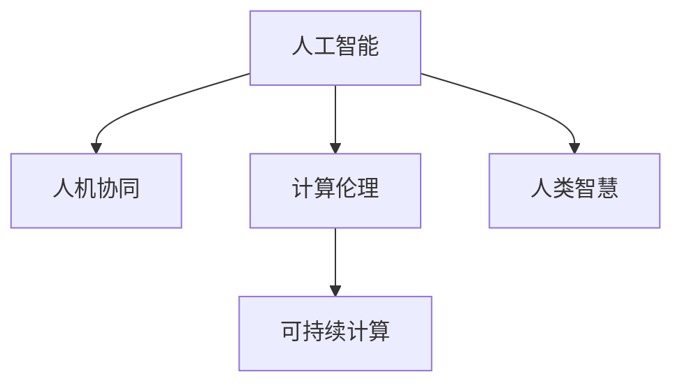

                 

# 创造更美好的世界：人类计算的终极目标

> 关键词：人工智能,人机协同,计算伦理,可持续计算,人类智慧

## 1. 背景介绍

### 1.1 问题由来
在过去几十年里，人类社会经历了巨大的技术变革，从最初的电报、电话到后来的互联网、移动互联网，信息技术已经深入到了社会的每一个角落。特别是进入21世纪后，人工智能(AI)技术的快速发展，不仅推动了经济社会的数字化、智能化转型，更是触及了人类文明的基石。

人工智能技术的核心在于模拟人类的认知过程，通过算法和数据训练模型，使得机器能够在特定任务上表现得与人类相当甚至超越。然而，随着技术的进步，AI技术的广泛应用也带来了新的挑战和伦理问题。如何在技术发展的同时，确保人工智能造福人类，创造一个更美好的世界，成为了全社会共同关注的重要课题。

### 1.2 问题核心关键点
当前，人工智能技术的应用已经覆盖了医疗、教育、交通、金融、制造、物流等多个领域。但从根本上来说，人工智能并非取代人类，而是通过计算提升人类的能力，与人类形成更紧密的协同。人机协同的核心在于使机器更好地理解人类的需求和指令，同时让人类更好地理解机器的执行过程和结果。这需要我们在算法设计、数据处理、人机交互等多个方面进行深入的探索和创新。

计算伦理是人类计算的另一个重要维度。随着AI技术的应用，我们必须思考如何保护数据隐私、确保算法透明、防止偏见和歧视等伦理问题。只有在确保技术安全和伦理的前提下，人工智能才能真正服务于人类社会，而不是造成新的不平等和冲突。

## 2. 核心概念与联系

### 2.1 核心概念概述

为了更好地理解人工智能的计算伦理和人机协同，本节将介绍几个密切相关的核心概念：

- 人工智能(Artificial Intelligence, AI)：通过算法和数据训练得到的，能够模拟人类智能的计算机程序。人工智能涵盖了机器学习、深度学习、自然语言处理、计算机视觉等多个领域。

- 人机协同(Human-Machine Collaboration)：在任务执行过程中，将人类的经验和智能与机器的高效计算能力相结合，形成1+1>2的效果。人机协同的目的是提高任务完成的质量和效率，同时增强人类的决策能力和创造性。

- 计算伦理(Computational Ethics)：在人工智能应用过程中，如何确保数据隐私、算法透明、结果公正、减少偏见和歧视等伦理问题。计算伦理是人机协同的基础和保障。

- 可持续计算(Sustainable Computing)：通过优化计算资源使用，提升计算效率，减少计算对环境的影响，实现人工智能技术的绿色发展。

- 人类智慧(Human Wisdom)：人类通过学习、推理、创造等活动形成的智能和知识，是人工智能的最终目标和核心价值。人工智能应该服务于人类的智慧发展，而不是取代人类。

这些核心概念之间的逻辑关系可以通过以下Mermaid流程图来展示：



这个流程图展示了大语言模型的核心概念及其之间的关系：

1. 人工智能通过算法和数据训练，模拟人类的认知能力。
2. 人机协同利用人工智能的高效计算能力，提升任务完成的质量和效率，同时增强人类的决策和创造能力。
3. 计算伦理确保人工智能应用过程中数据隐私、算法透明、结果公正等问题，是人机协同的基础和保障。
4. 可持续计算优化计算资源使用，提升计算效率，减少计算对环境的影响，实现绿色发展。
5. 人类智慧是人工智能的最终目标和核心价值，人工智能应该服务于人类智慧的发展，而不是取代人类。

这些概念共同构成了人工智能计算伦理和人机协同的框架，为其发展提供了方向和指引。

## 3. 核心算法原理 & 具体操作步骤
### 3.1 算法原理概述

人机协同和计算伦理的实现，依赖于一系列复杂算法的支撑。本文将从算法设计、数据处理和用户交互三个方面，详细介绍其核心算法原理和操作步骤。

### 3.2 算法步骤详解

**步骤1：算法设计**
- 确定任务目标：明确人机协同的目标，如疾病诊断、物流优化、智能客服等。
- 选择算法框架：选择适合该任务的人工智能算法框架，如机器学习、深度学习、强化学习等。
- 设计算法流程：通过算法流程图，明确算法执行的逻辑和步骤。

**步骤2：数据处理**
- 数据收集：从多个渠道获取任务相关的数据，如医疗记录、物流数据、客户反馈等。
- 数据清洗：清洗数据中的噪声、错误和不一致，提升数据质量。
- 数据标注：对数据进行标注，以便机器学习模型能够理解其含义。

**步骤3：用户交互**
- 界面设计：设计友好的用户界面，方便用户输入指令和查看输出结果。
- 交互设计：设计合适的交互逻辑，使机器能够理解和执行用户指令。
- 反馈机制：提供实时的反馈和解释，让用户了解机器的执行过程和结果。

### 3.3 算法优缺点

人机协同和计算伦理的实现，具有以下优点：
1. 提升效率：利用人工智能的高效计算能力，大幅度提升任务完成的速度和准确性。
2. 增强能力：通过数据和算法的结合，增强人类的决策和创造能力。
3. 促进创新：为人类智慧和创新提供新的工具和方法，推动社会进步。

但同时，这些方法也存在一定的局限性：
1. 依赖数据：数据的质量和数量直接决定了算法的效果，数据不足或质量不高会影响结果。
2. 算法复杂：算法设计和实现需要大量的时间和资源，复杂度较高。
3. 用户接受：用户对新技术的接受程度和适应能力各不相同，需要一定的培训和引导。
4. 伦理问题：人工智能可能引入新的伦理问题，如数据隐私、算法透明等，需要谨慎处理。

尽管存在这些局限性，但就目前而言，人机协同和计算伦理的应用已经在诸多领域取得了显著成果，成为人工智能技术落地应用的重要手段。

### 3.4 算法应用领域

人机协同和计算伦理的实现，已在医疗、教育、交通、金融、制造、物流等多个领域得到广泛应用，具体如下：

- **医疗领域**：通过人工智能算法分析医疗数据，辅助医生诊断疾病、制定治疗方案，提升医疗服务质量。例如，利用深度学习算法分析CT图像，辅助诊断肺癌、乳腺癌等疾病。
- **教育领域**：通过人工智能算法分析学生的学习数据，提供个性化的学习建议，提升教学效果。例如，利用自然语言处理算法分析学生的作业和反馈，提供针对性的指导。
- **交通领域**：通过人工智能算法优化交通流量和路线规划，提升交通效率和安全性。例如，利用强化学习算法优化交通信号灯控制，减少交通拥堵。
- **金融领域**：通过人工智能算法分析金融数据，进行风险评估和投资决策，提升金融服务质量。例如，利用机器学习算法分析交易数据，预测市场趋势。
- **制造领域**：通过人工智能算法优化生产流程和设备维护，提升生产效率和质量。例如，利用深度学习算法分析生产数据，预测设备故障，进行预防性维护。
- **物流领域**：通过人工智能算法优化物流路径和仓储管理，提升物流效率和准确性。例如，利用机器学习算法优化配送路线，减少配送成本和时间。

除了上述这些经典领域外，人机协同和计算伦理的应用还在智慧城市、农业、能源等多个新兴领域崭露头角，为人类的生产和生活中的智能化转型提供了新的可能。

## 4. 数学模型和公式 & 详细讲解 & 举例说明
### 4.1 数学模型构建

人机协同和计算伦理的实现，需要构建一系列数学模型来描述算法流程和数据处理过程。以下将以医疗领域为例，介绍一个简化的数学模型。

假设有一组患者的症状数据，记为 $X=\{x_1,x_2,...,x_n\}$，其中 $x_i$ 表示第 $i$ 个患者的症状。记 $Y$ 表示患者的疾病标签，$y_i \in \{0,1\}$，其中 $y_i=1$ 表示患者患有某种疾病，$y_i=0$ 表示患者没有患有该疾病。

我们定义一个二分类模型 $f(x;\theta)$，其中 $\theta$ 为模型的参数。模型的预测结果为 $f(x;\theta)$，即给定症状 $x$，模型预测患者患有该疾病的概率。模型的损失函数定义为交叉熵损失，记为 $\ell(Y,f(x;\theta))$，用于衡量模型预测结果与真实标签之间的差异。

我们的目标是最小化损失函数，即：

$$
\mathop{\min}_{\theta} \frac{1}{N}\sum_{i=1}^N \ell(Y_i,f(x_i;\theta))
$$

其中 $N$ 为样本数量。

### 4.2 公式推导过程

为了最小化上述损失函数，我们采用梯度下降算法对模型参数 $\theta$ 进行优化。梯度下降算法的更新公式为：

$$
\theta \leftarrow \theta - \eta \nabla_{\theta}\ell(Y,f(x;\theta))
$$

其中 $\eta$ 为学习率，$\nabla_{\theta}\ell(Y,f(x;\theta))$ 为损失函数对模型参数 $\theta$ 的梯度。

我们可以使用反向传播算法计算梯度，具体步骤如下：

1. 前向传播：将输入数据 $x$ 输入模型，计算模型的预测结果 $f(x;\theta)$。
2. 计算损失函数：将模型的预测结果与真实标签 $Y$ 计算交叉熵损失。
3. 反向传播：计算损失函数对模型参数 $\theta$ 的梯度，通过链式法则进行逐层计算。
4. 更新参数：根据梯度下降公式，更新模型参数 $\theta$。

在实践中，我们通常使用反向传播算法计算梯度，结合随机梯度下降(SGD)、Adam等优化器进行模型优化。

### 4.3 案例分析与讲解

以医疗领域为例，我们如何使用人机协同和计算伦理来提升诊断准确性？

假设我们有一组患者的症状数据，其中包含患者的血压、血糖、心率等指标。我们希望使用人工智能算法，分析这些症状数据，预测患者是否患有某种疾病。

首先，我们需要构建一个医疗诊断模型。可以使用深度学习算法，如卷积神经网络(CNN)或循环神经网络(RNN)，对症状数据进行特征提取和分类。通过反向传播算法计算梯度，最小化损失函数，得到最优的模型参数。

在模型训练完成后，我们可以将患者的症状输入模型，得到预测结果。如果预测结果表明患者可能患有某种疾病，我们可以提供进一步的诊断建议，如进一步检查、复查等。如果预测结果表明患者没有患有该疾病，我们可以告知患者该诊断结果，并建议其保持健康生活方式。

在此过程中，我们还需要考虑数据隐私、算法透明和结果公正等问题。例如，我们需要确保症状数据的匿名性，避免数据泄露。我们需要解释模型的预测逻辑，让用户了解模型是如何得出诊断结果的。我们需要确保模型不会因为性别、年龄等因素引入偏见，保证诊断结果的公平性。

## 5. 项目实践：代码实例和详细解释说明
### 5.1 开发环境搭建

在进行人机协同和计算伦理的实践前，我们需要准备好开发环境。以下是使用Python进行TensorFlow开发的环境配置流程：

1. 安装Anaconda：从官网下载并安装Anaconda，用于创建独立的Python环境。

2. 创建并激活虚拟环境：
```bash
conda create -n tf-env python=3.8 
conda activate tf-env
```

3. 安装TensorFlow：根据CUDA版本，从官网获取对应的安装命令。例如：
```bash
pip install tensorflow tensorflow-gpu
```

4. 安装Keras：Keras是一个高级神经网络API，方便我们构建和训练深度学习模型。
```bash
pip install keras
```

5. 安装各类工具包：
```bash
pip install numpy pandas scikit-learn matplotlib tqdm jupyter notebook ipython
```

完成上述步骤后，即可在`tf-env`环境中开始项目实践。

### 5.2 源代码详细实现

下面我们以医疗领域为例，给出使用TensorFlow和Keras对深度学习模型进行人机协同和计算伦理的代码实现。

首先，定义医疗诊断任务的数据处理函数：

```python
import numpy as np
from keras.utils import to_categorical
from tensorflow.keras import layers, models, optimizers

class MedicalDiagnosisDataset(Dataset):
    def __init__(self, features, labels, feature_dim):
        self.features = features
        self.labels = labels
        self.feature_dim = feature_dim
        
    def __len__(self):
        return len(self.features)
    
    def __getitem__(self, item):
        features = self.features[item]
        labels = self.labels[item]
        
        features = np.expand_dims(features, axis=-1)
        labels = to_categorical(labels)
        
        return {'features': features,
                'labels': labels}
```

然后，定义医疗诊断模型的构建和训练函数：

```python
from tensorflow.keras import layers, models, optimizers

def build_model(input_dim, output_dim):
    model = models.Sequential()
    model.add(layers.Dense(64, activation='relu', input_dim=input_dim))
    model.add(layers.Dense(32, activation='relu'))
    model.add(layers.Dense(output_dim, activation='softmax'))
    
    model.compile(loss='categorical_crossentropy', optimizer='adam', metrics=['accuracy'])
    return model

def train_model(model, dataset, epochs, batch_size):
    model.fit(dataset, epochs=epochs, batch_size=batch_size, validation_split=0.2)
```

最后，启动模型训练和评估流程：

```python
features = np.random.randn(1000, 20)  # 生成随机症状数据
labels = np.random.randint(2, size=1000)  # 生成随机标签数据

input_dim = 20
output_dim = 2

dataset = MedicalDiagnosisDataset(features, labels, input_dim)

model = build_model(input_dim, output_dim)
train_model(model, dataset, epochs=10, batch_size=32)
```

以上代码实现了使用TensorFlow和Keras构建和训练深度学习模型的流程。在实际应用中，我们还需要进行更多的数据处理、模型优化和用户交互设计，以实现完整的人机协同和计算伦理应用。

### 5.3 代码解读与分析

让我们再详细解读一下关键代码的实现细节：

**MedicalDiagnosisDataset类**：
- `__init__`方法：初始化症状数据、标签数据和特征维度。
- `__len__`方法：返回数据集的样本数量。
- `__getitem__`方法：对单个样本进行处理，将症状数据转化为模型需要的输入格式，将标签数据转化为one-hot编码。

**模型构建函数**：
- 定义了三个全连接层，其中前两层使用ReLU激活函数，最后一层使用softmax激活函数，输出疾病的概率分布。
- 使用Keras的Sequential模型将这三个层串联起来。
- 使用categorical_crossentropy作为损失函数，adam优化器进行优化，accuracy作为评价指标。

**训练函数**：
- 使用Keras的fit方法进行模型训练，设置训练轮数和批次大小。
- 使用validation_split参数，设置验证集的占比。

**启动训练流程**：
- 生成随机的症状数据和标签数据。
- 定义输入维度和输出维度。
- 创建数据集对象，并传入训练数据。
- 调用模型构建函数，创建深度学习模型。
- 调用训练函数，进行模型训练和验证。

可以看出，TensorFlow和Keras的强大封装使得模型的构建和训练变得简单高效。开发者可以将更多精力放在数据处理、模型改进等高层逻辑上，而不必过多关注底层的实现细节。

当然，工业级的系统实现还需考虑更多因素，如模型的保存和部署、超参数的自动搜索、更灵活的模型结构设计等。但核心的算法和流程基本与此类似。

## 6. 实际应用场景
### 6.1 医疗诊断系统

基于人机协同和计算伦理的医疗诊断系统，可以大幅提升医疗服务的质量和效率。传统医疗诊断往往依赖医生个人的经验和技术，存在误差和偏见。而使用人机协同技术，可以结合机器的高效计算和医生的专业判断，提升诊断的准确性和一致性。

在技术实现上，我们可以收集大量的医疗数据，包括患者的症状、病历、影像等。在此基础上，对预训练模型进行微调，使其能够识别出常见的疾病特征，生成诊断建议。对于复杂或罕见的疾病，可以接入专家知识库，通过人机协同的方式，由医生和机器共同完成诊断。这样不仅提高了诊断的准确性，还减少了医生的工作负担。

### 6.2 教育辅助系统

教育辅助系统可以利用人机协同和计算伦理技术，提升学生的学习效果和教师的教学质量。传统的教育系统往往缺乏个性化和实时性，难以适应学生的个体差异和学习进度。而使用人机协同技术，可以结合学生的学习数据，提供个性化的学习建议和资源推荐。

在技术实现上，我们可以收集学生的作业、测试、反馈等数据，分析其学习情况和兴趣点。在此基础上，对预训练模型进行微调，使其能够预测学生的学习需求和成绩变化。对于学生的疑惑和错误，可以实时提供解释和指导，帮助其更好地掌握知识点。这样不仅提高了学生的学习效果，还增强了教师的教学能力。

### 6.3 智能客服系统

智能客服系统可以利用人机协同和计算伦理技术，提升客户服务质量和用户体验。传统的客服系统往往依赖人工客服，存在响应慢、质量不稳定等问题。而使用人机协同技术，可以结合机器的自然语言理解和生成能力，提供24x7不间断的客户服务。

在技术实现上，我们可以收集客户的咨询数据，包括问题类型、解决时间、客户满意度等。在此基础上，对预训练模型进行微调，使其能够理解客户的问题和意图，提供准确的回答和解决方案。对于复杂的咨询，可以接入专家知识库，通过人机协同的方式，由客户和机器共同解决问题。这样不仅提高了客服的响应速度和质量，还减少了企业的人力和成本。

### 6.4 未来应用展望

随着人机协同和计算伦理技术的不断发展，其在更多领域的应用前景广阔。未来，我们将在以下几个方面进行探索和创新：

1. **多模态融合**：结合视觉、听觉、触觉等多模态信息，提升人机协同的感知能力。例如，在医疗领域，结合患者的面容、声音、动作等信息，提高诊断的准确性。
2. **知识增强**：结合符号化的先验知识，如知识图谱、规则库等，增强模型的推理和解释能力。例如，在医疗领域，结合医学知识库，提高诊断的深度和广度。
3. **伦理设计**：设计符合伦理标准的算法和机制，确保数据隐私、算法透明、结果公正等。例如，在医疗领域，确保患者数据的匿名性和隐私保护。
4. **绿色计算**：优化计算资源使用，提升计算效率，减少计算对环境的影响。例如，在交通领域，优化交通信号灯控制，减少交通拥堵和排放。
5. **社会责任**：增强计算伦理技术的社会责任感，关注社会影响和伦理问题。例如，在教育领域，确保技术应用不会加剧教育不平等。

总之，人机协同和计算伦理技术将在未来得到更广泛的应用，推动社会进步和人类智慧的提升。但同时也需要关注其伦理问题，确保技术应用符合人类价值观和伦理道德。

## 7. 工具和资源推荐
### 7.1 学习资源推荐

为了帮助开发者系统掌握人机协同和计算伦理技术的理论基础和实践技巧，这里推荐一些优质的学习资源：

1. 《人工智能伦理与治理》课程：由斯坦福大学开设的伦理和治理课程，从理论到实践，系统介绍了AI技术的伦理问题。
2. 《人机协同与计算伦理》书籍：全面介绍了人机协同和计算伦理技术的理论基础和应用案例，适合初学者和研究者。
3. 《深度学习基础》课程：斯坦福大学开设的深度学习入门课程，系统讲解了深度学习的算法原理和实现方法。
4. TensorFlow官方文档：TensorFlow的详细文档和示例代码，是深度学习实践的重要参考资料。
5. Keras官方文档：Keras的详细文档和示例代码，是深度学习开发的重要工具。

通过对这些资源的学习实践，相信你一定能够快速掌握人机协同和计算伦理技术的精髓，并用于解决实际的AI问题。

### 7.2 开发工具推荐

高效的开发离不开优秀的工具支持。以下是几款用于人机协同和计算伦理开发常用的工具：

1. TensorFlow：由Google主导开发的深度学习框架，生产部署方便，适合大规模工程应用。支持多模态融合和知识增强技术。
2. Keras：高层次的深度学习API，方便我们构建和训练深度学习模型。
3. Scikit-learn：Python的机器学习库，包含多种经典机器学习算法和数据处理工具。
4. Pandas：Python的数据处理库，方便我们进行数据清洗和特征提取。
5. NumPy：Python的科学计算库，方便我们进行数值计算和矩阵运算。

合理利用这些工具，可以显著提升人机协同和计算伦理技术的开发效率，加快创新迭代的步伐。

### 7.3 相关论文推荐

人机协同和计算伦理技术的不断发展，依赖于学界的持续研究。以下是几篇奠基性的相关论文，推荐阅读：

1. "Deep Learning for AI and Healthcare"：展示了深度学习在医疗领域的广泛应用，包括诊断、治疗、药物研发等。
2. "Human-Machine Collaboration in Healthcare: A Survey"：总结了人机协同在医疗领域的最新研究成果，包括系统架构、技术挑战和未来展望。
3. "Ethical Considerations in AI: A Survey of Ethical Issues, Theories, and Applications"：探讨了AI技术面临的伦理问题，如数据隐私、算法透明、结果公正等。
4. "Sustainable Computing: Principles, Methods, and Applications"：介绍了可持续计算的概念和实现方法，强调计算的绿色发展和资源优化。
5. "AI and Ethics: Tackling the Ethical Challenges of AI"：系统讨论了AI技术的伦理问题，提出了解决方案和未来方向。

这些论文代表了大语言模型微调技术的发展脉络。通过学习这些前沿成果，可以帮助研究者把握学科前进方向，激发更多的创新灵感。

## 8. 总结：未来发展趋势与挑战
### 8.1 总结

本文对人机协同和计算伦理技术的理论基础和实践技巧进行了全面系统的介绍。首先阐述了人机协同和计算伦理技术的研究背景和意义，明确了人机协同和计算伦理技术在提升任务完成质量和效率、增强人类决策和创造能力方面的重要价值。其次，从算法设计、数据处理和用户交互三个方面，详细讲解了人机协同和计算伦理的算法原理和操作步骤，给出了代码实例和详细解释。同时，本文还广泛探讨了人机协同和计算伦理技术在医疗、教育、交通、金融、制造等多个领域的应用前景，展示了技术的广泛潜力。此外，本文精选了人机协同和计算伦理技术的各类学习资源，力求为读者提供全方位的技术指引。

通过本文的系统梳理，可以看到，人机协同和计算伦理技术在技术发展和社会应用方面都具有广阔的前景。这些技术的应用，不仅提升了任务的完成质量和效率，还增强了人类的决策和创造能力，具有深远的社会价值。未来，随着技术的进一步演进，人机协同和计算伦理技术必将在更多领域得到广泛应用，推动社会进步和人类智慧的提升。

### 8.2 未来发展趋势

展望未来，人机协同和计算伦理技术将呈现以下几个发展趋势：

1. **多模态融合**：结合视觉、听觉、触觉等多模态信息，提升人机协同的感知能力。例如，在医疗领域，结合患者的面容、声音、动作等信息，提高诊断的准确性。
2. **知识增强**：结合符号化的先验知识，如知识图谱、规则库等，增强模型的推理和解释能力。例如，在医疗领域，结合医学知识库，提高诊断的深度和广度。
3. **伦理设计**：设计符合伦理标准的算法和机制，确保数据隐私、算法透明、结果公正等。例如，在医疗领域，确保患者数据的匿名性和隐私保护。
4. **绿色计算**：优化计算资源使用，提升计算效率，减少计算对环境的影响。例如，在交通领域，优化交通信号灯控制，减少交通拥堵和排放。
5. **社会责任**：增强计算伦理技术的社会责任感，关注社会影响和伦理问题。例如，在教育领域，确保技术应用不会加剧教育不平等。

以上趋势凸显了人机协同和计算伦理技术的广阔前景。这些方向的探索发展，必将进一步提升任务的完成质量和效率，增强人类的决策和创造能力，推动社会进步和人类智慧的提升。

### 8.3 面临的挑战

尽管人机协同和计算伦理技术已经取得了瞩目成就，但在迈向更加智能化、普适化应用的过程中，它仍面临着诸多挑战：

1. **数据质量和数量**：数据的质量和数量直接决定了算法的有效性，数据不足或质量不高会影响结果。
2. **算法复杂度**：算法设计和实现需要大量的时间和资源，复杂度较高。
3. **用户接受度**：用户对新技术的接受程度和适应能力各不相同，需要一定的培训和引导。
4. **伦理问题**：人工智能可能引入新的伦理问题，如数据隐私、算法透明、结果公正等，需要谨慎处理。
5. **社会影响**：技术应用可能带来新的社会问题，如就业替代、隐私泄露等，需要关注和防范。

尽管存在这些挑战，但人机协同和计算伦理技术在社会中的应用前景广阔。我们需要积极应对并寻求突破，才能让人机协同技术真正服务于人类社会，推动社会进步和人类智慧的发展。

### 8.4 研究展望

面对人机协同和计算伦理技术面临的挑战，未来的研究需要在以下几个方面寻求新的突破：

1. **数据增强技术**：通过数据增强技术，如生成对抗网络、数据合成等，提升数据质量和数量。
2. **模型优化算法**：研究更加高效、简洁的模型优化算法，降低算法复杂度，提高开发效率。
3. **用户友好设计**：设计更加友好、易于理解的用户界面和交互逻辑，提升用户接受度和适应能力。
4. **伦理算法设计**：设计符合伦理标准的算法和机制，确保数据隐私、算法透明、结果公正等。
5. **社会影响评估**：研究技术应用的社会影响评估方法，确保技术应用符合社会价值和伦理道德。

这些研究方向的探索，必将引领人机协同和计算伦理技术迈向更高的台阶，为构建安全、可靠、可解释、可控的智能系统铺平道路。面向未来，人机协同和计算伦理技术还需要与其他人工智能技术进行更深入的融合，如知识表示、因果推理、强化学习等，多路径协同发力，共同推动自然语言理解和智能交互系统的进步。只有勇于创新、敢于突破，才能不断拓展计算伦理技术的边界，让智能技术更好地造福人类社会。

## 9. 附录：常见问题与解答

**Q1：人机协同和计算伦理技术是否适用于所有领域？**

A: 人机协同和计算伦理技术在大多数领域都能取得不错的效果，特别是在数据驱动的任务中。但对于一些特定领域，如心理学、社会学等，数据量和质量可能受到限制，需要结合其他方法进行优化。

**Q2：在构建人机协同系统时，如何确保数据隐私和算法透明？**

A: 确保数据隐私和算法透明是构建人机协同系统的关键。以下是一些常用方法：
1. 数据匿名化：在数据预处理阶段，对数据进行去标识化处理，确保数据隐私。
2. 算法透明：设计透明的算法和模型结构，让用户了解算法的内部机制。
3. 审计和监控：建立系统的审计和监控机制，实时监控算法的运行过程和结果。
4. 用户参与：在设计过程中，邀请用户参与评估和反馈，确保系统的公正性和透明性。

**Q3：人机协同和计算伦理技术在落地应用时需要注意哪些问题？**

A: 在将人机协同和计算伦理技术转化为实际应用时，需要注意以下问题：
1. 数据准备：确保数据的完整性和质量，避免因数据问题影响结果。
2. 算法优化：优化算法的性能和效率，确保系统能够高效运行。
3. 用户培训：对用户进行培训和引导，使其能够充分利用系统的功能。
4. 系统测试：进行系统的全面测试，确保系统的稳定性和可靠性。
5. 伦理审查：建立伦理审查机制，确保系统的应用符合伦理道德。

**Q4：人机协同和计算伦理技术的未来发展方向有哪些？**

A: 人机协同和计算伦理技术的未来发展方向包括：
1. 多模态融合：结合视觉、听觉、触觉等多模态信息，提升人机协同的感知能力。
2. 知识增强：结合符号化的先验知识，如知识图谱、规则库等，增强模型的推理和解释能力。
3. 伦理设计：设计符合伦理标准的算法和机制，确保数据隐私、算法透明、结果公正等。
4. 绿色计算：优化计算资源使用，提升计算效率，减少计算对环境的影响。
5. 社会责任：增强计算伦理技术的社会责任感，关注社会影响和伦理问题。

**Q5：如何评估人机协同和计算伦理技术的社会影响？**

A: 评估人机协同和计算伦理技术的社会影响，需要从以下几个方面进行考虑：
1. 数据隐私：评估系统对数据隐私的保护措施和效果。
2. 算法透明：评估算法的透明性和可解释性。
3. 结果公正：评估系统的公正性和无偏见性。
4. 社会效益：评估系统对社会带来的正面影响和负面影响。
5. 伦理道德：评估系统的伦理道德标准和行为规范。

通过系统地评估和改进，可以确保人机协同和计算伦理技术的社会应用符合人类价值观和伦理道德，推动社会进步和人类智慧的提升。

---

作者：禅与计算机程序设计艺术 / Zen and the Art of Computer Programming

