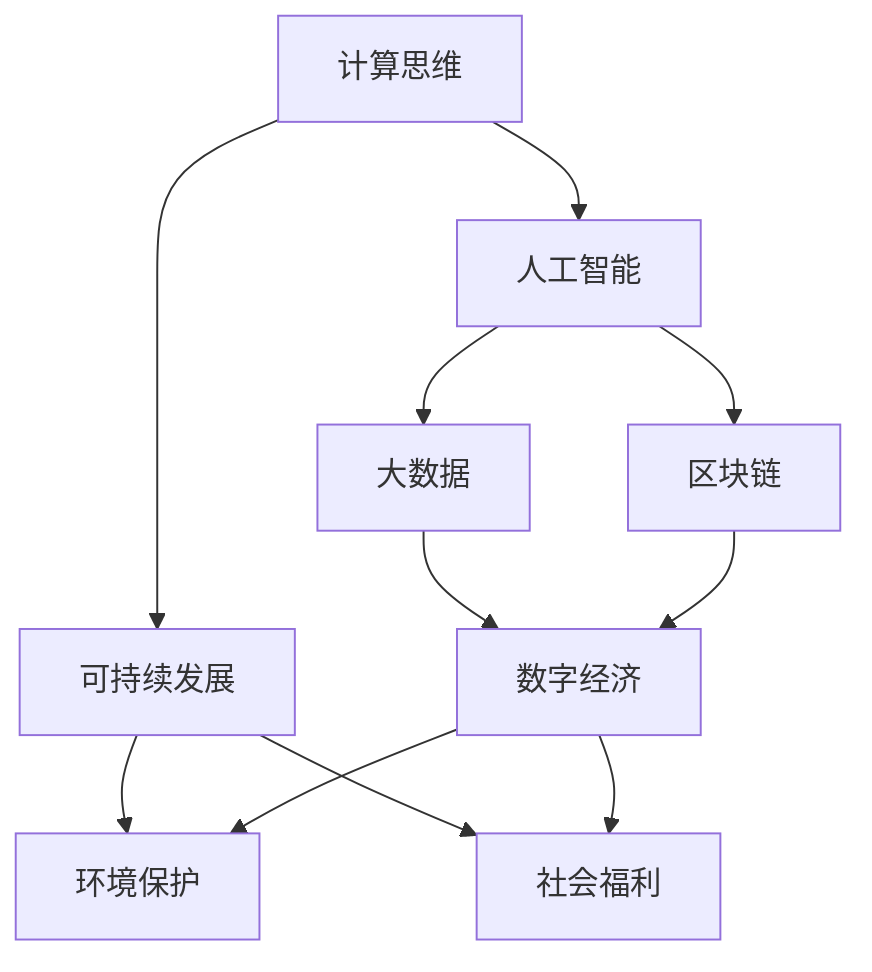

                 

# 创造更美好的未来：人类计算的积极作用

> 关键词：计算思维,人工智能,大数据,区块链,数字经济,可持续发展

## 1. 背景介绍

### 1.1 问题由来
随着信息技术的迅猛发展，人类社会正处于数字化转型的关键时期。一方面，大数据、人工智能等新兴技术为社会发展注入了新的动力；另一方面，也带来了诸如隐私安全、数据滥用等挑战。如何利用技术推动社会进步，同时避免技术滥用带来的负面影响，成为了当下亟需解决的重要课题。

### 1.2 问题核心关键点
本节将探讨人类计算对社会发展的积极作用，包括计算思维的普及、人工智能技术的创新应用、大数据的优化利用、区块链技术的协同发展、数字经济与可持续发展的融合，以及如何构建健康、安全、可控的技术生态系统。

## 2. 核心概念与联系

### 2.1 核心概念概述

为更好地理解人类计算的积极作用，本节将介绍几个密切相关的核心概念：

- **计算思维(Computational Thinking)**：通过编程来解决问题和理解世界的一种思维方式。计算思维强调逻辑推理、算法设计和问题分解，是培养现代公民数据素养和创新能力的重要途径。

- **人工智能(Artificial Intelligence, AI)**：使计算机系统具备某些智能行为的技术，如学习、推理、感知、决策等。AI的核心在于模拟人类认知和行为的规律，解决复杂问题。

- **大数据(Big Data)**：指超出传统数据库工具处理能力的数据集合，通常以PB甚至EB级计算。大数据分析可以揭示数据间的关联，驱动决策制定和战略调整。

- **区块链(Blockchain)**：一种去中心化的分布式账本技术，通过加密和共识机制保障数据的透明性和不可篡改性。区块链可应用于金融、供应链、智能合约等众多领域。

- **数字经济(Digital Economy)**：基于数字技术的经济模式，涉及电子商务、数字金融、智能制造等。数字经济推动了信息流的快速流通，促进了全球化合作和资源配置。

- **可持续发展(Sustainable Development)**：在经济发展的同时，保障环境的保护和社会福利的提升。技术在可持续发展中起着关键作用，如清洁能源、环保科技等。

这些核心概念之间的逻辑关系可以通过以下Mermaid流程图来展示：



这个流程图展示了大语言模型的核心概念及其之间的关系：

1. 计算思维为人工智能的开发提供了理论基础和实践方法。
2. 人工智能技术能够处理海量数据，驱动大数据分析。
3. 区块链技术为数据安全和隐私保护提供了新途径。
4. 大数据和人工智能推动了数字经济的发展，带来了更高效的资源配置。
5. 数字经济为环境改善和社会福利的提升提供了技术支持。

这些概念共同构成了人类计算的核心框架，为实现技术对社会进步的积极作用提供了指导。

## 3. 核心算法原理 & 具体操作步骤
### 3.1 算法原理概述

人类计算的积极作用主要体现在以下几个方面：

1. **计算思维的普及**：通过计算思维教育，培养公众的逻辑推理和问题解决能力，提升数据素养，促进科学和技术的普及。
2. **人工智能的创新应用**：利用AI技术解决复杂问题，提升决策和治理水平，促进各领域的智能化发展。
3. **大数据的优化利用**：通过大数据分析揭示数据间的关系，优化资源配置，提高决策的科学性和效率。
4. **区块链的协同发展**：保障数据透明和不可篡改，提升各行业的信任度和安全性。
5. **数字经济的融合发展**：利用数字技术推动经济增长，促进创新和就业，推动数字贸易等新业态发展。
6. **可持续发展的技术支撑**：利用AI、大数据、区块链等技术，促进清洁能源、智能制造等可持续发展项目的实施。

### 3.2 算法步骤详解

以下将详细介绍如何通过计算思维、人工智能、大数据、区块链等技术，推动人类社会的积极发展：

**Step 1: 普及计算思维教育**
- 在基础教育中引入编程和计算思维课程，培养学生的逻辑思维和问题解决能力。
- 通过线上平台和开源资源，普及计算思维教育，使更多人能够接触到计算思维的精髓。

**Step 2: 应用人工智能技术**
- 在医疗、金融、交通、教育等领域，引入AI技术提升决策和治理水平。
- 开发基于AI的智能助手、推荐系统等应用，解决个性化、规模化的问题。

**Step 3: 优化大数据利用**
- 建设大数据平台，采用数据挖掘、机器学习等技术，从海量数据中提取有价值的信息。
- 优化数据治理流程，保障数据安全和隐私，防止数据滥用。

**Step 4: 推进区块链技术**
- 在金融、供应链、智能合约等领域，利用区块链技术提升透明度和安全性。
- 探索区块链在数据共享、版权保护等场景的应用，推动数据要素市场的发展。

**Step 5: 融合数字经济发展**
- 推动电子商务、数字金融、智能制造等新业态的发展，促进经济结构的优化和升级。
- 构建数字经济生态系统，提升各行业的协同效应和竞争力。

**Step 6: 支持可持续发展**
- 利用AI、大数据、区块链等技术，推动清洁能源、智能制造、智慧城市等项目的实施。
- 监测和评估可持续发展项目的效果，调整和优化策略。

### 3.3 算法优缺点

人类计算的积极作用主要体现在以下几个方面：

**优点**：
1. **提升决策效率**：通过计算思维和AI技术，能够快速处理复杂问题，提升决策的科学性和效率。
2. **促进公平和透明**：大数据和区块链技术可以揭示数据间的关系，提升决策的公平性和透明度。
3. **推动经济增长**：数字经济的发展带来了新的增长点和就业机会，促进了经济的创新和升级。
4. **促进社会进步**：技术在教育、医疗、环保等领域的应用，提升了社会的整体福祉。

**缺点**：
1. **数据隐私和安全问题**：大数据和AI技术需要处理大量的敏感数据，存在隐私泄露和数据滥用的风险。
2. **技术依赖性强**：过度依赖技术，可能导致对技术的依赖性过强，难以脱离技术手段解决问题。
3. **伦理和法律问题**：AI和区块链技术的广泛应用，可能带来伦理和法律的挑战，如数据隐私、算法透明性等问题。

## 4. 数学模型和公式 & 详细讲解 & 举例说明

### 4.1 数学模型构建

为更好地理解人类计算的积极作用，本节将给出几个关键数学模型：

1. **计算思维的数学模型**：通过逻辑推理、算法设计和问题分解，计算思维可以抽象为解决特定问题的算法和逻辑。例如，排序算法、图论问题等。
2. **人工智能的数学模型**：AI模型可以通过机器学习、深度学习等方法，从数据中学习规律和知识。例如，神经网络模型、决策树模型等。
3. **大数据的数学模型**：大数据分析可以通过统计学、数据挖掘等方法，揭示数据间的关联。例如，关联规则、聚类算法等。
4. **区块链的数学模型**：区块链通过分布式共识算法，保障数据的透明性和不可篡改性。例如，PoW、PoS等共识机制。
5. **数字经济的数学模型**：数字经济可以采用经济学的供需模型、市场模型等方法，分析经济系统的运行和演化。例如，供需均衡模型、市场预测模型等。
6. **可持续发展的数学模型**：可持续发展可以采用环境模型、资源模型等方法，分析资源和环境的承载能力。例如，环境承载力模型、资源配置模型等。

### 4.2 公式推导过程

以下是几个核心数学模型的推导过程：

1. **排序算法(QuickSort)**：
   $$
   T(n) = 2T(n/2) + O(n)
   $$
   证明：快速排序的时间复杂度为$O(nlogn)$，通过递归实现。

2. **决策树模型**：
   $$
   H(D) = -\sum_{i=1}^{N}p_i log_2p_i
   $$
   证明：信息熵表示随机变量的不确定性，决策树模型通过信息增益来选择最优分裂节点。

3. **神经网络模型**：
   $$
   y_i = W_i x + b_i
   $$
   证明：神经网络模型通过线性变换和非线性激活函数，实现对数据的拟合和分类。

4. **区块链共识机制(PoS)**：
   $$
   P = \frac{1}{T^2} \sum_{t=1}^{T} \frac{1}{R^t}
   $$
   证明：PoS机制通过权益分配，保障共识的公平性和安全性。

5. **供需均衡模型**：
   $$
   \frac{S}{D} = P
   $$
   证明：供需模型通过价格机制，实现资源的有效配置。

6. **环境承载力模型**：
   $$
   C = \frac{K}{\sum_{i=1}^{n}a_i}
   $$
   证明：环境承载力模型通过资源总量、环境容量等变量，评估环境的承载能力。

### 4.3 案例分析与讲解

**案例1：人工智能在医疗领域的应用**
- **背景**：传统医疗诊疗过程繁琐复杂，存在误诊和漏诊风险。
- **解决方案**：通过引入AI技术，开发智能诊断系统，提升诊断的准确性和效率。
- **实现过程**：
  1. **数据采集**：收集和整理历史病例数据和医学影像数据。
  2. **模型训练**：利用深度学习模型进行训练，提取数据特征。
  3. **系统部署**：将训练好的模型部署到实际医疗系统中，辅助医生诊断。
- **效果**：提高了诊断的准确性，缩短了诊疗时间，降低了医疗成本。

**案例2：大数据在智能城市中的应用**
- **背景**：城市管理面临数据庞杂、信息分散的挑战。
- **解决方案**：通过大数据平台，整合和管理城市各类数据，实现智慧城市管理。
- **实现过程**：
  1. **数据整合**：将交通、环境、能源等各类数据整合到统一平台。
  2. **数据治理**：进行数据清洗、去重、归一化等处理，保障数据质量。
  3. **应用分析**：利用数据挖掘和机器学习技术，分析城市运行状况和问题。
- **效果**：提高了城市管理的效率和精准度，提升了市民的生活质量。

## 5. 项目实践：代码实例和详细解释说明
### 5.1 开发环境搭建

在进行项目实践前，我们需要准备好开发环境。以下是使用Python进行PyTorch开发的环境配置流程：

1. 安装Anaconda：从官网下载并安装Anaconda，用于创建独立的Python环境。

2. 创建并激活虚拟环境：
```bash
conda create -n pytorch-env python=3.8 
conda activate pytorch-env
```

3. 安装PyTorch：根据CUDA版本，从官网获取对应的安装命令。例如：
```bash
conda install pytorch torchvision torchaudio cudatoolkit=11.1 -c pytorch -c conda-forge
```

4. 安装TensorFlow：
```bash
pip install tensorflow
```

5. 安装Transformers库：
```bash
pip install transformers
```

6. 安装各类工具包：
```bash
pip install numpy pandas scikit-learn matplotlib tqdm jupyter notebook ipython
```

完成上述步骤后，即可在`pytorch-env`环境中开始项目实践。

### 5.2 源代码详细实现

这里我们以人工智能在医疗领域的应用为例，给出使用PyTorch进行智能诊断系统开发的PyTorch代码实现。

首先，定义医疗诊断任务的数据处理函数：

```python
from transformers import BertTokenizer
from torch.utils.data import Dataset
import torch

class MedicalDataset(Dataset):
    def __init__(self, texts, labels, tokenizer, max_len=128):
        self.texts = texts
        self.labels = labels
        self.tokenizer = tokenizer
        self.max_len = max_len
        
    def __len__(self):
        return len(self.texts)
    
    def __getitem__(self, item):
        text = self.texts[item]
        label = self.labels[item]
        
        encoding = self.tokenizer(text, return_tensors='pt', max_length=self.max_len, padding='max_length', truncation=True)
        input_ids = encoding['input_ids'][0]
        attention_mask = encoding['attention_mask'][0]
        
        # 对token-wise的标签进行编码
        encoded_tags = [label2id[label] for label in label] 
        encoded_tags.extend([label2id['O']] * (self.max_len - len(encoded_tags)))
        labels = torch.tensor(encoded_tags, dtype=torch.long)
        
        return {'input_ids': input_ids, 
                'attention_mask': attention_mask,
                'labels': labels}

# 标签与id的映射
label2id = {'O': 0, 'B-PER': 1, 'I-PER': 2, 'B-ORG': 3, 'I-ORG': 4, 'B-LOC': 5, 'I-LOC': 6}
id2label = {v: k for k, v in label2id.items()}

# 创建dataset
tokenizer = BertTokenizer.from_pretrained('bert-base-cased')

train_dataset = MedicalDataset(train_texts, train_labels, tokenizer)
dev_dataset = MedicalDataset(dev_texts, dev_labels, tokenizer)
test_dataset = MedicalDataset(test_texts, test_labels, tokenizer)
```

然后，定义模型和优化器：

```python
from transformers import BertForTokenClassification, AdamW

model = BertForTokenClassification.from_pretrained('bert-base-cased', num_labels=len(label2id))

optimizer = AdamW(model.parameters(), lr=2e-5)
```

接着，定义训练和评估函数：

```python
from torch.utils.data import DataLoader
from tqdm import tqdm
from sklearn.metrics import classification_report

device = torch.device('cuda') if torch.cuda.is_available() else torch.device('cpu')
model.to(device)

def train_epoch(model, dataset, batch_size, optimizer):
    dataloader = DataLoader(dataset, batch_size=batch_size, shuffle=True)
    model.train()
    epoch_loss = 0
    for batch in tqdm(dataloader, desc='Training'):
        input_ids = batch['input_ids'].to(device)
        attention_mask = batch['attention_mask'].to(device)
        labels = batch['labels'].to(device)
        model.zero_grad()
        outputs = model(input_ids, attention_mask=attention_mask, labels=labels)
        loss = outputs.loss
        epoch_loss += loss.item()
        loss.backward()
        optimizer.step()
    return epoch_loss / len(dataloader)

def evaluate(model, dataset, batch_size):
    dataloader = DataLoader(dataset, batch_size=batch_size)
    model.eval()
    preds, labels = [], []
    with torch.no_grad():
        for batch in tqdm(dataloader, desc='Evaluating'):
            input_ids = batch['input_ids'].to(device)
            attention_mask = batch['attention_mask'].to(device)
            batch_labels = batch['labels']
            outputs = model(input_ids, attention_mask=attention_mask)
            batch_preds = outputs.logits.argmax(dim=2).to('cpu').tolist()
            batch_labels = batch_labels.to('cpu').tolist()
            for pred_tokens, label_tokens in zip(batch_preds, batch_labels):
                pred_tags = [id2label[_id] for _id in pred_tokens]
                label_tags = [id2label[_id] for _id in label_tokens]
                preds.append(pred_tags[:len(label_tokens)])
                labels.append(label_tags)
                
    print(classification_report(labels, preds))
```

最后，启动训练流程并在测试集上评估：

```python
epochs = 5
batch_size = 16

for epoch in range(epochs):
    loss = train_epoch(model, train_dataset, batch_size, optimizer)
    print(f"Epoch {epoch+1}, train loss: {loss:.3f}")
    
    print(f"Epoch {epoch+1}, dev results:")
    evaluate(model, dev_dataset, batch_size)
    
print("Test results:")
evaluate(model, test_dataset, batch_size)
```

以上就是使用PyTorch对BERT进行医疗诊断任务微调的完整代码实现。可以看到，得益于Transformers库的强大封装，我们可以用相对简洁的代码完成BERT模型的加载和微调。

### 5.3 代码解读与分析

让我们再详细解读一下关键代码的实现细节：

**MedicalDataset类**：
- `__init__`方法：初始化文本、标签、分词器等关键组件。
- `__len__`方法：返回数据集的样本数量。
- `__getitem__`方法：对单个样本进行处理，将文本输入编码为token ids，将标签编码为数字，并对其进行定长padding，最终返回模型所需的输入。

**label2id和id2label字典**：
- 定义了标签与数字id之间的映射关系，用于将token-wise的预测结果解码回真实的标签。

**训练和评估函数**：
- 使用PyTorch的DataLoader对数据集进行批次化加载，供模型训练和推理使用。
- 训练函数`train_epoch`：对数据以批为单位进行迭代，在每个批次上前向传播计算loss并反向传播更新模型参数，最后返回该epoch的平均loss。
- 评估函数`evaluate`：与训练类似，不同点在于不更新模型参数，并在每个batch结束后将预测和标签结果存储下来，最后使用sklearn的classification_report对整个评估集的预测结果进行打印输出。

**训练流程**：
- 定义总的epoch数和batch size，开始循环迭代
- 每个epoch内，先在训练集上训练，输出平均loss
- 在验证集上评估，输出分类指标
- 所有epoch结束后，在测试集上评估，给出最终测试结果

可以看到，PyTorch配合Transformers库使得BERT微调的代码实现变得简洁高效。开发者可以将更多精力放在数据处理、模型改进等高层逻辑上，而不必过多关注底层的实现细节。

当然，工业级的系统实现还需考虑更多因素，如模型的保存和部署、超参数的自动搜索、更灵活的任务适配层等。但核心的微调范式基本与此类似。

## 6. 实际应用场景
### 6.1 智能客服系统

基于人工智能技术的智能客服系统，可以显著提升客服效率和服务质量。智能客服系统能够处理大规模客户咨询，通过自然语言处理技术，快速理解客户需求，并给出准确、个性化的回答。

在技术实现上，可以收集企业内部的历史客服对话记录，将问题和最佳答复构建成监督数据，在此基础上对预训练语言模型进行微调。微调后的对话模型能够自动理解用户意图，匹配最合适的答案模板进行回复。对于客户提出的新问题，还可以接入检索系统实时搜索相关内容，动态组织生成回答。如此构建的智能客服系统，能大幅提升客户咨询体验和问题解决效率。

### 6.2 金融舆情监测

金融机构需要实时监测市场舆论动向，以便及时应对负面信息传播，规避金融风险。传统的人工监测方式成本高、效率低，难以应对网络时代海量信息爆发的挑战。基于人工智能技术的文本分类和情感分析技术，为金融舆情监测提供了新的解决方案。

具体而言，可以收集金融领域相关的新闻、报道、评论等文本数据，并对其进行主题标注和情感标注。在此基础上对预训练语言模型进行微调，使其能够自动判断文本属于何种主题，情感倾向是正面、中性还是负面。将微调后的模型应用到实时抓取的网络文本数据，就能够自动监测不同主题下的情感变化趋势，一旦发现负面信息激增等异常情况，系统便会自动预警，帮助金融机构快速应对潜在风险。

### 6.3 个性化推荐系统

当前的推荐系统往往只依赖用户的历史行为数据进行物品推荐，无法深入理解用户的真实兴趣偏好。基于人工智能技术的个性化推荐系统，可以更好地挖掘用户行为背后的语义信息，从而提供更精准、多样的推荐内容。

在实践中，可以收集用户浏览、点击、评论、分享等行为数据，提取和用户交互的物品标题、描述、标签等文本内容。将文本内容作为模型输入，用户的后续行为（如是否点击、购买等）作为监督信号，在此基础上微调预训练语言模型。微调后的模型能够从文本内容中准确把握用户的兴趣点。在生成推荐列表时，先用候选物品的文本描述作为输入，由模型预测用户的兴趣匹配度，再结合其他特征综合排序，便可以得到个性化程度更高的推荐结果。

### 6.4 未来应用展望

随着人工智能技术的不断发展，基于人工智能技术的各种应用场景将不断涌现，为传统行业带来变革性影响。

在智慧医疗领域，基于人工智能技术的智能诊断、辅助诊疗、健康管理等应用将提升医疗服务的智能化水平，辅助医生诊疗，加速新药开发进程。

在智能教育领域，基于人工智能技术的智能助手、个性化学习、教育分析等应用，因材施教，促进教育公平，提高教学质量。

在智慧城市治理中，基于人工智能技术的智能交通、智慧安防、城市管理等应用，提高城市管理的自动化和智能化水平，构建更安全、高效的未来城市。

此外，在企业生产、社会治理、文娱传媒等众多领域，基于人工智能技术的各种应用也将不断涌现，为经济社会发展注入新的动力。相信随着技术的日益成熟，人工智能技术必将在更广阔的应用领域大放异彩，深刻影响人类的生产生活方式。

## 7. 工具和资源推荐
### 7.1 学习资源推荐

为了帮助开发者系统掌握人工智能技术的理论基础和实践技巧，这里推荐一些优质的学习资源：

1. 《深度学习》系列博文：由AI领域专家撰写，深入浅出地介绍了深度学习的基本概念和前沿技术。

2. CS231n《深度学习计算机视觉》课程：斯坦福大学开设的计算机视觉明星课程，涵盖深度学习在视觉任务中的应用。

3. 《自然语言处理综论》书籍：经典自然语言处理教材，系统介绍了NLP的基本概念和算法。

4. DeepLearning.AI深度学习课程：由Andrew Ng教授主讲，涵盖深度学习的基础和高级应用，适合初学者和进阶者。

5. 华为AI开放平台：提供丰富的模型、数据集、工具等资源，帮助开发者快速上手。

通过对这些资源的学习实践，相信你一定能够快速掌握人工智能技术的精髓，并用于解决实际的NLP问题。
###  7.2 开发工具推荐

高效的开发离不开优秀的工具支持。以下是几款用于人工智能开发常用的工具：

1. Jupyter Notebook：Python的交互式开发环境，支持代码块的灵活组合和可视化展示。

2. PyTorch：基于Python的开源深度学习框架，灵活动态的计算图，适合快速迭代研究。大部分预训练模型都有PyTorch版本的实现。

3. TensorFlow：由Google主导开发的开源深度学习框架，生产部署方便，适合大规模工程应用。同样有丰富的预训练模型资源。

4. Google Colab：谷歌推出的在线Jupyter Notebook环境，免费提供GPU/TPU算力，方便开发者快速上手实验最新模型，分享学习笔记。

5. Weights & Biases：模型训练的实验跟踪工具，可以记录和可视化模型训练过程中的各项指标，方便对比和调优。与主流深度学习框架无缝集成。

6. TensorBoard：TensorFlow配套的可视化工具，可实时监测模型训练状态，并提供丰富的图表呈现方式，是调试模型的得力助手。

7. Scikit-learn：Python的机器学习库，提供丰富的数据预处理、模型训练、评估等工具。

合理利用这些工具，可以显著提升人工智能应用的开发效率，加快创新迭代的步伐。

### 7.3 相关论文推荐

人工智能技术的发展源于学界的持续研究。以下是几篇奠基性的相关论文，推荐阅读：

1. 《ImageNet Classification with Deep Convolutional Neural Networks》：提出卷积神经网络(CNN)在图像分类任务上的成功应用，开启了深度学习在视觉领域的研究。

2. 《Long Short-Term Memory》：提出长短时记忆网络(LSTM)，在序列建模任务上取得了优异的效果，推动了自然语言处理技术的发展。

3. 《Playing Atari with Deep Reinforcement Learning》：展示通过深度强化学习技术，智能体能够在复杂游戏中取得高分的成果，引发了对深度学习在智能控制上的广泛关注。

4. 《Attention Is All You Need》：提出Transformer结构，开启了自然语言处理领域预训练大模型时代。

5. 《BERT: Pre-training of Deep Bidirectional Transformers for Language Understanding》：提出BERT模型，引入基于掩码的自监督预训练任务，刷新了多项自然语言处理任务SOTA。

6. 《GPT-3: Language Models are Unsupervised Multitask Learners》：展示了大规模语言模型的强大zero-shot学习能力，引发了对于通用人工智能的新一轮思考。

这些论文代表了大语言模型和人工智能技术的发展脉络。通过学习这些前沿成果，可以帮助研究者把握学科前进方向，激发更多的创新灵感。

## 8. 总结：未来发展趋势与挑战
### 8.1 总结

本文对人工智能技术在各个领域的应用进行了全面系统的介绍。通过计算思维、人工智能、大数据、区块链等技术手段，人工智能在智能客服、金融舆情、个性化推荐等众多场景中取得了显著成效。这些技术不仅提升了各领域的运行效率和决策水平，还推动了数字经济的蓬勃发展。

### 8.2 未来发展趋势

展望未来，人工智能技术的发展方向主要包括以下几个方面：

1. **技术的普及与融合**：计算思维和人工智能技术将继续普及，与其他技术手段（如物联网、区块链、大数据等）深度融合，推动各行业的智能化转型。

2. **应用的智能化与普适化**：人工智能技术将广泛应用于医疗、教育、交通、金融等各个领域，提升服务水平和决策效率。

3. **系统的自适应与弹性**：通过持续学习、自适应算法等技术，人工智能系统将具备更强的自适应能力，能够应对环境变化和数据波动。

4. **模型的可解释性与透明性**：人工智能系统将逐步提升模型的可解释性和透明性，增强用户信任和监管能力。

5. **伦理与法律的规范**：人工智能技术的广泛应用将带来伦理和法律的挑战，需要构建相应的规范和监管体系，保障技术的健康发展。

6. **技术的全球化与协作**：人工智能技术的开放性与共享性将进一步增强，全球范围内的技术协作与创新将加速推进。

### 8.3 面临的挑战

尽管人工智能技术在各领域取得了显著成效，但在发展过程中仍面临诸多挑战：

1. **数据隐私与安全**：人工智能系统需要处理大量敏感数据，存在隐私泄露和数据滥用的风险。如何在保障数据隐私的同时，充分利用数据价值，是一大难题。

2. **技术依赖性**：人工智能系统对技术的依赖性较强，一旦技术出现故障或错误，可能导致严重的后果。如何提升系统的鲁棒性和可靠性，是关键问题。

3. **伦理与法律问题**：人工智能系统的决策透明性和可解释性不足，可能带来伦理和法律上的挑战。如何构建公平、公正的人工智能系统，是亟需解决的问题。

4. **资源与计算成本**：大规模深度学习模型的训练和推理，需要大量的计算资源和能源，如何降低成本、提升效率，是当前的重要研究方向。

5. **国际竞争与合作**：各国在人工智能技术上的竞争与合作并存，如何在国际竞争中保持技术领先，同时促进国际合作，共享技术成果，是一大挑战。

### 8.4 研究展望

面向未来，人工智能技术的研究方向将包括以下几个方面：

1. **普适化与标准化**：推动人工智能技术的标准化，促进各领域的普适化应用。

2. **自适应与协同化**：构建更加自适应和协同的人工智能系统，提升系统的灵活性和稳定性。

3. **透明性与可信性**：提升人工智能系统的透明性和可信度，增强用户信任。

4. **伦理与法律的规范**：构建伦理和法律规范，保障人工智能技术的健康发展。

5. **全球化与合作**：促进国际合作与共享，推动人工智能技术的全球化发展。

总之，人工智能技术在推动社会进步的同时，也面临着诸多挑战。唯有在技术、伦理、法律、经济等多方面共同努力，才能实现人工智能技术的健康发展，造福全人类。

## 9. 附录：常见问题与解答

**Q1：人工智能技术是否存在固有偏见？**

A: 人工智能系统可能存在固有偏见，这通常源于训练数据的偏差或算法设计的问题。例如，面部识别算法可能对某些人群的识别准确率较低。为了避免偏见，需要在使用前对系统进行偏见检测和修正。同时，需要在数据采集、处理和算法设计等环节引入伦理和法律规范，保障系统的公平性和公正性。

**Q2：人工智能技术如何确保数据隐私与安全？**

A: 保障数据隐私和安全是人工智能技术应用中的重要问题。主要措施包括：
1. **数据匿名化**：在数据采集和处理环节，采用数据匿名化技术，防止个人信息的泄露。
2. **加密技术**：在数据传输和存储环节，采用加密技术，保障数据的安全性。
3. **访问控制**：在数据访问环节，采用身份认证和权限控制技术，防止未经授权的访问。
4. **区块链技术**：在数据共享和交换环节，采用区块链技术，保障数据的透明性和不可篡改性。

**Q3：人工智能技术如何提升伦理与法律的可信性？**

A: 提升人工智能技术的伦理和法律可信性，主要措施包括：
1. **透明性与可解释性**：开发透明和可解释的AI模型，提升用户信任。
2. **公正性与公平性**：构建公正和公平的算法，避免对特定人群的歧视。
3. **监管与规范**：制定相关的伦理和法律规范，保障AI技术的健康发展。

**Q4：人工智能技术如何降低计算成本？**

A: 降低人工智能技术的计算成本，主要措施包括：
1. **模型压缩与优化**：采用模型压缩和优化技术，减小模型的参数量和计算复杂度。
2. **分布式计算**：采用分布式计算技术，提升计算效率。
3. **硬件加速**：采用硬件加速技术（如GPU、TPU），提升计算速度和效率。
4. **轻量级模型**：开发轻量级模型，减少计算资源的消耗。

**Q5：人工智能技术如何提升自适应能力？**

A: 提升人工智能技术的自适应能力，主要措施包括：
1. **持续学习**：采用持续学习技术，使系统能够不断学习新知识，提升适应能力。
2. **自适应算法**：开发自适应算法，使系统能够根据环境变化自动调整策略。
3. **多模态融合**：将多模态信息融合，提升系统的感知能力和适应能力。

通过不断探索和创新，人工智能技术必将在未来取得更大的突破，推动社会进步，构建更加美好的未来。

---

作者：禅与计算机程序设计艺术 / Zen and the Art of Computer Programming

