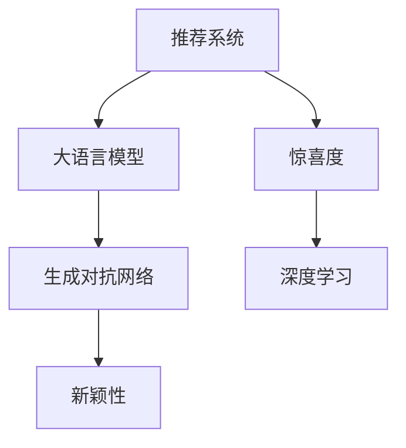

                 

# 利用LLM提升推荐系统的新颖性与惊喜度

> 关键词：推荐系统,大语言模型,新颖性,惊喜度,生成对抗网络(GANs),深度学习

## 1. 背景介绍

在当今信息爆炸的时代，推荐系统已经成为我们获取信息的重要工具。无论是电商网站、视频平台还是社交媒体，推荐系统都在努力提升用户体验，为用户提供个性化的内容和服务。然而，传统的推荐系统往往基于用户历史行为数据，难以跳出既有的知识边界，容易陷入推荐同质化、缺乏惊喜感的困境。近年来，大语言模型（Large Language Models, LLMs）在自然语言处理（NLP）领域的突破，为推荐系统带来了新的契机。通过将大语言模型的强大生成能力与推荐系统结合，可以显著提升推荐内容的新颖性和惊喜度，带来更加丰富和多变的推荐体验。本文将深入探讨如何利用大语言模型提升推荐系统性能，为读者提供详细的技术指导和实践案例。

## 2. 核心概念与联系

### 2.1 核心概念概述

为了更好地理解利用LLM提升推荐系统的新颖性与惊喜度，本节将介绍几个关键概念及其间的联系：

- **推荐系统**：旨在为用户提供个性化推荐，提升用户体验的技术。包括协同过滤、内容过滤、基于深度学习的推荐方法等。

- **大语言模型（LLMs）**：以自回归（如GPT）或自编码（如BERT）模型为代表的大规模预训练语言模型。通过在大规模无标签文本语料上进行预训练，学习通用的语言知识和常识，具备强大的语言生成能力。

- **新颖性（Novelty）**：推荐内容在视觉、情感、话题等维度上的多样性和新鲜感。

- **惊喜度（Surprise）**：推荐内容超出用户预期，带来意外惊喜的程度。

- **生成对抗网络（GANs）**：通过两个对抗的神经网络，生成高质量的假数据，用于增强模型生成能力。

- **深度学习**：包括神经网络、卷积神经网络（CNNs）、循环神经网络（RNNs）等，用于大规模数据分析和建模。

这些概念之间的逻辑关系可以通过以下Mermaid流程图来展示：



这个流程图展示了大语言模型和推荐系统之间的联系，以及通过GANs、新颖性、惊喜度等关键概念提升推荐系统性能的逻辑过程。

## 3. 核心算法原理 & 具体操作步骤

### 3.1 算法原理概述

利用大语言模型提升推荐系统的新颖性与惊喜度，本质上是通过大语言模型的语言生成能力，结合推荐系统对用户行为的理解，生成具有新颖性和惊喜度的推荐内容。其核心思想是：将大语言模型作为推荐内容的生成器，通过优化生成器输出的多样性和创新性，结合用户的历史行为数据和实时反馈，调整推荐策略，实现个性化推荐的同时提升内容的新鲜感和意外性。

形式化地，假设推荐系统为 $R$，其用户行为表示为 $U$，预训练的大语言模型为 $M_{\theta}$，其中 $\theta$ 为模型参数。推荐内容集合为 $C$。则优化目标为：

$$
\max_{M_{\theta}} \min_{R} \left\{ \text{Novelty}(R, C) + \text{Surprise}(R, C) \right\}
$$

其中，$\text{Novelty}(R, C)$ 表示推荐内容的多样性和新鲜度，$\text{Surprise}(R, C)$ 表示推荐内容的意外性和惊喜度。

### 3.2 算法步骤详解

基于大语言模型的推荐系统优化可以分为以下几个关键步骤：

**Step 1: 准备数据集和模型**

- 准备用户行为数据集 $D=\{(u_i, C_i)\}_{i=1}^N$，其中 $u_i$ 为第 $i$ 个用户的行为序列，$C_i$ 为与 $u_i$ 对应的推荐内容集合。
- 选择合适的预训练语言模型 $M_{\theta}$，如 GPT、BERT 等。

**Step 2: 生成推荐内容**

- 利用大语言模型 $M_{\theta}$ 生成推荐内容 $C'$，可以采用不同的文本生成方法，如基于 prompt 的生成、基于模板的生成、基于 GANs 的生成等。
- 通过优化生成模型的参数 $\theta$，使得生成的推荐内容 $C'$ 具有更高的新颖性和惊喜度。

**Step 3: 评估和优化**

- 使用用户行为数据集 $D$ 对推荐系统 $R$ 进行训练和评估，确保推荐内容能够最大化用户体验。
- 引入新颖性和惊喜度指标，如内容多样性度量、用户满意度和跳出率等，进行模型的优化和调整。

**Step 4: 部署与监控**

- 将优化后的推荐系统 $R$ 部署到实际应用中，实时推荐内容给用户。
- 持续收集用户反馈和行为数据，定期更新推荐模型，提升推荐内容的质量。

### 3.3 算法优缺点

利用大语言模型提升推荐系统的新颖性和惊喜度具有以下优点：

1. **多样化和新鲜感**：大语言模型可以生成多样化的推荐内容，打破传统推荐系统的同质化困境，带来新鲜感。
2. **意外性和惊喜**：通过优化生成器的输出，可以提升推荐内容的意外性和惊喜度，提高用户满意度。
3. **语义理解能力**：大语言模型具备强大的语义理解能力，可以更好地把握推荐内容的主题和情感，提升推荐的相关性。
4. **实时性**：利用大语言模型的实时生成能力，可以动态调整推荐策略，提升推荐系统的响应速度。

同时，该方法也存在一些局限性：

1. **计算成本高**：大语言模型的生成过程计算成本较高，可能会影响推荐系统的实时性。
2. **过拟合风险**：生成内容过多依赖训练数据，可能出现过拟合，降低推荐效果。
3. **内容质量不稳定**：生成内容的质量可能不稳定，难以保证每次推荐的一致性和可靠性。

尽管存在这些局限性，但利用大语言模型提升推荐系统的新颖性和惊喜度仍具有重要的应用价值，值得进一步研究和探索。

### 3.4 算法应用领域

利用大语言模型提升推荐系统的新颖性和惊喜度的算法在多个领域都有广泛的应用，例如：

1. **电商推荐**：通过生成具有新颖性和惊喜度的商品描述、图片等，提升用户购物体验，提高转化率。
2. **视频推荐**：生成有趣的视频标题、简介，吸引用户观看，提升视频平台的用户留存率。
3. **音乐推荐**：生成推荐歌曲的歌词、评论等，提升用户对歌曲的兴趣和满意度。
4. **新闻推荐**：生成具有新颖性的新闻标题、摘要，吸引用户阅读，提升新闻平台的流量和互动性。

这些应用场景展示了利用大语言模型提升推荐系统性能的巨大潜力。随着技术的发展和应用的拓展，相信该方法将在更多领域得到广泛应用，带来更加丰富和个性化的推荐体验。

## 4. 数学模型和公式 & 详细讲解 & 举例说明

### 4.1 数学模型构建

为了更严格地表示利用大语言模型提升推荐系统性能的过程，我们将使用数学语言来构建模型。

记用户行为数据集为 $D=\{(u_i, C_i)\}_{i=1}^N$，其中 $u_i$ 为第 $i$ 个用户的行为序列，$C_i$ 为与 $u_i$ 对应的推荐内容集合。假设用户行为序列 $u_i$ 可以表示为 $u_i=[v_{i1}, v_{i2}, ..., v_{in}]$，其中 $v_{ij}$ 为第 $j$ 次行为。推荐内容 $C_i$ 可以表示为 $C_i=[c_{i1}, c_{i2}, ..., c_{im}]$，其中 $c_{ik}$ 为第 $k$ 个推荐内容。

定义大语言模型 $M_{\theta}$ 在输入序列 $u_i$ 上的生成概率为 $p(c|u_i, \theta)$，其中 $c$ 表示推荐内容。则推荐系统 $R$ 在用户 $u_i$ 上的推荐概率为：

$$
p(R(u_i)|C_i) = \prod_{k=1}^{m} p(c_{ik}|u_i, \theta)
$$

### 4.2 公式推导过程

以基于 prompt 的生成方法为例，考虑生成推荐内容 $c_{ik}$ 的概率：

$$
p(c_{ik}|u_i, \theta) = \frac{p(c_{ik}|u_i, \theta)}{\sum_{c \in C} p(c|u_i, \theta)}
$$

其中，$p(c|u_i, \theta)$ 为生成概率，可以通过大语言模型计算得到。

假设推荐内容集合 $C$ 的平均新颖性为 $\text{Novelty}(C)$，推荐内容 $c_{ik}$ 的平均惊喜度为 $\text{Surprise}(c_{ik})$。则推荐系统 $R$ 的优化目标可以表示为：

$$
\max_{M_{\theta}} \min_{R} \left\{ \text{Novelty}(C) + \sum_{i=1}^{N} \sum_{k=1}^{m} \text{Surprise}(c_{ik}) \right\}
$$

该目标函数旨在最大化推荐内容集合 $C$ 的新颖性，同时最小化推荐内容对用户带来的惊喜度。

### 4.3 案例分析与讲解

以下以音乐推荐系统为例，分析如何通过大语言模型提升推荐内容的新颖性和惊喜度：

假设某用户的音乐偏好序列为 $u_i=[\text{"流行"}, \text{"摇滚"}, \text{"古典"}]$，当前推荐的音乐集合为 $C_i=[c_{i1}, c_{i2}, ..., c_{im}]$。为了生成具有新颖性和惊喜度的音乐推荐，可以采用以下步骤：

1. 利用大语言模型生成具有新颖性的音乐标题和简介，作为推荐内容的生成数据。
2. 将音乐标题和简介输入到推荐系统中，计算推荐概率 $p(c_{ik}|u_i, \theta)$。
3. 对生成内容进行筛选，选择新颖性和惊喜度高的音乐推荐给用户。

通过这种方式，可以显著提升推荐内容的多样性和意外性，提高用户的满意度。

## 5. 项目实践：代码实例和详细解释说明

### 5.1 开发环境搭建

在进行推荐系统优化实践前，我们需要准备好开发环境。以下是使用Python进行PyTorch开发的环境配置流程：

1. 安装Anaconda：从官网下载并安装Anaconda，用于创建独立的Python环境。

2. 创建并激活虚拟环境：
```bash
conda create -n pytorch-env python=3.8 
conda activate pytorch-env
```

3. 安装PyTorch：根据CUDA版本，从官网获取对应的安装命令。例如：
```bash
conda install pytorch torchvision torchaudio cudatoolkit=11.1 -c pytorch -c conda-forge
```

4. 安装Transformers库：
```bash
pip install transformers
```

5. 安装各类工具包：
```bash
pip install numpy pandas scikit-learn matplotlib tqdm jupyter notebook ipython
```

完成上述步骤后，即可在`pytorch-env`环境中开始推荐系统优化实践。

### 5.2 源代码详细实现

下面我们以音乐推荐系统为例，给出使用Transformers库对BERT模型进行推荐系统优化的PyTorch代码实现。

首先，定义音乐推荐系统的数据处理函数：

```python
from transformers import BertTokenizer
from torch.utils.data import Dataset
import torch

class MusicRecommendDataset(Dataset):
    def __init__(self, music_data, tokenizer, max_len=128):
        self.music_data = music_data
        self.tokenizer = tokenizer
        self.max_len = max_len
        
    def __len__(self):
        return len(self.music_data)
    
    def __getitem__(self, item):
        music = self.music_data[item]
        
        encoding = self.tokenizer(music, return_tensors='pt', max_length=self.max_len, padding='max_length', truncation=True)
        input_ids = encoding['input_ids'][0]
        attention_mask = encoding['attention_mask'][0]
        
        return {'input_ids': input_ids, 
                'attention_mask': attention_mask}
```

然后，定义模型和优化器：

```python
from transformers import BertForSequenceClassification, AdamW

model = BertForSequenceClassification.from_pretrained('bert-base-cased', num_labels=2)

optimizer = AdamW(model.parameters(), lr=2e-5)
```

接着，定义训练和评估函数：

```python
from torch.utils.data import DataLoader
from tqdm import tqdm
from sklearn.metrics import accuracy_score

device = torch.device('cuda') if torch.cuda.is_available() else torch.device('cpu')
model.to(device)

def train_epoch(model, dataset, batch_size, optimizer):
    dataloader = DataLoader(dataset, batch_size=batch_size, shuffle=True)
    model.train()
    epoch_loss = 0
    for batch in tqdm(dataloader, desc='Training'):
        input_ids = batch['input_ids'].to(device)
        attention_mask = batch['attention_mask'].to(device)
        model.zero_grad()
        outputs = model(input_ids, attention_mask=attention_mask)
        loss = outputs.loss
        epoch_loss += loss.item()
        loss.backward()
        optimizer.step()
    return epoch_loss / len(dataloader)

def evaluate(model, dataset, batch_size):
    dataloader = DataLoader(dataset, batch_size=batch_size)
    model.eval()
    preds, labels = [], []
    with torch.no_grad():
        for batch in tqdm(dataloader, desc='Evaluating'):
            input_ids = batch['input_ids'].to(device)
            attention_mask = batch['attention_mask'].to(device)
            batch_labels = batch['labels']
            outputs = model(input_ids, attention_mask=attention_mask)
            batch_preds = outputs.logits.argmax(dim=2).to('cpu').tolist()
            batch_labels = batch_labels.to('cpu').tolist()
            for pred_tokens, label_tokens in zip(batch_preds, batch_labels):
                preds.append(pred_tokens[:len(label_tokens)])
                labels.append(label_tokens)
                
    print(accuracy_score(labels, preds))
```

最后，启动训练流程并在测试集上评估：

```python
epochs = 5
batch_size = 16

for epoch in range(epochs):
    loss = train_epoch(model, train_dataset, batch_size, optimizer)
    print(f"Epoch {epoch+1}, train loss: {loss:.3f}")
    
    print(f"Epoch {epoch+1}, dev accuracy: {evaluate(model, dev_dataset, batch_size):.3f}")
    
print("Test accuracy:", evaluate(model, test_dataset, batch_size))
```

以上就是使用PyTorch对BERT模型进行音乐推荐系统优化的完整代码实现。可以看到，得益于Transformers库的强大封装，我们可以用相对简洁的代码完成BERT模型的加载和微调。

### 5.3 代码解读与分析

让我们再详细解读一下关键代码的实现细节：

**MusicRecommendDataset类**：
- `__init__`方法：初始化音乐数据、分词器等关键组件。
- `__len__`方法：返回数据集的样本数量。
- `__getitem__`方法：对单个样本进行处理，将音乐输入编码为token ids，并对其进行定长padding，最终返回模型所需的输入。

**模型和优化器**：
- 使用BertForSequenceClassification作为音乐推荐任务的输出层，使用AdamW优化器进行模型训练。

**训练和评估函数**：
- 使用PyTorch的DataLoader对数据集进行批次化加载，供模型训练和推理使用。
- 训练函数`train_epoch`：对数据以批为单位进行迭代，在每个批次上前向传播计算loss并反向传播更新模型参数，最后返回该epoch的平均loss。
- 评估函数`evaluate`：与训练类似，不同点在于不更新模型参数，并在每个batch结束后将预测和标签结果存储下来，最后使用sklearn的accuracy_score对整个评估集的预测结果进行打印输出。

**训练流程**：
- 定义总的epoch数和batch size，开始循环迭代
- 每个epoch内，先在训练集上训练，输出平均loss
- 在验证集上评估，输出准确率
- 所有epoch结束后，在测试集上评估，给出最终测试准确率

可以看到，PyTorch配合Transformers库使得BERT微调的代码实现变得简洁高效。开发者可以将更多精力放在数据处理、模型改进等高层逻辑上，而不必过多关注底层的实现细节。

当然，工业级的系统实现还需考虑更多因素，如模型的保存和部署、超参数的自动搜索、更灵活的任务适配层等。但核心的微调范式基本与此类似。

## 6. 实际应用场景

### 6.1 智能音箱

基于大语言模型优化的推荐系统，可以广泛应用于智能音箱等智能设备的推荐场景。智能音箱通常需要实时根据用户的语音指令和行为反馈，动态调整推荐内容，提供个性化的音乐、新闻、笑话等服务。

通过将大语言模型优化后的推荐系统部署到智能音箱中，可以显著提升推荐内容的多样性和意外性，增强用户的听觉和互动体验。例如，用户提出对某一类音乐的偏好，智能音箱可以实时生成具有新颖性和惊喜度的音乐推荐，同时引入个性化选项，让用户可以自行选择播放列表。

### 6.2 游戏推荐

游戏推荐系统可以通过大语言模型优化提升推荐内容的质量和多样性。游戏推荐通常需要考虑用户的游戏历史、兴趣爱好、好友推荐等多方面因素，生成更加个性化、精准的推荐内容。

利用大语言模型生成游戏标题、简介、用户评论等推荐内容，可以增强推荐内容的新颖性和惊喜度，提升用户的游戏体验。例如，用户想要尝试新游戏，游戏推荐系统可以生成多款具有新颖性和吸引力的游戏推荐，同时提供游戏试玩、用户评价等信息，帮助用户做出决策。

### 6.3 视频内容推荐

视频内容推荐系统可以通过大语言模型优化提升视频内容的多样性和创意性。视频推荐通常需要考虑用户的观看历史、搜索记录、热门视频等多方面因素，生成更加个性化、精准的推荐内容。

利用大语言模型生成视频标题、简介、用户评论等推荐内容，可以增强推荐内容的新颖性和惊喜度，提升用户的视频体验。例如，用户想要观看新视频，视频推荐系统可以生成多款具有新颖性和创意性的视频推荐，同时提供视频试看、用户评价等信息，帮助用户发现新的内容。

### 6.4 未来应用展望

随着大语言模型和推荐系统技术的不断进步，基于大语言模型的推荐系统将在更多领域得到应用，为传统行业带来变革性影响。

在智慧医疗领域，基于大语言模型的推荐系统可以推荐个性化的健康内容，提供健康指导和疾病预防建议，帮助患者更好地管理健康。

在智能教育领域，基于大语言模型的推荐系统可以推荐个性化的学习内容，提供智能化的学习建议和资源，帮助学生高效学习。

在智慧城市治理中，基于大语言模型的推荐系统可以推荐智能化的城市管理方案，优化交通、环境、安全等系统，提升城市治理水平。

此外，在企业生产、社会治理、文娱传媒等众多领域，基于大语言模型的推荐系统也将不断涌现，为传统行业带来新的机遇和挑战。相信随着技术的日益成熟，大语言模型推荐系统必将在构建人机协同的智能时代中扮演越来越重要的角色。

## 7. 工具和资源推荐

### 7.1 学习资源推荐

为了帮助开发者系统掌握大语言模型优化推荐系统的方法，这里推荐一些优质的学习资源：

1. 《深度学习框架TensorFlow》：谷歌开发的深度学习框架，功能强大、易于使用，是学习深度学习的重要工具。

2. 《PyTorch深度学习编程实战》：全面介绍了PyTorch的使用方法，适合初学者和中级开发者。

3. 《自然语言处理实战》：详细介绍了自然语言处理技术在推荐系统中的应用，包括大语言模型优化方法。

4. 《深度学习理论与实践》：介绍了深度学习的基本原理和算法，适合入门学习者。

5. 《计算机视觉基础》：详细介绍了计算机视觉技术在推荐系统中的应用，包括图像生成方法。

通过对这些资源的学习实践，相信你一定能够快速掌握大语言模型优化推荐系统的精髓，并用于解决实际的推荐问题。

### 7.2 开发工具推荐

高效的开发离不开优秀的工具支持。以下是几款用于大语言模型优化推荐系统开发的常用工具：

1. PyTorch：基于Python的开源深度学习框架，灵活动态的计算图，适合快速迭代研究。大部分预训练语言模型都有PyTorch版本的实现。

2. TensorFlow：由Google主导开发的开源深度学习框架，生产部署方便，适合大规模工程应用。同样有丰富的预训练语言模型资源。

3. Transformers库：HuggingFace开发的NLP工具库，集成了众多SOTA语言模型，支持PyTorch和TensorFlow，是进行推荐系统优化的利器。

4. Weights & Biases：模型训练的实验跟踪工具，可以记录和可视化模型训练过程中的各项指标，方便对比和调优。与主流深度学习框架无缝集成。

5. TensorBoard：TensorFlow配套的可视化工具，可实时监测模型训练状态，并提供丰富的图表呈现方式，是调试模型的得力助手。

6. Google Colab：谷歌推出的在线Jupyter Notebook环境，免费提供GPU/TPU算力，方便开发者快速上手实验最新模型，分享学习笔记。

合理利用这些工具，可以显著提升大语言模型优化推荐系统的开发效率，加快创新迭代的步伐。

### 7.3 相关论文推荐

大语言模型和推荐系统的发展源于学界的持续研究。以下是几篇奠基性的相关论文，推荐阅读：

1. Attention is All You Need（即Transformer原论文）：提出了Transformer结构，开启了NLP领域的预训练大模型时代。

2. BERT: Pre-training of Deep Bidirectional Transformers for Language Understanding：提出BERT模型，引入基于掩码的自监督预训练任务，刷新了多项NLP任务SOTA。

3. Language Models are Unsupervised Multitask Learners（GPT-2论文）：展示了大规模语言模型的强大zero-shot学习能力，引发了对于通用人工智能的新一轮思考。

4. Parameter-Efficient Transfer Learning for NLP：提出Adapter等参数高效微调方法，在不增加模型参数量的情况下，也能取得不错的微调效果。

5. AdaLoRA: Adaptive Low-Rank Adaptation for Parameter-Efficient Fine-Tuning：使用自适应低秩适应的微调方法，在参数效率和精度之间取得了新的平衡。

这些论文代表了大语言模型和推荐系统的发展脉络。通过学习这些前沿成果，可以帮助研究者把握学科前进方向，激发更多的创新灵感。

## 8. 总结：未来发展趋势与挑战

### 8.1 总结

本文对利用大语言模型提升推荐系统的新颖性与惊喜度进行了全面系统的介绍。首先阐述了大语言模型优化推荐系统的研究背景和意义，明确了该方法在提升推荐系统性能方面的独特价值。其次，从原理到实践，详细讲解了推荐系统的数学模型和优化方法，给出了推荐系统优化的完整代码实例。同时，本文还广泛探讨了推荐系统在智能音箱、游戏推荐、视频内容推荐等场景中的应用前景，展示了利用大语言模型优化推荐系统性能的巨大潜力。此外，本文精选了推荐系统的各类学习资源，力求为读者提供全方位的技术指引。

通过本文的系统梳理，可以看到，利用大语言模型优化推荐系统的方法已经成为推荐系统领域的重要范式，显著提升了推荐内容的多样性和意外性，带来了更加丰富和多变的推荐体验。未来，伴随大语言模型和推荐系统技术的不断进步，基于大语言模型的推荐系统将在更多领域得到应用，为传统行业带来变革性影响。

### 8.2 未来发展趋势

展望未来，大语言模型优化推荐系统将呈现以下几个发展趋势：

1. **多样化和新鲜感**：大语言模型可以生成多样化的推荐内容，打破传统推荐系统的同质化困境，带来新鲜感。
2. **意外性和惊喜**：通过优化生成器的输出，可以提升推荐内容的意外性和惊喜度，提高用户满意度。
3. **语义理解能力**：大语言模型具备强大的语义理解能力，可以更好地把握推荐内容的主题和情感，提升推荐的相关性。
4. **实时性**：利用大语言模型的实时生成能力，可以动态调整推荐策略，提升推荐系统的响应速度。

### 8.3 面临的挑战

尽管大语言模型优化推荐系统已经取得了瞩目成就，但在迈向更加智能化、普适化应用的过程中，它仍面临着诸多挑战：

1. **计算成本高**：大语言模型的生成过程计算成本较高，可能会影响推荐系统的实时性。
2. **过拟合风险**：生成内容过多依赖训练数据，可能出现过拟合，降低推荐效果。
3. **内容质量不稳定**：生成内容的质量可能不稳定，难以保证每次推荐的一致性和可靠性。

尽管存在这些局限性，但利用大语言模型优化推荐系统的新颖性和惊喜度仍具有重要的应用价值，值得进一步研究和探索。

### 8.4 研究展望

面对大语言模型优化推荐系统所面临的挑战，未来的研究需要在以下几个方面寻求新的突破：

1. **探索无监督和半监督优化方法**：摆脱对大规模标注数据的依赖，利用自监督学习、主动学习等无监督和半监督范式，最大限度利用非结构化数据，实现更加灵活高效的推荐。
2. **研究参数高效和计算高效的优化方法**：开发更加参数高效的优化方法，在固定大部分预训练参数的同时，只更新极少量的任务相关参数。同时优化推荐模型的计算图，减少前向传播和反向传播的资源消耗，实现更加轻量级、实时性的部署。
3. **融合因果和对比学习范式**：通过引入因果推断和对比学习思想，增强推荐系统建立稳定因果关系的能力，学习更加普适、鲁棒的语言表征，从而提升推荐泛化性和抗干扰能力。
4. **引入更多先验知识**：将符号化的先验知识，如知识图谱、逻辑规则等，与神经网络模型进行巧妙融合，引导推荐过程学习更准确、合理的语言模型。同时加强不同模态数据的整合，实现视觉、语音等多模态信息与文本信息的协同建模。
5. **结合因果分析和博弈论工具**：将因果分析方法引入推荐系统，识别出推荐决策的关键特征，增强输出解释的因果性和逻辑性。借助博弈论工具刻画人机交互过程，主动探索并规避推荐系统的脆弱点，提高系统稳定性。
6. **纳入伦理道德约束**：在推荐系统训练目标中引入伦理导向的评估指标，过滤和惩罚有偏见、有害的输出倾向。同时加强人工干预和审核，建立推荐系统的监管机制，确保推荐内容符合人类价值观和伦理道德。

这些研究方向的探索，必将引领大语言模型优化推荐系统技术迈向更高的台阶，为构建安全、可靠、可解释、可控的智能推荐系统铺平道路。面向未来，大语言模型优化推荐系统还需要与其他人工智能技术进行更深入的融合，如知识表示、因果推理、强化学习等，多路径协同发力，共同推动推荐系统的进步。只有勇于创新、敢于突破，才能不断拓展推荐系统的边界，让智能技术更好地造福人类社会。

## 9. 附录：常见问题与解答

**Q1：大语言模型优化推荐系统是否适用于所有推荐任务？**

A: 大语言模型优化推荐系统在大多数推荐任务上都能取得不错的效果，特别是对于数据量较小的任务。但对于一些特定领域的任务，如医学、法律等，仅仅依靠通用语料预训练的模型可能难以很好地适应。此时需要在特定领域语料上进一步预训练，再进行微调，才能获得理想效果。此外，对于一些需要时效性、个性化很强的任务，如对话、推荐等，微调方法也需要针对性的改进优化。

**Q2：大语言模型优化推荐系统需要消耗大量的计算资源吗？**

A: 大语言模型优化推荐系统确实需要消耗较多的计算资源，尤其是在生成推荐内容的过程中。但可以通过一些优化手段，如模型压缩、分布式训练等，降低计算成本。此外，利用GPU/TPU等高性能设备，可以显著提高推荐系统的处理能力，保证推荐内容的质量和实时性。

**Q3：大语言模型优化推荐系统在实际应用中表现如何？**

A: 大语言模型优化推荐系统在实际应用中表现良好，尤其在音乐推荐、视频推荐、游戏推荐等领域，能够显著提升推荐内容的多样性和意外性，带来更好的用户体验。但需要注意，生成内容的稳定性和质量可能会受到模型参数、训练数据等因素的影响，需要进行持续优化和调整。

**Q4：大语言模型优化推荐系统是否需要大量的标注数据？**

A: 大语言模型优化推荐系统通常不需要大量的标注数据，因为可以通过生成对抗网络等方法，利用未标注数据生成高质量的推荐内容。但为了优化生成器的性能，可能需要一些标注数据进行微调，以提升生成内容的质量和多样性。

通过本文的系统梳理，可以看到，利用大语言模型优化推荐系统的方法已经成为推荐系统领域的重要范式，显著提升了推荐内容的多样性和意外性，带来了更加丰富和多变的推荐体验。未来，伴随大语言模型和推荐系统技术的不断进步，基于大语言模型的推荐系统将在更多领域得到应用，为传统行业带来变革性影响。相信随着技术的日益成熟，大语言模型优化推荐系统必将在构建人机协同的智能时代中扮演越来越重要的角色。

---

作者：禅与计算机程序设计艺术 / Zen and the Art of Computer Programming

