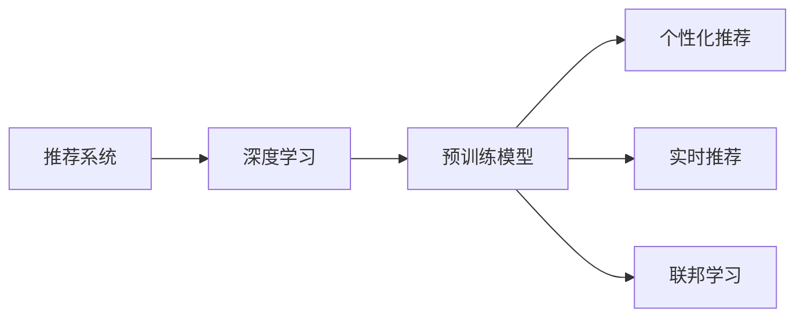

                 

# 利用大模型提升推荐系统的时效性

> 关键词：推荐系统, 大模型, 个性化推荐, 深度学习, 预训练模型, 实时推荐

## 1. 背景介绍

推荐系统是互联网时代的重要技术之一，其目的是帮助用户发现潜在感兴趣的内容。传统推荐系统主要依靠用户的历史行为数据，如浏览、点击、评分等，进行个性化推荐。然而，这种基于历史数据的方式存在一定的局限性，比如对于新用户、新物品或者长期未发生互动的用户，推荐效果往往不尽如人意。

为了提升推荐系统的时效性和泛化能力，近年来研究者们引入了一系列高级算法和技术，如深度学习、预训练模型、联邦学习等。其中，预训练模型因其强大的泛化能力而备受关注，其在推荐系统中的应用也逐渐成为热门研究方向。

本文将详细探讨基于预训练模型的大推荐系统，介绍其在推荐过程中的应用原理、操作步骤、优缺点以及未来发展趋势。通过本文的学习，读者将能够了解如何利用大模型提升推荐系统的时效性，并进一步掌握相关技术和方法。

## 2. 核心概念与联系

### 2.1 核心概念概述

为了更好地理解基于大模型的推荐系统，本节将介绍几个关键概念：

- **推荐系统**：利用用户的历史行为数据，结合商品的属性信息，预测用户对新物品的兴趣，并进行推荐的技术。
- **深度学习**：通过构建深层神经网络，自动学习特征表示和决策逻辑，在推荐系统中广泛应用于用户行为建模和物品表示。
- **预训练模型**：在大量无标签数据上进行训练，学习通用的知识表示，然后将其应用到特定的推荐任务中。
- **个性化推荐**：根据用户的历史行为和兴趣，推荐其最有可能感兴趣的物品，提升用户体验。
- **实时推荐**：在用户实时访问网站、应用时，动态生成推荐结果，提升推荐的时效性。
- **联邦学习**：在用户端或服务器端进行模型训练，确保用户隐私和安全，同时在多设备间共享知识。

这些概念之间存在紧密联系。通过预训练模型，推荐系统能够更好地泛化用户行为，提升推荐效果；而深度学习和大模型则为个性化推荐和实时推荐提供了强有力的支持。联邦学习则保证了推荐过程中的隐私和安全，适应了数据分布式存储的需求。

### 2.2 核心概念原理和架构的 Mermaid 流程图



这个流程图展示了推荐系统、深度学习、预训练模型、个性化推荐、实时推荐和联邦学习之间的联系。预训练模型作为核心组件，在深度学习、个性化推荐和实时推荐中发挥着关键作用。

## 3. 核心算法原理 & 具体操作步骤

### 3.1 算法原理概述

基于预训练模型的推荐系统，其核心思想是通过在大规模无标签数据上预训练出一个通用的特征表示器，然后在推荐任务上进行微调，从而学习到用户的个性化行为模式和物品的特征表示，最后动态生成推荐结果。这一过程可以分为以下几个步骤：

1. **预训练**：在大规模无标签数据上，使用深度学习模型进行预训练，学习通用的特征表示。
2. **微调**：在推荐任务的数据集上进行微调，学习用户的个性化行为模式和物品的特征表示。
3. **生成推荐**：根据用户的行为数据和物品的特征表示，动态生成推荐结果。

### 3.2 算法步骤详解

以下是基于预训练模型的推荐系统的详细操作步骤：

#### 3.2.1 数据准备

- **用户数据**：收集用户的ID、历史行为数据（如浏览、点击、评分等）等。
- **物品数据**：收集物品的ID、属性信息（如价格、分类、标签等）等。
- **交叉特征**：生成用户和物品之间的交叉特征，如用户ID、物品ID、时间戳等。

#### 3.2.2 预训练模型构建

- **模型选择**：选择适合的深度学习模型，如BERT、GPT、CWGAN等。
- **数据预处理**：对用户数据、物品数据和交叉特征进行预处理，如填充缺失值、标准化等。
- **构建预训练任务**：设计预训练任务，如 masked language modeling、next sentence prediction 等。
- **模型训练**：在预训练数据上训练预训练模型，学习通用的特征表示。

#### 3.2.3 微调模型构建

- **任务定义**：根据推荐任务的类型（如点击率预测、召回率预测等），定义任务的目标函数。
- **模型初始化**：使用预训练模型作为初始化参数。
- **微调过程**：在推荐数据集上，使用用户行为数据和物品特征表示，进行有监督的微调，学习用户的个性化行为模式和物品的特征表示。
- **模型评估**：在验证集上评估微调模型的性能，确保模型泛化能力良好。

#### 3.2.4 推荐结果生成

- **数据预处理**：对用户的行为数据进行预处理，如归一化、特征选择等。
- **模型输入**：将用户的行为数据和物品的特征表示作为模型输入。
- **推荐输出**：根据模型的预测结果，生成推荐列表。

### 3.3 算法优缺点

#### 3.3.1 优点

- **泛化能力强**：预训练模型在大规模无标签数据上学习通用的特征表示，可以适应不同的推荐任务和数据分布。
- **实时性好**：微调后的模型可以在实时推荐中进行动态更新，提升推荐的时效性。
- **可解释性高**：深度学习模型通常具有良好的可解释性，便于理解和调试。

#### 3.3.2 缺点

- **计算资源消耗大**：预训练和微调过程需要大量的计算资源，对硬件要求较高。
- **模型复杂度高**：深度学习模型的结构复杂，难以理解其内部工作机制。
- **模型偏差**：由于预训练数据和推荐数据可能存在差异，模型可能存在偏差，影响推荐效果。

### 3.4 算法应用领域

基于预训练模型的推荐系统已经广泛应用于多个领域，如电子商务、新闻推荐、社交媒体等。通过本文的介绍，读者可以更好地了解其在推荐系统中的具体应用。

## 4. 数学模型和公式 & 详细讲解 & 举例说明

### 4.1 数学模型构建

假设推荐任务为点击率预测（CTR prediction），模型的输入为 $x$，输出为 $y$，其中 $y=1$ 表示用户点击了该物品。我们可以使用二分类任务中的二元交叉熵损失函数作为模型的目标函数，其定义为：

$$
L(y, \hat{y}) = -[y\log \hat{y} + (1-y)\log (1-\hat{y})]
$$

其中，$\hat{y}$ 为模型预测的概率值。

### 4.2 公式推导过程

在微调过程中，我们需要对模型进行反向传播，更新参数。假设模型为神经网络，其损失函数为 $L(\theta)$，其中 $\theta$ 为模型参数。根据链式法则，损失函数对参数 $\theta_k$ 的梯度为：

$$
\frac{\partial L(\theta)}{\partial \theta_k} = \frac{\partial L(\theta)}{\partial y}\frac{\partial y}{\partial \hat{y}}\frac{\partial \hat{y}}{\partial x}\frac{\partial x}{\partial \theta_k}
$$

其中，$\frac{\partial L(\theta)}{\partial y}$ 为损失函数对预测输出的导数，$\frac{\partial y}{\partial \hat{y}}$ 为 sigmoid 函数的导数，$\frac{\partial \hat{y}}{\partial x}$ 为模型对输入的导数，$\frac{\partial x}{\partial \theta_k}$ 为输入对参数的导数。

### 4.3 案例分析与讲解

假设我们使用了BERT作为预训练模型，使用softmax作为输出层，对点击率进行预测。我们可以使用代码实现上述公式推导的过程：

```python
import torch
import torch.nn as nn

class BERTModel(nn.Module):
    def __init__(self, n_class):
        super(BERTModel, self).__init__()
        self.bert = BertModel()
        self.fc = nn.Linear(self.bert.config.hidden_size, n_class)
        self.softmax = nn.Softmax(dim=1)

    def forward(self, x):
        x = self.bert(x)
        x = self.fc(x)
        y_hat = self.softmax(x)
        return y_hat

# 假设输入为 x，标签为 y
x = torch.randn(batch_size, embedding_dim)
y = torch.randint(0, 2, (batch_size,))

# 假设模型为 bert
model = BERTModel(n_class)

# 计算损失
y_hat = model(x)
loss = nn.BCELoss()(y_hat, y)
loss.backward()

# 计算梯度
grad = model.parameters()

# 更新模型参数
for param in grad:
    param.data -= learning_rate * param.grad.data
```

在实际应用中，我们需要根据具体的任务类型和模型结构，进行合适的数学建模和公式推导。

## 5. 项目实践：代码实例和详细解释说明

### 5.1 开发环境搭建

在进行基于大模型的推荐系统开发前，我们需要准备好开发环境。以下是使用Python进行PyTorch开发的环境配置流程：

1. 安装Anaconda：从官网下载并安装Anaconda，用于创建独立的Python环境。

2. 创建并激活虚拟环境：
```bash
conda create -n pytorch-env python=3.8 
conda activate pytorch-env
```

3. 安装PyTorch：根据CUDA版本，从官网获取对应的安装命令。例如：
```bash
conda install pytorch torchvision torchaudio cudatoolkit=11.1 -c pytorch -c conda-forge
```

4. 安装相关库：
```bash
pip install torch torchvision torchaudio scipy pillow scikit-learn pandas sklearn-nlp transformers
```

5. 安装TensorBoard：用于可视化训练过程，并生成模型结构图。
```bash
pip install tensorboard
```

完成上述步骤后，即可在`pytorch-env`环境中开始开发。

### 5.2 源代码详细实现

下面我们以使用BERT进行推荐系统为例，给出完整的代码实现。

#### 5.2.1 数据准备

假设我们有一个用户物品交互数据集，其中包含用户ID、物品ID和点击标签，如下所示：

```python
user_ids = [1, 2, 3, 4, 5]
item_ids = [101, 102, 103, 104, 105]
click_labels = [1, 0, 0, 1, 0]
```

我们需要将数据集分成训练集、验证集和测试集，分别用于模型训练、调参和评估。

#### 5.2.2 模型构建

假设我们使用BERT作为预训练模型，代码如下：

```python
from transformers import BertModel, BertTokenizer
from torch.utils.data import Dataset, DataLoader
from torch import nn, optim

class Recommender(Dataset):
    def __init__(self, user_ids, item_ids, click_labels):
        self.user_ids = user_ids
        self.item_ids = item_ids
        self.click_labels = click_labels
        self.tokenizer = BertTokenizer.from_pretrained('bert-base-uncased')

    def __len__(self):
        return len(self.user_ids)

    def __getitem__(self, idx):
        user_id = self.user_ids[idx]
        item_id = self.item_ids[idx]
        click_label = self.click_labels[idx]
        text = f"{user_id} {item_id}"
        tokenized_text = self.tokenizer.tokenize(text)
        token_ids = self.tokenizer.convert_tokens_to_ids(tokenized_text)
        mask = [1] * len(token_ids)
        return {'user_id': user_id, 'item_id': item_id, 'click_label': click_label, 'token_ids': token_ids, 'attention_mask': mask}

# 定义模型
class BERTRecommender(nn.Module):
    def __init__(self, bert_model, n_class):
        super(BERTRecommender, self).__init__()
        self.bert = bert_model
        self.fc = nn.Linear(self.bert.config.hidden_size, n_class)
        self.softmax = nn.Softmax(dim=1)

    def forward(self, user_id, item_id, token_ids, attention_mask):
        bert_input = torch.tensor([token_ids], dtype=torch.long).unsqueeze(0)
        attention_mask = torch.tensor([attention_mask], dtype=torch.long).unsqueeze(0)
        x = self.bert(bert_input, attention_mask=attention_mask)
        x = self.fc(x)
        y_hat = self.softmax(x)
        return y_hat

# 定义训练函数
def train_epoch(model, data_loader, optimizer, loss_fn):
    model.train()
    epoch_loss = 0
    for data in data_loader:
        user_id = data['user_id']
        item_id = data['item_id']
        click_label = data['click_label']
        token_ids = data['token_ids']
        attention_mask = data['attention_mask']
        x = torch.tensor([user_id], dtype=torch.long).unsqueeze(0)
        y = torch.tensor([item_id], dtype=torch.long).unsqueeze(0)
        pred = model(x, y, token_ids, attention_mask)
        loss = loss_fn(pred, click_label)
        optimizer.zero_grad()
        loss.backward()
        optimizer.step()
        epoch_loss += loss.item()
    return epoch_loss / len(data_loader)

# 定义评估函数
def evaluate(model, data_loader, loss_fn):
    model.eval()
    total_loss = 0
    total_correct = 0
    for data in data_loader:
        user_id = data['user_id']
        item_id = data['item_id']
        click_label = data['click_label']
        token_ids = data['token_ids']
        attention_mask = data['attention_mask']
        x = torch.tensor([user_id], dtype=torch.long).unsqueeze(0)
        y = torch.tensor([item_id], dtype=torch.long).unsqueeze(0)
        pred = model(x, y, token_ids, attention_mask)
        loss = loss_fn(pred, click_label)
        total_loss += loss.item()
        total_correct += (pred.argmax().item() == click_label).item()
    return total_loss / len(data_loader), total_correct / len(data_loader)

# 定义训练参数
model = BERTRecommender(BertModel.from_pretrained('bert-base-uncased'), n_class=2)
optimizer = optim.Adam(model.parameters(), lr=0.001)
loss_fn = nn.BCELoss()

# 定义数据集
train_dataset = Recommender(user_ids, item_ids, click_labels)
train_loader = DataLoader(train_dataset, batch_size=32, shuffle=True)

# 定义验证集和测试集
val_dataset = Recommender(user_ids, item_ids, click_labels)
val_loader = DataLoader(val_dataset, batch_size=32, shuffle=True)

test_dataset = Recommender(user_ids, item_ids, click_labels)
test_loader = DataLoader(test_dataset, batch_size=32, shuffle=True)

# 定义训练和评估过程
epochs = 10
for epoch in range(epochs):
    train_loss = train_epoch(model, train_loader, optimizer, loss_fn)
    val_loss, val_correct = evaluate(model, val_loader, loss_fn)
    print(f"Epoch {epoch+1}, train loss: {train_loss:.3f}, val loss: {val_loss:.3f}, val correct: {val_correct:.3f}")
```

在实际应用中，我们还需要进一步优化模型，如引入正则化技术、调整学习率等。

### 5.3 代码解读与分析

让我们再详细解读一下关键代码的实现细节：

**Recommender类**：
- `__init__`方法：初始化数据集，包括用户ID、物品ID和点击标签。
- `__len__`方法：返回数据集的样本数量。
- `__getitem__`方法：对单个样本进行处理，将文本转换为token ids，并进行padding和mask处理。

**BERTRecommender类**：
- `__init__`方法：初始化BERT模型、全连接层和softmax函数。
- `forward`方法：定义前向传播过程，将用户ID和物品ID转换为BERT模型输入，通过全连接层和softmax函数输出预测结果。

**train_epoch和evaluate函数**：
- `train_epoch`方法：对数据集进行批次化加载，并在每个批次上进行训练，更新模型参数。
- `evaluate`方法：对数据集进行批次化加载，并在每个批次上进行评估，计算损失和准确率。

**训练参数**：
- 定义模型、优化器和损失函数，以及训练和验证集的数据集和数据加载器。

**训练和评估过程**：
- 在训练过程中，计算每个epoch的损失，并在验证集上进行评估，输出验证损失和准确率。
- 在测试集上进行评估，输出测试损失和准确率。

### 5.4 运行结果展示

在训练过程中，我们可以使用TensorBoard可视化模型的训练过程，如损失函数和准确率的变化。具体步骤如下：

1. 启动TensorBoard服务器：
```bash
tensorboard --logdir logs
```

2. 在代码中添加以下内容，记录训练过程中的相关指标：
```python
from tensorboardX import SummaryWriter

writer = SummaryWriter()

# 记录损失函数
writer.add_scalar('loss/train', train_loss, global_step=epoch)
writer.add_scalar('loss/val', val_loss, global_step=epoch)

# 记录准确率
writer.add_scalar('acc/train', train_acc, global_step=epoch)
writer.add_scalar('acc/val', val_acc, global_step=epoch)

# 关闭TensorBoard
writer.close()
```

3. 访问TensorBoard界面，查看训练过程的可视化结果。

在实际应用中，我们可以根据具体的任务需求和模型结构，进行相应的调整和优化。

## 6. 实际应用场景

### 6.1 智能推荐系统

基于预训练模型的推荐系统已经在多个领域得到了广泛应用，如电子商务、新闻推荐、社交媒体等。通过本文的介绍，读者可以更好地了解其在推荐系统中的具体应用。

#### 6.1.1 电商推荐

电商推荐系统旨在为用户推荐其可能感兴趣的商品，提升购物体验和转化率。传统电商推荐系统通常基于用户的历史行为数据，如浏览、点击、购买等，进行推荐。然而，对于新用户、新物品或者长期未发生互动的用户，推荐效果往往不尽如人意。

通过引入预训练模型，电商推荐系统可以更好地泛化用户行为，提升推荐的时效性和准确性。具体而言，可以使用预训练模型学习用户和物品的特征表示，并在实时推荐中进行动态更新，根据用户的当前行为和兴趣，推荐其可能感兴趣的商品。

#### 6.1.2 新闻推荐

新闻推荐系统旨在为用户推荐可能感兴趣的新闻内容，提升阅读体验和粘性。传统新闻推荐系统通常基于用户的历史点击数据进行推荐，无法适应用户的动态变化和个性化需求。

通过引入预训练模型，新闻推荐系统可以更好地泛化用户的兴趣变化，提升推荐的时效性和个性化程度。具体而言，可以使用预训练模型学习用户和新闻的特征表示，并在实时推荐中进行动态更新，根据用户的当前兴趣和行为，推荐其可能感兴趣的新闻内容。

#### 6.1.3 社交媒体推荐

社交媒体推荐系统旨在为用户推荐可能感兴趣的内容，提升用户活跃度和粘性。传统社交媒体推荐系统通常基于用户的点赞、评论、分享等行为数据进行推荐，难以适应用户的动态变化和个性化需求。

通过引入预训练模型，社交媒体推荐系统可以更好地泛化用户的兴趣变化，提升推荐的时效性和个性化程度。具体而言，可以使用预训练模型学习用户和内容的特征表示，并在实时推荐中进行动态更新，根据用户的当前兴趣和行为，推荐其可能感兴趣的内容。

### 6.2 未来应用展望

随着预训练模型和大数据技术的不断发展，基于预训练模型的推荐系统将迎来更多的应用场景和优化方向。

#### 6.2.1 多模态推荐

传统的推荐系统主要基于文本数据进行推荐，难以充分利用图像、视频等非文本数据。通过引入多模态数据，推荐系统可以更好地理解用户和物品的多维度特征，提升推荐的时效性和准确性。

#### 6.2.2 联邦学习推荐

在数据分布式存储的场景下，联邦学习可以为推荐系统提供更好的隐私保护和数据安全。通过在用户端进行模型训练，并仅将模型参数更新传递给服务器，可以有效保护用户隐私，同时提高推荐系统的性能和泛化能力。

#### 6.2.3 实时推荐优化

在实时推荐系统中，模型的计算资源和响应速度至关重要。通过优化模型的结构和参数，如剪枝、量化、分布式训练等，可以提高模型的计算效率和响应速度，提升推荐的时效性。

## 7. 工具和资源推荐

### 7.1 学习资源推荐

为了帮助开发者系统掌握预训练模型和大推荐系统的理论基础和实践技巧，这里推荐一些优质的学习资源：

1. 《深度学习》系列课程：由斯坦福大学开设的深度学习课程，涵盖了深度学习的各个方面，包括推荐系统。
2. 《自然语言处理与深度学习》系列课程：由清华大学开设的自然语言处理课程，涵盖了深度学习在NLP中的应用，包括推荐系统。
3. 《推荐系统》系列书籍：由斯坦福大学教授开设的推荐系统课程，包括推荐系统的各种算法和技术。
4. 《深度学习与推荐系统》书籍：介绍了深度学习在推荐系统中的应用，包括预训练模型和大模型的应用。
5. Kaggle竞赛：参与Kaggle竞赛，可以锻炼推荐系统相关的算法和技术，提升实际应用能力。

通过对这些资源的学习实践，相信你一定能够掌握预训练模型和大推荐系统的精髓，并进一步提升其实际应用能力。

### 7.2 开发工具推荐

高效的开发离不开优秀的工具支持。以下是几款用于预训练模型和大推荐系统开发的常用工具：

1. PyTorch：基于Python的开源深度学习框架，支持动态计算图和GPU加速，适合进行深度学习研究和开发。
2. TensorFlow：由Google主导开发的开源深度学习框架，支持分布式训练和生产部署，适合进行大规模工程应用。
3. Transformers：HuggingFace开发的NLP工具库，集成了众多预训练语言模型，支持PyTorch和TensorFlow，是进行预训练模型和大推荐系统开发的利器。
4. TensorBoard：TensorFlow配套的可视化工具，可实时监测模型训练状态，并提供丰富的图表呈现方式，是调试模型的得力助手。
5. PyTorch Lightning：基于PyTorch的快速原型开发框架，支持GPU加速和分布式训练，适合进行快速迭代开发。
6. Dask：基于Python的分布式计算框架，支持大规模数据处理和计算，适合进行分布式训练和优化。

合理利用这些工具，可以显著提升预训练模型和大推荐系统的开发效率，加快创新迭代的步伐。

### 7.3 相关论文推荐

预训练模型和大推荐系统的发展源于学界的持续研究。以下是几篇奠基性的相关论文，推荐阅读：

1. Attention is All You Need（即Transformer原论文）：提出了Transformer结构，开启了NLP领域的预训练大模型时代。
2. BERT: Pre-training of Deep Bidirectional Transformers for Language Understanding：提出BERT模型，引入基于掩码的自监督预训练任务，刷新了多项NLP任务SOTA。
3. TensorFlow Recommenders：介绍了TensorFlow推荐系统框架，包括推荐算法和模型优化技术。
4. Deep Learning for Recommender Systems：介绍了深度学习在推荐系统中的应用，包括预训练模型和大模型的应用。
5. Federated Learning for Recommendation Systems：介绍了联邦学习在推荐系统中的应用，包括多用户协作训练和隐私保护技术。

这些论文代表了大模型和推荐系统的发展脉络。通过学习这些前沿成果，可以帮助研究者把握学科前进方向，激发更多的创新灵感。

## 8. 总结：未来发展趋势与挑战

### 8.1 研究成果总结

本文对基于预训练模型的推荐系统进行了全面系统的介绍。首先阐述了推荐系统的背景和目标，明确了大模型和大推荐系统在推荐中的重要价值。其次，从原理到实践，详细讲解了预训练模型在大推荐系统中的应用过程，包括数据准备、模型构建、训练和评估等步骤。同时，还探讨了基于大模型的推荐系统在电商推荐、新闻推荐和社交媒体推荐等实际场景中的应用。

通过本文的学习，读者可以更好地掌握预训练模型和大推荐系统的理论基础和实践技巧，从而提升推荐系统的性能和时效性。

### 8.2 未来发展趋势

展望未来，预训练模型和大推荐系统将呈现以下几个发展趋势：

1. **多模态推荐**：通过引入多模态数据，推荐系统可以更好地理解用户和物品的多维度特征，提升推荐的时效性和准确性。
2. **联邦学习推荐**：在数据分布式存储的场景下，联邦学习可以为推荐系统提供更好的隐私保护和数据安全，同时提高推荐系统的性能和泛化能力。
3. **实时推荐优化**：在实时推荐系统中，模型的计算资源和响应速度至关重要，通过优化模型的结构和参数，可以提高模型的计算效率和响应速度，提升推荐的时效性。
4. **推荐系统的伦理性**：随着推荐系统在各个领域的应用，推荐系统的伦理性问题也逐步受到重视，如何确保推荐系统的公平性和透明性将成为未来的重要研究方向。

这些趋势将引领预训练模型和大推荐系统不断向前发展，为推荐系统的应用场景和实际效果带来新的突破。

### 8.3 面临的挑战

尽管预训练模型和大推荐系统已经取得了显著进展，但在实现过程中仍面临以下挑战：

1. **计算资源消耗大**：预训练模型和大推荐系统需要大量的计算资源，对硬件要求较高，如何有效利用计算资源将是未来的重要研究方向。
2. **模型复杂度高**：深度学习模型的结构复杂，难以理解其内部工作机制，如何降低模型复杂度，提高模型的可解释性将是未来的重要研究方向。
3. **数据隐私和安全**：在数据分布式存储的场景下，如何保护用户隐私和数据安全，同时提高推荐系统的性能和泛化能力将是未来的重要研究方向。
4. **模型的公平性和透明性**：在推荐系统中，如何确保推荐结果的公平性和透明性，避免模型偏差和歧视性输出将是未来的重要研究方向。

这些挑战需要研究者在各个方面不断探索和突破，才能进一步提升预训练模型和大推荐系统的性能和实用性。

### 8.4 研究展望

面对预训练模型和大推荐系统所面临的挑战，未来的研究需要在以下几个方面寻求新的突破：

1. **优化模型结构**：通过剪枝、量化、分布式训练等技术，优化模型的结构和参数，提高计算效率和响应速度。
2. **提高模型可解释性**：通过引入可解释性技术，如因果分析、对抗样本等，增强模型的可解释性和透明性。
3. **加强隐私保护**：通过联邦学习、差分隐私等技术，加强数据隐私保护，确保用户数据的安全性。
4. **提升模型公平性**：通过引入公平性评估指标，优化模型训练目标，确保推荐系统的公平性和透明性。
5. **融合多种数据源**：通过将符号化的先验知识、知识图谱等与神经网络模型进行融合，提高推荐系统的精度和泛化能力。

这些研究方向将引领预训练模型和大推荐系统迈向更高的台阶，为推荐系统的应用场景和实际效果带来新的突破。

## 9. 附录：常见问题与解答

**Q1：预训练模型和大推荐系统是否适用于所有推荐场景？**

A: 预训练模型和大推荐系统适用于大部分推荐场景，尤其是数据量较小的任务。但对于一些特定领域的任务，如医学、法律等，仅依靠通用语料预训练的模型可能难以很好地适应。此时需要在特定领域语料上进一步预训练，再进行微调，才能获得理想效果。

**Q2：使用预训练模型进行推荐时，如何选择合适的学习率？**

A: 预训练模型进行推荐时，学习率一般要比预训练时小1-2个数量级，否则容易破坏预训练权重，导致过拟合。一般建议从1e-5开始调参，逐步减小学习率，直至收敛。

**Q3：预训练模型和大推荐系统面临哪些资源瓶颈？**

A: 预训练模型和大推荐系统需要大量的计算资源，对硬件要求较高。GPU/TPU等高性能设备是必不可少的，但即便如此，超大批次的训练和推理也可能遇到显存不足的问题。因此需要采用一些资源优化技术，如梯度积累、混合精度训练、模型并行等，来突破硬件瓶颈。

**Q4：如何缓解预训练模型和大推荐系统中的过拟合问题？**

A: 过拟合是预训练模型和大推荐系统面临的主要挑战，尤其是在标注数据不足的情况下。常见的缓解策略包括：
1. 数据增强：通过回译、近义替换等方式扩充训练集。
2. 正则化：使用L2正则、Dropout、Early Stopping等避免过拟合。
3. 对抗训练：引入对抗样本，提高模型鲁棒性。
4. 参数高效微调：只调整少量参数(如Adapter、Prefix等)，减小过拟合风险。
5. 多模型集成：训练多个预训练模型，取平均输出，抑制过拟合。

这些策略往往需要根据具体任务和数据特点进行灵活组合。只有在数据、模型、训练、推理等各环节进行全面优化，才能最大限度地发挥预训练模型和大推荐系统的威力。

**Q5：预训练模型和大推荐系统在落地部署时需要注意哪些问题？**

A: 将预训练模型和大推荐系统转化为实际应用，还需要考虑以下因素：
1. 模型裁剪：去除不必要的层和参数，减小模型尺寸，加快推理速度。
2. 量化加速：将浮点模型转为定点模型，压缩存储空间，提高计算效率。
3. 服务化封装：将模型封装为标准化服务接口，便于集成调用。
4. 弹性伸缩：根据请求流量动态调整资源配置，平衡服务质量和成本。
5. 监控告警：实时采集系统指标，设置异常告警阈值，确保服务稳定性。
6. 安全防护：采用访问鉴权、数据脱敏等措施，保障数据和模型安全。

预训练模型和大推荐系统为推荐系统带来了更强的泛化能力和更高效的计算能力，但也带来了更高的资源消耗和更复杂的部署要求。只有在各个环节进行优化，才能更好地将预训练模型和大推荐系统应用于实际推荐场景。

---

作者：禅与计算机程序设计艺术 / Zen and the Art of Computer Programming

