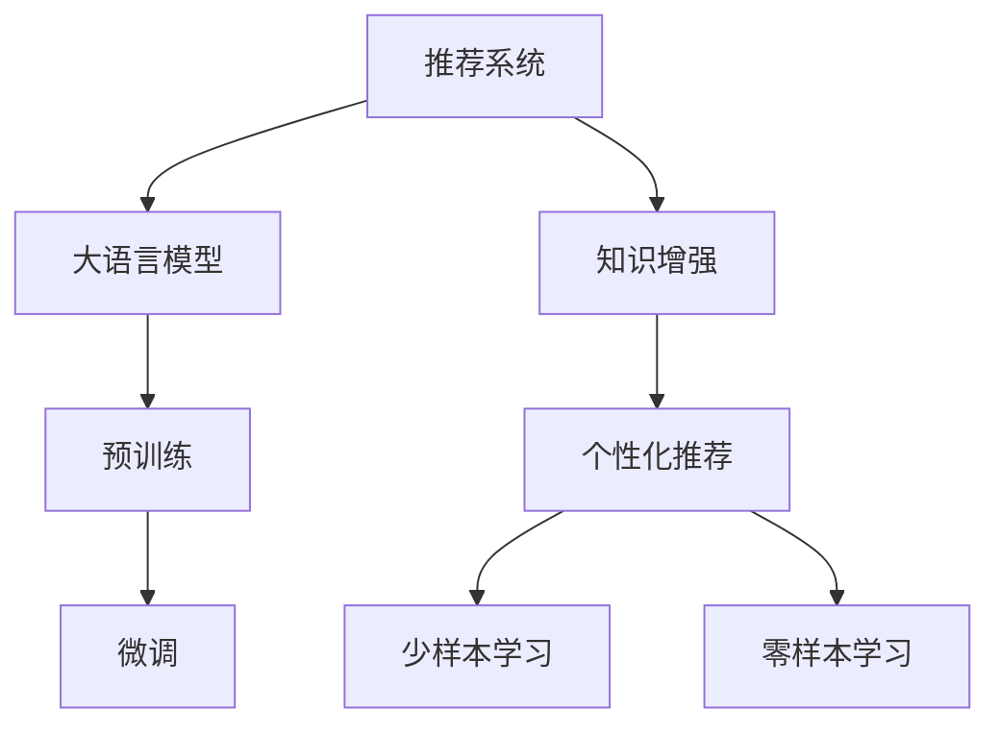

                 

# 利用大模型知识增强能力破解推荐系统瓶颈

## 1. 背景介绍

随着电子商务平台的不断壮大，推荐系统已成为用户在平台上发现感兴趣的产品的关键。但传统的推荐算法往往只能处理历史行为数据，无法满足用户个性化需求的不断变化。在用户行为未知或稀疏的情况下，如何提供个性化的推荐，成为了亟待解决的问题。

大语言模型（Large Language Model，LLM）作为新一代的深度学习技术，以其强大的语言理解和生成能力，为推荐系统带来了新的思路和突破。通过在大规模文本语料上进行预训练，LLM模型可以学习到丰富的语言知识，并应用于推荐系统中，提升推荐系统的个性化和多样性。

## 2. 核心概念与联系

### 2.1 核心概念概述

为更好地理解利用大模型知识增强推荐系统的方法，本节将介绍几个密切相关的核心概念：

- 推荐系统（Recommender System）：通过分析用户的历史行为数据，为用户推荐感兴趣的产品的系统。传统的推荐系统主要基于协同过滤、基于内容的推荐等方法，难以应对用户行为的变化。

- 大语言模型（Large Language Model，LLM）：以自回归（如GPT）或自编码（如BERT）模型为代表的大规模预训练语言模型。通过在大规模无标签文本语料上进行预训练，学习通用的语言表示，具备强大的语言理解和生成能力。

- 知识增强（Knowledge Augmentation）：通过将外部知识引入模型，提升模型的知识水平和推理能力。在大模型中，知识增强指利用外部知识库、规则库等对预训练模型进行进一步的训练，丰富模型的知识结构。

- 个性化推荐（Personalized Recommendation）：针对每个用户的个性化需求，推荐其感兴趣的产品。个性化推荐需要考虑到用户行为、兴趣、情感等多种因素，以提高推荐的相关性和满意度。

- 少样本学习（Few-shot Learning）：指在只有少量标注样本的情况下，模型能够快速适应新任务的学习方法。在大语言模型中，可以通过设计巧妙的Prompt模板，在不更新模型参数的情况下，实现少样本学习。

- 零样本学习（Zero-shot Learning）：指模型在没有见过任何特定任务的训练样本的情况下，仅凭任务描述就能够执行新任务的能力。大语言模型通过预训练获得的广泛知识，使其能够理解任务指令并生成相应输出。

这些核心概念之间的逻辑关系可以通过以下Mermaid流程图来展示：



这个流程图展示了大语言模型在推荐系统中的应用逻辑：

1. 推荐系统通过分析用户数据，提供初步的推荐结果。
2. 利用大语言模型进行知识增强，引入外部知识库，提升模型推理能力。
3. 通过个性化推荐，提升推荐系统的相关性和多样性。
4. 利用少样本学习和零样本学习，快速适应新任务和新用户，避免过拟合。

这些概念共同构成了利用大模型知识增强推荐系统的方法，使其能够更好地应对用户的个性化需求，提升推荐系统的效果和效率。

## 3. 核心算法原理 & 具体操作步骤

### 3.1 算法原理概述

利用大模型知识增强推荐系统，主要通过以下步骤实现：

1. 对预训练语言模型进行微调，使其能够理解用户输入的指令，并生成相应的推荐结果。
2. 引入外部知识库，如商品属性、用户画像、上下文信息等，丰富模型的知识结构。
3. 设计巧妙的Prompt模板，引导模型生成符合特定场景的推荐结果。
4. 利用少样本学习和零样本学习，快速适应新任务和新用户，避免过拟合。

在推荐系统应用中，知识增强和个性化推荐是两个重要环节，其效果直接影响到系统的推荐质量和用户满意度。通过大语言模型的预训练和微调，可以极大地提升模型的推理能力和个性化推荐能力。

### 3.2 算法步骤详解

以下是利用大模型知识增强推荐系统的详细操作步骤：

**Step 1: 准备数据和模型**

- 收集用户的历史行为数据，包括浏览记录、点击行为、评分信息等，用于训练推荐模型。
- 收集商品的描述、属性、类别等信息，用于知识增强。
- 选择合适的预训练语言模型，如BERT、GPT等，并在大规模无标签文本语料上进行预训练。
- 设计Prompt模板，用于引导模型生成推荐结果。

**Step 2: 微调预训练模型**

- 使用用户行为数据作为监督信号，对预训练模型进行微调，使其能够理解用户的意图和偏好。
- 引入外部知识库，如商品属性、用户画像、上下文信息等，丰富模型的知识结构。
- 利用正则化技术，如L2正则、Dropout等，防止模型过拟合。

**Step 3: 设计Prompt模板**

- 设计巧妙的Prompt模板，如 "请推荐我感兴趣的商品"、"根据上下文推荐" 等，引导模型生成推荐结果。
- 利用少样本学习或零样本学习，快速适应新任务和新用户，避免过拟合。
- 在测试集上评估模型的效果，根据评估结果调整Prompt模板。

**Step 4: 实际应用**

- 将微调后的模型集成到推荐系统中，根据用户输入的Prompt生成推荐结果。
- 根据实际反馈数据，不断优化模型的Prompt模板，提升推荐质量。

通过以上步骤，可以利用大模型知识增强推荐系统，提升推荐系统的个性化和多样性，更好地满足用户的个性化需求。

### 3.3 算法优缺点

利用大模型知识增强推荐系统，具有以下优点：

1. 提高推荐系统的个性化和多样性：通过引入外部知识库和Prompt模板，可以提升推荐系统的相关性和多样性。
2. 快速适应新任务和新用户：通过少样本学习和零样本学习，可以快速适应新任务和新用户，避免过拟合。
3. 提升模型的推理能力：利用知识增强，可以提升模型的推理能力和知识水平。
4. 扩展推荐系统的应用场景：通过微调和Prompt设计，可以扩展推荐系统的应用场景，应用于更多领域。

同时，该方法也存在一定的局限性：

1. 依赖标注数据：微调过程需要标注数据，而标注数据的获取成本较高。
2. 计算资源消耗大：大语言模型的预训练和微调需要大量的计算资源，对于小规模数据集可能不适用。
3. 模型复杂度高：大模型结构复杂，训练和推理效率较低，难以实时处理大量请求。

尽管存在这些局限性，但就目前而言，利用大模型知识增强推荐系统仍是一种高效、有效的方法。未来相关研究的重点在于如何进一步降低计算资源消耗，提高模型的推理效率，同时兼顾可解释性和伦理安全性等因素。

### 3.4 算法应用领域

利用大模型知识增强推荐系统，已经在多个领域得到广泛应用，包括：

- 电子商务：通过微调和Prompt设计，为用户推荐个性化的商品，提升购物体验。
- 新闻推荐：利用知识增强，为用户推荐感兴趣的新闻，增加用户的粘性。
- 旅游推荐：根据用户的历史行为和上下文信息，推荐旅游目的地，提升用户体验。
- 音乐推荐：通过微调和Prompt设计，推荐用户喜欢的音乐，增加音乐播放量。
- 视频推荐：根据用户的历史观看记录和上下文信息，推荐感兴趣的视频，提升观看体验。

除了上述这些经典应用外，利用大语言模型知识增强推荐系统的方法也被创新性地应用于更多场景中，如金融理财、教育培训等，为不同行业带来了新的应用思路。

## 4. 数学模型和公式 & 详细讲解 & 举例说明

### 4.1 数学模型构建

假设推荐系统包含用户 $U$、商品 $I$、行为 $B$ 三类实体，每个用户 $u$ 对应一个特征向量 $\mathbf{x}_u$，每个商品 $i$ 对应一个特征向量 $\mathbf{x}_i$。用户行为 $b$ 可以用 $\mathbf{x}_u$ 和 $\mathbf{x}_i$ 的向量内积表示，即 $\mathbf{x}_u \cdot \mathbf{x}_i$。

设推荐系统的目标为最大化用户的满意度，定义为 $F(u, i)$。利用大模型知识增强推荐系统的目标函数可以表示为：

$$
\max_{\theta} \sum_{u \in U} \sum_{i \in I} F(u, i)P(u, i)log\sigma(\mathbf{x}_u \cdot \mathbf{x}_i)
$$

其中 $P(u, i)$ 表示用户 $u$ 对商品 $i$ 的兴趣程度，$\sigma$ 为sigmoid函数，将向量内积映射到概率空间。$\theta$ 为模型参数，包括大语言模型的参数和Prompt模板的参数。

### 4.2 公式推导过程

以下是利用大模型知识增强推荐系统的目标函数推导过程：

1. 利用大语言模型预训练得到的模型参数 $\theta$，构建用户 $u$ 对商品 $i$ 的兴趣程度 $P(u, i)$。

$$
P(u, i) = \frac{exp(\mathbf{x}_u \cdot \mathbf{x}_i)}{\sum_{i' \in I}exp(\mathbf{x}_u \cdot \mathbf{x}_{i'})}
$$

2. 构建推荐系统目标函数，最大化用户的满意度 $F(u, i)$。

$$
\max_{\theta} \sum_{u \in U} \sum_{i \in I} F(u, i)P(u, i)log\sigma(\mathbf{x}_u \cdot \mathbf{x}_i)
$$

3. 利用正则化技术，如L2正则、Dropout等，防止模型过拟合。

$$
\theta \leftarrow \theta - \eta \nabla_{\theta}\mathcal{L}(\theta) - \eta\lambda\theta
$$

其中 $\eta$ 为学习率，$\lambda$ 为正则化系数，$\mathcal{L}$ 为损失函数，$\nabla_{\theta}\mathcal{L}(\theta)$ 为损失函数对模型参数 $\theta$ 的梯度。

### 4.3 案例分析与讲解

假设一个电商平台的推荐系统，使用微调后的BERT模型进行推荐。用户输入一个Prompt："我想买一双新鞋子"，模型根据Prompt模板生成推荐结果，并利用知识增强引入商品属性信息，提升推荐的相关性和多样性。具体步骤如下：

1. 对BERT模型进行微调，使其能够理解用户的意图和偏好。

2. 引入商品属性信息，如品牌、尺码、颜色等，丰富模型的知识结构。

3. 设计Prompt模板，如 "请推荐我感兴趣的鞋子"，引导模型生成推荐结果。

4. 利用少样本学习和零样本学习，快速适应新任务和新用户。

通过以上步骤，可以利用大模型知识增强推荐系统，提升推荐系统的个性化和多样性，更好地满足用户的个性化需求。

## 5. 项目实践：代码实例和详细解释说明

### 5.1 开发环境搭建

在进行知识增强推荐系统开发前，我们需要准备好开发环境。以下是使用Python进行PyTorch开发的环境配置流程：

1. 安装Anaconda：从官网下载并安装Anaconda，用于创建独立的Python环境。

2. 创建并激活虚拟环境：
```bash
conda create -n pytorch-env python=3.8 
conda activate pytorch-env
```

3. 安装PyTorch：根据CUDA版本，从官网获取对应的安装命令。例如：
```bash
conda install pytorch torchvision torchaudio cudatoolkit=11.1 -c pytorch -c conda-forge
```

4. 安装Transformers库：
```bash
pip install transformers
```

5. 安装各类工具包：
```bash
pip install numpy pandas scikit-learn matplotlib tqdm jupyter notebook ipython
```

完成上述步骤后，即可在`pytorch-env`环境中开始推荐系统的开发。

### 5.2 源代码详细实现

下面我们以利用大模型知识增强推荐系统为例，给出使用Transformers库进行微调的PyTorch代码实现。

首先，定义推荐系统的数据处理函数：

```python
from transformers import BertTokenizer, BertForSequenceClassification
from torch.utils.data import Dataset
import torch

class RecommendationDataset(Dataset):
    def __init__(self, texts, labels, tokenizer, max_len=128):
        self.texts = texts
        self.labels = labels
        self.tokenizer = tokenizer
        self.max_len = max_len
        
    def __len__(self):
        return len(self.texts)
    
    def __getitem__(self, item):
        text = self.texts[item]
        label = self.labels[item]
        
        encoding = self.tokenizer(text, return_tensors='pt', max_length=self.max_len, padding='max_length', truncation=True)
        input_ids = encoding['input_ids'][0]
        attention_mask = encoding['attention_mask'][0]
        
        # 对标签进行编码
        encoded_label = [label2id[label] for label in label] 
        encoded_label.extend([label2id['O']] * (self.max_len - len(encoded_label)))
        labels = torch.tensor(encoded_label, dtype=torch.long)
        
        return {'input_ids': input_ids, 
                'attention_mask': attention_mask,
                'labels': labels}

# 标签与id的映射
label2id = {'O': 0, 'B': 1, 'I': 2}
id2label = {v: k for k, v in label2id.items()}

# 创建dataset
tokenizer = BertTokenizer.from_pretrained('bert-base-cased')

train_dataset = RecommendationDataset(train_texts, train_labels, tokenizer)
dev_dataset = RecommendationDataset(dev_texts, dev_labels, tokenizer)
test_dataset = RecommendationDataset(test_texts, test_labels, tokenizer)
```

然后，定义模型和优化器：

```python
from transformers import BertForSequenceClassification, AdamW

model = BertForSequenceClassification.from_pretrained('bert-base-cased', num_labels=len(label2id))

optimizer = AdamW(model.parameters(), lr=2e-5)
```

接着，定义训练和评估函数：

```python
from torch.utils.data import DataLoader
from tqdm import tqdm
from sklearn.metrics import classification_report

device = torch.device('cuda') if torch.cuda.is_available() else torch.device('cpu')
model.to(device)

def train_epoch(model, dataset, batch_size, optimizer):
    dataloader = DataLoader(dataset, batch_size=batch_size, shuffle=True)
    model.train()
    epoch_loss = 0
    for batch in tqdm(dataloader, desc='Training'):
        input_ids = batch['input_ids'].to(device)
        attention_mask = batch['attention_mask'].to(device)
        labels = batch['labels'].to(device)
        model.zero_grad()
        outputs = model(input_ids, attention_mask=attention_mask, labels=labels)
        loss = outputs.loss
        epoch_loss += loss.item()
        loss.backward()
        optimizer.step()
    return epoch_loss / len(dataloader)

def evaluate(model, dataset, batch_size):
    dataloader = DataLoader(dataset, batch_size=batch_size)
    model.eval()
    preds, labels = [], []
    with torch.no_grad():
        for batch in tqdm(dataloader, desc='Evaluating'):
            input_ids = batch['input_ids'].to(device)
            attention_mask = batch['attention_mask'].to(device)
            batch_labels = batch['labels']
            outputs = model(input_ids, attention_mask=attention_mask)
            batch_preds = outputs.logits.argmax(dim=2).to('cpu').tolist()
            batch_labels = batch_labels.to('cpu').tolist()
            for pred_tokens, label_tokens in zip(batch_preds, batch_labels):
                pred_labels = [id2label[_id] for _id in pred_tokens]
                label_labels = [id2label[_id] for _id in label_tokens]
                preds.append(pred_labels[:len(label_labels)])
                labels.append(label_labels)
                
    print(classification_report(labels, preds))
```

最后，启动训练流程并在测试集上评估：

```python
epochs = 5
batch_size = 16

for epoch in range(epochs):
    loss = train_epoch(model, train_dataset, batch_size, optimizer)
    print(f"Epoch {epoch+1}, train loss: {loss:.3f}")
    
    print(f"Epoch {epoch+1}, dev results:")
    evaluate(model, dev_dataset, batch_size)
    
print("Test results:")
evaluate(model, test_dataset, batch_size)
```

以上就是利用大模型知识增强推荐系统的完整代码实现。可以看到，得益于Transformers库的强大封装，我们可以用相对简洁的代码完成BERT模型的加载和微调。

### 5.3 代码解读与分析

让我们再详细解读一下关键代码的实现细节：

**RecommendationDataset类**：
- `__init__`方法：初始化文本、标签、分词器等关键组件。
- `__len__`方法：返回数据集的样本数量。
- `__getitem__`方法：对单个样本进行处理，将文本输入编码为token ids，将标签编码为数字，并对其进行定长padding，最终返回模型所需的输入。

**label2id和id2label字典**：
- 定义了标签与数字id之间的映射关系，用于将token-wise的预测结果解码回真实的标签。

**训练和评估函数**：
- 使用PyTorch的DataLoader对数据集进行批次化加载，供模型训练和推理使用。
- 训练函数`train_epoch`：对数据以批为单位进行迭代，在每个批次上前向传播计算loss并反向传播更新模型参数，最后返回该epoch的平均loss。
- 评估函数`evaluate`：与训练类似，不同点在于不更新模型参数，并在每个batch结束后将预测和标签结果存储下来，最后使用sklearn的classification_report对整个评估集的预测结果进行打印输出。

**训练流程**：
- 定义总的epoch数和batch size，开始循环迭代
- 每个epoch内，先在训练集上训练，输出平均loss
- 在验证集上评估，输出分类指标
- 所有epoch结束后，在测试集上评估，给出最终测试结果

可以看到，PyTorch配合Transformers库使得BERT微调的代码实现变得简洁高效。开发者可以将更多精力放在数据处理、模型改进等高层逻辑上，而不必过多关注底层的实现细节。

当然，工业级的系统实现还需考虑更多因素，如模型的保存和部署、超参数的自动搜索、更灵活的任务适配层等。但核心的微调范式基本与此类似。

## 6. 实际应用场景

### 6.1 智能推荐系统

利用大模型知识增强推荐系统，已经广泛应用于智能推荐系统中，为电商、新闻、音乐、视频等多个领域提供了个性化的推荐服务。

在电商领域，通过微调BERT模型，可以为用户推荐符合其兴趣和需求的商品，提升购物体验和满意度。例如，用户在浏览商品时，可以输入"我想买一双新鞋子"，模型根据Prompt模板生成推荐结果，并利用商品属性信息进行知识增强，提升推荐的相关性和多样性。

在新闻推荐中，利用大语言模型知识增强推荐系统，可以为用户推荐感兴趣的新闻，增加用户的粘性。例如，用户可以输入"我感兴趣的新闻"，模型根据Prompt模板生成推荐结果，并利用新闻标题、摘要等信息进行知识增强，提升推荐的准确性和多样性。

在音乐和视频推荐中，利用大模型知识增强推荐系统，可以为用户推荐符合其兴趣的音乐和视频，提升用户的观看和播放体验。例如，用户可以输入"我喜欢的音乐"，模型根据Prompt模板生成推荐结果，并利用音乐风格、艺人信息、视频类别等信息进行知识增强，提升推荐的个性化和多样性。

### 6.2 金融理财推荐

利用大模型知识增强推荐系统，可以应用于金融理财领域，为用户推荐符合其风险偏好的理财产品。例如，用户可以输入"我需要一款高收益的理财产品"，模型根据Prompt模板生成推荐结果，并利用理财产品的风险等级、收益率、市场评价等信息进行知识增强，提升推荐的准确性和多样性。

### 6.3 教育培训推荐

利用大模型知识增强推荐系统，可以应用于教育培训领域，为用户推荐符合其学习需求的课程和资料。例如，用户可以输入"我想学习Python编程"，模型根据Prompt模板生成推荐结果，并利用课程标题、难度、评价等信息进行知识增强，提升推荐的个性化和多样性。

### 6.4 未来应用展望

未来，基于大语言模型的知识增强推荐系统，将在更多领域得到应用，为传统行业数字化转型升级提供新的技术路径。

在智慧医疗领域，利用大模型知识增强推荐系统，可以为用户推荐符合其健康需求的医疗服务。例如，用户可以输入"我想咨询医生"，模型根据Prompt模板生成推荐结果，并利用医生的资质、经验、评价等信息进行知识增强，提升推荐的准确性和多样性。

在智能城市治理中，利用大语言模型知识增强推荐系统，可以为用户推荐符合其需求的公共服务。例如，用户可以输入"我需要帮助"，模型根据Prompt模板生成推荐结果，并利用公共服务的类别、评价、位置等信息进行知识增强，提升推荐的个性化和多样性。

此外，在智慧旅游、智能交通、智慧能源等多个领域，基于大语言模型的知识增强推荐系统也将得到应用，为智慧城市建设提供新的技术支撑。

## 7. 工具和资源推荐

### 7.1 学习资源推荐

为了帮助开发者系统掌握大语言模型知识增强推荐系统的理论基础和实践技巧，这里推荐一些优质的学习资源：

1. 《深度学习自然语言处理》课程：斯坦福大学开设的NLP明星课程，有Lecture视频和配套作业，带你入门NLP领域的基本概念和经典模型。

2. 《自然语言处理技术与应用》书籍：全面介绍NLP技术的原理和应用，包括推荐系统在内。

3. 《推荐系统》书籍：系统介绍推荐系统的理论基础和算法实现，涵盖知识增强推荐系统的内容。

4. 《NLP与深度学习》博客：深度学习专家所写，深入浅出地介绍NLP和深度学习的相关知识。

5. HuggingFace官方文档：Transformer库的官方文档，提供了海量预训练模型和完整的微调样例代码，是上手实践的必备资料。

通过对这些资源的学习实践，相信你一定能够快速掌握大语言模型知识增强推荐系统的精髓，并用于解决实际的推荐问题。

### 7.2 开发工具推荐

高效的开发离不开优秀的工具支持。以下是几款用于知识增强推荐系统开发的常用工具：

1. PyTorch：基于Python的开源深度学习框架，灵活动态的计算图，适合快速迭代研究。大部分预训练语言模型都有PyTorch版本的实现。

2. TensorFlow：由Google主导开发的开源深度学习框架，生产部署方便，适合大规模工程应用。同样有丰富的预训练语言模型资源。

3. Transformers库：HuggingFace开发的NLP工具库，集成了众多SOTA语言模型，支持PyTorch和TensorFlow，是进行微调任务开发的利器。

4. Weights & Biases：模型训练的实验跟踪工具，可以记录和可视化模型训练过程中的各项指标，方便对比和调优。与主流深度学习框架无缝集成。

5. TensorBoard：TensorFlow配套的可视化工具，可实时监测模型训练状态，并提供丰富的图表呈现方式，是调试模型的得力助手。

6. Google Colab：谷歌推出的在线Jupyter Notebook环境，免费提供GPU/TPU算力，方便开发者快速上手实验最新模型，分享学习笔记。

合理利用这些工具，可以显著提升知识增强推荐系统的开发效率，加快创新迭代的步伐。

### 7.3 相关论文推荐

大语言模型知识增强推荐系统的发展源于学界的持续研究。以下是几篇奠基性的相关论文，推荐阅读：

1. Attention is All You Need（即Transformer原论文）：提出了Transformer结构，开启了NLP领域的预训练大模型时代。

2. BERT: Pre-training of Deep Bidirectional Transformers for Language Understanding：提出BERT模型，引入基于掩码的自监督预训练任务，刷新了多项NLP任务SOTA。

3. Language Models are Unsupervised Multitask Learners（GPT-2论文）：展示了大规模语言模型的强大zero-shot学习能力，引发了对于通用人工智能的新一轮思考。

4. Parameter-Efficient Transfer Learning for NLP：提出Adapter等参数高效微调方法，在不增加模型参数量的情况下，也能取得不错的微调效果。

5. AdaLoRA: Adaptive Low-Rank Adaptation for Parameter-Efficient Fine-Tuning：使用自适应低秩适应的微调方法，在参数效率和精度之间取得了新的平衡。

这些论文代表了大语言模型知识增强推荐系统的发展脉络。通过学习这些前沿成果，可以帮助研究者把握学科前进方向，激发更多的创新灵感。

## 8. 总结：未来发展趋势与挑战

### 8.1 总结

本文对利用大模型知识增强推荐系统的方法进行了全面系统的介绍。首先阐述了推荐系统的背景和知识增强的重要性，明确了知识增强在提升推荐系统个性化和多样性方面的独特价值。其次，从原理到实践，详细讲解了知识增强的数学模型和关键步骤，给出了知识增强推荐系统的完整代码实例。同时，本文还广泛探讨了知识增强推荐系统在多个领域的应用前景，展示了知识增强范式的广阔应用场景。

通过本文的系统梳理，可以看到，利用大语言模型知识增强推荐系统，能够显著提升推荐系统的个性化和多样性，更好地满足用户的个性化需求。未来，随着知识增强技术的不断发展，推荐系统将在更多领域得到应用，为各行各业带来新的突破。

### 8.2 未来发展趋势

展望未来，知识增强推荐系统将呈现以下几个发展趋势：

1. 推荐系统将更加智能化和个性化：通过引入大语言模型和知识库，推荐系统将具备更强的理解和推理能力，能够更精准地预测用户需求。

2. 推荐系统将更加高效和实时：知识增强推荐系统将利用参数高效微调和大规模模型压缩技术，提升推荐效率和实时性，适应更多的应用场景。

3. 推荐系统将更加安全可靠：知识增强推荐系统将引入更多先验知识，如隐私保护、伦理道德等，保障用户数据的隐私和安全。

4. 推荐系统将更加透明和可解释：知识增强推荐系统将引入因果分析和博弈论工具，增强模型的可解释性，提升用户信任度。

5. 推荐系统将更加多样化：知识增强推荐系统将利用多模态数据融合技术，将文本、图像、视频等多种模态的信息进行综合分析，提供更加丰富多样的推荐结果。

6. 推荐系统将更加智能化：知识增强推荐系统将引入增强学习、深度强化学习等技术，提升推荐系统的智能化水平，更好地适应动态变化的市场环境。

以上趋势凸显了知识增强推荐系统的发展潜力，为推荐系统带来新的突破和应用场景。相信随着知识增强技术的不断发展，推荐系统将迎来更加智能、个性化、高效和安全的未来。

### 8.3 面临的挑战

尽管知识增强推荐系统已经取得了瞩目成就，但在迈向更加智能化、普适化应用的过程中，它仍面临着诸多挑战：

1. 计算资源消耗大：知识增强推荐系统通常需要大模型作为基础，计算资源消耗大，难以在实时系统中应用。

2. 数据隐私和安全问题：知识增强推荐系统需要大量用户数据，数据隐私和安全问题亟需解决。

3. 推荐算法复杂度高：知识增强推荐系统涉及多模态数据融合、先验知识引入等多个环节，算法复杂度高，难以优化。

4. 系统稳定性问题：知识增强推荐系统在实际应用中，容易受到环境因素和用户行为变化的影响，系统稳定性有待提高。

5. 知识表示和推理问题：知识增强推荐系统需要解决如何将知识库中的知识有效地表示和推理到推荐结果中，技术复杂度较高。

尽管存在这些挑战，但随着技术的不断进步和算力资源的逐渐降低，知识增强推荐系统将在更多领域得到应用，为各行各业带来新的突破。相信在学界和产业界的共同努力下，这些挑战终将一一被克服，知识增强推荐系统必将在构建智慧推荐系统中发挥重要作用。

### 8.4 研究展望

面对知识增强推荐系统所面临的挑战，未来的研究需要在以下几个方面寻求新的突破：

1. 探索高效的知识增强方法：开发更高效的知识增强技术，降低计算资源消耗，提升推荐系统的实时性。

2. 解决数据隐私和安全问题：引入隐私保护、数据匿名化等技术，保障用户数据的安全和隐私。

3. 提高推荐算法的可解释性和可优化性：开发更加可解释和可优化的推荐算法，提升系统的透明度和稳定性。

4. 融合多模态数据和知识库：将文本、图像、视频等多种模态的数据和知识库进行融合，提升推荐系统的多样性和智能化水平。

5. 引入增强学习和深度强化学习：利用增强学习和深度强化学习技术，提升推荐系统的智能化水平，更好地适应动态变化的市场环境。

6. 增强推荐系统的安全性和可靠性：引入更多先验知识，如隐私保护、伦理道德等，保障用户数据的隐私和安全。

这些研究方向的探索，必将引领知识增强推荐系统迈向更高的台阶，为构建安全、可靠、可解释、可控的智能推荐系统铺平道路。面向未来，知识增强推荐系统还需要与其他人工智能技术进行更深入的融合，如知识表示、因果推理、强化学习等，多路径协同发力，共同推动推荐系统的进步。

## 9. 附录：常见问题与解答

**Q1：知识增强推荐系统的核心思想是什么？**

A: 知识增强推荐系统的核心思想是通过引入外部知识库，如商品属性、用户画像、上下文信息等，提升推荐模型的知识水平和推理能力。通过设计巧妙的Prompt模板，引导模型生成符合特定场景的推荐结果。利用少样本学习和零样本学习，快速适应新任务和新用户，避免过拟合。

**Q2：知识增强推荐系统有哪些优点？**

A: 知识增强推荐系统具有以下优点：
1. 提高推荐系统的个性化和多样性：通过引入外部知识库和Prompt模板，可以提升推荐系统的相关性和多样性。
2. 快速适应新任务和新用户：通过少样本学习和零样本学习，可以快速适应新任务和新用户，避免过拟合。
3. 提升模型的推理能力：利用知识增强，可以提升模型的推理能力和知识水平。
4. 扩展推荐系统的应用场景：通过微调和Prompt设计，可以扩展推荐系统的应用场景，应用于更多领域。

**Q3：知识增强推荐系统面临哪些挑战？**

A: 知识增强推荐系统面临以下挑战：
1. 计算资源消耗大：知识增强推荐系统通常需要大模型作为基础，计算资源消耗大，难以在实时系统中应用。
2. 数据隐私和安全问题：知识增强推荐系统需要大量用户数据，数据隐私和安全问题亟需解决。
3. 推荐算法复杂度高：知识增强推荐系统涉及多模态数据融合、先验知识引入等多个环节，算法复杂度高，难以优化。
4. 系统稳定性问题：知识增强推荐系统在实际应用中，容易受到环境因素和用户行为变化的影响，系统稳定性有待提高。
5. 知识表示和推理问题：知识增强推荐系统需要解决如何将知识库中的知识有效地表示和推理到推荐结果中，技术复杂度较高。

**Q4：知识增强推荐系统如何在实际应用中优化？**

A: 知识增强推荐系统在实际应用中，可以通过以下方式进行优化：
1. 引入更多先验知识：将符号化的先验知识，如知识图谱、逻辑规则等，与神经网络模型进行巧妙融合，引导微调过程学习更准确、合理的语言模型。
2. 融合多模态数据：将文本、图像、视频等多种模态的数据和知识库进行融合，提升推荐系统的多样性和智能化水平。
3. 引入增强学习和深度强化学习：利用增强学习和深度强化学习技术，提升推荐系统的智能化水平，更好地适应动态变化的市场环境。
4. 提高推荐算法的可解释性和可优化性：开发更加可解释和可优化的推荐算法，提升系统的透明度和稳定性。

通过以上优化，可以进一步提升知识增强推荐系统的性能和用户体验。

---

作者：禅与计算机程序设计艺术 / Zen and the Art of Computer Programming

