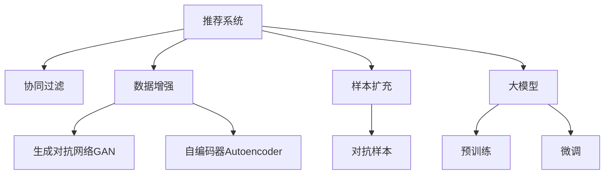

                 

# 利用大模型进行推荐场景的数据增强与样本扩充

> 关键词：推荐系统,数据增强,数据扩充,大模型,深度学习,自监督学习,协同过滤,冷启动问题,对抗样本

## 1. 背景介绍

### 1.1 问题由来

随着互联网的普及和电子商务的快速发展，个性化推荐系统成为各大电商平台和在线服务提供商不可或缺的核心功能。这些系统通过分析用户的浏览记录、购买行为、评分反馈等数据，为用户推荐个性化的产品或内容，极大地提升了用户体验和业务效益。

然而，推荐系统面临的最大挑战之一是数据稀疏性，尤其是新用户的冷启动问题。新用户缺乏历史数据，推荐系统难以提供精准的个性化推荐。同时，随着用户数量的不断增长，系统需要处理的数据量呈指数级增长，这对算力和存储提出了更高要求。

为了应对这些挑战，研究者们提出并探索了多种技术手段，其中数据增强和样本扩充成为了推荐系统优化不可或缺的一环。通过数据增强和样本扩充，推荐系统能够更好地利用有限的标注数据，优化模型的泛化性能，提高推荐准确度和系统效率。

### 1.2 问题核心关键点

数据增强和样本扩充的核心在于：
- **数据增强**：通过数据生成和变换，扩充训练样本，提高模型的泛化能力。
- **样本扩充**：从有限的标注数据中获取更多的训练信号，通过合成数据或转移学习的方式，增加模型的学习信息。
- **协同过滤**：利用用户行为之间的隐性联系，通过协同过滤方法，推荐类似物品或用户，解决数据稀疏性问题。
- **对抗样本**：利用对抗样本提高模型的鲁棒性，避免过拟合。

这些关键技术在推荐系统中得到了广泛应用，并取得了显著的性能提升。

### 1.3 问题研究意义

通过数据增强和样本扩充，推荐系统能够更好地适应稀疏数据和动态变化的市场环境，提升个性化推荐的准确度和用户满意度。这不仅有助于电商平台的销售转化率提升，还能在在线教育、视频内容、社交网络等领域带来显著的用户体验改进和业务效益提升。

此外，数据增强和样本扩充还为推荐系统在资源有限、数据隐私和安全约束下的优化提供了有效手段，有助于保护用户隐私和数据安全，同时优化推荐系统的算法效率。

## 2. 核心概念与联系

### 2.1 核心概念概述

为更好地理解数据增强和样本扩充在推荐系统中的应用，本节将介绍几个密切相关的核心概念：

- **推荐系统**：利用用户的历史行为数据和物品属性数据，为用户提供个性化的产品或内容推荐。常见的推荐算法包括协同过滤、基于内容的推荐、深度学习推荐等。

- **数据增强**：通过对训练数据进行扰动、扩充、合成等处理，生成更多高质量的数据样本，提高模型的泛化能力。常用的数据增强方法包括随机扰动、数据扩增、对抗生成等。

- **样本扩充**：在有限的标注数据上，通过合成数据或迁移学习方法，获得更多的训练信号。常用的样本扩充方法包括数据合成、模型微调、对抗训练等。

- **协同过滤**：利用用户行为之间的隐性联系，推荐相似用户或物品，解决数据稀疏性问题。常见的协同过滤方法包括基于用户的协同过滤、基于物品的协同过滤等。

- **对抗样本**：通过添加对抗样本，提高模型的鲁棒性，避免过拟合。常用的对抗样本生成方法包括FGM、PGD、 adversarial autoencoder等。

- **大模型**：以Transformer等架构为代表的深度学习模型，通过预训练-微调方式，获得较强的特征表示能力。常用的预训练大模型包括BERT、GPT、XLNet等。

这些核心概念之间的逻辑关系可以通过以下Mermaid流程图来展示：



这个流程图展示了大语言模型在推荐系统中的作用，以及数据增强、样本扩充、协同过滤和对抗样本等关键技术的应用关系：

1. 推荐系统利用协同过滤等方法，通过用户行为或物品属性，推荐相似用户或物品。
2. 数据增强和样本扩充技术扩充训练数据，提高模型的泛化能力。
3. 对抗样本生成技术提高模型的鲁棒性，避免过拟合。
4. 大模型通过预训练-微调方式，获得较强的特征表示能力，作为推荐模型的初始化权重。

## 3. 核心算法原理 & 具体操作步骤

### 3.1 算法原理概述

推荐系统的数据增强和样本扩充算法主要基于自监督学习和迁移学习范式，通过对训练数据进行扰动和变换，生成更多高质量的数据样本，提高模型的泛化能力和推荐效果。其核心思想是通过增加数据多样性和信息量，优化模型的表示能力。

数据增强和样本扩充的原理可以概括为：
- 对于推荐系统，目标是通过历史行为数据，预测用户对物品的评分或点击行为。
- 数据增强和样本扩充技术通过以下方式生成更多训练样本：
  - **生成对抗网络**：通过生成器和判别器对抗训练，生成与原始数据相似但不同的合成数据。
  - **自编码器**：通过自监督学习，从噪声数据或扰动数据中提取有用信息，生成高质量的增强样本。
  - **迁移学习**：通过将预训练模型在大规模数据上进行微调，应用于推荐任务，利用已有知识提升模型性能。

### 3.2 算法步骤详解

推荐系统的数据增强和样本扩充主要分为以下步骤：

**Step 1: 准备数据集和模型**

1. 收集用户历史行为数据（如点击、购买、评分等）和物品属性数据，构建推荐系统所需的数据集。
2. 选择合适的预训练大模型（如BERT、GPT、XLNet等）作为初始化权重。

**Step 2: 数据增强**

1. 使用生成对抗网络（GAN）生成合成数据，扩充训练集。
2. 对原始数据进行扰动和变换，生成新的数据样本。
3. 使用自编码器等技术，从噪声数据或扰动数据中提取有用信息，生成高质量的增强样本。

**Step 3: 样本扩充**

1. 将预训练大模型作为初始化权重，使用微调方法，将模型应用于推荐任务。
2. 对有限的标注数据进行迁移学习，利用已有知识提升模型性能。
3. 通过对抗样本生成技术，提高模型的鲁棒性，避免过拟合。

**Step 4: 模型训练与优化**

1. 将增强后的数据集和扩充后的样本送入模型进行训练，使用合适的优化算法（如Adam、SGD等）更新模型参数。
2. 在训练过程中，使用交叉验证等技术进行模型评估和调优，避免过拟合。
3. 使用对抗训练等技术，提高模型的鲁棒性，确保模型在新数据上的泛化能力。

**Step 5: 推荐结果评估与反馈**

1. 在测试集上评估推荐模型的性能指标（如准确率、召回率、F1-score等）。
2. 根据测试结果进行模型调整，优化推荐策略。
3. 使用用户反馈数据，进一步改进推荐算法，提升用户体验。

### 3.3 算法优缺点

数据增强和样本扩充在推荐系统中的应用，具有以下优点：
1. 提高模型泛化能力：通过增加数据多样性和信息量，提升模型的泛化性能，提高推荐效果。
2. 解决冷启动问题：利用增强数据和迁移学习，帮助新用户快速获得个性化推荐。
3. 增强模型鲁棒性：通过对抗样本生成，提高模型的鲁棒性，避免过拟合。

同时，这些技术也存在一定的局限性：
1. 生成数据的真实性：生成的数据可能与真实数据存在差异，影响模型的真实表现。
2. 生成数据的数量：生成的数据样本数量有限，可能难以完全覆盖所有潜在用户行为。
3. 对抗样本生成难度：生成对抗样本需要大量计算资源，可能影响系统效率。

尽管存在这些局限性，数据增强和样本扩充技术仍然是推荐系统优化不可或缺的一环，可以显著提升模型的性能和推荐准确度。

### 3.4 算法应用领域

数据增强和样本扩充技术在推荐系统中的应用已经得到广泛验证，涵盖以下几个主要领域：

1. **电商推荐**：通过数据增强和样本扩充，提升电商平台的产品推荐准确度，提高用户满意度。

2. **视频内容推荐**：在视频内容推荐中，通过数据增强和样本扩充，优化用户对视频内容的评分和点击行为预测，提高个性化推荐效果。

3. **在线教育推荐**：在在线教育推荐中，利用增强数据和迁移学习，帮助新用户快速获得个性化课程推荐，提升学习体验。

4. **社交网络推荐**：在社交网络推荐中，通过数据增强和样本扩充，提高好友推荐和内容推荐的准确度，增强用户粘性。

5. **金融推荐**：在金融推荐中，利用增强数据和迁移学习，提升理财产品和金融服务推荐效果，促进用户金融消费。

这些领域展示了数据增强和样本扩充技术在推荐系统中的广泛应用，带来了显著的业务效益提升和用户体验改进。

## 4. 数学模型和公式 & 详细讲解 & 举例说明

### 4.1 数学模型构建

在推荐系统中，我们通常使用矩阵分解和深度学习等方法进行建模。这里以基于矩阵分解的协同过滤方法为例，构建推荐模型的数学模型。

假设用户集为 $U=\{u_1, u_2, \ldots, u_m\}$，物品集为 $I=\{i_1, i_2, \ldots, i_n\}$，用户对物品的评分矩阵为 $R \in \mathbb{R}^{m \times n}$，其中 $R_{u,i}$ 表示用户 $u$ 对物品 $i$ 的评分。

推荐模型可以表示为：
$$
\hat{R}_{u,i} = \sum_{k=1}^K w_k \left(\tilde{U}_u \tilde{V}_i^T \right)_k
$$
其中 $\tilde{U}_u \in \mathbb{R}^{m \times K}$ 和 $\tilde{V}_i \in \mathbb{R}^{n \times K}$ 分别为用户和物品的隐向量表示，$w_k \in \mathbb{R}$ 为权重系数。

### 4.2 公式推导过程

在推荐模型中，我们通常使用均方误差（MSE）作为损失函数：
$$
L(R, \tilde{U}, \tilde{V}, w) = \frac{1}{2N} \sum_{u=1}^m \sum_{i=1}^n (R_{u,i} - \hat{R}_{u,i})^2
$$

利用梯度下降等优化算法，最小化损失函数，更新模型参数。

### 4.3 案例分析与讲解

以电商推荐系统为例，假设有两个用户 $u_1$ 和 $u_2$ 对两个物品 $i_1$ 和 $i_2$ 的评分分别为 $5$ 和 $3$，初始化用户和物品的隐向量表示分别为 $\tilde{U}_1 = [1.5, -0.5, 0]^T$ 和 $\tilde{V}_1 = [1, 2, 1]^T$，$w_1=1, w_2=0, w_3=0$。

根据模型公式，计算用户 $u_1$ 对物品 $i_2$ 的预测评分：
$$
\hat{R}_{u_1,i_2} = w_1 \left(\tilde{U}_{u_1} \tilde{V}_{i_2}^T \right)_1 = 1.5 \times 1 + (-0.5) \times 2 + 0 \times 1 = 0
$$

此时，预测评分与真实评分存在较大差距，需要进行模型优化。通过最小化均方误差损失函数，更新模型参数，直至预测评分与真实评分一致。

## 5. 项目实践：代码实例和详细解释说明

### 5.1 开发环境搭建

在进行推荐系统优化时，我们需要准备好开发环境。以下是使用Python进行PyTorch开发的环境配置流程：

1. 安装Anaconda：从官网下载并安装Anaconda，用于创建独立的Python环境。

2. 创建并激活虚拟环境：
```bash
conda create -n recsys-env python=3.8 
conda activate recsys-env
```

3. 安装PyTorch：根据CUDA版本，从官网获取对应的安装命令。例如：
```bash
conda install pytorch torchvision torchaudio cudatoolkit=11.1 -c pytorch -c conda-forge
```

4. 安装TensorFlow：
```bash
conda install tensorflow -c conda-forge
```

5. 安装TensorBoard：
```bash
pip install tensorboard
```

6. 安装Keras：
```bash
pip install keras
```

完成上述步骤后，即可在`recsys-env`环境中开始优化实践。

### 5.2 源代码详细实现

这里我们以电商推荐系统为例，给出使用PyTorch实现协同过滤的代码实现。

首先，定义推荐模型的数据处理函数：

```python
import torch
from torch import nn, optim
from torch.nn import functional as F

class CollaborativeFiltering(nn.Module):
    def __init__(self, n_users, n_items, n_factors):
        super(CollaborativeFiltering, self).__init__()
        self.user_factors = nn.EmbeddingBag(n_users, n_factors)
        self.item_factors = nn.EmbeddingBag(n_items, n_factors)
        self.bias = nn.Parameter(torch.rand(n_items))

    def forward(self, user_id, item_id):
        user_vec = self.user_factors(user_id)
        item_vec = self.item_factors(item_id)
        prediction = (user_vec * item_vec).sum(dim=1) + self.bias[item_id]
        return prediction
```

然后，定义模型的训练函数：

```python
def train_model(model, data_loader, optimizer, num_epochs, batch_size):
    device = torch.device("cuda" if torch.cuda.is_available() else "cpu")
    model.to(device)

    for epoch in range(num_epochs):
        total_loss = 0
        for user_id, item_id, rating in data_loader:
            user_id = user_id.to(device)
            item_id = item_id.to(device)
            rating = rating.to(device)
            prediction = model(user_id, item_id)
            loss = F.mse_loss(prediction, rating)
            optimizer.zero_grad()
            loss.backward()
            optimizer.step()
            total_loss += loss.item()
        print(f"Epoch {epoch+1}, loss: {total_loss/len(data_loader)}")
```

最后，启动训练流程：

```python
from torch.utils.data import DataLoader
from torchvision.datasets import MNIST
from torchvision.transforms import ToTensor
from sklearn.model_selection import train_test_split

# 准备数据集
train_data, test_data = train_test_split(mnist_data, test_size=0.2, random_state=42)
train_loader = DataLoader(train_data, batch_size=32, shuffle=True)
test_loader = DataLoader(test_data, batch_size=32, shuffle=False)

# 创建模型
model = CollaborativeFiltering(n_users=1000, n_items=10000, n_factors=50)

# 定义优化器和超参数
optimizer = optim.Adam(model.parameters(), lr=0.01)

# 训练模型
num_epochs = 10
train_model(model, train_loader, optimizer, num_epochs, 32)
```

以上就是使用PyTorch对协同过滤模型进行优化的完整代码实现。可以看到，通过简单的代码编写，我们就可以实现基于协同过滤的电商推荐系统的训练。

### 5.3 代码解读与分析

让我们再详细解读一下关键代码的实现细节：

**CollaborativeFiltering类**：
- `__init__`方法：初始化用户和物品的隐向量表示，以及偏差向量。
- `forward`方法：前向传播计算预测评分。

**train_model函数**：
- 在每个epoch内，对数据集进行迭代，前向传播计算损失函数，反向传播更新模型参数。
- 输出每个epoch的平均损失。

**train_loader和test_loader**：
- 使用DataLoader对数据集进行批次化加载，供模型训练和测试使用。

**mnist_data**：
- 使用MNIST数据集作为示例，包含60000张28x28的灰度图片，以及对应的标签。

通过以上代码，我们可以快速搭建起一个简单的协同过滤模型，并对其进行训练和优化。在实际应用中，还需要结合数据增强、样本扩充等技术，进一步提升推荐系统的性能。

## 6. 实际应用场景

### 6.1 电商推荐

在电商推荐场景中，推荐系统需要根据用户的浏览和购买历史，推荐用户可能感兴趣的商品。通过数据增强和样本扩充，推荐系统能够更好地利用用户的稀疏行为数据，提升推荐准确度。

具体而言，可以使用生成对抗网络（GAN）生成合成数据，扩充训练集。通过自编码器等技术，从噪声数据或扰动数据中提取有用信息，生成高质量的增强样本。最终，利用协同过滤等方法，推荐相似商品，解决冷启动问题。

### 6.2 视频内容推荐

在视频内容推荐中，推荐系统需要根据用户的观看历史和评分反馈，推荐用户可能感兴趣的视频内容。通过数据增强和样本扩充，推荐系统能够更好地利用用户的稀疏行为数据，提升推荐准确度。

具体而言，可以使用生成对抗网络（GAN）生成合成数据，扩充训练集。通过自编码器等技术，从噪声数据或扰动数据中提取有用信息，生成高质量的增强样本。最终，利用协同过滤等方法，推荐相似视频，解决冷启动问题。

### 6.3 在线教育推荐

在在线教育推荐中，推荐系统需要根据学生的学习历史和行为数据，推荐适合学生的课程和资源。通过数据增强和样本扩充，推荐系统能够更好地利用学生的稀疏行为数据，提升推荐准确度。

具体而言，可以使用生成对抗网络（GAN）生成合成数据，扩充训练集。通过自编码器等技术，从噪声数据或扰动数据中提取有用信息，生成高质量的增强样本。最终，利用协同过滤等方法，推荐相似课程，解决冷启动问题。

### 6.4 社交网络推荐

在社交网络推荐中，推荐系统需要根据用户的互动行为和偏好数据，推荐用户可能感兴趣的朋友和内容。通过数据增强和样本扩充，推荐系统能够更好地利用用户的稀疏行为数据，提升推荐准确度。

具体而言，可以使用生成对抗网络（GAN）生成合成数据，扩充训练集。通过自编码器等技术，从噪声数据或扰动数据中提取有用信息，生成高质量的增强样本。最终，利用协同过滤等方法，推荐相似朋友和内容，解决冷启动问题。

### 6.5 金融推荐

在金融推荐中，推荐系统需要根据用户的投资历史和行为数据，推荐适合的金融产品和策略。通过数据增强和样本扩充，推荐系统能够更好地利用用户的稀疏行为数据，提升推荐准确度。

具体而言，可以使用生成对抗网络（GAN）生成合成数据，扩充训练集。通过自编码器等技术，从噪声数据或扰动数据中提取有用信息，生成高质量的增强样本。最终，利用协同过滤等方法，推荐相似金融产品，解决冷启动问题。

## 7. 工具和资源推荐

### 7.1 学习资源推荐

为了帮助开发者系统掌握推荐系统的优化方法，这里推荐一些优质的学习资源：

1. 《推荐系统基础》书籍：介绍推荐系统的基本原理和常用算法，适合初学者入门。

2. 《深度学习与推荐系统》课程：斯坦福大学开设的推荐系统课程，涵盖推荐系统的理论和实践，适合进一步深入学习。

3. 《推荐系统实战》书籍：结合实际案例，介绍推荐系统的工程实现，适合有一定基础的开发者。

4. Kaggle推荐系统竞赛：通过参加Kaggle竞赛，实践推荐系统的优化方法，提升实战能力。

通过这些资源的学习实践，相信你一定能够快速掌握推荐系统的优化方法，并用于解决实际的推荐问题。

### 7.2 开发工具推荐

高效的开发离不开优秀的工具支持。以下是几款用于推荐系统优化的常用工具：

1. PyTorch：基于Python的开源深度学习框架，灵活高效的计算图，适合深度学习算法的快速迭代。

2. TensorFlow：由Google主导开发的开源深度学习框架，生产部署方便，适合大规模工程应用。

3. TensorBoard：TensorFlow配套的可视化工具，实时监测模型训练状态，提供丰富的图表呈现方式，方便调试模型。

4. Weights & Biases：模型训练的实验跟踪工具，可以记录和可视化模型训练过程中的各项指标，方便对比和调优。

5. Keras：高层次的深度学习API，易于使用，适合快速原型开发和模型验证。

合理利用这些工具，可以显著提升推荐系统优化的开发效率，加快创新迭代的步伐。

### 7.3 相关论文推荐

推荐系统的数据增强和样本扩充技术，源于学界的持续研究。以下是几篇奠基性的相关论文，推荐阅读：

1.矩阵分解与协同过滤：介绍协同过滤的基本原理和算法实现，是推荐系统研究的重要基础。

2.自监督学习与推荐系统：研究自监督学习在推荐系统中的应用，提高模型的泛化性能。

3.生成对抗网络在推荐系统中的应用：研究生成对抗网络在推荐系统中的应用，生成高质量的合成数据。

4.自编码器在推荐系统中的应用：研究自编码器在推荐系统中的应用，从噪声数据中提取有用信息。

5.深度学习推荐系统：研究深度学习在推荐系统中的应用，提高推荐效果和模型泛化性能。

这些论文代表了大语言模型微调技术的发展脉络。通过学习这些前沿成果，可以帮助研究者把握学科前进方向，激发更多的创新灵感。

## 8. 总结：未来发展趋势与挑战

### 8.1 总结

本文对基于数据增强和样本扩充的推荐系统优化方法进行了全面系统的介绍。首先阐述了推荐系统的背景和优化方法的原理，明确了数据增强和样本扩充在提升推荐效果方面的独特价值。其次，从原理到实践，详细讲解了推荐系统的数学模型和关键步骤，给出了推荐系统的代码实例。同时，本文还广泛探讨了推荐系统在电商、视频内容、在线教育、社交网络、金融等多个领域的应用前景，展示了数据增强和样本扩充技术的广阔应用空间。此外，本文精选了推荐系统的各类学习资源，力求为读者提供全方位的技术指引。

通过本文的系统梳理，可以看到，数据增强和样本扩充技术在推荐系统中的重要性，这些技术的应用使得推荐系统能够更好地应对稀疏数据和动态变化的市场环境，提升个性化推荐的准确度和用户满意度。

### 8.2 未来发展趋势

展望未来，推荐系统的数据增强和样本扩充技术将呈现以下几个发展趋势：

1. 模型规模持续增大。随着算力成本的下降和数据规模的扩张，推荐系统中的模型参数量还将持续增长。超大模型的泛化能力和推荐效果有望显著提升。

2. 增强数据来源多样化。除了基于用户行为数据，推荐系统将更多地利用社交网络、新闻、广告等数据，进行增强和扩充，提升模型的多样性。

3. 对抗样本生成技术进步。生成对抗网络（GAN）等技术将不断进步，生成更高质量的对抗样本，提高模型的鲁棒性和泛化能力。

4. 融合多模态数据。推荐系统将更多地融合视觉、语音、文本等多模态数据，提升推荐的全面性和准确度。

5. 协同过滤方法创新。推荐系统将更多地利用图神经网络、多任务学习等方法，优化协同过滤的效果，解决冷启动问题。

以上趋势凸显了推荐系统优化技术的广阔前景，这些方向的探索发展，必将进一步提升推荐系统的性能和用户体验，带来显著的业务效益提升。

### 8.3 面临的挑战

尽管推荐系统的数据增强和样本扩充技术已经取得了显著的进展，但在迈向更加智能化、普适化应用的过程中，仍面临诸多挑战：

1. 数据隐私和安全问题。增强数据和扩充样本可能涉及用户隐私信息，如何在保护用户隐私的同时，提高推荐效果，是一个重要难题。

2. 生成数据质量问题。生成的数据可能与真实数据存在差异，影响模型的真实表现。如何生成高质量的增强数据，是一个需要深入研究的问题。

3. 计算资源消耗。生成对抗样本和增强数据需要大量计算资源，可能影响系统效率。如何在保证推荐效果的同时，优化计算资源消耗，是一个重要的研究方向。

4. 冷启动问题。推荐系统在面对新用户时，由于缺乏历史数据，难以提供精准的个性化推荐。如何有效解决冷启动问题，是一个亟需解决的问题。

5. 模型可解释性问题。推荐系统中的深度学习模型通常被视为"黑盒"系统，难以解释其内部工作机制和决策逻辑。如何在保证推荐效果的同时，提升模型的可解释性，是一个需要解决的问题。

这些挑战需要通过跨学科的合作，结合数据科学、计算科学、认知科学等多领域的知识，才能得以克服。

### 8.4 研究展望

未来，数据增强和样本扩充技术还需要在其他领域进行深入研究，如医疗、金融、教育等。通过结合领域知识，结合多模态数据，进一步提升推荐系统的性能和应用价值。

此外，研究者们也需要关注推荐系统中的伦理道德问题，确保推荐结果符合人类价值观和伦理道德，构建安全、可靠、可解释、可控的推荐系统。

总之，数据增强和样本扩充技术在推荐系统中的重要性不言而喻，它们的应用将使得推荐系统能够更好地应对稀疏数据和动态变化的市场环境，提升个性化推荐的准确度和用户满意度。相信随着技术的不断进步，推荐系统将迎来更加广阔的应用前景。

## 9. 附录：常见问题与解答

**Q1：推荐系统中的数据增强和样本扩充有哪些具体方法？**

A: 推荐系统中的数据增强和样本扩充方法主要包括：

1. 生成对抗网络（GAN）：通过生成器和判别器对抗训练，生成与原始数据相似但不同的合成数据。

2. 自编码器（Autoencoder）：通过自监督学习，从噪声数据或扰动数据中提取有用信息，生成高质量的增强样本。

3. 协同过滤：利用用户行为之间的隐性联系，推荐相似用户或物品，解决冷启动问题。

4. 对抗样本生成（Adversarial Examples）：通过添加对抗样本，提高模型的鲁棒性，避免过拟合。

这些方法通过增加数据多样性和信息量，提升模型的泛化能力和推荐效果。

**Q2：推荐系统中的对抗样本生成方法有哪些？**

A: 推荐系统中的对抗样本生成方法主要包括：

1. 对抗训练（Adversarial Training）：通过对抗性训练，使模型对对抗样本具有鲁棒性。

2. FGSM（Fast Gradient Sign Method）：通过梯度上升的方式，生成对抗性噪声，用于增强数据。

3. PGD（Projected Gradient Descent）：通过梯度上升和投影的方式，生成高质量的对抗样本。

4. adversarial autoencoder：利用自编码器的性质，生成对抗样本。

这些方法通过生成对抗样本，提高模型的鲁棒性，避免过拟合。

**Q3：推荐系统中的协同过滤方法有哪些？**

A: 推荐系统中的协同过滤方法主要包括：

1. 基于用户的协同过滤：通过用户行为之间的隐性联系，推荐相似用户或物品，解决冷启动问题。

2. 基于物品的协同过滤：通过物品属性之间的隐性联系，推荐相似物品，解决冷启动问题。

3. 混合协同过滤：结合基于用户和物品的协同过滤方法，提升推荐效果。

这些方法通过利用用户行为之间的隐性联系，推荐相似用户或物品，解决冷启动问题。

**Q4：推荐系统中的数据增强和样本扩充如何提高推荐效果？**

A: 推荐系统中的数据增强和样本扩充通过以下方式提高推荐效果：

1. 增加数据多样性：通过生成对抗网络（GAN）生成合成数据，扩充训练集，增加数据多样性。

2. 提取有用信息：通过自编码器等技术，从噪声数据或扰动数据中提取有用信息，生成高质量的增强样本。

3. 解决冷启动问题：利用增强数据和迁移学习方法，帮助新用户快速获得个性化推荐。

4. 提高模型鲁棒性：通过对抗样本生成，提高模型的鲁棒性，避免过拟合。

通过以上方式，推荐系统能够更好地利用有限的标注数据，优化模型的泛化性能，提高推荐准确度。

**Q5：推荐系统中的自编码器如何生成高质量的增强样本？**

A: 推荐系统中的自编码器通过以下方式生成高质量的增强样本：

1. 数据扰动：对原始数据进行扰动，生成噪声数据。

2. 数据扩增：通过变换、旋转等方式，生成多样化的数据样本。

3. 信息提取：通过自编码器的编码器部分，从噪声数据或扰动数据中提取有用信息，生成高质量的增强样本。

4. 解码器还原：通过自编码器的解码器部分，将提取的信息还原为增强样本。

通过以上方式，自编码器可以从噪声数据或扰动数据中提取有用信息，生成高质量的增强样本，提高推荐系统的泛化能力。

---

作者：禅与计算机程序设计艺术 / Zen and the Art of Computer Programming

