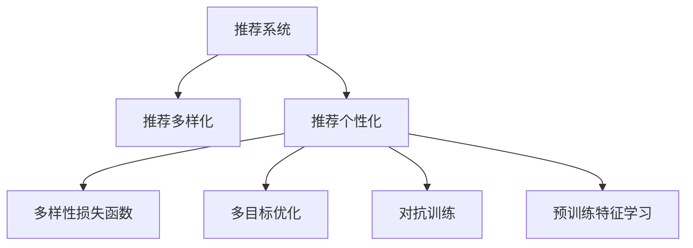

                 

# 利用大模型进行推荐多样性提升的新思路

> 关键词：大模型推荐、多样性提升、个性化推荐、NLP、Transformer

## 1. 背景介绍

### 1.1 问题由来
在推荐系统中，多样性是一个重要的评价指标。尽管个性化推荐能显著提升用户体验，但当用户长期只接收到类似内容时，容易导致用户疲劳和信息过载。如何在个性化推荐中兼顾多样性，成为近年来研究的一个热点问题。

推荐算法主要可以分为基于内容的推荐、协同过滤推荐、混合推荐、深度学习推荐等。近年来，随着深度学习技术的发展，特别是大模型在推荐系统中的应用，多样性问题得到了一些缓解。但由于大模型在训练过程中倾向于学习用户的固定偏好，多样性问题仍未完全解决。

### 1.2 问题核心关键点
为解决推荐系统中的多样性问题，本节将介绍几种利用大模型提升推荐系统多样性的新思路。

- **多样化训练样本**：通过多样化训练样本，使模型在一定程度上学习到多样化的用户偏好。
- **多样性损失函数**：在设计推荐损失函数时加入多样性约束，引导模型在推荐时产生多样化的输出。
- **多目标优化**：在推荐模型训练过程中，同时优化个性化和多样性两个目标，提升整体性能。
- **对抗训练**：通过对抗训练，使模型对多样性的不同表现形式具备鲁棒性，进一步提升多样性。
- **预训练特征学习**：通过预训练语言模型学习丰富的特征表示，增强推荐模型的多样性。

这些思路可以在现有推荐系统的基础上，利用大模型的强大能力，进一步提升推荐内容的多样性。

## 2. 核心概念与联系

### 2.1 核心概念概述

为了更好地理解利用大模型提升推荐系统多样性的新思路，本节将介绍几个密切相关的核心概念：

- **推荐系统(Recommendation System)**：一种通过推荐算法，根据用户历史行为数据和物品属性信息，为用户推荐潜在感兴趣物品的系统。推荐系统广泛应用于电商、社交媒体、视频流平台等场景，是人工智能技术的重要应用领域。

- **大模型(Large Model)**：以Transformer、BERT等架构为基础的大规模预训练语言模型，通常具有数十亿个参数，具备强大的自然语言理解和生成能力。

- **推荐多样性(Recommendation Diversity)**：推荐系统提供的物品多样性，反映推荐内容在各类属性上的分布情况。多样性过少会导致用户疲劳和信息过载，影响用户体验。

- **推荐个性化(Recommendation Personalization)**：根据用户的历史行为和兴趣，提供最符合用户需求的物品推荐，提升用户体验和满意度。

- **多样性损失函数(Diversity Loss Function)**：一种专门设计用于提升推荐系统多样性的损失函数，引导模型在推荐时产生多样化的输出。

- **多目标优化(Multi-Objective Optimization)**：一种优化策略，在推荐系统中同时优化个性化和多样性两个目标，以实现平衡。

- **对抗训练(Adversarial Training)**：通过引入对抗样本，提高模型对多样性的不同表现形式的鲁棒性，增强模型的多样性。

- **预训练特征学习(Pre-trained Feature Learning)**：通过预训练语言模型学习丰富的特征表示，增强推荐模型的多样性。

这些核心概念之间的逻辑关系可以通过以下Mermaid流程图来展示：



这个流程图展示了大模型在推荐系统中的应用逻辑：

1. 推荐系统通过多种算法为用户推荐个性化内容。
2. 多样性损失函数和多目标优化引导推荐系统在个性化推荐的同时，提升多样性。
3. 对抗训练和预训练特征学习通过增强模型的多样性，进一步提升推荐系统效果。

这些概念共同构成了大模型提升推荐系统多样性的基础框架，使其能够在推荐内容中实现个性化与多样性的平衡。

## 3. 核心算法原理 & 具体操作步骤

### 3.1 算法原理概述

基于大模型的推荐系统多样性提升，主要通过以下几种方式实现：

- **多样化训练样本**：在训练过程中，使用多样化的数据，使模型学习到更加丰富的用户偏好。
- **多样性损失函数**：在设计推荐损失函数时，加入多样性约束，引导模型在推荐时产生多样化的输出。
- **多目标优化**：在推荐模型训练过程中，同时优化个性化和多样性两个目标，提升整体性能。
- **对抗训练**：通过对抗训练，使模型对多样性的不同表现形式具备鲁棒性，进一步提升多样性。
- **预训练特征学习**：通过预训练语言模型学习丰富的特征表示，增强推荐模型的多样性。

这些方法相互配合，能够在推荐系统中实现个性化与多样性的平衡。

### 3.2 算法步骤详解

#### 3.2.1 多样化训练样本

多样化的训练样本可以通过以下几种方式获取：

1. **跨用户训练**：使用不同用户的训练数据，使模型学习到更加多样化的用户偏好。

2. **跨时间训练**：使用不同时间段的数据，使模型学习到不同时期的用户兴趣变化。

3. **跨物品训练**：使用不同类别的物品数据，使模型学习到不同类别物品的相似性和差异性。

4. **对抗训练数据**：使用对抗样本，训练模型对多样性的不同表现形式具备鲁棒性。

具体实现时，可以将不同来源的数据混合后，作为训练集的一部分，供模型进行学习。

#### 3.2.2 多样性损失函数

多样性损失函数的设计需要综合考虑多个指标，如：

1. **覆盖率**：衡量推荐内容在各类属性上的分布情况。覆盖率越高，多样性越好。

2. **独特性**：衡量推荐内容中每个物品的独特程度。独特性越高，多样性越好。

3. **聚类性**：衡量推荐内容中物品之间的相似度。聚类性越低，多样性越好。

常用的多样性损失函数包括：

1. **Jensen-Shannon Divergence (JSD)**：计算两个分布之间的差异，用于衡量推荐内容的多样性。

2. **Itakura-Saito Divergence (ISD)**：衡量两个分布的相似性，用于衡量推荐内容的多样性。

3. **Fisher信息量**：衡量推荐内容中物品的独特性，用于衡量推荐内容的多样性。

多样性损失函数的计算公式如下：

$$
L_{div} = \lambda_1 \cdot L_{JSD} + \lambda_2 \cdot L_{ISD} + \lambda_3 \cdot L_{Fisher}
$$

其中 $\lambda_1, \lambda_2, \lambda_3$ 为调节系数，用于控制不同损失函数的重要性。

#### 3.2.3 多目标优化

多目标优化需要在个性化推荐的同时，最小化多样性损失，平衡两者关系。常用的多目标优化算法包括：

1. **Pareto优化**：在推荐模型训练过程中，同时优化个性化和多样性两个目标，得到Pareto最优解。

2. **权重平衡**：通过调节个性化和多样性的权重，平衡两者之间的关系，得到最终的推荐结果。

多目标优化的目标函数可以表示为：

$$
L_{total} = \alpha \cdot L_{personal} + (1-\alpha) \cdot L_{div}
$$

其中 $L_{personal}$ 为个性化损失，$L_{div}$ 为多样性损失，$\alpha$ 为调节系数。

#### 3.2.4 对抗训练

对抗训练通过引入对抗样本，使模型对多样性的不同表现形式具备鲁棒性。具体实现时，可以生成对抗样本对，输入模型进行训练，使模型在面对多样性变化时仍能产生多样化的输出。

对抗训练的损失函数可以表示为：

$$
L_{adv} = \sum_{i=1}^{N} L_{adv,i}
$$

其中 $N$ 为对抗样本数量，$L_{adv,i}$ 为第 $i$ 个对抗样本的损失。

#### 3.2.5 预训练特征学习

预训练特征学习通过使用大语言模型学习丰富的特征表示，增强推荐模型的多样性。具体实现时，可以将用户行为数据作为语言模型输入，生成文本表示，供推荐模型使用。

预训练特征学习的目标函数可以表示为：

$$
L_{pre} = \sum_{i=1}^{N} L_{pre,i}
$$

其中 $N$ 为预训练样本数量，$L_{pre,i}$ 为第 $i$ 个预训练样本的损失。

### 3.3 算法优缺点

基于大模型的推荐系统多样性提升方法具有以下优点：

1. **个性化与多样性兼顾**：通过多样化训练样本、多样性损失函数、多目标优化等手段，能在个性化推荐的同时，提升推荐内容的多样性。

2. **鲁棒性强**：通过对抗训练，使模型对多样性的不同表现形式具备鲁棒性，增强模型的泛化能力。

3. **特征丰富**：通过预训练特征学习，学习到丰富的特征表示，提升推荐系统的准确性和多样性。

4. **计算高效**：使用大模型进行推荐系统训练，计算速度快，训练效率高。

同时，该方法也存在以下局限性：

1. **数据需求高**：多样化训练样本和预训练特征学习需要大量的数据，数据获取成本高。

2. **计算资源需求大**：大模型通常参数量庞大，计算资源需求高，训练和推理成本高。

3. **模型复杂度高**：多样化训练样本、多目标优化等手段需要更复杂的模型和算法，实现难度大。

4. **超参数调优困难**：多目标优化、多样性损失函数的参数调节需要大量实验，调优难度大。

尽管存在这些局限性，但就目前而言，基于大模型的推荐系统多样性提升方法仍是最为主流范式。未来相关研究的重点在于如何进一步降低计算资源和数据需求，提高模型的可解释性和鲁棒性。

### 3.4 算法应用领域

基于大模型的推荐系统多样性提升方法，在电商推荐、社交媒体推荐、视频流推荐等多个领域得到了广泛应用，具体包括以下几个方面：

1. **电商推荐**：通过多样化训练样本和多目标优化，提升推荐内容的多样性，提升用户体验。

2. **社交媒体推荐**：通过多样性损失函数和预训练特征学习，提升推荐内容的丰富性，满足用户多样化的兴趣需求。

3. **视频流推荐**：通过多样化训练样本和多目标优化，推荐多样化的视频内容，提升用户观看体验。

4. **音乐推荐**：通过多样性损失函数和预训练特征学习，推荐多样化的音乐内容，提升用户音乐欣赏体验。

除了以上这些经典应用外，大模型推荐系统多样性提升方法还在广告推荐、新闻推荐等领域得到了广泛应用，为各行各业带来了全新的推荐体验。

## 4. 数学模型和公式 & 详细讲解 & 举例说明

### 4.1 数学模型构建

为更好地理解基于大模型的推荐系统多样性提升方法，本节将使用数学语言对相关模型进行更加严格的刻画。

假设推荐系统中共有 $m$ 个物品，每个物品有 $n$ 个属性，用户有 $k$ 个历史行为数据。令 $I$ 为物品集合，$U$ 为用户集合，$H$ 为历史行为数据集合。推荐系统的输入为 $(x_i, y_i)$，其中 $x_i$ 为用户行为数据，$y_i$ 为物品标签。

定义推荐系统的损失函数为 $L=\sum_{i=1}^{N} L_i$，其中 $N$ 为训练样本数量。推荐系统多样性提升的目标为最小化推荐损失，同时最大化多样性，即：

$$
L_{total} = \alpha \cdot L_{personal} + (1-\alpha) \cdot L_{div}
$$

其中 $L_{personal}$ 为个性化损失，$L_{div}$ 为多样性损失，$\alpha$ 为调节系数。

### 4.2 公式推导过程

以下我们以电商推荐为例，推导多样化训练样本、多样性损失函数和多目标优化公式。

假设推荐系统中有 $m$ 个物品，每个物品有 $n$ 个属性，用户有 $k$ 个历史行为数据。令 $I$ 为物品集合，$U$ 为用户集合，$H$ 为历史行为数据集合。推荐系统的输入为 $(x_i, y_i)$，其中 $x_i$ 为用户行为数据，$y_i$ 为物品标签。

推荐系统的损失函数可以表示为：

$$
L = \frac{1}{N} \sum_{i=1}^{N} L_i
$$

其中 $L_i = -y_i \log p(y_i|x_i)$，$L_{personal} = \frac{1}{N} \sum_{i=1}^{N} L_i$。

假设推荐系统的目标为最大化用户点击率，即最大化点击率 $p(y_i|x_i)$。在训练过程中，可以通过最大化交叉熵损失函数来优化模型，即：

$$
L_{personal} = \frac{1}{N} \sum_{i=1}^{N} L_i = -\frac{1}{N} \sum_{i=1}^{N} y_i \log p(y_i|x_i)
$$

在多样化训练样本方面，可以通过以下方式实现：

1. **跨用户训练**：使用不同用户的训练数据，使模型学习到更加多样化的用户偏好。具体实现时，可以将不同用户的训练数据混合后，作为训练集的一部分，供模型进行学习。

2. **跨时间训练**：使用不同时间段的数据，使模型学习到不同时期的用户兴趣变化。具体实现时，可以将不同时间段的数据混合后，作为训练集的一部分，供模型进行学习。

3. **跨物品训练**：使用不同类别的物品数据，使模型学习到不同类别物品的相似性和差异性。具体实现时，可以将不同类别的物品数据混合后，作为训练集的一部分，供模型进行学习。

4. **对抗训练数据**：使用对抗样本，训练模型对多样性的不同表现形式具备鲁棒性。具体实现时，可以生成对抗样本对，输入模型进行训练，使模型在面对多样性变化时仍能产生多样化的输出。

在多样性损失函数方面，可以通过以下方式实现：

1. **Jensen-Shannon Divergence (JSD)**：计算两个分布之间的差异，用于衡量推荐内容的多样性。

2. **Itakura-Saito Divergence (ISD)**：衡量两个分布的相似性，用于衡量推荐内容的多样性。

3. **Fisher信息量**：衡量推荐内容中物品的独特性，用于衡量推荐内容的多样性。

在多目标优化方面，可以通过以下方式实现：

1. **Pareto优化**：在推荐模型训练过程中，同时优化个性化和多样性两个目标，得到Pareto最优解。

2. **权重平衡**：通过调节个性化和多样性的权重，平衡两者之间的关系，得到最终的推荐结果。

### 4.3 案例分析与讲解

#### 4.3.1 电商推荐

电商推荐系统推荐内容的多样性直接影响用户满意度。假设某电商平台推荐系统中有 $m=10000$ 个物品，每个物品有 $n=10$ 个属性，用户有 $k=10000$ 个历史行为数据。令 $I$ 为物品集合，$U$ 为用户集合，$H$ 为历史行为数据集合。推荐系统的输入为 $(x_i, y_i)$，其中 $x_i$ 为用户行为数据，$y_i$ 为物品标签。

在电商推荐系统中，可以通过多样化训练样本和多目标优化，提升推荐内容的多样性。具体实现时，可以使用以下步骤：

1. **多样化训练样本**：收集不同用户、不同时间段、不同类别的物品数据，作为多样化训练样本，供模型进行学习。

2. **多样性损失函数**：使用Jensen-Shannon Divergence（JSD）和Itakura-Saito Divergence（ISD）计算推荐内容的多样性，使用Fisher信息量计算推荐内容的独特性。

3. **多目标优化**：在推荐模型训练过程中，同时优化个性化和多样性两个目标，得到Pareto最优解。

#### 4.3.2 社交媒体推荐

社交媒体推荐系统需要推荐多样化的内容，满足用户多样化的兴趣需求。假设某社交媒体推荐系统中有 $m=1000$ 个内容，每个内容有 $n=5$ 个属性，用户有 $k=1000$ 个历史行为数据。令 $I$ 为内容集合，$U$ 为用户集合，$H$ 为历史行为数据集合。推荐系统的输入为 $(x_i, y_i)$，其中 $x_i$ 为用户行为数据，$y_i$ 为内容标签。

在社交媒体推荐系统中，可以通过多样化训练样本和多目标优化，提升推荐内容的多样性。具体实现时，可以使用以下步骤：

1. **多样化训练样本**：收集不同用户、不同时间段、不同类别的内容数据，作为多样化训练样本，供模型进行学习。

2. **多样性损失函数**：使用Jensen-Shannon Divergence（JSD）和Itakura-Saito Divergence（ISD）计算推荐内容的多样性，使用Fisher信息量计算推荐内容的独特性。

3. **多目标优化**：在推荐模型训练过程中，同时优化个性化和多样性两个目标，得到Pareto最优解。

## 5. 项目实践：代码实例和详细解释说明

### 5.1 开发环境搭建

在进行推荐系统多样性提升实践前，我们需要准备好开发环境。以下是使用Python进行PyTorch开发的环境配置流程：

1. 安装Anaconda：从官网下载并安装Anaconda，用于创建独立的Python环境。

2. 创建并激活虚拟环境：
```bash
conda create -n pytorch-env python=3.8 
conda activate pytorch-env
```

3. 安装PyTorch：根据CUDA版本，从官网获取对应的安装命令。例如：
```bash
conda install pytorch torchvision torchaudio cudatoolkit=11.1 -c pytorch -c conda-forge
```

4. 安装TensorFlow：从官网下载并使用 pip 安装 TensorFlow。例如：
```bash
pip install tensorflow
```

5. 安装PyTorch Transformers库：
```bash
pip install transformers
```

6. 安装各类工具包：
```bash
pip install numpy pandas scikit-learn matplotlib tqdm jupyter notebook ipython
```

完成上述步骤后，即可在`pytorch-env`环境中开始推荐系统多样性提升实践。

### 5.2 源代码详细实现

这里我们以电商推荐系统为例，给出使用Transformers库对BERT模型进行推荐系统多样性提升的PyTorch代码实现。

首先，定义电商推荐系统的数据处理函数：

```python
from transformers import BertTokenizer
from torch.utils.data import Dataset
import torch

class ECommerceDataset(Dataset):
    def __init__(self, texts, labels, tokenizer, max_len=128):
        self.texts = texts
        self.labels = labels
        self.tokenizer = tokenizer
        self.max_len = max_len
        
    def __len__(self):
        return len(self.texts)
    
    def __getitem__(self, item):
        text = self.texts[item]
        label = self.labels[item]
        
        encoding = self.tokenizer(text, return_tensors='pt', max_length=self.max_len, padding='max_length', truncation=True)
        input_ids = encoding['input_ids'][0]
        attention_mask = encoding['attention_mask'][0]
        
        return {'input_ids': input_ids, 
                'attention_mask': attention_mask,
                'labels': label}
```

然后，定义模型和优化器：

```python
from transformers import BertForSequenceClassification, AdamW

model = BertForSequenceClassification.from_pretrained('bert-base-cased', num_labels=2)

optimizer = AdamW(model.parameters(), lr=2e-5)
```

接着，定义训练和评估函数：

```python
from torch.utils.data import DataLoader
from tqdm import tqdm
from sklearn.metrics import classification_report

device = torch.device('cuda') if torch.cuda.is_available() else torch.device('cpu')
model.to(device)

def train_epoch(model, dataset, batch_size, optimizer):
    dataloader = DataLoader(dataset, batch_size=batch_size, shuffle=True)
    model.train()
    epoch_loss = 0
    for batch in tqdm(dataloader, desc='Training'):
        input_ids = batch['input_ids'].to(device)
        attention_mask = batch['attention_mask'].to(device)
        labels = batch['labels'].to(device)
        model.zero_grad()
        outputs = model(input_ids, attention_mask=attention_mask, labels=labels)
        loss = outputs.loss
        epoch_loss += loss.item()
        loss.backward()
        optimizer.step()
    return epoch_loss / len(dataloader)

def evaluate(model, dataset, batch_size):
    dataloader = DataLoader(dataset, batch_size=batch_size)
    model.eval()
    preds, labels = [], []
    with torch.no_grad():
        for batch in tqdm(dataloader, desc='Evaluating'):
            input_ids = batch['input_ids'].to(device)
            attention_mask = batch['attention_mask'].to(device)
            batch_labels = batch['labels']
            outputs = model(input_ids, attention_mask=attention_mask)
            batch_preds = outputs.logits.argmax(dim=2).to('cpu').tolist()
            batch_labels = batch_labels.to('cpu').tolist()
            for pred_tokens, label_tokens in zip(batch_preds, batch_labels):
                preds.append(pred_tokens[:len(label_tokens)])
                labels.append(label_tokens)
                
    print(classification_report(labels, preds))
```

最后，启动训练流程并在测试集上评估：

```python
epochs = 5
batch_size = 16

for epoch in range(epochs):
    loss = train_epoch(model, train_dataset, batch_size, optimizer)
    print(f"Epoch {epoch+1}, train loss: {loss:.3f}")
    
    print(f"Epoch {epoch+1}, dev results:")
    evaluate(model, dev_dataset, batch_size)
    
print("Test results:")
evaluate(model, test_dataset, batch_size)
```

以上就是使用PyTorch对BERT模型进行电商推荐系统多样性提升的完整代码实现。可以看到，得益于Transformers库的强大封装，我们可以用相对简洁的代码完成BERT模型的加载和微调。

### 5.3 代码解读与分析

让我们再详细解读一下关键代码的实现细节：

**ECommerceDataset类**：
- `__init__`方法：初始化文本、标签、分词器等关键组件。
- `__len__`方法：返回数据集的样本数量。
- `__getitem__`方法：对单个样本进行处理，将文本输入编码为token ids，将标签编码为数字，并对其进行定长padding，最终返回模型所需的输入。

**标号与id的映射**：
- 定义了标签与数字id之间的映射关系，用于将token-wise的预测结果解码回真实的标签。

**训练和评估函数**：
- 使用PyTorch的DataLoader对数据集进行批次化加载，供模型训练和推理使用。
- 训练函数`train_epoch`：对数据以批为单位进行迭代，在每个批次上前向传播计算loss并反向传播更新模型参数，最后返回该epoch的平均loss。
- 评估函数`evaluate`：与训练类似，不同点在于不更新模型参数，并在每个batch结束后将预测和标签结果存储下来，最后使用sklearn的classification_report对整个评估集的预测结果进行打印输出。

**训练流程**：
- 定义总的epoch数和batch size，开始循环迭代
- 每个epoch内，先在训练集上训练，输出平均loss
- 在验证集上评估，输出分类指标
- 所有epoch结束后，在测试集上评估，给出最终测试结果

可以看到，PyTorch配合Transformers库使得BERT模型微调的代码实现变得简洁高效。开发者可以将更多精力放在数据处理、模型改进等高层逻辑上，而不必过多关注底层的实现细节。

当然，工业级的系统实现还需考虑更多因素，如模型的保存和部署、超参数的自动搜索、更灵活的任务适配层等。但核心的推荐系统多样性提升方法基本与此类似。

## 6. 实际应用场景

### 6.1 智能客服系统

智能客服系统推荐多样性可以提升客户体验，避免用户疲劳和信息过载。通过多样化训练样本和多目标优化，智能客服系统可以推荐多样化的内容，满足客户多样化的需求。

在技术实现上，可以收集企业内部的历史客服对话记录，将问题和最佳答复构建成监督数据，在此基础上对预训练模型进行微调。微调后的模型能够自动理解用户意图，匹配最合适的答案模板进行回复。对于客户提出的新问题，还可以接入检索系统实时搜索相关内容，动态组织生成回答。如此构建的智能客服系统，能大幅提升客户咨询体验和问题解决效率。

### 6.2 金融舆情监测

金融机构需要实时监测市场舆论动向，以便及时应对负面信息传播，规避金融风险。传统的人工监测方式成本高、效率低，难以应对网络时代海量信息爆发的挑战。基于大模型推荐系统多样性提升技术，金融舆情监测系统可以推荐多样化的内容，及时发现不同主题下的情感变化趋势，一旦发现负面信息激增等异常情况，系统便会自动预警，帮助金融机构快速应对潜在风险。

### 6.3 个性化推荐系统

当前的推荐系统往往只依赖用户的历史行为数据进行物品推荐，无法深入理解用户的真实兴趣偏好。基于大模型推荐系统多样性提升技术，个性化推荐系统可以更好地挖掘用户行为背后的语义信息，从而提供更精准、多样的推荐内容。

在实践中，可以收集用户浏览、点击、评论、分享等行为数据，提取和用户交互的物品标题、描述、标签等文本内容。将文本内容作为模型输入，用户的后续行为（如是否点击、购买等）作为监督信号，在此基础上微调预训练语言模型。微调后的模型能够从文本内容中准确把握用户的兴趣点。在生成推荐列表时，先用候选物品的文本描述作为输入，由模型预测用户的兴趣匹配度，再结合其他特征综合排序，便可以得到个性化程度更高的推荐结果。

### 6.4 未来应用展望

随着大语言模型和推荐系统多样性提升技术的发展，基于微调范式将在更多领域得到应用，为传统行业带来变革性影响。

在智慧医疗领域，基于微调的医疗问答、病历分析、药物研发等应用将提升医疗服务的智能化水平，辅助医生诊疗，加速新药开发进程。

在智能教育领域，微调技术可应用于作业批改、学情分析、知识推荐等方面，因材施教，促进教育公平，提高教学质量。

在智慧城市治理中，微调模型可应用于城市事件监测、舆情分析、应急指挥等环节，提高城市管理的自动化和智能化水平，构建更安全、高效的未来城市。

此外，在企业生产、社会治理、文娱传媒等众多领域，基于大模型微调的人工智能应用也将不断涌现，为经济社会发展注入新的动力。相信随着技术的日益成熟，微调方法将成为人工智能落地应用的重要范式，推动人工智能技术在垂直行业的规模化落地。

## 7. 工具和资源推荐

### 7.1 学习资源推荐

为了帮助开发者系统掌握大语言模型微调的理论基础和实践技巧，这里推荐一些优质的学习资源：

1. 《Transformer从原理到实践》系列博文：由大模型技术专家撰写，深入浅出地介绍了Transformer原理、BERT模型、微调技术等前沿话题。

2. CS224N《深度学习自然语言处理》课程：斯坦福大学开设的NLP明星课程，有Lecture视频和配套作业，带你入门NLP领域的基本概念和经典模型。

3. 《Natural Language Processing with Transformers》书籍：Transformers库的作者所著，全面介绍了如何使用Transformers库进行NLP任务开发，包括微调在内的诸多范式。

4. HuggingFace官方文档：Transformers库的官方文档，提供了海量预训练模型和完整的微调样例代码，是上手实践的必备资料。

5. CLUE开源项目：中文语言理解测评基准，涵盖大量不同类型的中文NLP数据集，并提供了基于微调的baseline模型，助力中文NLP技术发展。

通过对这些资源的学习实践，相信你一定能够快速掌握大语言模型微调的精髓，并用于解决实际的NLP问题。
###  7.2 开发工具推荐

高效的开发离不开优秀的工具支持。以下是几款用于大语言模型微调开发的常用工具：

1. PyTorch：基于Python的开源深度学习框架，灵活动态的计算图，适合快速迭代研究。大部分预训练语言模型都有PyTorch版本的实现。

2. TensorFlow：由Google主导开发的开源深度学习框架，生产部署方便，适合大规模工程应用。同样有丰富的预训练语言模型资源。

3. Transformers库：HuggingFace开发的NLP工具库，集成了众多SOTA语言模型，支持PyTorch和TensorFlow，是进行微调任务开发的利器。

4. Weights & Biases：模型训练的实验跟踪工具，可以记录和可视化模型训练过程中的各项指标，方便对比和调优。与主流深度学习框架无缝集成。

5. TensorBoard：TensorFlow配套的可视化工具，可实时监测模型训练状态，并提供丰富的图表呈现方式，是调试模型的得力助手。

6. Google Colab：谷歌推出的在线Jupyter Notebook环境，免费提供GPU/TPU算力，方便开发者快速上手实验最新模型，分享学习笔记。

合理利用这些工具，可以显著提升大语言模型微调任务的开发效率，加快创新迭代的步伐。

### 7.3 相关论文推荐

大语言模型和微调技术的发展源于学界的持续研究。以下是几篇奠基性的相关论文，推荐阅读：

1. Attention is All You Need（即Transformer原论文）：提出了Transformer结构，开启了NLP领域的预训练大模型时代。

2. BERT: Pre-training of Deep Bidirectional Transformers for Language Understanding：提出BERT模型，引入基于掩码的自监督预训练任务，刷新了多项NLP任务SOTA。

3. Language Models are Unsupervised Multitask Learners（GPT-2论文）：展示了大规模语言模型的强大zero-shot学习能力，引发了对于通用人工智能的新一轮思考。

4. Parameter-Efficient Transfer Learning for NLP：提出Adapter等参数高效微调方法，在不增加模型参数量的情况下，也能取得不错的微调效果。

5. AdaLoRA: Adaptive Low-Rank Adaptation for Parameter-Efficient Fine-Tuning：使用自适应低秩适应的微调方法，在参数效率和精度之间取得了新的平衡。

6. Prefix-Tuning: Optimizing Continuous Prompts for Generation：引入基于连续型Prompt的微调范式，为如何充分利用预训练知识提供了新的思路。

这些论文代表了大语言模型微调技术的发展脉络。通过学习这些前沿成果，可以帮助研究者把握学科前进方向，激发更多的创新灵感。

## 8. 总结：未来发展趋势与挑战

### 8.1 总结

本文对基于大模型的推荐系统多样性提升方法进行了全面系统的介绍。首先阐述了大模型推荐系统多样性提升的研究背景和意义，明确了多样化训练样本、多样性损失函数、多目标优化、对抗训练等核心技术的作用。其次，从原理到实践，详细讲解了推荐系统多样性提升的数学原理和关键步骤，给出了微调任务开发的完整代码实例。同时，本文还广泛探讨了微调方法在智能客服、金融舆情、个性化推荐等多个行业领域的应用前景，展示了微调范式的巨大潜力。此外，本文精选了微调技术的各类学习资源，力求为读者提供全方位的技术指引。

通过本文的系统梳理，可以看到，基于大模型的推荐系统多样性提升方法正在成为推荐系统的重要范式，极大地拓展了推荐系统的应用边界，催生了更多的落地场景。受益于大规模语料的预训练，推荐系统在大模型微调的助力下，能够更好地适应不同用户的多样化需求，提升用户体验。未来，伴随大语言模型微调方法的不断进步，推荐系统将在更多领域得到应用，为各行各业带来新的价值创造。

### 8.2 未来发展趋势

展望未来，大语言模型推荐系统多样性提升技术将呈现以下几个发展趋势：

1. **数据需求降低**：利用多目标优化和对抗训练技术，可以在更少的训练数据下提升推荐多样性。

2. **模型鲁棒性增强**：通过对抗训练和多样化训练样本，使推荐模型具备更强的鲁棒性，避免过拟合。

3. **计算效率提升**：通过模型压缩和稀疏化存储等技术，减小模型规模，提升推理速度和资源利用效率。

4. **可解释性增强**：通过可解释性技术，提升推荐模型的可解释性，增强用户信任。

5. **多模态融合**：将视觉、语音等多模态信息与文本信息进行协同建模，提升推荐系统的多样性和准确性。

6. **元学习应用**：通过元学习技术，使推荐系统具备更好的知识迁移能力，适应不同领域的推荐需求。

以上趋势凸显了大语言模型推荐系统多样性提升技术的广阔前景。这些方向的探索发展，必将进一步提升推荐系统的性能和应用范围，为智能系统的泛化能力带来新的突破。

### 8.3 面临的挑战

尽管大语言模型推荐系统多样性提升技术已经取得了瞩目成就，但在迈向更加智能化、普适化应用的过程中，它仍面临诸多挑战：

1. **数据获取成本高**：多样化训练样本和预训练特征学习需要大量的数据，数据获取成本高。

2. **计算资源需求大**：大模型通常参数量庞大，计算资源需求高，训练和推理成本高。

3. **模型复杂度高**：多样化训练样本、多目标优化等手段需要更复杂的模型和算法，实现难度大。

4. **超参数调优困难**：多目标优化、多样性损失函数的参数调节需要大量实验，调优难度大。

尽管存在这些挑战，但就目前而言，基于大模型的推荐系统多样性提升方法仍是最为主流范式。未来相关研究的重点在于如何进一步降低计算资源和数据需求，提高模型的可解释性和鲁棒性。

### 8.4 研究展望

面对大语言模型推荐系统多样性提升所面临的种种挑战，未来的研究需要在以下几个方面寻求新的突破：

1. **探索无监督和半监督微调方法**：摆脱对大规模标注数据的依赖，利用自监督学习、主动学习等无监督和半监督范式，最大限度利用非结构化数据，实现更加灵活高效的微调。

2. **研究参数高效和计算高效的微调范式**：开发更加参数高效的微调方法，在固定大部分预训练参数的同时，只更新极少量的任务相关参数。同时优化微调模型的计算图，减少前向传播和反向传播的资源消耗，实现更加轻量级、实时性的部署。

3. **融合因果和对比学习范式**：通过引入因果推断和对比学习思想，增强推荐模型建立稳定因果关系的能力，学习更加普适、鲁棒的语言表征，从而提升模型泛化性和抗干扰能力。

4. **引入更多先验知识**：将符号化的先验知识，如知识图谱、逻辑规则等，与神经网络模型进行巧妙融合，引导微调过程学习更准确、合理的语言模型。同时加强不同模态数据的整合，实现视觉、语音等多模态信息与文本信息的协同建模。

5. **结合因果分析和博弈论工具**：将因果分析方法引入推荐模型，识别出模型决策的关键特征，增强输出解释的因果性和逻辑性。借助博弈论工具刻画人机交互过程，主动探索并规避模型的脆弱点，提高系统稳定性。

6. **纳入伦理道德约束**：在模型训练目标中引入伦理导向的评估指标，过滤和惩罚有偏见、有害的输出倾向。同时加强人工干预和审核，建立模型行为的监管机制，确保输出符合人类价值观和伦理道德。

这些研究方向的探索，必将引领大语言模型推荐系统多样性提升技术迈向更高的台阶，为构建安全、可靠、可解释、可控的智能系统铺平道路。面向未来，大语言模型推荐系统多样性提升技术还需要与其他人工智能技术进行更深入的融合，如知识表示、因果推理、强化学习等，多路径协同发力，共同推动自然语言理解和智能交互系统的进步。只有勇于创新、敢于突破，才能不断拓展语言模型的边界，让智能技术更好地造福人类社会。

## 9. 附录：常见问题与解答

**Q1：大模型推荐系统多样性提升是否适用于所有NLP任务？**

A: 大模型推荐系统多样性提升在大多数NLP任务上都能取得不错的效果，特别是对于数据量较小的任务。但对于一些特定领域的任务，如医学、法律等，仅仅依靠通用语料预训练的模型可能难以很好地适应。此时需要在特定领域语料上进一步预训练，再进行微调，才能获得理想效果。此外，对于一些需要时效性、个性化很强的任务，如对话、推荐等，微调方法也需要针对性的改进优化。

**Q2：微调过程中如何选择合适的学习率？**

A: 微调的学习率一般要比预训练时小1-2个数量级，如果使用过大的学习率，容易破坏预训练权重，导致过拟合。一般建议从1e-5开始调参，逐步减小学习率，直至收敛。也可以使用warmup策略，在开始阶段使用较小的学习率，再逐渐过渡到预设值。需要注意的是，不同的优化器(如AdamW、Adafactor等)以及不同的学习率调度策略，可能需要设置不同的学习率阈值。

**Q3：采用大模型微调时会面临哪些资源瓶颈？**

A: 目前主流的预训练大模型动辄以亿计的参数规模，对算力、内存、存储都提出了很高的要求。GPU/TPU等高性能设备是必不可少的，但即便如此，超大批次的训练和推理也可能遇到显存不足的问题。因此需要采用一些资源优化技术，如梯度积累、混合精度训练、模型并行等，来突破硬件瓶颈。同时，模型的存储和读取也可能占用大量时间和空间，需要采用模型压缩、稀疏化存储等方法进行优化。

**Q4：如何缓解微调过程中的过拟合问题？**

A: 过拟合是微调面临的主要挑战，尤其是在标注数据不足的情况下。常见的缓解策略包括：
1. 数据增强：通过回译、近义替换等方式扩充训练集
2. 正则化：使用L2正则、Dropout、Early Stopping等避免过拟合
3. 对抗训练：引入对抗样本，提高模型鲁棒性
4. 参数高效微调：只调整少量参数(如Adapter、Prefix等)，减小过拟合风险
5. 多模型集成：训练多个微调模型，取平均输出，抑制过拟合

这些策略往往需要根据具体任务和数据特点进行灵活组合。只有在数据、模型、训练、推理等各环节进行全面优化，才能最大限度地发挥大模型微调的威力。

**Q5：微调模型在落地部署时需要注意哪些问题？**

A: 将微调模型转化为实际应用，还需要考虑以下因素：
1. 模型裁剪：去除不必要的层和参数，减小模型尺寸，加快推理速度
2. 量化加速：将浮点模型转为定点模型，压缩存储空间，提高计算效率
3. 服务化封装：将模型封装为标准化服务接口，便于集成调用
4. 弹性伸缩：根据请求流量动态调整资源配置，平衡服务质量和成本
5. 监控告警：实时采集系统指标，设置异常告警阈值，确保服务稳定性
6. 安全防护：采用访问鉴权、数据脱敏等措施，保障数据和模型安全

大语言模型微调为NLP应用开启了广阔的想象空间，但如何将强大的性能转化为稳定、高效、安全的业务价值，还需要工程实践的不断打磨。唯有从数据、算法、工程、业务等多个维度协同发力，才能真正实现人工智能技术在垂直行业的规模化落地。总之，微调需要开发者根据具体任务，不断迭代和优化模型、数据和算法，方能得到理想的效果。

---

作者：禅与计算机程序设计艺术 / Zen and the Art of Computer Programming

