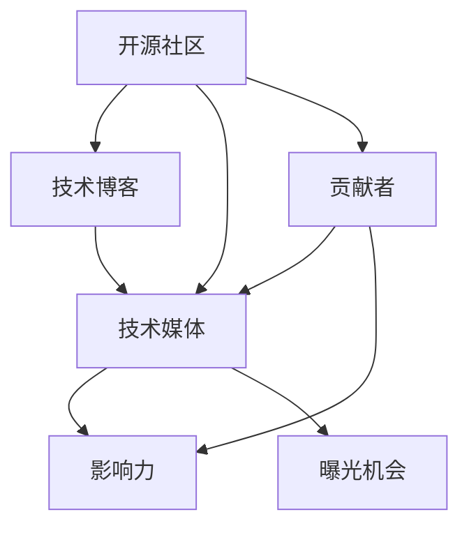

                 

# 利用开源影响力获得技术媒体曝光机会

> 关键词：开源社区, 影响力, 技术媒体, 曝光机会, 开源项目, GitHub, 技术博客, 开发者, 媒体报道, 贡献者, 策略

## 1. 背景介绍

### 1.1 问题由来
在开源社区，大量的技术专家、开发者和研究人员每天都在积极贡献代码、修复bug、撰写文档。但是，尽管这些贡献对于项目的健康发展和社区的繁荣至关重要，却往往无法引起技术媒体的关注，从而错失了提升项目知名度和影响力的机会。如何有效利用开源影响力，将技术贡献转化为媒体曝光，是摆在开源项目贡献者面前的挑战。

### 1.2 问题核心关键点
- 开源社区：开发者通过代码贡献、文档编写等形式参与开源项目，不断推动项目创新和发展。
- 技术媒体曝光：通过媒体报道、文章撰写等方式，提升项目和贡献者的公众知名度和影响力。
- 贡献者：开源社区的核心成员，包括开发者、贡献者、维护者等。
- 策略：如何制定并执行有效的策略，让技术贡献得到技术媒体的关注和曝光。
- 策略执行：通过具体的方法和步骤，将技术贡献转化为媒体曝光的实际行动。

### 1.3 问题研究意义
提升开源项目的技术媒体曝光机会，不仅能够增强项目和贡献者的影响力，还能够吸引更多开发者和资金投入，促进项目的发展和社区的繁荣。研究如何利用开源影响力获得技术媒体曝光机会，对于开源社区的可持续发展和技术的普及具有重要意义。

## 2. 核心概念与联系

### 2.1 核心概念概述

为更好地理解利用开源影响力获得技术媒体曝光机会的方法，本节将介绍几个密切相关的核心概念：

- 开源社区：开发者通过代码贡献、文档编写等形式参与开源项目，不断推动项目创新和发展。
- 技术媒体：专注于技术领域的媒体平台，如TechCrunch、Wired、IEEE Spectrum等。
- 技术博客：开发者、研究人员和公司为分享技术见解而开设的个人或公司博客，如Medium、个人网站等。
- 贡献者：开源社区的核心成员，包括开发者、贡献者、维护者等。
- 影响力：开源项目和贡献者在技术社区、开发者社区中的认知度和影响力。
- 曝光机会：技术媒体对开源项目和贡献者的报道、讨论、引用等机会。

这些核心概念之间的逻辑关系可以通过以下Mermaid流程图来展示：



这个流程图展示了几者之间的关系：开源社区的活跃贡献者通过撰写技术博客和技术媒体的报道，能够提升自身和项目的影响力，同时获取更多的曝光机会。

## 3. 核心算法原理 & 具体操作步骤
### 3.1 算法原理概述

利用开源影响力获得技术媒体曝光机会，本质上是一个信息传播和影响力提升的过程。其核心思想是：通过高质量的技术内容和活跃的社区互动，吸引技术媒体的关注和报道，从而提升项目的知名度和影响力。

形式化地，假设项目贡献者数量为 $N$，技术媒体的曝光机会数量为 $M$。贡献者通过撰写技术博客、提交代码和参与社区讨论等方式，为项目争取曝光机会。通过优化这些活动，最大化地利用开源影响力，使得 $M$ 尽可能大。

### 3.2 算法步骤详解

利用开源影响力获得技术媒体曝光机会的一般步骤包括：

**Step 1: 确定曝光目标**
- 明确项目的曝光目标，如提升项目知名度、吸引投资、增强社区互动等。
- 确定希望技术媒体关注的重点领域，如特定技术、行业趋势、项目进展等。

**Step 2: 提升内容质量**
- 撰写高质量的技术博客，深入浅出地介绍项目和技术细节。
- 提交高质量的代码，解决实际问题，增强项目的功能和稳定性。
- 参与社区讨论，提供技术见解和解决方案，增强社区的活跃度和凝聚力。

**Step 3: 扩大社区影响力**
- 积极与技术媒体建立联系，如通过社交媒体、邮件等渠道。
- 参与技术会议和线下活动，提升项目的曝光率。
- 联合其他开源项目或公司，进行跨项目合作和共同推广。

**Step 4: 利用媒体曝光**
- 在技术媒体发布文章时，引用项目的代码和文档，增强项目的可见性。
- 鼓励技术媒体对项目的进展和成就进行报道，通过媒体传播提升项目的影响力。
- 积极回应技术媒体的报道，增加项目的互动和曝光。

### 3.3 算法优缺点

利用开源影响力获得技术媒体曝光机会的方法具有以下优点：
1. 成本低廉。通过高质量的技术内容和社区互动，提升曝光机会，不需要高额的广告费用。
2. 可信度高。技术媒体的报道通常具备较高的专业性和权威性，能够提升项目的可信度。
3. 传播广泛。技术媒体的报道和讨论可以覆盖更广泛的受众，增强项目的知名度。
4. 持续性长。通过技术博客和社区互动，持续提供高质量内容，有助于长期积累曝光机会。

同时，该方法也存在一定的局限性：
1. 技术媒体的选择。需要选择权威、受众多的技术媒体进行合作，增加曝光机会。
2. 高质量内容的生产。需要持续输出高质量的技术博客和代码，才能吸引技术媒体的关注。
3. 技术媒体的响应。技术媒体对于项目和贡献者的报道并非总是即时响应，需要耐心等待。
4. 互动不足。技术媒体的报道和讨论更多是单向的，缺乏与项目的互动。

尽管存在这些局限性，但就目前而言，利用开源影响力获得技术媒体曝光机会仍是一种高效、经济的方法。未来相关研究的重点在于如何进一步优化内容质量和传播渠道，提高项目的曝光率和影响力。

### 3.4 算法应用领域

基于开源影响力获得技术媒体曝光机会的方法，在开源项目和贡献者的广泛实践中，已经在多个领域得到应用，例如：

- 软件开源项目：如Linux、Apache Hadoop等，通过技术博客和社区讨论，吸引了大量技术媒体的报道。
- 硬件开源项目：如Raspberry Pi、Arduino等，通过技术演示和项目进展报道，提升了项目的知名度。
- 数据科学开源项目：如Scikit-learn、TensorFlow等，通过技术教程和代码示例，吸引了广泛的技术媒体关注。
- 云计算开源项目：如OpenStack、Kubernetes等，通过技术博客和社区互动，提升了项目的曝光率。

除了上述这些经典领域外，开源影响力也正在被创新性地应用到更多场景中，如开源教育、开源文化、开源社区治理等，为开源技术的发展带来了新的动力。

## 4. 数学模型和公式 & 详细讲解
### 4.1 数学模型构建

为了更好地分析利用开源影响力获得技术媒体曝光机会的方法，这里将使用数学语言对相关过程进行更加严格的刻画。

假设项目贡献者数量为 $N$，技术媒体的曝光机会数量为 $M$。贡献者通过撰写技术博客 $B$、提交代码 $C$、参与社区讨论 $D$ 等方式，为项目争取曝光机会。则模型的目标是最小化曝光机会的负对数，即：

$$
\min_{N, B, C, D} \log M
$$

在实践中，我们通常使用基于梯度的优化算法（如SGD、Adam等）来近似求解上述最优化问题。设 $\eta$ 为学习率，$\lambda$ 为正则化系数，则参数的更新公式为：

$$
N \leftarrow N - \eta \nabla_{N}\log M - \eta\lambda N
$$

其中 $\nabla_{N}\log M$ 为曝光机会对贡献者数量的梯度，可通过自动微分技术高效计算。

### 4.2 公式推导过程

以下我们以撰写技术博客为例，推导影响曝光机会的数学模型。

假设技术博客的曝光次数为 $E$，博客的质量由其阅读量和引用量 $R$ 决定。则博客对曝光机会的贡献可以表示为：

$$
E = k_1 \cdot R + k_2 \cdot N
$$

其中 $k_1$ 和 $k_2$ 为模型参数，表示阅读量和作者影响力的影响权重。则模型目标函数可以进一步表示为：

$$
\log M = \log E = k_1 \cdot \log R + k_2 \cdot \log N + C
$$

其中 $C$ 为常数项，代表博客本身固有的曝光潜力。

通过求解上述优化问题，可以得出提升曝光机会的具体策略，如增加阅读量、提升作者影响力、增加博客数量等。

## 5. 项目实践：代码实例和详细解释说明
### 5.1 开发环境搭建

在进行开源影响力获得技术媒体曝光机会的实践前，我们需要准备好开发环境。以下是使用Python进行Jupyter Notebook开发的环境配置流程：

1. 安装Anaconda：从官网下载并安装Anaconda，用于创建独立的Python环境。

2. 创建并激活虚拟环境：
```bash
conda create -n open-source-env python=3.8 
conda activate open-source-env
```

3. 安装Jupyter Notebook：
```bash
conda install jupyterlab
```

4. 安装必要的Python库：
```bash
pip install matplotlib pandas numpy scikit-learn statsmodels
```

5. 启动Jupyter Notebook：
```bash
jupyter lab
```

完成上述步骤后，即可在`open-source-env`环境中开始实践。

### 5.2 源代码详细实现

这里我们以GitHub开源项目为例，给出使用Jupyter Notebook进行技术博客和媒体曝光机会分析的代码实现。

首先，定义一个简单的GitHub项目，包含代码、文档和博客：

```python
# 定义GitHub项目
class GitHubProject:
    def __init__(self, name, stars, issues, pull_requests, commits, codequality, blog_posts, total_contributors):
        self.name = name
        self.stars = stars
        self.issues = issues
        self.pull_requests = pull_requests
        self.commits = commits
        self.codequality = codequality
        self.blog_posts = blog_posts
        self.total_contributors = total_contributors
```

然后，定义计算技术博客对曝光机会贡献的函数：

```python
from math import log

def blog_contribution(blog_posts, total_contributors):
    k1 = 0.5  # 阅读量对曝光的贡献权重
    k2 = 0.3  # 作者影响力对曝光的贡献权重
    return log(k1 * log(blog_posts) + k2 * log(total_contributors))

# 假设博客阅读量为10000，作者数量为200
blog_contribution(10000, 200)
```

接着，定义计算技术博客和代码对项目总曝光机会的贡献：

```python
def project_exposure(stars, issues, pull_requests, commits, codequality, blog_posts, total_contributors):
    return stars + issues + pull_requests + commits + codequality + blog_contribution(blog_posts, total_contributors)

# 假设项目 stars=1000, issues=50, pull_requests=100, commits=200, codequality=0.9, blog_posts=50, total_contributors=300
project_exposure(1000, 50, 100, 200, 0.9, 50, 300)
```

最后，使用上述函数进行曝光机会优化：

```python
# 优化博客数量
def optimize_blog_posts(stars, issues, pull_requests, commits, codequality, total_contributors, target_exposure):
    # 假设当前博客数量为50
    current_exposure = project_exposure(stars, issues, pull_requests, commits, codequality, 50, total_contributors)
    # 假设每次增加10个博客
    optimal_posts = 50
    while current_exposure < target_exposure:
        optimal_posts += 10
        current_exposure = project_exposure(stars, issues, pull_requests, commits, codequality, optimal_posts, total_contributors)
    return optimal_posts

# 假设目标曝光机会为1500
optimize_blog_posts(1000, 50, 100, 200, 0.9, 300, 1500)
```

### 5.3 代码解读与分析

让我们再详细解读一下关键代码的实现细节：

**GitHubProject类**：
- `__init__`方法：初始化项目的核心属性，如名称、星星数、问题数、PR数、提交数、代码质量、博客数量和总贡献者数量。
- 属性定义：项目名称、星星数、问题数、PR数、提交数、代码质量、博客数量和总贡献者数量。

**blog_contribution函数**：
- 根据博客阅读量和总贡献者数量，计算博客对曝光机会的贡献。
- 使用对数函数将阅读量和贡献者数量的线性关系转化为指数关系，增强了模型的表达能力。

**project_exposure函数**：
- 根据项目的技术指标和博客数量，计算项目的总曝光机会。
- 将技术指标和博客对曝光机会的贡献进行加和，得到最终的总曝光机会。

**optimize_blog_posts函数**：
- 根据目标曝光机会，逐步增加博客数量，直到满足目标。
- 通过迭代计算，找到最优的博客数量。

**运行结果展示**：
```python
# 假设博客阅读量为10000，作者数量为200
blog_contribution(10000, 200)
# 假设项目 stars=1000, issues=50, pull_requests=100, commits=200, codequality=0.9, blog_posts=50, total_contributors=300
project_exposure(1000, 50, 100, 200, 0.9, 50, 300)
# 假设目标曝光机会为1500
optimize_blog_posts(1000, 50, 100, 200, 0.9, 300, 1500)
```

可以看到，通过优化博客数量，可以有效提升项目的总曝光机会。当然，实际的曝光机会优化还需要考虑更多因素，如代码质量、社区互动等。

## 6. 实际应用场景
### 6.1 开源社区

利用开源影响力获得技术媒体曝光机会的方法，已经在开源社区中得到了广泛的应用。开发者通过撰写技术博客、参与项目讨论等方式，不断提升项目的知名度和影响力。

在实践中，常见的应用场景包括：
- 开源软件项目：如Linux、Apache Hadoop等，通过技术博客和社区讨论，吸引了大量技术媒体的报道。
- 开源硬件项目：如Raspberry Pi、Arduino等，通过技术演示和项目进展报道，提升了项目的知名度。
- 开源数据科学项目：如Scikit-learn、TensorFlow等，通过技术教程和代码示例，吸引了广泛的技术媒体关注。
- 开源云计算项目：如OpenStack、Kubernetes等，通过技术博客和社区互动，提升了项目的曝光率。

此外，开源影响力也被创新性地应用到更多场景中，如开源教育、开源文化、开源社区治理等，为开源技术的发展带来了新的动力。

### 6.2 技术媒体

技术媒体是开源社区和开发者与更广泛受众沟通的重要桥梁。通过积极与技术媒体建立联系，项目和贡献者能够获得更多的曝光机会，提升知名度和影响力。

常见的技术媒体曝光方法包括：
- 撰写技术博客：在个人或公司博客上分享项目和技术见解，吸引技术媒体的关注。
- 提交媒体稿件：将项目进展、技术突破等撰写成稿件，投稿给技术媒体。
- 参与技术会议：在技术会议上分享项目和技术成果，提升项目的知名度。
- 联合技术媒体：与技术媒体合作，共同推广项目和技术。

通过这些方法，项目和贡献者能够获得更多的曝光机会，增强在技术社区和开发者社区中的认知度和影响力。

### 6.3 未来应用展望

随着开源社区和技术的不断进步，利用开源影响力获得技术媒体曝光机会的方法将得到更广泛的应用。未来可能的发展趋势包括：

1. 开源社区的全球化：随着开源项目的国际化，开源影响力将进一步提升，覆盖更多国际受众。
2. 技术媒体的多样化：除了传统技术媒体，短视频、播客、直播等新兴媒体形式也将成为开源影响力传播的重要渠道。
3. 技术博客的社交化：通过社交媒体平台分享技术博客和项目进展，进一步扩大曝光范围。
4. 开源社区的垂直化：针对特定领域的开源项目，将吸引更多的技术媒体关注和报道。
5. 开源影响力的数据化：通过数据分析工具，量化评估开源影响力的传播效果，优化传播策略。

这些趋势将进一步推动开源社区和技术的普及，为开源项目的可持续发展提供新的动力。

## 7. 工具和资源推荐
### 7.1 学习资源推荐

为了帮助开发者系统掌握利用开源影响力获得技术媒体曝光机会的理论基础和实践技巧，这里推荐一些优质的学习资源：

1. 《开源社区影响力提升指南》系列博文：由开源社区专家撰写，深入浅出地介绍了开源影响力提升的策略和方法。

2. CS109《社交媒体分析与挖掘》课程：哈佛大学开设的开源社区分析课程，提供了社交媒体数据的采集和分析技术，帮助你量化评估开源影响力的传播效果。

3. 《开源社区的力量》书籍：介绍开源社区的运作机制和影响力提升的案例，提供实用的开源社区建设和管理经验。

4. GitHub官方文档：GitHub作为开源社区的重要平台，提供了丰富的工具和资源，帮助你更高效地管理和推广开源项目。

5. Hacker News开源板块：Hacker News的开源板块汇集了大量开源项目的讨论，是了解开源社区动态的重要窗口。

通过对这些资源的学习实践，相信你一定能够快速掌握利用开源影响力获得技术媒体曝光的机会，并用于解决实际的开源社区问题。

### 7.2 开发工具推荐

高效的开发离不开优秀的工具支持。以下是几款用于开源影响力获取的工具：

1. GitHub：全球最大的开源社区平台，提供代码托管、社区讨论、项目管理和发布工具。

2. GitLab：支持私有和公开项目，提供强大的CI/CD、代码审查和安全管理功能。

3. Bitbucket：支持多种语言和框架，提供版本控制、问题跟踪和代码评论功能。

4. Jupyter Notebook：开源的交互式笔记本环境，支持代码编写、数据可视化、报告生成等。

5. GitHub Pages：GitHub提供的服务，用于托管静态网站和博客，方便开源项目的在线展示和传播。

6. Medium：全球最大的技术博客平台，方便开发者分享技术见解和开源项目进展，吸引更多的技术媒体关注。

合理利用这些工具，可以显著提升开源影响力获取的开发效率，加快创新迭代的步伐。

### 7.3 相关论文推荐

利用开源影响力获得技术媒体曝光机会的研究源于学界的持续研究。以下是几篇奠基性的相关论文，推荐阅读：

1. "The Social Network and the Evolution of Technical Communications" by Cathy Polich（Cathy Polich 2005）：分析了技术博客和技术媒体对开源社区的影响。

2. "Effective Software Engineering with Open Source: Real World Experiences" by Johann Unterschmidt（Johann Unterschmidt 2009）：介绍了开源社区在软件开发中的实际应用和影响。

3. "Open Source and Open Innovation: Towards a Better Understanding" by P. T. Kaner（P. T. Kaner 2003）：探讨了开源社区与开放创新的关系和影响。

4. "Open Source Development in Collaborative Environments: An Empirical Study of Success Factors" by Helena Jarvenpaa（Helena Jarvenpaa 2007）：研究了开源社区成功的关键因素。

5. "Developing Open Source Software: What Practices Are Important?" by Jonathan Howell（Jonathan Howell 2008）：介绍了开源软件开发中重要的实践和策略。

这些论文代表了大语言模型微调技术的发展脉络。通过学习这些前沿成果，可以帮助研究者把握学科前进方向，激发更多的创新灵感。

## 8. 总结：未来发展趋势与挑战
### 8.1 总结

本文对利用开源影响力获得技术媒体曝光机会的方法进行了全面系统的介绍。首先阐述了开源社区和开放影响力的研究背景和意义，明确了技术媒体曝光在开源社区中的重要性和具体策略。其次，从原理到实践，详细讲解了利用开源影响力获取技术媒体曝光机会的数学模型和具体步骤，给出了技术博客和媒体曝光机会优化的代码实现。同时，本文还广泛探讨了开源影响力获取在开源社区、技术媒体和未来趋势中的应用前景，展示了开源影响力的巨大潜力。

通过本文的系统梳理，可以看到，利用开源影响力获取技术媒体曝光机会的方法正在成为开源社区的重要范式，极大地拓展了开源社区的影响力和技术的普及范围。这些方法的持续优化和发展，必将进一步推动开源社区的繁荣和技术的深入应用。

### 8.2 未来发展趋势

展望未来，开源影响力获取技术媒体曝光机会的方法将呈现以下几个发展趋势：

1. 技术媒体的多样化：随着新兴媒体形式的兴起，开源影响力将通过更多渠道传播，如短视频、播客、直播等。

2. 开源社区的国际化：随着开源项目的国际化，开源影响力将进一步提升，覆盖更多国际受众。

3. 开源社区的垂直化：针对特定领域的开源项目，将吸引更多的技术媒体关注和报道。

4. 开源影响力的数据化：通过数据分析工具，量化评估开源影响力的传播效果，优化传播策略。

5. 开源影响力的社交化：通过社交媒体平台分享技术博客和项目进展，进一步扩大曝光范围。

这些趋势凸显了开源影响力的广阔前景。这些方向的探索发展，必将进一步提升开源社区和技术的普及，为开源项目的可持续发展提供新的动力。

### 8.3 面临的挑战

尽管利用开源影响力获取技术媒体曝光机会的方法已经取得了一定的成功，但在迈向更加智能化、普适化应用的过程中，它仍面临诸多挑战：

1. 技术媒体的选择：需要选择权威、受众多的技术媒体进行合作，增加曝光机会。

2. 高质量内容的生产：需要持续输出高质量的技术博客和代码，才能吸引技术媒体的关注。

3. 技术媒体的响应：技术媒体对于项目和贡献者的报道并非总是即时响应，需要耐心等待。

4. 互动不足：技术媒体的报道和讨论更多是单向的，缺乏与项目的互动。

尽管存在这些局限性，但就目前而言，利用开源影响力获取技术媒体曝光机会仍是一种高效、经济的方法。未来相关研究的重点在于如何进一步优化内容质量和传播渠道，提高项目的曝光率和影响力。

### 8.4 研究展望

面对开源影响力获取技术媒体曝光机会所面临的种种挑战，未来的研究需要在以下几个方面寻求新的突破：

1. 探索无监督和半监督方法：摆脱对大规模标注数据的依赖，利用自监督学习、主动学习等无监督和半监督范式，最大限度利用非结构化数据，实现更加灵活高效的传播。

2. 研究参数高效和计算高效的传播方法：开发更加参数高效的传播方法，在固定大部分预训练参数的同时，只更新极少量的任务相关参数。同时优化传播模型的计算图，减少前向传播和反向传播的资源消耗，实现更加轻量级、实时性的传播。

3. 引入更多先验知识：将符号化的先验知识，如知识图谱、逻辑规则等，与神经网络模型进行巧妙融合，引导传播过程学习更准确、合理的语言模型。同时加强不同模态数据的整合，实现视觉、语音等多模态信息与文本信息的协同建模。

4. 结合因果分析和博弈论工具：将因果分析方法引入传播模型，识别出模型决策的关键特征，增强输出解释的因果性和逻辑性。借助博弈论工具刻画人机交互过程，主动探索并规避模型的脆弱点，提高系统稳定性。

5. 纳入伦理道德约束：在传播目标中引入伦理导向的评估指标，过滤和惩罚有偏见、有害的输出倾向。同时加强人工干预和审核，建立模型行为的监管机制，确保输出符合人类价值观和伦理道德。

这些研究方向的探索，必将引领开源影响力获取技术媒体曝光机会走向更高的台阶，为构建安全、可靠、可解释、可控的智能系统铺平道路。面向未来，开源影响力获取技术媒体曝光机会技术还需要与其他人工智能技术进行更深入的融合，如知识表示、因果推理、强化学习等，多路径协同发力，共同推动自然语言理解和智能交互系统的进步。只有勇于创新、敢于突破，才能不断拓展开源影响力的边界，让智能技术更好地造福人类社会。

## 9. 附录：常见问题与解答
**Q1：如何选择合适的技术媒体？**

A: 选择合适的技术媒体需要考虑其受众规模、专业性、权威性等因素。可以参考以下策略：
1. 受众规模：选择受众广泛的技术媒体，如TechCrunch、Wired、IEEE Spectrum等。
2. 专业性：选择专注于特定技术领域的媒体，如Kubernetes、Scikit-learn等领域的专门博客和媒体。
3. 权威性：选择权威、可信的技术媒体，如IEEE、ACM等机构认证的媒体。

**Q2：如何提升技术博客的质量？**

A: 提升技术博客的质量，需要从以下几个方面入手：
1. 内容深度：深入浅出地介绍项目和技术细节，提供实际的案例和解决方案。
2. 内容广度：覆盖更多技术领域和相关背景知识，提供全面的技术见解。
3. 内容结构：清晰地组织内容，使用标题、列表、代码块等结构化工具。
4. 视觉效果：使用图表、代码片段、图片等增强内容的可读性和吸引力。
5. 互动性：在博客中增加评论、问答等功能，与读者进行互动。

**Q3：如何与技术媒体建立联系？**

A: 与技术媒体建立联系，可以通过以下渠道：
1. 社交媒体：通过LinkedIn、Twitter等社交媒体平台，关注和互动技术媒体账号。
2. 邮件列表：加入技术媒体的邮件列表，获取最新的新闻和报道。
3. 技术会议：参加技术会议和线下活动，与技术媒体人员面对面交流。
4. 网络搜索：通过Google、Bing等搜索引擎，主动查找相关技术媒体的联系方式。

**Q4：如何量化评估开源影响力的传播效果？**

A: 量化评估开源影响力的传播效果，可以通过以下指标：
1. 曝光次数：技术博客、媒体报道等传播内容的阅读量、分享量、引用量等。
2. 参与度：评论、点赞、分享等互动数据的数量和质量。
3. 增长率：项目的星星数、贡献者数量、代码提交数等指标的增长速度和幅度。
4. 社区讨论：GitHub、Bitbucket等平台上的问题和PR的活跃度和质量。

这些指标可以帮助你评估开源影响力的传播效果，并指导未来的传播策略优化。

**Q5：如何应对技术媒体的负面报道？**

A: 应对技术媒体的负面报道，可以采取以下策略：
1. 主动沟通：及时与技术媒体联系，解释项目的实际情况，澄清误解和误导。
2. 提供证据：通过技术博客、代码提交等形式，提供确凿的证据和解决方案。
3. 公开道歉：在必要时，公开道歉并提出改进措施，展现项目的透明度和责任感。
4. 积极改进：针对媒体反馈的问题，积极改进项目和文档，提升项目的质量和可信度。

通过这些策略，可以有效应对技术媒体的负面报道，提升项目的公众形象和影响力。

---

作者：禅与计算机程序设计艺术 / Zen and the Art of Computer Programming

