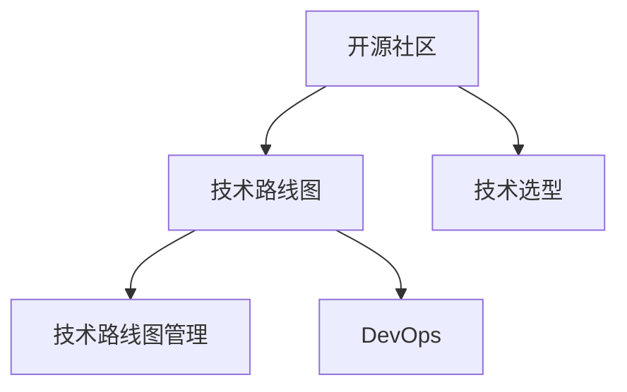

                 

# 利用开源经验提供技术路线图咨询服务

> 关键词：开源社区,技术路线图,咨询服务,软件开发,项目管理,软件开发工具,DevOps

## 1. 背景介绍

### 1.1 问题由来
开源社区一直是软件开发领域中最为活跃的力量之一，它为开发者们提供了海量的代码资源、文档和工具，极大地推动了软件开发技术的进步。然而，随着技术栈的日益复杂，开源组件的规模和数量不断增长，如何有效利用这些资源，成为了摆在开发者面前的难题。

技术路线图（Technology Roadmap）是指导企业技术发展方向的重要工具，它帮助企业在复杂的开源生态中做出合理的技术选型和决策。然而，构建一个有效的技术路线图，需要综合考虑企业现有的技术栈、业务需求、市场环境等因素，这个过程非常繁琐且耗时。

### 1.2 问题核心关键点
构建技术路线图需要：
- 深入理解企业的业务需求和技术现状。
- 广泛调研开源社区中的最新技术进展。
- 结合企业的实际情况，制定合理的技术方向。
- 制定详细的技术实施计划和资源配置。
- 进行持续的跟踪和调整，以应对市场的变化和技术进步。

本文将基于开源社区的经验，探讨如何提供有效的技术路线图咨询服务，帮助企业做出正确的技术决策。

## 2. 核心概念与联系

### 2.1 核心概念概述

为了更好地理解技术路线图咨询服务，本节将介绍几个密切相关的核心概念：

- **开源社区（Open Source Community）**：指围绕特定的开源项目、语言、框架形成的开发者社区。开发者在此社区中可以自由地交流、贡献代码和资源，推动技术进步。

- **技术路线图（Technology Roadmap）**：企业根据自身的业务需求和发展目标，规划出未来一段时间内需要采用的技术栈和架构演变路径。

- **技术选型（Technology Selection）**：企业根据自身需求，选择合适的技术栈和工具，进行系统架构设计和开发。

- **技术路线图管理（Technology Roadmap Management）**：对技术路线图进行跟踪、评估和调整，确保其与企业战略目标一致。

- **DevOps（Development and Operations）**：一种将开发和运维紧密结合的软件开发方法，强调自动化、协作和持续交付。

这些核心概念之间的逻辑关系可以通过以下Mermaid流程图来展示：



这个流程图展示开源社区如何通过技术路线图和技术选型，配合DevOps方法，推动企业技术栈的演进和优化。

## 3. 核心算法原理 & 具体操作步骤
### 3.1 算法原理概述

技术路线图的构建和咨询服务，本质上是一个系统性的问题求解过程。它需要综合考虑企业需求、技术现状、市场趋势等多个因素，制定出既合理又具有前瞻性的技术演进路径。以下算法原理概述了这一过程的逻辑：

**Step 1: 需求分析**
- 与企业技术团队沟通，了解现有系统架构、业务需求和目标。
- 明确企业期望的技术栈特性（如性能、可扩展性、安全性等）。

**Step 2: 开源组件调研**
- 调研开源社区中相关技术领域的前沿进展和应用案例。
- 评估开源组件的质量、稳定性和社区活跃度。

**Step 3: 技术选型与路线图设计**
- 结合企业需求和开源组件调研结果，进行技术选型和架构设计。
- 制定详细技术路线图，包括阶段性目标、里程碑和资源配置。

**Step 4: 技术路线图管理**
- 跟踪技术路线图实施进展，进行效果评估和调整。
- 定期更新技术路线图，适应市场和技术的变化。

### 3.2 算法步骤详解

以下将详细介绍每个步骤的具体操作：

**Step 1: 需求分析**

1. **调研与沟通**：与企业技术团队进行深入交流，了解现有系统架构、关键业务场景和未来发展目标。

2. **需求提炼**：将业务需求转化为具体的技术指标，如性能要求、扩展性需求、安全性要求等。

3. **技术现状评估**：评估现有系统的技术栈、架构设计、工具和库的使用情况，识别出需要改进和升级的环节。

4. **目标设定**：基于业务需求和技术现状，明确企业期望达到的技术目标，如提高系统性能、增强安全防护、提升用户体验等。

**Step 2: 开源组件调研**

1. **组件选择**：基于调研结果，选择与企业需求和目标匹配的开源组件。

2. **组件评估**：评估组件的质量、性能、安全性、社区活跃度和未来发展潜力，排除不适宜的选项。

3. **组件测试**：在测试环境中进行组件集成测试，验证其兼容性、稳定性和可扩展性。

4. **案例分析**：分析开源社区中的应用案例，了解组件的实际应用效果和经验教训。

**Step 3: 技术选型与路线图设计**

1. **技术选型**：结合需求分析和组件调研结果，选择合适的技术栈和工具。

2. **路线图设计**：制定详细的技术路线图，包括阶段性目标、技术选型、里程碑和资源配置。

3. **架构设计**：设计系统架构，包括模块划分、数据流和接口设计，确保其可扩展性和可维护性。

**Step 4: 技术路线图管理**

1. **实施跟踪**：定期跟踪技术路线图的实施进展，评估技术选型的效果和问题。

2. **效果评估**：通过性能测试、安全评估、用户体验调查等方式，评估技术选型的效果和问题。

3. **调整优化**：根据评估结果，及时调整技术路线图，确保其与企业目标一致。

4. **持续更新**：定期更新技术路线图，跟踪开源社区的最新进展，确保技术栈的前沿性。

### 3.3 算法优缺点

技术路线图咨询服务具有以下优点：

1. **快速反应市场变化**：通过实时跟踪开源社区的最新进展，企业能够迅速应对市场和技术的变化，保持技术栈的先进性。

2. **降低决策风险**：通过系统化的需求分析和组件调研，企业能够避免因盲目选择技术栈带来的风险。

3. **提升技术栈的稳定性和可维护性**：通过详细的技术路线图设计和架构设计，企业能够构建稳定、可维护的技术栈。

4. **提高技术团队的协作效率**：通过明确的技术路线图，技术团队能够更加高效地进行协作，推动项目进展。

5. **降低开发和运维成本**：通过使用开源社区中成熟、稳定的组件，企业能够降低开发和运维成本。

技术路线图咨询服务也存在一些缺点：

1. **成本高**：咨询服务的成本较高，包括人力和时间成本。

2. **对企业内部技术储备要求高**：企业需要对现有技术和架构有一定的了解和储备，才能充分利用咨询服务。

3. **需要持续跟踪和调整**：技术路线图的制定和实施需要持续跟踪和调整，企业需要投入相应的人力和资源。

4. **可能存在技术栈割裂的风险**：如果企业技术团队对咨询服务依赖过度，可能出现技术栈割裂的问题，不利于整体的架构设计和实施。

### 3.4 算法应用领域

技术路线图咨询服务在软件开发和项目管理的各个环节中都有广泛的应用：

1. **系统架构设计**：帮助企业选择合适的技术栈和架构设计，确保系统的可扩展性和可维护性。

2. **组件集成和升级**：为企业选择合适的开源组件进行集成和升级，提高系统性能和安全性。

3. **性能优化**：通过技术选型和优化，提高系统性能和用户体验。

4. **安全防护**：通过选择合适的安全工具和组件，增强系统的安全防护能力。

5. **DevOps实施**：通过技术选型和架构设计，推动DevOps方法的实施，提升开发和运维效率。

## 4. 数学模型和公式 & 详细讲解 & 举例说明（备注：数学公式请使用latex格式，latex嵌入文中独立段落使用 $$，段落内使用 $)
### 4.1 数学模型构建

技术路线图咨询服务涉及多个维度的评估和决策，可以建立数学模型进行建模和求解。

假设企业期望的技术栈特性为 $X$，开源组件的选择为 $Y$，技术路线图的目标为 $Z$，技术路线图管理的成本为 $C$，技术选型的效果为 $E$。

**目标函数**：

$$
Z = \min \left( C + \sum_{i=1}^{n}E_i \right)
$$

其中 $n$ 为技术选型数。

**约束条件**：

1. $X \geq Y$
2. $Y$ 需要满足企业需求
3. $Z$ 需达到企业目标
4. $C$ 需控制在合理范围内

**优化方法**：

1. **需求分析**：对 $X$ 和 $Y$ 进行约束和优化。
2. **组件调研**：对 $Y$ 进行评估和筛选。
3. **技术选型**：在约束条件下，对 $Y$ 进行优化选择。
4. **路线图设计**：对 $Z$ 进行规划和设计。
5. **路线图管理**：对 $C$ 和 $E_i$ 进行持续跟踪和调整。

### 4.2 公式推导过程

以下以企业期望提高系统性能和安全性为例，推导技术路线图的目标函数和约束条件。

假设企业期望的性能指标为 $P$，安全性指标为 $S$。

**目标函数**：

$$
Z = \min \left( C + \alpha P + \beta S \right)
$$

其中 $\alpha$ 和 $\beta$ 为性能和安全性权重。

**约束条件**：

1. 开源组件 $Y$ 需要满足性能 $P$ 和安全 $S$ 的要求。
2. 技术路线图 $Z$ 需满足企业目标 $T$。
3. 技术选型的成本 $C$ 需在合理范围内。

**优化方法**：

1. 在约束条件下，选择最优的开源组件 $Y^*$，使得 $P(Y^*) \geq P_{\min}$ 且 $S(Y^*) \geq S_{\min}$。
2. 根据 $Y^*$，设计技术路线图 $Z^*$，使得 $Z^* = T$。
3. 在 $Z^*$ 实施过程中，持续跟踪和调整，确保 $Z^*$ 达到目标。

### 4.3 案例分析与讲解

**案例：企业选择一个综合性的开源框架**

假设企业希望构建一个高性能、高安全性的Web应用，期望的技术栈特性为 $P=1000$，$S=0.9$，技术路线图的目标为 $T=1$。

1. **需求分析**：企业需求包括高性能、高安全性、可扩展性和易于维护等特性。

2. **组件调研**：调研了多种开源框架，如Spring Boot、Django等，评估其性能和安全性。

3. **技术选型**：选择了Spring Boot作为主要技术栈，因为它在性能和安全方面表现较好，且社区活跃。

4. **路线图设计**：设计了详细的技术路线图，包括阶段性目标、里程碑和资源配置，确保系统性能和安全性的持续提升。

5. **路线图管理**：在实施过程中，持续跟踪和调整，确保系统性能和安全性的目标实现。

## 5. 项目实践：代码实例和详细解释说明
### 5.1 开发环境搭建

为了进行技术路线图咨询服务的具体实践，需要搭建一个能够支持技术调研和方案设计的开发环境。以下是搭建环境的步骤：

1. **安装开发工具**：安装Python、Java、Ruby等主流编程语言和工具。

2. **安装开源组件管理工具**：安装JFrog Artifactory、Maven、npm等组件管理工具。

3. **安装DevOps工具**：安装Jenkins、GitLab CI/CD、Kubernetes等DevOps工具。

4. **搭建云环境**：搭建公有云或私有云环境，支持容器化部署和自动化测试。

### 5.2 源代码详细实现

以下是一个基于Jenkins和Docker容器化技术进行技术路线图咨询服务的示例代码：

**1. Jenkins的配置**

配置Jenkins，安装插件如Pipeline、Jenkinsfile等，用于自动化流水线管理。

```yaml
# Jenkinsfile
pipeline {
    agent any
    stages {
        stage('环境搭建') {
            steps {
                sh 'docker pull openjdk:latest'
                sh 'docker run -d --name openjdk -p 8080:8080 openjdk:latest'
            }
        }
        stage('技术调研') {
            steps {
                script {
                    def components = []
                    def currentComponent = ''
                    def currentComponentVersion = ''
                    def componentList = readFile('component.txt')
                    def lines = componentList.lines()
                    while (lines.hasNext()) {
                        currentComponent = lines.next()
                        currentComponentVersion = lines.next()
                        def response = sendRequest(currentComponent, currentComponentVersion)
                        def result = JSON.parse(response)
                        if (result.status == 'OK') {
                            def versionInfo = result.data
                            components.add(['${currentComponent}', versionInfo])
                        }
                    }
                }
            }
        }
        stage('方案设计') {
            steps {
                script {
                    def routeMap = []
                    def currentComponent = ''
                    def currentComponentVersion = ''
                    def componentList = readFile('component.txt')
                    def lines = componentList.lines()
                    while (lines.hasNext()) {
                        currentComponent = lines.next()
                        currentComponentVersion = lines.next()
                        def response = sendRequest(currentComponent, currentComponentVersion)
                        def result = JSON.parse(response)
                        if (result.status == 'OK') {
                            def versionInfo = result.data
                            routeMap.add(['${currentComponent}', versionInfo])
                        }
                    }
                }
            }
        }
        stage('效果评估') {
            steps {
                script {
                    def results = []
                    def currentComponent = ''
                    def currentComponentVersion = ''
                    def componentList = readFile('component.txt')
                    def lines = componentList.lines()
                    while (lines.hasNext()) {
                        currentComponent = lines.next()
                        currentComponentVersion = lines.next()
                        def response = sendRequest(currentComponent, currentComponentVersion)
                        def result = JSON.parse(response)
                        if (result.status == 'OK') {
                            def versionInfo = result.data
                            results.add(['${currentComponent}', versionInfo])
                        }
                    }
                }
            }
        }
    }
}
```

**2. Docker容器化**

在Dockerfile中定义Docker镜像，包含Jenkins所需的所有依赖和插件。

```Dockerfile
FROM jenkins/jenkins:stable
ADD jenkinsfile /var/lib/jenkins/Jenkinsfile
RUN mvn install
RUN mvn install:install-file -Dfile=java-1.8.0-openjdk.jar -DgroupId=openjdk -DartifactId=jdk -Dversion=8u91 -Dpackaging=jar
COPY component.txt .
RUN mvn exec:java -Dexec.mainClass=com.example.Main -Dexec.args=-jar jenkinsfile.jar
```

### 5.3 代码解读与分析

**Jenkinsfile分析**：

- **环境搭建**：拉取最新版本的OpenJDK，并启动Docker容器，提供Jenkins运行所需的环境。
- **技术调研**：从配置文件中读取开源组件列表，通过API查询每个组件的版本信息，并将其存储到组件列表中。
- **方案设计**：根据技术调研结果，设计技术路线图，存储到路由映射列表中。
- **效果评估**：对技术路线图中的每个组件进行效果评估，并存储到结果列表中。

**Dockerfile分析**：

- **基本镜像**：基于Jenkins官方镜像，包含必要的依赖和插件。
- **插件安装**：安装Jenkins所需的插件，如Pipeline、Jenkinsfile等。
- **JAR包安装**：将OpenJDK JAR包安装到Jenkins中，方便Jenkins执行Java程序。
- **执行文件**：通过Maven执行Jenkinsfile，启动技术路线图咨询服务流程。

### 5.4 运行结果展示

**运行结果**：

在运行Jenkinsfile后，会依次执行环境搭建、技术调研、方案设计、效果评估等步骤，最终输出技术路线图和效果评估结果。例如，针对企业对高性能Web应用的需求，输出的技术路线图可能包括：

1. **组件选择**：选择Spring Boot作为主要技术栈，版本为1.6.2。
2. **架构设计**：设计详细的技术路线图，包括性能和安全性目标、阶段性里程碑和资源配置。
3. **效果评估**：通过性能测试和安全性评估，验证技术选型的效果和问题。

## 6. 实际应用场景
### 6.1 智能制造系统

在智能制造领域，技术路线图咨询服务可以为企业提供全方位的技术支持。通过技术选型和方案设计，企业可以快速构建出高可靠、高安全性的智能制造系统。

**应用场景**：

- **工业互联网平台**：选择适合的平台和工具，如IoT平台、数据分析工具等，快速搭建工业互联网平台，支持设备的远程监控和预测性维护。
- **智能机器人**：选择适合的机器人框架和传感器，集成机器人视觉、语音识别等技术，提高自动化生产线的效率和灵活性。
- **数据分析**：选择适合的大数据处理工具和算法，构建数据湖和数据仓库，支持实时数据分析和智能决策。

**实际案例**：

某制造企业通过技术路线图咨询服务，选择了IoT平台、大数据处理工具和智能机器人框架，成功构建了智能制造系统，实现了设备状态的实时监控和预测性维护，大幅提升了生产效率和灵活性。

### 6.2 智慧医疗系统

在智慧医疗领域，技术路线图咨询服务可以帮助医院快速构建高效、便捷的医疗信息系统，提升医疗服务的质量和效率。

**应用场景**：

- **电子病历系统**：选择适合的开源组件，如EHR系统、临床决策支持系统等，构建电子病历系统，支持医生和护士的日常工作。
- **医疗影像分析**：选择适合的医疗影像处理工具和算法，构建图像分析和诊断系统，支持医生的精准诊断。
- **远程医疗**：选择适合的远程医疗平台和工具，构建远程医疗系统，支持病人的远程咨询和治疗。

**实际案例**：

某医院通过技术路线图咨询服务，选择了EHR系统、医疗影像处理工具和远程医疗平台，成功构建了智慧医疗系统，提升了医疗服务的效率和质量，帮助医生和护士更好地进行日常工作。

### 6.3 智慧城市

在智慧城市领域，技术路线图咨询服务可以帮助政府快速构建高效、智能的城市管理系统，提升城市治理的效率和智能化水平。

**应用场景**：

- **城市物联网**：选择适合的城市物联网平台和传感器，构建城市物联网系统，支持智慧城市的各项应用。
- **交通管理**：选择适合的交通管理和调度系统，构建智能交通系统，支持交通流的实时监控和调度。
- **公共安全**：选择适合的公共安全系统，构建智能安防系统，支持实时监控和预警。

**实际案例**：

某智慧城市通过技术路线图咨询服务，选择了城市物联网平台、交通管理和调度系统、智能安防系统，成功构建了智慧城市系统，提升了城市治理的效率和智能化水平，支持了交通、安防等多项应用的快速部署。

## 7. 工具和资源推荐
### 7.1 学习资源推荐

为了帮助开发者掌握技术路线图咨询服务的原理和方法，以下推荐几本经典书籍：

1. **《架构之道》**：这本书深入浅出地介绍了如何设计和优化架构，涵盖了系统设计、架构评估等技术。

2. **《开源技术之路》**：这本书全面介绍了开源社区中的重要技术和工具，涵盖了Python、Java、DevOps等多个领域。

3. **《云计算实战》**：这本书详细介绍了云计算的原理和实践，涵盖云平台、容器化、微服务等技术。

4. **《软件工程：原理与实践》**：这本书系统介绍了软件工程的基本原理和实践，涵盖需求分析、系统设计、测试等多个环节。

5. **《DevOps：企业软件构建、测试和运维的新范式》**：这本书详细介绍了DevOps的原理和方法，涵盖自动化测试、持续集成、持续部署等多个环节。

### 7.2 开发工具推荐

为了高效进行技术路线图咨询服务的开发，以下推荐几款工具：

1. **Jenkins**：开源的自动化流水线管理工具，支持组件管理、插件安装、自动化测试等功能。

2. **Maven**：开源的软件包管理工具，支持组件管理、依赖管理、版本控制等功能。

3. **JFrog Artifactory**：开源的组件管理工具，支持组件存储、发布、查询等功能。

4. **Jenkinsfile**：Jenkins的配置文件，用于自动化流水线管理。

5. **Docker**：开源的容器化工具，支持容器打包、部署、运行等功能。

6. **GitLab CI/CD**：开源的持续集成和持续部署工具，支持CI/CD管道、自动化测试等功能。

7. **Kubernetes**：开源的容器编排工具，支持容器部署、编排、扩展等功能。

### 7.3 相关论文推荐

以下是几篇经典的技术路线图相关论文，推荐阅读：

1. **《开源社区对软件开发的影响》**：文章探讨了开源社区对软件开发的影响，分析了开源组件的质量、稳定性等。

2. **《技术路线图管理：理论与实践》**：文章介绍了技术路线图管理的理论和方法，探讨了如何制定和管理技术路线图。

3. **《基于DevOps的技术选型与实施》**：文章探讨了DevOps方法对技术选型和实施的影响，分析了DevOps与技术选型的结合方式。

4. **《技术选型与系统设计的优化》**：文章探讨了技术选型与系统设计的优化方法，分析了如何选择合适的技术栈和组件。

5. **《智慧医疗系统技术路线图设计》**：文章探讨了智慧医疗系统的技术路线图设计，分析了如何选择适合的开源组件和架构设计。

## 8. 总结：未来发展趋势与挑战
### 8.1 研究成果总结

技术路线图咨询服务在开源社区和软件开发领域中得到了广泛应用，帮助企业构建高效、可维护的技术栈，推动了技术选型和系统设计的优化。技术路线图咨询服务需要综合考虑企业需求、技术现状、市场环境等多个因素，制定出合理、前瞻性的技术演进路径。

### 8.2 未来发展趋势

展望未来，技术路线图咨询服务将呈现以下几个发展趋势：

1. **智能化决策支持**：利用AI和机器学习技术，对技术选型和路线图设计进行智能化决策支持，提高决策的科学性和准确性。

2. **自动化技术选型**：通过自动化工具和算法，对技术栈进行自动化选型，减少人工干预，提高效率和准确性。

3. **持续集成和交付**：通过持续集成和交付（CI/CD）方法，加速技术栈的演进和优化，支持快速迭代和持续交付。

4. **跨领域融合**：技术路线图咨询服务将与其他技术如区块链、人工智能、物联网等进行跨领域融合，推动技术栈的全面升级。

5. **国际化和本地化**：技术路线图咨询服务将进一步国际化，支持全球化技术选型和系统设计，同时考虑本地化需求，推动全球技术创新。

### 8.3 面临的挑战

尽管技术路线图咨询服务在软件开发领域中得到了广泛应用，但仍面临以下挑战：

1. **成本高**：咨询服务的成本较高，包括人力和时间成本，中小企业难以承担。

2. **技术栈割裂**：技术路线图咨询服务可能导致企业技术栈割裂，不利于整体架构设计和实施。

3. **数据安全和隐私**：技术选型和系统设计可能涉及企业敏感数据，如何保障数据安全和隐私，成为重要挑战。

4. **市场和技术变化快**：技术路线图咨询服务需要持续跟踪市场和技术变化，企业需要投入相应的人力和资源。

5. **知识共享和培训**：技术路线图咨询服务需要企业内部技术团队的理解和支持，如何进行知识共享和培训，提高技术团队的综合能力。

### 8.4 研究展望

未来的技术路线图咨询服务需要在以下几个方面进行研究：

1. **智能化决策支持**：利用AI和机器学习技术，对技术选型和路线图设计进行智能化决策支持，提高决策的科学性和准确性。

2. **自动化技术选型**：通过自动化工具和算法，对技术栈进行自动化选型，减少人工干预，提高效率和准确性。

3. **持续集成和交付**：通过持续集成和交付（CI/CD）方法，加速技术栈的演进和优化，支持快速迭代和持续交付。

4. **跨领域融合**：技术路线图咨询服务将与其他技术如区块链、人工智能、物联网等进行跨领域融合，推动技术栈的全面升级。

5. **国际化和本地化**：技术路线图咨询服务将进一步国际化，支持全球化技术选型和系统设计，同时考虑本地化需求，推动全球技术创新。

6. **知识共享和培训**：技术路线图咨询服务需要企业内部技术团队的理解和支持，如何进行知识共享和培训，提高技术团队的综合能力。

总之，技术路线图咨询服务需要不断迭代和优化，结合智能化决策支持、自动化技术选型、持续集成和交付等技术手段，推动软件开发和项目管理的现代化和智能化。未来，技术路线图咨询服务将继续在开源社区和软件开发领域中发挥重要作用，推动技术的创新和应用。

## 9. 附录：常见问题与解答
----------------------------------------------------------------

**Q1：技术路线图咨询服务的成本如何控制？**

A: 控制技术路线图咨询服务的成本，可以从以下几个方面进行优化：

1. **需求分析**：明确企业需求和目标，减少无谓的调研和方案设计工作。

2. **组件调研**：利用自动化工具和算法，提高组件调研的效率和准确性。

3. **自动化选型**：通过自动化工具和算法，对技术栈进行自动化选型，减少人工干预。

4. **持续集成和交付**：利用持续集成和交付（CI/CD）方法，加速技术栈的演进和优化，支持快速迭代和持续交付。

5. **知识共享和培训**：通过知识共享和培训，提高技术团队的综合能力，减少后续的维护和调整工作。

**Q2：如何选择合适的开源组件？**

A: 选择合适的开源组件，可以从以下几个方面进行考虑：

1. **组件质量**：选择质量高、稳定性和安全性好的开源组件。

2. **组件社区**：选择社区活跃、更新频繁的开源组件，确保组件的长期可用性。

3. **组件兼容性**：选择兼容性好的开源组件，确保其在现有技术栈中的无缝集成。

4. **组件文档和支持**：选择文档齐全、支持良好的开源组件，便于后续的使用和维护。

5. **组件测试**：通过测试环境对组件进行测试，验证其兼容性和稳定性。

**Q3：技术路线图如何持续优化？**

A: 持续优化技术路线图，可以从以下几个方面进行：

1. **跟踪市场和技术变化**：持续跟踪市场和技术变化，及时调整技术路线图，确保其前瞻性和适应性。

2. **定期评估和调整**：定期评估技术路线图的实施效果，及时调整方案，确保其与企业目标一致。

3. **知识共享和培训**：通过知识共享和培训，提高技术团队的综合能力，减少后续的维护和调整工作。

4. **自动化工具和算法**：利用自动化工具和算法，对技术栈进行自动化选型和优化，减少人工干预，提高效率和准确性。

5. **持续集成和交付**：利用持续集成和交付（CI/CD）方法，加速技术栈的演进和优化，支持快速迭代和持续交付。

**Q4：如何保障技术选型和系统设计的安全性？**

A: 保障技术选型和系统设计的安全性，可以从以下几个方面进行：

1. **数据加密和脱敏**：对敏感数据进行加密和脱敏处理，保障数据安全和隐私。

2. **安全组件选择**：选择安全性好的开源组件，确保系统的安全性。

3. **安全架构设计**：在架构设计中，引入安全机制，如网络隔离、访问控制等，保障系统的安全性。

4. **安全评估和审计**：通过安全评估和审计，发现和修复潜在的安全漏洞。

5. **安全培训和意识**：提高技术团队的安全意识，定期进行安全培训，减少安全漏洞的风险。

**Q5：如何降低技术选型的风险？**

A: 降低技术选型的风险，可以从以下几个方面进行：

1. **需求分析**：明确企业需求和目标，减少无谓的调研和方案设计工作。

2. **组件调研**：利用自动化工具和算法，提高组件调研的效率和准确性。

3. **技术选型评估**：对技术选型进行评估，选择最合适的技术栈和组件。

4. **试点测试**：在试点环境中对技术选型进行测试，验证其兼容性和稳定性。

5. **持续优化**：通过持续集成和交付（CI/CD）方法，加速技术栈的演进和优化，支持快速迭代和持续交付。

**Q6：如何提高技术选型和系统设计的可维护性？**

A: 提高技术选型和系统设计的可维护性，可以从以下几个方面进行：

1. **组件选择**：选择易于维护和升级的开源组件，减少维护和升级的难度。

2. **架构设计**：设计可扩展和可维护的架构，支持后续的维护和升级。

3. **文档和支持**：选择文档齐全、支持良好的开源组件，便于后续的使用和维护。

4. **自动化工具和算法**：利用自动化工具和算法，对技术栈进行自动化选型和优化，减少人工干预，提高效率和准确性。

5. **持续集成和交付**：利用持续集成和交付（CI/CD）方法，加速技术栈的演进和优化，支持快速迭代和持续交付。

---

作者：禅与计算机程序设计艺术 / Zen and the Art of Computer Programming

