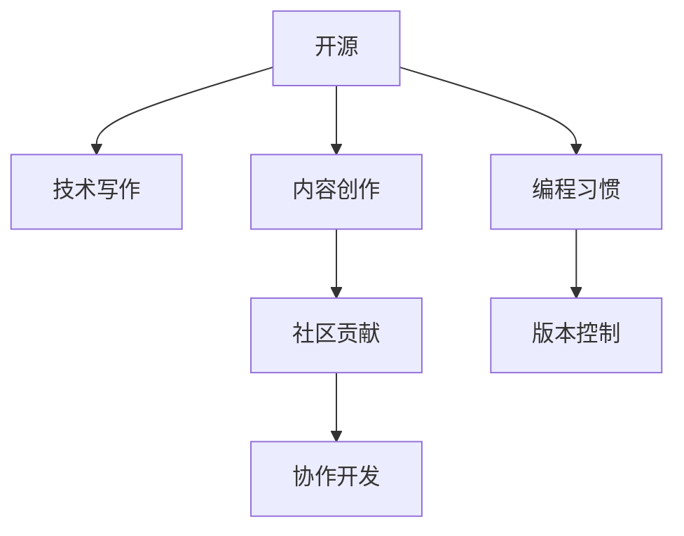

                 

# 利用开源经验进行技术写作和内容创作

> 关键词：开源,技术写作,内容创作,社区贡献,编程习惯,版本控制,协作开发

## 1. 背景介绍

随着开源运动的兴起，技术交流与协作成为了程序员社群的重要活动。技术博客和开源项目文档是其中两个重要的实践形式，它们不仅推动了技术的发展，也为技术写作和内容创作提供了丰富的资源。开源经验在这里起到了关键作用，它为技术写作和内容创作提供了宝贵的指导和实践基础。本文将详细探讨如何利用开源经验进行技术写作和内容创作，帮助开发者提升技术交流和协作能力。

## 2. 核心概念与联系

### 2.1 核心概念概述

开源社区是一个由众多贡献者组成的技术生态系统，它鼓励开发者共享代码、文档和经验，共同推动技术的进步。开源社区中的技术写作和内容创作活动通常包括撰写技术博客、编写开源项目文档、参与社区讨论等。这些活动不仅能够展示个人或团队的技术能力和专业素养，还能够促进知识共享和团队协作。

以下将详细介绍几个核心概念：

- **开源：** 指软件和数据的共享与合作，开发者可以自由地访问、修改和分发代码和数据。
- **技术写作：** 指通过写作将技术知识转化为易于理解的文字形式，便于技术交流和知识传播。
- **内容创作：** 指创造有价值的内容，包括技术文档、博客、视频等，旨在教育他人、启发思考或解决问题。
- **社区贡献：** 指在开源社区中参与代码、文档和讨论的贡献活动，推动技术进步和知识共享。
- **编程习惯：** 指开发人员在编码和协作中形成的良好习惯，包括版本控制、代码审查、文档风格等。
- **版本控制：** 指使用工具跟踪代码变更的历史，帮助团队协作和问题定位。
- **协作开发：** 指多人在一个项目中共同工作，通过代码审查和协作工具提高效率和质量。

### 2.2 核心概念原理和架构的 Mermaid 流程图



## 3. 核心算法原理 & 具体操作步骤

### 3.1 算法原理概述

开源经验在技术写作和内容创作中起到了至关重要的作用。通过分析开源社区的成功案例，我们可以总结出以下原则：

1. **明确目标：** 明确写作和创作的目标，如教育、解决问题或分享经验。
2. **了解受众：** 了解目标受众的需求和背景，以选择合适的写作风格和内容。
3. **结构清晰：** 结构清晰、逻辑连贯的内容更容易被理解和接受。
4. **互动性强：** 利用问答、评论区等互动形式，增强内容的交流性和参与感。
5. **持续改进：** 不断收集反馈，不断优化和完善内容。

### 3.2 算法步骤详解

以下是基于开源经验进行技术写作和内容创作的具体步骤：

**Step 1: 确定目标和受众**
- 明确写作或创作的目标，如教程、指南、案例研究等。
- 分析目标受众的特点，如技术水平、兴趣点等。

**Step 2: 收集和整理素材**
- 从开源项目、技术博客、官方文档等渠道收集相关资料。
- 对资料进行整理，去除重复和无关信息。

**Step 3: 设计内容结构和格式**
- 确定内容的主要部分和次要部分，如引言、正文、结论等。
- 选择合适的文档格式，如Markdown、HTML、PDF等。

**Step 4: 编写和优化内容**
- 根据受众特点和目标，撰写易于理解、结构清晰的内容。
- 使用代码片段、图表、示例等辅助说明复杂概念。
- 持续收集反馈，优化内容质量和表达方式。

**Step 5: 发布和维护**
- 选择合适的平台发布内容，如个人博客、技术论坛、GitHub等。
- 定期更新和维护内容，保持其时效性和准确性。

### 3.3 算法优缺点

开源经验在技术写作和内容创作中具有以下优点：

1. **丰富的资源：** 开源社区提供了大量高质量的技术文档和案例，为内容创作提供了丰富的素材。
2. **广泛的受众：** 开源社区的开放性和国际化，使内容能够覆盖更广泛的受众。
3. **反馈机制：** 开源社区的讨论和评论机制，能够及时收集反馈，改进内容质量。

同时，也存在以下缺点：

1. **缺乏标准：** 开源社区内容质量参差不齐，缺乏统一的标准和规范。
2. **时间和精力投入：** 高质量内容创作需要大量的时间和精力，尤其是对于初学者。
3. **版权问题：** 开源社区中内容版权问题复杂，需谨慎处理。

### 3.4 算法应用领域

开源经验在技术写作和内容创作中的应用领域广泛，包括但不限于以下方面：

- **技术博客：** 在个人或企业博客上分享技术经验、教程和案例研究。
- **开源项目文档：** 为开源项目编写用户手册、API文档、开发指南等。
- **技术培训：** 通过博客、视频、教学文档等形式进行技术培训和知识传播。
- **社区贡献：** 在开源社区参与技术讨论、编写代码、修复bug等。
- **技术交流：** 通过技术会议、论坛、社交媒体等平台进行技术交流和分享。

## 4. 数学模型和公式 & 详细讲解 & 举例说明

### 4.1 数学模型构建

技术写作和内容创作可以通过数学模型来描述和分析。以下是一个简化的模型：

$$
\text{内容质量} = f(\text{写作目标}, \text{受众分析}, \text{内容结构}, \text{互动性}, \text{反馈机制})
$$

其中：

- 写作目标：明确的目标指导内容创作方向。
- 受众分析：了解受众特点，选择合适的表达方式。
- 内容结构：清晰合理的结构有助于内容理解。
- 互动性：增强内容的互动性，提升参与感。
- 反馈机制：收集反馈，不断改进内容质量。

### 4.2 公式推导过程

在实际应用中，我们还需要进一步细化模型，具体推导如下：

- 设定目标函数：

$$
\max_{w} \text{Content Quality} = \max_{w} f(\text{Writing Goal}, \text{Audience Analysis}, \text{Content Structure}, \text{Interactivity}, \text{Feedback Mechanism})
$$

- 定义目标函数：

$$
f(w) = \sum_{i=1}^{N} w_i \cdot f_i(w)
$$

其中 $f_i(w)$ 为每个影响因素的贡献函数。

### 4.3 案例分析与讲解

以下是一个开源项目文档的编写案例：

1. **确定目标和受众：**
   - 目标：编写一个Linux内核开发指南。
   - 受众：Linux内核开发者、初学者、跨领域开发者。

2. **收集和整理素材：**
   - 从官方文档、社区讨论、博客等渠道收集资料。
   - 整理资料，去除冗余和过时信息。

3. **设计内容结构和格式：**
   - 确定引言、核心内容、示例、参考文献等部分。
   - 使用Markdown格式，支持代码高亮和嵌入图表。

4. **编写和优化内容：**
   - 撰写易懂的指南，包含步骤、代码示例、注意事项等。
   - 使用GitHub的Markdown和PR功能进行协作，收集反馈。

5. **发布和维护：**
   - 在GitHub上创建仓库和文档，使用CI工具自动化构建和测试。
   - 定期更新文档，加入新功能和示例。

## 5. 项目实践：代码实例和详细解释说明

### 5.1 开发环境搭建

要开展技术写作和内容创作，需要搭建一个适合的环境。以下是一个Python项目的环境搭建示例：

1. **安装Python和必要的库：**
   ```bash
   pip install python
   pip install flask jinja2 markdown
   ```

2. **创建博客应用程序：**
   ```bash
   mkdir blog
   cd blog
   python -m flask create --name=blog
   ```

3. **编写博客内容：**
   ```bash
   mkdir content
   cd content
   touch index.md
   ```

4. **启动博客服务：**
   ```bash
   cd blog
   flask run
   ```

### 5.2 源代码详细实现

以下是一个简单的Markdown博客内容的实现：

```python
from flask import Flask, render_template

app = Flask(__name__)

@app.route('/')
def index():
    return render_template('index.html', content=app.config['CONTENT'])

if __name__ == '__main__':
    app.run(debug=True)
```

```html
<!DOCTYPE html>
<html>
<head>
    <title>My Blog</title>
</head>
<body>
    <h1>{{ content }}</h1>
</body>
</html>
```

### 5.3 代码解读与分析

这个简单的博客应用程序使用了Flask框架和Markdown格式。通过Flask的路由功能，我们可以将Markdown格式的内容渲染为HTML页面，并展示在网页上。这个示例展示了如何在Python中快速搭建一个简单的博客，方便进行内容创作和发布。

## 6. 实际应用场景

### 6.1 开源社区的贡献

开源社区是一个绝佳的实践平台，通过参与开源项目，可以提升技术写作和内容创作能力。以下是一个实际的贡献案例：

1. **选择项目：**
   - 在GitHub上选择一个感兴趣的开源项目，如TensorFlow、Kubernetes等。
   - 阅读项目文档和代码，了解其结构和功能。

2. **编写代码：**
   - 在项目中写一些功能性的PR，如修复bug、添加新功能等。
   - 编写详细的文档，描述PR的目的和实现细节。

3. **代码审查：**
   - 在PR中@项目维护者进行代码审查。
   - 根据反馈修改代码，通过代码审查。

4. **社区讨论：**
   - 在项目的issue页面参与讨论，解决他人遇到的问题。
   - 撰写技术文章，分享代码实现经验和问题解决方案。

### 6.2 技术博客的维护

通过维护个人博客，可以提高技术写作和内容创作能力。以下是一个博客维护的示例：

1. **选择平台：**
   - 选择一个博客平台，如WordPress、GitHub Pages等。
   - 创建博客账户，配置域名和主题。

2. **撰写内容：**
   - 撰写技术文章、教程、案例研究等。
   - 使用Markdown格式，支持代码高亮和嵌入图表。

3. **发布文章：**
   - 在博客平台上发布文章。
   - 使用SEO工具优化文章，提升访问量。

4. **互动交流：**
   - 在博客评论区与读者互动，回复评论。
   - 加入技术论坛和社交媒体，分享博客内容。

### 6.3 开源项目文档的编写

编写高质量的开源项目文档也是开源经验的重要应用之一。以下是一个编写文档的示例：

1. **了解项目：**
   - 详细阅读开源项目的代码和文档。
   - 与项目维护者沟通，了解项目的目标和结构。

2. **编写文档：**
   - 编写项目介绍、API文档、用户指南等。
   - 使用Markdown格式，支持代码高亮和嵌入图表。

3. **发布文档：**
   - 将文档发布到项目仓库或博客上。
   - 使用CI工具自动化构建和测试。

4. **持续改进：**
   - 定期更新文档，加入新功能和示例。
   - 收集用户反馈，改进文档质量和表达方式。

## 7. 工具和资源推荐

### 7.1 学习资源推荐

以下是几个优质的学习资源，帮助开发者提升技术写作和内容创作能力：

1. **GitHub的官方文档：** 提供了Git、GitHub等工具的使用指南和最佳实践。
2. **Markdown的官方文档：** 详细介绍了Markdown格式的使用方法和语法规则。
3. **Flask的官方文档：** 提供了Flask框架的快速入门和详细指南。
4. **开源社区：** 参与开源项目和社区讨论，学习最佳实践和编写技巧。

### 7.2 开发工具推荐

以下是几款实用的开发工具，支持技术写作和内容创作：

1. **Visual Studio Code：** 支持多种语言和插件，方便编写和编辑代码。
2. **Atom：** 功能强大的文本编辑器，支持代码高亮和语法检查。
3. **GitHub Desktop：** 图形化界面的工具，方便管理和提交代码。
4. **Git：** 版本控制工具，支持多人协作和历史记录管理。

### 7.3 相关论文推荐

以下是几篇关于技术写作和内容创作的经典论文，值得深入阅读：

1. **《软件工程师博客的学术和技术内容：基于OpenCodeJournal的分析》：** 研究软件工程师博客的技术内容，分析其学术价值和影响。
2. **《开源社区中的贡献者动机研究》：** 分析开源社区贡献者的动机，探讨如何吸引更多人参与贡献。
3. **《开源项目的文档质量和社区参与度：一项跨项目的比较研究》：** 研究开源项目文档质量和社区参与度的关系，提出改进建议。

## 8. 总结：未来发展趋势与挑战

### 8.1 研究成果总结

通过分析开源经验，我们总结了技术写作和内容创作的几个关键点：

1. **明确目标和受众：** 制定清晰的目标和受众分析，指导内容创作方向。
2. **收集和整理素材：** 从开源项目、技术博客等渠道收集和整理素材。
3. **设计内容结构和格式：** 结构清晰、逻辑连贯的内容更容易被理解和接受。
4. **编写和优化内容：** 通过代码片段、图表等辅助说明复杂概念。
5. **发布和维护：** 选择合适的平台发布内容，定期更新和维护。

### 8.2 未来发展趋势

开源经验在技术写作和内容创作中的未来趋势：

1. **跨领域合作：** 开源社区将更加注重跨领域合作，促进多学科知识的交流和融合。
2. **智能工具：** 引入智能工具如AI辅助写作，提高内容创作的效率和质量。
3. **多样化形式：** 内容创作将不仅仅局限于文本，还包括视频、播客等多种形式。
4. **国际化：** 开源社区和内容创作将更加国际化，覆盖更广泛的受众。
5. **社区建设：** 加强社区的建设和管理，吸引更多贡献者和读者。

### 8.3 面临的挑战

尽管开源经验在技术写作和内容创作中已经取得了显著成果，但仍面临一些挑战：

1. **质量和规范：** 内容质量和规范参差不齐，缺乏统一的标准。
2. **时间和精力投入：** 高质量内容创作需要大量的时间和精力。
3. **版权问题：** 开源内容版权问题复杂，需谨慎处理。
4. **互动性不足：** 内容创作和交流的互动性不足，影响参与度。

### 8.4 研究展望

未来，开源经验在技术写作和内容创作中的研究展望：

1. **自动化和智能化：** 探索AI辅助写作、内容推荐等自动化工具。
2. **社区管理和激励：** 研究如何激励社区成员积极贡献和交流。
3. **跨学科融合：** 探索跨学科知识和技术的融合，提升内容的多样性和深度。
4. **国际化拓展：** 加强国际化合作和内容创作，提升全球影响力。

## 9. 附录：常见问题与解答

**Q1: 开源社区中如何找到合适的项目进行贡献？**

A: 可以通过以下步骤找到合适的开源项目进行贡献：
1. 在GitHub上搜索感兴趣的项目。
2. 阅读项目文档和代码，了解项目的目标和结构。
3. 参与项目的issue讨论，了解项目维护者的需求。
4. 选择感兴趣的功能或问题，撰写PR进行贡献。

**Q2: 如何提高技术写作的质量？**

A: 提高技术写作质量需要以下几个步骤：
1. 明确写作目标和受众。
2. 收集和整理相关资料。
3. 设计清晰合理的结构。
4. 使用代码片段和图表等辅助说明。
5. 持续收集反馈，不断改进内容。

**Q3: 如何选择适当的开源项目进行贡献？**

A: 选择适当的开源项目进行贡献需要考虑以下因素：
1. 项目的目标和方向是否与自己的兴趣和技能相符。
2. 项目的活跃度和社区规模。
3. 项目的文档和代码质量是否高。
4. 项目的维护者是否友好和开放。

**Q4: 如何利用开源经验提升技术写作和内容创作能力？**

A: 利用开源经验提升技术写作和内容创作能力需要以下几个步骤：
1. 深入学习和分析开源项目和文档。
2. 参与开源社区和讨论，了解最佳实践。
3. 撰写自己的技术文章和文档，分享经验和知识。
4. 收集和分析社区反馈，不断改进内容。

**Q5: 开源经验如何帮助开发者提高编程习惯？**

A: 开源经验可以帮助开发者提高编程习惯，具体体现在以下几个方面：
1. 使用版本控制工具如Git，记录代码变更历史。
2. 代码审查和协作开发，提高代码质量和可维护性。
3. 使用代码风格指南，保持代码一致性和可读性。
4. 使用文档工具，记录和组织代码文档。

---

作者：禅与计算机程序设计艺术 / Zen and the Art of Computer Programming

