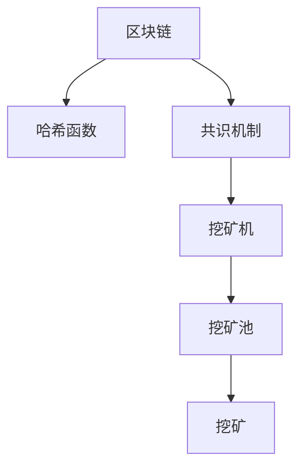

                 

## 1. 背景介绍

随着区块链技术的快速发展，数字货币尤其是比特币近年来引起了广泛的关注。加密货币挖矿技术，作为区块链网络的必要组成部分，已经吸引了众多技术爱好者和投资者的目光。本文将对加密货币挖矿的技术原理、核心算法、操作步骤等方面进行深入的探讨，并结合实际应用场景和未来发展趋势进行分析。

## 2. 核心概念与联系

### 2.1 核心概念概述

为更好地理解加密货币挖矿的技术原理，本节将介绍几个密切相关的核心概念：

- **加密货币挖矿**：指通过特定算法解决数学难题，获取数字货币新币的过程。挖矿过程不仅可以获得新币，还能为网络提供计算和存储支持。

- **区块链**：一种去中心化的分布式账本技术，通过链式结构存储交易记录，确保数据透明性和不可篡改性。

- **共识机制**：区块链网络内达成共识的机制，保障网络节点的行动一致性，如PoW（工作量证明）、PoS（权益证明）等。

- **哈希函数**：将任意大小的数据映射为固定长度摘要（哈希值）的函数，保证数据的唯一性和不可逆性。

- **挖矿机**：专门为加密货币挖矿设计的硬件设备，通常包含高性能CPU/GPU/ASIC芯片等，用于快速解决数学难题。

- **挖矿池**：多个矿工合作，通过共享计算资源和挖矿收益，提高挖矿成功率。

这些核心概念之间相互联系，共同构成了加密货币挖矿的完整框架。通过理解这些核心概念，我们可以更好地把握加密货币挖矿的工作原理和优化方向。

### 2.2 核心概念原理和架构的 Mermaid 流程图

这个流程图展示了几大核心概念之间的联系：

1. 区块链网络通过哈希函数对交易数据进行摘要存储。
2. 共识机制确保网络节点的行动一致性。
3. 挖矿机提供高性能计算资源，解决数学难题获取新币。
4. 挖矿池通过合作提高挖矿成功率。
5. 挖矿过程形成新币，并存储在区块链上。

## 3. 核心算法原理 & 具体操作步骤

### 3.1 算法原理概述

加密货币挖矿的核心算法通常基于哈希函数和共识机制，其中最著名的是工作量证明（Proof of Work, PoW）机制。

工作量证明算法的基本原理是：挖矿节点通过不断尝试调整哈希函数中的随机数，使得结果的哈希值满足一定条件，从而获得新币。该条件通常是一个非常低的哈希值，即目标哈希值（Target Hash Value）。

挖矿算法的数学表达式如下：

$$
\text{Hash} = \text{SHA-256}((\text{Header}) + (\text{Block}) + (\text{Nonce}))
$$

其中：
- $\text{Header}$ 包含区块头和交易信息。
- $\text{Block}$ 包含新币奖励和交易记录。
- $\text{Nonce}$ 是一个不断变化的随机数，用于调整哈希值。

挖矿节点不断尝试不同的随机数，直到找到满足目标哈希值的解。通常情况下，这个过程需要耗费大量的计算资源。

### 3.2 算法步骤详解

加密货币挖矿的具体操作步骤如下：

1. **初始化区块**：生成一个初始区块，包含区块头（Header）和区块体（Block），区块头中包含一些初始随机数（Nonce）。

2. **计算哈希值**：使用SHA-256哈希函数计算区块头的哈希值，并检查是否满足目标哈希值。

3. **调整随机数**：如果不满足目标哈希值，就尝试调整区块头中的随机数（Nonce），并重新计算哈希值。

4. **记录最短哈希值**：记录所有计算过程中找到的最短哈希值（Min Hash Value）。

5. **广播并验证**：将最短哈希值广播给网络中的其他节点，并验证是否正确。

6. **获取奖励**：如果验证通过，获得新币奖励，并将其添加到区块体中。

7. **更新区块头**：将最短哈希值添加到区块头，形成新的区块，并继续挖矿。

### 3.3 算法优缺点

加密货币挖矿算法具有以下优点：

1. **安全性高**：由于目标哈希值非常低，需要耗费大量计算资源才能完成，保证了网络的安全性。

2. **去中心化**：由于共识机制的约束，网络节点无法单独控制整个系统，保障了系统的去中心化。

3. **透明性**：所有挖矿过程和结果都记录在区块链上，具有高度透明性。

然而，该算法也存在一些缺点：

1. **计算资源消耗大**：挖矿需要大量计算资源，导致能耗高、噪音大。

2. **设备成本高**：挖矿机需要高性能硬件，前期设备投入成本较高。

3. **环境影响大**：大规模挖矿活动对环境产生巨大压力，引发能源浪费和环境污染。

4. **生态不稳定**：随着挖矿难度不断调整，挖矿收益波动大，可能导致矿工之间的竞争加剧。

### 3.4 算法应用领域

加密货币挖矿技术不仅适用于比特币等主流加密货币，还广泛应用于其他数字货币、智能合约和去中心化应用（DApp）等。

- **主流数字货币**：比特币、以太坊等数字货币的挖矿主要采用PoW机制。
- **智能合约**：以太坊平台上的智能合约可以编写和执行，挖矿过程主要用于生成以太币。
- **去中心化应用**：一些DApp平台需要挖矿机制来生成新的代币，并保持系统稳定运行。

## 4. 数学模型和公式 & 详细讲解 & 举例说明

### 4.1 数学模型构建

加密货币挖矿的核心数学模型可以表示为：

$$
\text{Target Hash Value} = \text{Min Hash Value}
$$

其中，目标哈希值（Target Hash Value）是一个固定的值，通常表示为一个小于某个特定值的整数。挖矿的目的是找到满足这个目标哈希值的哈希值。

### 4.2 公式推导过程

挖矿的数学推导过程如下：

1. **哈希函数计算**：

$$
\text{Hash} = \text{SHA-256}((\text{Header}) + (\text{Block}) + (\text{Nonce}))
$$

2. **比较哈希值**：

$$
\text{Hash} < \text{Target Hash Value}
$$

3. **调整随机数**：

$$
\text{Nonce} = \text{Nonce} + \Delta
$$

其中，$\Delta$ 是一个小的步长，通常为1。

### 4.3 案例分析与讲解

以比特币挖矿为例，目标哈希值通常是一个32位的十六进制数字，表示为一个数值。挖矿节点需要不断尝试不同的随机数（Nonce），直到找到一个满足目标哈希值的哈希值。

例如，一个简单的挖矿示例如下：

- 初始区块头为：`000000000000000000000000000000000000000000000000000000000000000000000000000000000000000000000000000000000000000000000000000000000000000000000000000000000000000000000000000000000000000000000000000000000000000000000000000000000000000000000000000000000000000000000000000000000000000000000000000000000000000000000000000000000000000000000000000000000000000000000000000000000000000000000000000000000000000000000000000000000000000000000000000000000000000000000000000000000000000000000000000000000000000000000000000000000000000000000000000000000000000000000000000000000000000000000000000000000000000000000000000000000000000000000000000000000000000000000000000000000000000000000000000000000000000000000000000000000000000000000000000000000000000000000000000000000000000000000000000000000000000000000000000000000000000000000000000000000000000000000000000000000000000000000000000000000000000000000000000000000000000000000000000000000000000000000000000000000000000000000000000000000000000000000000000000000000000000000000000000000000000000000000000000000000000000000000000000000000000000000000000000000000000000000000000000000000000000000000000000000000000000000000000000000000000000000000000000000000000000000000000000000000000000000000000000000000000000000000000000000000000000000000000000000000000000000000000000000000000000000000000000000000000000000000000000000000000000000000000000000000000000000000000000000000000000000000000000000000000000000000000000000000000000000000000000000000000000000000000000000000000000000000000000000000000000000000000000000000000000000000000000000000000000000000000000000000000000000000000000000000000000000000000000000000000000000000000000000000000000000000000000000000000000000000000000000000000000000000000000000000000000000000000000000000000000000000000000000000000000000000000000000000000000000000000000000000000000000000000000000000000000000000000000000000000000000000000000000000000000000000000000000000000000000000000000000000000000000000000000000000000000000000000000000000000000000000000000000000000000000000000000000000000000000000000000000000000000000000000000000000000000000000000000000000000000000000000000000000000000000000000000000000000000000000000000000000000000000000000000000000000000000000000000000000000000000000000000000000000000000000000000000000000000000000000000000000000000000000000000000000000000000000000000000000000000000000000000000000000000000000000000000000000000000000000000000000000000000000000000000000000000000000000000000000000000000000000000000000000000000000000000000000000000000000000000000000000000000000000000000000000000000000000000000000000000000000000000000000000000000000000000000000000000000000000000000000000000000000000000000000000000000000000000000000000000000000000000000000000000000000000000000000000000000000000000000000000000000000000000000000000000000000000000000000000000000000000000000000000000000000000000000000000000000000000000000000000000000000000000000000000000000000000000000000000000000000000000000000000000000000000000000000000000000000000000000000000000000000000000000000000000000000000000000000000000000000000000000000000000000000000000000000000000000000000000000000000000000000000000000000000000000000000000000000000000000000000000000000000000000000000000000000000000000000000000000000000000000000000000000000000000000000000000000000000000000000000000000000000000000000000000000000000000000000000000000000000000000000000000000000000000000000000000000000000000000000000000000000000000000000000000000000000000000000000000000000000000000000000000000000000000000000000000000000000000000000000000000000000000000000000000000000000000000000000000000000000000000000000000000000000000000000000000000000000000000000000000000000000000000000000000000000000000000000000000000000000000000000000000000000000000000000000000000000000000000000000000000000000000000000000000000000000000000000000000000000000000000000000000000000000000000000000000000000000000000000000000000000000000000000000000000000000000000000000000000000000000000000000000000000000000000000000000000000000000000000000000000000000000000000000000000000000000000000000000000000000000000000000000000000000000000000000000000000000000000000000000000000000000000000000000000000000000000000000000000000000000000000000000000000000000000000000000000000000000000000000000000000000000000000000000000000000000000000000000000000000000000000000000000000000000000000000000000000000000000000000000000000000000000000000000000000000000000000000000000000000000000000000000000000000000000000000000000000000000000000000000000000000000000000000000000000000000000000000000000000000000000000000000000000000000000000000000000000000000000000000000000000000000000000000000000000000000000000000000000000000000000000000000000000000000000000000000000000000000000000000000000000000000000000000000000000000000000000000000000000000000000000000000000000000000000000000000000000000000000000000000000000000000000000000000000000000000000000000000000000000000000000000000000000000000000000000000000000000000000000000000000000000000000000000000000000000000000000000000000000000000000000000000000000000000000000000000000000000000000000000000000000000000000000000000000000000000000000000000000000000000000000000000000000000000000000000000000000000000000000000000000000000000000000000000000000000000000000000000000000000000000000000000000000000000000000000000000000000000000000000000000000000000000000000000000000000000000000000000000000000000000000000000000000000000000000000000000000000000000000000000000000000000000000000000000000000000000000000000000000000000000000000000000000000000000000000000000000000000000000000000000000000000000000000000000000000000000000000000000000000000000000000000000000000000000000000000000000000000000000000000000000000000000000000000000000000000000000000000000000000000000000000000000000000000000000000000000000000000000000000000000000000000000000000000000000000000000000000000000000000000000000000000000000000000000000000000000000000000000000000000000000000000000000000000000000000000000000000000000000000000000000000000000000000000000000000000000000000000000000000000000000000000000000000000000000000000000000000000000000000000000000000000000000000000000000000000000000000000000000000000000000000000000000000000000000000000000000000000000000000000000000000000000000000000000000000000000000000000000000000000000000000000000000000000000000000000000000000000000000000000000000000000000000000000000000000000000000000000000000000000000000000000000000000000000000000000000000000000000000000000000000000000000000000000000000000000000000000000000000000000000000000000000000000000000000000000000000000000000000000000000000000000000000000000000000000000000000000000000000000000000000000000000000000000000000000000000000000000000000000000000000000000000000000000000000000000000000000000000000000000000000000000000000000000000000000000000000000000000000000000000000000000000000000000000000000000000000000000000000000000000000000000000000000000000000000000000000000000000000000000000000000000000000000000000000000000000000000000000000000000000000000000000000000000000000000000000000000000000000000000000000000000000000000000000000000000000000000000000000000000000000000000000000000000000000000000000000000000000000000000000000000000000000000000000000000000000000000000000000000000000000000000000000000000000000000000000000000000000000000000000000000000000000000000000000000000000000000000000000000000000000000000000000000000000000000000000000000000000000000000000000000000000000000000000000000000000000000000000000000000000000000000000000000000000000000000000000000000000000000000000000000000000000000000000000000000000000000000000000000000000000000000000000000000000000000000000000000000000000000000000000000000000000000000000000000000000000000000000000000000000000000000000000000000000000000000000000000000000000000000000000000000000000000000000000000000000000000000000000000000000000000000000000000000000000000000000000000000000000000000000000000000000000000000000000000000000000000000000000000000000000000000000000000000000000000000000000000000000000000000000000000000000000000000000000000000000000000000000000000000000000000000000000000000000000000000000000000000000000000000000000000000000000000000000000000000000000000000000000000000000000000000000000000000000000000000000000000000000000000000000000000000000000000000000000000000000000000000000000000000000000000000000000000000000000000000000000000000000000000000000000000000000000000000000000000000000000000000000000000000000000000000000000000000000000000000000000000000000000000000000000000000000000000000000000000000000000000000000000000000000000000000000000000000000000000000000000000000000000000000000000000000000000000000000000000000000000000000000000000000000000000000000000000000000000000000000000000000000000000000000000000000000000000000000000000000000000000000000000000000000000000000000000000000000000000000000000000000000000000000000000000000000000000000000000000000000000000000000000000000000000000000000000000000000000000000000000000000000000000000000000000000000000000000000000000000000000000000000000000000000000000000000000000000000000000000000000000000000000000000000000000000000000000000000000000000000000000000000000000000000000000000000000000000000000000000000000000000000000000000000000000000000000000000000000000000000000000000000000000000000000000000000000000000000000000000000000000000000000000000000000000000000000000000000000000000000000000000000000000000000000000000000000000000000000000000000000000000000000000000000000000000000000000000000000000000000000000000000000000000000000000000000000000000000000000000000000000000000000000000000000000000000000000000000000000000000000000000000000000000000000000000000000000000000000000000000000000000000000000000000000000000000000000000000000000000000000000000000000000000000000000000000000000000000000000000000000000000000000000000000000000000000000000000000000000000000000000000000000000000000000000000000000000000000000000000000000000000000000000000000000000000000000000000000000000000000000000000000000000000000000000000000000000000000000000000000000000000000000000000000000000000000000000000000000000000000000000000000000000000000000000000000000000000000000000000000000000000000000000000000000000000000000000000000000000000000000000000000000000000000000000000000000000000000000000000000000000000000000000000000000000000000000000000000000000000000000000000000000000000000000000000000000000000000000000000000000000000000000000000000000000000000000000000000000000000000000000000000000000000000000000000000000000000000000000000000000000000000000000000000000000000000000000000000000000000000000000000000000000000000000000000000000000000000000000000000000000000000000000000000000000000000000000000000000000000000000000000000000000000000000000000000000000000000000000000000000000000000000000000000000000000000000000000000000000000000000000000000000000000000000000000000000000000000000000000000000000000000000000000000000000000000000000000000000000000000000000000000000000000000000000000000000000000000000000000000000000000000000000000000000000000000000000000000000000000000000000000000000000000000000000000000000000000000000000000000000000000000000000000000000000000000000000000000000000000000000000000000000000000000000000000000000000000000000000000000000000000000000000000000000000000000000000000000000000000000000000000000000000000000000000000000000000000000000000000000000000000000000000000000000000000000000000000000000000000000000000000000000000000000000000000000000000000000000000000000000000000000000000000000000000000000000000000000000000000000000000000000000000000000000000000000000000000000000000000000000000000000000000000000000000000000000000000000000000000000000000000000000000000000000000000000000000000000000000000000000000000000000000000000000000000000000000000000000000000000000000000000000000000000000000000000000000000000000000000000000000000000000000000000000000000000000000000000000000000000000000000000000000000000000000000000000000000000000000000000000000000000000000000000000000000000000000000000000000000000000000000000000000000000000000000000000000000000000000000000000000000000000000000000000000000000000000000000000000000000000000000000000000000000000000000000000000000000000000000000000000000000000000000000000000000000000000000000000000000000000000000000000000000000000000000000000000000000000000000000000000000000000000000000000000000000000000000000000000000000000000000000000000000000000000000000000000000000000000000000000000000000000000000000000000000000000000000000000000000000000000000000000000000000000000000000000000000000000000000000000000000000000000000000000000000000000000000000000000000000000000000000000000000000000000000000000000000000000000000000000000000000000000000000000000000000000000000000000000000000000000000000000000000000000000000000000000000000000000000000000000000000000000000000000000000000000000000000000000000000000000000000000000000000000000000000000000000000000000000000000000000000000000000000000000000000000000000000000000000000000000000000000000000000000000000000000000000000000000000000000000000000000000000000000000000000000000000000000000000000000000000000000000000000000000000000000000000000000000000000000000000000000000000000000000000000000000000000000000000000000000000000000000000000000000000000000000000000000000000000000000000000000000000000000000000000000000000000000000000000000000000000000000000000000000000000000000000000000000000000000000000000000000000000000000000000000000000000000000000000000000000000000000000000000000000000000000000000000000000000000000000000000000000000000000000000000000000000000000000000000000000000000000000000000000000000000000000000000000000000000000000000000000000000000000000000000000000000000000000000000000000000000000000000000000000000000000000000000000000000000000000000000000000000000000000000000000000000000000000000000000000000000000000000000000000000000000000000000000000000000000000000000000000000000000000000000000000000000000000000000000000000000000000000000000000000000000000000000000000000000000000000000000000000000000000000000000000000000000000000000000000000000000000000000000000000000000000000000000000000000000000000000000000000000000000000000000000000000000000000000000000000000000000000000000000000000000000000000000000000000000000000000000000000000000000000000000000000000000000000000000000000000000000000000000000000000000000000000000000000000000000000000000000000000000000000000000000000000000000000000000000000000000000000000000000000000000000000000000000000000000000000000000000000000000000000000000000000000000000000000000000000000000000000000000000000000000000000000000000000000000000000000000000000000000000000000000000000000000000000000000000000000000000000000000000000000000000000000000000000000000000000000000000000000000000000000000000000000000000000000000000000000000000000000000000000000000000000000000000000000000000000000000000000000000000000000000000000000000000000000000000000000000000000000000000000000000000000000000000000000000000000000000000000000000000000000000000000000000000000000000000000000000000000000000000000000000000000000000000000000000000000000000000000000000000000000000000000000000000000000000000000000000000000000000000000000000000000000000000000000000000000000000000000000000000000000000000000000000000

