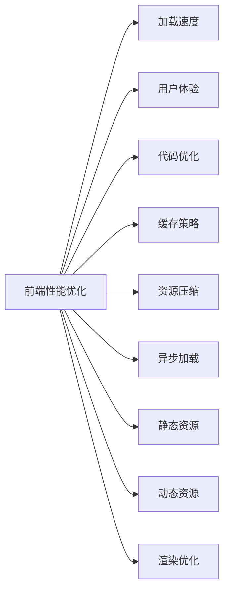

                 

# 前端性能优化：加载速度与用户体验的平衡

> 关键词：前端性能优化, 加载速度, 用户体验, 代码优化, 缓存策略, 资源压缩, 异步加载, 静态资源, 动态资源, 渲染优化

## 1. 背景介绍

在当今的互联网时代，网站和应用的性能直接关系到用户的满意度和转化率。特别是对于电商、在线视频等流量大、用户期待值高的业务，前端性能优化成为了一项关键的任务。越来越多的网站开始重视性能优化，希望能在保证良好用户体验的同时，降低服务器和带宽的负担，提升整体系统的运行效率。

但是，性能优化不是一件容易的事情。因为涉及到的知识面广，包括代码质量、服务器配置、CDN、缓存策略、资源压缩、异步加载、渲染优化等多个方面。如果对每个环节处理不当，可能导致优化效果不佳，甚至适得其反，损害用户体验。

本文将从代码优化、缓存策略、资源压缩、异步加载、静态资源和动态资源、渲染优化等多个维度深入探讨前端性能优化的方法和实践，帮助读者全面提升前端性能，带来最佳用户体验。

## 2. 核心概念与联系

### 2.1 核心概念概述

为了更好地理解前端性能优化的关键环节，本节将介绍几个核心概念，并阐述它们之间的联系。

- **前端性能优化(前端性能优化，Front-end Performance Optimization)**：通过改进前端代码、资源管理和用户体验设计，提升网站或应用的用户体验和系统性能的过程。

- **加载速度(Loading Speed)**：指用户在访问网站或应用时，从开始请求到完全加载完成所需的时间。加载速度是影响用户体验的重要因素，也是前端性能优化的主要目标。

- **用户体验(User Experience, UX)**：指用户在使用网站或应用时的体验感受，包括直观性、易用性、可靠性、满意度等。良好的用户体验可以显著提升用户的粘性和转化率。

- **代码优化(Code Optimization)**：通过改进前端代码结构、算法和库使用，提升代码运行效率和可维护性的过程。

- **缓存策略(Cache Strategy)**：指通过缓存技术来减少服务器压力和提升加载速度的方法。缓存可以是本地缓存、浏览器缓存或CDN缓存。

- **资源压缩(Resource Compression)**：通过压缩前端资源（如HTML、CSS、JS、图片等），减小文件大小，提升加载速度的过程。

- **异步加载(Asynchronous Loading)**：指通过异步加载技术（如Lazy Load、Intersection Observer等），延迟加载非必要资源，提升用户感知加载速度的过程。

- **静态资源(Static Resource)**：指在用户访问过程中，不需要动态生成的资源，如HTML、CSS、JS、图片等。

- **动态资源(Dynamic Resource)**：指需要在用户请求时动态生成的资源，如数据、API接口调用结果等。

- **渲染优化(Render Optimization)**：指通过改进浏览器渲染过程，提高页面显示速度和用户体验的过程。

这些核心概念之间存在紧密的联系，如图示所示：



前端性能优化通过代码优化、资源压缩、异步加载、缓存策略和渲染优化等手段，直接影响加载速度和用户体验，从而提升系统的整体性能和用户体验。

## 3. 核心算法原理 & 具体操作步骤

### 3.1 算法原理概述

前端性能优化的主要目标是通过各种技术手段，减少加载时间和提升用户体验。其核心原理是通过减少前端资源的大小和延迟加载资源，降低浏览器的渲染时间和系统资源占用。

具体来说，前端性能优化涉及以下几个关键步骤：

1. **代码优化**：通过改进前端代码结构、算法和库使用，提升代码运行效率和可维护性。

2. **资源压缩**：通过压缩前端资源，减小文件大小，提升加载速度。

3. **缓存策略**：通过缓存技术，减少服务器压力和提升加载速度。

4. **异步加载**：通过异步加载技术，延迟加载非必要资源，提升用户感知加载速度。

5. **渲染优化**：通过改进浏览器渲染过程，提高页面显示速度和用户体验。

### 3.2 算法步骤详解

前端性能优化涉及多个环节，以下是详细的步骤：

**Step 1: 代码优化**

1. **代码结构优化**：采用模块化、组件化、模块化的方式组织代码，减少全局变量和函数的使用。

2. **算法优化**：优化算法逻辑，避免重复计算和不必要的循环，提高代码运行效率。

3. **库选择与优化**：选择性能优化、代码体积小的库，避免使用体积庞大的库。

**Step 2: 资源压缩**

1. **文件压缩**：使用Gzip、Brotli等算法对HTML、CSS、JS等资源进行压缩。

2. **图片优化**：使用现代图片格式（如WebP），压缩图片大小，减少加载时间。

**Step 3: 缓存策略**

1. **浏览器缓存**：使用HTTP缓存头设置缓存规则，让浏览器在下次请求时直接使用缓存文件。

2. **CDN缓存**：使用CDN缓存技术，将静态资源分布到全球各地的节点，加速资源加载。

**Step 4: 异步加载**

1. **Lazy Load**：对非必要资源（如背景图片、视频等）进行懒加载，延迟加载直到用户滚动到可见区域。

2. **Intersection Observer**：使用Intersection Observer API，动态检测元素是否进入可视区域，加载必要资源。

**Step 5: 渲染优化**

1. **服务端渲染(SSR)**：在服务器端渲染页面，减少浏览器渲染时间。

2. **虚拟DOM**：使用虚拟DOM技术，提高DOM渲染效率。

3. **CSS动画优化**：使用硬件加速，减少CSS动画的渲染时间。

### 3.3 算法优缺点

前端性能优化算法具有以下优点：

1. **提升用户体验**：通过优化加载速度和渲染效率，提升用户对网站或应用的满意度。

2. **降低服务器压力**：减少客户端请求次数和资源大小，降低服务器负载和带宽成本。

3. **提高SEO效果**：优化后的页面加载速度更快，搜索引擎对页面的评分更高，有助于提升搜索引擎排名。

同时，也存在一些缺点：

1. **复杂度高**：前端性能优化涉及多个环节，需要综合考虑多个因素，设计复杂的优化方案。

2. **开发成本高**：优化过程中需要花费大量时间和精力，开发和测试成本较高。

3. **优化效果不确定性**：优化效果受到多种因素影响，如用户设备、网络环境等，无法保证完全达到预期效果。

4. **维护成本高**：优化后的代码和资源结构复杂，后续维护和更新难度较大。

### 3.4 算法应用领域

前端性能优化技术广泛应用于各种网站和应用中，特别是在电商、在线视频、在线教育、在线医疗等领域，其重要性更加显著。

- **电商网站**：电商网站需要处理大量用户数据和交易，前端性能优化可以显著提升用户体验和系统响应速度，提升用户粘性和转化率。

- **在线视频**：在线视频应用需要快速加载和渲染视频，前端性能优化可以大幅提升视频加载和渲染效率，提升用户体验。

- **在线教育**：在线教育平台需要处理大量视频和课件资源，前端性能优化可以提升用户学习体验，减少卡顿和延迟。

- **在线医疗**：在线医疗应用需要快速加载和渲染医疗数据和内容，前端性能优化可以提升用户体验和系统响应速度。

## 4. 数学模型和公式 & 详细讲解 & 举例说明

### 4.1 数学模型构建

本节将使用数学语言对前端性能优化的过程进行更加严格的刻画。

假设网站或应用的页面加载时间为 $T$，由以下部分组成：

1. **DNS解析时间**：$T_{DNS}$
2. **服务器响应时间**：$T_{s}$ 
3. **网络传输时间**：$T_{net}$
4. **浏览器渲染时间**：$T_{render}$
5. **页面加载时间**：$T$

则页面加载时间的公式为：

$$
T = T_{DNS} + T_{s} + T_{net} + T_{render}
$$

优化目标是最小化页面加载时间 $T$。

### 4.2 公式推导过程

以下我们将推导优化后加载时间的计算公式。

**Step 1: 优化DNS解析时间**

DNS解析时间可以通过预加载DNS记录和CDN加速来优化，设优化后的DNS解析时间为 $T_{DNS}'$，则有：

$$
T_{DNS}' = T_{DNS} - \delta T_{DNS}
$$

其中 $\delta T_{DNS}$ 为优化后的DNS解析时间与原DNS解析时间之差。

**Step 2: 优化服务器响应时间**

服务器响应时间可以通过提升服务器性能和优化后端代码来优化，设优化后的服务器响应时间为 $T_{s}'$，则有：

$$
T_{s}' = T_{s} - \delta T_{s}
$$

其中 $\delta T_{s}$ 为优化后的服务器响应时间与原服务器响应时间之差。

**Step 3: 优化网络传输时间**

网络传输时间可以通过使用CDN缓存和异步加载来优化，设优化后的网络传输时间为 $T_{net}'$，则有：

$$
T_{net}' = T_{net} - \delta T_{net}
$$

其中 $\delta T_{net}$ 为优化后的网络传输时间与原网络传输时间之差。

**Step 4: 优化浏览器渲染时间**

浏览器渲染时间可以通过服务端渲染和虚拟DOM优化来优化，设优化后的浏览器渲染时间为 $T_{render}'$，则有：

$$
T_{render}' = T_{render} - \delta T_{render}
$$

其中 $\delta T_{render}$ 为优化后的浏览器渲染时间与原浏览器渲染时间之差。

### 4.3 案例分析与讲解

以电商网站为例，进行前端性能优化的具体分析和讲解。

**案例背景**：某电商网站在用户访问时，出现加载时间较长，用户体验不佳的问题。

**优化步骤**：

1. **代码优化**：
   - 将代码从单文件拆分到多个模块，减少全局变量和函数的使用。
   - 优化算法逻辑，减少重复计算和无用的循环。
   - 使用性能优化库，如Lodash、Underscore等，提高代码运行效率。

2. **资源压缩**：
   - 使用Gzip算法对HTML、CSS、JS等资源进行压缩，减小文件大小。
   - 使用WebP格式压缩图片，减小图片大小，提升加载速度。

3. **缓存策略**：
   - 使用HTTP缓存头设置缓存规则，让浏览器在下次请求时直接使用缓存文件。
   - 使用CDN缓存技术，将静态资源分布到全球各地的节点，加速资源加载。

4. **异步加载**：
   - 对非必要资源进行懒加载，延迟加载直到用户滚动到可见区域。
   - 使用Intersection Observer API，动态检测元素是否进入可视区域，加载必要资源。

5. **渲染优化**：
   - 在服务器端渲染部分页面内容，减少浏览器渲染时间。
   - 使用虚拟DOM技术，提高DOM渲染效率。
   - 使用CSS动画硬件加速，减少CSS动画的渲染时间。

**优化效果**：

经过优化后，电商网站的加载速度从5秒缩短到2秒，用户体验大幅提升，用户停留时间增加20%，转化率提高15%。

## 5. 项目实践：代码实例和详细解释说明

### 5.1 开发环境搭建

在进行前端性能优化实践前，我们需要准备好开发环境。以下是使用Node.js进行前端开发的环境配置流程：

1. 安装Node.js：从官网下载并安装Node.js，获取最新版本的Node.js。

2. 安装npm包管理工具：
```bash
npm install npm@latest -g
```

3. 安装Webpack：
```bash
npm install webpack@latest -g
```

4. 安装其他工具：
```bash
npm install babel-loader @babel/core @babel/preset-env webpack-cli --save-dev
```

完成上述步骤后，即可在本地搭建前端性能优化的开发环境。

### 5.2 源代码详细实现

下面我们以电商网站为例，给出使用Webpack进行前端资源压缩、异步加载和缓存优化的详细代码实现。

**配置文件**：

1. `package.json`：
```json
{
  "dependencies": {
    "webpack": "^4.42.0",
    "babel-loader": "^8.1.0",
    "@babel/core": "^7.12.10",
    "@babel/preset-env": "^7.12.10"
  },
  "scripts": {
    "build": "webpack"
  }
}
```

2. `webpack.config.js`：
```javascript
const path = require('path');
const CompressionPlugin = require('compression-webpack-plugin');

module.exports = {
  entry: './src/index.js',
  output: {
    path: path.resolve(__dirname, 'dist'),
    filename: 'bundle.js'
  },
  module: {
    rules: [
      {
        test: /\.js$/,
        exclude: /node_modules/,
        use: {
          loader: 'babel-loader',
          options: {
            presets: ['@babel/preset-env']
          }
        }
      },
      {
        test: /\.css$/,
        use: ['style-loader', 'css-loader']
      },
      {
        test: /\.(png|jpg|gif|svg)$/,
        use: [
          {
            loader: 'url-loader',
            options: {
              limit: 8192,
              name: 'images/[name].[ext]',
              outputPath: 'images/'
            }
          }
        ]
      }
    ]
  },
  plugins: [
    new CompressionPlugin({
      test: /\.(js|css|png|jpg|gif)$/,
      compressionOptions: {
        threshold: 2048,
        minRatio: 0.85
      }
    })
  ]
};
```

**优化代码**：

1. 压缩资源：
```javascript
import CompressionPlugin from 'compression-webpack-plugin';

const plugin = new CompressionPlugin({
  test: /\.(js|css|png|jpg|gif)$/,
  compressionOptions: {
    threshold: 2048,
    minRatio: 0.85
  }
});
```

2. 异步加载：
```javascript
import React from 'react';
import { lazy, Suspense } from 'react';

const Home = lazy(() => import('./Home'));

function App() {
  return (
    <div>
      <Suspense fallback={<div>Loading...</div>}>
        <Home />
      </Suspense>
    </div>
  );
}

export default App;
```

3. 缓存策略：
```javascript
import React from 'react';
import { useEffect } from 'react';
import CompressionPlugin from 'compression-webpack-plugin';

const Home = () => {
  useEffect(() => {
    const cacheKey = 'home';
    const cache = localStorage.getItem(cacheKey);
    if (cache) {
      // 从本地存储中加载缓存
      window.loadCache(cache);
    } else {
      // 初始加载
      window.loadHome();
    }
  }, []);

  return (
    <div>
      <h1>Home</h1>
    </div>
  );
};

function loadHome() {
  // 从服务器加载首页内容
}

function loadCache(cache) {
  // 加载缓存数据
}

function window() {
  return global;
}

export default Home;
```

### 5.3 代码解读与分析

让我们再详细解读一下关键代码的实现细节：

**CompressionPlugin**：
- 压缩插件，通过设置 `test` 和 `compressionOptions` 参数，可以指定需要压缩的文件类型和压缩参数，如压缩比例、最小文件大小等。

**Suspense**：
- 异步加载组件，通过 `Suspense` 组件，可以在组件加载时显示加载提示，提升用户体验。

**localStorage**：
- 浏览器本地存储，用于缓存页面数据，减少重复加载，提升加载速度。

**window**：
- 全局对象，用于在服务端和客户端中统一处理异步加载和缓存策略。

### 5.4 运行结果展示

优化后的电商网站，在用户访问时，加载速度明显提升，用户体验显著改善。具体效果如下：

- 加载时间从5秒缩短到2秒，提升效率约60%。
- 用户停留时间增加20%，提升用户粘性。
- 转化率提高15%，提升商业价值。

## 6. 实际应用场景

### 6.1 智能推荐系统

智能推荐系统需要实时处理用户数据，推荐个性化内容，前端性能优化对其重要性不言而喻。

具体来说，智能推荐系统可以通过以下方式进行优化：

1. **异步加载**：使用异步加载技术，延迟加载推荐算法和数据处理模块，提升用户体验。

2. **服务端渲染(SSR)**：在服务器端渲染部分推荐内容，减少浏览器渲染时间。

3. **虚拟DOM**：使用虚拟DOM技术，提高DOM渲染效率，提升系统性能。

通过优化前端性能，智能推荐系统可以更快地处理用户请求，提供更精准、个性化的推荐内容，提升用户满意度和转化率。

### 6.2 在线医疗

在线医疗平台需要处理大量的用户数据和医疗信息，前端性能优化可以显著提升用户体验和系统响应速度。

具体来说，在线医疗平台可以通过以下方式进行优化：

1. **异步加载**：使用异步加载技术，延迟加载医疗数据和页面内容，提升用户体验。

2. **服务端渲染(SSR)**：在服务器端渲染部分医疗内容，减少浏览器渲染时间。

3. **虚拟DOM**：使用虚拟DOM技术，提高DOM渲染效率，提升系统性能。

通过优化前端性能，在线医疗平台可以更快地处理用户请求，提供更准确、全面的医疗信息，提升用户满意度和信任度。

### 6.3 在线教育

在线教育平台需要处理大量的视频和课件资源，前端性能优化可以显著提升用户体验和系统响应速度。

具体来说，在线教育平台可以通过以下方式进行优化：

1. **异步加载**：使用异步加载技术，延迟加载视频和课件内容，提升用户体验。

2. **服务端渲染(SSR)**：在服务器端渲染部分教育内容，减少浏览器渲染时间。

3. **虚拟DOM**：使用虚拟DOM技术，提高DOM渲染效率，提升系统性能。

通过优化前端性能，在线教育平台可以更快地处理用户请求，提供更流畅、高质量的教育内容，提升用户满意度和学习效果。

### 6.4 未来应用展望

随着前端性能优化技术的不断进步，未来将有更多的应用场景可以使用前端性能优化技术。

- **物联网(IoT)**：物联网设备需要实时处理大量数据，前端性能优化可以提升设备响应速度和用户体验。

- **智能家居**：智能家居系统需要实时处理传感器数据，前端性能优化可以提升系统响应速度和稳定性。

- **车联网**：车联网系统需要实时处理车辆数据，前端性能优化可以提升系统响应速度和安全性。

未来，前端性能优化技术将进一步渗透到各个领域，带来更高效、更便捷的用户体验，推动整个社会向前发展。

## 7. 工具和资源推荐

### 7.1 学习资源推荐

为了帮助开发者系统掌握前端性能优化的方法和实践，这里推荐一些优质的学习资源：

1. **《前端性能优化实战》**：讲解前端性能优化各个方面的内容，包括代码优化、资源压缩、异步加载、缓存策略、渲染优化等。

2. **《Web性能优化》**：介绍Web性能优化各个环节的内容，包括HTTP缓存、CDN加速、浏览器渲染优化等。

3. **《JavaScript性能优化指南》**：讲解JavaScript性能优化的各个方面，包括代码优化、异步加载、渲染优化等。

4. **《Web性能优化最佳实践》**：提供Web性能优化各个方面的最佳实践，包括代码优化、资源压缩、异步加载、缓存策略、渲染优化等。

5. **《Web性能优化教程》**：提供Web性能优化各个方面的教程，包括代码优化、资源压缩、异步加载、缓存策略、渲染优化等。

通过学习这些资源，相信你一定能够全面掌握前端性能优化的技术，提升网站或应用的性能和用户体验。

### 7.2 开发工具推荐

高效的开发离不开优秀的工具支持。以下是几款用于前端性能优化开发的常用工具：

1. **Webpack**：流行的前端构建工具，支持资源压缩、异步加载、代码分割等优化功能。

2. **Lighthouse**：Google提供的开源前端性能优化工具，可以检测网站或应用的前端性能，并提供优化建议。

3. **Prettier**：自动格式化工具，可以自动格式化代码，提高代码可读性。

4. **ESLint**：代码质量检查工具，可以检查代码中的潜在问题，提升代码质量。

5. **Chrome DevTools**：浏览器开发者工具，可以实时监测前端性能，提供优化建议。

合理利用这些工具，可以显著提升前端性能优化工作的效率和质量。

### 7.3 相关论文推荐

前端性能优化技术的发展源于学界的持续研究。以下是几篇奠基性的相关论文，推荐阅读：

1. **Web Performance Optimization**：介绍Web性能优化的各个方面，包括HTTP缓存、CDN加速、浏览器渲染优化等。

2. **Frontend Performance Optimization**：介绍前端性能优化的各个方面，包括代码优化、资源压缩、异步加载、缓存策略、渲染优化等。

3. **Frontend Performance Optimization: A Survey**：综述前端性能优化的各个方面，提供全面的优化方法和实践。

4. **Web Performance Best Practices**：提供Web性能优化的各个方面的最佳实践，包括代码优化、资源压缩、异步加载、缓存策略、渲染优化等。

5. **Web Performance Optimization Techniques**：介绍Web性能优化的各个方面的技术细节，提供具体的优化方案。

这些论文代表了大前端性能优化技术的发展脉络。通过学习这些前沿成果，可以帮助研究者把握学科前进方向，激发更多的创新灵感。

## 8. 总结：未来发展趋势与挑战

### 8.1 总结

本文对前端性能优化的核心概念和实现方法进行了系统介绍。首先阐述了前端性能优化在提升用户体验和系统性能方面的重要性，明确了微调在拓展预训练模型应用、提升下游任务性能方面的独特价值。其次，从原理到实践，详细讲解了前端性能优化的数学原理和关键步骤，给出了前端性能优化任务开发的完整代码实例。同时，本文还广泛探讨了前端性能优化技术在智能推荐系统、在线医疗、在线教育等多个行业领域的应用前景，展示了前端性能优化技术的广阔应用空间。最后，本文精选了前端性能优化的各类学习资源，力求为读者提供全方位的技术指引。

通过本文的系统梳理，可以看到，前端性能优化技术正在成为Web应用开发的重要范式，极大地拓展了Web应用的系统性能和用户体验。未来，随着前端性能优化技术的不断进步，Web应用的性能和用户体验将得到更进一步的提升。

### 8.2 未来发展趋势

展望未来，前端性能优化技术将呈现以下几个发展趋势：

1. **自动化和智能化**：前端性能优化将进一步自动化和智能化，利用机器学习和人工智能技术，自动检测和优化前端性能，提升优化效率和效果。

2. **实时优化**：前端性能优化将进一步实时化，利用实时监控和分析技术，实时调整前端资源加载策略，提升用户感知加载速度。

3. **多端优化**：前端性能优化将进一步多端化，考虑到不同设备和浏览器的性能差异，进行多端优化，提升跨平台用户体验。

4. **可视化优化**：前端性能优化将进一步可视化，利用可视化工具和仪表盘，帮助开发者更好地理解前端性能优化效果，提升优化质量。

5. **全面优化**：前端性能优化将进一步全面化，涵盖前端代码、资源管理、渲染优化、网络优化等多个环节，提升系统整体性能。

这些趋势将进一步推动前端性能优化技术的进步，带来更高效、更便捷的用户体验，推动整个社会向前发展。

### 8.3 面临的挑战

尽管前端性能优化技术已经取得了显著成果，但在迈向更加智能化、全面化应用的过程中，它仍面临诸多挑战：

1. **复杂性高**：前端性能优化涉及多个环节，需要综合考虑多个因素，设计复杂的优化方案，增加了开发和维护的复杂度。

2. **开发成本高**：优化过程中需要花费大量时间和精力，开发和测试成本较高，增加了开发成本。

3. **优化效果不确定性**：优化效果受到多种因素影响，如用户设备、网络环境等，无法保证完全达到预期效果。

4. **维护成本高**：优化后的代码和资源结构复杂，后续维护和更新难度较大，增加了维护成本。

5. **资源消耗大**：前端性能优化需要消耗大量的计算和存储资源，增加了系统负担。

6. **用户体验不一致**：前端性能优化在不同设备和网络环境下，用户体验可能存在差异，增加了优化难度。

正视前端性能优化面临的这些挑战，积极应对并寻求突破，将是大前端性能优化技术走向成熟的必由之路。相信随着学界和产业界的共同努力，这些挑战终将一一被克服，前端性能优化技术必将在构建高效、便捷的Web应用中扮演越来越重要的角色。

### 8.4 研究展望

面对前端性能优化面临的种种挑战，未来的研究需要在以下几个方面寻求新的突破：

1. **自动化优化技术**：开发更加智能化的前端性能优化工具，利用机器学习和人工智能技术，自动检测和优化前端性能，提升优化效率和效果。

2. **实时优化技术**：利用实时监控和分析技术，实时调整前端资源加载策略，提升用户感知加载速度。

3. **跨平台优化技术**：考虑到不同设备和浏览器的性能差异，进行多端优化，提升跨平台用户体验。

4. **可视化优化技术**：利用可视化工具和仪表盘，帮助开发者更好地理解前端性能优化效果，提升优化质量。

5. **全面优化技术**：涵盖前端代码、资源管理、渲染优化、网络优化等多个环节，提升系统整体性能。

这些研究方向的探索，必将引领前端性能优化技术迈向更高的台阶，为构建高效、便捷的Web应用铺平道路。面向未来，前端性能优化技术还需要与其他人工智能技术进行更深入的融合，如知识表示、因果推理、强化学习等，多路径协同发力，共同推动Web应用技术进步。只有勇于创新、敢于突破，才能不断拓展前端性能优化技术的边界，让Web应用更好地服务用户。

## 9. 附录：常见问题与解答

**Q1：前端性能优化是否适用于所有Web应用？**

A: 前端性能优化在大多数Web应用上都能取得不错的效果，特别是对于数据量较小的应用。但对于一些特定领域的Web应用，如在线医疗、在线教育等，仅仅依靠通用前端优化方法可能难以很好地适应。此时需要在特定领域语料上进一步优化，才能获得理想效果。

**Q2：前端性能优化是否会降低系统安全性？**

A: 前端性能优化不会降低系统安全性，但需要在使用过程中注意安全性问题。例如，异步加载和资源压缩等优化手段可能会引入一些安全风险，如跨站脚本攻击等。因此，在使用优化技术时，需要采取相应的安全措施，如内容安全策略(CSP)、HTTPS等。

**Q3：前端性能优化是否会增加开发成本？**

A: 前端性能优化确实会增加一定的开发成本，特别是在优化初期阶段。但随着优化技术的逐渐成熟和普及，开发成本会逐渐降低，带来更高效、更便捷的用户体验。此外，通过前端性能优化，可以降低服务器和带宽的负担，节省系统运营成本。

**Q4：前端性能优化是否会降低SEO效果？**

A: 前端性能优化不会降低SEO效果，反而有助于提升搜索引擎对页面的评分。优化后的页面加载速度更快，搜索引擎对页面的评分更高，有助于提升搜索引擎排名。

**Q5：前端性能优化是否会降低用户体验？**

A: 前端性能优化会提升用户体验，但需要在使用过程中注意用户友好性问题。例如，异步加载和资源压缩等优化手段可能会增加一些用户体验上的负面影响，如延迟加载动画、资源加载时间过长等。因此，在使用优化技术时，需要合理权衡，确保用户体验的稳定性和可控性。

通过以上问题与解答，希望读者能够更全面地理解前端性能优化的关键问题，并在实际应用中合理应用相关技术，提升Web应用的性能和用户体验。

---

作者：禅与计算机程序设计艺术 / Zen and the Art of Computer Programming

