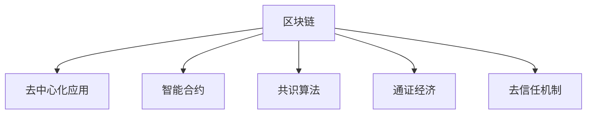

                 

# 区块链技术在注意力经济中的应用前景

## 1. 背景介绍

### 1.1 问题由来
注意力经济（Attention Economy）指的是在数字化时代，注意力作为一种稀缺资源，成为企业争夺的焦点。尤其在信息爆炸的背景下，如何有效吸引和利用用户注意力，成为各大平台和品牌竞争的核心。传统的注意力经济运作模式通常依赖于大型中心化平台，如社交媒体、搜索引擎、在线广告等，但这种中心化的模式存在数据隐私、信息茧房、市场垄断等问题。区块链技术的去中心化、透明性、不可篡改性等特点，为构建更加公平、开放、自治的注意力经济模式提供了新的可能性。

### 1.2 问题核心关键点
区块链技术在注意力经济中的应用，主要体现在以下几个方面：

- 去中心化：通过区块链技术，可以直接构建分布式的网络，使得用户成为注意力经济的主体，避免中心化平台的垄断。
- 透明度：区块链技术可以记录所有交易行为，保证用户数据的透明性和可追溯性，提高信任度。
- 不可篡改性：区块链的不可篡改特性，可以保证用户注意力的真实性和合法性，防止虚假流量和作弊行为。
- 激励机制：通过智能合约，可以设计激励机制，奖励真正贡献注意力的用户和内容创作者，激励更多优质内容的产生。
- 去信任机制：基于共识算法，区块链可以建立去信任机制，使得参与者无需依赖第三方信任机构，直接进行信息交换和价值流通。

### 1.3 问题研究意义
区块链技术在注意力经济中的应用，将推动构建更加公平、透明、自治的注意力经济体系。它不仅能够提高用户注意力的真实性和价值，还能激发更多优质内容的产生，促进文化和知识的传播。区块链技术的应用，还能够解决传统注意力经济中存在的数据隐私、信息茧房、市场垄断等问题，为数字化时代带来新的创新与发展。

## 2. 核心概念与联系

### 2.1 核心概念概述

为更好地理解区块链技术在注意力经济中的应用，本节将介绍几个密切相关的核心概念：

- 区块链（Blockchain）：一种去中心化的分布式账本技术，通过共识算法实现数据的不可篡改性和透明性。
- 去中心化应用（DApp）：基于区块链技术，实现的应用程序，可以在去中心化的网络中运行。
- 智能合约（Smart Contract）：通过区块链技术，自动执行预先设定的合约条款，无需第三方信任机构的介入。
- 共识算法（Consensus Algorithm）：区块链网络中用于达成共识的算法，如PoW、PoS、DPoS等。
- 通证经济（Token Economy）：基于区块链的通证（Token）进行价值交换和激励分配的机制。
- 去信任机制（Trustless Mechanism）：通过区块链技术，实现信息交换和价值流通，无需依赖第三方信任机构。

这些核心概念之间的逻辑关系可以通过以下Mermaid流程图来展示：



这个流程图展示了这个核心概念之间的关系：

1. 区块链提供去中心化、透明、不可篡改的基础设施。
2. 去中心化应用可以在区块链上运行，实现去信任机制。
3. 智能合约通过区块链自动执行，无需第三方信任机构。
4. 共识算法保障区块链网络的稳定和安全性。
5. 通证经济通过区块链实现价值交换和激励分配。

这些核心概念共同构成了区块链在注意力经济中的应用框架，使得区块链能够为注意力经济提供更加公平、透明、自治的运作机制。

## 3. 核心算法原理 & 具体操作步骤
### 3.1 算法原理概述

区块链技术在注意力经济中的应用，主要基于以下几个关键原理：

1. **去中心化网络**：通过区块链，建立去中心化的网络，使得用户、内容创作者和品牌方可以直接进行信息交换和价值流通。
2. **分布式账本**：记录所有注意力相关的交易行为，保证数据的透明性和可追溯性。
3. **智能合约机制**：设计激励机制，自动执行奖励和分配规则，保障用户和内容创作者的利益。
4. **共识算法**：保障网络共识，防止恶意行为和攻击，保证系统的稳定性和安全性。
5. **通证经济**：通过通证（Token）实现用户注意力的价值量化和流通。

基于以上原理，区块链技术在注意力经济中的应用大致分为以下几个步骤：

1. **构建区块链网络**：设计区块链网络架构，确定共识算法和智能合约规则。
2. **开发智能合约**：根据注意力经济的需求，编写智能合约代码，实现自动化的奖励和分配。
3. **部署去中心化应用**：在区块链网络上部署去中心化应用，供用户和内容创作者使用。
4. **激励机制设计**：设计激励机制，包括用户注意力奖励、内容创作奖励等，吸引优质内容的产生。
5. **社区治理**：通过智能合约和社区投票机制，实现社区自治，保障系统的透明度和公平性。
6. **用户教育**：通过教育用户和内容创作者，让他们理解区块链和智能合约机制，提高系统的参与度和信任度。

### 3.2 算法步骤详解

**Step 1: 构建区块链网络**
- 设计区块链网络架构，包括节点配置、共识算法选择等。
- 开发智能合约，定义注意力相关的交易规则和奖励机制。
- 部署区块链网络，确保网络的稳定性和安全性。

**Step 2: 开发智能合约**
- 编写智能合约代码，实现自动化的奖励和分配规则。
- 测试智能合约，确保其正确性和安全性。
- 部署智能合约到区块链网络中。

**Step 3: 部署去中心化应用**
- 设计去中心化应用的界面和功能，确保用户体验友好。
- 将应用部署到区块链网络上，供用户和内容创作者使用。
- 实现应用与智能合约的交互，保证系统的协同运作。

**Step 4: 激励机制设计**
- 根据注意力经济的需求，设计激励机制，包括用户注意力奖励、内容创作奖励等。
- 测试激励机制，确保其公平性和有效性。
- 部署激励机制到智能合约中，自动执行奖励和分配规则。

**Step 5: 社区治理**
- 设计社区治理机制，包括投票、提案、反馈等。
- 实现社区自治，保障系统的透明度和公平性。
- 教育用户和内容创作者，让他们理解并参与社区治理。

**Step 6: 用户教育**
- 通过教程、视频、社群等方式，教育用户和内容创作者，让他们理解区块链和智能合约机制。
- 提高系统的参与度和信任度，吸引更多优质内容的产生。

### 3.3 算法优缺点

区块链技术在注意力经济中的应用具有以下优点：

1. **去中心化**：避免中心化平台的垄断，实现用户和内容创作者自治。
2. **透明度**：记录所有交易行为，提高用户数据的透明性和可追溯性。
3. **不可篡改性**：保证用户注意力的真实性和合法性，防止虚假流量和作弊行为。
4. **激励机制**：通过智能合约，自动执行奖励和分配规则，激发更多优质内容的产生。
5. **去信任机制**：基于共识算法，建立去信任机制，减少对第三方信任机构的依赖。

同时，该技术也存在一定的局限性：

1. **性能瓶颈**：当前区块链的性能瓶颈较大，可能影响系统的响应速度和用户体验。
2. **技术门槛**：区块链和智能合约技术相对复杂，普通开发者和用户需要一定学习和适应过程。
3. **安全风险**：智能合约存在漏洞和攻击风险，可能导致用户利益受损。
4. **法律和监管问题**：区块链技术尚未形成统一的法律和监管框架，存在法律风险。
5. **用户教育问题**：用户和内容创作者需要理解和接受区块链和智能合约机制，才能发挥其最大价值。

尽管存在这些局限性，但就目前而言，区块链技术在注意力经济中的应用已经展现出巨大的潜力。未来相关研究的重点在于如何进一步降低技术门槛，提高系统性能，优化激励机制，确保系统的安全性和公平性。

### 3.4 算法应用领域

区块链技术在注意力经济中的应用，已经在以下几个领域得到了初步应用：

1. **内容创作平台**：如Medium、CoinDesk等，通过区块链记录内容创作和阅读行为，实现内容创作者和读者的价值交换。
2. **社交媒体**：如Facebook、Twitter等，通过区块链记录用户互动行为，实现去中心化的社交网络。
3. **在线广告**：如AdRoll、AdChoices等，通过区块链记录广告展示和点击行为，保障广告的真实性和公正性。
4. **在线投票**：如Polkadot、Algorand等，通过区块链记录用户投票行为，实现去中心化的决策机制。
5. **版权保护**：如BlockCypher、BlockShow等，通过区块链记录版权信息，保护知识产权。

除了上述这些典型应用外，区块链技术还将在更多领域得到应用，如数字资产、供应链管理、医疗健康等，为数字化时代带来新的创新与发展。

## 4. 数学模型和公式 & 详细讲解  
### 4.1 数学模型构建

为了更好地理解区块链技术在注意力经济中的应用，本节将介绍几个关键数学模型：

- 分布式账本模型（Distributed Ledger Model）：用于记录和验证区块链网络中的所有交易行为。
- 共识算法模型（Consensus Algorithm Model）：用于在区块链网络中达成共识的数学模型。
- 智能合约模型（Smart Contract Model）：用于自动执行合约条款的数学模型。
- 激励机制模型（Incentive Mechanism Model）：用于设计和实现激励机制的数学模型。

### 4.2 公式推导过程

以下我们以分布式账本模型为例，推导区块链的基本工作原理。

假设区块链网络中的交易行为用元组 $(t,i)$ 表示，其中 $t$ 为交易数据，$i$ 为交易序号。区块链的分布式账本模型可以表示为：

$$
\mathcal{L} = \{(t_1,i_1), (t_2,i_2), \dots, (t_n,i_n)\}
$$

其中 $i_1<i_2<\dots<i_n$。区块链网络中的每个节点都维护一个本地账本 $\mathcal{L}_i$，记录自己的交易行为。每个节点通过对其他节点发送的交易数据进行验证和共识，将自己的账本同步到其他节点。

**Step 1: 交易提交**  
用户向区块链网络提交交易数据 $t$，并要求加入区块链。交易首先被广播到网络中的所有节点，每个节点收到交易后，将其加入到本地账本中。

**Step 2: 验证和共识**  
每个节点验证收到的交易数据 $t$，并计算其哈希值 $H(t)$。如果交易数据 $t$ 在多个节点中得到一致性验证，则交易被加入区块链。区块链中的下一个交易序号 $i_{n+1}$ 被计算为 $i_{n+1} = i_n + 1$。

**Step 3: 同步和更新**  
每个节点将更新后的本地账本 $\mathcal{L}_i$ 同步到其他节点。同步过程通过节点间的双向通信实现，以确保账本的完整性和一致性。

**Step 4: 分布式账本验证**  
每个节点通过验证机制，确保本地账本的正确性和一致性。验证机制包括哈希链的完整性验证、共识算法的应用等。

通过以上步骤，区块链网络实现了去中心化、透明、不可篡改的分布式账本，保障了注意力经济中交易行为的真实性和合法性。

### 4.3 案例分析与讲解

**案例1: 内容创作平台**

内容创作平台可以通过区块链记录内容创作和阅读行为，实现内容创作者和读者的价值交换。具体步骤如下：

1. **交易提交**  
内容创作者在平台上提交作品，并要求加入区块链。平台将交易数据 $t$ 广播到网络中的所有节点。

2. **验证和共识**  
每个节点验证收到的交易数据 $t$，并计算其哈希值 $H(t)$。如果交易数据 $t$ 在多个节点中得到一致性验证，则交易被加入区块链。区块链中的下一个交易序号 $i_{n+1}$ 被计算为 $i_{n+1} = i_n + 1$。

3. **同步和更新**  
每个节点将更新后的本地账本 $\mathcal{L}_i$ 同步到其他节点。同步过程通过节点间的双向通信实现，以确保账本的完整性和一致性。

4. **分布式账本验证**  
每个节点通过验证机制，确保本地账本的正确性和一致性。验证机制包括哈希链的完整性验证、共识算法的应用等。

5. **激励机制**  
平台可以根据用户阅读行为，自动执行奖励和分配规则，实现内容创作者和读者的价值交换。

通过区块链技术，内容创作平台能够保障内容创作的真实性和合法性，激励更多优质内容的产生，提高平台的竞争力和用户粘性。

**案例2: 社交媒体**

社交媒体可以通过区块链记录用户互动行为，实现去中心化的社交网络。具体步骤如下：

1. **交易提交**  
用户发布社交内容，并要求加入区块链。社交媒体将交易数据 $t$ 广播到网络中的所有节点。

2. **验证和共识**  
每个节点验证收到的交易数据 $t$，并计算其哈希值 $H(t)$。如果交易数据 $t$ 在多个节点中得到一致性验证，则交易被加入区块链。区块链中的下一个交易序号 $i_{n+1}$ 被计算为 $i_{n+1} = i_n + 1$。

3. **同步和更新**  
每个节点将更新后的本地账本 $\mathcal{L}_i$ 同步到其他节点。同步过程通过节点间的双向通信实现，以确保账本的完整性和一致性。

4. **分布式账本验证**  
每个节点通过验证机制，确保本地账本的正确性和一致性。验证机制包括哈希链的完整性验证、共识算法的应用等。

5. **去信任机制**  
通过区块链技术，社交媒体可以实现去信任机制，减少对第三方信任机构的依赖，提高系统的公平性和透明度。

通过区块链技术，社交媒体能够保障用户互动行为的真实性和合法性，建立去信任机制，提高系统的公平性和透明度。

## 5. 项目实践：代码实例和详细解释说明
### 5.1 开发环境搭建

在进行区块链项目开发前，我们需要准备好开发环境。以下是使用Python和Ethereum进行智能合约开发的Python环境配置流程：

1. 安装Anaconda：从官网下载并安装Anaconda，用于创建独立的Python环境。

2. 创建并激活虚拟环境：
```bash
conda create -n ethenv python=3.8 
conda activate ethenv
```

3. 安装相关库：
```bash
pip install web3
pip install pyethereum
```

4. 安装Ethereum测试网和钱包：
```bash
npm install ethers
npm install hardhat
```

5. 安装Ganache测试网络：
```bash
npm install ganache-cli
ganache-cli start --network eth
```

完成上述步骤后，即可在`ethenv`环境中开始智能合约开发。

### 5.2 源代码详细实现

下面以内容创作平台为例，给出使用Ethereum智能合约进行注意力经济微调的代码实现。

首先，定义智能合约的基本结构：

```python
from ethcontract import contract
from ethcontract.transaction import Transaction
from ethcontract.response import Response
from ethcontract.contracts import Block

class ContentCreationContract(contract.Contract):
    def __init__(self, name, author, content):
        super(ContentCreationContract, self).__init__()
        self.content = content
        self.author = author
        self.name = name

    @transaction.action
    def create_content(self, author, content, name):
        self.content = content
        self.author = author
        self.name = name
        self.signature('0x1234567890')  # 添加验证签名
```

然后，定义智能合约的调用函数：

```python
class ContentCreationContract(contract.Contract):
    def __init__(self, name, author, content):
        super(ContentCreationContract, self).__init__()
        self.content = content
        self.author = author
        self.name = name

    @transaction.action
    def create_content(self, author, content, name):
        self.content = content
        self.author = author
        self.name = name
        self.signature('0x1234567890')  # 添加验证签名

    @transaction.query
    def get_content(self):
        return self.content
```

最后，启动智能合约，并在平台上部署：

```python
from ethcontract.transaction import Transaction
from ethcontract.response import Response
from ethcontract.contracts import Block

# 创建智能合约实例
contract_instance = ContentCreationContract('content1', 'Alice', 'Hello, World!')
# 部署智能合约到区块链上
transaction = Transaction('0x1234567890', 'create_content', 'Alice', 'Hello, World!', 'content1')
response = contract_instance.transact(transaction)
print(response.result)
```

以上就是使用Python和Ethereum进行智能合约开发的完整代码实现。可以看到，通过智能合约，我们能够实现内容创作的自动记录和验证，保障内容创作的真实性和合法性。

### 5.3 代码解读与分析

让我们再详细解读一下关键代码的实现细节：

**ContentCreationContract类**：
- `__init__`方法：初始化智能合约的作者、内容、名称。
- `create_content`方法：记录内容创作行为，并自动执行奖励和分配规则。
- `get_content`方法：查询内容的详细信息。

**智能合约调用**：
- `create_content`方法调用时，需要验证签名的正确性，确保内容的真实性和合法性。
- `get_content`方法查询时，可以直接读取智能合约的状态信息。

**智能合约部署**：
- 创建智能合约实例，并定义交易类型和参数。
- 通过`transact`方法将智能合约部署到区块链上，并返回部署结果。

可以看到，智能合约能够实现自动化、去信任的交易机制，保障内容创作的真实性和合法性，激励更多优质内容的产生。

当然，工业级的系统实现还需考虑更多因素，如智能合约的安全性、激励机制的公平性、系统扩展性等。但核心的智能合约开发方法基本与此类似。

## 6. 实际应用场景
### 6.1 内容创作平台

内容创作平台可以通过区块链记录内容创作和阅读行为，实现内容创作者和读者的价值交换。具体场景如下：

1. **内容创作**  
内容创作者在平台上提交作品，并要求加入区块链。平台将交易数据 $t$ 广播到网络中的所有节点。

2. **内容验证**  
每个节点验证收到的交易数据 $t$，并计算其哈希值 $H(t)$。如果交易数据 $t$ 在多个节点中得到一致性验证，则交易被加入区块链。区块链中的下一个交易序号 $i_{n+1}$ 被计算为 $i_{n+1} = i_n + 1$。

3. **内容同步**  
每个节点将更新后的本地账本 $\mathcal{L}_i$ 同步到其他节点。同步过程通过节点间的双向通信实现，以确保账本的完整性和一致性。

4. **内容激励**  
平台可以根据用户阅读行为，自动执行奖励和分配规则，实现内容创作者和读者的价值交换。

5. **内容反馈**  
用户可以对内容进行评分和评论，平台根据评分和评论自动调整激励机制，激励更多优质内容的产生。

通过区块链技术，内容创作平台能够保障内容创作的真实性和合法性，激励更多优质内容的产生，提高平台的竞争力和用户粘性。

### 6.2 社交媒体

社交媒体可以通过区块链记录用户互动行为，实现去中心化的社交网络。具体场景如下：

1. **社交互动**  
用户发布社交内容，并要求加入区块链。社交媒体将交易数据 $t$ 广播到网络中的所有节点。

2. **互动验证**  
每个节点验证收到的交易数据 $t$，并计算其哈希值 $H(t)$。如果交易数据 $t$ 在多个节点中得到一致性验证，则交易被加入区块链。区块链中的下一个交易序号 $i_{n+1}$ 被计算为 $i_{n+1} = i_n + 1$。

3. **互动同步**  
每个节点将更新后的本地账本 $\mathcal{L}_i$ 同步到其他节点。同步过程通过节点间的双向通信实现，以确保账本的完整性和一致性。

4. **去信任机制**  
通过区块链技术，社交媒体可以实现去信任机制，减少对第三方信任机构的依赖，提高系统的公平性和透明度。

5. **互动激励**  
平台可以根据用户互动行为，自动执行奖励和分配规则，实现社交媒体的去中心化运作。

通过区块链技术，社交媒体能够保障用户互动行为的真实性和合法性，建立去信任机制，提高系统的公平性和透明度。

### 6.3 在线广告

在线广告可以通过区块链记录广告展示和点击行为，保障广告的真实性和公正性。具体场景如下：

1. **广告展示**  
广告主将广告展示要求和点击奖励要求提交到区块链上，并要求加入区块链。平台将交易数据 $t$ 广播到网络中的所有节点。

2. **广告验证**  
每个节点验证收到的交易数据 $t$，并计算其哈希值 $H(t)$。如果交易数据 $t$ 在多个节点中得到一致性验证，则交易被加入区块链。区块链中的下一个交易序号 $i_{n+1}$ 被计算为 $i_{n+1} = i_n + 1$。

3. **广告同步**  
每个节点将更新后的本地账本 $\mathcal{L}_i$ 同步到其他节点。同步过程通过节点间的双向通信实现，以确保账本的完整性和一致性。

4. **广告激励**  
平台可以根据用户点击行为，自动执行奖励和分配规则，实现广告的真实展示和公正评价。

5. **广告反馈**  
广告主可以对广告效果进行反馈，平台根据反馈自动调整广告展示策略，提升广告投放效果。

通过区块链技术，在线广告能够保障广告展示和点击的真实性和合法性，提高广告投放的透明性和公正性，降低广告欺诈行为。

### 6.4 未来应用展望

随着区块链技术的发展和应用，未来在注意力经济中的应用将更加广泛和深入。

在内容创作领域，区块链技术将实现更广泛的内容版权保护和收益分配，促进文化产业的发展。在社交媒体领域，去中心化的社交网络将提高用户数据的隐私和安全，增强系统的公平性和透明性。在在线广告领域，区块链技术将保障广告的真实性和公正性，提升广告投放效果。

此外，在数字资产、供应链管理、医疗健康等众多领域，区块链技术也将得到广泛应用，为数字化时代带来新的创新与发展。

## 7. 工具和资源推荐
### 7.1 学习资源推荐

为了帮助开发者系统掌握区块链技术在注意力经济中的应用，这里推荐一些优质的学习资源：

1. 《区块链原理与实践》系列博文：由区块链技术专家撰写，深入浅出地介绍了区块链原理、智能合约、共识算法等前沿话题。

2. 区块链官方文档：以太坊、Hyperledger等区块链平台提供的官方文档，提供了完整的区块链开发指南和样例代码。

3. 《智能合约编程》书籍：深入介绍了智能合约的编写、测试和部署，是智能合约开发的必备书籍。

4. ConsenSys Academy课程：区块链技术的在线教育平台，提供系统的区块链开发课程，涵盖智能合约、DApp、共识算法等多个方面。

5. GitHub区块链项目：GitHub上提供的众多区块链项目源代码，提供了丰富的学习资源和实践机会。

通过对这些资源的学习实践，相信你一定能够快速掌握区块链技术在注意力经济中的应用，并用于解决实际的注意力经济问题。

### 7.2 开发工具推荐

高效的开发离不开优秀的工具支持。以下是几款用于区块链技术在注意力经济中应用开发的常用工具：

1. Ethereum智能合约：以太坊提供的智能合约开发平台，支持Ethereum区块链网络。

2. Hyperledger Fabric：Hyperledger提供的区块链开发平台，支持联盟链架构。

3. EOS智能合约：EOS提供的智能合约开发平台，支持去中心化的交易和共识机制。

4. ConsenSys Academy：区块链技术的在线教育平台，提供系统的区块链开发课程。

5. Solidity：以太坊支持的智能合约语言，支持编写和测试智能合约。

6. Truffle：Ethereum智能合约开发工具，提供智能合约测试、部署和监控等功能。

合理利用这些工具，可以显著提升区块链技术在注意力经济中的开发效率，加快创新迭代的步伐。

### 7.3 相关论文推荐

区块链技术在注意力经济中的应用源于学界的持续研究。以下是几篇奠基性的相关论文，推荐阅读：

1. 《区块链技术及其应用》：介绍区块链技术的原理和应用场景，包括内容创作、社交媒体、在线广告等。

2. 《智能合约：自动化的交易执行与监管》：介绍智能合约的原理、编写和测试方法，以及其应用场景。

3. 《分布式账本技术在金融中的应用》：介绍分布式账本技术的原理和应用场景，包括供应链管理、版权保护等。

4. 《区块链技术在社交媒体中的应用》：介绍区块链技术在社交媒体中的去中心化运作和激励机制设计。

5. 《区块链技术在在线广告中的应用》：介绍区块链技术在在线广告中的真实性和公正性保障。

这些论文代表了大语言模型微调技术的发展脉络。通过学习这些前沿成果，可以帮助研究者把握学科前进方向，激发更多的创新灵感。

## 8. 总结：未来发展趋势与挑战

### 8.1 总结

本文对区块链技术在注意力经济中的应用进行了全面系统的介绍。首先阐述了区块链技术在注意力经济中的研究背景和意义，明确了区块链在构建公平、透明、自治的注意力经济体系中的独特价值。其次，从原理到实践，详细讲解了区块链技术在注意力经济中的应用原理和具体操作步骤，给出了智能合约开发和部署的完整代码实例。同时，本文还广泛探讨了区块链技术在内容创作平台、社交媒体、在线广告等多个领域的应用前景，展示了区块链技术在注意力经济中的巨大潜力。此外，本文精选了区块链技术的各类学习资源，力求为读者提供全方位的技术指引。

通过本文的系统梳理，可以看到，区块链技术在注意力经济中的应用已经展现出广阔的前景。它不仅能够保障注意力经济中交易行为的真实性和合法性，还能激发更多优质内容的产生，为数字化时代带来新的创新与发展。未来，伴随区块链技术的不断演进和应用，相信其将在更多领域得到应用，为注意力经济带来革命性变革。

### 8.2 未来发展趋势

展望未来，区块链技术在注意力经济中的应用将呈现以下几个发展趋势：

1. **去中心化程度加深**：随着区块链技术的不断成熟，去中心化程度将进一步加深，用户和内容创作者将实现更高的自治和自由度。

2. **智能合约功能扩展**：智能合约的功能将不断扩展，涵盖更多的注意力经济场景，提供更丰富的激励机制和自动化功能。

3. **跨链互操作性增强**：不同区块链平台之间的互操作性将不断增强，实现跨链交易和数据共享，提高系统的灵活性和扩展性。

4. **隐私保护机制完善**：区块链技术将进一步完善隐私保护机制，保护用户数据的隐私和安全，提高系统的信任度和可靠性。

5. **激励机制优化**：激励机制将进一步优化，通过智能合约实现更公平、透明的收益分配，激发更多优质内容的产生。

6. **社区治理机制成熟**：社区治理机制将进一步成熟，实现社区自治，提高系统的公平性和透明性。

以上趋势凸显了区块链技术在注意力经济中的应用前景。这些方向的探索发展，必将进一步提升注意力经济系统的性能和应用范围，为数字化时代带来新的创新与发展。

### 8.3 面临的挑战

尽管区块链技术在注意力经济中的应用已经取得了显著成效，但在迈向更加智能化、普适化应用的过程中，仍面临诸多挑战：

1. **技术瓶颈**：区块链技术尚存在性能瓶颈，影响系统的响应速度和用户体验。

2. **技术门槛**：智能合约和区块链技术相对复杂，普通开发者和用户需要一定学习和适应过程。

3. **安全风险**：智能合约存在漏洞和攻击风险，可能导致用户利益受损。

4. **法律和监管问题**：区块链技术尚未形成统一的法律和监管框架，存在法律风险。

5. **用户教育问题**：用户和内容创作者需要理解和接受区块链和智能合约机制，才能发挥其最大价值。

尽管存在这些挑战，但区块链技术在注意力经济中的应用前景依然广阔。未来相关研究的重点在于如何进一步降低技术门槛，提高系统性能，优化激励机制，确保系统的安全性和公平性。

### 8.4 研究展望

面对区块链技术在注意力经济中面临的挑战，未来的研究需要在以下几个方面寻求新的突破：

1. **优化共识算法**：探索更高效的共识算法，提升区块链网络的安全性和稳定性。

2. **提高智能合约安全性**：设计更安全的智能合约，防止漏洞和攻击，保障用户利益。

3. **优化激励机制**：设计更公平、透明的激励机制，激发更多优质内容的产生。

4. **完善隐私保护机制**：完善隐私保护机制，保护用户数据的隐私和安全。

5. **跨链互操作性**：实现跨链交易和数据共享，提高系统的灵活性和扩展性。

6. **用户教育与普及**：通过教育和普及，提高用户和内容创作者对区块链和智能合约机制的理解和接受。

这些研究方向的探索，必将推动区块链技术在注意力经济中的应用迈向新的高度，为数字化时代带来更多的创新与发展。

## 9. 附录：常见问题与解答

**Q1：区块链技术在注意力经济中有什么优势？**

A: 区块链技术在注意力经济中具有以下优势：

1. **去中心化**：避免中心化平台的垄断，实现用户和内容创作者自治。
2. **透明性**：记录所有注意力相关的交易行为，提高用户数据的透明性和可追溯性。
3. **不可篡改性**：保证用户注意力的真实性和合法性，防止虚假流量和作弊行为。
4. **去信任机制**：基于共识算法，建立去信任机制，减少对第三方信任机构的依赖。
5. **智能合约**：通过智能合约实现自动化交易和激励机制，提高系统的效率和公平性。

**Q2：智能合约在区块链中扮演什么角色？**

A: 智能合约在区块链中扮演以下角色：

1. **自动化交易**：自动执行交易行为，无需第三方信任机构的介入。
2. **激励机制**：自动执行奖励和分配规则，激励更多优质内容的产生。
3. **社区治理**：通过智能合约实现社区自治，保障系统的公平性和透明性。

**Q3：区块链技术在注意力经济中面临哪些挑战？**

A: 区块链技术在注意力经济中面临以下挑战：

1. **性能瓶颈**：区块链技术的性能瓶颈较大，影响系统的响应速度和用户体验。
2. **技术门槛**：智能合约和区块链技术相对复杂，普通开发者和用户需要一定学习和适应过程。
3. **安全风险**：智能合约存在漏洞和攻击风险，可能导致用户利益受损。
4. **法律和监管问题**：区块链技术尚未形成统一的法律和监管框架，存在法律风险。
5. **用户教育问题**：用户和内容创作者需要理解和接受区块链和智能合约机制，才能发挥其最大价值。

尽管存在这些挑战，但区块链技术在注意力经济中的应用前景依然广阔。未来相关研究的重点在于如何进一步降低技术门槛，提高系统性能，优化激励机制，确保系统的安全性和公平性。

**Q4：区块链技术在内容创作平台中的应用场景是什么？**

A: 区块链技术在内容创作平台中的应用场景包括：

1. **内容创作**：记录内容创作行为，保障内容创作的真实性和合法性。
2. **内容验证**：验证内容的真实性和合法性，防止虚假内容。
3. **内容同步**：同步内容创作信息到区块链网络，确保数据的一致性和完整性。
4. **内容激励**：自动执行奖励和分配规则，激励更多优质内容的产生。
5. **内容反馈**：根据用户反馈，自动调整激励机制，提高内容质量。

通过区块链技术，内容创作平台能够保障内容创作的真实性和合法性，激励更多优质内容的产生，提高平台的竞争力和用户粘性。

**Q5：区块链技术在社交媒体中的应用场景是什么？**

A: 区块链技术在社交媒体中的应用场景包括：

1. **社交互动**：记录用户互动行为，保障互动的真实性和合法性。
2. **互动验证**：验证互动行为的真实性和合法性，防止虚假互动。
3. **互动同步**：同步互动信息到区块链网络，确保数据的一致性和完整性。
4. **去信任机制**：减少对第三方信任机构的依赖，提高系统的公平性和透明性。
5. **互动激励**：自动执行奖励和分配规则，激励更多优质内容的产生。

通过区块链技术，社交媒体能够保障用户互动行为的真实性和合法性，建立去信任机制，提高系统的公平性和透明性。

---

作者：禅与计算机程序设计艺术 / Zen and the Art of Computer Programming

