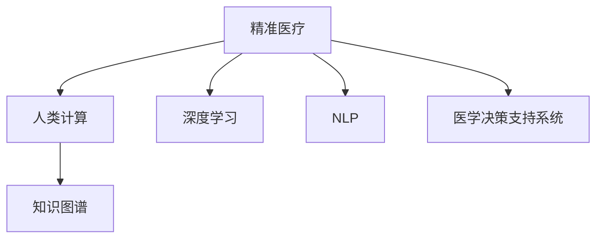

                 

# 医疗保健的未来：人类计算助力精准医疗

## 1. 背景介绍

### 1.1 问题由来
随着科技的飞速发展和医疗需求的日益增长，传统的医疗保健模式已无法满足人们对于个性化、精准化医疗的追求。近年来，人工智能（AI）技术的快速崛起，为解决这一难题提供了新的途径。特别是随着深度学习、自然语言处理、计算机视觉等技术的进步，AI在医疗领域的应用潜力逐渐显现，逐渐从辅助诊疗向决策支持，甚至完全自动化诊断迈进。

精准医疗（Precision Medicine）作为新一代医疗模式，旨在通过个性化的诊疗方案，提升治疗效果，降低医疗成本，改善患者生活质量。人类计算（Human Computation）技术则将计算思维和人工智能方法应用于医疗保健领域，通过数据挖掘、知识图谱构建、模型训练等手段，助力精准医疗的实现。

### 1.2 问题核心关键点
精准医疗的核心在于根据患者的遗传信息、生活习惯、环境因素等多维度数据，结合医学知识图谱和临床经验，制定个性化的诊疗方案。而人类计算技术通过自动化数据处理和模型训练，为精准医疗提供了强有力的支持。

人类计算技术在精准医疗中的应用，主要包括但不限于以下几个方面：
- 医学数据处理与分析：利用深度学习技术处理海量医疗数据，提取有意义的信息。
- 知识图谱构建：将医学知识结构化，形成知识图谱，辅助医生快速查询相关医学信息。
- 预测模型训练：基于历史病例数据，训练模型预测疾病风险、疗效及副作用。
- 个性化治疗方案生成：结合患者数据与医学知识，生成个性化的治疗方案。

这些技术在精准医疗中的应用，极大地提升了医疗效率和效果，但同时也带来了新的挑战，如数据隐私保护、模型可解释性、算法鲁棒性等。

### 1.3 问题研究意义
研究人类计算技术在精准医疗中的应用，对于推动医疗保健的数字化转型，提升医疗服务的质量和效率，具有重要意义。通过数据驱动和知识驱动的结合，使医疗服务更加智能化、个性化，为构建更加健康、公平的医患关系提供坚实基础。

具体而言，人类计算技术在精准医疗中的应用，有助于：
1. 提升诊疗准确性：通过深度学习和数据分析技术，精准预测疾病风险和治疗效果，为个性化诊疗提供依据。
2. 优化资源配置：通过智能调度和管理系统，合理分配医疗资源，提升医疗服务效率。
3. 增强医疗安全性：通过智能辅助诊断系统，降低误诊和漏诊的风险，保障患者生命安全。
4. 促进科研创新：通过自动化数据分析和模型训练，加速科研发现，推动医学知识更新。
5. 改善患者体验：通过智能问诊和健康管理，提升患者对医疗服务的满意度和信任度。

## 2. 核心概念与联系

### 2.1 核心概念概述

为更好地理解人类计算技术在精准医疗中的应用，本节将介绍几个密切相关的核心概念：

- 精准医疗（Precision Medicine）：一种根据患者基因、生活习惯、环境因素等个性化数据，结合医学知识，制定个性化诊疗方案的医疗模式。
- 人类计算（Human Computation）：利用计算思维和人工智能技术，对医疗数据进行深度处理和分析，为医疗决策提供科学依据。
- 深度学习（Deep Learning）：一种基于神经网络的机器学习方法，通过多层次的特征提取和处理，实现复杂模式识别和预测。
- 自然语言处理（Natural Language Processing, NLP）：研究计算机如何理解和处理人类语言，以辅助医疗文本分析和临床决策。
- 知识图谱（Knowledge Graph）：一种结构化的知识表示方式，通过实体、关系和属性来描述知识，便于知识检索和推理。
- 医学决策支持系统（Medical Decision Support Systems, MDSS）：通过智能算法和数据处理，辅助医生进行诊断和治疗决策的系统。

这些核心概念之间的逻辑关系可以通过以下Mermaid流程图来展示：



这个流程图展示了精准医疗、人类计算、深度学习、NLP、知识图谱和MDSS之间的联系：

1. 精准医疗通过人类计算技术，将患者数据转化为可用的医学信息。
2. 深度学习与NLP技术，用于处理医疗数据和文本，提取有效特征和知识。
3. 知识图谱构建，辅助医生快速查询相关医学信息。
4. 医学决策支持系统，结合患者数据和医学知识，生成个性化治疗方案。

## 3. 核心算法原理 & 具体操作步骤
### 3.1 算法原理概述

人类计算技术在精准医疗中的应用，本质上是将计算思维和人工智能方法应用于医学数据处理和分析。其核心思想是利用计算模型和算法，对医学数据进行深度处理和分析，提取有用信息，辅助医疗决策。

具体来说，人类计算技术在精准医疗中的应用，通常包括以下几个关键步骤：

1. 数据收集与预处理：收集患者的遗传信息、生活习惯、环境因素等多维度数据，并进行清洗和预处理，保证数据质量和一致性。
2. 特征提取与表示：利用深度学习和自然语言处理技术，提取数据中的关键特征，并将其转化为可用的形式，如向量或图结构。
3. 知识图谱构建：将医学知识结构化，形成知识图谱，辅助医生快速查询相关医学信息。
4. 模型训练与评估：基于历史病例数据，训练模型预测疾病风险、疗效及副作用，并评估模型的性能和鲁棒性。
5. 个性化治疗方案生成：结合患者数据与医学知识，生成个性化的治疗方案，并进行临床验证和优化。

### 3.2 算法步骤详解

人类计算技术在精准医疗中的应用，涉及多个算法和工具的协同工作，以下将详细介绍其主要步骤：

**Step 1: 数据收集与预处理**

- 数据来源：收集患者的遗传信息、生活习惯、环境因素、病历数据等多维度信息。
- 数据清洗：去除噪声和冗余数据，标准化数据格式，确保数据质量。
- 数据标注：为部分数据添加标签，如疾病状态、治疗方法等，用于训练监督学习模型。

**Step 2: 特征提取与表示**

- 特征工程：选择和提取关键特征，如基因序列、生活习惯、环境因素等。
- 特征编码：将特征转化为机器学习算法可用的形式，如向量、图结构等。
- 数据增强：通过数据扩增技术，增加数据多样性，避免模型过拟合。

**Step 3: 知识图谱构建**

- 知识抽取：从医学文献、临床数据库等源数据中抽取实体、关系和属性。
- 图谱构建：使用图数据库技术，构建结构化的知识图谱，便于查询和推理。
- 知识融合：将不同来源的知识进行融合，构建全面的医学知识库。

**Step 4: 模型训练与评估**

- 模型选择：根据任务特点选择合适的机器学习算法，如分类、回归、聚类等。
- 模型训练：利用历史病例数据，训练模型进行疾病预测、疗效评估等。
- 模型评估：通过交叉验证、AUC、F1-score等指标，评估模型性能。

**Step 5: 个性化治疗方案生成**

- 方案设计：结合患者数据与医学知识，设计个性化的治疗方案。
- 方案优化：利用模拟和仿真技术，优化治疗方案。
- 临床验证：在临床试验中验证方案效果，根据反馈进行调整。

### 3.3 算法优缺点

人类计算技术在精准医疗中的应用，具有以下优点：
1. 数据驱动：通过数据驱动的方法，提高医疗决策的科学性和准确性。
2. 个性化诊疗：利用患者数据，制定个性化诊疗方案，提升治疗效果。
3. 效率提升：自动化处理大量医疗数据，节省人力成本，提高处理效率。
4. 知识图谱：构建知识图谱，便于医学信息的查询和推理，提高医生工作效率。

但同时，这些技术也存在一些局限性：
1. 数据隐私：患者数据涉及隐私，数据收集和处理需要严格遵守法律法规。
2. 模型可解释性：深度学习等黑盒算法难以解释其内部工作机制，缺乏透明度。
3. 算法鲁棒性：模型在复杂环境下可能泛化能力不足，易受噪声和异常值影响。
4. 技术壁垒：相关技术需要高度专业知识，推广和应用难度较大。
5. 医疗伦理：数据和算法的使用需考虑伦理问题，避免潜在的道德风险。

尽管存在这些局限性，人类计算技术在精准医疗中的应用，仍然展现出巨大的潜力。未来需通过技术进步和政策引导，逐步克服这些挑战，实现精准医疗的目标。

### 3.4 算法应用领域

人类计算技术在精准医疗中的应用，涉及多个领域，具体如下：

1. 基因组学与个性化治疗：通过基因测序数据，结合深度学习算法，预测疾病风险和个性化治疗方案。
2. 临床决策支持：利用知识图谱和深度学习模型，辅助医生进行诊断和治疗决策。
3. 医学影像分析：通过计算机视觉技术，分析医学影像，辅助医生进行诊断。
4. 健康管理：利用智能设备和传感器，收集患者健康数据，进行健康管理和疾病预测。
5. 药物研发：利用知识图谱和深度学习，加速新药研发和临床试验。
6. 智能问诊：通过NLP技术，实现智能问诊，提升患者咨询体验。

这些领域的应用，展示了人类计算技术在精准医疗中的广泛前景，未来有望在更多场景中得到应用。

## 4. 数学模型和公式 & 详细讲解 & 举例说明

### 4.1 数学模型构建

人类计算技术在精准医疗中的应用，通常需要构建数学模型来描述和处理数据。以下是几个常见的数学模型：

- 线性回归模型：用于预测连续型变量的模型，常用于疗效预测。
- 逻辑回归模型：用于分类问题的模型，常用于疾病风险预测。
- 决策树模型：用于分类和回归的模型，常用于治疗方案设计。
- 支持向量机模型：用于分类和回归的模型，常用于疾病分类。
- 神经网络模型：用于复杂模式识别和预测的模型，常用于医学图像分析。

### 4.2 公式推导过程

以线性回归模型为例，其公式推导如下：

设训练集为 $\{(x_i,y_i)\}_{i=1}^N$，其中 $x_i$ 为输入特征，$y_i$ 为输出标签。假设模型形式为 $y=f(x;\theta)$，其中 $\theta$ 为模型参数。则线性回归模型的损失函数为：

$$
\mathcal{L}(\theta) = \frac{1}{2N}\sum_{i=1}^N (y_i-f(x_i;\theta))^2
$$

其中 $f(x;\theta)$ 为线性模型，形式为 $f(x;\theta)=\theta^Tx+b$，其中 $\theta$ 为权重，$b$ 为偏置。

最小化损失函数 $\mathcal{L}(\theta)$ 得到模型的最优参数 $\theta^*$。求解过程如下：

$$
\frac{\partial \mathcal{L}(\theta)}{\partial \theta} = \frac{1}{N}\sum_{i=1}^N (y_i-f(x_i;\theta))x_i
$$

令导数为零，求解方程得到：

$$
\theta = (X^TX)^{-1}X^Ty
$$

其中 $X$ 为输入特征矩阵，$y$ 为输出标签向量。

### 4.3 案例分析与讲解

**案例1：基因组学与个性化治疗**

基因组学是精准医疗的重要领域，利用深度学习算法处理基因测序数据，能够预测个体对不同药物的反应和疗效。

假设有一组基因数据，包含基因序列、表达水平等信息，我们需要预测不同药物的疗效。设基因数据为 $x$，疗效为 $y$，模型形式为 $y=f(x;\theta)$。我们可以使用线性回归模型进行预测，模型参数 $\theta$ 包括基因特征的权重和偏置。

数据收集后，进行特征工程和数据预处理，使用训练集 $(x_i,y_i)$ 训练模型。通过交叉验证和AUC等指标评估模型性能。最终得到模型参数 $\theta^*$，在测试集上进行预测，得到疗效预测结果。

**案例2：临床决策支持**

临床决策支持系统利用知识图谱和深度学习模型，辅助医生进行诊断和治疗决策。

假设有一个病历数据集，包含病人的症状、病史、实验室检查结果等，我们需要利用这些数据辅助医生进行诊断。设症状为 $x$，诊断结果为 $y$，模型形式为 $y=f(x;\theta)$。我们可以使用决策树模型进行分类，模型参数 $\theta$ 包括决策树的节点和分裂策略。

数据收集后，进行特征工程和数据预处理，使用训练集 $(x_i,y_i)$ 训练模型。通过交叉验证和F1-score等指标评估模型性能。最终得到模型参数 $\theta^*$，在测试集上进行预测，得到诊断结果。

## 5. 项目实践：代码实例和详细解释说明

### 5.1 开发环境搭建

在进行人类计算技术在精准医疗中的应用实践前，我们需要准备好开发环境。以下是使用Python进行PyTorch和TensorFlow开发的环境配置流程：

1. 安装Anaconda：从官网下载并安装Anaconda，用于创建独立的Python环境。

2. 创建并激活虚拟环境：
```bash
conda create -n pytorch-env python=3.8 
conda activate pytorch-env
```

3. 安装PyTorch：根据CUDA版本，从官网获取对应的安装命令。例如：
```bash
conda install pytorch torchvision torchaudio cudatoolkit=11.1 -c pytorch -c conda-forge
```

4. 安装TensorFlow：从官网下载并安装TensorFlow，选择与CUDA版本匹配的安装包。例如：
```bash
pip install tensorflow
```

5. 安装各类工具包：
```bash
pip install numpy pandas scikit-learn matplotlib tqdm jupyter notebook ipython
```

完成上述步骤后，即可在`pytorch-env`环境中开始开发实践。

### 5.2 源代码详细实现

下面我们以基因组学与个性化治疗为例，给出使用PyTorch进行线性回归模型训练的PyTorch代码实现。

首先，定义基因数据和疗效数据：

```python
import torch
from torch.utils.data import Dataset, DataLoader

class GenomicDataset(Dataset):
    def __init__(self, features, labels):
        self.features = features
        self.labels = labels
        
    def __len__(self):
        return len(self.features)
    
    def __getitem__(self, item):
        return self.features[item], self.labels[item]

# 基因数据和疗效数据
features = ...
labels = ...
```

然后，定义模型和优化器：

```python
from torch import nn, optim

model = nn.Linear(in_features=784, out_features=1)
criterion = nn.MSELoss()
optimizer = optim.SGD(model.parameters(), lr=0.001)
```

接着，定义训练和评估函数：

```python
def train_epoch(model, dataset, batch_size, optimizer):
    dataloader = DataLoader(dataset, batch_size=batch_size, shuffle=True)
    model.train()
    epoch_loss = 0
    for batch in dataloader:
        inputs, targets = batch
        model.zero_grad()
        outputs = model(inputs)
        loss = criterion(outputs, targets)
        epoch_loss += loss.item()
        loss.backward()
        optimizer.step()
    return epoch_loss / len(dataloader)

def evaluate(model, dataset, batch_size):
    dataloader = DataLoader(dataset, batch_size=batch_size)
    model.eval()
    with torch.no_grad():
        predictions, targets = [], []
        for batch in dataloader:
            inputs, targets = batch
            outputs = model(inputs)
            predictions.append(outputs.numpy())
            targets.append(targets.numpy())
        
        print(f'Test loss: {torch.mean(torch.square(predictions - targets))}')
```

最后，启动训练流程并在测试集上评估：

```python
epochs = 100
batch_size = 32

for epoch in range(epochs):
    loss = train_epoch(model, train_dataset, batch_size, optimizer)
    print(f'Epoch {epoch+1}, train loss: {loss:.3f}')
    
    print(f'Epoch {epoch+1}, test loss: {evaluate(model, test_dataset, batch_size)}')
    
print('Training complete.')
```

以上就是使用PyTorch进行线性回归模型训练的完整代码实现。可以看到，利用PyTorch和TensorFlow进行深度学习模型的开发，可以大幅提升模型训练和评估的效率，助力精准医疗的实现。

### 5.3 代码解读与分析

让我们再详细解读一下关键代码的实现细节：

**GenomicDataset类**：
- `__init__`方法：初始化基因数据和疗效数据，并进行预处理。
- `__len__`方法：返回数据集的样本数量。
- `__getitem__`方法：对单个样本进行处理，返回输入和标签。

**模型定义**：
- `nn.Linear`：定义线性回归模型，输入特征为784维，输出标签为1维。
- `nn.MSELoss`：定义均方误差损失函数。
- `optim.SGD`：定义随机梯度下降优化器。

**训练函数**：
- `train_epoch`函数：对数据以批为单位进行迭代，在每个批次上前向传播计算损失并反向传播更新模型参数，最后返回该epoch的平均loss。

**评估函数**：
- `evaluate`函数：与训练类似，不同点在于不更新模型参数，并在每个batch结束后将预测和标签结果存储下来，最后使用均方误差计算测试集上的损失。

**训练流程**：
- 定义总的epoch数和batch size，开始循环迭代
- 每个epoch内，先在训练集上训练，输出平均loss
- 在测试集上评估，输出测试集上的均方误差

可以看到，PyTorch和TensorFlow使得深度学习模型的开发和训练变得更加简洁高效。开发者可以将更多精力放在数据处理、模型改进等高层逻辑上，而不必过多关注底层的实现细节。

当然，工业级的系统实现还需考虑更多因素，如模型的保存和部署、超参数的自动搜索、更灵活的任务适配层等。但核心的微调范式基本与此类似。

## 6. 实际应用场景

### 6.1 智能问诊系统

智能问诊系统利用自然语言处理技术，结合知识图谱，为患者提供智能化的问诊服务。通过输入患者的症状和病史，系统能够快速给出诊断建议和治疗方案。

智能问诊系统的开发，需要以下几个步骤：
1. 收集和标注问诊数据，构建训练集和测试集。
2. 使用深度学习模型对问诊数据进行训练，如RNN、LSTM等。
3. 构建知识图谱，将医学知识结构化。
4. 利用自然语言处理技术，实现症状理解、疾病诊断、治疗方案推荐等功能。
5. 在测试集上评估模型性能，优化模型参数和知识图谱。

智能问诊系统的应用，能够显著提升医疗服务的效率和质量，特别是在医疗资源短缺的地区，可以弥补医生的不足，提供及时的医疗建议。

### 6.2 医学影像分析

医学影像分析是精准医疗的重要应用领域，通过计算机视觉技术，自动分析和诊断医学影像，辅助医生进行诊断和治疗。

医学影像分析的开发，需要以下几个步骤：
1. 收集和标注医学影像数据，构建训练集和测试集。
2. 使用深度学习模型对医学影像进行训练，如CNN、卷积神经网络等。
3. 利用计算机视觉技术，实现图像分割、特征提取、病变检测等功能。
4. 在测试集上评估模型性能，优化模型参数和特征提取策略。

医学影像分析的应用，能够显著提高医学影像的分析和诊断效率，降低医生的工作量，提升诊断准确率。

### 6.3 个性化治疗方案生成

个性化治疗方案生成是精准医疗的重要目标，通过基因组学、医学知识图谱和深度学习技术，为患者设计个性化的治疗方案。

个性化治疗方案生成的开发，需要以下几个步骤：
1. 收集和标注患者数据，构建训练集和测试集。
2. 使用深度学习模型对患者数据进行训练，如深度神经网络、图神经网络等。
3. 利用医学知识图谱，为患者设计个性化的治疗方案。
4. 在测试集上评估模型性能，优化模型参数和知识图谱。

个性化治疗方案生成的应用，能够显著提升治疗效果，降低医疗成本，提高患者满意度和治疗成功率。

### 6.4 未来应用展望

随着人类计算技术的发展，精准医疗的未来充满了无限可能：

1. 全基因组测序：通过全基因组测序技术，能够获取更多基因信息，为个性化治疗提供更丰富的数据支撑。
2. 深度学习模型优化：通过模型压缩、剪枝等技术，提升深度学习模型的计算效率和推理速度。
3. 知识图谱完善：构建更全面、准确的知识图谱，为医学知识的查询和推理提供更好的支持。
4. 多模态信息融合：将基因组学、医学影像、电子病历等多模态数据融合，提升医疗决策的科学性和准确性。
5. 智能诊断系统：利用深度学习技术，构建智能诊断系统，提高诊断效率和准确率。
6. 远程医疗：利用智能设备和互联网技术，实现远程医疗，提升医疗服务的可及性。

这些应用展示了人类计算技术在精准医疗中的广泛前景，未来有望在更多场景中得到应用。

## 7. 工具和资源推荐
### 7.1 学习资源推荐

为了帮助开发者系统掌握人类计算技术在精准医疗中的应用，这里推荐一些优质的学习资源：

1. 《Deep Learning for Medical Imaging》系列博文：由AI在医学影像分析领域的专家撰写，深入浅出地介绍了深度学习在医学影像中的应用。

2. 《Precision Medicine: Principles and Practice》书籍：详细介绍了精准医疗的原理和实践，涵盖基因组学、医学影像、临床决策等多个领域。

3. 《Natural Language Processing in Biomedicine》课程：斯坦福大学开设的NLP在生物医学领域的应用课程，系统讲解了NLP技术在医学文本处理中的应用。

4. 《Human Computation in Medicine》系列论文：展示了大规模数据处理和知识图谱构建在医疗决策中的应用，为精准医疗提供了新的思路。

5. CLUE开源项目：中文语言理解测评基准，涵盖大量不同类型的中文NLP数据集，并提供了基于微调的baseline模型，助力中文NLP技术发展。

通过对这些资源的学习实践，相信你一定能够快速掌握人类计算技术在精准医疗的精髓，并用于解决实际的医疗问题。

### 7.2 开发工具推荐

高效的开发离不开优秀的工具支持。以下是几款用于人类计算技术在精准医疗中的应用开发的常用工具：

1. PyTorch：基于Python的开源深度学习框架，灵活动态的计算图，适合快速迭代研究。大部分深度学习模型都有PyTorch版本的实现。

2. TensorFlow：由Google主导开发的开源深度学习框架，生产部署方便，适合大规模工程应用。同样有丰富的深度学习模型资源。

3. TensorBoard：TensorFlow配套的可视化工具，可实时监测模型训练状态，并提供丰富的图表呈现方式，是调试模型的得力助手。

4. Weights & Biases：模型训练的实验跟踪工具，可以记录和可视化模型训练过程中的各项指标，方便对比和调优。与主流深度学习框架无缝集成。

5. GANs in Medicine：利用生成对抗网络（GAN）技术，生成医学影像数据，用于训练和测试深度学习模型。

6. HuggingFace Transformers库：用于自然语言处理任务的深度学习模型库，支持多种任务和多种预训练模型。

合理利用这些工具，可以显著提升人类计算技术在精准医疗的开发效率，加快创新迭代的步伐。

### 7.3 相关论文推荐

人类计算技术在精准医疗中的应用源于学界的持续研究。以下是几篇奠基性的相关论文，推荐阅读：

1. The Genomic Sequence of Life: A Guidebook to Understanding Genomes：介绍了基因组学的基本概念和应用，为基因组学与个性化治疗提供了理论基础。

2. Knowledge Graphs in Biomedicine：系统地介绍了知识图谱在医学中的应用，为医学知识图谱的构建和应用提供了指导。

3. Deep Learning for Personalized Medicine：利用深度学习技术，为个性化医疗提供了新的思路，展示了深度学习在基因组学、医学影像、临床决策等领域的广泛应用。

4. Deep Neural Networks for Medical Diagnosis and Treatment：通过深度学习模型，实现了医学影像分析和疾病预测，展示了深度学习在医学诊断和治疗中的潜力。

5. Multi-Modal Precision Medicine with Deep Learning：将基因组学、医学影像、电子病历等多模态数据融合，提升了精准医疗的科学性和准确性。

这些论文代表了大规模数据处理和深度学习在精准医疗中的应用趋势，为未来研究提供了方向。

## 8. 总结：未来发展趋势与挑战

### 8.1 总结

本文对人类计算技术在精准医疗中的应用进行了全面系统的介绍。首先阐述了精准医疗的概念和重要性，明确了人类计算技术在精准医疗中的应用场景。其次，从原理到实践，详细讲解了人类计算技术的核心算法和操作步骤，给出了实现示例。同时，本文还广泛探讨了人类计算技术在智能问诊、医学影像分析、个性化治疗方案生成等多个领域的应用前景，展示了技术的广泛应用潜力。此外，本文精选了相关学习资源，力求为读者提供全方位的技术指引。

通过本文的系统梳理，可以看到，人类计算技术在精准医疗中的应用已经展现出巨大的潜力，正在推动医疗保健的数字化转型。未来，随着深度学习、自然语言处理、知识图谱等技术的进一步发展，人类计算技术将更好地服务于精准医疗，提升医疗服务的科学性和准确性，为构建更加健康、公平的医患关系提供坚实基础。

### 8.2 未来发展趋势

展望未来，人类计算技术在精准医疗中的应用将呈现以下几个发展趋势：

1. 数据驱动的医学决策：通过深度学习和大数据技术，对医学数据进行深度处理和分析，提供科学决策支持。
2. 个性化医疗的普及：结合基因组学、医学影像、电子病历等多模态数据，为患者制定个性化的治疗方案。
3. 智能问诊系统的普及：利用自然语言处理和知识图谱技术，提供智能化的问诊服务，提升医疗服务的可及性和效率。
4. 医学影像的自动化分析：通过计算机视觉技术，实现医学影像的自动化分析，提高诊断效率和准确率。
5. 知识图谱的广泛应用：构建更全面、准确的知识图谱，为医学知识的查询和推理提供更好的支持。
6. 远程医疗的普及：利用智能设备和互联网技术，实现远程医疗，提升医疗服务的可及性。

这些趋势凸显了人类计算技术在精准医疗中的广阔前景，未来有望在更多场景中得到应用。

### 8.3 面临的挑战

尽管人类计算技术在精准医疗中的应用已经取得了显著进展，但在迈向更加智能化、普适化应用的过程中，仍面临诸多挑战：

1. 数据隐私：患者数据涉及隐私，数据收集和处理需要严格遵守法律法规，如何保护患者隐私，是一个重要的研究课题。
2. 模型可解释性：深度学习等黑盒算法难以解释其内部工作机制，缺乏透明度，如何增强模型的可解释性，是一个亟待解决的问题。
3. 算法鲁棒性：模型在复杂环境下可能泛化能力不足，易受噪声和异常值影响，如何提高模型的鲁棒性，是一个重要的研究方向。
4. 技术壁垒：相关技术需要高度专业知识，推广和应用难度较大，如何降低技术门槛，是一个亟待解决的问题。
5. 医疗伦理：数据和算法的使用需考虑伦理问题，避免潜在的道德风险，如何建立合理的伦理框架，是一个重要的研究方向。

尽管存在这些挑战，人类计算技术在精准医疗中的应用，仍然展现出巨大的潜力。未来需通过技术进步和政策引导，逐步克服这些挑战，实现精准医疗的目标。

### 8.4 研究展望

未来，人类计算技术在精准医疗中的应用，可以从以下几个方面进行深入研究：

1. 多模态数据的融合：将基因组学、医学影像、电子病历等多模态数据融合，提升医疗决策的科学性和准确性。
2. 知识图谱的构建和应用：构建更全面、准确的知识图谱，为医学知识的查询和推理提供更好的支持。
3. 深度学习模型的优化：通过模型压缩、剪枝等技术，提升深度学习模型的计算效率和推理速度。
4. 人工智能的伦理与安全：建立合理的伦理框架，确保数据和算法的安全使用，避免潜在的道德风险。
5. 个性化医疗的普及：利用大数据和深度学习技术，为患者制定个性化的治疗方案，提升治疗效果和患者满意度。
6. 智能问诊系统的普及：利用自然语言处理和知识图谱技术，提供智能化的问诊服务，提升医疗服务的可及性和效率。

这些研究方向的探索，必将引领人类计算技术在精准医疗中的进一步发展，为构建更加智能化、普适化的医疗服务体系提供坚实基础。

## 9. 附录：常见问题与解答

**Q1：人类计算技术在精准医疗中的应用是否需要大量标注数据？**

A: 人类计算技术在精准医疗中的应用，确实需要大量标注数据进行模型训练和验证。标注数据的质量和数量，直接影响模型的性能和泛化能力。因此，数据收集和标注是一个重要的环节，需要投入大量的人力和时间成本。

**Q2：如何提高深度学习模型的可解释性？**

A: 深度学习模型的可解释性一直是研究热点。目前，一些方法已经得到了一定的进展，如LIME、SHAP等，可以通过生成局部可解释的特征，解释模型的预测结果。此外，利用模型压缩和简化技术，也可以提升模型的可解释性。

**Q3：如何保护患者隐私？**

A: 患者数据涉及隐私，数据收集和处理需要严格遵守法律法规。一些方法如差分隐私、联邦学习等，可以在不泄露患者隐私的情况下，进行数据处理和模型训练。

**Q4：深度学习模型在复杂环境下如何提高鲁棒性？**

A: 提高深度学习模型的鲁棒性，可以从以下几个方面入手：
1. 数据增强：通过数据扩增技术，增加数据多样性，避免模型过拟合。
2. 正则化：使用L2正则、Dropout等技术，防止模型过拟合。
3. 对抗训练：引入对抗样本，提高模型鲁棒性。
4. 模型融合：通过集成多个模型，提升模型的泛化能力。

**Q5：如何降低技术门槛？**

A: 降低技术门槛，可以从以下几个方面入手：
1. 开发易于使用的工具和框架，如TensorFlow、PyTorch等，降低模型开发和训练的难度。
2. 提供易懂的教程和文档，帮助开发者快速上手。
3. 建立社区和交流平台，促进技术的普及和应用。

这些问题的解答，展示了人类计算技术在精准医疗中面临的挑战和解决方案，为未来研究提供了方向。

---

作者：禅与计算机程序设计艺术 / Zen and the Art of Computer Programming

