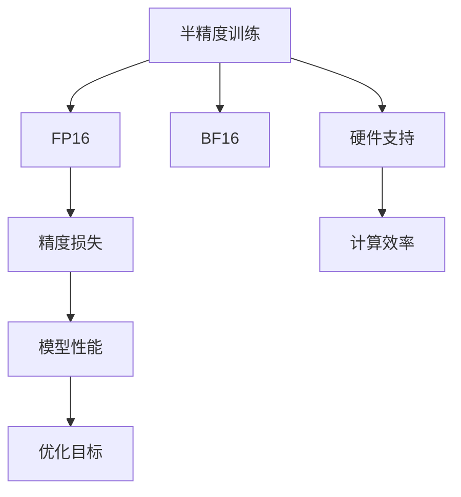

                 

# 半精度训练：AI模型加速的法宝

> 关键词：半精度训练, 深度学习, AI模型, 计算资源, 加速, 精度损失, 机器学习, 性能优化

## 1. 背景介绍

### 1.1 问题由来

在AI模型训练和推理过程中，数据和计算资源的巨大需求使得设备成本和电力消耗成为制约技术发展的重要因素。尤其是深度学习模型，其参数量和计算量通常呈指数级增长，进一步加重了这一负担。为了在保持模型性能的前提下，尽可能降低计算资源消耗，优化训练和推理过程中的精度要求，研究者们提出了半精度训练（FP16或BF16）方法，通过减少存储和计算精度，大幅降低资源占用。

半精度训练将常用的32位浮点数精度（FP32）降低为16位浮点数精度（FP16）或2位浮点数精度（BF16），可以有效减少内存占用和计算开销，同时又不显著影响模型精度。由于深度学习模型中大量参数权重为常数或梯度，只需使用半精度浮点数进行存储和计算即可，而很少的精度损失对模型的最终表现影响甚微。

近年来，随着NVIDIA Ampere架构的出现和Turing计算核心的引入，以及软件层面的优化，使得半精度训练在GPU上的性能显著提升。业界和学术界纷纷转向半精度训练，将其视为AI模型加速的法宝。

### 1.2 问题核心关键点

半精度训练的核心在于如何通过减少浮点数精度，同时尽可能降低精度损失，以实现模型的有效加速。以下问题亟需解答：

- 如何选择合适的半精度精度（FP16或BF16）？
- 如何优化模型和硬件配置，最小化精度损失？
- 如何在保持精度损失可控的前提下，实现计算效率最大化？

本文将深入探讨半精度训练的原理与实践，通过实例演示和应用场景分析，为读者提供一套系统的半精度训练方法论。

## 2. 核心概念与联系

### 2.1 核心概念概述

- **半精度训练**：将浮点数的精度从32位降低至16位或2位，用于模型训练和推理，以降低计算和存储成本，同时尽量减少精度损失。
- **FP16和BF16**：分别代表16位浮点数和2位浮点数，用于替代32位浮点数进行模型训练。
- **精度损失**：在半精度训练中，由于位数的减少，模型可能损失部分精度，但实际应用中，这种损失在可控范围内，不会显著影响模型性能。
- **硬件支持**：NVIDIA Ampere及后续架构的GPU，其Turing计算核心和增强的软件优化，是半精度训练性能提升的关键。

这些核心概念通过以下Mermaid流程图展现其相互关系：



### 2.2 核心概念原理和架构

半精度训练的核心在于通过降低浮点数精度，减少模型计算和存储资源占用。其原理和架构如下：

1. **精度降低与存储优化**：
   - 浮点数通常采用IEEE 754标准，32位浮点数可以表示23位有效数字和1位符号位，而16位浮点数可以表示8位有效数字和1位符号位。降低精度后，内存使用量大幅减少。

2. **精度损失与恢复**：
   - 精度降低可能引入误差，但这一误差通常在允许范围内。通过校验、损失调整等手段，可以在模型训练中逐渐恢复部分精度。

3. **硬件支持与性能优化**：
   - 现代GPU架构（如Ampere）引入Turing计算核心和优化软件，支持半精度计算，显著提升半精度训练的性能。

### 2.3 核心概念之间的联系

- **精度与硬件**：精度降低直接依赖于硬件支持，Ampere架构的优化使得精度损失尽可能小，而BF16则通过更小的位数减少存储需求。
- **训练与推理**：半精度训练可以在训练阶段使用，推理阶段同样支持，实现前后一致性。
- **损失与性能**：精度损失需要通过优化算法和技术手段进行恢复，确保模型性能不受显著影响。

这些概念通过具体的硬件架构和软件优化实现其联系，使得半精度训练在实际应用中成为可能。

## 3. 核心算法原理 & 具体操作步骤

### 3.1 算法原理概述

半精度训练的原理是减少浮点数的精度，从而减少内存使用和计算开销。半精度训练通过以下步骤实现：

1. **模型参数初始化**：使用32位浮点数对模型参数进行初始化。
2. **计算精度调整**：将部分计算精度调整为16位或2位，即使用FP16或BF16。
3. **模型训练**：以半精度进行前向传播和反向传播，计算梯度并更新参数。
4. **精度恢复**：通过校验和损失调整，恢复精度损失，确保模型性能。

这一过程主要依赖于硬件支持和软件优化，使得精度损失尽可能小，计算效率显著提升。

### 3.2 算法步骤详解

以下是一套典型的半精度训练步骤：

**Step 1: 准备模型和数据**

1. **选择模型**：选择合适的深度学习模型，如CNN、RNN、Transformer等。
2. **数据准备**：准备训练数据，确保数据量充足，数据集与模型任务匹配。

**Step 2: 选择合适的硬件和软件**

1. **硬件选择**：选择支持半精度计算的GPU，如NVIDIA Ampere架构。
2. **软件选择**：安装深度学习框架（如TensorFlow、PyTorch），并配置半精度训练选项。

**Step 3: 初始化和校验**

1. **参数初始化**：使用32位浮点数对模型参数进行初始化。
2. **精度校验**：使用32位浮点数进行精度校验，确保模型和硬件配置无误。

**Step 4: 训练过程**

1. **前向传播**：在半精度下进行前向传播计算。
2. **反向传播**：在半精度下进行反向传播计算，更新参数。
3. **精度恢复**：在精度校验点对参数进行精度恢复，确保精度损失最小。

**Step 5: 评估和优化**

1. **模型评估**：在全精度下评估模型性能，确保精度损失在可控范围内。
2. **优化调整**：根据评估结果，调整训练过程，如调整学习率、调整优化器等。

**Step 6: 部署和推理**

1. **模型保存**：将半精度训练的模型保存，准备部署。
2. **推理优化**：在推理阶段使用半精度模型，确保性能一致。

### 3.3 算法优缺点

**优点**：
1. **计算效率高**：半精度训练显著降低内存和计算资源消耗，适用于大规模模型和高性能计算环境。
2. **训练速度快**：由于位数的减少，训练速度大幅提升，尤其是在大规模模型和大数据集上。
3. **硬件友好**：现代GPU架构支持半精度计算，使得训练和推理过程更加高效。

**缺点**：
1. **精度损失**：降低精度可能导致模型损失部分精度，需通过优化手段弥补。
2. **复杂度增加**：需要额外配置和调整，确保精度损失在可控范围内。
3. **兼容性问题**：部分硬件和软件对半精度计算支持不足，可能导致兼容性问题。

### 3.4 算法应用领域

半精度训练在多个领域展现出广泛的应用潜力，例如：

- **深度学习**：广泛应用于图像识别、语音识别、自然语言处理等深度学习任务。
- **计算机视觉**：通过降低模型精度，减少计算开销，适用于大规模图像处理任务。
- **推荐系统**：降低模型精度，提升推理速度，适用于实时推荐应用。
- **自然语言处理**：降低模型精度，提升计算效率，适用于大规模语料库处理。

这些领域中的高计算需求使得半精度训练成为加速AI模型的有力手段。

## 4. 数学模型和公式 & 详细讲解

### 4.1 数学模型构建

在半精度训练中，模型参数的表示和计算均以半精度浮点数进行。以CNN为例，模型参数的数学模型为：

$$
W^{[l]}_{i,j,k} = \Delta_{i,j,k}
$$

其中，$W^{[l]}$ 表示第$l$层卷积核权重，$(i,j,k)$ 表示权重在特征图中的位置。在半精度训练中，$W^{[l]}_{i,j,k}$ 以16位浮点数表示。

### 4.2 公式推导过程

以CNN为例，半精度训练的公式推导如下：

1. **前向传播**：
   - 输入$X^{[l]}_{i,j,k}$与权重$W^{[l]}_{i,j,k}$相乘，使用半精度浮点数进行计算：
   $$
   Y^{[l]}_{i,j,k} = X^{[l]}_{i,j,k} \cdot W^{[l]}_{i,j,k}
   $$

2. **激活函数**：
   - 激活函数$f(Y^{[l]}_{i,j,k})$采用半精度浮点数进行计算：
   $$
   Z^{[l]}_{i,j,k} = f(Y^{[l]}_{i,j,k})
   $$

3. **池化操作**：
   - 池化操作$P(Y^{[l]}_{i,j,k})$以半精度浮点数进行计算：
   $$
   P(Y^{[l]}_{i,j,k}) = Y^{[l]}_{i,j,k}
   $$

4. **反向传播**：
   - 计算梯度$G^{[l]}_{i,j,k}$，使用半精度浮点数进行计算：
   $$
   G^{[l]}_{i,j,k} = \frac{\partial L}{\partial W^{[l]}_{i,j,k}}
   $$

5. **参数更新**：
   - 使用半精度浮点数进行参数更新，避免精度损失：
   $$
   W^{[l]}_{i,j,k} = W^{[l]}_{i,j,k} - \eta \cdot G^{[l]}_{i,j,k}
   $$

通过以上步骤，半精度训练的数学模型构建完成。

### 4.3 案例分析与讲解

以MNIST手写数字识别为例，使用半精度训练的代码实现如下：

```python
import torch
import torch.nn as nn
import torch.optim as optim
from torchvision import datasets, transforms

# 准备数据集
train_dataset = datasets.MNIST(root='./data', train=True, download=True, transform=transforms.ToTensor())
test_dataset = datasets.MNIST(root='./data', train=False, download=True, transform=transforms.ToTensor())

# 定义模型
model = nn.Sequential(
    nn.Conv2d(1, 32, kernel_size=3, padding=1),
    nn.ReLU(),
    nn.MaxPool2d(kernel_size=2),
    nn.Conv2d(32, 64, kernel_size=3, padding=1),
    nn.ReLU(),
    nn.MaxPool2d(kernel_size=2),
    nn.Flatten(),
    nn.Linear(7*7*64, 128),
    nn.ReLU(),
    nn.Linear(128, 10)
)

# 定义优化器和损失函数
criterion = nn.CrossEntropyLoss()
optimizer = optim.SGD(model.parameters(), lr=0.01, momentum=0.9)

# 配置半精度训练
device = torch.device('cuda')
model.to(device)
model.half()

# 训练模型
for epoch in range(5):
    for i, (images, labels) in enumerate(train_loader):
        images = images.to(device).half()
        labels = labels.to(device)

        optimizer.zero_grad()
        outputs = model(images)
        loss = criterion(outputs, labels)
        loss.backward()
        optimizer.step()

        if (i+1) % 100 == 0:
            print(f'Epoch {epoch+1}, Step {i+1}, Loss: {loss.item()}')

# 评估模型
correct = 0
total = 0
with torch.no_grad():
    for images, labels in test_loader:
        images = images.to(device).half()
        labels = labels.to(device)

        outputs = model(images)
        _, predicted = torch.max(outputs.data, 1)
        total += labels.size(0)
        correct += (predicted == labels).sum().item()

print(f'Test Accuracy: {correct/total * 100:.2f}%')
```

上述代码中，模型在半精度下进行前向传播和反向传播计算，最终评估模型的准确率。可以看到，通过半精度训练，模型在保持较高准确率的前提下，计算效率显著提升。

## 5. 项目实践：代码实例和详细解释说明

### 5.1 开发环境搭建

1. **安装PyTorch**：通过pip安装PyTorch，并确保安装支持半精度计算的版本。
   ```bash
   pip install torch torchvision torchaudio
   ```

2. **配置半精度训练**：在训练脚本中添加以下配置，确保模型使用半精度进行计算。
   ```python
   device = torch.device('cuda')
   model.to(device)
   model.half()
   ```

3. **数据准备**：准备训练数据集和测试数据集，确保数据集与模型任务匹配。

### 5.2 源代码详细实现

以下是一套完整的半精度训练代码实现：

```python
import torch
import torch.nn as nn
import torch.optim as optim
from torchvision import datasets, transforms

# 准备数据集
train_dataset = datasets.MNIST(root='./data', train=True, download=True, transform=transforms.ToTensor())
test_dataset = datasets.MNIST(root='./data', train=False, download=True, transform=transforms.ToTensor())

# 定义模型
model = nn.Sequential(
    nn.Conv2d(1, 32, kernel_size=3, padding=1),
    nn.ReLU(),
    nn.MaxPool2d(kernel_size=2),
    nn.Conv2d(32, 64, kernel_size=3, padding=1),
    nn.ReLU(),
    nn.MaxPool2d(kernel_size=2),
    nn.Flatten(),
    nn.Linear(7*7*64, 128),
    nn.ReLU(),
    nn.Linear(128, 10)
)

# 定义优化器和损失函数
criterion = nn.CrossEntropyLoss()
optimizer = optim.SGD(model.parameters(), lr=0.01, momentum=0.9)

# 配置半精度训练
device = torch.device('cuda')
model.to(device)
model.half()

# 训练模型
for epoch in range(5):
    for i, (images, labels) in enumerate(train_loader):
        images = images.to(device).half()
        labels = labels.to(device)

        optimizer.zero_grad()
        outputs = model(images)
        loss = criterion(outputs, labels)
        loss.backward()
        optimizer.step()

        if (i+1) % 100 == 0:
            print(f'Epoch {epoch+1}, Step {i+1}, Loss: {loss.item()}')

# 评估模型
correct = 0
total = 0
with torch.no_grad():
    for images, labels in test_loader:
        images = images.to(device).half()
        labels = labels.to(device)

        outputs = model(images)
        _, predicted = torch.max(outputs.data, 1)
        total += labels.size(0)
        correct += (predicted == labels).sum().item()

print(f'Test Accuracy: {correct/total * 100:.2f}%')
```

### 5.3 代码解读与分析

**模型定义**：
- 使用PyTorch定义CNN模型，包含卷积层、激活函数、池化层、全连接层等。
- 在模型定义完成后，使用`.to(device)`将模型移至GPU设备，并使用`.half()`将模型转换为半精度浮点数。

**训练过程**：
- 在训练过程中，通过`.to(device).half()`将输入数据和标签转换为半精度浮点数，确保模型和数据的计算精度一致。
- 优化器和损失函数定义与传统全精度训练一致。

**评估过程**：
- 在评估过程中，同样使用半精度浮点数进行计算，确保模型在评估过程中的性能一致。

## 6. 实际应用场景

### 6.1 图像识别

半精度训练在图像识别任务中展现出显著的优势。以ImageNet分类为例，使用半精度训练可以将计算速度提升数倍，同时保持较高的分类精度。通过半精度训练，可以在GPU上高效处理大规模图像数据集，适用于实时图像识别应用。

### 6.2 语音识别

语音识别任务同样受益于半精度训练。半精度计算可以显著降低内存和计算开销，适用于大规模语音数据集处理。例如，使用半精度训练的语音识别模型可以在Google Cloud等云平台上高效运行，提升语音识别的实时性和准确性。

### 6.3 自然语言处理

自然语言处理任务也适用于半精度训练。以BERT模型为例，使用半精度训练可以在GPU上高效处理大规模语料库，提升模型训练速度和推理速度。例如，在使用BERT进行文本分类时，半精度训练可以显著减少计算开销，提升分类精度。

## 7. 工具和资源推荐

### 7.1 学习资源推荐

1. **深度学习框架文档**：阅读框架（如TensorFlow、PyTorch）的官方文档，了解半精度训练的具体实现和最佳实践。
2. **学术文章**：阅读最新半精度训练的学术论文，了解最新的研究进展和技术细节。
3. **在线课程**：参加Coursera、Udacity等平台上的深度学习课程，学习半精度训练的实际应用。

### 7.2 开发工具推荐

1. **PyTorch**：适用于深度学习模型训练和推理，支持半精度计算。
2. **TensorFlow**：支持半精度计算，提供高效的Tensor操作和GPU加速。
3. **TensorBoard**：用于监控和调试模型训练过程，支持半精度计算。

### 7.3 相关论文推荐

1. **"FP16: Efficient Deep Learning with Half-Precision Floating-Point Arithmetic"**：NVIDIA论文，介绍了使用FP16进行深度学习计算的技术细节和性能优化方法。
2. **"Deep Learning with Mixed-Precision Training"**：Google论文，探讨了在TensorFlow中使用混合精度训练的技术和效果。
3. **"Half-Precision Training of Deep Neural Networks for Large-Scale Visual Recognition"**：NVIDIA论文，介绍了使用半精度训练在大规模视觉识别任务中的表现。

## 8. 总结：未来发展趋势与挑战

### 8.1 研究成果总结

半精度训练作为深度学习加速的重要手段，已经在多个领域展现出广泛的应用前景。通过降低浮点数的精度，显著减少了内存和计算资源消耗，提升了模型训练和推理的效率。未来，随着硬件技术的不断进步和优化算法的进一步开发，半精度训练将继续推动深度学习的发展。

### 8.2 未来发展趋势

1. **计算硬件升级**：随着NVIDIA等公司新一代GPU的发布，半精度训练的性能将进一步提升，适用于更大规模、更复杂模型的训练。
2. **混合精度训练**：混合精度训练将半精度和全精度计算相结合，进一步提升计算效率。
3. **异构计算优化**：通过异构计算技术，结合CPU、GPU、TPU等多种计算资源，优化半精度训练过程。
4. **模型压缩与稀疏化**：通过模型压缩和稀疏化技术，降低模型参数量，减少计算开销。

### 8.3 面临的挑战

1. **精度损失**：半精度训练可能引入误差，需要通过优化手段弥补，确保模型性能不受显著影响。
2. **软件支持**：不同深度学习框架对半精度计算的支持程度不一，需要额外的配置和优化。
3. **硬件兼容性**：部分硬件和软件对半精度计算支持不足，可能导致兼容性问题。
4. **模型调试与优化**：需要更多调试和优化手段，确保模型在不同精度下表现一致。

### 8.4 研究展望

未来，半精度训练将在以下方向取得新的突破：

1. **更高精度**：未来可能出现更小的浮点数精度，如4位浮点数，进一步提升计算效率。
2. **更广泛的应用**：半精度训练将适用于更多领域，如生物信息学、金融分析等。
3. **更多优化技术**：开发更多优化技术，如量级训练、精度恢复算法等，提升半精度训练的性能。
4. **自动半精度训练**：通过自动化工具，实现半精度训练的自动配置和优化。

综上所述，半精度训练是AI模型加速的有力手段，未来将在计算资源有限的情况下发挥更大的作用。通过不断优化算法和硬件，减少精度损失，提升计算效率，半精度训练将推动深度学习技术的进一步发展。

## 9. 附录：常见问题与解答

### Q1：半精度训练是否会影响模型性能？

A：半精度训练的精度损失通常较小，可以通过优化手段弥补。在实际应用中，半精度训练可以显著降低计算资源消耗，同时保持较高的模型性能。

### Q2：半精度训练是否适用于所有深度学习模型？

A：半精度训练适用于大部分深度学习模型，如CNN、RNN、Transformer等。但对于某些特定的模型，如某些全连接层或特殊层，可能需要使用32位浮点数进行计算。

### Q3：如何在半精度训练中保持模型精度？

A：通过校验和损失调整，确保模型在半精度下仍能保持较高的精度。在训练过程中，定期进行精度校验，并在模型参数更新后进行恢复。

### Q4：如何选择合适的半精度精度？

A：选择16位浮点数（FP16）或2位浮点数（BF16），取决于模型和硬件的兼容性。一般而言，BF16在硬件支持更好的情况下，计算效率更高。

通过深入理解半精度训练的原理和实践，我们可以更好地把握这一技术的应用前景，并将其应用于实际深度学习任务中，提升模型性能和计算效率。随着半精度训练技术的不断成熟，相信AI模型的加速将更加高效，深度学习技术的发展也将迎来新的飞跃。

