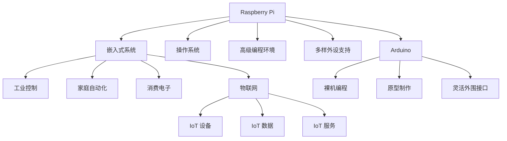

                 

# 单板计算机项目灵感：Raspberry Pi 和 Arduino 的应用场景

> 关键词：单板计算机, Raspberry Pi, Arduino, 应用场景, 项目灵感, 硬件与软件融合

## 1. 背景介绍

### 1.1 问题由来

在当今数字化时代，硬件与软件融合成为了技术发展的重要趋势。从物联网到人工智能，从工业控制到消费电子，硬件设备与软件系统的结合使得产品具备了更强大的功能和更灵活的应用。为了激发开发者在硬件与软件融合领域的创新灵感，我们引入了两个经典单板计算机平台：Raspberry Pi 和 Arduino。它们各自拥有独特的特点和丰富的应用场景，并且都具备了庞大的社区支持，能够快速启动项目开发。

### 1.2 问题核心关键点

Raspberry Pi 和 Arduino 两个平台都在嵌入式领域有着广泛的应用，但它们的设计思路和技术路径有所不同。Raspberry Pi 采用ARM架构，搭载了操作系统，提供了更高级的编程环境和更多的外设支持。而Arduino则采用裸机编程，提供了快速的原型制作能力和灵活的外围接口。

它们的应用场景覆盖了从简单的电子制作到复杂的数据处理和机器学习，覆盖了从消费电子到工业自动化，从家庭智能到物联网的广泛领域。理解和掌握这两个平台的特性，可以帮助开发者打开新的思路，创新新的产品。

### 1.3 问题研究意义

理解和掌握这两个平台的特性和应用场景，对加速硬件与软件融合领域的发展具有重要意义：

1. **成本效益高**：使用这两个平台可以大幅降低硬件开发的成本，同时也能利用开源社区的丰富资源。
2. **灵活性强**：可以灵活地进行硬件设计和软件开发，快速迭代原型，缩短开发周期。
3. **应用广泛**：涵盖从消费电子到工业控制、从智能家居到物联网的各个领域，助力技术创新和行业升级。
4. **技术领先**：掌握这两个平台的最新技术，可以在技术发展前沿找到新的突破点，提升竞争力。
5. **教育价值**：作为教育和培训机构的重要工具，能够帮助学生和开发者更直观地理解计算机原理和软硬件集成技术。

## 2. 核心概念与联系

### 2.1 核心概念概述

为更好地理解Raspberry Pi 和 Arduino 的应用场景，本节将介绍几个密切相关的核心概念：

- **Raspberry Pi**：基于ARM架构的单板计算机，提供操作系统和高级编程环境，适用于嵌入式系统、家庭自动化、工业控制等。
- **Arduino**：采用AVR或ARM微控制器的单板计算机，提供快速的原型制作能力和灵活的外围接口，适用于电子制作、物联网、机器人等领域。
- **嵌入式系统**：以应用为中心，软件硬件相结合的软硬件一体化系统，如智能家居、消费电子、工业控制等。
- **物联网(IoT)**：将物理世界与数字世界连接起来的互联网，涵盖设备、数据和服务的广泛领域，包括智能家居、工业自动化、智慧城市等。
- **软硬件融合**：硬件设备与软件系统的紧密结合，实现设备智能化、功能优化和用户体验提升。

这些核心概念之间的逻辑关系可以通过以下Mermaid流程图来展示：



这个流程图展示了大语言模型的核心概念及其之间的关系：

1. Raspberry Pi 和 Arduino 都广泛应用于嵌入式系统，Raspberry Pi 提供了操作系统和高级编程环境，Arduino 提供快速的原型制作能力和灵活的外围接口。
2. Raspberry Pi 适合开发工业控制、家庭自动化和消费电子等应用。
3. Arduino 适合开发物联网设备和数据处理等应用。
4. 嵌入式系统、物联网以及软硬件融合，都是硬件与软件紧密结合的重要领域。

这些概念共同构成了Raspberry Pi 和 Arduino 的应用框架，使其能够适应各种复杂的场景和需求。

## 3. 核心算法原理 & 具体操作步骤
### 3.1 算法原理概述

Raspberry Pi 和 Arduino 的硬件平台与软件开发环境有着各自的特点。Raspberry Pi 通常采用操作系统进行编程，而Arduino 则是基于裸机编程。尽管实现方式不同，但基本的编程流程和应用场景是相似的。

以Raspberry Pi 为例，其基本流程包括：

1. 硬件设计：根据需求设计电路板，选择合适的处理器和外围接口。
2. 软件环境搭建：安装操作系统和开发工具链，配置开发环境。
3. 编程实现：根据需求编写程序，编译并运行。
4. 测试验证：测试程序功能，修正错误。
5. 部署应用：将程序部署到实际硬件设备上，运行测试。

### 3.2 算法步骤详解

以Arduino为例，其基本流程如下：

1. 硬件搭建：选择合适的微控制器，设计电路板，搭建硬件。
2. 编程实现：编写C/C++代码，实现功能逻辑。
3. 编译上传：使用Arduino IDE编译代码，并通过USB上传至硬件设备。
4. 测试验证：在硬件设备上运行程序，调试错误。
5. 部署应用：将程序固化在硬件设备上，长期运行。

以下是具体的详细步骤：

**Step 1: 硬件设计**

- **Raspberry Pi**：选择合适的处理器和外围接口，如USB、GPIO、网口等。
- **Arduino**：选择合适的微控制器，如ATmega328、ATtiny、Arduino UNO等，设计电路板。

**Step 2: 软件环境搭建**

- **Raspberry Pi**：安装Raspbian操作系统，安装Python、PyInstaller、Flask等工具。
- **Arduino**：安装Arduino IDE，配置开发板，下载并安装必要的库文件。

**Step 3: 编程实现**

- **Raspberry Pi**：使用Python或C/C++语言编写程序，实现功能逻辑。
- **Arduino**：使用C/C++语言编写程序，实现功能逻辑。

**Step 4: 编译上传**

- **Raspberry Pi**：使用PyInstaller打包程序，部署到实际设备上。
- **Arduino**：使用Arduino IDE编译代码，并通过USB上传至硬件设备。

**Step 5: 测试验证**

- **Raspberry Pi**：使用模拟环境或实际设备进行测试，修正错误。
- **Arduino**：在硬件设备上运行程序，调试错误。

**Step 6: 部署应用**

- **Raspberry Pi**：将程序固化在SD卡上，部署到实际设备上。
- **Arduino**：将程序固化在微控制器上，部署到实际设备上。

### 3.3 算法优缺点

**Raspberry Pi**

- **优点**：提供操作系统和高级编程环境，适合开发复杂的嵌入式系统应用。硬件外设支持丰富，方便调试和部署。
- **缺点**：硬件成本较高，软件环境搭建复杂。

**Arduino**

- **优点**：快速的原型制作能力和灵活的外围接口，适合快速迭代和试错。硬件成本低，开发门槛低。
- **缺点**：编程语言单一，可扩展性有限。硬件外设支持相对较少，调试复杂。

### 3.4 算法应用领域

Raspberry Pi 和 Arduino 广泛应用于以下领域：

- **Raspberry Pi**

  1. **工业控制**：如自动化生产线、机器人控制、传感器数据采集等。
  2. **家庭自动化**：如智能家居控制、家庭安防、环境监测等。
  3. **消费电子**：如智能音箱、智能电视、智能相机等。

- **Arduino**

  1. **物联网**：如智能家居、智慧农业、智能城市等。
  2. **机器人**：如机械臂、无人机、自主导航等。
  3. **电子制作**：如电路设计、传感器应用、电路分析等。

这些平台的应用领域覆盖了从简单的电子制作到复杂的数据处理和机器学习，帮助开发者在硬件与软件融合领域实现创新突破。

## 4. 数学模型和公式 & 详细讲解 & 举例说明

### 4.1 数学模型构建

在硬件与软件融合的开发中，数学模型和算法是至关重要的。以Raspberry Pi 为例，其编程模型主要基于操作系统，包括文件系统、进程管理、网络通信等。以下是一个简单的程序示例，用于实现文件读写功能：

```python
import os

# 读取文件内容
with open('file.txt', 'r') as file:
    content = file.read()
    print(content)

# 写入文件内容
with open('file.txt', 'w') as file:
    file.write('Hello, World!')
```

### 4.2 公式推导过程

以Arduino为例，其编程模型基于裸机编程，主要是基于C/C++语言的语法规则。以下是一个简单的程序示例，用于控制LED灯的亮灭：

```c++
int pin = 13; // 定义LED引脚
int value = 0; // 定义初始状态为熄灭

void setup() {
  pinMode(pin, OUTPUT); // 设置引脚为输出模式
}

void loop() {
  digitalWrite(pin, HIGH); // 高电平点亮LED
  delay(1000); // 等待1秒
  digitalWrite(pin, LOW); // 低电平熄灭LED
  delay(1000); // 等待1秒
}
```

### 4.3 案例分析与讲解

以家庭自动化为例，Raspberry Pi 和 Arduino 的应用场景：

1. **Raspberry Pi**：可以安装智能家居控制系统，如智能门锁、智能灯光、智能温度等。通过编写Python程序，实现远程控制和数据分析。
2. **Arduino**：可以构建传感器网络，实现环境监测和数据采集。通过编写C/C++程序，实现实时数据处理和数据上传。

## 5. 项目实践：代码实例和详细解释说明
### 5.1 开发环境搭建

**Raspberry Pi**：

1. 安装Raspbian操作系统，连接Wi-Fi和显示器。
2. 安装Python、PyInstaller、Flask等工具，配置开发环境。

**Arduino**：

1. 安装Arduino IDE，连接开发板。
2. 下载并安装必要的库文件，配置开发环境。

### 5.2 源代码详细实现

**Raspberry Pi**

```python
import requests

# 获取天气信息
url = 'http://api.openweathermap.org/data/2.5/weather?q=Shanghai&appid=YOUR_API_KEY'
response = requests.get(url)
data = response.json()

# 显示天气信息
print('当前温度：', data['main']['temp'], 'K')
print('当前天气：', data['weather'][0]['description'])
```

**Arduino**

```c++
#include <SoftwareSerial.h>
SoftwareSerial mySerial(10, 11); // 定义串口引脚

void setup() {
  Serial.begin(9600); // 初始化串口
  mySerial.begin(9600); // 初始化串口
}

void loop() {
  if (mySerial.available()) {
    String data = mySerial.readString(); // 读取串口数据
    Serial.println(data); // 打印接收到的数据
  }
}
```

### 5.3 代码解读与分析

**Raspberry Pi**

- **requests库**：用于发起HTTP请求，获取天气信息。
- **JSON解析**：将JSON数据解析为Python字典，方便处理。

**Arduino**

- **SoftwareSerial库**：用于模拟串口通信，实现数据的接收和发送。

### 5.4 运行结果展示

**Raspberry Pi**

- 成功获取了上海的天气信息，并打印到控制台上。

**Arduino**

- 成功接收了来自其他设备的串口数据，并打印到控制台上。

## 6. 实际应用场景

### 6.1 工业控制

在工业控制领域，Raspberry Pi 和 Arduino 的应用场景包括：

1. **智能生产设备**：如自动化生产线、工业机器人等。通过编写Python程序，实现设备的远程控制和状态监测。
2. **传感器数据采集**：如温度、湿度、压力等传感器数据的采集和处理。通过编写Python程序，实现数据的实时监控和报警。

### 6.2 家庭自动化

在家庭自动化领域，Raspberry Pi 和 Arduino 的应用场景包括：

1. **智能家居控制**：如智能门锁、智能灯光、智能电视等。通过编写Python程序，实现远程控制和数据分析。
2. **环境监测**：如室内空气质量、水质监测等。通过编写Python程序，实现数据的实时采集和处理。

### 6.3 物联网

在物联网领域，Raspberry Pi 和 Arduino 的应用场景包括：

1. **智能城市**：如智能交通、智能路灯等。通过编写Python程序，实现数据的实时分析和处理。
2. **智慧农业**：如智能灌溉、智能温室等。通过编写C/C++程序，实现数据的实时采集和控制。

## 7. 工具和资源推荐
### 7.1 学习资源推荐

为了帮助开发者更好地理解和使用Raspberry Pi 和 Arduino，以下是一些优质的学习资源：

1. **Raspberry Pi官方文档**：提供了全面的硬件和软件文档，适合初学者和高级开发者参考。
2. **Arduino官方文档**：提供了详细的硬件和软件文档，适合初学者和高级开发者参考。
3. **Raspberry Pi入门指南**：一本详细介绍Raspberry Pi 硬件和软件开发的书籍，适合初学者阅读。
4. **Arduino基础教程**：一系列详细介绍Arduino硬件和软件开发的教程，适合初学者阅读。
5. **嵌入式系统课程**：大学和在线课程，如Coursera、Udacity等，适合系统学习嵌入式系统开发。

### 7.2 开发工具推荐

以下是几款用于Raspberry Pi 和 Arduino 开发的常用工具：

1. **Raspberry Pi Pythons程序**：Python编程语言，支持多种开发工具和库文件，适合Raspberry Pi 应用开发。
2. **Arduino IDE**：Arduino官方提供的IDE，支持多种编程语言和库文件，适合Arduino开发。
3. **OpenWrt**：Raspberry Pi 和Arduino的Linux发行版，支持多种网络服务和应用程序。
4. **GitHub**：代码托管平台，适合共享和协作开发。
5. **Linux命令工具**：如ssh、scp、curl等，适合远程操作和数据传输。

### 7.3 相关论文推荐

以下是几篇关于Raspberry Pi 和 Arduino 的论文，推荐阅读：

1. **A Survey on Raspberry Pi in Robotics**：综述了Raspberry Pi 在机器人领域的应用，适合机器人开发者阅读。
2. **IoT Applications of Arduino Platform**：综述了Arduino在物联网领域的应用，适合IoT开发者阅读。
3. **Embedded System Design Using Raspberry Pi**：介绍了Raspberry Pi 在嵌入式系统设计中的应用，适合嵌入式系统开发者阅读。

## 8. 总结：未来发展趋势与挑战

### 8.1 总结

本文对Raspberry Pi 和 Arduino 平台的应用场景进行了全面系统的介绍。首先，阐述了Raspberry Pi 和 Arduino 平台的硬件设计、软件环境和编程语言，明确了其各自的特点和优势。其次，从原理到实践，详细讲解了硬件与软件融合的开发流程，提供了具体的代码实例和解释。同时，本文还广泛探讨了这两个平台在工业控制、家庭自动化、物联网等多个领域的应用前景，展示了其广阔的发展空间。

通过本文的系统梳理，可以看到，Raspberry Pi 和 Arduino 平台在硬件与软件融合领域的应用前景广阔，具有重要的研究和应用价值。理解这些平台的特性和应用场景，能够帮助开发者打开新的思路，创新新的产品。

### 8.2 未来发展趋势

展望未来，Raspberry Pi 和 Arduino 平台将呈现以下几个发展趋势：

1. **硬件性能提升**：随着芯片技术的发展，Raspberry Pi 和 Arduino 的性能将进一步提升，支持更多复杂的应用场景。
2. **软件生态丰富**：更多开发工具和库文件将支持这些平台，开发者可以更加便捷地进行硬件和软件开发。
3. **平台整合**：更多硬件平台将整合Raspberry Pi 和 Arduino 的优势，提供更强大的开发能力。
4. **边缘计算**：结合5G、物联网等技术，Raspberry Pi 和 Arduino 将广泛应用于边缘计算领域。
5. **自动化**：更多的自动化工具和框架将支持这些平台，提高开发效率和系统稳定性。

以上趋势凸显了Raspberry Pi 和 Arduino 平台的广阔前景。这些方向的探索发展，将进一步提升硬件与软件融合技术的性能和应用范围，为各行各业带来新的创新机遇。

### 8.3 面临的挑战

尽管Raspberry Pi 和 Arduino 平台已经取得了一定的成功，但在迈向更加智能化、普适化应用的过程中，它们仍面临诸多挑战：

1. **成本瓶颈**：尽管硬件成本已经大幅下降，但在一些高要求的应用场景中，仍需考虑成本问题。如何平衡性能和成本，仍然是一个重要问题。
2. **开发门槛**：虽然开发门槛相对较低，但复杂的硬件设计和高要求的编程技能仍然是一个挑战。如何降低开发门槛，提高开发者效率，是关键问题。
3. **兼容性问题**：不同平台之间的兼容性和互操作性仍然是一个问题。如何在不同平台之间进行无缝集成，提高系统的可靠性，需要进一步探索。
4. **标准化问题**：目前这些平台的标准化程度仍然较低，缺乏统一的接口和协议。如何实现标准化，提高系统的可扩展性和可维护性，是重要课题。
5. **安全问题**：硬件平台的安全性和数据保护仍然是一个问题。如何在数据传输和处理中保证安全性，是一个需要解决的难题。

这些挑战需要开发者和产业界共同努力，不断优化和改进这些平台，才能真正实现其潜力，推动硬件与软件融合技术的发展。

### 8.4 研究展望

面对Raspberry Pi 和 Arduino 平台面临的挑战，未来的研究需要在以下几个方面寻求新的突破：

1. **硬件优化**：开发更高效、更可靠的硬件平台，提高系统性能和稳定性。
2. **软件优化**：开发更高效、更便捷的软件工具，提高开发效率和系统可靠性。
3. **平台整合**：开发更多硬件平台，整合Raspberry Pi 和 Arduino 的优势，提供更强大的开发能力。
4. **标准化**：推动标准化进程，制定统一的接口和协议，提高系统的可扩展性和可维护性。
5. **安全保护**：加强硬件平台的安全性设计和数据保护，确保系统的安全性。

这些研究方向将引领Raspberry Pi 和 Arduino 平台迈向更高的台阶，为硬件与软件融合技术的发展提供新的动力。

## 9. 附录：常见问题与解答

**Q1：Raspberry Pi 和 Arduino 哪个更适合嵌入式开发？**

A: 这取决于具体的应用场景和需求。Raspberry Pi 适合开发复杂的软件系统，支持多种操作系统和编程语言，适合开发复杂的嵌入式系统应用。而Arduino 则适合快速原型制作和硬件设计，适合开发简单的嵌入式系统应用。

**Q2：Raspberry Pi 和 Arduino 各自的编程语言是什么？**

A: Raspberry Pi 的主要编程语言是Python，也有一些支持C/C++、Java等语言的开发工具。Arduino 的主要编程语言是C/C++，也有一些支持Python、JavaScript等语言的开发工具。

**Q3：Raspberry Pi 和 Arduino 各自的优点和缺点是什么？**

A: Raspberry Pi 的优点在于提供操作系统和高级编程环境，适合开发复杂的嵌入式系统应用。缺点在于硬件成本较高，软件环境搭建复杂。Arduino 的优点在于快速的原型制作能力和灵活的外围接口，适合快速迭代和试错。缺点在于编程语言单一，可扩展性有限。

**Q4：如何使用Raspberry Pi 和 Arduino 进行远程控制？**

A: 可以通过Wi-Fi、以太网、蓝牙等方式进行远程控制。Raspberry Pi 可以通过编写Python程序，实现远程控制和数据分析。Arduino 可以通过编写C/C++程序，实现远程控制和数据传输。

**Q5：Raspberry Pi 和 Arduino 如何进行数据传输？**

A: 可以通过USB、Wi-Fi、以太网、蓝牙等方式进行数据传输。Raspberry Pi 可以通过编写Python程序，实现数据的实时采集和处理。Arduino 可以通过编写C/C++程序，实现数据的实时采集和上传。

---

作者：禅与计算机程序设计艺术 / Zen and the Art of Computer Programming

