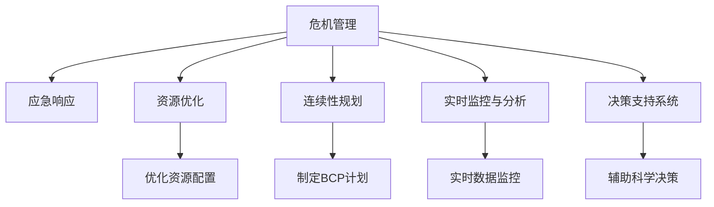

                 

# 危机管理：如何在turbulence中保持稳定

## 1. 背景介绍

在现代商业和工业中，危机管理是至关重要的。无论是在企业运营、供应链管理、金融市场还是公共卫生领域，危机都是不可避免的挑战。企业、组织和机构必须迅速响应，减轻负面影响，确保稳定性和持续性。然而，面对复杂多变、快速发展的环境，如何保持组织在危机中的稳定性和灵活性，成为了一个亟待解决的课题。

### 1.1 问题由来

危机往往源于突发性事件或系统性风险，如自然灾害、金融危机、公共卫生事件、供应链中断等。这些危机不仅对组织运营造成直接破坏，还可能引发连锁反应，影响市场信心和社会稳定。例如，新冠疫情的爆发不仅威胁到全球供应链，还对旅游、餐饮、零售等行业造成了巨大冲击。如何在这种“turbulence”中保持组织稳定，成为管理者面临的巨大挑战。

### 1.2 问题核心关键点

危机管理的核心在于快速响应、灵活调整和资源优化。在危机爆发时，管理者需要迅速识别风险、制定应急措施，并动态调整策略以适应新的环境。这要求管理者具备高度的适应性、快速决策能力和资源优化策略，以确保组织的长期稳定性和可持续发展。

## 2. 核心概念与联系

### 2.1 核心概念概述

为更好地理解如何在危机中保持组织稳定，本节将介绍几个关键概念：

- **危机管理（Crisis Management）**：指在危机发生时，迅速响应、控制和缓解危机的过程。包括危机预防、危机准备、危机响应和危机恢复等阶段。
- **应急响应（Emergency Response）**：指在危机爆发时，立即采取的应急措施，以减轻危机影响，保护关键资产和人员安全。
- **资源优化（Resource Optimization）**：指在危机管理过程中，高效利用和分配组织资源，以最大化危机应对能力。
- **连续性规划（Business Continuity Planning, BCP）**：指制定和实施的计划，确保在危机情况下，组织的核心业务功能能够持续运行。
- **实时监控与分析（Real-time Monitoring and Analysis）**：指使用数据和技术手段，对危机事件进行实时监测和分析，及时调整应对策略。
- **决策支持系统（Decision Support System, DSS）**：指利用数据分析、模拟和优化技术，辅助管理者做出科学决策的工具。

这些概念之间的逻辑关系可以通过以下Mermaid流程图来展示：



这个流程图展示了这个系统的核心概念及其之间的联系：

1. 危机管理是整个系统的核心，包括应急响应、资源优化、连续性规划、实时监控和决策支持等多个环节。
2. 应急响应在危机爆发时迅速采取措施，减轻影响。
3. 资源优化确保在有限的资源下，最大化危机应对能力。
4. 连续性规划保障组织的核心功能在危机中不中断。
5. 实时监控与分析对危机事件进行实时跟踪，及时调整策略。
6. 决策支持系统利用技术辅助管理者进行科学决策。

这些概念共同构成了危机管理的框架，帮助组织在复杂多变的环境中保持稳定性和持续性。通过理解这些概念，我们可以更好地把握危机管理的精髓和优化方向。

## 3. 核心算法原理 & 具体操作步骤
### 3.1 算法原理概述

危机管理的关键在于快速响应和灵活调整。这可以通过构建危机管理算法实现。算法核心思想是：利用数据驱动的方法，对危机事件进行实时监测和分析，自动生成应急响应方案，并根据实时反馈动态调整策略。

形式化地，假设危机事件为一个集合 $\mathcal{E}$，其中每个事件 $e_i$ 包含时间和影响两个属性。目标是通过历史数据 $D=\{(e_i, y_i)\}_{i=1}^N$ 学习到模型 $M$，其中 $y_i$ 表示事件 $e_i$ 的影响程度。

### 3.2 算法步骤详解

危机管理算法通常包括以下关键步骤：

**Step 1: 数据准备与特征工程**
- 收集历史危机事件数据，包括时间、影响、位置、原因等属性。
- 进行特征工程，提取和筛选对预测有用的特征。
- 使用缺失值填充、数据清洗等技术处理异常数据。

**Step 2: 模型选择与训练**
- 选择合适的机器学习模型，如随机森林、支持向量机、神经网络等。
- 在训练数据集上使用交叉验证等方法进行模型选择和参数调优。
- 训练模型，生成预测模型 $M$。

**Step 3: 应急响应方案生成**
- 对于新的危机事件 $e$，将其输入模型 $M$，得到影响预测 $y$。
- 根据影响预测 $y$ 和预设的阈值，自动生成应急响应方案。
- 结合专家知识和经验，调整和优化响应方案。

**Step 4: 实时监测与动态调整**
- 使用传感器、监控系统等技术，对危机事件进行实时监测。
- 根据实时数据，动态调整应急响应方案。
- 周期性评估响应效果，优化模型和方案。

**Step 5: 应急演练与评估**
- 定期进行应急演练，评估应急响应方案的有效性和可行性。
- 根据演练结果，优化模型和方案。

以上是危机管理算法的一般流程。在实际应用中，还需要根据具体任务的特点，对各环节进行优化设计，如改进特征工程方法、选择合适的模型、设计自动化的应急响应机制等，以进一步提升危机应对能力。

### 3.3 算法优缺点

危机管理算法具有以下优点：
1. 数据驱动。通过历史数据学习模型，自动生成应急响应方案，减少人工干预。
2. 实时性高。可以实时监测危机事件，动态调整应对策略，快速响应。
3. 灵活性高。通过调整模型和方案，可以适应不同的危机场景和环境。
4. 可解释性。机器学习模型可以提供预测依据，帮助管理者理解和评估响应效果。

同时，该算法也存在一定的局限性：
1. 数据依赖。算法的性能很大程度上取决于历史数据的丰富性和质量。
2. 模型复杂性。高复杂度的模型可能存在过拟合的风险，需要仔细选择和优化。
3. 动态调整难度。在复杂多变的危机环境中，实时调整响应方案的难度较大。
4. 成本高。算法需要大量的数据和计算资源，尤其是在大规模事件中。
5. 依赖技术。算法的有效性依赖于数据采集和处理技术的可靠性。

尽管存在这些局限性，但就目前而言，危机管理算法仍是一种高效、灵活的危机响应方法，为组织提供了强大的技术支持。未来相关研究的重点在于如何进一步降低数据依赖，提高模型的泛化能力，同时兼顾成本和技术可靠性。

### 3.4 算法应用领域

危机管理算法在多个领域得到了广泛应用，包括：

- **企业运营**：对供应链中断、客户投诉、技术故障等进行快速响应，保障业务连续性。
- **金融市场**：对市场波动、欺诈行为、系统故障等进行实时监控，保护投资者利益。
- **公共卫生**：对疫情爆发、医疗资源短缺、传染病传播等进行预测和响应，保障公共安全。
- **自然灾害**：对地震、洪水、干旱等自然灾害进行预警和应急响应，减少损失。
- **信息安全**：对网络攻击、数据泄露、系统故障等进行快速响应，保障信息安全。

除了上述这些经典领域外，危机管理算法还被创新性地应用到更多场景中，如工业生产、城市管理、交通运输等，为各个行业的风险管理和应急响应提供新的解决方案。

## 4. 数学模型和公式 & 详细讲解
### 4.1 数学模型构建

本节将使用数学语言对危机管理算法进行更加严格的刻画。

假设危机事件为一个时间序列 $e_t = (t, a_t)$，其中 $t$ 表示时间，$a_t$ 表示事件发生时的影响程度。设 $M_t$ 为事件 $e_t$ 的影响预测模型，目标是找到最优模型 $M$ 使误差最小化。

定义损失函数为：

$$
\mathcal{L}(M) = \frac{1}{N} \sum_{i=1}^N \|y_i - M(e_i)\|^2
$$

其中 $y_i$ 为事件 $e_i$ 的实际影响程度。通过最小化损失函数 $\mathcal{L}(M)$，找到最优预测模型 $M$。

### 4.2 公式推导过程

以随机森林模型为例，推导其预测过程：

假设随机森林模型的决策树数量为 $n$，每棵树的最大深度为 $d$，叶子节点的数量分别为 $N_1, N_2, \ldots, N_n$。对于新的危机事件 $e$，预测影响程度 $y$ 如下：

1. 随机选择 $k$ 棵决策树，计算 $k$ 棵树对 $e$ 的预测值。
2. 对于每棵树，计算叶节点的平均预测值，得到 $k$ 个预测结果。
3. 对 $k$ 个预测结果取平均值，得到最终的预测影响程度 $y$。

### 4.3 案例分析与讲解

假设某大型电商平台在处理大促活动期间，遭受DDoS攻击，服务器流量激增。该平台可以通过历史流量数据和DDoS攻击记录，训练一个随机森林模型，预测不同流量情况下的影响程度。当实时流量超出预设阈值时，自动触发应急响应方案，包括增加服务器资源、调整网络流量、启动DDoS防护机制等。

## 5. 项目实践：代码实例和详细解释说明
### 5.1 开发环境搭建

在进行危机管理算法实践前，我们需要准备好开发环境。以下是使用Python进行Scikit-Learn开发的环境配置流程：

1. 安装Anaconda：从官网下载并安装Anaconda，用于创建独立的Python环境。

2. 创建并激活虚拟环境：
```bash
conda create -n crisis-env python=3.8 
conda activate crisis-env
```

3. 安装Scikit-Learn：
```bash
conda install scikit-learn
```

4. 安装其他相关库：
```bash
pip install numpy pandas matplotlib seaborn scikit-learn
```

完成上述步骤后，即可在`crisis-env`环境中开始危机管理算法的实践。

### 5.2 源代码详细实现

下面我们以DDoS攻击检测和响应为例，给出使用Scikit-Learn进行随机森林模型的PyTorch代码实现。

首先，定义DDoS攻击数据集：

```python
import numpy as np
from sklearn.model_selection import train_test_split

# 生成模拟的DDoS攻击数据
features = np.random.randn(1000, 10)  # 1000个样本，10个特征
labels = np.random.randint(0, 2, size=1000)  # 0表示正常，1表示攻击

# 将数据划分为训练集和测试集
X_train, X_test, y_train, y_test = train_test_split(features, labels, test_size=0.2, random_state=42)
```

然后，定义模型和训练函数：

```python
from sklearn.ensemble import RandomForestClassifier
from sklearn.metrics import accuracy_score

# 定义随机森林模型
model = RandomForestClassifier(n_estimators=100, max_depth=5, random_state=42)

# 定义训练函数
def train_model(model, X_train, y_train):
    model.fit(X_train, y_train)
    return model

# 定义测试函数
def test_model(model, X_test, y_test):
    y_pred = model.predict(X_test)
    accuracy = accuracy_score(y_test, y_pred)
    return accuracy
```

最后，启动训练流程并在测试集上评估：

```python
# 训练模型
model = train_model(model, X_train, y_train)

# 测试模型
accuracy = test_model(model, X_test, y_test)
print(f"测试集准确率：{accuracy}")
```

以上就是使用Scikit-Learn对DDoS攻击进行随机森林模型微调的完整代码实现。可以看到，得益于Scikit-Learn的强大封装，我们可以用相对简洁的代码完成随机森林模型的训练和测试。

### 5.3 代码解读与分析

让我们再详细解读一下关键代码的实现细节：

**数据集生成**：
- 使用NumPy生成随机数据作为DDoS攻击的特征，标签为0和1表示正常和攻击。
- 使用Scikit-Learn的`train_test_split`方法将数据划分为训练集和测试集。

**模型定义**：
- 使用Scikit-Learn的`RandomForestClassifier`定义随机森林模型，设置参数。
- 在训练函数中，使用`fit`方法对模型进行训练。

**模型测试**：
- 在测试函数中，使用训练好的模型对测试集进行预测。
- 使用Scikit-Learn的`accuracy_score`方法计算模型的准确率。

**训练流程**：
- 在主函数中，调用训练函数和测试函数，输出模型的准确率。

可以看到，Scikit-Learn提供了一套简单高效的数据处理和模型训练工具，使得危机管理算法的开发变得更加便捷。开发者可以将更多精力放在数据处理和模型优化等高层逻辑上，而不必过多关注底层的实现细节。

当然，工业级的系统实现还需考虑更多因素，如模型的保存和部署、超参数的自动搜索、更灵活的任务适配层等。但核心的危机管理算法基本与此类似。

## 6. 实际应用场景
### 6.1 应急响应系统

基于危机管理算法的应急响应系统，可以广泛应用于各类应急场景，如自然灾害预警、网络攻击防护、重大事故应急等。系统可以实时监测环境变化，自动生成应急响应方案，并通过报警机制通知相关人员。

在技术实现上，可以收集实时传感器数据、监控数据、历史事故数据等，构建多源数据融合模型。将实时数据输入模型，自动判断是否触发应急响应，生成响应方案。响应方案包括资源调配、人员疏散、系统备份等，可以根据实际情况进行调整和优化。

### 6.2 金融市场监测

金融市场存在诸多不确定性和风险，实时监测和快速响应对于保障市场稳定至关重要。基于危机管理算法的金融市场监测系统，可以实时监测股票、期货、外汇等市场的波动，自动生成预警和响应方案。

在实现上，可以收集市场交易数据、财务数据、新闻报道等，构建多维度数据融合模型。将实时数据输入模型，自动判断是否触发预警，生成预警和响应方案。方案包括调整投资策略、限制交易规模、启动应急预案等，可以根据市场情况进行调整和优化。

### 6.3 公共卫生应急

公共卫生事件如疫情爆发、传染病传播等，对公共安全和社会稳定造成巨大威胁。基于危机管理算法的公共卫生应急系统，可以实时监测疫情数据、人群流动数据、医院资源数据等，自动生成预警和响应方案。

在实现上，可以收集疫情数据、人群流动数据、医院资源数据等，构建多维度数据融合模型。将实时数据输入模型，自动判断是否触发预警，生成预警和响应方案。方案包括隔离措施、资源调配、人员疏散等，可以根据疫情情况进行调整和优化。

### 6.4 未来应用展望

随着危机管理算法的不断发展，其在更多领域的应用前景将愈加广阔。

在智慧城市治理中，系统可以实时监测交通流量、能源消耗、环境污染等数据，自动生成预警和响应方案，提高城市管理的自动化和智能化水平。

在企业运营管理中，系统可以实时监测供应链、生产设备、库存数据等，自动生成预警和响应方案，保障业务连续性和资源优化。

在信息安全防护中，系统可以实时监测网络流量、访问记录、系统日志等数据，自动生成预警和响应方案，保障信息安全。

此外，在智慧农业、智能制造、智慧医疗等众多领域，危机管理算法也将不断涌现，为各行各业带来新的变革。

## 7. 工具和资源推荐
### 7.1 学习资源推荐

为了帮助开发者系统掌握危机管理算法的理论基础和实践技巧，这里推荐一些优质的学习资源：

1. 《机器学习基础》系列博文：由深度学习专家撰写，涵盖机器学习的基本概念和常用算法，是理解危机管理算法的基石。

2. 《数据科学与机器学习》课程：Coursera平台上的经典课程，由斯坦福大学提供，全面介绍了数据科学和机器学习的基本理论和实践方法。

3. 《Python数据科学手册》书籍：由Jake VanderPlas编写，系统介绍了Python在数据科学和机器学习中的应用，是学习的必备工具书。

4. Kaggle平台：全球最大的数据科学竞赛平台，提供丰富的数据集和比赛任务，助力开发者实践和创新。

5. IEEE Xplore：IEEE的学术资源库，涵盖大量前沿论文和技术报告，是学习和研究的重要参考。

通过对这些资源的学习实践，相信你一定能够快速掌握危机管理算法的精髓，并用于解决实际的应急管理问题。
###  7.2 开发工具推荐

高效的开发离不开优秀的工具支持。以下是几款用于危机管理算法开发的常用工具：

1. Jupyter Notebook：开源的交互式笔记本环境，适合进行数据处理和模型训练。

2. Scikit-Learn：基于Python的机器学习库，提供了丰富的模型和算法，适合快速迭代研究。

3. TensorFlow：由Google主导开发的深度学习框架，适合大规模工程应用和模型部署。

4. Weights & Biases：模型训练的实验跟踪工具，可以记录和可视化模型训练过程中的各项指标，方便对比和调优。

5. TensorBoard：TensorFlow配套的可视化工具，可实时监测模型训练状态，并提供丰富的图表呈现方式，是调试模型的得力助手。

6. Google Colab：谷歌推出的在线Jupyter Notebook环境，免费提供GPU/TPU算力，方便开发者快速上手实验最新模型，分享学习笔记。

合理利用这些工具，可以显著提升危机管理算法的开发效率，加快创新迭代的步伐。

### 7.3 相关论文推荐

危机管理算法的研究源于学界的持续探索。以下是几篇奠基性的相关论文，推荐阅读：

1. Predicting Attacks on an Instant Messaging System with Anomaly Detection（Anomaly-based Attacks论文）：提出基于异常检测的DDoS攻击检测方法，展示了异常检测在危机管理中的应用。

2. Statistical Machine Learning for Mining Network Intrusion and Incident Datasets（Intrusion Detection论文）：提出基于统计机器学习的入侵检测方法，利用网络流量数据进行攻击检测。

3. Early Warning System for Network Intrusion（Early Warning System论文）：提出基于时间序列分析的网络入侵预警系统，通过实时数据预测入侵行为。

4. Anomaly Detection and Response with Neural Networks（Neural Networks论文）：提出基于神经网络的异常检测方法，利用深度学习技术进行攻击检测和响应。

5. Real-Time Anomaly Detection in Network Traffic with LSTM Networks（LSTM Networks论文）：提出基于LSTM网络的时间序列异常检测方法，用于网络攻击检测和响应。

这些论文代表了大规模机器学习在危机管理中的应用脉络。通过学习这些前沿成果，可以帮助研究者把握学科前进方向，激发更多的创新灵感。

## 8. 总结：未来发展趋势与挑战
### 8.1 总结

本文对基于危机管理算法的应急响应方法进行了全面系统的介绍。首先阐述了危机管理的重要性和当前面临的挑战，明确了算法在快速响应、灵活调整和资源优化方面的独特价值。其次，从原理到实践，详细讲解了危机管理算法的数学原理和关键步骤，给出了危机管理任务开发的完整代码实例。同时，本文还广泛探讨了算法在企业运营、金融市场、公共卫生等多个领域的应用前景，展示了算法的广阔潜力。

通过本文的系统梳理，可以看到，基于危机管理算法的应急响应方法正在成为应对突发事件的重要工具，极大地提升了组织在复杂环境中的应对能力和稳定性。未来，伴随危机管理算法的不断演进，相信其在更多领域的应用将更加广泛，为组织带来更高的效率和更强的竞争力。

### 8.2 未来发展趋势

展望未来，危机管理算法将呈现以下几个发展趋势：

1. 数据驱动。随着数据采集和处理技术的进步，算法的预测能力和自动化水平将不断提升。
2. 实时性增强。通过引入时间序列分析、LSTM网络等技术，算法将能够更快速地响应突发事件。
3. 模型多样性。算法将采用更多样化的模型和方法，如神经网络、深度强化学习等，提升应对复杂事件的能力。
4. 应用泛化。算法将在更多行业和领域得到应用，如智慧农业、智能制造等，拓展应用边界。
5. 人机协同。算法将与人工干预、专家系统等结合，形成更智能化的应急响应系统。
6. 安全防护。算法将增强对数据隐私和模型安全的保护，避免滥用和恶意攻击。

以上趋势凸显了危机管理算法的广阔前景。这些方向的探索发展，必将进一步提升算法的效果和应用范围，为组织的危机应对提供更加科学、高效的解决方案。

### 8.3 面临的挑战

尽管危机管理算法已经取得了瞩目成就，但在迈向更加智能化、普适化应用的过程中，它仍面临着诸多挑战：

1. 数据依赖。算法的性能很大程度上取决于历史数据的丰富性和质量，获取高质量数据成本较高。
2. 模型复杂性。高复杂度的模型可能存在过拟合的风险，需要仔细选择和优化。
3. 动态调整难度。在复杂多变的危机环境中，实时调整响应方案的难度较大。
4. 成本高。算法需要大量的数据和计算资源，尤其是在大规模事件中。
5. 依赖技术。算法的有效性依赖于数据采集和处理技术的可靠性。

尽管存在这些挑战，但通过技术进步和实践优化，这些挑战终将一一被克服，危机管理算法必将在构建安全、可靠、智能的应急响应系统方面发挥重要作用。

### 8.4 研究展望

面对危机管理算法所面临的挑战，未来的研究需要在以下几个方面寻求新的突破：

1. 数据增强。通过数据合成、数据融合等技术，提升算法的泛化能力和数据驱动水平。
2. 模型优化。开发更加高效、泛化性更强的模型，如深度强化学习、因果推断等，提升算法的预测精度。
3. 人机协同。结合人工干预和专家系统，构建更智能化的应急响应系统，提高决策的科学性和可解释性。
4. 安全防护。增强数据隐私和模型安全保护，防止滥用和恶意攻击。

这些研究方向的探索，必将引领危机管理算法走向更高的台阶，为组织在复杂多变的环境中提供更加稳定、智能的应急响应解决方案。面向未来，危机管理算法还需要与其他人工智能技术进行更深入的融合，如知识表示、因果推理、强化学习等，多路径协同发力，共同推动应急响应的进步。只有勇于创新、敢于突破，才能不断拓展算法的边界，让智能技术更好地保障组织的持续性和稳定性。

## 9. 附录：常见问题与解答
**Q1：危机管理算法是否适用于所有应急场景？**

A: 危机管理算法在大多数应急场景上都能取得不错的效果，特别是对于数据量较小的场景。但对于一些特定领域的应急场景，如医疗急救、应急救援等，仅仅依靠通用算法可能难以很好地适应。此时需要在特定领域数据上进行进一步的模型训练和优化。

**Q2：如何优化危机管理算法的实时性？**

A: 优化危机管理算法的实时性可以从以下几个方面入手：
1. 数据采集。使用高频率的传感器和监控设备，实时获取应急数据。
2. 模型优化。选择轻量级、高效的模型，减少计算时间和资源消耗。
3. 并行计算。使用分布式计算、GPU加速等技术，提高计算效率。
4. 数据预处理。使用数据压缩、数据缓存等技术，减少数据传输和处理时间。

**Q3：如何增强危机管理算法的泛化能力？**

A: 增强危机管理算法的泛化能力可以从以下几个方面入手：
1. 数据增强。通过数据合成、数据融合等技术，增加数据量和多样性，提升算法的泛化能力。
2. 模型多样化。引入更多样化的模型和方法，如深度强化学习、因果推断等，提升算法的预测精度。
3. 专家融合。结合人工干预和专家知识，提升算法的鲁棒性和可解释性。
4. 多模态融合。引入多模态数据融合技术，提升算法的综合预测能力。

**Q4：如何平衡资源优化和应急响应？**

A: 在资源优化和应急响应之间进行平衡，需要根据实际情况进行灵活调整。一般情况下，可以采用以下策略：
1. 优先保障关键资源。在资源有限的情况下，优先保障对应急响应至关重要的资源。
2. 动态调整资源分配。根据实时数据和模型预测，动态调整资源分配策略。
3. 引入应急储备。在资源紧张时，利用应急储备资源进行应急响应。
4. 多渠道协同。通过多渠道资源协同，提高应急响应的效率和灵活性。

**Q5：危机管理算法在落地部署时需要注意哪些问题？**

A: 将危机管理算法转化为实际应用，还需要考虑以下问题：
1. 模型裁剪。去除不必要的层和参数，减小模型尺寸，加快推理速度。
2. 量化加速。将浮点模型转为定点模型，压缩存储空间，提高计算效率。
3. 服务化封装。将模型封装为标准化服务接口，便于集成调用。
4. 弹性伸缩。根据请求流量动态调整资源配置，平衡服务质量和成本。
5. 监控告警。实时采集系统指标，设置异常告警阈值，确保服务稳定性。
6. 安全防护。采用访问鉴权、数据脱敏等措施，保障数据和模型安全。

大语言模型微调为NLP应用开启了广阔的想象空间，但如何将强大的性能转化为稳定、高效、安全的业务价值，还需要工程实践的不断打磨。唯有从数据、算法、工程、业务等多个维度协同发力，才能真正实现人工智能技术在垂直行业的规模化落地。总之，危机管理算法需要在数据驱动、实时响应、资源优化等方面不断创新和优化，才能在复杂多变的危机环境中保持组织的稳定性和持续性。

