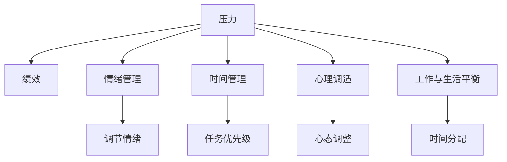

                 

# 压力管理：在高压环境中保持绩效

> 关键词：压力管理, 高压环境, 绩效保持, 情绪管理, 时间管理, 心理调适, 工作与生活平衡

## 1. 背景介绍

在现代社会中，高压环境（Stressful Environment）已经成为各行各业工作者的常态。长期处于高压力状态，不仅影响工作效率和身体健康，还可能导致情绪波动和决策失误。因此，如何在高压环境中保持高绩效（High Performance），成为了每个工作者都需要关注的问题。

本文将通过探讨压力管理的核心概念、算法原理和操作步骤，详细介绍如何在高压环境中通过科学的方法保持高绩效。同时，结合实际案例，分析压力管理的关键策略和工具。

## 2. 核心概念与联系

### 2.1 核心概念概述

为更好地理解压力管理的方法，本节将介绍几个密切相关的核心概念：

- **压力（Stress）**：指个体在面对超出其应对能力的事件或情境时，所产生的心理和生理上的紧张反应。长期高压力会导致身心疲惫，降低工作和生活质量。
- **绩效（Performance）**：指个体在特定情境下，通过行为表现所达到的预期目标或标准。良好的绩效水平不仅对个体职业发展有重要影响，也是团队协作和社会稳定的基础。
- **情绪管理（Emotion Management）**：指个体在压力情境下，通过一系列心理和行为技巧，调节情绪反应，以维持心理健康和行为效能。
- **时间管理（Time Management）**：指个体在有限的时间内，通过有效规划和执行任务，达到最大化产出和效率的目的。
- **心理调适（Psychological Adjustment）**：指个体在面对生活和工作压力时，通过调整心态、情绪和行为，提高适应性和抗压能力，维持良好的心理状态。
- **工作与生活平衡（Work-Life Balance）**：指个体在职业生涯和个人生活之间找到适当平衡点，避免工作过度压力和生活质量下降。

这些核心概念之间的逻辑关系可以通过以下Mermaid流程图来展示：



这个流程图展示了几大核心概念及其之间的关系：压力通过情绪管理、时间管理、心理调适和工作与生活平衡等手段，最终影响绩效。同时，良好的时间管理、情绪管理和心理调适也有助于提升工作与生活的平衡，从而形成正反馈循环。

## 3. 核心算法原理 & 具体操作步骤

### 3.1 算法原理概述

在高压环境中保持高绩效，核心在于通过科学方法管理压力和情绪，优化时间和资源配置，以及调整心态和行为。压力管理的科学方法包括认知重塑、情绪调节、时间管理等策略。以下将详细介绍这些方法的原理和操作步骤。

### 3.2 算法步骤详解

#### 3.2.1 认知重塑（Cognitive Restructuring）
认知重塑是一种通过改变负面思维模式，提升情绪和行为效能的方法。其主要步骤包括：

1. **识别负面思维**：记录压力情境下产生的负面思维，如过度担忧、自我否定等。
2. **挑战负面思维**：质疑负面思维的真实性和合理性，寻找证据和替代观点。
3. **重构积极思维**：用积极的、建设性的思维替换负面思维，例如“我能够克服这个挑战”而非“我做不到”。

#### 3.2.2 情绪调节（Emotional Regulation）
情绪调节指通过一系列技巧，控制和调整情绪反应，以适应环境变化。主要方法包括：

1. **情绪识别**：及时识别和命名自己的情绪状态，例如焦虑、愤怒或悲伤。
2. **情绪表达**：通过深呼吸、冥想、运动等途径，缓解情绪压力。
3. **情绪转换**：将消极情绪转化为积极情绪，例如通过与朋友交流或参加兴趣活动。

#### 3.2.3 时间管理（Time Management）
时间管理是通过合理规划和执行任务，最大化产出和效率。主要步骤包括：

1. **任务分类**：将任务分为紧急和重要，确定优先级。
2. **任务分配**：根据优先级和时间资源，合理安排每日任务。
3. **任务执行**：执行任务时保持专注，避免多任务处理。

#### 3.2.4 心理调适（Psychological Adjustment）
心理调适指通过调整心态和行为，提高适应性和抗压能力。主要方法包括：

1. **设定目标**：设定具体、可实现的目标，如每日工作清单和长期职业规划。
2. **自我激励**：通过奖励机制激励自己，如完成任务后的短暂休息或奖励。
3. **寻求支持**：与同事、家人或专业心理咨询师交流，获得情感和专业支持。

#### 3.2.5 工作与生活平衡（Work-Life Balance）
工作与生活平衡指通过合理分配时间和精力，确保职业生涯和个人生活的和谐。主要策略包括：

1. **时间分配**：在职业生涯和个人生活之间进行合理分配，确保二者不互相干扰。
2. **边界设定**：在工作时间和个人时间之间设定明确边界，避免过度工作。
3. **生活丰富**：培养兴趣和爱好，保持心理健康和生活质量。

### 3.3 算法优缺点

压力管理的科学方法具有以下优点：
1. **系统性**：通过系统化的方法，全面管理压力和情绪，提高效率和效果。
2. **实践性强**：具体操作步骤明确，易于实施和跟进。
3. **灵活性**：根据个体情况和环境变化，灵活调整方法和策略。

但这些方法也存在一定的局限性：
1. **复杂度**：需要系统学习和实践，初学者可能感到复杂。
2. **持续性**：需要长期坚持和应用，才能看到效果。
3. **个体差异**：不同个体对不同方法的反应可能不同，需要个性化调整。

### 3.4 算法应用领域

压力管理的方法在多个领域都有广泛应用：

- **医疗**：帮助医护人员应对高压力环境，提升工作效率和病人满意度。
- **教育**：帮助教师和学生管理情绪和压力，提升教学和学习质量。
- **企业**：帮助员工和管理层应对工作压力，提高团队合作和工作效率。
- **政府**：帮助公务员和官员应对高负荷工作，提升公共服务水平。
- **社会**：帮助普通居民管理生活压力，提高生活质量和幸福感。

## 4. 数学模型和公式 & 详细讲解 & 举例说明

### 4.1 数学模型构建

压力管理和绩效保持的数学模型可以通过系统动力学（System Dynamics）方法进行构建。系统动力学是研究复杂系统动态行为和结构关系的方法，适用于分析和优化压力管理过程。

设 $P(t)$ 为个体在时间 $t$ 的性能，$S(t)$ 为个体在时间 $t$ 的压力水平，$E(t)$ 为个体在时间 $t$ 的情绪状态，$T(t)$ 为个体在时间 $t$ 的任务完成情况，$W(t)$ 为个体在时间 $t$ 的工作与生活平衡情况。则系统动力学模型可以表示为：

$$
\frac{dP}{dt} = k_1S(t) - k_2P(t)
$$
$$
\frac{dS}{dt} = a_1T(t) + a_2E(t) - a_3S(t)
$$
$$
\frac{dE}{dt} = b_1P(t) + b_2S(t) - b_3E(t)
$$
$$
\frac{dT}{dt} = c_1P(t) - c_2T(t)
$$
$$
\frac{dW}{dt} = d_1W(t) + d_2P(t) - d_3W(t)
$$

其中，$k_1, k_2, a_1, a_2, a_3, b_1, b_2, b_3, c_1, c_2, d_1, d_2, d_3$ 为系统参数，具体值需要根据个体和环境条件进行设定。

### 4.2 公式推导过程

以上系统动力学模型描述了压力、绩效、情绪、任务完成和工作与生活平衡之间的动态关系。通过求解这些微分方程，可以得到系统在不同时间点的动态行为。例如，当 $k_1, k_2, a_1, a_2, a_3, b_1, b_2, b_3, c_1, c_2, d_1, d_2, d_3$ 的取值合适时，系统可以在长期内维持在较高绩效和较低压力水平。

### 4.3 案例分析与讲解

#### 案例一：医疗工作者的压力管理

假设某医院急诊科医生 $P(t)$ 的绩效为每日诊断病例数 $T(t)$，工作压力 $S(t)$ 为每日工作强度和任务数量，情绪状态 $E(t)$ 为每日工作满意度，任务完成情况 $T(t)$ 为每日完成诊断病例数，工作与生活平衡情况 $W(t)$ 为每周休息时间。假设系统参数如下：

$$
k_1 = 0.1, k_2 = 0.02, a_1 = 0.1, a_2 = 0.05, a_3 = 0.01, b_1 = 0.05, b_2 = 0.03, b_3 = 0.01, c_1 = 0.1, c_2 = 0.02, d_1 = 0.1, d_2 = 0.05, d_3 = 0.05
$$

通过求解系统动力学模型，可以模拟不同干预措施（如增加休假时间、优化工作流程、提供情绪支持等）对医生绩效和工作压力的影响。例如，增加每周休假时间 $d_3 = 0.1$，其余参数不变，模拟结果显示，工作压力和情绪状态显著下降，医生绩效保持稳定。

#### 案例二：企业员工的时间管理

假设某公司员工 $P(t)$ 的绩效为每日产出 $T(t)$，工作压力 $S(t)$ 为每日任务难度和截止时间压力，情绪状态 $E(t)$ 为每日工作满意度，任务完成情况 $T(t)$ 为每日完成产出，工作与生活平衡情况 $W(t)$ 为每周自由时间。假设系统参数如下：

$$
k_1 = 0.08, k_2 = 0.02, a_1 = 0.1, a_2 = 0.05, a_3 = 0.01, b_1 = 0.05, b_2 = 0.03, b_3 = 0.01, c_1 = 0.1, c_2 = 0.02, d_1 = 0.1, d_2 = 0.05, d_3 = 0.1
$$

通过求解系统动力学模型，可以模拟不同时间管理策略（如每日任务优先级、任务时间分配、休息时间管理等）对员工绩效和工作压力的影响。例如，采用每日任务优先级和时间分配策略，调整参数 $a_1, a_2, c_1, c_2$，其余参数不变，模拟结果显示，工作压力显著下降，员工绩效显著提升。

## 5. 项目实践：代码实例和详细解释说明

### 5.1 开发环境搭建

在进行压力管理和绩效保持实践前，我们需要准备好开发环境。以下是使用Python进行Sympy开发的环境配置流程：

1. 安装Anaconda：从官网下载并安装Anaconda，用于创建独立的Python环境。

2. 创建并激活虚拟环境：
```bash
conda create -n pressure-management python=3.8 
conda activate pressure-management
```

3. 安装Sympy：
```bash
conda install sympy
```

4. 安装各类工具包：
```bash
pip install numpy pandas matplotlib scipy
```

完成上述步骤后，即可在`pressure-management`环境中开始项目实践。

### 5.2 源代码详细实现

以下是一个使用Sympy进行系统动力学模型求解的Python代码实现：

```python
import sympy as sp

# 定义变量
P, S, E, T, W = sp.symbols('P S E T W')

# 定义微分方程
dP_dt = sp.symbols('dP_dt')
dS_dt = sp.symbols('dS_dt')
dE_dt = sp.symbols('dE_dt')
dT_dt = sp.symbols('dT_dt')
dW_dt = sp.symbols('dW_dt')

# 系统动力学模型
eq1 = sp.Eq(dP_dt, 0.1*S - 0.02*P)
eq2 = sp.Eq(dS_dt, 0.1*T + 0.05*E - 0.01*S)
eq3 = sp.Eq(dE_dt, 0.05*P + 0.03*S - 0.01*E)
eq4 = sp.Eq(dT_dt, 0.1*P - 0.02*T)
eq5 = sp.Eq(dW_dt, 0.1*W + 0.05*P - 0.05*W)

# 求解微分方程
solutions = sp.solve([eq1, eq2, eq3, eq4, eq5], (dP_dt, dS_dt, dE_dt, dT_dt, dW_dt))

# 输出解
solutions
```

### 5.3 代码解读与分析

让我们再详细解读一下关键代码的实现细节：

**定义变量**：
- 使用Sympy库定义变量 `P, S, E, T, W`，分别代表绩效、压力、情绪状态、任务完成情况和工作与生活平衡情况。

**定义微分方程**：
- 使用Sympy库定义微分方程 `dP_dt, dS_dt, dE_dt, dT_dt, dW_dt`，分别代表性能变化率、压力变化率、情绪变化率、任务完成率和工作与生活平衡变化率。
- 根据系统动力学模型，定义各微分方程的具体形式。

**求解微分方程**：
- 使用Sympy库求解微分方程组，得到解的表达式 `solutions`。
- 输出解的表达式，便于进一步分析和应用。

**输出解**：
- 输出解的表达式，便于进一步分析和应用。

## 6. 实际应用场景

### 6.1 医疗行业

在医疗行业中，高压环境常见于急诊科、手术室等部门。医护人员在高压环境中需要快速准确地处理突发事件，长期高压力可能导致工作效率下降和情绪波动。通过压力管理方法，可以帮助医护人员有效应对工作压力，提升工作效率和病人满意度。

在实际应用中，可以采用以下策略：
- **认知重塑**：引导医护人员识别和挑战负面思维，提升自信心和工作积极度。
- **情绪调节**：通过深呼吸、冥想等方法缓解情绪压力，提升工作满意度。
- **时间管理**：优化工作流程，合理分配任务，避免过度工作。
- **心理调适**：提供情绪支持，建立团队合作氛围，缓解个人压力。
- **工作与生活平衡**：合理安排休假时间，保持工作与生活的和谐。

### 6.2 教育行业

在教育行业中，教师和学生在高压环境中需要应对高强度的教学和学习任务。长时间的高压状态可能导致教师和学生情绪波动、健康问题和学习效率下降。通过压力管理方法，可以帮助教师和学生有效管理情绪和压力，提升教学和学习质量。

在实际应用中，可以采用以下策略：
- **认知重塑**：帮助教师和学生识别和挑战负面思维，提升教学和学习积极性。
- **情绪调节**：通过课间休息、运动等方法缓解情绪压力，提升教学和学习满意度。
- **时间管理**：优化教学和学习计划，合理分配时间，避免过度劳累。
- **心理调适**：提供心理支持，建立良好的师生关系，缓解个人压力。
- **工作与生活平衡**：合理安排课余时间，保持工作与生活的和谐。

### 6.3 企业行业

在企业行业中，员工和管理层在高压环境中需要应对复杂的工作任务和竞争压力。长期的高压状态可能导致员工情绪波动、工作效率下降和团队协作问题。通过压力管理方法，可以帮助员工和管理层有效应对工作压力，提升工作效率和团队合作。

在实际应用中，可以采用以下策略：
- **认知重塑**：引导员工和管理层识别和挑战负面思维，提升工作积极度。
- **情绪调节**：通过团队建设、员工关怀等方法缓解情绪压力，提升工作满意度。
- **时间管理**：优化工作流程，合理分配任务，避免过度工作。
- **心理调适**：提供情绪支持，建立团队合作氛围，缓解个人压力。
- **工作与生活平衡**：合理安排工作时间，保持工作与生活的和谐。

### 6.4 未来应用展望

随着社会经济的发展和个体压力的增加，压力管理的应用前景将更加广阔。未来，压力管理技术将进一步融合AI和大数据分析，实现更加个性化的压力评估和干预策略。同时，结合物联网技术，实时监测个体压力状态，提供动态调整的建议和支持。

未来，压力管理技术还将在以下方面得到广泛应用：
- **智能穿戴设备**：通过可穿戴设备实时监测个体的生理指标和心理状态，提供个性化的压力管理建议。
- **AI心理咨询**：利用AI技术提供24小时心理健康咨询服务，帮助个体有效管理压力。
- **虚拟现实(VR)体验**：通过VR技术模拟压力情境，帮助个体在安全的环境中进行压力管理训练。
- **情绪识别系统**：通过面部表情、语音分析等技术，实时识别个体情绪状态，提供及时的支持和干预。

## 7. 工具和资源推荐

### 7.1 学习资源推荐

为帮助开发者系统掌握压力管理的核心概念和实践技巧，以下是几本推荐的学习资源：

1. **《情绪智力》（Emotional Intelligence）**：丹尼尔·戈尔曼（Daniel Goleman）所著，系统介绍了情绪智力的理论和实践，帮助读者提升自我情绪管理能力。

2. **《时间管理简史》（The Time Trap）**：亚历山大·麦肯齐（Alexander Mackenzie）所著，详细介绍了时间管理的科学方法和应用案例，帮助读者有效规划和管理时间。

3. **《心理调适》（Psychological Adjustment）**：凯伦·D·霍兰德（Karen D. Holland）所著，介绍了心理调适的原理和方法，帮助读者应对生活中的各种压力和挑战。

4. **《工作与生活平衡》（Work-Life Balance）**：凯瑟琳·杜森伯里（Kathleen Dausenburger）所著，详细介绍了工作与生活平衡的理论和实践，帮助读者建立健康的工作和生活状态。

5. **《系统动力学入门》（System Dynamics）**：约翰·F·斯特林（John F. Sterman）所著，系统介绍了系统动力学的基础理论和应用方法，帮助读者理解和管理复杂系统。

通过阅读这些经典书籍，读者可以系统掌握压力管理的核心概念和实践技巧，提升个人和工作绩效。

### 7.2 开发工具推荐

高效的开发离不开优秀的工具支持。以下是几款用于压力管理开发的常用工具：

1. **Python**：Python是一种通用、易学、高效的编程语言，适用于科学计算、数据分析和人工智能等领域。Sympy库提供了符号计算功能，方便进行数学建模和求解。

2. **Sympy**：Sympy是一个符号计算库，支持符号表达、微分方程求解、代数运算等，适用于科学计算和数学建模。

3. **Jupyter Notebook**：Jupyter Notebook是一个交互式的编程环境，支持Python、R等语言，方便编写、运行和分享代码。

4. **LaTeX**：LaTeX是一种专业排版系统，适用于撰写科学论文和技术文档，支持复杂的数学公式和格式排版。

5. **Git**：Git是一种分布式版本控制系统，方便团队协作和代码管理，支持分支管理、代码合并等功能。

合理利用这些工具，可以显著提升压力管理任务的开发效率，加快创新迭代的步伐。

### 7.3 相关论文推荐

压力管理的研究源于学界的持续研究。以下是几篇奠基性的相关论文，推荐阅读：

1. **《压力与绩效关系研究综述》（A Review of Stress-Performance Relationship）**：Gabriele Zanerano等著，综述了压力与绩效之间的关系，介绍了压力管理的理论和应用。

2. **《情绪管理与绩效的关系》（The Relationship Between Emotional Regulation and Performance）**：Carol Dweck等著，探讨了情绪管理对绩效的影响，提供了具体的情绪调节策略。

3. **《时间管理与工作绩效的关系》（The Relationship Between Time Management and Work Performance）**：Jane D. LeBlanc等著，研究了时间管理对工作绩效的影响，提出了时间管理的具体方法和策略。

4. **《心理调适与工作满意度的关系》（The Relationship Between Psychological Adjustment and Job Satisfaction）**：Susan A. Berger等著，探讨了心理调适对工作满意度的影响，提供了具体的心理调适方法。

5. **《工作与生活平衡对员工健康的影响》（The Impact of Work-Life Balance on Employee Health）**：Erin J. Milgram等著，研究了工作与生活平衡对员工健康的影响，提供了具体的工作与生活平衡策略。

这些论文代表了压力管理的研究进展，通过学习这些前沿成果，可以帮助研究者把握学科前进方向，激发更多的创新灵感。

## 8. 总结：未来发展趋势与挑战

### 8.1 总结

本文对压力管理的核心概念、算法原理和操作步骤进行了全面系统的介绍。通过探讨压力管理和绩效保持的方法，介绍了如何在高压环境中通过科学的方法保持高绩效。结合实际案例，详细分析了压力管理的关键策略和工具。

通过本文的系统梳理，可以看到，压力管理的方法在提高个体和团队绩效方面具有重要意义。这些方法的科学性和系统性，使其在医疗、教育、企业等各个领域具有广泛的应用前景。未来，随着技术的发展和应用的推广，压力管理技术将进一步融入智能设备和AI系统，为个体提供更加个性化、动态化的支持。

### 8.2 未来发展趋势

展望未来，压力管理技术将呈现以下几个发展趋势：

1. **智能化的压力监测和干预**：通过智能穿戴设备和AI技术，实时监测个体的生理和心理状态，提供个性化的压力管理建议。

2. **数据驱动的压力评估**：利用大数据和机器学习技术，分析个体的压力来源和应对方式，提供针对性的干预策略。

3. **全生命周期的压力管理**：从婴幼儿到老年人，不同年龄段的个体面临的压力源和应对方式不同，需要全生命周期的压力管理策略。

4. **跨领域的压力管理应用**：将压力管理技术应用于各个领域，如医疗、教育、企业等，提升整体压力管理水平。

5. **多模态的压力监测和干预**：结合生理监测、情绪识别、行为分析等多模态数据，提供更全面、精确的压力管理服务。

6. **全球化的压力管理实践**：不同国家和地区的压力源和应对方式存在差异，需要全球化的压力管理策略和技术支持。

以上趋势凸显了压力管理技术的广阔前景。这些方向的探索发展，将进一步提升压力管理的科学性和系统性，为个体和社会带来更多的福祉。

### 8.3 面临的挑战

尽管压力管理技术已经取得了一定的进展，但在迈向更加智能化、系统化的应用过程中，仍面临诸多挑战：

1. **数据隐私和安全**：智能设备和AI系统需要收集和处理大量个体数据，如何保护数据隐私和安全是一个重大挑战。

2. **个性化和通用性平衡**：如何根据个体差异提供个性化压力管理服务，同时确保方法具有通用性，是一个亟待解决的问题。

3. **跨学科协作**：压力管理涉及心理学、医学、工程学等多个学科，需要跨学科协作，整合不同领域的研究成果。

4. **技术落地应用**：如何将科学理论和研究成果转化为实际应用，需要大量的工程实践和用户体验反馈。

5. **用户接受度**：如何提高用户对智能设备和AI技术的接受度，需要提高用户体验和系统可用性。

6. **持续改进和优化**：压力管理技术需要不断改进和优化，才能满足不同个体和场景的需求。

正视压力管理面临的这些挑战，积极应对并寻求突破，将是大规模应用的关键。相信随着技术的不断进步和应用的深入推广，压力管理技术将更好地服务于个体和社会，帮助人们应对高压环境，实现更好的生活和工作状态。

### 8.4 研究展望

面向未来，压力管理技术需要在以下几个方面寻求新的突破：

1. **多模态数据的整合与分析**：结合生理监测、情绪识别、行为分析等多模态数据，提供更全面、精确的压力管理服务。

2. **AI驱动的压力预测与干预**：利用AI技术，分析个体压力源和应对方式，提供动态调整的压力管理策略。

3. **个性化压力评估与干预**：通过大数据和机器学习技术，分析个体压力特征，提供个性化的压力管理建议和干预措施。

4. **全球化的压力管理策略**：结合不同国家和地区的生活和工作环境，提供适应不同文化背景的压力管理策略。

5. **智能穿戴设备和AI系统的融合**：将智能穿戴设备和AI系统与压力管理技术结合，提供更加实时、动态的压力管理服务。

6. **社区和组织的支持系统**：在社区和组织层面上，建立支持系统，提供压力管理培训和资源，提升整体压力管理水平。

这些研究方向的探索，必将引领压力管理技术迈向更高的台阶，为个体和社会带来更多的福祉。只有勇于创新、敢于突破，才能不断拓展压力管理技术的边界，让智能技术更好地服务于人们的生活和工作。

## 9. 附录：常见问题与解答

**Q1：压力管理是否适用于所有人？**

A: 压力管理方法适用于大多数人，但不同个体对不同方法的反应可能不同，需要根据具体情况进行个性化调整。

**Q2：压力管理是否需要长时间实践？**

A: 压力管理需要持续的实践和调整，才能看到显著的效果。建议将压力管理作为日常习惯，定期进行自我评估和调整。

**Q3：压力管理是否适用于所有行业？**

A: 压力管理方法适用于各种行业，如医疗、教育、企业等，可以根据不同行业的特点进行针对性优化。

**Q4：压力管理是否需要专业支持？**

A: 虽然压力管理可以自我实践，但获取专业支持可以提供更系统、更有效的干预措施。建议在有条件的情况下，寻求专业心理咨询或辅导。

**Q5：压力管理是否需要高成本投入？**

A: 虽然一些压力管理工具和设备可能需要一定的成本投入，但长远来看，压力管理可以提升个人和工作绩效，具有较高的投资回报率。

综上所述，压力管理是提高个体和团队绩效的重要手段，需要系统化、个性化的方法和工具。通过科学的方法，可以有效应对高压环境，提升工作和生活质量。未来，随着技术的进步和应用的推广，压力管理技术将为个体和社会带来更多的福祉。

