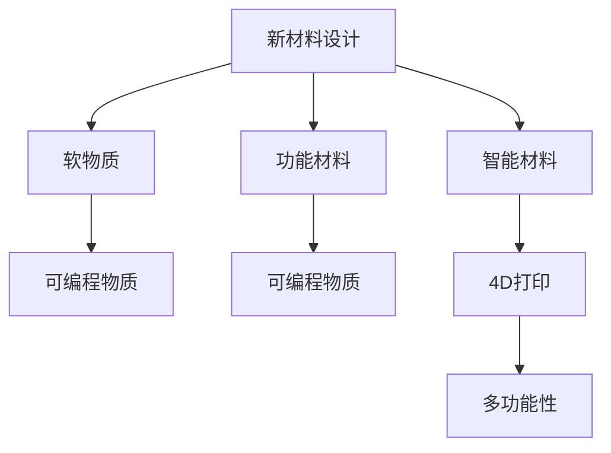

                 

# 可编程物质技术：创造具有特定功能的新材料

> 关键词：可编程物质技术,新材料设计,智能材料,软物质,功能材料,4D打印,多功能性,应用场景,工程挑战

## 1. 背景介绍

### 1.1 问题由来

在当今社会，新材料的设计与开发正逐渐成为各个领域（如电子、能源、生物医学等）的关键驱动力。传统材料的设计方法多基于经验法则，难以应对日益复杂的性能需求和功能要求。与此同时，计算机技术、人工智能（AI）等领域的飞速发展，为材料科学的创新带来了新机遇。

### 1.2 问题核心关键点

1. **新材料设计**：如何通过计算机模拟和计算，设计出具有特定功能的新材料？
2. **智能材料**：如何在材料中实现“可编程”特性，即通过编程控制材料的物理和化学行为？
3. **软物质**：如何利用软物质的性质，如可变形性和响应性，开发新型功能材料？
4. **功能材料**：如何实现材料的多功能性，使其具备多种物理、化学和生物功能？
5. **4D打印**：如何结合时间维度，通过4D打印技术，制造具有动态特性的材料结构？

### 1.3 问题研究意义

1. **提高设计效率**：可编程物质技术能够大大提高新材料设计的效率和精确度。
2. **促进创新**：通过编程控制材料性质，促进功能材料和智能材料的发展，推动新科技的涌现。
3. **优化资源利用**：智能材料和功能材料可以优化资源利用，减少浪费，同时提高性能和安全性。
4. **应用广泛**：新材料在各个领域的应用，如电子、能源、生物医学等，对推动社会发展和科技进步至关重要。

## 2. 核心概念与联系

### 2.1 核心概念概述

为更好地理解可编程物质技术及其在新材料设计中的应用，本节将介绍几个关键概念：

1. **可编程物质（Programmable Matter）**：指通过编程控制其行为的材料，可以在特定条件下表现出不同的性质和功能。
2. **新材料设计（New Materials Design）**：指基于计算机模拟和计算，设计出具有特定功能的新材料，优化材料设计和性能。
3. **智能材料（Smart Materials）**：指能够感知外部环境变化并相应调整其物理或化学性质的材料。
4. **软物质（Soft Matter）**：指具有可变形性和响应性，适用于复杂形状和动态过程的材料。
5. **功能材料（Functional Materials）**：指具备多种物理、化学和生物功能，如电导性、磁性、热响应性等。
6. **4D打印（4D Printing）**：指通过在时间维度上的控制，制造出具有动态变化的3D结构。

这些概念之间的逻辑关系可以通过以下Mermaid流程图来展示：



这个流程图展示了一系列关键概念及其之间的联系：

1. 新材料设计通过计算机模拟和计算，产生出具有特定功能的新材料。
2. 智能材料能够感知环境变化，并调整其性质。
3. 软物质具有可变形性和响应性，适用于复杂形状和动态过程。
4. 功能材料具备多种物理、化学和生物功能。
5. 可编程物质通过编程控制其行为，实现多变性质。
6. 4D打印结合时间维度，制造出具有动态变化的3D结构。

## 3. 核心算法原理 & 具体操作步骤
### 3.1 算法原理概述

可编程物质技术的设计和应用，基于计算化学、材料科学、人工智能等领域的理论和方法。核心思想是，通过计算机模拟和计算，设计出具有特定功能的新材料。

形式化地，假设我们希望设计一种新材料 $M$，其性质和行为由一组参数 $\theta$ 决定。假设我们已知目标性质和行为的表达式 $f(\theta)$，则设计目标为：

$$
\min_{\theta} f(\theta) \quad \text{subject to} \quad g(\theta) = 0
$$

其中，$g(\theta)$ 表示材料物理和化学约束条件。

通过优化算法，如梯度下降、遗传算法等，可以逐步逼近目标性质，找到最优参数 $\theta^*$。这便是新材料设计的核心算法原理。

### 3.2 算法步骤详解

基于可编程物质技术的新材料设计一般包括以下几个关键步骤：

**Step 1: 模型构建**
- 根据目标性质和功能，选择合适的物理、化学模型进行建模。例如，使用分子动力学模型、密度泛函理论等。
- 确定目标性质和行为的具体表达式，如电导率、磁性、热响应性等。
- 定义约束条件，如热力学稳定性、化学稳定性等。

**Step 2: 参数优化**
- 使用优化算法，如梯度下降、遗传算法、粒子群优化等，逐步优化模型参数 $\theta$，使其逼近目标性质。
- 设置合适的优化目标和约束条件，确保模型满足物理和化学要求。
- 定期评估模型性能，调整优化策略和参数，确保收敛到理想解。

**Step 3: 验证和测试**
- 使用实验数据或模拟数据，对优化后的模型进行验证。
- 在真实环境中测试材料性质，评估其性能和稳定性。
- 根据测试结果，进一步优化模型和参数。

**Step 4: 实际应用**
- 将优化后的材料应用于目标领域，如电子、能源、生物医学等。
- 结合4D打印等技术，实现材料的动态特性和多功能性。
- 持续监测材料性能，确保其在实际应用中的稳定性和可靠性。

### 3.3 算法优缺点

可编程物质技术的设计和应用，具有以下优点：

1. **设计高效**：通过计算机模拟和计算，能够大大提高材料设计的效率和精确度。
2. **创新性强**：编程控制材料性质，促进功能材料和智能材料的发展，推动新科技的涌现。
3. **性能优化**：能够优化材料设计和性能，提高资源利用率，减少浪费。
4. **应用广泛**：适用于各个领域，如电子、能源、生物医学等，推动科技进步和社会发展。

同时，该方法也存在以下局限性：

1. **计算复杂**：优化算法和模型构建需要大量计算资源，耗时较长。
2. **模型精度**：模型简化和假设可能带来误差，影响设计结果的精度。
3. **实验验证**：设计出的材料需要实验验证，成本较高。
4. **应用挑战**：材料在实际应用中的稳定性和可靠性需进一步验证。

尽管存在这些局限性，但就目前而言，可编程物质技术仍是新材料设计和应用的重要手段。未来相关研究的重点在于如何进一步降低计算复杂度，提高模型精度，减少实验验证成本，同时兼顾应用中的稳定性和可靠性。

### 3.4 算法应用领域

可编程物质技术的应用，已经渗透到多个领域，涵盖了新材料设计、智能材料、功能材料等多个方向。例如：

- **电子材料**：如柔性电子、透明导电材料、可变形电池等，用于新型电子器件的开发。
- **能源材料**：如高效太阳能电池、储能材料、智能电网材料等，推动能源系统的创新。
- **生物医学材料**：如生物可降解材料、药物释放材料、组织工程材料等，促进生物医学技术的发展。
- **智能结构材料**：如自适应材料、形状记忆材料、传感器材料等，用于智能结构和大规模制造。

## 4. 数学模型和公式 & 详细讲解 & 举例说明
### 4.1 数学模型构建

本节将使用数学语言对可编程物质技术进行更加严格的刻画。

记目标材料的性质和行为为 $f(\theta)$，其中 $\theta$ 为材料参数。目标性质和行为的具体表达式由实际问题决定，如电导率、磁性、热响应性等。假设材料物理和化学约束条件为 $g(\theta)$，则新材料设计问题可以表示为：

$$
\min_{\theta} f(\theta) \quad \text{subject to} \quad g(\theta) = 0
$$

**Step 1: 模型构建**
- 选择合适的物理、化学模型进行建模，例如分子动力学模型、密度泛函理论等。
- 确定目标性质和行为的具体表达式，如电导率、磁性、热响应性等。
- 定义约束条件，如热力学稳定性、化学稳定性等。

**Step 2: 参数优化**
- 使用优化算法，如梯度下降、遗传算法、粒子群优化等，逐步优化模型参数 $\theta$，使其逼近目标性质。
- 设置合适的优化目标和约束条件，确保模型满足物理和化学要求。
- 定期评估模型性能，调整优化策略和参数，确保收敛到理想解。

**Step 3: 验证和测试**
- 使用实验数据或模拟数据，对优化后的模型进行验证。
- 在真实环境中测试材料性质，评估其性能和稳定性。
- 根据测试结果，进一步优化模型和参数。

### 4.2 公式推导过程

以电导率为目标性质，分子动力学模型为例，推导新材料设计的数学模型和公式。

假设分子 $A$ 和 $B$ 在溶剂中的电导率分别为 $c_A$ 和 $c_B$，设电导率与浓度之间的关系为 $c\propto x$。则在体系中，总的电导率 $c$ 为：

$$
c = c_A + c_B
$$

假设体系中 $A$ 和 $B$ 分子的浓度随时间变化的方程为：

$$
\frac{dc_A}{dt} = k_A(c_B - c_A) - k_D(c_A - c_{A0})
$$
$$
\frac{dc_B}{dt} = k_B(c_A - c_B) - k_D(c_B - c_{B0})
$$

其中，$k_A$、$k_B$、$k_D$ 为相应的反应速率常数，$c_{A0}$、$c_{B0}$ 为初始浓度。

将上述方程组代入总电导率公式，得：

$$
c(t) = c_A(t) + c_B(t) = (c_{A0} - k_Dt) + (c_{B0} - k_Dt) = c_{A0} + c_{B0} - k_Dt
$$

由此，我们可以设计一个优化问题，求解 $k_D$，使得总电导率 $c(t)$ 达到目标值 $c_{target}$。优化目标函数为：

$$
\min_{k_D} c_{A0} + c_{B0} - k_Dt - c_{target}
$$

约束条件为：

$$
\frac{dc_A}{dt} = k_A(c_B - c_A) - k_D(c_A - c_{A0})
$$
$$
\frac{dc_B}{dt} = k_B(c_A - c_B) - k_D(c_B - c_{B0})
$$

使用梯度下降等优化算法，即可求解上述优化问题，得到最优的 $k_D$ 值。

### 4.3 案例分析与讲解

以一种新型储能材料的优化设计为例，说明如何使用可编程物质技术进行新材料设计。

假设目标材料是一种纳米级储能材料，其储能能力 $E$ 取决于材料参数 $\theta$，如分子结构、电化学性质等。我们希望设计出储能能力为 $E_{target}$ 的材料。

首先，构建分子动力学模型，确定储能能力的具体表达式。例如，假设储能能力与材料结构有关，可以表示为：

$$
E(\theta) = f(\theta) = E_0 \cdot g(\theta)
$$

其中，$E_0$ 为基本储能能力，$g(\theta)$ 为结构函数，描述储能能力与结构参数的关系。

然后，根据实验数据，确定材料物理和化学约束条件。例如，假设储能材料的化学稳定性与环境条件有关，可以表示为：

$$
g(\theta) = c(\theta) \cdot d(\theta)
$$

其中，$c(\theta)$ 为化学约束条件，描述材料的稳定性与参数 $\theta$ 的关系；$d(\theta)$ 为环境条件，描述环境对材料稳定性的影响。

接下来，使用优化算法，如梯度下降、遗传算法等，逐步优化材料参数 $\theta$，使其逼近目标储能能力 $E_{target}$。例如，可以采用如下优化目标：

$$
\min_{\theta} E_0 \cdot g(\theta) - E_{target}
$$

同时，需要确保材料满足物理和化学约束条件 $g(\theta) = 0$。最终，通过不断迭代和优化，可以找到最优的材料参数 $\theta^*$，实现目标储能能力 $E_{target}$。

## 5. 项目实践：代码实例和详细解释说明
### 5.1 开发环境搭建

在进行可编程物质技术实践前，我们需要准备好开发环境。以下是使用Python进行Python编程的环境配置流程：

1. 安装Anaconda：从官网下载并安装Anaconda，用于创建独立的Python环境。

2. 创建并激活虚拟环境：
```bash
conda create -n pyenv python=3.8 
conda activate pyenv
```

3. 安装必要的Python库：
```bash
conda install numpy scipy matplotlib pandas scikit-learn jupyter notebook ipython
```

4. 安装求解优化问题的Python库，如SciPy的Optimize模块：
```bash
conda install scipy
```

5. 安装可视化工具，如Matplotlib和Seaborn：
```bash
conda install matplotlib seaborn
```

完成上述步骤后，即可在`pyenv`环境中开始可编程物质技术实践。

### 5.2 源代码详细实现

我们以一种新型储能材料的优化设计为例，展示如何使用SciPy库进行可编程物质技术实践。

首先，定义储能材料的电导率模型：

```python
import numpy as np
from scipy import optimize

def conductivity(theta):
    c_A = theta[0] * np.exp(theta[1])
    c_B = theta[2] * np.exp(theta[3])
    c_total = c_A + c_B
    return c_total
```

其中，$\theta = [c_{A0}, k_A, c_{B0}, k_B]$，分别表示初始浓度和反应速率常数。

然后，定义储能材料的储能能力模型：

```python
def energy(theta):
    c_A = theta[0] * np.exp(theta[1])
    c_B = theta[2] * np.exp(theta[3])
    E = 1000 * c_A * c_B  # 储能能力与电导率成正比
    return E
```

接下来，定义优化目标和约束条件：

```python
def objective(theta):
    return energy(theta) - E_target

def constraint(theta):
    c_A = theta[0] * np.exp(theta[1])
    c_B = theta[2] * np.exp(theta[3])
    return -c_A * c_B  # 储能能力与电导率成正比

# 目标储能能力
E_target = 2000

# 初始参数
theta0 = [1.0, 1.0, 1.0, 1.0]

# 使用梯度下降法求解优化问题
theta_opt = optimize.minimize(objective, theta0, constraints={'': (constraint, None)})

# 输出优化结果
print("Optimized parameters:", theta_opt.x)
print("Optimized energy:", energy(theta_opt.x))
```

在上述代码中，我们使用SciPy的Optimize模块，通过梯度下降法求解优化问题。我们定义了目标函数 `objective` 和约束条件 `constraint`，使用 `optimize.minimize` 函数进行求解。

最终，输出优化后的材料参数 $\theta_{opt}$ 和储能能力 $E_{opt}$，即目标储能能力为2000的优化结果。

### 5.3 代码解读与分析

让我们再详细解读一下关键代码的实现细节：

**conductivity函数**：
- 定义电导率模型，将初始浓度和反应速率常数作为输入，计算总电导率。

**energy函数**：
- 定义储能能力模型，将初始浓度和反应速率常数作为输入，计算储能能力。

**objective函数**：
- 定义优化目标函数，将储能能力与目标值之差作为优化目标。

**constraint函数**：
- 定义约束条件函数，确保储能能力与电导率成正比，避免目标储能能力过高的不合理情况。

**optimize.minimize函数**：
- 使用梯度下降法求解优化问题，同时设定约束条件。

**输出结果**：
- 输出优化后的材料参数和储能能力，验证优化效果。

## 6. 实际应用场景
### 6.1 智能材料

智能材料可以通过编程控制其物理和化学行为，广泛应用于各个领域。例如，智能纺织材料可以根据环境变化调整颜色和纹理，应用于智能服装和智能建筑。

在智能纺织材料的设计中，可以通过编程控制材料的染色性能和光响应特性。例如，使用分子动力学模型，设计出能够在特定波长下反射特定颜色的光敏材料。这种材料可以应用于智能窗户，根据环境光照变化自动调节透明度，从而调节室内光线和温度。

### 6.2 电子材料

柔性电子材料具有可变形性和响应性，适用于柔性显示、可穿戴设备等领域。例如，智能柔性显示屏可以根据环境变化调整显示内容，应用于智能手表、智能眼镜等设备。

在柔性电子材料的设计中，可以通过编程控制材料的电导率和电容率。例如，使用分子动力学模型，设计出具有高电导率的透明导电材料。这种材料可以应用于柔性显示屏，根据环境光线变化自动调节显示亮度和对比度，从而提高显示效果。

### 6.3 能源材料

高效太阳能电池和储能材料是可编程物质技术的重要应用方向之一。例如，智能太阳能电池可以根据环境光照变化自动调整功率输出，应用于智能电网和家庭光伏系统。

在智能太阳能电池的设计中，可以通过编程控制材料的电导率和光吸收率。例如，使用分子动力学模型，设计出具有高光吸收率的半导体材料。这种材料可以应用于太阳能电池，根据环境光照变化自动调节输出功率，从而提高能量转换效率。

### 6.4 未来应用展望

随着可编程物质技术的发展，未来将有更多新材料被设计和开发出来，应用于各个领域。以下是一些未来应用展望：

1. **生物医学材料**：可编程生物材料可以用于药物释放、组织工程等领域。例如，智能药物胶囊可以根据患者体内的生物标志物自动释放药物，应用于癌症治疗等复杂疾病。

2. **智能结构材料**：智能结构材料可以用于大跨度桥梁、智能建筑等领域。例如，自适应材料可以根据环境温度变化自动调整硬度，应用于大跨度桥梁的应力控制。

3. **智能传感器**：智能传感器可以根据环境变化自动调整灵敏度。例如，智能气体传感器可以根据气体浓度变化自动调节灵敏度，应用于工业检测和环境监测。

4. **智能水凝胶**：智能水凝胶可以根据环境湿度变化自动调整含水量。例如，智能水凝胶可以应用于智能包装材料，根据环境湿度变化自动调节包装的透气性和隔湿性。

5. **智能食品包装**：智能食品包装可以根据环境温度变化自动调整保温性能。例如，智能食品包装可以应用于冷链运输，根据环境温度变化自动调节保温性能，保持食品质量。

6. **智能隐形眼镜**：智能隐形眼镜可以根据环境光线变化自动调整透光性。例如，智能隐形眼镜可以应用于夜间驾驶，根据环境光线变化自动调节透光性，提高驾驶安全性。

## 7. 工具和资源推荐
### 7.1 学习资源推荐

为了帮助开发者系统掌握可编程物质技术和新材料设计，这里推荐一些优质的学习资源：

1. **《可编程物质技术：原理与实践》**：深入介绍可编程物质技术的基本原理、设计方法和应用案例。
2. **《新材料设计：计算化学与计算机模拟》**：详细介绍新材料设计的方法、模型和工具。
3. **《智能材料科学与技术》**：系统讲解智能材料的种类、特性和应用。
4. **《功能材料与电子器件》**：介绍功能材料在电子器件中的应用，如柔性电子、智能显示屏等。
5. **《4D打印技术与应用》**：详细讲解4D打印的原理、方法和应用案例。
6. **Coursera上的《材料科学与工程》课程**：由斯坦福大学开设的在线课程，涵盖材料科学与工程的基础知识和前沿技术。

通过对这些资源的学习实践，相信你一定能够快速掌握可编程物质技术和新材料设计的精髓，并用于解决实际问题。

### 7.2 开发工具推荐

高效的开发离不开优秀的工具支持。以下是几款用于可编程物质技术和新材料设计开发的常用工具：

1. **Python**：基于Python的开源编程语言，具有丰富的科学计算库和数据分析工具。
2. **SciPy**：用于科学计算和数值分析的Python库，包含优化算法、线性代数、信号处理等功能。
3. **NumPy**：用于数值计算的Python库，具有高效的多维数组和矩阵计算功能。
4. **Pandas**：用于数据分析和处理的Python库，支持数据清洗、处理和分析。
5. **Matplotlib**：用于绘制科学图表的Python库，支持各种图表类型和样式。
6. **Seaborn**：基于Matplotlib的高级数据可视化库，支持更多的统计图表和风格设置。
7. **Jupyter Notebook**：交互式编程环境，支持Python和其他编程语言，适合数据科学和机器学习实践。

合理利用这些工具，可以显著提升可编程物质技术和新材料设计的开发效率，加快创新迭代的步伐。

### 7.3 相关论文推荐

可编程物质技术和新材料设计的发展源于学界的持续研究。以下是几篇奠基性的相关论文，推荐阅读：

1. **"Programmable Matter: From Bits to Bricks"**：讨论可编程物质技术的原理和应用，提出基于自组装和编程控制的智能材料。
2. **"Simulation-Based Design of Functional Materials"**：介绍计算化学和材料模拟在功能材料设计中的应用，提供多种建模和优化方法。
3. **"Smart Materials: From Theory to Application"**：综述智能材料的设计、制备和应用，探讨智能材料在各个领域的应用前景。
4. **"3D Printing of Smart Materials"**：讨论3D打印在智能材料制备中的应用，提出多种可编程物质设计的案例。
5. **"4D Printing: From 3D Printing to 4D Printing"**：介绍4D打印技术的原理、方法和应用案例，讨论4D打印在未来材料设计中的应用。

这些论文代表了大语言模型微调技术的发展脉络。通过学习这些前沿成果，可以帮助研究者把握学科前进方向，激发更多的创新灵感。

## 8. 总结：未来发展趋势与挑战
### 8.1 总结

本文对可编程物质技术和新材料设计进行了全面系统的介绍。首先阐述了可编程物质技术的研究背景和意义，明确了其在材料科学中的应用前景。其次，从原理到实践，详细讲解了新材料设计的数学模型和优化算法，给出了具体的代码实例。同时，本文还广泛探讨了可编程物质技术在各个领域的应用前景，展示了其巨大的应用潜力。

通过本文的系统梳理，可以看到，可编程物质技术和新材料设计正成为材料科学的新范式，极大地拓展了材料设计和性能优化的空间。面向未来，可编程物质技术需要与其他新兴技术，如人工智能、大数据、物联网等，进行更深入的融合，以实现更加智能化、个性化和多功能性的材料。

### 8.2 未来发展趋势

展望未来，可编程物质技术和新材料设计将呈现以下几个发展趋势：

1. **智能化设计**：结合人工智能和大数据技术，实现智能化的材料设计，如自适应设计和预测优化。
2. **多功能性**：开发具有多重功能的材料，如光响应性、电响应性、热响应性等，实现多功能一体化的设计。
3. **环境友好**：设计环境友好型的材料，如可降解材料、绿色材料等，推动可持续发展。
4. **大规模制造**：结合4D打印等技术，实现大规模、低成本、高精度的材料制造。
5. **跨领域应用**：将材料科学与其他领域，如电子、能源、生物医学等，进行融合，拓展应用场景。

这些趋势凸显了可编程物质技术和新材料设计的广阔前景。这些方向的探索发展，必将进一步提升新材料设计的效率和精度，推动材料科学的创新进步。

### 8.3 面临的挑战

尽管可编程物质技术和新材料设计已经取得了显著进展，但在迈向更加智能化、普适化应用的过程中，仍面临诸多挑战：

1. **计算资源瓶颈**：新材料设计和优化需要大量计算资源，对高性能计算和存储提出了高要求。
2. **实验验证成本**：优化后的材料需要进行实验验证，成本较高，周期较长。
3. **材料性能稳定性**：设计出的材料需要在实际应用中表现出稳定的性能和可靠性，避免灾难性遗忘。
4. **跨学科协同**：材料设计需要跨学科合作，涉及化学、物理、数学等多个领域的知识，协同难度较大。

尽管存在这些挑战，但通过持续的创新和努力，相信可编程物质技术和新材料设计将逐步克服这些难题，实现更加智能化和多功能化的应用。

### 8.4 研究展望

面向未来，可编程物质技术和新材料设计的研究需要在以下几个方面寻求新的突破：

1. **高效计算模型**：开发高效计算模型，降低计算资源消耗，提高设计效率。
2. **多尺度模拟**：结合多尺度模拟技术，从分子尺度到宏观尺度，全面理解材料性质和行为。
3. **智能化设计工具**：开发智能化设计工具，如AI辅助设计、机器学习等，提高设计精度和效率。
4. **跨学科融合**：结合其他学科知识，如人工智能、大数据、物联网等，拓展材料科学的应用领域。
5. **绿色材料设计**：设计环境友好型材料，推动可持续发展，减少环境污染和资源浪费。

这些研究方向的探索，必将引领可编程物质技术和新材料设计迈向更高的台阶，为材料科学的发展带来新的突破和创新。

## 9. 附录：常见问题与解答

**Q1：如何选择合适的材料设计模型？**

A: 选择合适的材料设计模型，需要根据具体应用场景和目标性质进行评估。常用的模型包括分子动力学模型、密度泛函理论、蒙特卡洛模拟等。需要根据材料性质和目标要求的复杂度选择模型，并进行实验验证和优化。

**Q2：优化算法如何选择？**

A: 选择优化算法时，需要考虑目标函数的复杂度、约束条件的个数、计算资源的可用性等因素。常用的优化算法包括梯度下降、遗传算法、粒子群优化等。需要根据具体问题和优化目标选择合适的算法。

**Q3：实验验证需要哪些步骤？**

A: 实验验证需要根据具体问题和目标要求，设计实验方案，进行材料制备和性能测试。主要步骤如下：
1. 材料制备：根据优化结果进行材料制备，制备方法包括化学合成、3D打印等。
2. 性能测试：使用实验设备对制备材料进行性能测试，评估其物理和化学性质。
3. 优化迭代：根据测试结果，进一步优化材料设计和优化算法，实现最优性能。

**Q4：可编程物质技术在实际应用中面临哪些挑战？**

A: 可编程物质技术在实际应用中面临以下挑战：
1. 计算资源消耗大，需要高性能计算设备支持。
2. 实验验证成本高，周期长。
3. 材料性能稳定性差，需要进一步优化。
4. 跨学科协同难度大，需要多学科合作。

尽管存在这些挑战，但通过持续的创新和努力，相信可编程物质技术将逐步克服这些难题，实现更加智能化和多功能化的应用。

**Q5：未来可编程物质技术的发展方向是什么？**

A: 未来可编程物质技术的发展方向包括：
1. 智能化设计：结合人工智能和大数据技术，实现智能化的材料设计。
2. 多功能性：开发具有多重功能的材料，如光响应性、电响应性、热响应性等。
3. 环境友好性：设计环境友好型的材料，推动可持续发展。
4. 大规模制造：结合4D打印等技术，实现大规模、低成本、高精度的材料制造。
5. 跨领域应用：将材料科学与其他领域，如电子、能源、生物医学等，进行融合，拓展应用场景。

这些方向将推动可编程物质技术和新材料设计进入更加智能化和多功能化的应用时代。

---
作者：禅与计算机程序设计艺术 / Zen and the Art of Computer Programming

