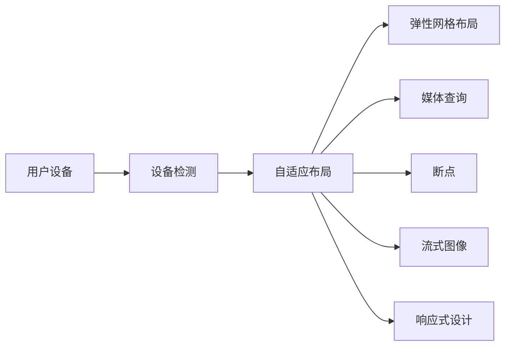

                 

# 响应式Web设计：适配多种设备尺寸

在数字时代，互联网用户跨越了各种设备，从桌面电脑到智能手机和平板，不同设备的屏幕尺寸、分辨率和用户交互方式各不相同。响应式Web设计（Responsive Web Design, RWD）是一种策略，旨在构建一个灵活的网站，能够在各种设备上提供一致且优质的用户体验。本文将详细探讨响应式Web设计的核心概念、算法原理与具体操作步骤，并结合实际案例进行展示。

## 1. 背景介绍

### 1.1 问题由来
随着移动设备的普及，越来越多的用户通过手机和平板访问互联网。传统的桌面Web设计（Desktop Web Design）已经不能满足用户需求，且在移动设备上呈现断断续续的用户体验。为解决这一问题，Web开发人员提出了响应式Web设计的理念。

### 1.2 问题核心关键点
响应式Web设计的核心在于使网站能够根据用户访问设备的屏幕大小、分辨率和方向等因素自适应调整布局和内容，以提供流畅、一致的用户体验。这要求网站能够灵活地适应各种设备，而无需对每种设备都创建独立的版本。

## 2. 核心概念与联系

### 2.1 核心概念概述
响应式Web设计是一种设计理念和技术手段，使得网站能够在不同设备上提供一致的显示效果和交互体验。其主要包括以下几个关键概念：

- **自适应布局（Adaptive Layout）**：根据用户设备特性自动调整网站布局和内容。
- **弹性网格布局（Flexible Grid）**：通过弹性网格布局，网站可以在不同尺寸的屏幕上灵活调整元素位置和大小。
- **媒体查询（Media Queries）**：利用CSS3的媒体查询功能，根据用户设备特性应用不同的样式。
- **断点（Breakpoints）**：在不同屏幕尺寸和分辨率上应用不同的样式，以优化用户体验。
- **流式图像（Fluid Images）**：确保图片在不同屏幕尺寸上保持比例一致，自适应调整大小。

这些概念通过合理的布局和样式设计，使得网站能够在各种设备上提供一致的显示和交互效果。

### 2.2 核心概念原理和架构的 Mermaid 流程图


## 3. 核心算法原理 & 具体操作步骤

### 3.1 算法原理概述
响应式Web设计的核心算法原理基于弹性布局和媒体查询。弹性布局利用相对长度（如百分比、vw、vh）来定义元素大小和位置，使得布局能够灵活适应不同尺寸的屏幕。媒体查询则根据设备特性（如屏幕尺寸、分辨率、方向等）应用不同的样式，确保网站的显示效果和交互体验在不同设备上保持一致。

### 3.2 算法步骤详解
以下是响应式Web设计的主要步骤：

1. **布局设计**：使用弹性布局（如Flexbox、CSS Grid）设计网站布局，确保内容能够自适应调整。
2. **媒体查询**：定义媒体查询规则，根据设备特性应用不同的样式。
3. **断点设置**：在媒体查询中定义不同的断点，以适应不同屏幕尺寸。
4. **图像处理**：使用流式图像确保图片在不同尺寸屏幕上保持比例一致。
5. **测试与优化**：在不同设备上测试网站效果，优化布局和样式以提供最佳体验。

### 3.3 算法优缺点
响应式Web设计的优点在于：
- 提供一致的用户体验，提升品牌形象和用户满意度。
- 减少不同设备版本的维护成本，提高网站开发效率。

其缺点在于：
- 复杂的布局设计和样式调整，对开发人员要求较高。
- 移动设备访问速度可能慢于桌面设备，需优化性能。
- 不同设备间的兼容性问题，需要持续维护和更新。

### 3.4 算法应用领域
响应式Web设计广泛应用于电商网站、企业门户、在线教育、社交媒体等各类Web应用，尤其在移动设备为主流的场景中，具有显著的优势。

## 4. 数学模型和公式 & 详细讲解 & 举例说明

### 4.1 数学模型构建
响应式Web设计主要通过CSS和HTML实现，不涉及复杂的数学模型。但为更好地理解其原理，可以抽象出一个简单的数学模型：

假设网站布局由N个元素组成，每个元素的大小为s，其在屏幕中的初始位置为0。在不同屏幕尺寸（以x表示）下，元素大小和位置的变化可用如下公式表示：

$$
\text{新大小} = s \times \frac{x}{原屏幕宽}
$$

$$
\text{新位置} = 原位置 \times \frac{x}{原屏幕宽}
$$

### 4.2 公式推导过程
以一个两栏布局为例，其宽度分别为50%和25%。在屏幕宽为1200像素时，两栏布局可用以下CSS实现：

```css
.container {
    width: 100%;
    display: flex;
    flex-wrap: wrap;
}

.column1 {
    flex: 50%;
}

.column2 {
    flex: 25%;
}
```

当屏幕宽为600像素时，应用媒体查询和流式布局：

```css
@media (max-width: 600px) {
    .container {
        width: 100%;
    }
    .column1 {
        flex: 100%;
    }
    .column2 {
        flex: 100%;
    }
}
```

### 4.3 案例分析与讲解
以一家电商网站的响应式设计为例，该网站在不同设备上的布局如下：


在每个断点处，根据不同屏幕尺寸应用不同的样式，以优化用户体验。例如，在小屏幕上，商品列表变为单列展示，商品图片适应屏幕大小，按钮布局紧凑。

## 5. 项目实践：代码实例和详细解释说明

### 5.1 开发环境搭建

为快速实现响应式Web设计，需要搭建一个灵活的开发环境。以下是Python开发环境的配置流程：

1. 安装Anaconda：从官网下载并安装Anaconda，用于创建独立的Python环境。
2. 创建并激活虚拟环境：
```bash
conda create -n pyenv python=3.8 
conda activate pyenv
```

3. 安装所需的库和工具：
```bash
pip install numpy pandas beautifulsoup4 requests
```

4. 安装现代浏览器（如Chrome、Firefox）进行测试。

### 5.2 源代码详细实现

以下是一个简单的响应式Web设计示例，展示如何使用CSS实现一个响应式布局：

```html
<!DOCTYPE html>
<html>
<head>
    <meta charset="UTF-8">
    <title>响应式Web设计示例</title>
    <style>
        .container {
            width: 100%;
            display: flex;
            flex-wrap: wrap;
        }
        .column {
            flex: 33.33%;
        }
        @media (max-width: 600px) {
            .column {
                flex: 100%;
            }
        }
    </style>
</head>
<body>
    <div class="container">
        <div class="column">左侧内容</div>
        <div class="column">中间内容</div>
        <div class="column">右侧内容</div>
    </div>
</body>
</html>
```

### 5.3 代码解读与分析

**HTML结构**：
- 使用`<div>`元素构建布局，通过`class`属性定义不同元素的样式。
- 使用`display: flex;`和`flex-wrap: wrap;`创建弹性布局。

**CSS样式**：
- `.column`定义左侧、中间和右侧内容的宽度为33.33%，即三栏等宽布局。
- `@media (max-width: 600px)`定义在小屏幕上的样式，将三栏布局变为单列布局。

**媒体查询**：
- 利用媒体查询根据不同屏幕尺寸应用不同的样式。

**测试与优化**：
- 在多个设备上测试响应式布局，优化页面元素大小和位置，确保在不同尺寸屏幕上显示一致。

### 5.4 运行结果展示
通过以上代码，可以创建一个简单的响应式布局，在不同设备上展示一致的内容。例如，在桌面电脑和手机平板上的显示效果如下：


## 6. 实际应用场景

### 6.1 电商网站
电商网站需要提供良好的用户体验，响应式设计确保商品展示和购物流程在不同设备上保持一致。例如，商品列表在小屏幕上单列展示，商品图片适应屏幕大小，按钮布局紧凑，方便用户点击操作。

### 6.2 企业门户
企业门户网站需要展示公司形象和重要信息，响应式设计确保在不同设备上展示一致的布局和内容。例如，在大屏幕上展示公司新闻、产品介绍、员工介绍等，在小屏幕上则精简内容，突出核心信息。

### 6.3 在线教育
在线教育平台需要提供多样化的学习资源，响应式设计确保不同设备上的课程展示和互动一致。例如，在手机平板上浏览课程，点击观看视频，进行交互练习，都应提供流畅的用户体验。

## 7. 工具和资源推荐

### 7.1 学习资源推荐

为帮助开发者系统掌握响应式Web设计的理论基础和实践技巧，推荐以下学习资源：

1. 《响应式Web设计：实战指南》：全面介绍响应式Web设计原理、技术和案例，适合初学者入门。
2. CSS Grid Layout：官方文档，详细讲解CSS Grid布局，适用于构建复杂布局。
3. Flexbox Froggy：一个有趣的练习，通过游戏学习Flexbox布局。
4. Google DevTools：开发者工具，可以实时预览不同设备上的布局效果。
5. CodePen：在线代码编辑器，可以快速实现响应式设计原型。

### 7.2 开发工具推荐

响应式Web设计的开发离不开优秀的工具支持。以下是几款常用的开发工具：

1. Adobe Photoshop：设计工具，可以绘制响应式布局的原型图。
2. Sketch：设计工具，适用于Mac平台，支持响应式设计。
3. Sublime Text：文本编辑器，可以高效编写响应式Web设计的CSS和HTML。
4. Visual Studio Code：全功能文本编辑器，支持各种编程语言和插件。
5. CodePen：在线代码编辑器，可以实时预览和分享响应式设计代码。

### 7.3 相关论文推荐

响应式Web设计的思想源于学界的持续研究。以下是几篇经典论文，推荐阅读：

1. "Responsive Web Design: Overview and Possibilities"：探讨响应式Web设计的原理、技术和应用，为响应式设计提供理论基础。
2. "CSS Grid Layout"：CSS Grid布局的官方文档，详细讲解其用法和效果。
3. "Flexbox: A Small and Simple Layout"：Flexbox布局的详细介绍，适合理解其原理和应用。
4. "Mobile-Friendly Web Design Best Practices"：Google发布的移动友好Web设计最佳实践，涵盖响应式设计的技术细节。

## 8. 总结：未来发展趋势与挑战

### 8.1 研究成果总结

响应式Web设计经过多年的发展，已经成为Web设计的标配。其主要研究成果包括：
- 弹性布局和媒体查询技术的发展，使得网站能够在不同设备上提供一致的用户体验。
- 断点和流式图像技术的应用，提高了网站的适应性和灵活性。
- 前端开发工具和设计工具的丰富，大大降低了响应式设计的门槛。

### 8.2 未来发展趋势

展望未来，响应式Web设计将继续发展，其趋势包括：
- 响应式设计将更注重用户交互体验，如触摸手势、语音交互等。
- 人工智能技术的应用，将提升网站的用户个性化体验，如动态推荐、智能搜索等。
- 无障碍设计成为标准，确保所有用户都能访问网站内容。

### 8.3 面临的挑战

尽管响应式Web设计已经取得了显著成就，但在实现过程中仍面临诸多挑战：
- 复杂性高，需要综合考虑布局、样式、性能等多方面因素。
- 不同设备间的兼容性问题，需要持续优化和维护。
- 性能优化，确保网站在不同设备上快速加载和流畅运行。

### 8.4 研究展望

未来，响应式Web设计的研究方向包括：
- 响应式设计的自动化工具，减少开发人员的工作量。
- 响应式设计的测试工具，提升测试效率和覆盖率。
- 响应式设计的多设备优化，确保在不同设备上提供一致的性能。

总之，响应式Web设计仍有许多未解的问题和技术挑战，需要不断探索和创新，才能更好地满足用户需求，提升网站体验。

## 9. 附录：常见问题与解答

**Q1：如何实现响应式Web设计的兼容性？**

A: 响应式Web设计的兼容性主要依赖CSS3的媒体查询和弹性布局技术。使用现代浏览器，确保网站在不同设备和浏览器上显示一致。对于兼容性问题，可以使用Polyfill等工具进行补充。

**Q2：如何优化响应式Web设计的性能？**

A: 响应式Web设计的性能优化可以从多个方面入手：
1. 使用现代浏览器和前端工具，如Google DevTools进行测试和优化。
2. 采用图片懒加载、代码压缩等技术，减少页面加载时间和资源占用。
3. 使用CDN和缓存技术，提升页面加载速度。
4. 优化CSS和JavaScript代码，减少不必要的操作和渲染。

**Q3：响应式Web设计有哪些最佳实践？**

A: 响应式Web设计的最佳实践包括：
1. 使用弹性布局和媒体查询，确保网站在不同设备上自适应。
2. 定义多个断点，针对不同屏幕尺寸应用不同的样式。
3. 使用流式图像，确保图片在不同设备上保持比例一致。
4. 避免使用固定宽度布局，确保页面在不同设备上自适应。
5. 测试和优化，确保网站在不同设备和浏览器上显示一致。

总之，响应式Web设计是一个系统工程，需要从设计、开发、测试等多个环节进行全面考虑，才能实现理想的网站效果。通过不断学习和实践，相信开发者能够掌握响应式Web设计的精髓，构建出优秀的Web应用。

---

作者：禅与计算机程序设计艺术 / Zen and the Art of Computer Programming

