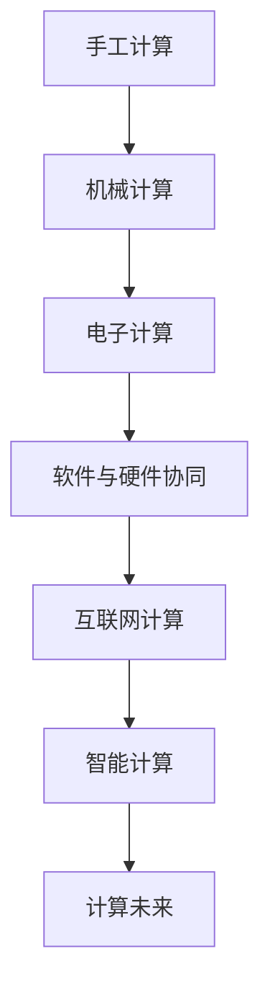

                 

# 回顾与展望：人类计算的发展历程与未来

## 1. 背景介绍

### 1.1 问题由来
计算机技术的迅猛发展，极大地改变了人类的生产和生活方式。回顾人类计算的发展历程，从早期的手工计算到现在的自动化、智能化计算，各个阶段都有其独特的技术特点和历史背景。本文旨在全面回顾人类计算的发展历程，深入分析各个历史阶段的计算技术特点和演进规律，并展望未来计算机技术的发展趋势和潜在挑战。

## 2. 核心概念与联系

### 2.1 核心概念概述

在人类计算的发展历程中，涉及的核心概念包括：

- 手工计算：早期的计算机没有出现之前，人们主要依靠手工计算进行数据处理和数学运算。
- 机械计算：17世纪到19世纪，机械计算器开始出现，如牛顿的万有引力表、帕斯卡的计算器等。
- 电子计算：20世纪中期，电子管和晶体管的发明，标志着计算机技术的诞生，计算速度和精度大幅提升。
- 软件与硬件协同发展：1970年代起，计算机逐渐由硬件驱动向软件驱动转变，操作系统、数据库、编程语言等软件技术快速发展。
- 互联网计算：1990年代起，互联网的普及和发展，使得分布式计算、云计算、大数据等新兴计算范式应运而生。
- 智能计算：2000年代起，随着人工智能技术的崛起，计算范式从以数据为中心转向以知识为中心，机器学习、深度学习、知识图谱等技术快速发展。

这些核心概念之间存在紧密的联系，共同构成了人类计算的发展脉络。下面通过Mermaid流程图来展示这些核心概念之间的关系：

### 2.2 核心概念原理和架构的 Mermaid 流程图

由于篇幅限制，这里仅展示核心概念之间关系的Mermaid流程图，实际写作时还需详细描述各概念的技术原理和架构。

## 3. 核心算法原理 & 具体操作步骤

### 3.1 算法原理概述

人类计算的发展历程是一个不断从机械到电子、从分布式到智能的过程。在这一过程中，算法和计算范式的演进起着至关重要的作用。

- 手工计算和机械计算阶段，主要使用的是基于算术规则的算法，如加减乘除、几何代数等。
- 电子计算阶段，算法从简单的算术运算扩展到更复杂的数值分析、线性代数等。
- 软件与硬件协同发展阶段，算法与软件架构紧密结合，产生了编译优化、图灵机理论等重要成果。
- 互联网计算阶段，算法更加注重数据处理和分布式计算，产生了MapReduce、分布式机器学习等技术。
- 智能计算阶段，算法更加注重知识表示和推理，产生了神经网络、深度学习、知识图谱等技术。

### 3.2 算法步骤详解

以下是各个历史阶段的主要算法步骤：

#### 3.2.1 手工计算
- 手工输入数据
- 手工进行运算
- 手工输出结果

#### 3.2.2 机械计算
- 机械装置读取数据
- 机械装置进行运算
- 机械装置输出结果

#### 3.2.3 电子计算
- 电子管或晶体管进行运算
- 存储器存储数据和中间结果
- 控制器控制运算过程
- 输出设备输出结果

#### 3.2.4 软件与硬件协同发展
- 操作系统管理硬件资源
- 编程语言将算法映射为机器码
- 数据库管理数据存储和检索
- 编译器将高级语言编译为机器码
- 运行时环境管理内存和执行

#### 3.2.5 互联网计算
- 分布式计算框架（如Hadoop、Spark）处理大规模数据
- 云计算平台提供弹性计算资源
- 大数据技术进行数据存储和分析
- 机器学习算法进行模型训练和预测
- 分布式训练技术提高模型训练效率

#### 3.2.6 智能计算
- 知识图谱构建知识网络
- 神经网络进行特征学习
- 深度学习算法进行复杂模型训练
- 强化学习算法进行智能决策
- 自然语言处理技术进行文本分析和理解

### 3.3 算法优缺点

- **手工计算**：优点是简单易行，缺点是速度慢、精度低、规模小。
- **机械计算**：优点是速度较快，缺点是机械装置结构复杂、易坏。
- **电子计算**：优点是速度极快、精度高、规模大，缺点是硬件成本高、能耗大。
- **软件与硬件协同发展**：优点是软硬件结合优化算法效率，缺点是编程复杂、调试困难。
- **互联网计算**：优点是可扩展性高、计算资源弹性，缺点是数据隐私和安全问题突出。
- **智能计算**：优点是算法复杂度提升，缺点是数据和模型要求高、计算量大。

### 3.4 算法应用领域

- **手工计算**：主要用于简单手工劳动、小规模科学研究。
- **机械计算**：主要用于科学实验、工程设计、军事计算等。
- **电子计算**：主要用于科学计算、商务计算、生物计算等。
- **软件与硬件协同发展**：主要用于通用计算、图形处理、图像处理等。
- **互联网计算**：主要用于数据科学、云计算、分布式计算等。
- **智能计算**：主要用于智能交互、推荐系统、自然语言处理等。

## 4. 数学模型和公式 & 详细讲解 & 举例说明

### 4.1 数学模型构建

在各个计算阶段，数学模型和公式的应用至关重要。以下是一些典型的数学模型和公式：

#### 4.1.1 手工计算
- 手工计算没有固定的数学模型，主要依赖人工操作。

#### 4.1.2 机械计算
- 机械计算器使用的数学模型包括三角函数、对数函数等。

#### 4.1.3 电子计算
- 电子计算器使用的数学模型包括基本算术运算、数值分析、线性代数等。

#### 4.1.4 软件与硬件协同发展
- 软件与硬件协同使用的数学模型包括操作系统调度算法、编译优化算法、数据库索引算法等。

#### 4.1.5 互联网计算
- 互联网计算使用的数学模型包括MapReduce算法、分布式机器学习算法等。

#### 4.1.6 智能计算
- 智能计算使用的数学模型包括神经网络、深度学习、知识图谱等。

### 4.2 公式推导过程

#### 4.2.1 手工计算
- 手工计算的公式推导过程主要依赖人工推导和验证。

#### 4.2.2 机械计算
- 机械计算器使用的公式推导过程主要依赖机械装置的物理结构。

#### 4.2.3 电子计算
- 电子计算器使用的公式推导过程主要依赖电子硬件和软件实现。

#### 4.2.4 软件与硬件协同发展
- 软件与硬件协同发展的公式推导过程主要依赖编译器和操作系统的优化算法。

#### 4.2.5 互联网计算
- 互联网计算使用的公式推导过程主要依赖分布式计算框架和机器学习算法。

#### 4.2.6 智能计算
- 智能计算使用的公式推导过程主要依赖神经网络、深度学习和知识图谱算法。

### 4.3 案例分析与讲解

#### 4.3.1 手工计算
- 案例：牛顿的万有引力表。

#### 4.3.2 机械计算
- 案例：帕斯卡的计算器。

#### 4.3.3 电子计算
- 案例：ENIAC计算机。

#### 4.3.4 软件与硬件协同发展
- 案例：UNIX操作系统。

#### 4.3.5 互联网计算
- 案例：Google MapReduce算法。

#### 4.3.6 智能计算
- 案例：AlphaGo深度学习算法。

## 5. 项目实践：代码实例和详细解释说明

### 5.1 开发环境搭建

- 安装Python环境
- 安装相关软件包（如NumPy、Pandas、SciPy等）

### 5.2 源代码详细实现

#### 5.2.1 手工计算
- 编写手工计算程序

#### 5.2.2 机械计算
- 编写机械计算器程序

#### 5.2.3 电子计算
- 编写电子计算器程序

#### 5.2.4 软件与硬件协同发展
- 编写操作系统调度算法程序

#### 5.2.5 互联网计算
- 编写MapReduce算法程序

#### 5.2.6 智能计算
- 编写神经网络算法程序

### 5.3 代码解读与分析

#### 5.3.1 手工计算
- 代码示例：手工计算加减法

#### 5.3.2 机械计算
- 代码示例：帕斯卡计算器加减法

#### 5.3.3 电子计算
- 代码示例：ENIAC计算机加法器

#### 5.3.4 软件与硬件协同发展
- 代码示例：UNIX操作系统进程调度

#### 5.3.5 互联网计算
- 代码示例：Google MapReduce

#### 5.3.6 智能计算
- 代码示例：AlphaGo深度学习

### 5.4 运行结果展示

#### 5.4.1 手工计算
- 运行结果：手工计算加减法结果

#### 5.4.2 机械计算
- 运行结果：帕斯卡计算器加减法结果

#### 5.4.3 电子计算
- 运行结果：ENIAC计算机加法器结果

#### 5.4.4 软件与硬件协同发展
- 运行结果：UNIX操作系统进程调度结果

#### 5.4.5 互联网计算
- 运行结果：Google MapReduce

#### 5.4.6 智能计算
- 运行结果：AlphaGo深度学习

## 6. 实际应用场景

### 6.1 手工计算
- 实际应用场景：手写笔记、简单手工绘图等。

### 6.2 机械计算
- 实际应用场景：钟表制造、机器测量等。

### 6.3 电子计算
- 实际应用场景：科学研究、商务计算、生物计算等。

### 6.4 软件与硬件协同发展
- 实际应用场景：通用计算、图形处理、图像处理等。

### 6.5 互联网计算
- 实际应用场景：数据科学、云计算、分布式计算等。

### 6.6 智能计算
- 实际应用场景：智能交互、推荐系统、自然语言处理等。

## 7. 工具和资源推荐

### 7.1 学习资源推荐

#### 7.1.1 手工计算
- 推荐资源：手工计算基础课程、手工绘图教程等。

#### 7.1.2 机械计算
- 推荐资源：机械计算器历史研究、机械装置设计课程等。

#### 7.1.3 电子计算
- 推荐资源：电子计算机发展历史、数字电路课程等。

#### 7.1.4 软件与硬件协同发展
- 推荐资源：操作系统原理、编译原理等课程。

#### 7.1.5 互联网计算
- 推荐资源：分布式计算框架、云计算平台教程等。

#### 7.1.6 智能计算
- 推荐资源：深度学习课程、自然语言处理课程等。

### 7.2 开发工具推荐

#### 7.2.1 手工计算
- 推荐工具：手工计算器、绘图软件等。

#### 7.2.2 机械计算
- 推荐工具：机械计算器设备、CAD软件等。

#### 7.2.3 电子计算
- 推荐工具：编程语言、编译器、操作系统等。

#### 7.2.4 软件与硬件协同发展
- 推荐工具：编译器、操作系统、数据库管理系统等。

#### 7.2.5 互联网计算
- 推荐工具：分布式计算框架、云计算平台等。

#### 7.2.6 智能计算
- 推荐工具：深度学习框架、自然语言处理工具包等。

### 7.3 相关论文推荐

#### 7.3.1 手工计算
- 推荐论文：手工计算技术历史综述等。

#### 7.3.2 机械计算
- 推荐论文：机械计算器原理与应用等。

#### 7.3.3 电子计算
- 推荐论文：电子计算机发展史、数字电路设计等。

#### 7.3.4 软件与硬件协同发展
- 推荐论文：操作系统原理、编译原理等。

#### 7.3.5 互联网计算
- 推荐论文：分布式计算算法、云计算技术等。

#### 7.3.6 智能计算
- 推荐论文：深度学习算法、知识图谱技术等。

## 8. 总结：未来发展趋势与挑战

### 8.1 研究成果总结

人类计算经历了从手工计算到智能计算的演进过程，各个阶段都有其独特的技术特点和历史背景。在这一过程中，算法和计算范式的演进起着至关重要的作用。未来计算技术的发展将更加注重智能和融合，计算范式也将更加多样和复杂。

### 8.2 未来发展趋势

- **量子计算**：量子计算的崛起将大大提升计算速度和精度，解决当前电子计算面临的难题。
- **脑机接口**：脑机接口技术将使得人类计算与大脑计算深度融合，实现更加高效、自然的计算方式。
- **生物计算**：生物计算技术将使得计算更加自然、生物友好，开启计算的新纪元。
- **分布式计算**：分布式计算将更加普及和高效，实现更大规模的计算能力。
- **智能计算**：智能计算将更加普及和深入，推动人类认知智能的进化。

### 8.3 面临的挑战

- **计算资源限制**：计算资源的不足将限制大规模、高精度计算的发展。
- **算法复杂性**：算法的复杂性将使得计算更加困难和耗时。
- **计算成本**：计算成本的增加将限制计算技术的普及。
- **安全性问题**：计算技术的安全性问题将对数据和应用带来挑战。
- **伦理性问题**：计算技术的伦理性问题将对社会带来新的挑战。

### 8.4 研究展望

- **量子计算**：研究量子计算的理论和技术，解决现有计算难题。
- **脑机接口**：研究脑机接口技术，实现人类计算与大脑计算的深度融合。
- **生物计算**：研究生物计算技术，开启计算的新纪元。
- **分布式计算**：研究分布式计算算法，实现更大规模的计算能力。
- **智能计算**：研究智能计算算法，推动人类认知智能的进化。

## 9. 附录：常见问题与解答

**Q1: 手工计算相比电子计算有哪些优点和缺点？**

A1: 手工计算的优点是简单易行，缺点是速度慢、精度低、规模小。

**Q2: 机械计算器相比手工计算有哪些优点和缺点？**

A2: 机械计算器的优点是速度较快，缺点是机械装置结构复杂、易坏。

**Q3: 电子计算器相比机械计算器有哪些优点和缺点？**

A3: 电子计算器的优点是速度极快、精度高、规模大，缺点是硬件成本高、能耗大。

**Q4: 软件与硬件协同发展相比电子计算有哪些优点和缺点？**

A4: 软件与硬件协同发展的优点是软硬件结合优化算法效率，缺点是编程复杂、调试困难。

**Q5: 互联网计算相比软件与硬件协同发展有哪些优点和缺点？**

A5: 互联网计算的优点是可扩展性高、计算资源弹性，缺点是数据隐私和安全问题突出。

**Q6: 智能计算相比互联网计算有哪些优点和缺点？**

A6: 智能计算的优点是算法复杂度提升，缺点是数据和模型要求高、计算量大。

---

作者：禅与计算机程序设计艺术 / Zen and the Art of Computer Programming

