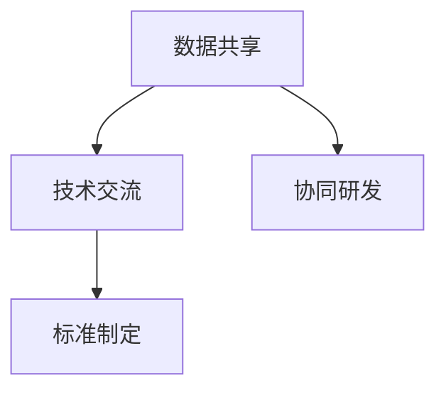

                 

## 1. 背景介绍

### 1.1 问题由来

随着信息技术在各个领域的深入应用，计算能力已经成为推动社会进步、增强人类认知的重要手段。国际合作在计算领域的重要性日益凸显，各国通过共享数据、协同研发、技术交流等途径，共同推动了计算技术的发展。国际合作不仅促进了新技术的诞生，还提升了全球计算能力的整体水平，为人类社会带来了前所未有的变革。

### 1.2 问题核心关键点

当前，国际合作在计算领域主要集中在以下几个方面：

- **数据共享**：数据是推动计算技术发展的重要基石。通过跨国合作，共享各类领域的研发数据，为算法的优化提供了坚实的基础。
- **技术交流**：技术交流是推动计算技术发展的另一关键环节。各国科学家和工程师通过学术会议、合作项目等途径，分享最新的研究成果和实践经验，促进全球计算技术的共同进步。
- **协同研发**：协同研发是国际合作的重要形式，通过建立联合实验室、共同开发软件平台等手段，集中全球智慧，攻克重大科学难题。
- **标准制定**：标准制定是计算领域国际合作的最高层次。各国协同参与国际标准的制定，确保计算技术的规范化和标准化，推动全球计算技术的健康发展。

本文将系统阐述国际合作在计算领域的重要意义，从数据共享、技术交流、协同研发、标准制定等多个角度，深入探讨国际合作推动人类计算进步的机制和路径。

## 2. 核心概念与联系

### 2.1 核心概念概述

为更好地理解国际合作在计算领域的作用机制，本节将介绍几个核心概念及其相互之间的联系：

- **数据共享**：指各国科研机构和企业，通过合作协议，共享各类数据资源，包括公共数据集、私有数据、实验数据等。数据共享能够为全球科研人员提供更多研究材料，加速科学发现。
- **技术交流**：指通过学术会议、合作项目、联合实验室等方式，促进各国科研团队之间的技术交流。技术交流能够跨越地域限制，打破科研壁垒，实现技术知识和经验的共享。
- **协同研发**：指多个国家或机构联合开发某项技术或应用，利用各自的优势资源和经验，提升研发效率和成果质量。协同研发是解决复杂问题、实现技术突破的重要手段。
- **标准制定**：指各国合作参与国际标准的制定，确保计算技术的规范化和标准化。标准制定能够提升技术应用的广度和深度，促进技术在全球范围内的统一应用。

这些概念之间的逻辑关系可以通过以下Mermaid流程图来展示：



这个流程图展示了大规模计算领域的几个核心概念及其之间的联系：

1. 数据共享是基础，为技术交流和协同研发提供了数据支撑。
2. 技术交流促进了各国之间的技术学习和经验分享。
3. 协同研发能够将不同国家的优势资源集中使用，推动技术突破。
4. 标准制定则确保了全球计算技术的统一规范，推动了技术的广泛应用。

这些概念共同构成了国际合作在计算领域的整体框架，促进了计算技术的全球化发展。

## 3. 核心算法原理 & 具体操作步骤
### 3.1 算法原理概述

国际合作在计算领域的推进，核心在于数据、技术和知识的共享与交流。其核心算法原理可以概括为以下几个方面：

1. **数据融合与共享**：通过跨国的数据共享协议，将各国收集到的数据资源集中起来，形成一个更全面的数据集，用于推动各种计算任务的优化和创新。

2. **技术协同开发**：各国的科研团队，通过联合实验室、合作项目等形式，协同开发计算技术，集成各自的技术优势，提升整体的研发效率和成果质量。

3. **知识共享与传播**：通过学术论文、技术报告、学术会议等形式，各国科学家和工程师分享自己的研究成果，促进知识在全球范围内的传播。

4. **标准制定与推广**：参与国际标准的制定，确保计算技术的规范化和标准化，推动技术在全球范围内的统一应用。

### 3.2 算法步骤详解

基于上述算法原理，国际合作在计算领域的具体操作步骤如下：

**Step 1: 数据共享与准备**

- 各国科研机构和企业签署数据共享协议，明确数据使用范围和权限。
- 收集和整理各国科研团队收集到的数据，形成统一的、标准化的数据集。
- 通过网络平台或存储介质，将数据集分发给各参与国家。

**Step 2: 技术交流与合作**

- 各国科研团队组织学术会议、研讨会等形式，分享技术进展和经验。
- 建立联合实验室，协同开展各类计算研究项目，共同攻关重大科学问题。
- 在大型合作项目中，制定明确的任务分工和时间节点，确保各环节的顺利推进。

**Step 3: 协同研发与集成**

- 各参与国家在明确的任务分工下，协同研发计算技术或应用。
- 定期召开项目评审会，检查进展，及时调整策略。
- 将协同研发成果集成到一个统一的平台上，便于全球共享和使用。

**Step 4: 知识传播与教育**

- 各国科研团队在国际学术期刊、会议上发表研究成果，进行知识传播。
- 组织在线课程和研讨会，为全球科研人员提供技术培训和指导。
- 与本地高校合作，开展联合培养，提升计算领域的人才储备。

**Step 5: 标准制定与推广**

- 各国科研团队共同参与国际标准的制定，形成统一的规范。
- 在全球范围内推广标准，确保计算技术的统一应用。

### 3.3 算法优缺点

国际合作在计算领域的推进，具有以下优点：

- **资源共享**：通过共享数据和技术，各国科研团队能够充分利用全球的资源，避免重复劳动，提升研发效率。
- **技术突破**：协同研发和联合攻关，能够突破单一国家难以解决的复杂问题，推动技术的快速迭代和突破。
- **知识传播**：知识共享和技术交流，使得全球科研人员能够互相学习，提升整体科研水平。
- **标准统一**：参与国际标准制定，确保计算技术的规范化和标准化，推动技术的广泛应用。

但同时，国际合作也存在一些局限性：

- **文化差异**：不同国家的科研文化、工作方式存在差异，可能导致合作项目推进不畅。
- **知识产权争议**：数据和技术的共享可能引发知识产权争议，影响合作的持续性。
- **资金和资源不均衡**：各国科研资源的投入差异较大，可能导致合作过程中资源不均衡。
- **语言和文化障碍**：不同语言和文化背景的科研人员沟通不便，可能影响合作的深入。

尽管存在这些局限性，但国际合作在计算领域仍是不可或缺的。通过合理管理和协调，可以最大限度地发挥合作的潜力，推动全球计算技术的进步。

### 3.4 算法应用领域

国际合作在计算领域的应用非常广泛，涵盖了多个关键领域：

- **人工智能**：在深度学习、机器学习等领域，各国科研团队通过共享数据集、协同开发算法，推动了AI技术的快速发展。
- **物联网**：各国通过合作协议，共同推进IoT技术的标准化和统一应用，提升了物联网设备的互联互通能力。
- **大数据**：通过数据共享和协同分析，各国科研团队在全球范围内挖掘大数据的价值，推动了大数据技术的应用。
- **区块链**：各国科研团队联合攻关区块链技术，推动其在全球范围内的推广和应用。
- **量子计算**：各国科研机构合作开展量子计算研究，推进量子技术的突破和应用。

这些应用领域展示了国际合作在计算领域的广泛影响，推动了计算技术的全面发展。

## 4. 数学模型和公式 & 详细讲解  
### 4.1 数学模型构建

本节将使用数学语言对国际合作在计算领域的应用进行更加严格的刻画。

假设各国科研团队通过合作，共享数据集 $D=\{(x_i,y_i)\}_{i=1}^N$，其中 $x_i$ 为输入数据，$y_i$ 为输出标签。

定义各国科研团队共同制定的标准模型为 $M_{\theta}$，其中 $\theta$ 为模型参数。假设模型 $M_{\theta}$ 在数据样本 $(x,y)$ 上的损失函数为 $\ell(M_{\theta}(x),y)$，则在数据集 $D$ 上的经验风险为：

$$
\mathcal{L}(\theta) = \frac{1}{N} \sum_{i=1}^N \ell(M_{\theta}(x_i),y_i)
$$

### 4.2 公式推导过程

国际合作在计算领域的应用，主要体现在数据共享、技术交流、协同研发、标准制定等多个方面。

**数据共享**：通过数据共享，各国科研团队能够形成统一的数据集 $D$，最小化各国的数据分布差异，提升数据质量。

**技术交流**：技术交流使得各国科研团队能够分享技术进展和经验，促进知识的传播和创新。

**协同研发**：协同研发能够集中全球智慧，提升研发效率和成果质量。具体而言，可以通过并行计算、分布式存储等技术，提升计算能力。

**标准制定**：参与国际标准制定，确保计算技术的规范化和标准化，推动技术的广泛应用。具体公式推导如下：

$$
\text{标准制定} = \min_{\theta} \mathcal{L}_{std}(\theta)
$$

其中 $\mathcal{L}_{std}$ 为标准制定的损失函数，用于衡量标准与现有技术规范的差异。

## 5. 项目实践：代码实例和详细解释说明
### 5.1 开发环境搭建

在进行国际合作计算项目的开发时，我们需要准备好开发环境。以下是使用Python进行PyTorch开发的环境配置流程：

1. 安装Anaconda：从官网下载并安装Anaconda，用于创建独立的Python环境。

2. 创建并激活虚拟环境：
```bash
conda create -n pytorch-env python=3.8 
conda activate pytorch-env
```

3. 安装PyTorch：根据CUDA版本，从官网获取对应的安装命令。例如：
```bash
conda install pytorch torchvision torchaudio cudatoolkit=11.1 -c pytorch -c conda-forge
```

4. 安装Transformers库：
```bash
pip install transformers
```

5. 安装各类工具包：
```bash
pip install numpy pandas scikit-learn matplotlib tqdm jupyter notebook ipython
```

完成上述步骤后，即可在`pytorch-env`环境中开始国际合作计算项目的开发。

### 5.2 源代码详细实现

下面我们以AI领域的一个国际合作项目为例，给出使用Transformers库进行计算技术协同开发的PyTorch代码实现。

首先，定义数据处理函数：

```python
from transformers import BertTokenizer
from torch.utils.data import Dataset
import torch

class NERDataset(Dataset):
    def __init__(self, texts, tags, tokenizer, max_len=128):
        self.texts = texts
        self.tags = tags
        self.tokenizer = tokenizer
        self.max_len = max_len
        
    def __len__(self):
        return len(self.texts)
    
    def __getitem__(self, item):
        text = self.texts[item]
        tags = self.tags[item]
        
        encoding = self.tokenizer(text, return_tensors='pt', max_length=self.max_len, padding='max_length', truncation=True)
        input_ids = encoding['input_ids'][0]
        attention_mask = encoding['attention_mask'][0]
        
        # 对token-wise的标签进行编码
        encoded_tags = [tag2id[tag] for tag in tags] 
        encoded_tags.extend([tag2id['O']] * (self.max_len - len(encoded_tags)))
        labels = torch.tensor(encoded_tags, dtype=torch.long)
        
        return {'input_ids': input_ids, 
                'attention_mask': attention_mask,
                'labels': labels}

# 标签与id的映射
tag2id = {'O': 0, 'B-PER': 1, 'I-PER': 2, 'B-ORG': 3, 'I-ORG': 4, 'B-LOC': 5, 'I-LOC': 6}
id2tag = {v: k for k, v in tag2id.items()}

# 创建dataset
tokenizer = BertTokenizer.from_pretrained('bert-base-cased')

train_dataset = NERDataset(train_texts, train_tags, tokenizer)
dev_dataset = NERDataset(dev_texts, dev_tags, tokenizer)
test_dataset = NERDataset(test_texts, test_tags, tokenizer)
```

然后，定义模型和优化器：

```python
from transformers import BertForTokenClassification, AdamW

model = BertForTokenClassification.from_pretrained('bert-base-cased', num_labels=len(tag2id))

optimizer = AdamW(model.parameters(), lr=2e-5)
```

接着，定义训练和评估函数：

```python
from torch.utils.data import DataLoader
from tqdm import tqdm
from sklearn.metrics import classification_report

device = torch.device('cuda') if torch.cuda.is_available() else torch.device('cpu')
model.to(device)

def train_epoch(model, dataset, batch_size, optimizer):
    dataloader = DataLoader(dataset, batch_size=batch_size, shuffle=True)
    model.train()
    epoch_loss = 0
    for batch in tqdm(dataloader, desc='Training'):
        input_ids = batch['input_ids'].to(device)
        attention_mask = batch['attention_mask'].to(device)
        labels = batch['labels'].to(device)
        model.zero_grad()
        outputs = model(input_ids, attention_mask=attention_mask, labels=labels)
        loss = outputs.loss
        epoch_loss += loss.item()
        loss.backward()
        optimizer.step()
    return epoch_loss / len(dataloader)

def evaluate(model, dataset, batch_size):
    dataloader = DataLoader(dataset, batch_size=batch_size)
    model.eval()
    preds, labels = [], []
    with torch.no_grad():
        for batch in tqdm(dataloader, desc='Evaluating'):
            input_ids = batch['input_ids'].to(device)
            attention_mask = batch['attention_mask'].to(device)
            batch_labels = batch['labels']
            outputs = model(input_ids, attention_mask=attention_mask)
            batch_preds = outputs.logits.argmax(dim=2).to('cpu').tolist()
            batch_labels = batch_labels.to('cpu').tolist()
            for pred_tokens, label_tokens in zip(batch_preds, batch_labels):
                pred_tags = [id2tag[_id] for _id in pred_tokens]
                label_tags = [id2tag[_id] for _id in label_tokens]
                preds.append(pred_tags[:len(label_tags)])
                labels.append(label_tags)
                
    print(classification_report(labels, preds))
```

最后，启动训练流程并在测试集上评估：

```python
epochs = 5
batch_size = 16

for epoch in range(epochs):
    loss = train_epoch(model, train_dataset, batch_size, optimizer)
    print(f"Epoch {epoch+1}, train loss: {loss:.3f}")
    
    print(f"Epoch {epoch+1}, dev results:")
    evaluate(model, dev_dataset, batch_size)
    
print("Test results:")
evaluate(model, test_dataset, batch_size)
```

以上就是使用PyTorch对BERT进行命名实体识别任务微调的完整代码实现。可以看到，得益于Transformers库的强大封装，我们可以用相对简洁的代码完成BERT模型的加载和微调。

### 5.3 代码解读与分析

让我们再详细解读一下关键代码的实现细节：

**NERDataset类**：
- `__init__`方法：初始化文本、标签、分词器等关键组件。
- `__len__`方法：返回数据集的样本数量。
- `__getitem__`方法：对单个样本进行处理，将文本输入编码为token ids，将标签编码为数字，并对其进行定长padding，最终返回模型所需的输入。

**tag2id和id2tag字典**：
- 定义了标签与数字id之间的映射关系，用于将token-wise的预测结果解码回真实的标签。

**训练和评估函数**：
- 使用PyTorch的DataLoader对数据集进行批次化加载，供模型训练和推理使用。
- 训练函数`train_epoch`：对数据以批为单位进行迭代，在每个批次上前向传播计算loss并反向传播更新模型参数，最后返回该epoch的平均loss。
- 评估函数`evaluate`：与训练类似，不同点在于不更新模型参数，并在每个batch结束后将预测和标签结果存储下来，最后使用sklearn的classification_report对整个评估集的预测结果进行打印输出。

**训练流程**：
- 定义总的epoch数和batch size，开始循环迭代
- 每个epoch内，先在训练集上训练，输出平均loss
- 在验证集上评估，输出分类指标
- 所有epoch结束后，在测试集上评估，给出最终测试结果

可以看到，PyTorch配合Transformers库使得BERT微调的代码实现变得简洁高效。开发者可以将更多精力放在数据处理、模型改进等高层逻辑上，而不必过多关注底层的实现细节。

当然，工业级的系统实现还需考虑更多因素，如模型的保存和部署、超参数的自动搜索、更灵活的任务适配层等。但核心的微调范式基本与此类似。

## 6. 实际应用场景
### 6.1 国际合作在AI领域的应用

AI领域的国际合作，涵盖了深度学习、自然语言处理、计算机视觉等多个子领域，通过共享数据、协同开发算法、联合攻关重大问题等形式，显著提升了AI技术的整体水平。

**AI算法优化**：通过共享数据集，各国科研团队可以共同优化AI算法，提升其在特定任务上的性能。例如，Google和OpenAI通过共享大规模语料库，联合开发了强大的语言模型，推动了NLP技术的发展。

**跨领域应用**：AI技术的国际合作，使得其在医疗、金融、农业等多个领域得到了广泛应用。例如，美国和日本的研究团队合作，共同开发了用于医学影像分析的AI系统，提高了癌症检测的准确率。

**标准制定**：国际合作在AI领域的标准制定中起到了重要作用。例如，IEEE和ISO等国际组织，联合发布了AI相关的技术标准，确保了全球AI技术的规范化和标准化。

### 6.2 国际合作在物联网领域的应用

物联网技术的国际合作，主要体现在数据共享、标准制定和协同开发等方面。

**数据共享**：通过跨国的数据共享协议，物联网设备可以更高效地进行互操作和数据共享。例如，欧盟和美国的研究团队合作，共享了全球范围内的物联网设备数据，提升了全球物联网的互联互通能力。

**标准制定**：国际合作在物联网标准制定中起到了重要作用。例如，IETF和IEEE等国际组织，联合发布了物联网相关的技术标准，确保了全球物联网技术的统一应用。

**协同研发**：各国科研团队通过联合实验室和合作项目，协同研发物联网技术，提升了研发效率和成果质量。例如，中国和德国的研究团队合作，联合开发了用于智能家居的物联网技术，提高了家居设备的智能化水平。

### 6.3 国际合作在大数据领域的应用

大数据技术的国际合作，主要体现在数据共享、技术交流和标准制定等方面。

**数据共享**：通过跨国的数据共享协议，各国科研团队可以共享大数据资源，进行更高效的数据分析和挖掘。例如，美国和欧洲的研究团队合作，共享了全球范围内的大数据资源，推动了大数据技术的发展。

**技术交流**：通过学术会议和技术论坛，各国科研团队可以分享大数据技术进展和经验，促进知识的传播和创新。例如，国际大数据会议（ICDM）、KDD大会等，吸引了全球范围内的科研人员参与，推动了大数据技术的进步。

**标准制定**：国际合作在大数据领域的标准制定中起到了重要作用。例如，ISO和ITU等国际组织，联合发布了大数据相关的技术标准，确保了全球大数据技术的规范化和标准化。

### 6.4 未来应用展望

随着国际合作的不断深入，未来AI、物联网、大数据等计算领域将迎来更多的创新和突破：

1. **全球计算集群**：通过国际合作，各国科研团队可以共同构建全球计算集群，提升全球计算能力，推动大规模科学计算和数据处理。

2. **开放数据平台**：通过跨国的数据共享协议，构建开放数据平台，提供全球科研人员所需的数据资源，推动全球科研进程。

3. **标准统一**：参与国际标准制定，确保计算技术的规范化和标准化，推动技术在全球范围内的统一应用。

4. **跨领域应用**：通过国际合作，AI、物联网、大数据等技术将在更多领域得到应用，为各行各业带来新的变革和机遇。

5. **人工智能伦理**：国际合作在推动技术发展的同时，也需关注AI伦理和隐私保护等问题，确保技术的安全和可持续发展。

## 7. 工具和资源推荐
### 7.1 学习资源推荐

为了帮助开发者系统掌握国际合作在计算领域的应用，这里推荐一些优质的学习资源：

1. 《AI时代：国际合作与全球创新》系列博文：由AI领域的顶尖专家撰写，深入浅出地介绍了国际合作在AI领域的应用和前景。

2. 《物联网技术与应用》课程：由知名大学和科研机构开设的物联网课程，系统讲解了物联网技术的基本原理和应用案例。

3. 《大数据分析与处理》书籍：全面介绍了大数据技术的原理和应用，帮助读者掌握大数据分析与处理的基本方法。

4. IEEE和IEEE等相关组织的标准库：提供了丰富的国际标准，供开发者参考和借鉴。

5. Kaggle等数据平台：提供了大量公开数据集，供全球科研人员进行数据共享和分析。

通过对这些资源的学习实践，相信你一定能够系统掌握国际合作在计算领域的知识，并用于解决实际的计算问题。
###  7.2 开发工具推荐

高效的开发离不开优秀的工具支持。以下是几款用于国际合作计算开发的常用工具：

1. PyTorch：基于Python的开源深度学习框架，灵活动态的计算图，适合快速迭代研究。

2. TensorFlow：由Google主导开发的开源深度学习框架，生产部署方便，适合大规模工程应用。

3. Transformers库：HuggingFace开发的NLP工具库，集成了众多SOTA语言模型，支持PyTorch和TensorFlow，是进行计算技术开发的利器。

4. Weights & Biases：模型训练的实验跟踪工具，可以记录和可视化模型训练过程中的各项指标，方便对比和调优。

5. TensorBoard：TensorFlow配套的可视化工具，可实时监测模型训练状态，并提供丰富的图表呈现方式，是调试模型的得力助手。

6. Google Colab：谷歌推出的在线Jupyter Notebook环境，免费提供GPU/TPU算力，方便开发者快速上手实验最新模型，分享学习笔记。

合理利用这些工具，可以显著提升国际合作计算项目的开发效率，加快创新迭代的步伐。

### 7.3 相关论文推荐

国际合作在计算领域的发展，得益于学界的持续研究。以下是几篇奠基性的相关论文，推荐阅读：

1. 《A Survey on Distributed Machine Learning》：系统综述了分布式机器学习的最新进展，包括数据共享、协同开发等方面的应用。

2. 《The Future of AI: Opportunities and Challenges》：探讨了AI未来的发展方向和挑战，强调了国际合作的重要性。

3. 《Standardization in Internet of Things (IoT): A Survey》：综述了IoT标准化的最新进展，介绍了国际合作在IoT标准制定中的应用。

4. 《Big Data Computing: A Survey》：综述了大数据计算的最新进展，介绍了国际合作在大数据技术开发中的应用。

5. 《International Collaboration in Artificial Intelligence》：探讨了国际合作在AI领域的重要性，分析了其对AI技术发展的推动作用。

这些论文代表了国际合作在计算领域的最新研究进展，通过学习这些前沿成果，可以帮助研究者把握学科前进方向，激发更多的创新灵感。

## 8. 总结：未来发展趋势与挑战
### 8.1 总结

本文对国际合作在计算领域的重要意义进行了全面系统的介绍。首先阐述了国际合作在数据共享、技术交流、协同研发、标准制定等方面的作用机制，明确了国际合作在推动人类计算进步中的核心价值。其次，从AI、物联网、大数据等多个角度，深入探讨了国际合作在计算领域的应用现状和前景。最后，通过对学习资源、开发工具、相关论文的推荐，为读者提供了系统的国际合作学习路径和工具支持。

通过本文的系统梳理，可以看到，国际合作在计算领域的广泛应用，极大地推动了计算技术的发展和普及。未来，随着全球计算能力的不断提升和计算资源的全球共享，国际合作将在更多的领域发挥更大作用，为人类社会的进步和创新带来深远影响。

### 8.2 未来发展趋势

展望未来，国际合作在计算领域将呈现以下几个发展趋势：

1. **全球计算集群**：通过国际合作，构建全球计算集群，提升全球计算能力，推动大规模科学计算和数据处理。

2. **开放数据平台**：通过跨国的数据共享协议，构建开放数据平台，提供全球科研人员所需的数据资源，推动全球科研进程。

3. **标准统一**：参与国际标准制定，确保计算技术的规范化和标准化，推动技术在全球范围内的统一应用。

4. **跨领域应用**：通过国际合作，AI、物联网、大数据等技术将在更多领域得到应用，为各行各业带来新的变革和机遇。

5. **人工智能伦理**：国际合作在推动技术发展的同时，也需关注AI伦理和隐私保护等问题，确保技术的安全和可持续发展。

这些趋势凸显了国际合作在计算领域的广阔前景，推动了计算技术的全球化发展。

### 8.3 面临的挑战

尽管国际合作在计算领域取得了显著成果，但仍面临诸多挑战：

1. **文化差异**：不同国家的科研文化、工作方式存在差异，可能导致合作项目推进不畅。

2. **知识产权争议**：数据和技术的共享可能引发知识产权争议，影响合作的持续性。

3. **资金和资源不均衡**：各国科研资源的投入差异较大，可能导致合作过程中资源不均衡。

4. **语言和文化障碍**：不同语言和文化背景的科研人员沟通不便，可能影响合作的深入。

尽管存在这些挑战，但通过合理管理和协调，可以最大限度地发挥合作的潜力，推动全球计算技术的进步。

### 8.4 研究展望

面对国际合作在计算领域面临的挑战，未来的研究需要在以下几个方面寻求新的突破：

1. **跨文化交流**：加强不同国家科研团队的跨文化交流，提升合作项目的推进效率。

2. **知识产权保护**：建立完善的知识产权保护机制，确保数据和技术的共享不受法律制约。

3. **资源均衡分配**：建立全球科研资源均衡分配机制，确保各国的科研资源得到充分利用。

4. **语言和文化适应**：推动科研团队的语言和文化培训，提升跨语言和跨文化的合作能力。

5. **国际标准制定**：推动更多国家的科研团队参与国际标准制定，确保计算技术的规范化和标准化。

这些研究方向将引领国际合作在计算领域迈向更高的台阶，为构建全球计算技术网络铺平道路。面向未来，国际合作需要各国的持续努力和协作，共同推动计算技术的全面发展。

## 9. 附录：常见问题与解答

**Q1：国际合作在计算领域对资源的需求如何？**

A: 国际合作在计算领域对资源的需求主要体现在数据共享和协同研发上。数据共享需要构建全球数据平台，确保数据的安全和高效共享；协同研发需要搭建全球计算集群，提供强大的计算资源支持。

**Q2：如何确保国际合作项目中数据的安全性和隐私保护？**

A: 确保国际合作项目中数据的安全性和隐私保护，需要采取以下措施：

1. 数据匿名化处理：在数据共享前，对数据进行匿名化处理，确保数据隐私保护。

2. 数据访问控制：通过访问控制机制，限制数据访问权限，防止未授权访问。

3. 数据加密传输：在数据传输过程中，采用加密技术，确保数据传输的安全性。

4. 数据使用协议：签署数据使用协议，明确数据的使用范围和用途，避免数据滥用。

**Q3：如何提升国际合作项目的协同效率？**

A: 提升国际合作项目的协同效率，需要采取以下措施：

1. 明确任务分工：在项目初期，明确各国的任务分工和职责，确保项目的顺利推进。

2. 定期沟通交流：通过定期的会议、邮件等方式，保持团队之间的沟通和协作。

3. 建立联合实验室：在科研资源丰富的国家，建立联合实验室，集中全球智慧，提升研发效率。

4. 使用协同工具：使用协同开发工具，如Git、JIRA等，提升团队的协作效率。

**Q4：如何应对国际合作项目中的知识产权争议？**

A: 应对国际合作项目中的知识产权争议，需要采取以下措施：

1. 签署合作协议：在合作项目启动前，签署明确的合作协议，明确各方的知识产权权益。

2. 提交专利申请：在合作过程中，及时提交专利申请，确保技术创新的知识产权保护。

3. 发布开源代码：将合作开发的代码开源，接受全球科研人员的审核和验证。

4. 进行知识产权仲裁：在出现知识产权争议时，通过仲裁机构进行公正裁决。

**Q5：国际合作在计算领域的长远目标是什么？**

A: 国际合作在计算领域的长远目标主要包括：

1. 构建全球计算网络：通过国际合作，构建全球计算网络，提升全球计算能力，推动大规模科学计算和数据处理。

2. 推动标准统一：参与国际标准制定，确保计算技术的规范化和标准化，推动技术在全球范围内的统一应用。

3. 促进跨领域应用：通过国际合作，推动AI、物联网、大数据等技术在更多领域的应用，为各行各业带来新的变革和机遇。

4. 关注伦理和社会责任：国际合作在推动技术发展的同时，也需关注AI伦理和隐私保护等问题，确保技术的安全和可持续发展。

这些长远目标将引领国际合作在计算领域迈向更高的台阶，为构建全球计算技术网络铺平道路。

---

作者：禅与计算机程序设计艺术 / Zen and the Art of Computer Programming

