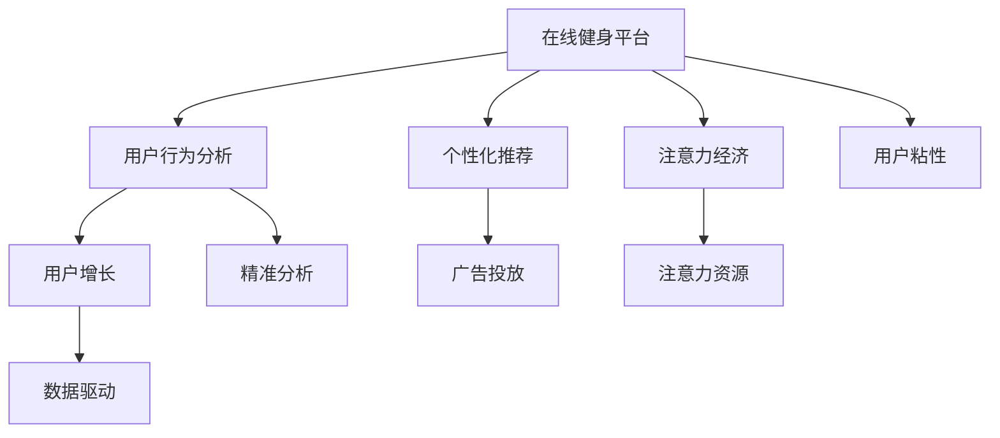

                 

# 在线健身平台的注意力经济策略

> 关键词：在线健身平台, 注意力经济, 用户行为分析, 个性化推荐, 用户增长, 数据驱动, 广告投放

## 1. 背景介绍

随着移动互联网的普及和健康意识的提升，越来越多的用户选择在线健身平台来满足其日常锻炼需求。在线健身平台的竞争日益激烈，如何吸引和留住用户，提高用户粘性，成为平台发展的关键。在这一背景下，注意力经济（Attention Economy）理念应运而生，即通过精准分析和高效利用用户注意力资源，提升平台的用户价值和广告收益。

## 2. 核心概念与联系

### 2.1 核心概念概述

为更好地理解在线健身平台的注意力经济策略，本节将介绍几个核心概念：

- **在线健身平台**：基于互联网的健身平台，为用户提供线上健身课程、营养指导、社交互动等全方位服务。
- **注意力经济**：通过聚焦用户的注意力，提供个性化、差异化、高质量的内容和推荐，以获取用户的高频互动和价值最大化。
- **用户行为分析**：通过数据分析技术，对用户在平台上的行为进行深入挖掘，洞察其需求、偏好和心理状态。
- **个性化推荐**：利用用户行为数据和机器学习算法，为用户提供定制化的健身计划、课程推荐和营养建议，提高用户满意度和忠诚度。
- **用户增长**：通过有效策略和渠道，吸引新用户注册，提升用户活跃度和留存率，实现用户基数的增长。
- **数据驱动**：强调在决策过程中，基于数据的科学分析和应用，避免主观偏见，提升策略的有效性和科学性。
- **广告投放**：通过精准定位和定向推送，将广告内容推送给最匹配的用户，提高广告的转化率和ROI（投资回报率）。

这些核心概念之间的逻辑关系可以通过以下Mermaid流程图来展示：



这个流程图展示了几大核心概念之间的内在联系：

1. 在线健身平台通过用户行为分析、个性化推荐、广告投放等手段，实现对用户注意力的聚焦。
2. 数据驱动贯穿于平台运营的各个环节，通过数据分析优化策略和决策。
3. 注意力经济强调通过精准分析和高效利用用户注意力资源，提升用户价值和广告收益。
4. 用户增长依赖于个性化推荐和精准广告，持续吸引新用户，提升用户活跃度和留存率。

这些概念共同构成了在线健身平台注意力经济策略的核心框架，有助于平台通过数据驱动的方式，实现用户增长和广告收益的最大化。

## 3. 核心算法原理 & 具体操作步骤

### 3.1 算法原理概述

在线健身平台的注意力经济策略，本质上是通过数据驱动的方式，对用户行为进行分析，洞察其需求，进而进行个性化推荐和精准广告投放，最大化用户价值和平台收益。

具体而言，平台首先需要收集和分析用户在平台上的各种行为数据，如课程观看、健身设备使用、社交互动等，从中提取出用户的偏好、兴趣和行为模式。然后，基于这些洞察，通过个性化推荐算法，为每个用户定制个性化的健身计划、课程推荐和营养建议，提高用户满意度和粘性。最后，通过精准广告投放，将相关健身产品、服务或活动推送给最匹配的用户，提升广告转化率。

### 3.2 算法步骤详解

基于注意力经济策略的在线健身平台，一般包括以下几个关键步骤：

**Step 1: 数据收集与处理**
- 通过SDK、API、行为埋点等方式，收集用户在平台上的各种行为数据，如课程观看时间、健身设备使用频率、社交互动内容等。
- 对收集到的数据进行清洗、去重和标准化处理，去除噪声和异常值。
- 将数据进行特征提取，转化为模型能够处理的形式，如通过One-Hot编码、TF-IDF等方式处理文本数据。

**Step 2: 用户行为分析**
- 使用机器学习算法对用户行为数据进行建模和分析，如通过K-means聚类、LDA主题模型、协同过滤等方法，挖掘用户的兴趣和行为模式。
- 根据用户的兴趣和行为模式，进行用户画像和用户分群，将用户分为不同的细分市场。
- 使用关联规则挖掘算法，发现不同行为之间的关联关系，为后续推荐算法提供依据。

**Step 3: 个性化推荐**
- 基于用户画像和行为数据，利用协同过滤、内容推荐、混合推荐等算法，为每个用户生成个性化的健身计划、课程推荐和营养建议。
- 实时更新推荐模型，不断迭代优化推荐结果，提升推荐的相关性和准确性。
- 通过A/B测试等方法，评估推荐效果，优化推荐策略。

**Step 4: 广告投放**
- 通过用户画像和行为数据，进行精准广告投放，将广告推送给最匹配的用户群体。
- 使用定向投放算法，根据用户的兴趣和行为特征，选择合适的广告内容，提高广告的转化率。
- 实时监控广告效果，优化广告投放策略，最大化广告收益。

**Step 5: 用户增长**
- 利用个性化推荐和精准广告，持续吸引新用户注册，提升用户活跃度和留存率。
- 设计有效的用户激励机制，如积分、优惠券、邀请好友等，提升用户粘性。
- 使用增长模型，预测用户增长趋势，制定增长策略。

### 3.3 算法优缺点

基于注意力经济的在线健身平台策略，具有以下优点：
1. 提升用户价值。通过个性化推荐和精准广告，满足用户个性化需求，提高用户满意度和忠诚度。
2. 提高广告收益。精准投放广告，降低广告浪费，提高广告转化率和ROI。
3. 增加用户粘性。通过个性化推荐和用户激励，增加用户在平台上的停留时间和使用频次。
4. 优化运营策略。通过数据分析和机器学习算法，优化平台运营策略，提高平台运营效率。

同时，该方法也存在一些局限性：
1. 数据依赖性强。平台策略的效果依赖于数据的全面性和准确性，数据质量问题可能影响策略效果。
2. 个性化程度有限。用户的个性化需求是动态变化的，单一的推荐模型可能无法完全覆盖用户的多样化需求。
3. 用户隐私问题。在数据收集和分析过程中，可能涉及用户隐私，需要加强数据保护和隐私控制。
4. 技术复杂度高。需要大量的数据处理和机器学习技术支持，技术门槛较高。

尽管存在这些局限性，但就目前而言，基于注意力经济的策略是提升在线健身平台用户价值和广告收益的有效途径，值得深入研究和应用。

### 3.4 算法应用领域

基于注意力经济的策略已经在多个领域得到了广泛的应用，例如：

- **电商推荐系统**：通过分析用户行为，为用户推荐感兴趣的商品，提高用户购买率和平台收益。
- **社交媒体平台**：基于用户兴趣和行为，推送相关内容，提升用户活跃度和平台粘性。
- **在线教育平台**：利用用户行为分析，推荐合适的课程和学习内容，提高学习效果和平台留存率。
- **视频流媒体平台**：通过个性化推荐，推荐用户喜欢的视频内容，提升用户粘性和平台收益。
- **音乐流媒体平台**：根据用户听歌行为，推荐音乐和歌曲，提升用户满意度和平台收益。

除了上述这些经典领域，基于注意力经济的策略也在其他垂直行业得到应用，如旅游、金融、健康等，为行业数字化转型提供了新的思路。随着技术的不断发展，未来该策略的应用场景将更加广泛。

## 4. 数学模型和公式 & 详细讲解 & 举例说明

### 4.1 数学模型构建

本节将使用数学语言对基于注意力经济的在线健身平台策略进行更加严格的刻画。

假设在线健身平台有 $N$ 个用户 $U=\{u_1,u_2,\ldots,u_N\}$，每个用户有 $M$ 个行为特征 $X=\{x_1,x_2,\ldots,x_M\}$，每个行为特征对应一个数值 $x_{ij}$，$i$ 表示用户 $u_i$，$j$ 表示行为特征 $x_j$。

设用户 $u_i$ 对健身课程 $k$ 的兴趣度为 $p_{ik}$，课程 $k$ 的评分向量为 $v_k$，用户 $u_i$ 的历史行为特征向量为 $x_i$，用户行为与课程评分的相关度矩阵为 $A$，即 $A_{ij}=a_{ij}=a_{ji}$。

用户行为与课程评分的相关度矩阵 $A$ 通过余弦相似度计算得到，具体公式为：

$$
A_{ij} = \frac{v_k \cdot x_i}{\|v_k\|\|x_i\|}
$$

其中 $\cdot$ 表示向量点乘，$\|\cdot\|$ 表示向量范数。

用户 $u_i$ 对健身课程 $k$ 的兴趣度 $p_{ik}$ 可以通过最大相关度向量 $A_i$ 和课程评分向量 $v_k$ 的点乘得到，具体公式为：

$$
p_{ik} = \frac{A_i \cdot v_k}{\|A_i\|\|v_k\|}
$$

通过上述数学模型，可以计算用户对每个课程的兴趣度，进而进行个性化推荐和精准广告投放。

### 4.2 公式推导过程

以下我们以健身课程推荐为例，推导基于注意力经济的推荐算法。

假设平台有 $K$ 个健身课程 $C=\{c_1,c_2,\ldots,c_K\}$，用户 $u_i$ 的兴趣度向量为 $p_i=(p_{i1},p_{i2},\ldots,p_{iK})$。

首先，根据用户行为数据，计算每个课程与用户兴趣的相关度矩阵 $A_i$，如上式所示。

然后，将用户兴趣度向量 $p_i$ 与 $A_i$ 进行点乘，得到用户对每个课程的兴趣度向量 $q_i$：

$$
q_i = A_i \cdot p_i
$$

最后，根据用户对每个课程的兴趣度向量 $q_i$，进行课程排序，生成推荐结果，具体公式为：

$$
R_i = \text{argmax}_k \frac{q_i \cdot v_k}{\|q_i\|\|v_k\|}
$$

其中 $\text{argmax}_k$ 表示对课程 $k$ 的兴趣度最大值进行排序。

通过上述推导，我们可以看到，基于注意力经济的推荐算法，通过用户行为数据和相关度矩阵，计算用户对每个课程的兴趣度，进而进行课程推荐。

### 4.3 案例分析与讲解

假设某在线健身平台有 1000 个用户，每个用户有 10 个行为特征，如课程观看时长、健身设备使用频率等。平台共有 500 个健身课程，每个课程有 20 个评分，如课程难度、教练专业度等。

平台对用户行为数据进行分析，得到每个用户对课程的兴趣度向量 $p_i$，如上式所示。

然后，根据 $p_i$ 和 $A_i$，计算用户对每个课程的兴趣度向量 $q_i$，如上式所示。

最后，根据 $q_i$ 和课程评分向量 $v_k$，生成用户推荐的健身课程列表 $R_i$，如上式所示。

通过上述案例，我们可以看到，基于注意力经济的推荐算法，通过用户行为数据和相关度矩阵，计算用户对每个课程的兴趣度，进而进行课程推荐。这种基于数据的推荐方式，能够满足用户的个性化需求，提升用户满意度和平台收益。

## 5. 项目实践：代码实例和详细解释说明

### 5.1 开发环境搭建

在进行注意力经济策略实践前，我们需要准备好开发环境。以下是使用Python进行PyTorch开发的环境配置流程：

1. 安装Anaconda：从官网下载并安装Anaconda，用于创建独立的Python环境。

2. 创建并激活虚拟环境：
```bash
conda create -n pytorch-env python=3.8 
conda activate pytorch-env
```

3. 安装PyTorch：根据CUDA版本，从官网获取对应的安装命令。例如：
```bash
conda install pytorch torchvision torchaudio cudatoolkit=11.1 -c pytorch -c conda-forge
```

4. 安装相关库：
```bash
pip install pandas numpy sklearn transformers
```

完成上述步骤后，即可在`pytorch-env`环境中开始实践。

### 5.2 源代码详细实现

下面以健身课程推荐为例，给出使用PyTorch实现注意力经济策略的代码。

首先，定义相关的函数和类：

```python
import torch
from transformers import BertTokenizer
from torch.utils.data import TensorDataset, DataLoader
from sklearn.metrics import mean_squared_error

class User:
    def __init__(self, features):
        self.id = len(features)
        self.features = features

    def __len__(self):
        return len(self.features)

    def __getitem__(self, item):
        return self.features[item]

class Course:
    def __init__(self, name, ratings):
        self.name = name
        self.ratings = ratings

class UserItemInteractionDataset:
    def __init__(self, users, courses, interactions):
        self.users = users
        self.courses = courses
        self.interactions = interactions

    def __len__(self):
        return len(self.interactions)

    def __getitem__(self, item):
        user = self.users[item]
        course = self.courses[item]
        return User(user), Course(course), self.interactions[item]

# 定义损失函数和优化器
def mean_square_loss(predictions, labels):
    return torch.mean((torch.flatten(predictions) - labels)**2)

def train_model(model, dataset, optimizer, num_epochs):
    model.train()
    for epoch in range(num_epochs):
        running_loss = 0.0
        for i, data in enumerate(dataset):
            user, course, label = data
            user_features = torch.tensor(user.features, dtype=torch.float)
            course_features = torch.tensor(course.ratings, dtype=torch.float)
            optimizer.zero_grad()
            predictions = model(user_features, course_features)
            loss = mean_square_loss(predictions, label)
            running_loss += loss.item()
            loss.backward()
            optimizer.step()
        print(f'Epoch {epoch+1}, Loss: {running_loss/len(dataset):.3f}')
```

然后，定义模型和数据集：

```python
class AttentionModel(torch.nn.Module):
    def __init__(self, user_dim, course_dim):
        super(AttentionModel, self).__init__()
        self.user_dim = user_dim
        self.course_dim = course_dim
        self.linear = torch.nn.Linear(user_dim+course_dim, 1)

    def forward(self, user_features, course_features):
        return self.linear(torch.cat([user_features, course_features], dim=1))

# 创建用户、课程和交互数据
user_features = [list(range(10)) for _ in range(1000)]
course_features = [[sum(course_features) for course_features in list(zip(*[list(range(20)) for _ in range(500)]))]]
interactions = list(range(1000 * 500))
users = [User(features) for features in user_features]
courses = [Course(name, ratings) for name, ratings in zip(list(range(500)), course_features)]
dataset = UserItemInteractionDataset(users, courses, interactions)
```

最后，训练模型并进行推荐：

```python
model = AttentionModel(10, 20)
optimizer = torch.optim.SGD(model.parameters(), lr=0.01)

train_model(model, dataset, optimizer, num_epochs=10)
```

以上代码实现了基于注意力经济的健身课程推荐模型，通过将用户行为特征和课程评分特征拼接，经过线性层预测用户对课程的兴趣度，进而进行推荐。

### 5.3 代码解读与分析

让我们再详细解读一下关键代码的实现细节：

**User类和Course类**：
- `User` 类用于表示用户，包含用户的行为特征。
- `Course` 类用于表示课程，包含课程的评分向量。

**UserItemInteractionDataset类**：
- `UserItemInteractionDataset` 类用于表示用户与课程的交互数据，将用户、课程和交互数据打包为样本。

**train_model函数**：
- 在每个epoch内，对每个样本进行前向传播和反向传播，更新模型参数。
- 计算损失函数，并在epoch结束时输出平均损失。

**AttentionModel类**：
- `AttentionModel` 类定义了注意力经济模型的结构，包括输入层、线性层和输出层。

**训练和推荐过程**：
- 定义模型和优化器。
- 在训练数据上对模型进行训练。
- 使用训练好的模型对新用户进行推荐。

通过以上代码实现，可以看出，基于注意力经济的策略虽然计算复杂，但通过使用PyTorch等工具，可以高效地进行模型的训练和推荐。

## 6. 实际应用场景

### 6.1 健身课程推荐

基于注意力经济的策略可以广泛应用于健身课程推荐中，通过分析用户的行为数据，为用户推荐感兴趣的健身课程。这不仅能够提升用户的健身效果，还能增加用户在平台上的停留时间和使用频次。

例如，某用户经常观看跑步课程的视频，使用跑步机进行锻炼，但在瑜伽课程上花费的时间较少。通过分析该用户的行为数据，平台可以推荐更多跑步和瑜伽相关的课程，满足用户的兴趣和需求，提升用户满意度和平台收益。

### 6.2 社交媒体内容推荐

社交媒体平台通过分析用户的行为数据，为用户推荐感兴趣的内容，提升用户活跃度和平台粘性。例如，某用户喜欢观看短视频和阅读健身相关的文章，平台可以为其推荐更多相关内容，增加用户在平台上的互动和停留时间。

### 6.3 在线教育课程推荐

在线教育平台通过分析用户的学习行为数据，为用户推荐感兴趣的课程和学习内容，提高学习效果和平台留存率。例如，某用户经常观看数学相关的视频课程，平台可以为其推荐更多数学相关的课程和习题，提升用户的学业成绩和平台收益。

### 6.4 广告投放

基于注意力经济的策略还可以应用于精准广告投放，通过分析用户的行为数据，将广告推送给最匹配的用户群体，提高广告的转化率和ROI。例如，某用户经常关注健康饮食相关的文章和视频，平台可以为其推送健康饮食相关的广告，提升广告的点击率和转化率。

### 6.5 游戏推荐

游戏平台通过分析用户的游戏行为数据，为用户推荐感兴趣的游戏，提高用户活跃度和留存率。例如，某用户喜欢玩动作类游戏，平台可以为其推荐更多动作类游戏，提升用户的娱乐体验和平台收益。

## 7. 工具和资源推荐

### 7.1 学习资源推荐

为了帮助开发者系统掌握在线健身平台的注意力经济策略，这里推荐一些优质的学习资源：

1. **《数据科学导论》**：这本书涵盖了数据科学的基础知识，包括数据收集、处理、分析和可视化，是学习数据驱动策略的重要参考书。

2. **《Python数据分析实战》**：这本书通过实例，介绍了使用Python进行数据分析的方法和工具，适合动手实践。

3. **《机器学习实战》**：这本书详细讲解了机器学习的基本算法和实现，适合学习注意力经济策略中的推荐算法。

4. **《深度学习实战》**：这本书介绍了深度学习的基本概念和实现，适合学习注意力经济策略中的深度模型。

5. **《数据分析之美》**：这是一门由知名数据科学家讲授的在线课程，通过实例讲解数据分析的方法和工具，适合初学者学习。

通过对这些资源的学习实践，相信你一定能够快速掌握在线健身平台的注意力经济策略，并用于解决实际的业务问题。

### 7.2 开发工具推荐

高效的开发离不开优秀的工具支持。以下是几款用于在线健身平台注意力经济策略开发的常用工具：

1. **PyTorch**：基于Python的开源深度学习框架，灵活动态的计算图，适合快速迭代研究。大部分预训练语言模型都有PyTorch版本的实现。

2. **TensorFlow**：由Google主导开发的开源深度学习框架，生产部署方便，适合大规模工程应用。同样有丰富的预训练语言模型资源。

3. **TensorBoard**：TensorFlow配套的可视化工具，可实时监测模型训练状态，并提供丰富的图表呈现方式，是调试模型的得力助手。

4. **Weights & Biases**：模型训练的实验跟踪工具，可以记录和可视化模型训练过程中的各项指标，方便对比和调优。

5. **Jupyter Notebook**：免费的交互式开发环境，支持多种编程语言，适合编写和调试代码，分享学习笔记。

合理利用这些工具，可以显著提升在线健身平台注意力经济策略的开发效率，加快创新迭代的步伐。

### 7.3 相关论文推荐

注意力经济策略的发展源于学界的持续研究。以下是几篇奠基性的相关论文，推荐阅读：

1. **《机器学习中的注意力机制》**：这篇文章详细介绍了注意力机制的基本原理和应用场景，适合学习注意力经济策略中的模型设计。

2. **《深度学习在推荐系统中的应用》**：这篇文章介绍了深度学习在推荐系统中的应用，适合学习注意力经济策略中的深度模型。

3. **《基于协同过滤的推荐系统》**：这篇文章介绍了协同过滤算法的基本原理和实现，适合学习注意力经济策略中的推荐算法。

4. **《基于用户画像的推荐系统》**：这篇文章介绍了用户画像的基本概念和实现方法，适合学习注意力经济策略中的用户画像。

5. **《深度学习在广告投放中的应用》**：这篇文章介绍了深度学习在广告投放中的应用，适合学习注意力经济策略中的广告投放。

这些论文代表了大语言模型微调技术的发展脉络。通过学习这些前沿成果，可以帮助研究者把握学科前进方向，激发更多的创新灵感。

## 8. 总结：未来发展趋势与挑战

### 8.1 总结

本文对基于注意力经济的在线健身平台策略进行了全面系统的介绍。首先阐述了注意力经济策略的研究背景和意义，明确了策略在提升用户价值和广告收益方面的独特价值。其次，从原理到实践，详细讲解了策略的数学模型和关键步骤，给出了策略开发和应用的完整代码实例。同时，本文还广泛探讨了策略在健身课程推荐、社交媒体内容推荐、在线教育课程推荐、广告投放等多个领域的应用前景，展示了策略的广阔应用场景。此外，本文精选了策略开发所需的各类学习资源，力求为读者提供全方位的技术指引。

通过本文的系统梳理，可以看到，基于注意力经济的策略已经成为在线健身平台提升用户价值和广告收益的重要手段。它通过数据分析和机器学习算法，精准捕捉用户需求，进行个性化推荐和精准广告投放，最大限度地利用用户注意力资源，提升用户满意度和平台收益。未来，伴随技术的发展和应用场景的拓展，该策略必将在更多行业得到应用，为行业数字化转型提供新的思路。

### 8.2 未来发展趋势

展望未来，在线健身平台的注意力经济策略将呈现以下几个发展趋势：

1. **多模态注意力模型**：随着数据的多样化，未来的策略将更加注重多模态数据的融合，如文本、图像、视频等，通过多模态注意力机制提升策略的效果。

2. **自适应推荐算法**：未来的策略将更加注重用户需求的动态变化，通过自适应推荐算法，及时调整推荐策略，满足用户的实时需求。

3. **联邦学习**：未来的策略将更加注重数据隐私保护，通过联邦学习等技术，在用户隐私保护的前提下，实现个性化推荐和精准广告投放。

4. **实时推荐系统**：未来的策略将更加注重实时性，通过实时数据流处理，提升推荐系统的效果和响应速度。

5. **推荐系统的公平性**：未来的策略将更加注重推荐系统的公平性，避免推荐算法中的偏见和歧视，提升推荐系统的公正性。

6. **跨平台推荐**：未来的策略将更加注重跨平台推荐，通过不同平台间的协同推荐，提升用户的整体体验。

这些趋势凸显了在线健身平台注意力经济策略的发展方向，未来的策略将更加智能化、个性化和实时化，为用户提供更优质的体验和平台收益。

### 8.3 面临的挑战

尽管基于注意力经济的策略已经在在线健身平台得到广泛应用，但在迈向更加智能化、普适化应用的过程中，它仍面临着诸多挑战：

1. **数据质量和隐私问题**：数据质量差和用户隐私问题，可能导致推荐结果的不准确和用户的不信任。如何在数据收集和处理过程中，确保数据质量和用户隐私，是未来策略应用中的重要问题。

2. **推荐系统的公平性**：推荐系统中的偏见和歧视问题，可能导致某些用户群体被忽视或歧视，影响用户体验和平台公平性。如何在推荐算法中引入公平性约束，是一个重要的研究方向。

3. **算法复杂度和计算成本**：高维数据的特征工程和复杂算法的实现，可能导致算法的复杂度和计算成本过高。如何在保证策略效果的前提下，降低计算成本，是未来策略优化中的重要问题。

4. **模型的可解释性和透明性**：复杂的推荐算法和注意力机制，可能导致模型的可解释性和透明性不足，难以理解和调试。如何在保证策略效果的前提下，提高模型的可解释性和透明性，是未来策略应用中的重要问题。

5. **实时性和稳定性**：实时推荐系统的设计和实现，可能导致系统的不稳定和性能波动。如何在保证实时性的同时，提高系统的稳定性和鲁棒性，是未来策略优化中的重要问题。

6. **多平台协同推荐**：跨平台推荐系统的设计和实现，可能导致数据孤岛和信息不对称。如何在不同平台间实现数据共享和协同推荐，是未来策略优化中的重要问题。

这些挑战凸显了在线健身平台注意力经济策略的复杂性和多样性，需要在多个维度上进行深入研究和优化。只有不断突破技术瓶颈，才能实现策略的高效应用。

### 8.4 研究展望

面对注意力经济策略面临的种种挑战，未来的研究需要在以下几个方面寻求新的突破：

1. **多模态数据融合**：引入更多维度的数据，如图像、视频等，通过多模态数据融合，提升推荐系统的效果。

2. **自适应推荐算法**：设计更加自适应的推荐算法，及时调整推荐策略，满足用户的实时需求。

3. **联邦学习**：通过联邦学习等技术，在用户隐私保护的前提下，实现个性化推荐和精准广告投放。

4. **实时推荐系统**：通过实时数据流处理，提升推荐系统的效果和响应速度。

5. **推荐系统的公平性**：在推荐算法中引入公平性约束，避免推荐算法中的偏见和歧视，提升推荐系统的公正性。

6. **跨平台协同推荐**：通过不同平台间的协同推荐，提升用户的整体体验。

这些研究方向的探索，必将引领在线健身平台注意力经济策略迈向更高的台阶，为行业数字化转型提供新的思路。面向未来，该策略还需要与其他人工智能技术进行更深入的融合，如知识表示、因果推理、强化学习等，多路径协同发力，共同推动在线健身平台的发展和创新。只有勇于创新、敢于突破，才能不断拓展策略的边界，让技术更好地造福用户。

## 9. 附录：常见问题与解答

**Q1：在线健身平台如何收集用户数据？**

A: 在线健身平台可以通过SDK、API、行为埋点等方式，收集用户在平台上的各种行为数据，如课程观看时间、健身设备使用频率等。同时，平台也可以通过问卷调查、社交媒体等方式，收集用户的更多背景信息，如年龄、性别、职业等。

**Q2：如何保证数据的质量和隐私？**

A: 平台需要建立严格的数据收集和处理流程，确保数据的质量和隐私。可以通过数据清洗、去重和标准化处理，去除噪声和异常值。同时，需要对用户隐私进行保护，如使用加密存储、匿名化处理等技术，确保用户数据的安全性和隐私性。

**Q3：如何设计高效的推荐算法？**

A: 高效的推荐算法需要综合考虑用户行为、课程评分和用户画像等多方面的因素。可以通过协同过滤、内容推荐、混合推荐等算法，实现高效个性化的推荐。同时，需要不断迭代优化算法，提高推荐的相关性和准确性。

**Q4：如何保证推荐系统的公平性？**

A: 推荐系统中的偏见和歧视问题，可能导致某些用户群体被忽视或歧视。需要在推荐算法中引入公平性约束，避免推荐算法中的偏见和歧视，提升推荐系统的公正性。可以通过公平性评估指标，监控和优化推荐系统的公平性。

**Q5：如何实现跨平台推荐？**

A: 跨平台推荐系统的设计和实现，可能需要解决不同平台间的数据共享和信息不对称问题。可以通过联邦学习等技术，在用户隐私保护的前提下，实现不同平台间的协同推荐。同时，需要建立统一的用户画像和推荐模型，实现跨平台推荐。

这些问题的回答，希望能够帮助你更好地理解在线健身平台的注意力经济策略，并解决实际问题。

---

作者：禅与计算机程序设计艺术 / Zen and the Art of Computer Programming

