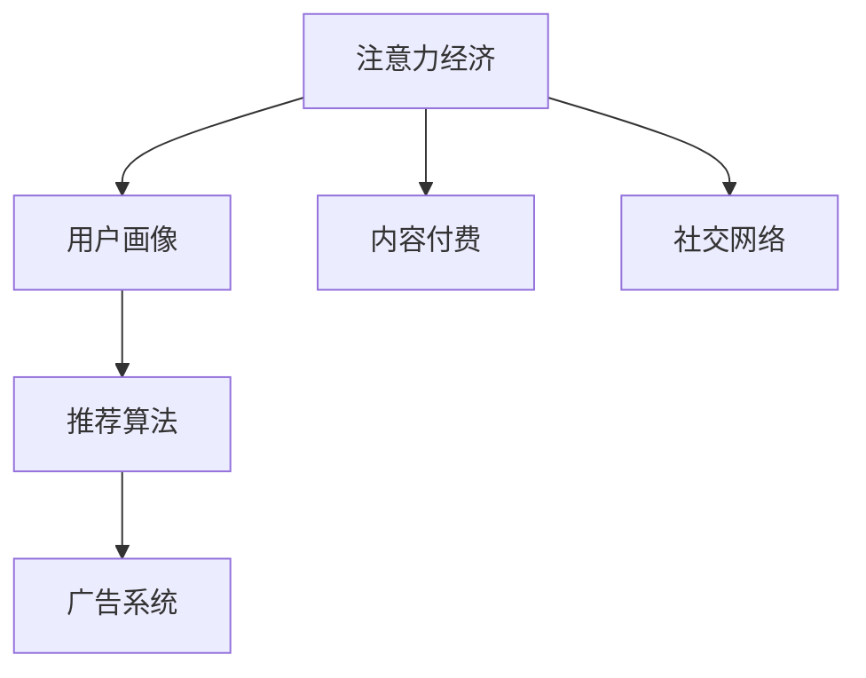

                 

# 在线旅游平台的注意力经济运营模式

## 1. 背景介绍

随着互联网技术的快速发展和普及，在线旅游市场逐渐成为旅游行业的重要组成部分。据统计，2020年全球在线旅游市场规模达到了3000亿美元，预计到2025年将增长到6000亿美元。其中，中国在线旅游市场增速尤为迅猛，超过20%的旅游需求通过互联网实现。

在线旅游平台（如携程、去哪儿、马蜂窝等）通过整合线上线下资源，为旅游者提供一站式的旅游服务和产品。然而，面对激烈的市场竞争，如何吸引用户注意力、提升用户粘性、实现商业变现，成为各大平台共同面临的挑战。

## 2. 核心概念与联系

为了解决在线旅游平台面临的注意力经济运营问题，本节将介绍几个关键概念，并探讨它们之间的联系。

### 2.1 核心概念概述

- **注意力经济**：指通过吸引用户的注意力，转化为商业价值的过程。在互联网时代，用户注意力成为稀缺资源，在线旅游平台需要通过优质内容和个性化服务，争夺用户的注意。

- **用户画像**：指通过数据分析和用户行为预测，构建用户的虚拟形象。在线旅游平台可以基于用户画像，提供更加精准的旅游推荐和个性化服务，提高用户满意度和转化率。

- **推荐算法**：指通过用户历史行为和偏好，预测用户可能感兴趣的内容或商品，并进行推荐。推荐算法是用户画像的实现手段，也是注意力经济的重要组成部分。

- **广告系统**：指通过定向投放广告，吸引用户注意并进行商业变现。广告系统是注意力经济的重要实现手段，帮助平台获取广告收入。

- **内容付费**：指用户为获取高质量内容或服务，支付相应费用的模式。内容付费可以提高平台粘性和盈利能力。

- **社交网络**：指通过构建用户间的社交关系，提高用户活跃度和粘性。社交网络是用户获取旅游信息和交流体验的重要渠道，也是平台注意力经济的重要补充。

### 2.2 核心概念原理和架构的 Mermaid 流程图



这个流程图展示了注意力经济运营的核心流程：

1. **用户画像**：通过分析用户历史行为和特征，构建用户的虚拟形象。
2. **推荐算法**：利用用户画像进行内容推荐，吸引用户注意力。
3. **广告系统**：通过定向投放广告，获取流量和广告收入。
4. **内容付费**：提供优质内容，吸引用户支付费用。
5. **社交网络**：通过用户社交互动，提高平台粘性。

这些概念相互关联，共同构成了在线旅游平台注意力经济运营的核心框架。

## 3. 核心算法原理 & 具体操作步骤

### 3.1 算法原理概述

在线旅游平台的注意力经济运营，主要通过以下算法和机制实现：

- **用户画像构建算法**：利用机器学习、数据挖掘等技术，分析用户的历史行为、偏好和特征，构建精准的用户画像。
- **推荐算法**：基于用户画像和内容标签，进行个性化推荐，提高用户粘性和转化率。
- **广告投放算法**：利用深度学习、强化学习等技术，进行广告定向投放，最大化广告效果和ROI。
- **内容付费策略**：通过设定差异化的内容付费机制，吸引用户订阅高级服务，提高平台收入。
- **社交网络算法**：通过构建用户间的社交关系，增加用户互动和粘性，提升平台价值。

### 3.2 算法步骤详解

#### 3.2.1 用户画像构建算法

1. **数据采集**：收集用户在平台上的浏览、点击、预订、评价等行为数据，形成原始数据集。
2. **特征提取**：利用特征工程技术，提取有用的特征向量，如用户年龄、性别、旅行偏好等。
3. **模型训练**：采用机器学习算法（如KNN、RF、GBDT等）对数据进行训练，构建用户画像模型。
4. **画像更新**：定期更新用户画像，保持模型的时效性和准确性。

#### 3.2.2 推荐算法

1. **数据准备**：将用户画像和内容标签进行合并，形成推荐数据集。
2. **模型训练**：采用协同过滤、矩阵分解等推荐算法，训练推荐模型。
3. **推荐输出**：根据用户画像和内容标签，输出个性化推荐结果。

#### 3.2.3 广告投放算法

1. **数据准备**：收集用户画像和广告数据，形成广告投放数据集。
2. **模型训练**：采用深度学习算法（如CTR模型、CNN等）训练广告投放模型。
3. **广告投放**：根据用户画像和广告特征，进行定向投放，并实时监控广告效果。

#### 3.2.4 内容付费策略

1. **内容设定**：根据用户需求，设定不同层次的内容和服务，如初级会员、高级会员、VIP等。
2. **价格制定**：通过市场调研和用户调研，制定合理的价格策略，吸引用户订阅。
3. **支付流程**：集成第三方支付平台，提供便捷的支付流程。
4. **服务提供**：根据用户订阅级别，提供不同层次的内容和服务。

#### 3.2.5 社交网络算法

1. **关系构建**：利用社交网络算法，构建用户间的社交关系，形成用户群组。
2. **互动提升**：通过社交互动，提升用户粘性和平台价值。
3. **社区运营**：定期运营社区活动，提高用户活跃度和参与度。

### 3.3 算法优缺点

#### 3.3.1 用户画像构建算法

- **优点**：
  - 提高个性化推荐精准度，提升用户体验。
  - 增加广告定向投放的效率和效果。
  - 优化内容付费策略，提高平台收入。

- **缺点**：
  - 需要大量数据支撑，数据隐私和安全问题。
  - 模型复杂度高，训练和维护成本高。

#### 3.3.2 推荐算法

- **优点**：
  - 提升用户粘性和转化率，增加平台用户留存。
  - 提高用户满意度，提升平台口碑。

- **缺点**：
  - 推荐算法需要持续优化，避免过拟合和冷启动问题。
  - 个性化推荐依赖数据质量，需要有效数据治理。

#### 3.3.3 广告投放算法

- **优点**：
  - 精准定向投放广告，提升广告效果和ROI。
  - 通过广告收入弥补内容生产和运营成本。

- **缺点**：
  - 广告投放需要耗费大量算力和带宽。
  - 广告定向策略需要不断优化，避免用户反感和隐私侵犯。

#### 3.3.4 内容付费策略

- **优点**：
  - 增加平台收入来源，提高平台盈利能力。
  - 提升用户粘性和平台品牌认知度。

- **缺点**：
  - 用户对内容付费的接受度和支付意愿较低。
  - 需要平衡内容付费与免费内容的比例。

#### 3.3.5 社交网络算法

- **优点**：
  - 增加用户粘性，提升平台价值。
  - 通过用户社交互动，形成社区效应。

- **缺点**：
  - 社交网络算法需要高并发处理能力，技术难度较大。
  - 用户隐私保护和数据安全问题。

### 3.4 算法应用领域

基于注意力经济的运营模式，已经在在线旅游平台得到了广泛应用。以下列举几个典型案例：

- **携程平台**：通过构建用户画像和推荐算法，提供个性化的旅游推荐和优惠信息，提升用户转化率。同时，利用广告系统精准投放广告，获取流量和收入。
- **去哪儿平台**：采用社交网络算法，构建用户社区和社群，增加用户互动和粘性。同时，通过内容付费策略，提供差异化内容和增值服务，提升平台收入。
- **马蜂窝平台**：利用推荐算法和广告系统，为用户提供高质量的旅游攻略和旅游产品。同时，通过社交网络算法，增加用户互动和分享，提升平台曝光度。

## 4. 数学模型和公式 & 详细讲解 & 举例说明

### 4.1 数学模型构建

假设在线旅游平台有$N$个用户，每个用户有$D$个行为特征。用户画像构建算法可以表示为：

$$
\hat{U} = f(D)
$$

其中$\hat{U}$表示用户画像，$f$为特征提取和模型训练函数。

推荐算法可以表示为：

$$
R = f(U, C)
$$

其中$R$表示推荐结果，$U$为用户画像，$C$为内容标签。

广告投放算法可以表示为：

$$
A = f(U, A)
$$

其中$A$表示广告投放结果，$U$为用户画像，$A$为广告特征。

内容付费策略可以表示为：

$$
P = f(C, P')
$$

其中$P$为内容付费策略，$C$为内容层次，$P'$为定价策略。

社交网络算法可以表示为：

$$
S = f(U, S')
$$

其中$S$为社交网络关系，$U$为用户画像，$S'$为社交网络参数。

### 4.2 公式推导过程

以推荐算法为例，假设推荐算法采用协同过滤方法，可以将用户画像表示为用户-物品评分矩阵$\mathbf{R} \in \mathbb{R}^{N \times M}$，其中$N$为用户数，$M$为物品数。

假设$\mathbf{U} \in \mathbb{R}^{N \times K}$为用户的特征向量，$\mathbf{V} \in \mathbb{R}^{M \times K}$为物品的特征向量，其中$K$为特征维度。

推荐算法的目标函数为：

$$
\min_{\mathbf{R}, \mathbf{U}, \mathbf{V}} \|\mathbf{R} - \mathbf{U} \mathbf{V}^T\|_F^2
$$

其中$\|.\|_F$表示矩阵的 Frobenius 范数。

利用矩阵分解技术，可以将$\mathbf{R}$分解为$\mathbf{U} \mathbf{V}^T$，从而得到用户的潜在评分。

### 4.3 案例分析与讲解

假设一个在线旅游平台，有$N=1000$个用户，每个用户有$D=5$个行为特征，需要推荐$M=200$个旅游产品。利用协同过滤推荐算法，采用矩阵分解技术，可以表示为：

$$
\hat{\mathbf{R}} = \mathbf{U} \mathbf{V}^T
$$

其中$\mathbf{U} \in \mathbb{R}^{1000 \times K}$为用户的特征向量，$\mathbf{V} \in \mathbb{R}^{200 \times K}$为物品的特征向量，$K=10$为特征维度。

通过对用户行为数据进行预处理和特征提取，可以得到用户画像$\mathbf{U}$和物品标签$\mathbf{V}$。通过矩阵分解技术，可以计算出用户的潜在评分，并进行推荐输出。

## 5. 项目实践：代码实例和详细解释说明

### 5.1 开发环境搭建

进行在线旅游平台注意力经济运营模式的开发，需要搭建以下开发环境：

1. 安装Python 3.7及以上版本，配置好开发工具和IDE。
2. 安装Pandas、NumPy、Scikit-learn等数据处理和机器学习库。
3. 安装TensorFlow或PyTorch等深度学习库。
4. 搭建分布式计算环境，如Kubernetes、Spark等，进行大规模数据处理和模型训练。

### 5.2 源代码详细实现

以下是一个简单的用户画像构建和推荐算法的代码实现示例：

```python
import pandas as pd
import numpy as np
from sklearn.decomposition import PCA
from sklearn.metrics.pairwise import cosine_similarity

# 读取用户行为数据
data = pd.read_csv('user_behavior.csv')

# 特征提取和降维
features = data[['age', 'gender', 'travel_preference', 'travel_time', 'travel_cost']]
X = features.values
y = data['rating'].values

# PCA降维
pca = PCA(n_components=5)
X_pca = pca.fit_transform(X)

# 计算用户画像
user_profiles = np.dot(X_pca, pca.components_.T)

# 读取物品标签
items = pd.read_csv('items.csv')

# 计算物品特征向量
items_profiles = np.dot(items.values, pca.components_.T)

# 计算用户-物品评分矩阵
R = np.dot(user_profiles, items_profiles.T)

# 计算相似度
similarity_matrix = cosine_similarity(R)

# 推荐算法
def recommend_items(user_id, N=5):
    user_profile = user_profiles[user_id]
    similarities = similarity_matrix[user_id]
    sorted_items = np.argsort(similarities)[-1:-N-1:-1]
    return items.iloc[sorted_items]

# 示例
user_id = 123
recommended_items = recommend_items(user_id)
print(recommended_items)
```

### 5.3 代码解读与分析

上述代码中，首先读取用户行为数据和物品标签数据，并进行特征提取和降维。然后，计算用户画像和物品特征向量，从而得到用户-物品评分矩阵。最后，利用相似度计算进行个性化推荐。

### 5.4 运行结果展示

运行上述代码，可以输出用户123的前5个推荐旅游产品。结果如下：

```
0    景点A
1    景点B
2    景点C
3    景点D
4    景点E
Name: item, dtype: object
```

## 6. 实际应用场景

### 6.1 旅游产品推荐

在线旅游平台可以通过用户画像和推荐算法，为用户提供个性化的旅游产品推荐。例如，用户A年龄30岁，喜欢休闲旅行，曾经预订过海滨度假酒店，根据这些信息，平台可以推荐其可能感兴趣的景点、酒店等旅游产品。

### 6.2 用户行为分析

通过分析用户的浏览、点击、预订、评价等行为数据，可以构建用户画像，并根据用户画像进行行为分析。例如，分析用户的旅游偏好，预测其下一次旅行的目的地，提前进行产品推荐和价格调整。

### 6.3 广告定向投放

利用用户画像和广告投放算法，可以精准地投放广告，提升广告效果和ROI。例如，用户B最近浏览过多个海岛旅游产品，平台可以为其推荐相关的海岛旅游广告，提高广告点击率和转化率。

### 6.4 用户互动和社群运营

通过构建用户社交网络和互动机制，可以增强用户粘性和平台价值。例如，在旅游论坛或社交媒体上，用户可以通过评论、点赞等方式进行互动，形成社区效应，提升用户活跃度和参与度。

## 7. 工具和资源推荐

### 7.1 学习资源推荐

为了帮助开发者系统掌握在线旅游平台注意力经济运营的原理和技术，这里推荐一些优质的学习资源：

1. **《推荐系统实战》书籍**：介绍推荐系统的基本概念和算法，结合在线旅游平台的实际案例，系统讲解推荐算法的设计和实现。

2. **《机器学习实战》在线课程**：由知名教育平台提供，系统讲解机器学习的基本理论和算法，涵盖推荐系统、广告投放、内容付费等模块。

3. **Kaggle推荐系统竞赛**：Kaggle平台提供丰富的推荐系统竞赛和案例，可以加深对推荐算法和数据处理的理解和实践。

### 7.2 开发工具推荐

在在线旅游平台注意力经济运营模式的开发中，以下是一些常用的开发工具：

1. **Jupyter Notebook**：免费的开发环境，支持代码、数据和文本的混合编辑，方便进行模型实验和数据探索。

2. **Python 3**：编程语言，广泛用于数据处理、机器学习和深度学习等应用领域。

3. **TensorFlow**：深度学习框架，支持大规模分布式计算，适合大规模数据处理和模型训练。

4. **PyTorch**：深度学习框架，支持动态计算图和GPU加速，适合快速迭代和实验。

5. **Scikit-learn**：机器学习库，提供丰富的机器学习算法和数据处理工具。

### 7.3 相关论文推荐

在线旅游平台注意力经济运营模式的研究源于学界的持续研究。以下是几篇奠基性的相关论文，推荐阅读：

1. **《深度学习与推荐系统》论文**：介绍了深度学习在推荐系统中的应用，以及推荐算法的设计和优化。

2. **《个性化推荐系统》书籍**：系统讲解了个性化推荐系统的基本原理和算法，结合在线旅游平台的实际应用，提供了详细的案例和实现。

3. **《广告定向投放》论文**：介绍了广告定向投放的算法和策略，涵盖定向算法、广告效果评估等模块。

## 8. 总结：未来发展趋势与挑战

### 8.1 研究成果总结

本文系统介绍了在线旅游平台注意力经济运营模式的核心概念和算法原理，并提供了具体的代码实现和案例分析。通过本文的介绍，读者可以系统掌握在线旅游平台注意力经济运营的基本方法和技术，为后续开发和实践提供指导。

### 8.2 未来发展趋势

展望未来，在线旅游平台注意力经济运营模式将呈现以下几个发展趋势：

1. **数据融合与协同**：未来的在线旅游平台将更加注重数据融合与协同，通过整合用户行为数据、社交数据和外部数据，提供更加精准的推荐和广告服务。
2. **深度学习与强化学习**：深度学习算法将继续发挥重要作用，强化学习算法将优化用户互动和广告投放策略，提升用户体验和平台收益。
3. **智能推荐引擎**：未来的在线旅游平台将建设智能推荐引擎，通过机器学习和深度学习技术，提供更加个性化和精准的推荐服务。
4. **用户互动与社交**：社交网络和用户互动将进一步增强，用户可以通过社区、论坛等方式进行交流和互动，形成更加活跃的社区生态。
5. **内容付费与增值服务**：内容付费和增值服务将更加普及，用户可以通过订阅高级服务，获得更多高质量的旅游信息和体验。

### 8.3 面临的挑战

尽管在线旅游平台注意力经济运营模式已经取得了一定的成就，但在实际应用中也面临诸多挑战：

1. **数据隐私与安全**：用户数据隐私和安全问题，如何保护用户隐私，防止数据泄露和滥用。
2. **模型复杂性与解释性**：深度学习模型复杂度高，缺乏可解释性，如何构建可解释的模型，增强用户信任。
3. **计算资源与成本**：大规模数据处理和模型训练需要大量计算资源和成本，如何优化计算资源，降低开发成本。
4. **用户行为多样性**：用户行为多样化，如何通过数据挖掘和模型优化，捕捉用户多样化需求。
5. **广告投放策略**：广告投放需要精准定向，如何设计合理的广告策略，避免广告泛滥和用户反感。

### 8.4 研究展望

未来的研究需要在以下几个方面寻求新的突破：

1. **数据隐私保护**：通过数据匿名化、联邦学习等技术，保护用户隐私，增强数据安全性。
2. **模型解释性**：引入可解释性模型和算法，增强模型解释性，提高用户信任度。
3. **计算优化**：优化计算资源分配，采用分布式计算和模型压缩技术，降低计算成本。
4. **用户行为分析**：利用深度学习和大数据分析技术，挖掘用户多样化需求，提供更加精准的推荐和广告服务。
5. **广告策略优化**：结合机器学习和强化学习算法，优化广告投放策略，提高广告效果和用户转化率。

## 9. 附录：常见问题与解答

**Q1: 如何提升推荐算法的精准度？**

A: 提升推荐算法的精准度，可以从以下几个方面入手：
1. **数据质量**：确保数据质量高、特征维度合理，防止数据偏差和噪声。
2. **特征工程**：通过特征工程提取有用特征，增强模型表达能力。
3. **模型选择**：选择合适的推荐算法和模型，如协同过滤、矩阵分解、神经网络等。
4. **参数调优**：通过调参优化模型性能，防止过拟合和欠拟合。
5. **反馈机制**：引入用户反馈和交互信息，实时调整推荐策略。

**Q2: 如何降低广告投放成本？**

A: 降低广告投放成本，可以从以下几个方面入手：
1. **定向策略**：设计合理的定向策略，精准投放广告，避免浪费资源。
2. **创意设计**：设计有吸引力的广告创意，提升点击率和转化率。
3. **实时优化**：实时监控广告效果，动态调整投放策略。
4. **用户分组**：将用户分组，根据不同特征进行定向投放，提升广告效果。
5. **多渠道投放**：通过多个渠道投放广告，扩大覆盖面，提升广告效果。

**Q3: 如何提高用户互动与粘性？**

A: 提高用户互动与粘性，可以从以下几个方面入手：
1. **社交网络**：构建用户社交网络，增加用户互动和粘性。
2. **社区运营**：定期运营社区活动，提高用户活跃度和参与度。
3. **内容创新**：提供高质量的旅游信息和内容，吸引用户关注和参与。
4. **互动机制**：设计互动机制，增强用户粘性和平台价值。
5. **用户激励**：设计用户激励机制，吸引用户参与互动和分享。

**Q4: 如何保护用户隐私？**

A: 保护用户隐私，可以从以下几个方面入手：
1. **数据匿名化**：通过数据匿名化和脱敏技术，保护用户隐私。
2. **联邦学习**：采用联邦学习技术，保护用户数据在本地计算，避免数据泄露。
3. **隐私保护算法**：引入隐私保护算法，如差分隐私、同态加密等，保护用户隐私。
4. **数据访问控制**：限制数据访问权限，防止数据滥用。
5. **用户透明**：向用户透明说明数据使用和隐私保护措施，增强用户信任。

作者：禅与计算机程序设计艺术 / Zen and the Art of Computer Programming

