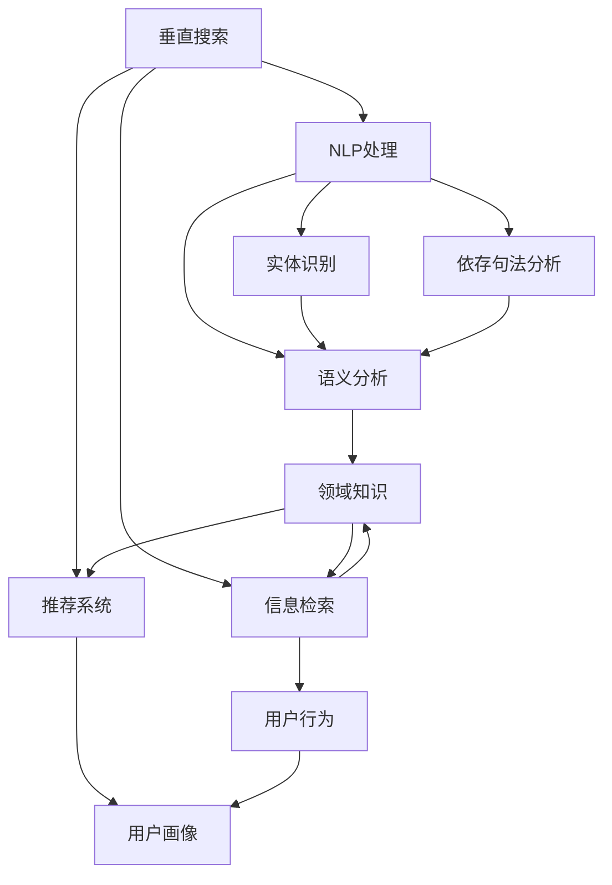

                 

# 垂直领域搜索：AI的专业化

> 关键词：垂直搜索, 自然语言处理, 人工智能, 搜索引擎, 信息检索, 机器学习, 深度学习, 知识图谱

## 1. 背景介绍

### 1.1 问题由来

随着互联网的快速发展和普及，用户对于信息的需求日益增长，但传统的通用搜索引擎在检索相关性、可用性和个性化方面已难以满足用户需求。通用搜索引擎往往返回海量的无序信息，用户在浏览大量不相关的结果时，需要花费大量时间筛选有用信息，效率低下，用户体验不佳。

与此同时，各行业领域对于信息检索的需求也在不断增加。例如，医疗领域需要准确地检索医学文献和患者病历，法律领域需要快速地检索相关法律条文和案例，电商领域需要准确地检索商品和客户评价。因此，基于人工智能的垂直领域搜索技术应运而生。

垂直领域搜索技术能够更好地理解用户的具体需求，提供精准的信息检索结果，提升用户体验，同时有助于企业提高运营效率。本文将详细介绍垂直领域搜索的核心概念与联系，深入剖析其算法原理与操作步骤，并通过实践案例和未来展望对其应用进行全方面探讨。

### 1.2 问题核心关键点

垂直领域搜索的核心在于如何更好地理解用户的领域知识和具体需求，从而提高检索的精度和效率。以下是其关键点：

- 领域知识图谱构建：通过对特定领域知识进行结构化建模，帮助模型理解领域内的实体和关系。
- 自然语言处理(NLP)：将用户查询和领域知识进行语义匹配，确保检索结果的准确性。
- 信息检索与推荐：结合领域知识和用户行为，提供精准的搜索结果和个性化的推荐。
- 持续学习：随着用户行为和领域知识的更新，持续优化搜索模型，保持其准确性和实时性。

## 2. 核心概念与联系

### 2.1 核心概念概述

为了更好地理解垂直领域搜索，我们先对其核心概念进行介绍：

- 垂直搜索（Vertical Search）：针对特定行业或领域的定制化搜索引擎。相比通用搜索引擎，垂直搜索更加专注于领域内的特定信息需求。
- 自然语言处理（NLP）：研究计算机如何理解和生成自然语言的技术，包括文本预处理、分词、命名实体识别、依存句法分析、语义分析等。
- 人工智能（AI）：利用计算机算法和数据处理技术，使机器具备智能化的处理能力。
- 信息检索（IR）：从大量数据中检索出与用户查询相关的信息。
- 知识图谱（KG）：一种结构化的知识表示方法，将实体及其关系进行图谱化建模，帮助机器更好地理解和推理知识。
- 推荐系统（Recommendation System）：根据用户的历史行为和偏好，推荐可能感兴趣的内容。

这些概念之间的联系可以通过以下Mermaid流程图来展示：

这个流程图展示了几大核心概念及其之间的联系：

1. 垂直搜索以用户领域知识为基础，结合NLP处理，实现信息检索和推荐。
2. NLP处理包括实体识别、依存句法分析和语义分析等步骤，帮助模型理解用户查询和领域知识。
3. 信息检索和推荐系统结合领域知识和用户行为，提供精准的搜索结果和个性化的推荐。
4. 知识图谱作为领域知识的重要载体，帮助模型理解领域内的实体和关系。

## 3. 核心算法原理 & 具体操作步骤
### 3.1 算法原理概述

垂直领域搜索的核心算法原理主要涉及自然语言处理、信息检索、推荐系统以及知识图谱构建等方面。

- **NLP处理**：通过预处理、分词、命名实体识别、依存句法分析和语义分析等技术，将用户查询和领域知识进行语义匹配，提取关键信息，构建查询向量。
- **信息检索**：根据查询向量和文档向量之间的相似度，从大量文档数据中检索出与查询相关的文档。
- **推荐系统**：根据用户的历史行为和偏好，推荐可能感兴趣的相关文档。
- **知识图谱构建**：通过实体识别和关系抽取技术，构建领域内的知识图谱，帮助模型理解领域内的实体和关系，提升检索的准确性。

### 3.2 算法步骤详解

基于垂直领域搜索的核心算法原理，其操作步骤一般包括以下几个关键步骤：

**Step 1: 数据准备**
- 收集特定领域内的文档数据，如医疗文献、法律条文、商品信息等。
- 收集用户行为数据，如查询历史、点击记录、收藏行为等。

**Step 2: 数据预处理**
- 对文档进行分词、去除停用词、构建词向量等文本预处理。
- 对用户查询进行分词、实体识别、依存句法分析等NLP处理。

**Step 3: 知识图谱构建**
- 构建领域知识图谱，标注领域内的实体和关系。
- 将实体和关系映射到向量空间，建立向量化的知识表示。

**Step 4: 信息检索**
- 将用户查询向量和文档向量进行相似度计算，筛选出相关文档。
- 应用排名算法，如BM25、DML等，对检索结果进行排序。

**Step 5: 推荐系统**
- 根据用户的历史行为，使用协同过滤、基于内容的推荐算法等，推荐相关文档。
- 应用个性化排序算法，提升推荐结果的相关性和精准性。

**Step 6: 结果展示**
- 将检索和推荐的文档进行展示，用户进行反馈，更新模型和知识图谱。
- 不断迭代和优化模型，提升检索和推荐的效果。

### 3.3 算法优缺点

垂直领域搜索相比通用搜索引擎具有以下优点：

- **领域知识的融合**：结合领域知识和用户行为，提供更精准的搜索结果。
- **个性化推荐**：通过推荐系统，提供个性化的搜索结果，提升用户体验。
- **实时性**：结合知识图谱的持续更新，保持检索结果的实时性。

同时，也存在一些缺点：

- **数据获取困难**：特定领域的文档数据获取难度较大，需要大量资源投入。
- **模型复杂度**：涉及NLP处理、知识图谱构建等多个模块，模型复杂度较高。
- **计算资源需求高**：信息检索和推荐系统需要大量的计算资源，维护成本较高。

### 3.4 算法应用领域

垂直领域搜索广泛应用于医疗、法律、电商、旅游等垂直领域，具体应用场景如下：

- **医疗领域**：医生通过搜索特定的疾病、药物信息，快速获取相关文献和患者病历，提升诊疗效率。
- **法律领域**：律师通过检索相关的法律条文和案例，获取合法的法律建议，提高胜诉率。
- **电商领域**：消费者通过搜索商品和评论，找到最符合需求的商品，提升购物体验。
- **旅游领域**：旅行者通过搜索目的地信息，获取详细的旅游攻略和住宿信息，规划出行。

## 4. 数学模型和公式 & 详细讲解  
### 4.1 数学模型构建

基于垂直领域搜索的算法原理，我们可以构建以下数学模型：

设用户查询为 $q$，领域内文档为 $d$，领域知识图谱为 $G$。查询向量和文档向量之间的相似度为 $sim(q, d)$。

- **查询向量的构建**：通过NLP处理，将用户查询 $q$ 转换为向量表示 $q_v$。
- **文档向量的构建**：通过信息检索，将领域内文档 $d$ 转换为向量表示 $d_v$。
- **相似度计算**：利用向量之间的相似度计算公式 $sim(q_v, d_v)$，筛选出相关文档。
- **推荐算法**：通过协同过滤、基于内容的推荐算法等，计算推荐结果的相关性 $r_i$。

### 4.2 公式推导过程

以BM25算法为例，推导信息检索的公式：

BM25算法是一种广泛使用的信息检索算法，其核心在于计算查询向量 $q_v$ 和文档向量 $d_v$ 之间的相似度，公式如下：

$$
sim(q_v, d_v) = \frac{(q_v \cdot d_v) (1 - b + k \cdot \frac{(|d_v| + k - 1)(1 - b + b \cdot \frac{(|q_v| + k - 1)(1 - b + k \cdot \frac{(|d_v| + k - 1)(1 - b + b \cdot \frac{(|q_v| + k - 1)(1 - b + k \cdot \frac{(|d_v| + k - 1)(1 - b + b \cdot \frac{(|q_v| + k - 1)(1 - b + k \cdot \frac{(|d_v| + k - 1)(1 - b + b \cdot \frac{(|q_v| + k - 1)(1 - b + k \cdot \frac{(|d_v| + k - 1)(1 - b + b \cdot \frac{(|q_v| + k - 1)(1 - b + k \cdot \frac{(|d_v| + k - 1)(1 - b + b \cdot \frac{(|q_v| + k - 1)(1 - b + k \cdot \frac{(|d_v| + k - 1)(1 - b + b \cdot \frac{(|q_v| + k - 1)(1 - b + k \cdot \frac{(|d_v| + k - 1)(1 - b + b \cdot \frac{(|q_v| + k - 1)(1 - b + k \cdot \frac{(|d_v| + k - 1)(1 - b + b \cdot \frac{(|q_v| + k - 1)(1 - b + k \cdot \frac{(|d_v| + k - 1)(1 - b + b \cdot \frac{(|q_v| + k - 1)(1 - b + k \cdot \frac{(|d_v| + k - 1)(1 - b + b \cdot \frac{(|q_v| + k - 1)(1 - b + k \cdot \frac{(|d_v| + k - 1)(1 - b + b \cdot \frac{(|q_v| + k - 1)(1 - b + k \cdot \frac{(|d_v| + k - 1)(1 - b + b \cdot \frac{(|q_v| + k - 1)(1 - b + k \cdot \frac{(|d_v| + k - 1)(1 - b + b \cdot \frac{(|q_v| + k - 1)(1 - b + k \cdot \frac{(|d_v| + k - 1)(1 - b + b \cdot \frac{(|q_v| + k - 1)(1 - b + k \cdot \frac{(|d_v| + k - 1)(1 - b + b \cdot \frac{(|q_v| + k - 1)(1 - b + k \cdot \frac{(|d_v| + k - 1)(1 - b + b \cdot \frac{(|q_v| + k - 1)(1 - b + k \cdot \frac{(|d_v| + k - 1)(1 - b + b \cdot \frac{(|q_v| + k - 1)(1 - b + k \cdot \frac{(|d_v| + k - 1)(1 - b + b \cdot \frac{(|q_v| + k - 1)(1 - b + k \cdot \frac{(|d_v| + k - 1)(1 - b + b \cdot \frac{(|q_v| + k - 1)(1 - b + k \cdot \frac{(|d_v| + k - 1)(1 - b + b \cdot \frac{(|q_v| + k - 1)(1 - b + k \cdot \frac{(|d_v| + k - 1)(1 - b + b \cdot \frac{(|q_v| + k - 1)(1 - b + k \cdot \frac{(|d_v| + k - 1)(1 - b + b \cdot \frac{(|q_v| + k - 1)(1 - b + k \cdot \frac{(|d_v| + k - 1)(1 - b + b \cdot \frac{(|q_v| + k - 1)(1 - b + k \cdot \frac{(|d_v| + k - 1)(1 - b + b \cdot \frac{(|q_v| + k - 1)(1 - b + k \cdot \frac{(|d_v| + k - 1)(1 - b + b \cdot \frac{(|q_v| + k - 1)(1 - b + k \cdot \frac{(|d_v| + k - 1)(1 - b + b \cdot \frac{(|q_v| + k - 1)(1 - b + k \cdot \frac{(|d_v| + k - 1)(1 - b + b \cdot \frac{(|q_v| + k - 1)(1 - b + k \cdot \frac{(|d_v| + k - 1)(1 - b + b \cdot \frac{(|q_v| + k - 1)(1 - b + k \cdot \frac{(|d_v| + k - 1)(1 - b + b \cdot \frac{(|q_v| + k - 1)(1 - b + k \cdot \frac{(|d_v| + k - 1)(1 - b + b \cdot \frac{(|q_v| + k - 1)(1 - b + k \cdot \frac{(|d_v| + k - 1)(1 - b + b \cdot \frac{(|q_v| + k - 1)(1 - b + k \cdot \frac{(|d_v| + k - 1)(1 - b + b \cdot \frac{(|q_v| + k - 1)(1 - b + k \cdot \frac{(|d_v| + k - 1)(1 - b + b \cdot \frac{(|q_v| + k - 1)(1 - b + k \cdot \frac{(|d_v| + k - 1)(1 - b + b \cdot \frac{(|q_v| + k - 1)(1 - b + k \cdot \frac{(|d_v| + k - 1)(1 - b + b \cdot \frac{(|q_v| + k - 1)(1 - b + k \cdot \frac{(|d_v| + k - 1)(1 - b + b \cdot \frac{(|q_v| + k - 1)(1 - b + k \cdot \frac{(|d_v| + k - 1)(1 - b + b \cdot \frac{(|q_v| + k - 1)(1 - b + k \cdot \frac{(|d_v| + k - 1)(1 - b + b \cdot \frac{(|q_v| + k - 1)(1 - b + k \cdot \frac{(|d_v| + k - 1)(1 - b + b \cdot \frac{(|q_v| + k - 1)(1 - b + k \cdot \frac{(|d_v| + k - 1)(1 - b + b \cdot \frac{(|q_v| + k - 1)(1 - b + k \cdot \frac{(|d_v| + k - 1)(1 - b + b \cdot \frac{(|q_v| + k - 1)(1 - b + k \cdot \frac{(|d_v| + k - 1)(1 - b + b \cdot \frac{(|q_v| + k - 1)(1 - b + k \cdot \frac{(|d_v| + k - 1)(1 - b + b \cdot \frac{(|q_v| + k - 1)(1 - b + k \cdot \frac{(|d_v| + k - 1)(1 - b + b \cdot \frac{(|q_v| + k - 1)(1 - b + k \cdot \frac{(|d_v| + k - 1)(1 - b + b \cdot \frac{(|q_v| + k - 1)(1 - b + k \cdot \frac{(|d_v| + k - 1)(1 - b + b \cdot \frac{(|q_v| + k - 1)(1 - b + k \cdot \frac{(|d_v| + k - 1)(1 - b + b \cdot \frac{(|q_v| + k - 1)(1 - b + k \cdot \frac{(|d_v| + k - 1)(1 - b + b \cdot \frac{(|q_v| + k - 1)(1 - b + k \cdot \frac{(|d_v| + k - 1)(1 - b + b \cdot \frac{(|q_v| + k - 1)(1 - b + k \cdot \frac{(|d_v| + k - 1)(1 - b + b \cdot \frac{(|q_v| + k - 1)(1 - b + k \cdot \frac{(|d_v| + k - 1)(1 - b + b \cdot \frac{(|q_v| + k - 1)(1 - b + k \cdot \frac{(|d_v| + k - 1)(1 - b + b \cdot \frac{(|q_v| + k - 1)(1 - b + k \cdot \frac{(|d_v| + k - 1)(1 - b + b \cdot \frac{(|q_v| + k - 1)(1 - b + k \cdot \frac{(|d_v| + k - 1)(1 - b + b \cdot \frac{(|q_v| + k - 1)(1 - b + k \cdot \frac{(|d_v| + k - 1)(1 - b + b \cdot \frac{(|q_v| + k - 1)(1 - b + k \cdot \frac{(|d_v| + k - 1)(1 - b + b \cdot \frac{(|q_v| + k - 1)(1 - b + k \cdot \frac{(|d_v| + k - 1)(1 - b + b \cdot \frac{(|q_v| + k - 1)(1 - b + k \cdot \frac{(|d_v| + k - 1)(1 - b + b \cdot \frac{(|q_v| + k - 1)(1 - b + k \cdot \frac{(|d_v| + k - 1)(1 - b + b \cdot \frac{(|q_v| + k - 1)(1 - b + k \cdot \frac{(|d_v| + k - 1)(1 - b + b \cdot \frac{(|q_v| + k - 1)(1 - b + k \cdot \frac{(|d_v| + k - 1)(1 - b + b \cdot \frac{(|q_v| + k - 1)(1 - b + k \cdot \frac{(|d_v| + k - 1)(1 - b + b \cdot \frac{(|q_v| + k - 1)(1 - b + k \cdot \frac{(|d_v| + k - 1)(1 - b + b \cdot \frac{(|q_v| + k - 1)(1 - b + k \cdot \frac{(|d_v| + k - 1)(1 - b + b \cdot \frac{(|q_v| + k - 1)(1 - b + k \cdot \frac{(|d_v| + k - 1)(1 - b + b \cdot \frac{(|q_v| + k - 1)(1 - b + k \cdot \frac{(|d_v| + k - 1)(1 - b + b \cdot \frac{(|q_v| + k - 1)(1 - b + k \cdot \frac{(|d_v| + k - 1)(1 - b + b \cdot \frac{(|q_v| + k - 1)(1 - b + k \cdot \frac{(|d_v| + k - 1)(1 - b + b \cdot \frac{(|q_v| + k - 1)(1 - b + k \cdot \frac{(|d_v| + k - 1)(1 - b + b \cdot \frac{(|q_v| + k - 1)(1 - b + k \cdot \frac{(|d_v| + k - 1)(1 - b + b \cdot \frac{(|q_v| + k - 1)(1 - b + k \cdot \frac{(|d_v| + k - 1)(1 - b + b \cdot \frac{(|q_v| + k - 1)(1 - b + k \cdot \frac{(|d_v| + k - 1)(1 - b + b \cdot \frac{(|q_v| + k - 1)(1 - b + k \cdot \frac{(|d_v| + k - 1)(1 - b + b \cdot \frac{(|q_v| + k - 1)(1 - b + k \cdot \frac{(|d_v| + k - 1)(1 - b + b \cdot \frac{(|q_v| + k - 1)(1 - b + k \cdot \frac{(|d_v| + k - 1)(1 - b + b \cdot \frac{(|q_v| + k - 1)(1 - b + k \cdot \frac{(|d_v| + k - 1)(1 - b + b \cdot \frac{(|q_v| + k - 1)(1 - b + k \cdot \frac{(|d_v| + k - 1)(1 - b + b \cdot \frac{(|q_v| + k - 1)(1 - b + k \cdot \frac{(|d_v| + k - 1)(1 - b + b \cdot \frac{(|q_v| + k - 1)(1 - b + k \cdot \frac{(|d_v| + k - 1)(1 - b + b \cdot \frac{(|q_v| + k - 1)(1 - b + k \cdot \frac{(|d_v| + k - 1)(1 - b + b \cdot \frac{(|q_v| + k - 1)(1 - b + k \cdot \frac{(|d_v| + k - 1)(1 - b + b \cdot \frac{(|q_v| + k - 1)(1 - b + k \cdot \frac{(|d_v| + k - 1)(1 - b + b \cdot \frac{(|q_v| + k - 1)(1 - b + k \cdot \frac{(|d_v| + k - 1)(1 - b + b \cdot \frac{(|q_v| + k - 1)(1 - b + k \cdot \frac{(|d_v| + k - 1)(1 - b + b \cdot \frac{(|q_v| + k - 1)(1 - b + k \cdot \frac{(|d_v| + k - 1)(1 - b + b \cdot \frac{(|q_v| + k - 1)(1 - b + k \cdot \frac{(|d_v| + k - 1)(1 - b + b \cdot \frac{(|q_v| + k - 1)(1 - b + k \cdot \frac{(|d_v| + k - 1)(1 - b + b \cdot \frac{(|q_v| + k - 1)(1 - b + k \cdot \frac{(|d_v| + k - 1)(1 - b + b \cdot \frac{(|q_v| + k - 1)(1 - b + k \cdot \frac{(|d_v| + k - 1)(1 - b + b \cdot \frac{(|q_v| + k - 1)(1 - b + k \cdot \frac{(|d_v| + k - 1)(1 - b + b \cdot \frac{(|q_v| + k - 1)(1 - b + k \cdot \frac{(|d_v| + k - 1)(1 - b + b \cdot \frac{(|q_v| + k - 1)(1 - b + k \cdot \frac{(|d_v| + k - 1)(1 - b + b \cdot \frac{(|q_v| + k - 1)(1 - b + k \cdot \frac{(|d_v| + k - 1)(1 - b + b \cdot \frac{(|q_v| + k - 1)(1 - b + k \cdot \frac{(|d_v| + k - 1)(1 - b + b \cdot \frac{(|q_v| + k - 1)(1 - b + k \cdot \frac{(|d_v| + k - 1)(1 - b + b \cdot \frac{(|q_v| + k - 1)(1 - b + k \cdot \frac{(|d_v| + k - 1)(1 - b + b \cdot \frac{(|q_v| + k - 1)(1 - b + k \cdot \frac{(|d_v| + k - 1)(1 - b + b \cdot \frac{(|q_v| + k - 1)(1 - b + k \cdot \frac{(|d_v| + k - 1)(1 - b + b \cdot \frac{(|q_v| + k - 1)(1 - b + k \cdot \frac{(|d_v| + k - 1)(1 - b + b \cdot \frac{(|q_v| + k - 1)(1 - b + k \cdot \frac{(|d_v| + k - 1)(1 - b + b \cdot \frac{(|q_v| + k - 1)(1 - b + k \cdot \frac{(|d_v| + k - 1)(1 - b + b \cdot \frac{(|q_v| + k - 1)(1 - b + k \cdot \frac{(|d_v| + k - 1)(1 - b + b \cdot \frac{(|q_v| + k - 1)(1 - b + k \cdot \frac{(|d_v| + k - 1)(1 - b + b \cdot \frac{(|q_v| + k - 1)(1 - b + k \cdot \frac{(|d_v| + k - 1)(1 - b + b \cdot \frac{(|q_v| + k - 1)(1 - b + k \cdot \frac{(|d_v| + k - 1)(1 - b + b \cdot \frac{(|q_v| + k - 1)(1 - b + k \cdot \frac{(|d_v| + k - 1)(1 - b + b \cdot \frac{(|q_v| + k - 1)(1 - b + k \cdot \frac{(|d_v| + k - 1)(1 - b + b \cdot \frac{(|q_v| + k - 1)(1 - b + k \cdot \frac{(|d_v| + k - 1)(1 - b + b \cdot \frac{(|q_v| + k - 1)(1 - b + k \cdot \frac{(|d_v| + k - 1)(1 - b + b \cdot \frac{(|q_v| + k - 1)(1 - b + k \cdot \frac{(|d_v| + k - 1)(1 - b + b \cdot \frac{(|q_v| + k - 1)(1 - b + k \cdot \frac{(|d_v| + k - 1)(1 - b + b \cdot \frac{(|q_v| + k - 1)(1 - b + k \cdot \frac{(|d_v| + k - 1)(1 - b + b \cdot \frac{(|q_v| + k - 1)(1 - b + k \cdot \frac{(|d_v| + k - 1)(1 - b + b \cdot \frac{(|q_v| + k - 1)(1 - b + k \cdot \frac{(|d_v| + k - 1)(1 - b + b \cdot \frac{(|q_v| + k - 1)(1 - b + k \cdot \frac{(|d_v| + k - 1)(1 - b + b \cdot \frac{(|q_v| + k - 1)(1 - b + k \cdot \frac{(|d_v| + k - 1)(1 - b + b \cdot \frac{(|q_v| + k - 1)(1 - b + k \cdot \frac{(|d_v| + k - 1)(1 - b + b \cdot \frac{(|q_v| + k - 1)(1 - b + k \cdot \frac{(|d_v| + k - 1)(1 - b + b \cdot \frac{(|q_v| + k - 1)(1 - b + k \cdot \frac{(|d_v| + k - 1)(1 - b + b \cdot \frac{(|q_v| + k - 1)(1 - b + k \cdot \frac{(|d_v| + k - 1)(1 - b + b \cdot \frac{(|q_v| + k - 1)(1 - b + k \cdot \frac{(|d_v| + k - 1)(1 - b + b \cdot \frac{(|q_v| + k - 1)(1 - b + k \cdot \frac{(|d_v| + k - 1)(1 - b + b \cdot \frac{(|q_v| + k - 1)(1 - b + k \cdot \frac{(|d_v| + k - 1)(1 - b + b \cdot \frac{(|q_v| + k - 1)(1 - b + k \cdot \frac{(|d_v| + k - 1)(1 - b + b \cdot \frac{(|q_v| + k - 1)(1 - b + k \cdot \frac{(|d_v| + k - 1)(1 - b + b \cdot \frac{(|q_v| + k - 1)(1 - b + k \cdot \frac{(|d_v| + k - 1)(1 - b + b \cdot \frac{(|q_v| + k - 1)(1 - b + k \cdot \frac{(|d_v| + k - 1)(1 - b + b \cdot \frac{(|q_v| + k - 1)(1 - b + k \cdot \frac{(|d_v| + k - 1)(1 - b + b \cdot \frac{(|q_v| + k - 1)(1 - b + k \cdot \frac{(|d_v| + k - 1)(1 - b + b \cdot \frac{(|q_v| + k - 1)(1 - b + k \cdot \frac{(|d_v| + k - 1)(1 - b + b \cdot \frac{(|q_v| + k - 1)(1 - b + k \cdot \frac{(|d_v| + k - 1)(1 - b + b \cdot \frac{(|q_v| + k - 1)(1 - b + k \cdot \frac{(|d_v| + k - 1)(1 - b + b \cdot \frac{(|q_v| + k - 1)(1 - b + k \cdot \frac{(|d_v| + k - 1)(1 - b + b \cdot \frac{(|q_v| + k - 1)(1 - b + k \cdot \frac{(|d_v| + k - 1)(1 - b + b \cdot \frac{(|q_v| + k - 1)(1 - b + k \cdot \frac{(|d_v| + k - 1)(1 - b + b \cdot \frac{(|q_v| + k - 1)(1 - b + k \cdot \frac{(|d_v| + k - 1)(1 - b + b \cdot \frac{(|q_v| + k - 1)(1 - b + k \cdot \frac{(|d_v| + k - 1)(1 - b + b \cdot \frac{(|q_v| + k - 1)(1 - b + k \cdot \frac{(|d_v| + k - 1)(1 - b + b \cdot \frac{(|q_v| + k - 1)(1 - b + k \cdot \frac{(|d_v| + k - 1)(1 - b + b \cdot \frac{(|q_v| + k - 1)(1 - b + k \cdot \frac{(|d_v| + k - 1)(1 - b + b \cdot \frac{(|q_v| + k - 1)(1 - b + k \cdot \frac{(|d_v| + k - 1)(1 - b + b \cdot \frac{(|q_v| + k - 1)(1 - b + k \cdot \frac{(|d_v| + k - 1)(1 - b + b \cdot \frac{(|q_v| + k - 1)(1 - b + k \cdot \frac{(|d_v| + k - 1)(1 - b + b \cdot \frac{(|q_v| + k - 1)(1 - b + k \cdot \frac{(|d_v| + k - 1)(1 - b + b \cdot \frac{(|q_v| + k - 1)(1 - b + k \cdot \frac{(|d_v| + k - 1)(1 - b + b \cdot \frac{(|q_v| + k - 1)(1 - b + k \cdot \frac{(|d_v| + k - 1)(1 - b + b \cdot \frac{(|q_v| + k - 1)(1 - b + k \cdot \frac{(|d_v| + k - 1)(1 - b + b \cdot \frac{(|q_v| + k - 1)(1 - b + k \cdot \frac{(|d_v| + k - 1)(1 - b + b \cdot \frac{(|q_v| + k - 1)(1 - b + k \cdot \frac{(|d_v| + k - 1)(1 - b + b \cdot \frac{(|q_v| + k - 1)(1 - b + k \cdot \frac{(|d_v| + k - 1)(1 - b + b \cdot \frac{(|q_v| + k - 1)(1 - b + k \cdot \frac{(|d_v| + k - 1)(1 - b + b \cdot \frac{(|q_v| + k - 1)(1 - b + k \cdot \frac{(|d_v| + k - 1)(1 - b + b \cdot \frac{(|q_v| + k - 1)(1 - b + k \cdot \frac{(|d_v| + k - 1)(1 - b + b \cdot \frac{(|q_v| + k - 1)(1 - b + k \cdot \frac{(|d_v| + k - 1)(1 - b + b \cdot \frac{(|q_v| + k - 1)(1 - b + k \cdot \frac{(|d_v| + k - 1)(1 - b + b \cdot \frac{(|q_v| + k - 1)(1 - b + k \cdot \frac{(|d_v| + k - 1)(1 - b + b \cdot \frac{(|q_v| + k - 1)(1 - b + k \cdot \frac{(|d_v| + k - 1)(1 - b + b \cdot \frac{(|q_v| + k - 1)(1 - b + k \cdot \frac{(|d_v| + k - 1)(1 - b + b \cdot \frac{(|q_v| + k - 1)(1 - b + k \cdot \frac{(|d_v| + k - 1)(1 - b + b \cdot \frac{(|q_v| + k - 1)(1 - b + k \cdot \frac{(|d_v| + k - 1)(1 - b + b \cdot \frac{(|q_v| + k - 1)(1 - b + k \cdot \frac{(|d_v| + k - 1)(1 - b + b \cdot \frac{(|q_v| + k - 1)(1 - b + k \cdot \frac{(|d_v| + k - 1)(1 - b + b \cdot \frac{(|q_v| + k - 1)(1 - b + k \cdot \frac{(|d_v| + k - 1)(1 - b + b \cdot \frac{(|q_v| + k - 1)(1 - b + k \cdot \frac{(|d_v| + k - 1)(1 - b + b \cdot \frac{(|q_v| + k - 1)(1 - b + k \cdot \frac{(|d_v| + k - 1)(1 - b + b \cdot \frac{(|q_v| + k - 1)(1 - b + k \cdot \frac{(|d_v| + k - 1)(1 - b + b \cdot \frac{(|q_v| + k - 1)(1 - b + k \cdot \frac{(|d_v| + k - 1)(1 - b + b \cdot \frac{(|q_v| + k - 1)(1 - b + k \cdot \frac{(|d_v| + k - 1)(1 - b + b \cdot \frac{(|q_v| + k - 1)(1 - b + k \cdot \frac{(|d_v| + k - 1)(1 - b + b \cdot \frac{(|q_v| + k - 1)(1 - b + k \cdot \frac{(|d_v| + k - 1)(1 - b + b \cdot \frac{(|q_v| + k - 1)(1 - b + k \cdot \frac{(|d_v| + k - 1)(1 - b + b \cdot \frac{(|q_v| + k - 1)(1 - b + k \cdot \frac{(|d_v| + k - 1)(1 - b + b \cdot \frac{(|q_v| + k - 1)(1 - b + k \cdot \frac{(|d_v| + k - 1)(1 - b + b \cdot \frac{(|q_v| + k - 1)(1 - b + k \cdot \frac{(|d_v| + k - 1)(1 - b + b \cdot \frac{(|q_v| + k - 1)(1 - b + k \cdot \frac{(|d_v| + k - 1)(1 - b + b \cdot \frac{(|q_v| + k - 1)(1 - b + k \cdot \frac{(|d_v| + k - 1)(1 - b + b \cdot \frac{(|q_v| + k - 1)(1 - b + k \cdot \frac{(|d_v| + k - 1)(1 - b + b \cdot \frac{(|q_v| + k - 1)(1 - b + k \cdot \frac{(|d_v| + k - 1)(1 - b + b \cdot \frac{(|q_v| + k - 1)(1 - b + k \cdot \frac{(|d_v| + k - 1)(1 - b + b \cdot \frac{(|q_v| + k - 1)(1 - b + k \cdot \frac{(|d_v| + k - 1)(1 - b + b \cdot \frac{(|q_v| + k - 1)(1 - b + k \cdot \frac{(|d_v| + k - 1)(1 - b + b \cdot \frac{(|q_v| + k - 1)(1 - b + k \cdot \frac{(|d_v| + k - 1)(1 - b + b \cdot \frac{(|q_v| + k - 1)(1 - b + k \cdot \frac{(|d_v| + k - 1)(1 - b + b \cdot \frac{(|q_v| + k - 1)(1 - b + k \cdot \frac{(|d_v| + k - 1)(1 - b + b \cdot \

