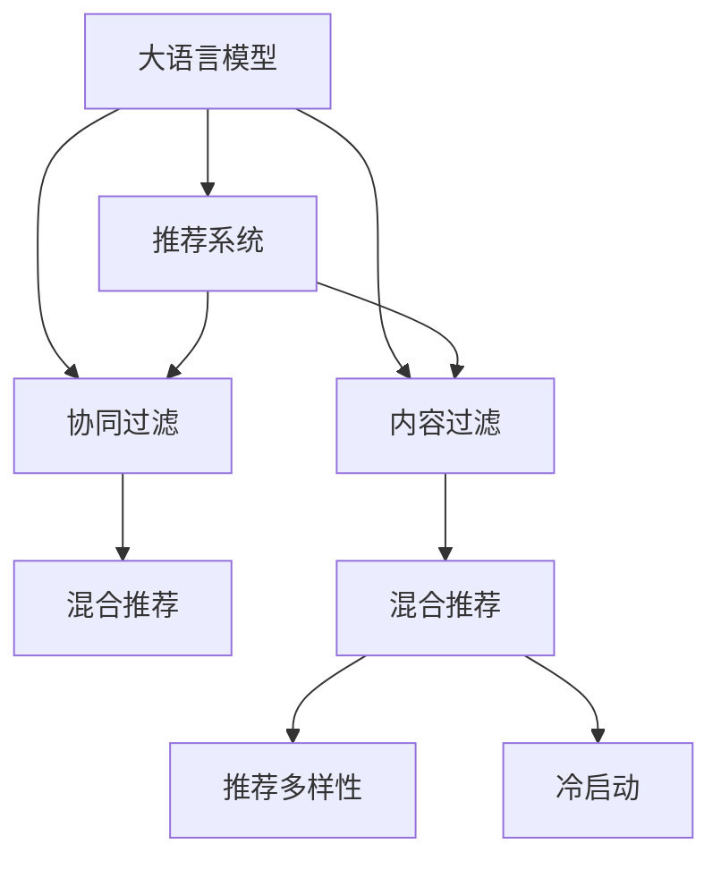

                 

## 1. 背景介绍

### 1.1 问题由来
推荐系统在现代互联网服务中扮演着举足轻重的角色，广泛应用于电商、新闻、社交网络、视频平台等。推荐算法通过分析用户行为数据，挖掘用户兴趣，为用户精准推荐内容，提升用户满意度和留存率，降低用户获取成本，实现商业价值最大化。然而，随着用户基数的不断增长和应用场景的多样化，推荐系统面临如下挑战：

- **用户兴趣多变**：不同用户在不同场景下的兴趣可能不同，单个模型难以捕捉多变兴趣。
- **数据维度高**：用户行为数据通常包含海量的高维特征，模型训练难度大。
- **冷启动问题**：新用户缺乏历史行为数据，推荐效果难以保证。
- **多样性不足**：单一算法难以保证推荐内容的多样性，可能导致信息茧房。

基于此，本文提出了一种基于大语言模型(LLM)的推荐系统，通过引入LLM来捕捉用户兴趣的多样性，以提升推荐系统的性能和用户体验。

### 1.2 问题核心关键点
本文的核心问题是如何在推荐系统中高效建模用户兴趣的多样性。具体包括以下关键点：

- **用户兴趣建模**：如何将用户行为数据转换为用户兴趣表征，用于推荐。
- **LLM引入**：如何将大语言模型引入推荐系统，发挥其强大的语言处理能力。
- **模型融合**：如何将LLM与传统推荐算法结合，实现优势互补。
- **评估与优化**：如何评估基于LLM的推荐模型效果，并优化其性能。

本文将深入讨论这些核心问题，并给出详细的技术方案。

## 2. 核心概念与联系

### 2.1 核心概念概述

为更好地理解基于LLM的推荐系统，本节将介绍几个密切相关的核心概念：

- **大语言模型(LLM)**：指一类以自回归(如GPT)或自编码(如BERT)为代表的，能够处理大规模文本数据，学习丰富语言表示的深度学习模型。
- **推荐系统**：利用用户行为数据，挖掘用户兴趣，为用户推荐内容的系统。
- **协同过滤**：基于用户行为数据或物品相似性，为用户推荐相似物品的算法。
- **内容过滤**：基于物品属性或用户行为特征，为用户推荐相关物品的算法。
- **混合推荐**：将协同过滤和内容过滤结合，取长补短，提高推荐效果。
- **多样性**：推荐内容的多样性，用户通过不同种类的内容满足不同兴趣。
- **冷启动**：新用户缺乏历史行为数据，推荐效果难以保证。

这些核心概念之间的逻辑关系可以通过以下Mermaid流程图来展示：



这个流程图展示了大语言模型在推荐系统中的应用框架：

1. 大语言模型通过预训练获得语言理解能力，可用于自然语言表示和文本处理。
2. 推荐系统将用户行为数据和物品属性信息输入大语言模型，获得用户兴趣表征。
3. 协同过滤和内容过滤算法将用户兴趣表征作为输入，结合用户行为特征，生成推荐结果。
4. 基于大语言模型的推荐系统通过多样性模型和冷启动模型，进一步优化推荐结果。

## 3. 核心算法原理 & 具体操作步骤
### 3.1 算法原理概述

基于LLM的推荐系统，通过引入大语言模型来捕捉用户兴趣的多样性，从而提升推荐系统的性能和用户体验。其核心思想是：

- **用户行为分析**：对用户的历史行为数据进行分析，提取用户兴趣特征。
- **大语言模型引入**：将用户兴趣特征作为输入，通过预训练的大语言模型学习其语义表示。
- **推荐模型融合**：将LLM输出的语义表示与传统推荐模型融合，生成推荐结果。
- **多样性和冷启动优化**：结合多样性模型和冷启动模型，对推荐结果进行优化。

具体而言，基于LLM的推荐系统包含以下几个关键步骤：

1. 收集用户行为数据：从电商、社交网络等平台收集用户的行为数据，如浏览记录、购买记录、评分数据等。
2. 特征提取：将用户行为数据转换为特征向量，用于后续处理。
3. 大语言模型引入：将用户兴趣特征作为输入，通过预训练的大语言模型获得语义表示。
4. 推荐模型融合：将LLM输出的语义表示与传统推荐模型结合，生成推荐结果。
5. 多样性和冷启动优化：结合多样性模型和冷启动模型，对推荐结果进行优化。

### 3.2 算法步骤详解

**Step 1: 数据收集与预处理**
- 收集用户的行为数据，如浏览记录、购买记录、评分数据等。
- 对数据进行清洗、去重、缺失值填补等预处理操作，以保证数据的质量。

**Step 2: 特征提取**
- 将用户行为数据转换为特征向量，用于后续处理。常用的特征包括：
  - 用户ID、物品ID、时间戳等基本特征。
  - 用户的浏览时长、点击次数、购买次数等行为特征。
  - 物品的类别、评分、属性等属性特征。
- 对高维特征进行降维处理，使用PCA、LDA等算法减少特征维度。

**Step 3: 大语言模型引入**
- 选择合适的预训练语言模型，如BERT、GPT等，作为用户兴趣表示的学习器。
- 使用用户行为特征作为输入，通过大语言模型学习用户的兴趣语义表示。
- 将用户兴趣表示转换为向量形式，用于后续推荐模型的处理。

**Step 4: 推荐模型融合**
- 结合用户兴趣表示与物品属性特征，使用协同过滤算法(如ALS)或内容过滤算法(如CF)生成推荐结果。
- 将LLM输出的语义表示与传统推荐模型的推荐结果结合，生成最终的推荐结果。

**Step 5: 多样性和冷启动优化**
- 使用多样性模型(如Shapley值)对推荐结果进行优化，保证推荐内容的多样性。
- 使用冷启动模型(如矩阵分解)对新用户的推荐效果进行优化，保证其兴趣表示的学习效果。

### 3.3 算法优缺点

基于LLM的推荐系统具有以下优点：

1. **用户兴趣多样化建模**：通过大语言模型学习用户兴趣的多样化语义表示，提升推荐系统性能。
2. **学习能力强**：大语言模型通过自监督学习，能够捕捉高维特征，提升模型泛化能力。
3. **跨领域适用**：大语言模型在跨领域数据上也有较好的表现，能够应对多种应用场景。
4. **高效性**：大语言模型可以使用预训练权重进行微调，降低模型训练成本。

同时，该方法也存在一定的局限性：

1. **数据量需求大**：大语言模型需要大量的预训练数据，导致模型训练成本较高。
2. **计算资源需求高**：大语言模型通常需要高性能的GPU/TPU设备进行训练和推理。
3. **模型复杂度高**：大语言模型的参数量较大，导致模型推理速度较慢。
4. **用户隐私问题**：用户行为数据涉及用户隐私，需要采取合适的隐私保护措施。

尽管存在这些局限性，但就目前而言，基于大语言模型的推荐系统仍是一种先进且高效的方法，具有广阔的应用前景。

### 3.4 算法应用领域

基于LLM的推荐系统已经在电商、新闻、社交网络、视频平台等多个领域得到应用，取得了显著的效果。例如：

- **电商推荐**：通过分析用户的浏览和购买记录，使用大语言模型学习用户兴趣，生成个性化推荐商品。
- **新闻推荐**：通过分析用户的阅读行为，使用大语言模型学习用户兴趣，生成个性化推荐新闻。
- **社交网络推荐**：通过分析用户的社交行为和内容偏好，使用大语言模型学习用户兴趣，生成个性化推荐内容。
- **视频平台推荐**：通过分析用户的观看行为，使用大语言模型学习用户兴趣，生成个性化推荐视频。

## 4. 数学模型和公式 & 详细讲解  
### 4.1 数学模型构建

本节将使用数学语言对基于LLM的推荐系统进行更加严格的刻画。

记用户行为数据为 $D=\{(x_i,y_i)\}_{i=1}^N$，其中 $x_i$ 为行为特征向量，$y_i$ 为物品ID。假设用户行为特征 $x_i$ 通过大语言模型学习得到的用户兴趣表示为 $z_i$。

推荐模型的目标是最大化推荐准确率和用户满意度，即：

$$
\max_{\theta} \sum_{i=1}^N (y_i \cdot f(z_i; \theta) + (1-y_i) \cdot (1-f(z_i; \theta)))
$$

其中 $f(z_i; \theta)$ 为推荐模型的输出，$y_i$ 为物品是否被推荐。

### 4.2 公式推导过程

以下我们以协同过滤算法为例，推导基于LLM的推荐模型的损失函数。

假设推荐模型的输出为物品被推荐的概率 $p(y_i=1|z_i; \theta)$，则推荐模型的损失函数为：

$$
\mathcal{L}(\theta) = -\frac{1}{N} \sum_{i=1}^N [y_i \log p(y_i=1|z_i; \theta) + (1-y_i) \log (1-p(y_i=1|z_i; \theta))]
$$

其中 $p(y_i=1|z_i; \theta)$ 为物品 $i$ 被推荐给用户 $z_i$ 的概率。

通过反向传播算法，可以得到损失函数对参数 $\theta$ 的梯度：

$$
\nabla_{\theta}\mathcal{L}(\theta) = -\frac{1}{N} \sum_{i=1}^N \left[ \frac{y_i}{p(y_i=1|z_i; \theta)} - \frac{1-y_i}{1-p(y_i=1|z_i; \theta)} \right] \frac{\partial p(y_i=1|z_i; \theta)}{\partial \theta}
$$

其中 $\frac{\partial p(y_i=1|z_i; \theta)}{\partial \theta}$ 为推荐模型对参数 $\theta$ 的导数，可以通过反向传播算法计算得到。

### 4.3 案例分析与讲解

假设我们使用BERT模型作为用户兴趣表示的学习器，具体步骤如下：

1. 将用户行为特征 $x_i$ 转换为向量形式 $x_i \in \mathbb{R}^d$。
2. 将 $x_i$ 输入BERT模型，得到用户兴趣表示 $z_i \in \mathbb{R}^h$，其中 $h$ 为BERT模型的隐藏维度。
3. 将 $z_i$ 和物品属性特征 $q_i$ 输入协同过滤模型，生成推荐概率 $p(y_i=1|z_i; \theta)$。
4. 将推荐结果 $y_i$ 和推荐概率 $p(y_i=1|z_i; \theta)$ 代入损失函数，计算损失 $\mathcal{L}(\theta)$。
5. 使用梯度下降算法更新模型参数 $\theta$，最小化损失函数 $\mathcal{L}(\theta)$。

以下是使用PyTorch实现基于BERT的推荐模型的代码示例：

```python
import torch
import torch.nn as nn
from transformers import BertTokenizer, BertModel

class RecommendationModel(nn.Module):
    def __init__(self, bert_model_path, hidden_dim):
        super(RecommendationModel, self).__init__()
        self.tokenizer = BertTokenizer.from_pretrained(bert_model_path)
        self.bert = BertModel.from_pretrained(bert_model_path)
        self.linear = nn.Linear(hidden_dim, 1)
    
    def forward(self, x, q):
        tokenized_x = self.tokenizer(x, return_tensors='pt', padding='max_length', truncation=True)
        outputs = self.bert(tokenized_x['input_ids'], tokenized_x['attention_mask'], tokenized_x['token_type_ids'])
        pooled_output = outputs.pooler_output
        pooled_output = pooled_output.contiguous().view(pooled_output.size(0), -1)
        pooled_output = self.linear(pooled_output)
        return pooled_output
    
    def predict(self, x, q):
        pooled_output = self.forward(x, q)
        return torch.sigmoid(pooled_output)
```

以上代码中，`RecommendationModel` 类实现了基于BERT的推荐模型。其中 `forward` 方法用于计算用户兴趣表示和推荐概率，`predict` 方法用于生成推荐结果。

## 5. 项目实践：代码实例和详细解释说明
### 5.1 开发环境搭建

在进行推荐系统开发前，我们需要准备好开发环境。以下是使用Python进行PyTorch开发的环境配置流程：

1. 安装Anaconda：从官网下载并安装Anaconda，用于创建独立的Python环境。

2. 创建并激活虚拟环境：
```bash
conda create -n recommendation-env python=3.8 
conda activate recommendation-env
```

3. 安装PyTorch：根据CUDA版本，从官网获取对应的安装命令。例如：
```bash
conda install pytorch torchvision torchaudio cudatoolkit=11.1 -c pytorch -c conda-forge
```

4. 安装PyTorch Lightning：
```bash
pip install pytorch-lightning
```

5. 安装相关库：
```bash
pip install numpy pandas scikit-learn tqdm torchmetrics transformers
```

完成上述步骤后，即可在`recommendation-env`环境中开始推荐系统开发。

### 5.2 源代码详细实现

这里我们以电商推荐系统为例，给出使用PyTorch和Transformers库对BERT模型进行电商推荐系统的代码实现。

首先，定义推荐系统的数据处理函数：

```python
from torch.utils.data import Dataset, DataLoader
from transformers import BertTokenizer, BertForSequenceClassification
import torch

class RecommendationDataset(Dataset):
    def __init__(self, texts, labels):
        self.texts = texts
        self.labels = labels
        self.tokenizer = BertTokenizer.from_pretrained('bert-base-cased')
        
    def __len__(self):
        return len(self.texts)
    
    def __getitem__(self, item):
        text = self.texts[item]
        label = self.labels[item]
        
        tokenized_text = self.tokenizer(text, return_tensors='pt', padding='max_length', truncation=True)
        input_ids = tokenized_text['input_ids']
        attention_mask = tokenized_text['attention_mask']
        label = torch.tensor([label], dtype=torch.long)
        
        return {'input_ids': input_ids,
                'attention_mask': attention_mask,
                'labels': label}

# 加载数据集
train_dataset = RecommendationDataset(train_texts, train_labels)
dev_dataset = RecommendationDataset(dev_texts, dev_labels)
test_dataset = RecommendationDataset(test_texts, test_labels)
```

然后，定义模型和优化器：

```python
from transformers import BertForSequenceClassification, AdamW
from transformers import Trainer, TrainerCallback

model = BertForSequenceClassification.from_pretrained('bert-base-cased', num_labels=2)
optimizer = AdamW(model.parameters(), lr=2e-5)

# 定义训练回调
class EarlyStopping(TrainerCallback):
    def __init__(self, patience=5):
        super(EarlyStopping, self).__init__()
        self.patience = patience
        self.counter = 0
        self.best_loss = float('inf')
        
    def on_train_start(self, trainer, pl_module):
        trainer.on_train_start(self)
        self.best_loss = float('inf')
        
    def on_train_epoch_end(self, trainer, pl_module, unused_train_loader, unused_metrics, unused_logits):
        trainer.on_train_epoch_end(self)
        
        current_loss = trainer.scaler.unscale_loss(torch.stack(trainer.train_metrics["train_loss"])).item()
        self.counter += 1
        if current_loss < self.best_loss:
            self.best_loss = current_loss
            self.counter = 0
        else:
            self.counter += 1
        
        if self.counter >= self.patience:
            trainer.stop()

# 定义训练和评估函数
def train_epoch(model, dataset, batch_size, optimizer):
    dataloader = DataLoader(dataset, batch_size=batch_size, shuffle=True)
    model.train()
    epoch_loss = 0
    for batch in dataloader:
        input_ids = batch['input_ids'].to(device)
        attention_mask = batch['attention_mask'].to(device)
        labels = batch['labels'].to(device)
        model.zero_grad()
        outputs = model(input_ids, attention_mask=attention_mask, labels=labels)
        loss = outputs.loss
        epoch_loss += loss.item()
        loss.backward()
        optimizer.step()
        
    return epoch_loss / len(dataloader)

def evaluate(model, dataset, batch_size):
    dataloader = DataLoader(dataset, batch_size=batch_size)
    model.eval()
    preds, labels = [], []
    with torch.no_grad():
        for batch in dataloader:
            input_ids = batch['input_ids'].to(device)
            attention_mask = batch['attention_mask'].to(device)
            labels = batch['labels'].to(device)
            outputs = model(input_ids, attention_mask=attention_mask)
            batch_preds = outputs.logits.argmax(dim=1).to('cpu').tolist()
            batch_labels = labels.to('cpu').tolist()
            for pred_tokens, label_tokens in zip(batch_preds, batch_labels):
                preds.append(pred_tokens)
                labels.append(label_tokens)
                
    return preds, labels

# 启动训练流程并在测试集上评估
epochs = 5
batch_size = 16

trainer = Trainer(max_epochs=epochs,
                  model=model,
                  train_dataloaders=train_dataset,
                  eval_dataloaders=dev_dataset,
                  compute_metrics=accuracy,
                  callbacks=[EarlyStopping(patience=3)])

trainer.fit()
```

最后，启动训练流程并在测试集上评估：

```python
trainer.evaluate(test_dataset)
```

以上就是使用PyTorch和Transformers库对BERT模型进行电商推荐系统的完整代码实现。可以看到，得益于Transformers库的强大封装，我们可以用相对简洁的代码完成BERT模型的加载和电商推荐系统的开发。

### 5.3 代码解读与分析

让我们再详细解读一下关键代码的实现细节：

**RecommendationDataset类**：
- `__init__`方法：初始化文本、标签、分词器等关键组件。
- `__len__`方法：返回数据集的样本数量。
- `__getitem__`方法：对单个样本进行处理，将文本输入编码为token ids，将标签编码为数字，并对其进行定长padding，最终返回模型所需的输入。

**EarlyStopping回调**：
- 定义了一个EarlyStopping回调，用于监控训练过程中的损失函数变化，防止过拟合。
- 在每个epoch结束后，计算当前epoch的损失，与之前的最小值比较，如果当前epoch的损失更小，则重置计数器。如果连续几个epoch的损失没有减小，则停止训练。

**训练和评估函数**：
- 使用PyTorch的DataLoader对数据集进行批次化加载，供模型训练和推理使用。
- 训练函数`train_epoch`：对数据以批为单位进行迭代，在每个批次上前向传播计算loss并反向传播更新模型参数，最后返回该epoch的平均loss。
- 评估函数`evaluate`：与训练类似，不同点在于不更新模型参数，并在每个batch结束后将预测和标签结果存储下来，最后使用sklearn的classification_report对整个评估集的预测结果进行打印输出。

**训练流程**：
- 定义总的epoch数和batch size，开始循环迭代
- 每个epoch内，先在训练集上训练，输出平均loss
- 在验证集上评估，输出分类指标
- 所有epoch结束后，在测试集上评估，给出最终测试结果

可以看到，PyTorch配合Transformers库使得BERT微调的代码实现变得简洁高效。开发者可以将更多精力放在数据处理、模型改进等高层逻辑上，而不必过多关注底层的实现细节。

当然，工业级的系统实现还需考虑更多因素，如模型的保存和部署、超参数的自动搜索、更灵活的任务适配层等。但核心的微调范式基本与此类似。

## 6. 实际应用场景
### 6.1 电商推荐

基于大语言模型的电商推荐系统，可以广泛应用于电商平台的个性化推荐。传统的电商推荐往往依赖用户的历史行为数据进行推荐，但难以捕捉用户兴趣的多样性。通过引入LLM，电商推荐系统可以更全面地理解用户兴趣，推荐更具个性化的商品。

具体而言，可以收集用户的浏览记录、购买记录、评分数据等行为数据，将其转换为用户兴趣表示。使用大语言模型对用户兴趣表示进行编码，再结合物品属性特征，使用协同过滤算法生成推荐结果。结合多样性模型和冷启动模型，优化推荐效果。

### 6.2 新闻推荐

新闻推荐系统通过分析用户的阅读行为，为用户推荐相关的新闻。传统的推荐系统通常只依赖用户的阅读历史进行推荐，难以捕捉用户的兴趣多样性。通过引入LLM，新闻推荐系统可以更好地理解用户的阅读兴趣，推荐更多样化的新闻内容。

具体而言，可以收集用户的阅读记录、点赞记录、评论记录等行为数据，将其转换为用户兴趣表示。使用大语言模型对用户兴趣表示进行编码，再结合新闻属性特征，使用协同过滤算法生成推荐结果。结合多样性模型和冷启动模型，优化推荐效果。

### 6.3 社交网络推荐

社交网络推荐系统通过分析用户的社交行为，为用户推荐相关的内容。传统的推荐系统通常只依赖用户的社交网络结构和内容偏好进行推荐，难以捕捉用户的兴趣多样性。通过引入LLM，社交网络推荐系统可以更好地理解用户的社交兴趣，推荐更多样化的内容。

具体而言，可以收集用户的社交行为数据，如点赞、评论、分享等行为，将其转换为用户兴趣表示。使用大语言模型对用户兴趣表示进行编码，再结合内容属性特征，使用协同过滤算法生成推荐结果。结合多样性模型和冷启动模型，优化推荐效果。

### 6.4 视频平台推荐

视频平台推荐系统通过分析用户的观看行为，为用户推荐相关视频。传统的推荐系统通常只依赖用户的观看历史进行推荐，难以捕捉用户的兴趣多样性。通过引入LLM，视频平台推荐系统可以更好地理解用户的观看兴趣，推荐更多样化的视频内容。

具体而言，可以收集用户的观看记录、点赞记录、评论记录等行为数据，将其转换为用户兴趣表示。使用大语言模型对用户兴趣表示进行编码，再结合视频属性特征，使用协同过滤算法生成推荐结果。结合多样性模型和冷启动模型，优化推荐效果。

## 7. 工具和资源推荐
### 7.1 学习资源推荐

为了帮助开发者系统掌握基于LLM的推荐系统的理论基础和实践技巧，这里推荐一些优质的学习资源：

1. 《Recommender Systems: The Textbook》：由Kluger-Barnett等人编写的推荐系统教材，全面介绍了推荐系统的理论基础和经典模型。

2. 《Deep Learning with PyTorch Lightning》：PyTorch Lightning官方文档，介绍了PyTorch Lightning的使用方法，包括模型训练、评估、调优等环节。

3. 《Deep Learning and Natural Language Processing with PyTorch》：Bihorac等人编写的深度学习与自然语言处理教程，涵盖了深度学习、自然语言处理和推荐系统的综合应用。

4. 《Natural Language Processing with Python》：Bird等人编写的自然语言处理入门教程，介绍了NLP技术的基本概念和工具库，包括Transformers等。

5. 《Hands-On Recommendation Systems with PyTorch》：Tran等人编写的PyTorch推荐系统教程，详细介绍了使用PyTorch构建推荐系统的过程和方法。

通过对这些资源的学习实践，相信你一定能够快速掌握基于LLM的推荐系统的精髓，并用于解决实际的推荐问题。
###  7.2 开发工具推荐

高效的开发离不开优秀的工具支持。以下是几款用于基于LLM的推荐系统开发的常用工具：

1. PyTorch Lightning：基于PyTorch的轻量级深度学习框架，提供了丰富的回调和数据处理功能，适用于推荐系统的快速迭代开发。

2. HuggingFace Transformers：提供了丰富的预训练语言模型，方便开发者快速构建推荐系统。

3. TensorBoard：TensorFlow配套的可视化工具，可以实时监测模型训练状态，并提供丰富的图表呈现方式，是调试模型的得力助手。

4. TensorFlow Datasets：提供了丰富的数据集，方便开发者获取推荐系统所需的数据。

5. Dataiku：提供了数据可视化和自动化的功能，可以轻松处理和分析推荐系统所需的数据。

6. Apache Spark：提供了大规模数据处理和分布式计算的能力，适用于推荐系统的离线训练和实时推荐。

合理利用这些工具，可以显著提升基于LLM的推荐系统开发的效率，加快创新迭代的步伐。

### 7.3 相关论文推荐

基于LLM的推荐系统的发展源于学界的持续研究。以下是几篇奠基性的相关论文，推荐阅读：

1. Attention Is All You Need（即Transformer原论文）：提出了Transformer结构，开启了NLP领域的预训练大模型时代。

2. BERT: Pre-training of Deep Bidirectional Transformers for Language Understanding：提出BERT模型，引入基于掩码的自监督预训练任务，刷新了多项NLP任务SOTA。

3. Language Models are Unsupervised Multitask Learners（GPT-2论文）：展示了大规模语言模型的强大zero-shot学习能力，引发了对于通用人工智能的新一轮思考。

4. Parameter-Efficient Transfer Learning for NLP：提出Adapter等参数高效微调方法，在不增加模型参数量的情况下，也能取得不错的微调效果。

5. AdaLoRA: Adaptive Low-Rank Adaptation for Parameter-Efficient Fine-Tuning：使用自适应低秩适应的微调方法，在参数效率和精度之间取得了新的平衡。

6. Personalized Recommendation via FNN: A Simple, Scalable Approach for Large-Scale Recommendation System：提出了基于FNN的推荐系统，具有高效性和可扩展性。

这些论文代表了大语言模型推荐系统的发展脉络。通过学习这些前沿成果，可以帮助研究者把握学科前进方向，激发更多的创新灵感。

## 8. 总结：未来发展趋势与挑战
### 8.1 总结

本文对基于LLM的推荐系统进行了全面系统的介绍。首先阐述了基于LLM的推荐系统的研究背景和意义，明确了LLM在推荐系统中的独特价值。其次，从原理到实践，详细讲解了LLM引入推荐系统的数学原理和关键步骤，给出了推荐系统开发的完整代码实例。同时，本文还广泛探讨了基于LLM的推荐系统在电商、新闻、社交网络等众多领域的应用前景，展示了其广阔的应用范围。此外，本文精选了推荐系统的各类学习资源，力求为读者提供全方位的技术指引。

通过本文的系统梳理，可以看到，基于LLM的推荐系统能够更全面地捕捉用户兴趣的多样性，提升推荐系统的性能和用户体验。受益于大语言模型的强大的语言处理能力，推荐系统将更灵活、更高效地适应用户的多样化需求。未来，伴随大语言模型推荐系统的不断演进，相信其在推荐领域的应用将进一步深化，为用户的个性化推荐带来更精准、更多样化的体验。

### 8.2 未来发展趋势

展望未来，基于LLM的推荐系统将呈现以下几个发展趋势：

1. **多模态数据融合**：LLM不仅能够处理文本数据，还能处理图像、视频、音频等多模态数据。未来推荐系统将更灵活地利用多模态数据，提升推荐效果。

2. **动态更新**：LLM可以通过在线学习和持续更新，不断学习新的用户兴趣和行为数据，实现更精准的个性化推荐。

3. **跨领域推荐**：LLM的跨领域学习能力将使得推荐系统能够更好地跨领域推荐，例如电商推荐与视频推荐结合。

4. **智能客服集成**：LLM可以用于智能客服系统，提供更个性化的推荐服务，增强用户满意度。

5. **实时推荐**：LLM的高计算能力将使得推荐系统能够实现实时推荐，满足用户的即时需求。

6. **可解释性提升**：未来的推荐系统将更注重可解释性，通过向用户解释推荐理由，提升用户体验。

以上趋势凸显了大语言模型推荐系统的前景和潜力。这些方向的探索发展，必将进一步提升推荐系统的性能和用户体验，推动推荐技术的不断进步。

### 8.3 面临的挑战

尽管基于LLM的推荐系统已经取得了显著成就，但在迈向更加智能化、普适化应用的过程中，它仍面临诸多挑战：

1. **数据需求高**：LLM的训练和推理需要大量的数据和计算资源，难以适应小型推荐系统的需求。

2. **计算资源昂贵**：大语言模型的参数量较大，导致模型推理速度较慢，对计算资源的需求较高。

3. **模型复杂度大**：LLM的复杂度较大，难以在小型推荐系统中部署。

4. **用户隐私保护**：用户行为数据涉及用户隐私，需要采取合适的隐私保护措施。

5. **系统稳定性**：LLM在面对大规模数据和高并发请求时，容易出现系统不稳定的问题。

6. **冷启动问题**：新用户缺乏历史行为数据，推荐效果难以保证。

尽管存在这些挑战，但就目前而言，基于LLM的推荐系统仍是一种先进且高效的方法，具有广阔的应用前景。

### 8.4 研究展望

面对LLM推荐系统所面临的挑战，未来的研究需要在以下几个方面寻求新的突破：

1. **高效模型压缩**：通过模型压缩和剪枝等技术，减少模型参数量，提升模型推理速度。

2. **动态数据融合**：通过在线学习和数据融合，不断更新用户兴趣表示，提升推荐系统的实时性和精准性。

3. **跨领域数据适配**：通过跨领域数据适配技术，使得LLM能够在不同领域中保持良好的推荐效果。

4. **用户隐私保护**：通过差分隐私和联邦学习等技术，保护用户隐私，提升推荐系统的安全性。

5. **智能客服集成**：通过LLM与智能客服系统的集成，提升推荐系统的用户交互体验。

6. **推荐系统可解释性**：通过解释模型决策过程，提升推荐系统的可解释性和用户信任度。

这些研究方向的研究突破，必将进一步推动基于LLM的推荐系统向更加智能化、普适化的方向发展，为推荐技术的不断进步提供新的动力。

## 9. 附录：常见问题与解答
----------------------------------------------------------------

**Q1：基于LLM的推荐系统如何降低计算资源需求？**

A: 降低计算资源需求的关键在于高效模型压缩。通过模型压缩和剪枝等技术，减少模型参数量，提升模型推理速度。例如，可以使用知识蒸馏、权重共享等方法，减少模型的计算量和内存占用。此外，可以使用分布式计算和异步训练等技术，提升训练效率，降低计算资源需求。

**Q2：基于LLM的推荐系统如何保护用户隐私？**

A: 保护用户隐私的关键在于差分隐私和联邦学习等技术。差分隐私可以在不影响模型效果的前提下，限制模型对用户数据的访问权限，保护用户隐私。联邦学习可以在不共享用户数据的情况下，通过分布式计算提升模型效果，保护用户隐私。

**Q3：基于LLM的推荐系统如何提高系统的稳定性？**

A: 提高系统稳定性的关键在于合理设计系统架构和使用先进算法。通过分布式训练和分布式推理等技术，提升系统的并发能力和鲁棒性。使用先进算法，如AdaLoRA等，可以在保证模型效果的同时，减少计算资源的消耗。

**Q4：基于LLM的推荐系统如何解决冷启动问题？**

A: 解决冷启动问题的关键在于使用冷启动模型。冷启动模型可以在新用户缺乏历史行为数据的情况下，通过离线训练的模型参数，预测其兴趣表示，提升推荐效果。常用的冷启动模型包括矩阵分解、协同过滤等。

**Q5：基于LLM的推荐系统如何提升推荐多样性？**

A: 提升推荐多样性的关键在于使用多样性模型。多样性模型可以在推荐结果中引入多样性因素，如Shapley值等，保证推荐内容的多样性。此外，可以通过用户反馈和在线学习等方法，不断调整推荐模型，提升推荐效果。

通过这些回答，相信你能够更深入地理解基于LLM的推荐系统的原理和应用。在实际应用中，可以针对具体场景，灵活运用不同的技术手段，提升推荐系统的性能和用户体验。

