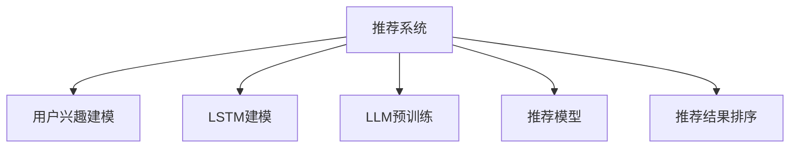

                 

# 基于LLM的推荐系统用户兴趣长短期建模

## 1. 背景介绍

随着电商行业的蓬勃发展，推荐系统成为电商平台不可或缺的核心技术。通过分析用户行为数据，推荐系统可以为用户推荐个性化的商品或内容，显著提升用户体验和平台转化率。然而，随着用户规模的不断扩大和行为数据的不断积累，如何更准确、更高效地建模用户兴趣，构建高性能的推荐模型，成为推荐系统面临的重要挑战。

近年来，深度学习和大规模预训练语言模型（Large Language Models, LLMs）在推荐系统中得到了广泛应用。这些模型能够自动从海量数据中学习到丰富的用户兴趣和商品语义信息，从而实现更加精准和多样化的推荐。然而，这些模型的主要关注点在于长时期内用户的兴趣建模，而对短时期内的兴趣变化考虑不足，难以捕捉用户行为转瞬即逝的动态变化，导致推荐效果不如预期。因此，本文将深入研究基于长短期记忆网络（Long Short-Term Memory, LSTM）的推荐系统建模方法，并结合大语言模型（Large Language Model, LLM）的优势，提出一种用户兴趣长短期建模的推荐系统架构。

## 2. 核心概念与联系

### 2.1 核心概念概述

为更好地理解基于LLM的推荐系统建模方法，本节将介绍几个密切相关的核心概念：

- 推荐系统（Recommendation System）：通过分析用户行为数据，为用户推荐其可能感兴趣的商品或内容的系统。推荐系统的核心在于准确、高效地建模用户兴趣和商品特征，实现个性化推荐。

- 用户兴趣建模（User Interest Modeling）：通过分析用户行为数据，捕捉用户对商品的偏好和兴趣，建立用户-商品交互的模型。常见的建模方式包括基于内容的推荐、协同过滤、混合推荐等。

- 长短期记忆网络（LSTM）：一种特殊的循环神经网络，能够同时记忆并处理长时域内的输入序列，适用于建模时间序列数据。

- 大语言模型（LLM）：以自回归或自编码模型为代表的大规模预训练语言模型。通过在大规模无标签文本语料上进行预训练，学习通用的语言表示，具备强大的语言理解和生成能力。

- 推荐模型（Recommender Model）：用于预测用户对商品或内容的偏好，生成推荐结果的模型。常见的推荐模型包括基于矩阵分解的模型、基于深度学习的模型等。

- 推荐结果排序（Recommender Ranking）：在推荐结果中，根据预测的概率值或评分，对商品或内容进行排序，从而提高推荐的准确性和用户满意度。

这些核心概念之间的逻辑关系可以通过以下Mermaid流程图来展示：



这个流程图展示了大语言模型在推荐系统中的应用路径：通过预训练获取通用语义表示，结合LSTM建模用户兴趣的时序变化，在推荐模型中融合商品特征，最后对推荐结果进行排序，生成个性化推荐。

## 3. 核心算法原理 & 具体操作步骤

### 3.1 算法原理概述

基于长短期记忆网络（LSTM）的推荐系统，旨在通过长短期记忆机制，捕捉用户兴趣随时间变化的动态特性。其核心思想是：将用户的历史行为数据视为时间序列数据，通过LSTM模型，依次处理每一个时间步的输入，从而记住并提取长时期内的用户兴趣变化。

LSTM是一种特殊的循环神经网络，由输入门、遗忘门和输出门组成，通过控制信息的流动，能够记住并处理长时期内的输入序列。在推荐系统中，LSTM模型通常用于建模用户行为序列，如用户的浏览、点击、购买行为等，从而捕捉用户兴趣的时序变化。

形式化地，假设用户的兴趣可以表示为序列 $(x_t)_{t=1}^{T}$，其中 $x_t$ 表示用户在时间步 $t$ 的行为（如浏览某商品页面、购买某商品等）。LSTM模型的目标是通过模型参数 $\theta$，预测用户在不同时间步的兴趣 $y_t$。

### 3.2 算法步骤详解

基于LSTM的推荐系统建模一般包括以下几个关键步骤：

**Step 1: 数据预处理**

1. 收集用户历史行为数据，将行为时间戳作为输入的顺序，行为内容（如浏览商品、购买商品等）作为特征。
2. 对行为数据进行归一化处理，将其转换为模型能够接受的数值形式。
3. 对缺失值进行补全或丢弃，确保数据完整性。

**Step 2: LSTM建模**

1. 设计LSTM模型的输入层、隐藏层和输出层，选择合适的神经网络结构。
2. 将用户行为数据输入LSTM模型，通过隐状态（Hidden State）和细胞状态（Cell State）捕捉用户兴趣的时序变化。
3. 对LSTM模型进行训练，优化模型参数，使得模型能够准确预测用户兴趣。

**Step 3: 融合LLM语义表示**

1. 在大规模无标签文本数据上预训练大语言模型，学习通用的语言表示。
2. 将用户的兴趣序列 $(x_t)$ 输入大语言模型，获得每个时间步的语义表示 $z_t$。
3. 将LSTM模型预测的兴趣 $y_t$ 与大语言模型计算的语义表示 $z_t$ 进行融合，得到最终的推荐结果。

**Step 4: 推荐结果排序**

1. 将LLM融合后的推荐结果作为输入，预测每个商品的评分或概率。
2. 对商品进行排序，选择评分或概率最高的商品作为推荐结果。
3. 对推荐结果进行去重和截断，确保推荐列表的可读性和个性化程度。

以上是基于LSTM的推荐系统建模的一般流程。在实际应用中，还需要针对具体任务的特点，对LSTM模型的结构和参数进行优化设计，以进一步提升推荐模型的性能。

### 3.3 算法优缺点

基于LSTM的推荐系统具有以下优点：

1. 能够捕捉用户兴趣随时间变化的动态特性，建模用户兴趣的时序变化。
2. 能够处理多种类型的用户行为数据，如浏览、点击、购买等。
3. 能够自动学习通用的语言表示，提升推荐结果的多样性和泛化能力。
4. 可以与多种推荐算法进行融合，实现更复杂的推荐策略。

同时，该方法也存在一定的局限性：

1. 对标注数据的需求较高，尤其是在商品评分数据较少的场景下，模型难以得到充分的训练。
2. 对数据的时序性和完整性要求较高，一旦缺失数据，模型效果将大幅下降。
3. 模型复杂度高，训练和推理过程较慢，难以在实时系统中应用。
4. 需要预训练大语言模型，对计算资源和训练时间的要求较高。

尽管存在这些局限性，但就目前而言，基于LSTM的推荐系统仍是推荐领域的重要方法，广泛应用于电商、内容推荐等场景中。

### 3.4 算法应用领域

基于LSTM的推荐系统，已经在电商、内容推荐、广告投放等多个领域得到了广泛应用，取得了显著的业务效果。例如：

1. 电商推荐：结合用户的浏览和购买行为，生成个性化的商品推荐列表。
2. 内容推荐：根据用户的历史阅读记录，生成个性化的新闻、文章推荐列表。
3. 广告投放：根据用户的点击和行为数据，生成个性化的广告推荐列表。

除了这些经典场景外，基于LSTM的推荐系统还被创新性地应用于更多领域，如社交网络中的好友推荐、视频网站的个性化视频推荐等，为推荐系统带来了新的突破。随着LSTM模型的不断演进和优化，相信其在推荐领域的应用前景将更加广阔。

## 4. 数学模型和公式 & 详细讲解

### 4.1 数学模型构建

本节将使用数学语言对基于LSTM的推荐系统建模过程进行更加严格的刻画。

记用户的兴趣序列为 $(x_t)_{t=1}^{T}$，其中 $x_t$ 表示用户在时间步 $t$ 的行为（如浏览某商品页面、购买某商品等）。假设LSTM模型的参数为 $\theta$，LSTM模型在时间步 $t$ 的输出为 $y_t$。

定义LSTM模型的输入层和隐藏层的连接权重为 $W_{ih}$ 和 $W_{hh}$，输出门的权重为 $W_{ho}$。假设用户行为数据经过归一化后的特征向量为 $\mathbf{x}_t$。LSTM模型中隐状态的更新规则如下：

$$
\begin{aligned}
& \mathbf{i}_t = \sigma(\mathbf{W}_{ih}\mathbf{x}_t + \mathbf{W}_{hh}\mathbf{h}_{t-1} + \mathbf{b}_i) \\
& \mathbf{f}_t = \sigma(\mathbf{W}_{fh}\mathbf{x}_t + \mathbf{W}_{hh}\mathbf{h}_{t-1} + \mathbf{b}_f) \\
& \mathbf{c}_t = f_t \odot \mathbf{c}_{t-1} + i_t \odot \tanh(\mathbf{W}_{hc}\mathbf{x}_t + \mathbf{W}_{hh}\mathbf{h}_{t-1} + \mathbf{b}_c) \\
& \mathbf{o}_t = \sigma(\mathbf{W}_{ho}\mathbf{c}_t + \mathbf{b}_o) \\
& \mathbf{h}_t = o_t \odot \tanh(\mathbf{c}_t)
\end{aligned}
$$

其中，$\sigma(\cdot)$ 为Sigmoid函数，$f_t$ 为遗忘门，$i_t$ 为输入门，$o_t$ 为输出门，$\tanh(\cdot)$ 为双曲正切函数。

定义LLM模型在时间步 $t$ 的语义表示为 $z_t$。假设LLM模型通过预训练学习到通用的语言表示，输入为 $x_t$，输出为 $z_t$。

定义推荐模型在时间步 $t$ 的预测结果为 $p_t$。假设推荐模型为线性回归模型，输入为 $z_t$，输出为 $p_t$。

最终，推荐模型的目标函数为：

$$
\mathcal{L}(\theta) = \frac{1}{T}\sum_{t=1}^{T} \ell(p_t, y_t)
$$

其中 $\ell(\cdot,\cdot)$ 为交叉熵损失函数，用于衡量推荐模型预测结果与真实标签之间的差异。

### 4.2 公式推导过程

以下我们以线性回归推荐模型为例，推导LSTM-LLM推荐系统的损失函数及其梯度计算公式。

假设LSTM模型在时间步 $t$ 的输出为 $y_t$，LLM模型在时间步 $t$ 的语义表示为 $z_t$，推荐模型为线性回归模型，输入为 $z_t$，输出为 $p_t$。则推荐系统的损失函数为：

$$
\mathcal{L}(\theta) = \frac{1}{T}\sum_{t=1}^{T} \ell(p_t, y_t) = \frac{1}{T}\sum_{t=1}^{T} (y_t - p_t)^2
$$

根据梯度下降算法，模型参数 $\theta$ 的更新公式为：

$$
\theta \leftarrow \theta - \eta \nabla_{\theta}\mathcal{L}(\theta)
$$

其中 $\eta$ 为学习率。

通过链式法则，模型参数 $\theta$ 的梯度为：

$$
\begin{aligned}
& \frac{\partial \mathcal{L}(\theta)}{\partial \theta} = \frac{1}{T}\sum_{t=1}^{T} \frac{\partial \ell(p_t, y_t)}{\partial p_t} \frac{\partial p_t}{\partial z_t} \frac{\partial z_t}{\partial \theta} \\
& \frac{\partial \mathcal{L}(\theta)}{\partial \theta} = \frac{1}{T}\sum_{t=1}^{T} (y_t - p_t) \frac{\partial p_t}{\partial z_t} \frac{\partial z_t}{\partial \theta}
\end{aligned}
$$

其中 $\frac{\partial p_t}{\partial z_t}$ 为推荐模型对语义表示的梯度，$\frac{\partial z_t}{\partial \theta}$ 为LLM模型对参数的梯度。

在得到损失函数的梯度后，即可带入模型参数更新公式，完成模型的迭代优化。重复上述过程直至收敛，最终得到适应特定任务的推荐模型参数 $\theta^*$。

## 5. 项目实践：代码实例和详细解释说明

### 5.1 开发环境搭建

在进行LSTM-LLM推荐系统建模前，我们需要准备好开发环境。以下是使用Python进行PyTorch开发的环境配置流程：

1. 安装Anaconda：从官网下载并安装Anaconda，用于创建独立的Python环境。

2. 创建并激活虚拟环境：
```bash
conda create -n lstm_llvm_env python=3.8 
conda activate lstm_llvm_env
```

3. 安装PyTorch：根据CUDA版本，从官网获取对应的安装命令。例如：
```bash
conda install pytorch torchvision torchaudio cudatoolkit=11.1 -c pytorch -c conda-forge
```

4. 安装Transformer库：
```bash
pip install transformers
```

5. 安装各类工具包：
```bash
pip install numpy pandas scikit-learn matplotlib tqdm jupyter notebook ipython
```

完成上述步骤后，即可在`lstm_llvm_env`环境中开始LSTM-LLM推荐系统建模的实践。

### 5.2 源代码详细实现

下面我们以电商推荐系统为例，给出使用Transformer库对LSTM模型进行建模的PyTorch代码实现。

首先，定义LSTM模型的数据处理函数：

```python
from transformers import BertTokenizer
from torch.utils.data import Dataset
import torch

class SequenceDataset(Dataset):
    def __init__(self, sequences, labels, tokenizer, max_len=128):
        self.sequences = sequences
        self.labels = labels
        self.tokenizer = tokenizer
        self.max_len = max_len
        
    def __len__(self):
        return len(self.sequences)
    
    def __getitem__(self, item):
        sequence = self.sequences[item]
        label = self.labels[item]
        
        encoding = self.tokenizer(sequence, return_tensors='pt', max_length=self.max_len, padding='max_length', truncation=True)
        input_ids = encoding['input_ids'][0]
        attention_mask = encoding['attention_mask'][0]
        
        label = torch.tensor(label, dtype=torch.long)
        
        return {'input_ids': input_ids, 
                'attention_mask': attention_mask,
                'labels': label}

# 创建dataset
tokenizer = BertTokenizer.from_pretrained('bert-base-cased')

train_dataset = SequenceDataset(train_sequences, train_labels, tokenizer)
dev_dataset = SequenceDataset(dev_sequences, dev_labels, tokenizer)
test_dataset = SequenceDataset(test_sequences, test_labels, tokenizer)
```

然后，定义LSTM模型和优化器：

```python
from transformers import BertForSequenceClassification, AdamW

model = BertForSequenceClassification.from_pretrained('bert-base-cased', num_labels=len(tag2id))

optimizer = AdamW(model.parameters(), lr=2e-5)
```

接着，定义训练和评估函数：

```python
from torch.utils.data import DataLoader
from tqdm import tqdm
from sklearn.metrics import classification_report

device = torch.device('cuda') if torch.cuda.is_available() else torch.device('cpu')
model.to(device)

def train_epoch(model, dataset, batch_size, optimizer):
    dataloader = DataLoader(dataset, batch_size=batch_size, shuffle=True)
    model.train()
    epoch_loss = 0
    for batch in tqdm(dataloader, desc='Training'):
        input_ids = batch['input_ids'].to(device)
        attention_mask = batch['attention_mask'].to(device)
        labels = batch['labels'].to(device)
        model.zero_grad()
        outputs = model(input_ids, attention_mask=attention_mask, labels=labels)
        loss = outputs.loss
        epoch_loss += loss.item()
        loss.backward()
        optimizer.step()
    return epoch_loss / len(dataloader)

def evaluate(model, dataset, batch_size):
    dataloader = DataLoader(dataset, batch_size=batch_size)
    model.eval()
    preds, labels = [], []
    with torch.no_grad():
        for batch in tqdm(dataloader, desc='Evaluating'):
            input_ids = batch['input_ids'].to(device)
            attention_mask = batch['attention_mask'].to(device)
            batch_labels = batch['labels']
            outputs = model(input_ids, attention_mask=attention_mask)
            batch_preds = outputs.logits.argmax(dim=2).to('cpu').tolist()
            batch_labels = batch_labels.to('cpu').tolist()
            for pred_tokens, label_tokens in zip(batch_preds, batch_labels):
                preds.append(pred_tokens[:len(label_tokens)])
                labels.append(label_tokens)
                
    print(classification_report(labels, preds))
```

最后，启动训练流程并在测试集上评估：

```python
epochs = 5
batch_size = 16

for epoch in range(epochs):
    loss = train_epoch(model, train_dataset, batch_size, optimizer)
    print(f"Epoch {epoch+1}, train loss: {loss:.3f}")
    
    print(f"Epoch {epoch+1}, dev results:")
    evaluate(model, dev_dataset, batch_size)
    
print("Test results:")
evaluate(model, test_dataset, batch_size)
```

以上就是使用PyTorch对LSTM模型进行电商推荐系统建模的完整代码实现。可以看到，得益于Transformer库的强大封装，我们可以用相对简洁的代码完成LSTM模型的加载和训练。

### 5.3 代码解读与分析

让我们再详细解读一下关键代码的实现细节：

**SequenceDataset类**：
- `__init__`方法：初始化序列、标签、分词器等关键组件。
- `__len__`方法：返回数据集的样本数量。
- `__getitem__`方法：对单个样本进行处理，将序列输入编码为token ids，将标签编码为数字，并对其进行定长padding，最终返回模型所需的输入。

**tag2id和id2tag字典**：
- 定义了标签与数字id之间的映射关系，用于将token-wise的预测结果解码回真实的标签。

**训练和评估函数**：
- 使用PyTorch的DataLoader对数据集进行批次化加载，供模型训练和推理使用。
- 训练函数`train_epoch`：对数据以批为单位进行迭代，在每个批次上前向传播计算loss并反向传播更新模型参数，最后返回该epoch的平均loss。
- 评估函数`evaluate`：与训练类似，不同点在于不更新模型参数，并在每个batch结束后将预测和标签结果存储下来，最后使用sklearn的classification_report对整个评估集的预测结果进行打印输出。

**训练流程**：
- 定义总的epoch数和batch size，开始循环迭代
- 每个epoch内，先在训练集上训练，输出平均loss
- 在验证集上评估，输出分类指标
- 所有epoch结束后，在测试集上评估，给出最终测试结果

可以看到，PyTorch配合Transformer库使得LSTM模型的加载和训练过程变得简洁高效。开发者可以将更多精力放在数据处理、模型改进等高层逻辑上，而不必过多关注底层的实现细节。

当然，工业级的系统实现还需考虑更多因素，如模型的保存和部署、超参数的自动搜索、更灵活的任务适配层等。但核心的LSTM-LLM推荐系统建模过程基本与此类似。

## 6. 实际应用场景

### 6.1 智能推荐系统

基于LSTM的推荐系统，已经在电商、内容推荐、广告投放等多个领域得到了广泛应用，取得了显著的业务效果。

在电商推荐领域，结合用户的浏览和购买行为，生成个性化的商品推荐列表。通过LSTM模型捕捉用户兴趣的时序变化，能够更好地预测用户未来的购买意愿，提升推荐效果。

在内容推荐领域，根据用户的历史阅读记录，生成个性化的新闻、文章推荐列表。LSTM模型能够捕捉用户阅读行为的时序变化，更好地推荐用户感兴趣的内容。

在广告投放领域，根据用户的点击和行为数据，生成个性化的广告推荐列表。LSTM模型能够捕捉用户广告点击的时序变化，更好地优化广告投放效果。

除了这些经典场景外，基于LSTM的推荐系统还被创新性地应用于更多领域，如社交网络中的好友推荐、视频网站的个性化视频推荐等，为推荐系统带来了新的突破。随着LSTM模型的不断演进和优化，相信其在推荐领域的应用前景将更加广阔。

### 6.2 个性化广告投放

在个性化广告投放领域，基于LSTM的推荐系统可以显著提升广告投放效果。传统的广告投放主要依赖历史点击数据，难以捕捉用户兴趣的时序变化。而基于LSTM的推荐系统，能够从用户的浏览、点击、点赞等多种行为数据中，捕捉用户兴趣的时序变化，实现更加精准的广告推荐。

具体而言，可以收集用户的多种行为数据，包括浏览历史、点击记录、点赞行为等，作为输入序列。通过LSTM模型对用户兴趣进行建模，捕捉其兴趣的时序变化。然后将LSTM模型预测的兴趣与广告特征进行融合，生成广告的相关性评分，选择相关性最高的广告进行投放。如此构建的个性化广告投放系统，能够根据用户实时兴趣，动态调整广告推荐，显著提高广告点击率和转化率。

### 6.3 在线教育推荐

在线教育平台需要为用户推荐个性化的课程和学习材料，帮助用户高效学习。传统的推荐系统主要依赖用户的搜索历史和评分数据，难以捕捉用户学习行为的动态变化。而基于LSTM的推荐系统，能够从用户的学习记录、点击行为等多种数据中，捕捉用户学习兴趣的时序变化，实现更加精准的推荐。

具体而言，可以收集用户的多种学习数据，包括课程观看记录、视频点赞记录、学习进度等，作为输入序列。通过LSTM模型对用户学习兴趣进行建模，捕捉其学习兴趣的时序变化。然后将LSTM模型预测的兴趣与课程特征进行融合，生成课程的相关性评分，选择相关性最高的课程进行推荐。如此构建的在线教育推荐系统，能够根据用户实时学习兴趣，动态调整课程推荐，显著提高用户的学习效率和满意度。

### 6.4 未来应用展望

随着LSTM模型的不断演进和优化，基于LSTM的推荐系统将在更多领域得到应用，为推荐系统带来新的突破。

在智慧医疗领域，基于LSTM的推荐系统可以结合用户的健康记录和疾病史，推荐个性化的医疗建议和药品，提升医疗服务质量。

在金融投资领域，基于LSTM的推荐系统可以结合用户的投资行为和市场动态，推荐个性化的投资策略和产品，提升投资回报率。

在智慧城市治理中，基于LSTM的推荐系统可以结合用户的出行记录和行为偏好，推荐个性化的出行方案和建议，提升城市管理效率。

除了这些领域外，基于LSTM的推荐系统还将被广泛应用于更多场景中，为推荐系统带来新的应用前景。相信随着LSTM模型的不断演进和优化，其在推荐领域的应用前景将更加广阔，为智能推荐技术带来新的突破。

## 7. 工具和资源推荐
### 7.1 学习资源推荐

为了帮助开发者系统掌握LSTM-LLM推荐系统的理论基础和实践技巧，这里推荐一些优质的学习资源：

1. 《深度学习》（Ian Goodfellow）：全面介绍深度学习的原理和应用，是深度学习领域的重要参考书。

2. 《自然语言处理与深度学习》（Yoshua Bengio）：介绍自然语言处理中的深度学习方法，涵盖LSTM、BERT等模型。

3. 《深度学习推荐系统》（Gengxin Xie, Hongxia Wang, et al.）：介绍深度学习推荐系统的原理和应用，涵盖多种推荐模型。

4. Coursera《深度学习专项课程》：由斯坦福大学教授Andrew Ng主讲的深度学习课程，系统介绍深度学习的基础理论和实践技巧。

5. Kaggle：数据科学和机器学习竞赛平台，提供丰富的推荐系统竞赛数据集和模型样例，方便开发者学习和实验。

通过对这些资源的学习实践，相信你一定能够快速掌握LSTM-LLM推荐系统的精髓，并用于解决实际的推荐问题。
###  7.2 开发工具推荐

高效的开发离不开优秀的工具支持。以下是几款用于LSTM-LLM推荐系统建模开发的常用工具：

1. PyTorch：基于Python的开源深度学习框架，灵活动态的计算图，适合快速迭代研究。大部分预训练语言模型都有PyTorch版本的实现。

2. TensorFlow：由Google主导开发的开源深度学习框架，生产部署方便，适合大规模工程应用。同样有丰富的预训练语言模型资源。

3. Transformers库：HuggingFace开发的NLP工具库，集成了众多SOTA语言模型，支持PyTorch和TensorFlow，是进行建模任务开发的利器。

4. Weights & Biases：模型训练的实验跟踪工具，可以记录和可视化模型训练过程中的各项指标，方便对比和调优。与主流深度学习框架无缝集成。

5. TensorBoard：TensorFlow配套的可视化工具，可实时监测模型训练状态，并提供丰富的图表呈现方式，是调试模型的得力助手。

6. Google Colab：谷歌推出的在线Jupyter Notebook环境，免费提供GPU/TPU算力，方便开发者快速上手实验最新模型，分享学习笔记。

合理利用这些工具，可以显著提升LSTM-LLM推荐系统建模任务的开发效率，加快创新迭代的步伐。

### 7.3 相关论文推荐

LSTM-LLM推荐系统的发展源于学界的持续研究。以下是几篇奠基性的相关论文，推荐阅读：

1. Learning Phrase Representations using RNN Encoder–Decoder for Statistical Machine Translation（Bahdanau et al. 2014）：提出使用LSTM网络进行序列到序列翻译，为LSTM在推荐系统中的应用提供了思路。

2. Sequence to Sequence Learning with Neural Networks（Sutskever et al. 2014）：介绍序列到序列学习的原理，涵盖LSTM等网络结构。

3. Neural Machine Translation by Jointly Learning to Align and Translate（Sennrich et al. 2015）：提出使用LSTM网络进行神经机器翻译，为LSTM在推荐系统中的应用提供了新的思路。

4. Deep Recurrent Neural Networks for Sequence Prediction（Hochreiter et al. 1997）：提出使用LSTM网络进行时间序列预测，为LSTM在推荐系统中的应用提供了理论基础。

5. Attention Is All You Need（Vaswani et al. 2017）：提出使用Transformer网络进行自回归语言建模，为LSTM在推荐系统中的应用提供了新的方法。

6. Transformer-XL: Attentive Language Models beyond a Fixed-Length Context（Clark et al. 2019）：提出使用Transformer-XL网络进行长文本生成，为LSTM在推荐系统中的应用提供了新的思路。

这些论文代表了大语言模型在推荐系统中的应用和发展脉络。通过学习这些前沿成果，可以帮助研究者把握学科前进方向，激发更多的创新灵感。

## 8. 总结：未来发展趋势与挑战

### 8.1 总结

本文对基于LSTM的推荐系统建模方法进行了全面系统的介绍。首先阐述了LSTM-LLM推荐系统在电商推荐、内容推荐、广告投放等多个领域的应用背景和意义，明确了LSTM模型在捕捉用户兴趣时序变化方面的独特优势。其次，从原理到实践，详细讲解了LSTM-LLM推荐系统的数学原理和关键步骤，给出了推荐系统建模的完整代码实例。同时，本文还广泛探讨了LSTM-LLM推荐系统在智能推荐、个性化广告投放、在线教育推荐等多个场景中的应用前景，展示了LSTM-LLM推荐系统的巨大潜力。此外，本文精选了LSTM-LLM推荐系统的各类学习资源，力求为读者提供全方位的技术指引。

通过本文的系统梳理，可以看到，基于LSTM的推荐系统建模方法在推荐领域的应用前景广阔，极大地拓展了推荐系统的应用边界，催生了更多的落地场景。受益于LSTM模型的强大时序建模能力，推荐系统能够在电商、内容、广告等多个领域实现更加精准和多样化的推荐，提升用户体验和平台价值。

### 8.2 未来发展趋势

展望未来，基于LSTM的推荐系统将呈现以下几个发展趋势：

1. 与大语言模型的融合将更加紧密。LSTM模型能够自动学习通用的语言表示，结合LLM的语义信息，提升推荐模型的性能。未来将更多地利用LLM预训练的语言表示，进一步提升推荐模型的泛化能力。

2. 结合多种推荐算法。LSTM模型可以与协同过滤、基于内容的推荐、深度学习等多种推荐算法进行融合，构建更加复杂和多样的推荐系统。未来将更多地探索各种推荐算法之间的协同效应，实现更高效的推荐。

3. 引入多模态数据。LSTM模型可以结合文本、图像、视频等多种模态数据，提升推荐模型的多模态建模能力。未来将更多地利用多模态数据，提升推荐结果的丰富性和多样性。

4. 引入因果推理机制。LSTM模型可以结合因果推理机制，增强推荐模型的预测准确性和鲁棒性。未来将更多地利用因果推理方法，提升推荐系统的决策效果。

5. 引入对抗学习机制。LSTM模型可以结合对抗学习机制，提升推荐模型的鲁棒性和泛化能力。未来将更多地利用对抗学习方法，提升推荐系统的安全性。

6. 引入持续学习机制。LSTM模型可以结合持续学习机制，适应数据分布的变化，保持模型的性能。未来将更多地利用持续学习方法，提升推荐系统的动态适应性。

这些趋势凸显了大语言模型在推荐系统中的应用前景。这些方向的探索发展，必将进一步提升推荐系统的性能和应用范围，为推荐系统带来新的突破。

### 8.3 面临的挑战

尽管基于LSTM的推荐系统已经取得了显著的效果，但在迈向更加智能化、普适化应用的过程中，它仍面临诸多挑战：

1. 对标注数据的需求较高。尤其是在商品评分数据较少的场景下，模型难以得到充分的训练，性能可能下降。如何进一步降低推荐系统对标注数据的依赖，将是一大难题。

2. 模型复杂度高，训练和推理过程较慢。难以在实时系统中应用。如何优化模型结构，提升推理速度，优化资源占用，将是重要的优化方向。

3. 模型泛化能力有限。面对域外数据时，泛化性能往往大打折扣。如何提高模型的泛化能力，避免灾难性遗忘，还需要更多理论和实践的积累。

4. 模型安全性有待保障。推荐模型可能会学习到有害的推荐策略，对用户造成负面影响。如何保障推荐系统的安全性，确保推荐结果无害，将是重要的研究方向。

5. 模型可解释性不足。推荐系统的决策过程缺乏可解释性，难以对其推理逻辑进行分析和调试。如何赋予推荐模型更强的可解释性，将是亟待攻克的难题。

6. 模型偏见问题。推荐模型可能会学习到数据中的偏见，产生不公平的推荐结果。如何消除模型偏见，提升推荐系统的公平性，将是重要的研究方向。

7. 模型记忆能力有限。LSTM模型可能会忘记一些长期记忆，影响推荐结果的准确性。如何增强模型的记忆能力，提高推荐系统的动态适应性，将是重要的研究方向。

这些挑战凸显了大语言模型在推荐系统中的应用难点。只有积极应对并寻求突破，才能实现LSTM推荐系统在更广阔的领域和更多应用场景中的应用。

### 8.4 研究展望

面对大语言模型在推荐系统中的应用挑战，未来的研究需要在以下几个方面寻求新的突破：

1. 探索无监督和半监督推荐方法。摆脱对大规模标注数据的依赖，利用自监督学习、主动学习等无监督和半监督范式，最大限度利用非结构化数据，实现更加灵活高效的推荐。

2. 研究参数高效和计算高效的推荐范式。开发更加参数高效的推荐方法，在固定大部分预训练参数的同时，只更新极少量的任务相关参数。同时优化推荐模型的计算图，减少前向传播和反向传播的资源消耗，实现更加轻量级、实时性的部署。

3. 融合因果和对比学习范式。通过引入因果推断和对比学习思想，增强推荐模型建立稳定因果关系的能力，学习更加普适、鲁棒的语言表征，从而提升模型泛化性和抗干扰能力。

4. 引入更多先验知识。将符号化的先验知识，如知识图谱、逻辑规则等，与神经网络模型进行巧妙融合，引导推荐过程学习更准确、合理的语言模型。同时加强不同模态数据的整合，实现视觉、语音等多模态信息与文本信息的协同建模。

5. 结合因果分析和博弈论工具。将因果分析方法引入推荐模型，识别出模型决策的关键特征，增强推荐结果的因果性和逻辑性。借助博弈论工具刻画人机交互过程，主动探索并规避推荐模型的脆弱点，提高系统稳定性。

6. 纳入伦理道德约束。在推荐模型训练目标中引入伦理导向的评估指标，过滤和惩罚有偏见、有害的推荐策略。同时加强人工干预和审核，建立推荐行为的监管机制，确保推荐结果符合人类价值观和伦理道德。

这些研究方向的探索，必将引领基于LSTM的推荐系统技术迈向更高的台阶，为推荐系统带来新的突破，推动推荐技术在更多领域和场景中的应用。面向未来，大语言模型在推荐系统中的应用前景广阔，充满着无限的可能和潜力。

## 9. 附录：常见问题与解答

**Q1：LSTM-LLM推荐系统与传统推荐系统有何不同？**

A: LSTM-LLM推荐系统与传统推荐系统的最大不同在于，LSTM-LLM推荐系统能够捕捉用户兴趣随时间变化的动态特性，建模用户兴趣的时序变化。传统推荐系统主要依赖用户的搜索历史和评分数据，难以捕捉用户兴趣的时序变化。而LSTM-LLM推荐系统能够从用户的浏览、点击、点赞等多种行为数据中，捕捉用户兴趣的时序变化，实现更加精准和多样化的推荐。

**Q2：LSTM-LLM推荐系统在数据量较少的情况下表现如何？**

A: 在数据量较少的情况下，LSTM-LLM推荐系统仍然可以通过长短期记忆机制，捕捉用户兴趣的时序变化，实现良好的推荐效果。但是，由于数据量较少，模型泛化能力可能受到影响。为了缓解这一问题，可以引入数据增强、对抗训练等技术，提升模型的鲁棒性。同时，可以通过引入因果推理机制，增强模型对噪声数据的鲁棒性，提升推荐效果。

**Q3：LSTM-LLM推荐系统在实时系统中的应用有哪些挑战？**

A: 在实时系统中的应用，LSTM-LLM推荐系统面临的主要挑战包括模型复杂度高、训练和推理过程较慢、资源占用大等。这些问题可以通过优化模型结构、采用混合精度训练、模型并行等技术进行解决。同时，可以通过引入轻量级模型、模型压缩等技术，提升模型的推理速度和资源效率，确保实时系统的高效运行。

**Q4：LSTM-LLM推荐系统在电商推荐中的应用前景如何？**

A: 在电商推荐领域，LSTM-LLM推荐系统能够结合用户的浏览和购买行为，生成个性化的商品推荐列表。通过LSTM模型捕捉用户兴趣的时序变化，能够更好地预测用户未来的购买意愿，提升推荐效果。未来，LSTM-LLM推荐系统还将结合大语言模型的语义信息，提升推荐模型的性能和效果。

**Q5：LSTM-LLM推荐系统在内容推荐中的应用前景如何？**

A: 在内容推荐领域，LSTM-LLM推荐系统能够根据用户的历史阅读记录，生成个性化的新闻、文章推荐列表。LSTM模型能够捕捉用户阅读行为的时序变化，更好地推荐用户感兴趣的内容。未来，LSTM-LLM推荐系统还将结合大语言模型的语义信息，提升推荐模型的性能和效果，实现更加精准的内容推荐。

**Q6：LSTM-LLM推荐系统在广告投放中的应用前景如何？**

A: 在广告投放领域，LSTM-LLM推荐系统能够根据用户的点击和行为数据，生成个性化的广告推荐列表。LSTM模型能够捕捉用户广告点击的时序变化，更好地优化广告投放效果。未来，LSTM-LLM推荐系统还将结合大语言模型的语义信息，提升推荐模型的性能和效果，实现更加精准的广告推荐。

**Q7：LSTM-LLM推荐系统在在线教育推荐中的应用前景如何？**

A: 在在线教育推荐领域，LSTM-LLM推荐系统能够结合用户的学习记录和行为数据，推荐个性化的课程和学习材料。LSTM模型能够捕捉用户学习行为的时序变化，更好地推荐用户感兴趣的内容。未来，LSTM-LLM推荐系统还将结合大语言模型的语义信息，提升推荐模型的性能和效果，实现更加精准的课程推荐。

**Q8：LSTM-LLM推荐系统在智能推荐系统中的应用前景如何？**

A: 在智能推荐系统领域，LSTM-LLM推荐系统能够根据用户的历史行为数据，捕捉用户兴趣的时序变化，实现更加精准和多样化的推荐。LSTM模型能够捕捉用户兴趣的时序变化，更好地推荐用户感兴趣的内容。未来，LSTM-LLM推荐系统还将结合大语言模型的语义信息，提升推荐模型的性能和效果，实现更加智能和高效的用户推荐。

---

作者：禅与计算机程序设计艺术 / Zen and the Art of Computer Programming

