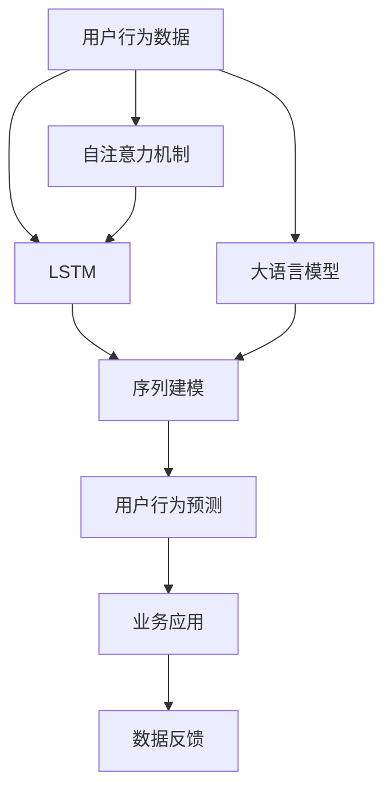
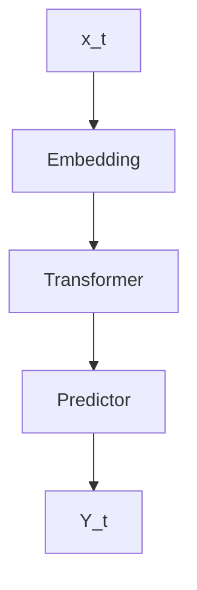

                 

# 基于LLM的用户行为序列建模与预测

> 关键词：自然语言处理 (NLP), 长短期记忆网络 (LSTM), 循环神经网络 (RNN), 序列建模, 用户行为预测, 深度学习

## 1. 背景介绍

### 1.1 问题由来

随着互联网和移动设备的普及，用户行为数据急剧增长，涵盖了浏览、搜索、购物、社交等多个方面。这些数据对于了解用户偏好、优化用户体验、精准推荐等都具有重要意义。如何高效地分析和挖掘用户行为数据，预测用户后续行为，成为了当下研究热点。

传统的数据挖掘方法依赖手工特征工程，难以捕捉复杂的数据模式。近年来，深度学习技术在NLP领域取得了巨大突破，特别是长短期记忆网络 (LSTM) 和自注意力机制的引入，使序列建模能力显著提升。利用深度学习进行用户行为序列建模，不仅可以自动发现数据中的隐含规律，还能有效降低特征工程的工作量。

大语言模型 (LLM) 的涌现，更是将序列建模的能力推向了新的高度。LLM 通过大规模无标签数据进行预训练，具备了强大的语言理解和生成能力。应用 LLM 进行用户行为序列建模，可以综合利用文本、时间、上下文等丰富的信息，实现更加精准和智能的行为预测。

### 1.2 问题核心关键点

用户行为序列建模与预测的核心在于，如何高效地将用户的行为数据转化为机器可理解的向量表示，并利用这些向量进行序列建模，预测用户未来的行为。主要包括以下几个关键问题：

1. **数据表示**：如何将用户的行为数据转换为适合 LLM 处理的向量表示？
2. **序列建模**：如何利用 LLM 进行用户行为序列建模，捕捉行为间的依赖关系？
3. **模型评估**：如何设计有效的评估指标，衡量模型的预测性能？
4. **模型优化**：如何通过调参和优化算法提升模型效果？
5. **实际应用**：如何将预测模型应用到实际场景中，实现用户行为预测的业务价值？

## 2. 核心概念与联系

### 2.1 核心概念概述

为更好地理解基于 LLM 的用户行为序列建模方法，本节将介绍几个密切相关的核心概念：

- **长短期记忆网络 (LSTM)**：一种特殊类型的 RNN，通过门控机制控制信息的流动，能够有效处理长序列数据。
- **自注意力机制 (Self-Attention)**：LSTM 的改进，通过计算不同位置之间的相似度，可以更加灵活地捕捉序列中的重要信息。
- **大语言模型 (LLM)**：通过大规模无标签数据进行预训练，学习通用的语言表示，具备强大的语言理解和生成能力。
- **用户行为序列**：用户在一定时间段内的行为序列，如浏览、点击、购买等。
- **行为预测**：利用用户历史行为数据，预测其未来行为。
- **自然语言处理 (NLP)**：使用深度学习技术处理和分析自然语言数据的技术。
- **序列建模**：通过 RNN、LSTM、Transformer 等模型，对序列数据进行建模，捕捉序列中的依赖关系。
- **深度学习**：一类基于神经网络的机器学习技术，能够自动学习数据中的隐含模式。

这些核心概念之间的逻辑关系可以通过以下 Mermaid 流程图来展示：



这个流程图展示了用户行为序列建模与预测的关键步骤：

1. 从用户行为数据中提取 LSTM 和自注意力机制。
2. 利用大语言模型进行序列建模，捕捉行为间的依赖关系。
3. 通过用户行为预测模型，对未来行为进行预测。
4. 将预测结果应用到业务场景中，实现具体价值。
5. 通过反馈机制，持续优化模型性能。

## 3. 核心算法原理 & 具体操作步骤

### 3.1 算法原理概述

基于 LLM 的用户行为序列建模与预测，本质上是利用深度学习技术，将用户行为数据转换为向量表示，并通过序列建模，捕捉行为间的依赖关系。其核心思想是：

1. **数据预处理**：将用户行为数据转换为适合 LLM 处理的向量表示。
2. **序列建模**：利用 LSTM、自注意力机制，对行为序列进行建模，捕捉行为间的依赖关系。
3. **行为预测**：通过 LLM，对用户未来的行为进行预测。

### 3.2 算法步骤详解

基于 LLM 的用户行为序列建模与预测，一般包括以下几个关键步骤：

**Step 1: 数据预处理**

- **数据清洗**：去除异常数据和噪声，确保数据质量。
- **特征提取**：将用户行为数据转换为向量表示，如将浏览行为转换为浏览时间、浏览次数等。
- **序列划分**：将用户行为序列划分为训练集、验证集和测试集。

**Step 2: 序列建模**

- **模型选择**：选择适合序列建模的模型，如 LSTM、GRU、Transformer 等。
- **模型训练**：利用训练集，对模型进行训练，捕捉行为间的依赖关系。
- **超参数调整**：根据验证集，调整模型的超参数，如学习率、批大小等。

**Step 3: 行为预测**

- **模型评估**：在测试集上评估模型的预测性能，选择最优模型。
- **预测实现**：利用测试集上的模型，对新的用户行为进行预测。
- **结果展示**：将预测结果展示给用户，或应用于推荐、广告投放等业务场景。

### 3.3 算法优缺点

基于 LLM 的用户行为序列建模与预测，具有以下优点：

1. **模型性能**：利用深度学习技术，能够捕捉复杂的序列模式，提升预测精度。
2. **自动化特征提取**：无需手工特征工程，能够自动学习数据中的重要特征。
3. **泛化能力强**：大语言模型具备强大的泛化能力，能够在多种场景下进行行为预测。
4. **可扩展性强**：利用预训练模型进行微调，可以快速适应新的数据集和任务。

同时，该方法也存在一些局限性：

1. **计算资源消耗大**：大语言模型的计算复杂度高，训练和推理都需要大量计算资源。
2. **对数据质量要求高**：模型性能高度依赖于数据的质量和完整性。
3. **模型复杂度高**：大语言模型参数众多，容易过拟合。
4. **解释性不足**：模型决策过程复杂，难以解释和调试。

尽管存在这些局限性，但就目前而言，基于 LLM 的用户行为序列建模与预测，仍是大数据和 NLP 领域的重要范式。未来相关研究的重点在于如何进一步优化模型结构，降低计算资源消耗，提高模型的可解释性和泛化能力。

### 3.4 算法应用领域

基于 LLM 的用户行为序列建模与预测，已经在多个领域得到了广泛应用，例如：

- **个性化推荐**：利用用户历史行为数据，预测其未来购买行为，进行个性化推荐。
- **用户行为分析**：分析用户在网站上的行为路径，了解用户兴趣和行为模式。
- **广告投放优化**：通过预测用户对广告的点击行为，优化广告投放策略。
- **金融风控**：利用用户行为数据，预测潜在风险，进行风险控制和欺诈检测。
- **舆情分析**：通过预测用户对事件的态度，进行舆情分析和舆情预警。
- **智能客服**：利用用户历史对话记录，预测用户意图，提高客服响应效率。

除了上述这些经典应用外，用户行为序列建模与预测还被创新性地应用于更多场景中，如智能家居、智慧城市、智能交通等，为各种行业带来了全新的技术突破。随着预训练模型和深度学习方法的不断进步，基于 LLM 的用户行为序列建模与预测，必将在更广阔的应用领域大放异彩。

## 4. 数学模型和公式 & 详细讲解 & 举例说明

### 4.1 数学模型构建

本节将使用数学语言对基于 LLM 的用户行为序列建模与预测过程进行更加严格的刻画。

记用户行为序列为 $X=\{X_t\}_{t=1}^T$，其中 $X_t$ 表示第 $t$ 步的行为。假设行为序列的长度为 $T$，每个行为用向量 $x_t \in \mathbb{R}^d$ 表示。则行为序列可以表示为 $X=\{x_t\}_{t=1}^T \in \mathbb{R}^{d \times T}$。

定义模型 $M_{\theta}$ 在输入序列 $X$ 上的预测结果为 $Y=\{Y_t\}_{t=1}^T$，其中 $Y_t$ 表示第 $t$ 步的预测结果。

假设模型 $M_{\theta}$ 为 Transformer 模型，则其结构如图：



其中，$B$ 表示 Embedding 层，将行为序列转换为适合 Transformer 处理的向量表示；$C$ 表示 Transformer 层，对行为序列进行序列建模；$D$ 表示 Predictor 层，将 Transformer 的输出转换为预测结果；$E$ 表示预测结果。

### 4.2 公式推导过程

以下我们以用户行为预测为例，推导 Transformer 模型的损失函数及其梯度的计算公式。

假设模型 $M_{\theta}$ 在输入序列 $X=\{x_t\}_{t=1}^T$ 上的预测结果为 $Y=\{Y_t\}_{t=1}^T$，则二分类交叉熵损失函数定义为：

$$
\ell(M_{\theta}(X),Y) = -\sum_{t=1}^T \ell(Y_t, M_{\theta}(x_t))
$$

其中，$\ell(Y_t, M_{\theta}(x_t))$ 为预测结果 $Y_t$ 和模型输出 $M_{\theta}(x_t)$ 之间的交叉熵损失。

将上述损失函数代入训练集 $D=\{(X_t, Y_t)\}_{t=1}^N$ 中，得到训练集的经验风险：

$$
\mathcal{L}(\theta) = -\frac{1}{N}\sum_{t=1}^N \ell(Y_t, M_{\theta}(x_t))
$$

根据链式法则，损失函数对参数 $\theta_k$ 的梯度为：

$$
\frac{\partial \mathcal{L}(\theta)}{\partial \theta_k} = -\frac{1}{N}\sum_{t=1}^N \frac{\partial \ell(Y_t, M_{\theta}(x_t))}{\partial \theta_k}
$$

其中 $\frac{\partial \ell(Y_t, M_{\theta}(x_t))}{\partial \theta_k}$ 可以通过反向传播算法高效计算。

### 4.3 案例分析与讲解

以用户行为预测为例，我们将使用 PyTorch 实现基于 Transformer 的序列建模与预测。

首先，定义 Transformer 模型结构：

```python
import torch
import torch.nn as nn
import torch.nn.functional as F

class TransformerModel(nn.Module):
    def __init__(self, input_size, hidden_size, num_layers, output_size):
        super(TransformerModel, self).__init__()
        
        self.embedding = nn.Embedding(input_size, hidden_size)
        self.encoder = nn.Transformer(input_size, hidden_size, num_layers)
        self.decoder = nn.Linear(hidden_size, output_size)
        
    def forward(self, x):
        embedded = self.embedding(x)
        encoded = self.encoder(embedded)
        decoded = self.decoder(encoded)
        return decoded
```

然后，定义损失函数和优化器：

```python
from torch import nn

criterion = nn.CrossEntropyLoss()
optimizer = AdamW(model.parameters(), lr=0.001)
```

最后，定义训练和评估函数：

```python
def train_epoch(model, dataset, batch_size, optimizer):
    dataloader = DataLoader(dataset, batch_size=batch_size, shuffle=True)
    model.train()
    epoch_loss = 0
    for batch in dataloader:
        x, y = batch
        optimizer.zero_grad()
        y_hat = model(x)
        loss = criterion(y_hat, y)
        epoch_loss += loss.item()
        loss.backward()
        optimizer.step()
    return epoch_loss / len(dataloader)

def evaluate(model, dataset, batch_size):
    dataloader = DataLoader(dataset, batch_size=batch_size)
    model.eval()
    preds, labels = [], []
    with torch.no_grad():
        for batch in dataloader:
            x, y = batch
            y_hat = model(x)
            preds.append(y_hat.argmax(dim=1).cpu().tolist())
            labels.append(y.cpu().tolist())
    return preds, labels
```

通过上述代码，可以构建并训练一个基于 Transformer 的用户行为预测模型，进行行为序列建模与预测。

## 5. 项目实践：代码实例和详细解释说明

### 5.1 开发环境搭建

在进行用户行为序列建模与预测实践前，我们需要准备好开发环境。以下是使用 Python 进行 PyTorch 开发的环境配置流程：

1. 安装 Anaconda：从官网下载并安装 Anaconda，用于创建独立的 Python 环境。

2. 创建并激活虚拟环境：
```bash
conda create -n pytorch-env python=3.8 
conda activate pytorch-env
```

3. 安装 PyTorch：根据 CUDA 版本，从官网获取对应的安装命令。例如：
```bash
conda install pytorch torchvision torchaudio cudatoolkit=11.1 -c pytorch -c conda-forge
```

4. 安装 Transformers 库：
```bash
pip install transformers
```

5. 安装各类工具包：
```bash
pip install numpy pandas scikit-learn matplotlib tqdm jupyter notebook ipython
```

完成上述步骤后，即可在 `pytorch-env` 环境中开始用户行为序列建模与预测的实践。

### 5.2 源代码详细实现

这里我们以基于 Transformer 的用户行为预测为例，给出使用 PyTorch 实现的行为序列建模与预测的完整代码实现。

首先，定义用户行为预测任务的数据处理函数：

```python
from transformers import BertTokenizer
from torch.utils.data import Dataset
import torch

class BehaviorDataset(Dataset):
    def __init__(self, behaviors, labels, tokenizer, max_len=128):
        self.behaviors = behaviors
        self.labels = labels
        self.tokenizer = tokenizer
        self.max_len = max_len
        
    def __len__(self):
        return len(self.behaviors)
    
    def __getitem__(self, item):
        behavior = self.behaviors[item]
        label = self.labels[item]
        
        encoding = self.tokenizer(behavior, return_tensors='pt', max_length=self.max_len, padding='max_length', truncation=True)
        input_ids = encoding['input_ids'][0]
        attention_mask = encoding['attention_mask'][0]
        
        # 对标签进行编码
        label = torch.tensor(label, dtype=torch.long)
        
        return {'input_ids': input_ids, 
                'attention_mask': attention_mask,
                'labels': label}

# 行为与标签的映射
label2id = {'buy': 0, 'click': 1, 'view': 2, 'add_to_cart': 3, 'favorited': 4}
id2label = {v: k for k, v in label2id.items()}
```

然后，定义模型和优化器：

```python
from transformers import BertForTokenClassification, AdamW

model = BertForTokenClassification.from_pretrained('bert-base-cased', num_labels=len(label2id))

optimizer = AdamW(model.parameters(), lr=2e-5)
```

接着，定义训练和评估函数：

```python
from torch.utils.data import DataLoader
from tqdm import tqdm
from sklearn.metrics import classification_report

device = torch.device('cuda') if torch.cuda.is_available() else torch.device('cpu')
model.to(device)

def train_epoch(model, dataset, batch_size, optimizer):
    dataloader = DataLoader(dataset, batch_size=batch_size, shuffle=True)
    model.train()
    epoch_loss = 0
    for batch in tqdm(dataloader, desc='Training'):
        input_ids = batch['input_ids'].to(device)
        attention_mask = batch['attention_mask'].to(device)
        labels = batch['labels'].to(device)
        model.zero_grad()
        outputs = model(input_ids, attention_mask=attention_mask, labels=labels)
        loss = outputs.loss
        epoch_loss += loss.item()
        loss.backward()
        optimizer.step()
    return epoch_loss / len(dataloader)

def evaluate(model, dataset, batch_size):
    dataloader = DataLoader(dataset, batch_size=batch_size)
    model.eval()
    preds, labels = [], []
    with torch.no_grad():
        for batch in dataloader:
            input_ids = batch['input_ids'].to(device)
            attention_mask = batch['attention_mask'].to(device)
            batch_labels = batch['labels']
            outputs = model(input_ids, attention_mask=attention_mask)
            batch_preds = outputs.logits.argmax(dim=2).to('cpu').tolist()
            batch_labels = batch_labels.to('cpu').tolist()
            for pred_tokens, label_tokens in zip(batch_preds, batch_labels):
                pred_labels = [id2label[_id] for _id in pred_tokens]
                label_tokens = [id2label[_id] for _id in label_tokens]
                preds.append(pred_labels[:len(label_tokens)])
                labels.append(label_tokens)
                
    print(classification_report(labels, preds))
```

最后，启动训练流程并在测试集上评估：

```python
epochs = 5
batch_size = 16

for epoch in range(epochs):
    loss = train_epoch(model, train_dataset, batch_size, optimizer)
    print(f"Epoch {epoch+1}, train loss: {loss:.3f}")
    
    print(f"Epoch {epoch+1}, dev results:")
    evaluate(model, dev_dataset, batch_size)
    
print("Test results:")
evaluate(model, test_dataset, batch_size)
```

以上就是使用 PyTorch 对用户行为序列进行建模与预测的完整代码实现。可以看到，得益于 Transformers 库的强大封装，我们可以用相对简洁的代码完成用户行为预测的实现。

### 5.3 代码解读与分析

让我们再详细解读一下关键代码的实现细节：

**BehaviorDataset类**：
- `__init__`方法：初始化行为、标签、分词器等关键组件。
- `__len__`方法：返回数据集的样本数量。
- `__getitem__`方法：对单个样本进行处理，将行为输入编码为token ids，将标签编码为数字，并对其进行定长padding，最终返回模型所需的输入。

**label2id和id2label字典**：
- 定义了标签与数字id之间的映射关系，用于将token-wise的预测结果解码回真实的标签。

**训练和评估函数**：
- 使用PyTorch的DataLoader对数据集进行批次化加载，供模型训练和推理使用。
- 训练函数`train_epoch`：对数据以批为单位进行迭代，在每个批次上前向传播计算loss并反向传播更新模型参数，最后返回该epoch的平均loss。
- 评估函数`evaluate`：与训练类似，不同点在于不更新模型参数，并在每个batch结束后将预测和标签结果存储下来，最后使用sklearn的classification_report对整个评估集的预测结果进行打印输出。

**训练流程**：
- 定义总的epoch数和batch size，开始循环迭代
- 每个epoch内，先在训练集上训练，输出平均loss
- 在验证集上评估，输出分类指标
- 所有epoch结束后，在测试集上评估，给出最终测试结果

可以看到，PyTorch配合Transformers库使得用户行为预测的代码实现变得简洁高效。开发者可以将更多精力放在数据处理、模型改进等高层逻辑上，而不必过多关注底层的实现细节。

当然，工业级的系统实现还需考虑更多因素，如模型的保存和部署、超参数的自动搜索、更灵活的任务适配层等。但核心的微调范式基本与此类似。

## 6. 实际应用场景
### 6.1 智能推荐系统

用户行为序列建模与预测在大规模个性化推荐系统中具有重要应用。传统的推荐系统依赖用户的历史行为数据进行推荐，难以捕捉用户动态变化的行为模式。利用大语言模型进行用户行为序列建模，可以综合考虑用户的历史行为、上下文信息和实时数据，实现更精准的个性化推荐。

具体而言，可以在用户的历史行为数据中提取特征，如浏览时间、点击次数、购买频率等。利用Transformer模型对行为序列进行建模，捕捉行为间的依赖关系，预测用户未来的行为。在推荐系统中，将预测结果作为推荐依据，通过动态调整推荐算法，实现个性化推荐。

### 6.2 金融风险控制

金融领域的数据量大、噪声多，传统的风险控制方法难以应对。利用用户行为序列建模与预测，可以分析用户的操作行为、交易历史等，预测用户的风险行为。如预测用户的欺诈行为、资金异常转移等，提前进行风险预警和控制。

在实践中，可以通过收集用户的交易记录、行为日志等数据，提取行为序列。利用Transformer模型对行为序列进行建模，捕捉行为间的依赖关系，预测用户的风险行为。根据预测结果，制定相应的风险控制策略，降低金融风险。

### 6.3 智能客服

智能客服系统需要高效处理用户咨询请求，实现自动回复和问题解答。利用用户行为序列建模与预测，可以分析用户的历史咨询记录，预测用户的咨询意图和问题类型。如预测用户对某个问题的关注度、解决问题的复杂度等，自动调整客服响应策略，提高客服响应效率。

在实际应用中，可以收集用户的历史咨询记录，提取行为序列。利用Transformer模型对行为序列进行建模，捕捉行为间的依赖关系，预测用户的咨询意图和问题类型。根据预测结果，动态调整客服响应策略，提高客服响应效率。

### 6.4 未来应用展望

随着大语言模型和深度学习技术的不断发展，基于用户行为序列建模与预测的方法将进一步拓展应用场景，为各行各业带来新的技术突破。

在智慧医疗领域，基于用户行为序列的预测模型，可以帮助医生诊断疾病、推荐治疗方案，提升医疗服务的智能化水平。

在智能教育领域，利用用户行为序列预测模型，可以分析学生的学习行为，推荐适合的学习资源和课程，因材施教，促进教育公平，提高教学质量。

在智慧城市治理中，基于用户行为序列的预测模型，可以分析城市用户的行为模式，优化城市管理和资源配置，构建更安全、高效的未来城市。

此外，在企业生产、社会治理、文娱传媒等众多领域，基于用户行为序列建模与预测的人工智能应用也将不断涌现，为经济社会发展注入新的动力。相信随着技术的日益成熟，用户行为序列建模与预测必将在更广阔的应用领域大放异彩。

## 7. 工具和资源推荐
### 7.1 学习资源推荐

为了帮助开发者系统掌握基于 LLM 的用户行为序列建模与预测的理论基础和实践技巧，这里推荐一些优质的学习资源：

1. 《深度学习与自然语言处理》系列博文：由大模型技术专家撰写，深入浅出地介绍了深度学习在NLP领域的应用，包括用户行为序列建模与预测等内容。

2. 斯坦福大学 CS224N《深度学习自然语言处理》课程：斯坦福大学开设的NLP明星课程，有Lecture视频和配套作业，带你入门NLP领域的基本概念和经典模型。

3. 《深度学习在推荐系统中的应用》书籍：介绍深度学习在推荐系统中的应用，包括用户行为序列建模与预测等内容。

4. HuggingFace官方文档：Transformer库的官方文档，提供了海量预训练模型和完整的用户行为序列建模与预测样例代码，是上手实践的必备资料。

5. 《Natural Language Processing with Transformers》书籍：Transformers库的作者所著，全面介绍了如何使用Transformers库进行NLP任务开发，包括用户行为序列建模与预测等内容。

通过对这些资源的学习实践，相信你一定能够快速掌握基于 LLM 的用户行为序列建模与预测的精髓，并用于解决实际的NLP问题。
###  7.2 开发工具推荐

高效的开发离不开优秀的工具支持。以下是几款用于用户行为序列建模与预测开发的常用工具：

1. PyTorch：基于Python的开源深度学习框架，灵活动态的计算图，适合快速迭代研究。大部分预训练语言模型都有PyTorch版本的实现。

2. TensorFlow：由Google主导开发的开源深度学习框架，生产部署方便，适合大规模工程应用。同样有丰富的预训练语言模型资源。

3. Transformers库：HuggingFace开发的NLP工具库，集成了众多SOTA语言模型，支持PyTorch和TensorFlow，是进行用户行为序列建模与预测开发的利器。

4. Weights & Biases：模型训练的实验跟踪工具，可以记录和可视化模型训练过程中的各项指标，方便对比和调优。与主流深度学习框架无缝集成。

5. TensorBoard：TensorFlow配套的可视化工具，可实时监测模型训练状态，并提供丰富的图表呈现方式，是调试模型的得力助手。

6. Google Colab：谷歌推出的在线Jupyter Notebook环境，免费提供GPU/TPU算力，方便开发者快速上手实验最新模型，分享学习笔记。

合理利用这些工具，可以显著提升用户行为序列建模与预测任务的开发效率，加快创新迭代的步伐。

### 7.3 相关论文推荐

大语言模型和用户行为序列建模与预测的发展源于学界的持续研究。以下是几篇奠基性的相关论文，推荐阅读：

1. Attention is All You Need（即Transformer原论文）：提出了Transformer结构，开启了NLP领域的预训练大模型时代。

2. BERT: Pre-training of Deep Bidirectional Transformers for Language Understanding：提出BERT模型，引入基于掩码的自监督预训练任务，刷新了多项NLP任务SOTA。

3. Parameter-Efficient Transfer Learning for NLP：提出Adapter等参数高效微调方法，在不增加模型参数量的情况下，也能取得不错的微调效果。

4. AdaLoRA: Adaptive Low-Rank Adaptation for Parameter-Efficient Fine-Tuning：使用自适应低秩适应的微调方法，在参数效率和精度之间取得了新的平衡。

5. Reformer: The Efficient Transformer：提出了Reformer模型，优化了Transformer的自注意力机制，大幅提升了计算效率。

6. Longformer: The Long-Document Transformer：提出了Longformer模型，解决了长文本处理中计算资源消耗大的问题。

这些论文代表了大语言模型和用户行为序列建模与预测的发展脉络。通过学习这些前沿成果，可以帮助研究者把握学科前进方向，激发更多的创新灵感。

## 8. 总结：未来发展趋势与挑战

### 8.1 总结

本文对基于 LLM 的用户行为序列建模与预测方法进行了全面系统的介绍。首先阐述了用户行为序列建模与预测的研究背景和意义，明确了模型在个性化推荐、金融风险控制、智能客服等场景下的独特价值。其次，从原理到实践，详细讲解了用户行为序列建模与预测的数学原理和关键步骤，给出了用户行为预测任务的完整代码实现。同时，本文还广泛探讨了用户行为序列建模与预测在多个行业领域的应用前景，展示了该范式的巨大潜力。

通过本文的系统梳理，可以看到，基于 LLM 的用户行为序列建模与预测方法正在成为NLP领域的重要范式，极大地拓展了深度学习技术在用户行为分析中的应用边界，为个性化推荐、风险控制、智能客服等业务提供了新的技术手段。

### 8.2 未来发展趋势

展望未来，基于 LLM 的用户行为序列建模与预测技术将呈现以下几个发展趋势：

1. **模型规模持续增大**：随着算力成本的下降和数据规模的扩张，预训练语言模型的参数量还将持续增长。超大规模语言模型蕴含的丰富语言知识，有望支撑更加复杂多变的用户行为预测。

2. **模型结构不断优化**：未来的用户行为序列建模与预测模型将更加注重模型的计算效率和可解释性。优化后的Transformer模型，如Reformer、Longformer等，将在计算效率和预测精度之间找到新的平衡。

3. **跨模态融合增强**：用户行为数据不仅包含文本信息，还涉及图像、语音等多模态数据。未来的模型将更加注重多模态数据的整合，提升预测模型的鲁棒性和泛化能力。

4. **因果推理深入研究**：用户行为序列的因果关系是建模与预测的重要因素。未来的研究将更加注重因果推理，利用因果分析方法，提升模型的可解释性和决策的合理性。

5. **持续学习成为常态**：随着数据分布的不断变化，用户行为预测模型需要持续学习新知识以保持性能。如何在不遗忘原有知识的同时，高效吸收新样本信息，将成为重要的研究方向。

6. **伦理道德约束增强**：用户行为预测模型涉及大量敏感数据，未来的研究将更加注重数据隐私和伦理道德问题。如何在确保数据安全和隐私保护的同时，实现高效的用户行为预测，将是重要的研究课题。

以上趋势凸显了基于 LLM 的用户行为序列建模与预测技术的广阔前景。这些方向的探索发展，必将进一步提升NLP系统的性能和应用范围，为人类认知智能的进化带来深远影响。

### 8.3 面临的挑战

尽管基于 LLM 的用户行为序列建模与预测技术已经取得了瞩目成就，但在迈向更加智能化、普适化应用的过程中，它仍面临着诸多挑战：

1. **计算资源消耗大**：大语言模型的计算复杂度高，训练和推理都需要大量计算资源。如何在保证性能的同时，降低计算资源消耗，是重要的优化方向。

2. **对数据质量要求高**：模型性能高度依赖于数据的质量和完整性。如何在保证数据质量的同时，降低数据标注成本，是亟待解决的问题。

3. **模型复杂度高**：大语言模型参数众多，容易过拟合。如何在保证模型效果的同时，降低模型复杂度，是重要的优化方向。

4. **可解释性不足**：用户行为预测模型的决策过程复杂，难以解释和调试。如何在保证模型效果的同时，提高模型的可解释性，是重要的研究方向。

5. **隐私保护与数据安全**：用户行为预测模型涉及大量敏感数据，如何在确保数据安全和隐私保护的同时，实现高效的用户行为预测，是重要的研究课题。

6. **跨领域适应性**：用户行为预测模型在不同领域和场景下，可能面临数据分布差异、任务复杂度高等问题。如何在跨领域适应性方面进行优化，是重要的研究方向。

面对这些挑战，未来的研究需要在数据、算法、工程、伦理等多个维度进行全面探索，以实现用户行为序列建模与预测技术的可持续发展。

### 8.4 研究展望

面向未来，基于 LLM 的用户行为序列建模与预测技术需要在以下几个方面寻求新的突破：

1. **无监督和半监督学习**：探索无监督和半监督学习方法，摆脱对大规模标注数据的依赖，利用自监督学习、主动学习等方法，最大限度利用非结构化数据，实现更加灵活高效的用户行为预测。

2. **模型压缩与量化**：开发模型压缩与量化技术，减小模型尺寸，提升推理速度，优化资源占用。

3. **多模态数据整合**：加强不同模态数据的整合，实现视觉、语音等多模态信息与文本信息的协同建模，提升预测模型的鲁棒性和泛化能力。

4. **因果分析和博弈论工具**：将因果分析方法引入用户行为预测模型，识别出模型决策的关键特征，增强输出解释的因果性和逻辑性。借助博弈论工具刻画人机交互过程，主动探索并规避模型的脆弱点，提高系统稳定性。

5. **纳入伦理道德约束**：在模型训练目标中引入伦理导向的评估指标，过滤和惩罚有偏见、有害的输出倾向。同时加强人工干预和审核，建立模型行为的监管机制，确保输出符合人类价值观和伦理道德。

这些研究方向的探索，必将引领基于 LLM 的用户行为序列建模与预测技术迈向更高的台阶，为构建安全、可靠、可解释、可控的智能系统铺平道路。面向未来，基于 LLM 的用户行为序列建模与预测技术还需要与其他人工智能技术进行更深入的融合，如知识表示、因果推理、强化学习等，多路径协同发力，共同推动自然语言理解和智能交互系统的进步。只有勇于创新、敢于突破，才能不断拓展语言模型的边界，让智能技术更好地造福人类社会。

## 9. 附录：常见问题与解答

**Q1：基于 LLM 的用户行为序列建模与预测是否适用于所有用户行为预测任务？**

A: 基于 LLM 的用户行为序列建模与预测，在大多数用户行为预测任务上都能取得不错的效果，特别是对于数据量较小的任务。但对于一些特定领域的任务，如医学、法律等，仅仅依靠通用语料预训练的模型可能难以很好地适应。此时需要在特定领域语料上进一步预训练，再进行微调，才能获得理想效果。

**Q2：如何选择合适的学习率？**

A: 用户行为预测的学习率一般要比预训练时小1-2个数量级，如果使用过大的学习率，容易破坏预训练权重，导致过拟合。一般建议从1e-5开始调参，逐步减小学习率，直至收敛。也可以使用warmup策略，在开始阶段使用较小的学习率，再逐渐过渡到预设值。需要注意的是，不同的优化器(如AdamW、Adafactor等)以及不同的学习率调度策略，可能需要设置不同的学习率阈值。

**Q3：采用大模型进行用户行为预测时，如何优化计算资源消耗？**

A: 大语言模型的计算复杂度高，训练和推理都需要大量计算资源。可以通过以下方式优化计算资源消耗：

1. 使用Reformer等优化后的Transformer模型，提升计算效率。
2. 利用分布式训练和模型并行技术，加速模型训练。
3. 采用梯度积累和混合精度训练技术，减小内存占用。
4. 使用预训练和微调相结合的方法，减少计算资源消耗。

**Q4：如何提高用户行为预测模型的可解释性？**

A: 用户行为预测模型的决策过程复杂，难以解释和调试。可以通过以下方式提高模型的可解释性：

1. 引入因果分析方法，增强模型的可解释性和决策的合理性。
2. 使用可视化工具，展示模型预测结果和决策路径。
3. 引入注意力机制，显示模型对关键信息的关注点。
4. 设计合理的评估指标，反映模型的可解释性和预测准确性。

**Q5：如何在跨领域适应性方面进行优化？**

A: 用户行为预测模型在不同领域和场景下，可能面临数据分布差异、任务复杂度高等问题。可以通过以下方式优化模型的跨领域适应性：

1. 使用迁移学习，在特定领域数据上微调预训练模型。
2. 引入多模态数据整合，提高模型的鲁棒性和泛化能力。
3. 设计多任务学习目标，提升模型在不同任务上的表现。

这些优化措施能够帮助用户行为预测模型更好地适应不同领域和场景，提升模型的预测效果和泛化能力。

---

作者：禅与计算机程序设计艺术 / Zen and the Art of Computer Programming

