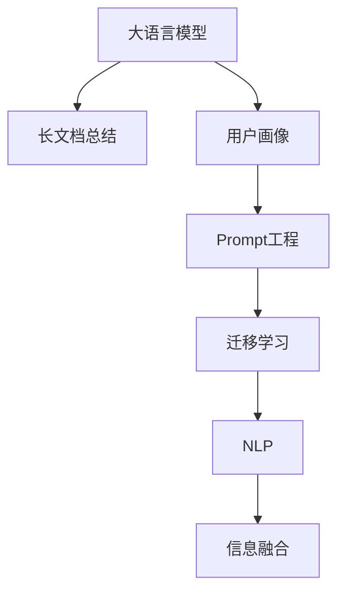

                 

# 基于Prompt的长文档总结与用户画像技术

> 关键词：长文档总结,用户画像,Prompt工程,自然语言处理,NLP

## 1. 背景介绍

### 1.1 问题由来

在现代信息爆炸的时代，获取大量文本信息并从中提取出有价值的内容是每个领域从业者必须面对的挑战。长文档文本通常包含丰富的知识和见解，但阅读和理解这些文本需要花费大量的时间和精力。为了提高文档处理的效率和效果，长文档总结和用户画像技术应运而生，通过自动化工具快速提取关键信息，构建用户画像，为决策和应用提供数据支持。

特别是大语言模型（Large Language Models, LLMs）的崛起，如OpenAI的GPT-3和Google的BERT等，为长文档总结和用户画像提供了全新的思路和工具。通过大语言模型和Prompt工程，用户可以更高效地利用文档，生成简洁摘要，理解用户需求，从而实现信息的高效检索、知识发现和内容推荐。

### 1.2 问题核心关键点

长文档总结和用户画像技术主要解决以下问题：

- **长文档处理**：如何高效地处理、分析和理解长文档内容，提取关键信息。
- **用户画像构建**：如何基于用户的历史行为、兴趣偏好等数据，构建精准的用户画像。
- **Prompt工程**：如何设计有效的Prompt，引导大语言模型生成高质量的摘要和画像。
- **信息融合**：如何将从长文档和用户画像中提取出的信息进行融合，形成更加全面、深入的洞见。

这些问题都依赖于自然语言处理（NLP）技术，特别是大语言模型的应用。Prompt工程作为大语言模型的一种特殊调参方式，通过精心的Prompt设计，使得模型在特定任务上表现更佳，从而在长文档总结和用户画像技术中发挥关键作用。

## 2. 核心概念与联系

### 2.1 核心概念概述

为了更好地理解基于Prompt的长文档总结与用户画像技术，本节将介绍几个核心概念及其相互联系：

- **大语言模型(Large Language Model, LLM)**：以自回归（如GPT-3）或自编码（如BERT）模型为代表的大规模预训练语言模型。通过在大规模无标签文本语料上进行预训练，学习通用的语言表示，具备强大的语言理解和生成能力。
- **Prompt工程**：通过设计特殊的输入Prompt，引导大语言模型在特定任务上输出期望结果的工程实践。Prompt可以包含任务描述、样本数据等，用于指导模型的推理和生成。
- **长文档总结**：通过自动化的方式，从长文档文本中提取关键信息，生成简洁、清晰的摘要，便于用户快速理解文档主旨和重点内容。
- **用户画像**：通过分析用户的历史行为、兴趣偏好、社交信息等，构建用户全景画像，用于个性化推荐、用户细分、市场营销等应用场景。
- **自然语言处理(Natural Language Processing, NLP)**：涉及语言模型的训练、文本表示、信息检索、文本生成等技术，旨在实现人机之间的自然语言交互和理解。
- **迁移学习(Transfer Learning)**：将一个领域学到的知识，迁移到另一个不同但相关的领域学习范式。大模型的预训练-微调过程即是一种典型的迁移学习方式。

这些概念之间的联系和交互，可以通过以下Mermaid流程图来展示：



这个流程图展示了大语言模型的核心概念及其与其他技术之间的联系：

1. 大语言模型通过预训练获得基础能力。
2. 长文档总结和用户画像技术通过微调或Prompt工程，利用大语言模型的能力，自动提取和生成信息。
3. Prompt工程是一种特殊形式的微调，通过精心设计Prompt，使得模型在特定任务上表现更佳。
4. 信息融合将长文档和用户画像中提取的信息进行整合，形成更全面、深入的洞察。

这些概念共同构成了长文档总结和用户画像技术的框架，使得自动化的信息提取和用户画像构建成为可能。

## 3. 核心算法原理 & 具体操作步骤
### 3.1 算法原理概述

基于Prompt的长文档总结与用户画像技术，本质上是利用大语言模型和Prompt工程，对长文档文本进行自动化的信息提取和用户行为分析。其核心思想是：将大语言模型当作一个强大的信息提取器，通过设计的Prompt引导模型输出期望的结果，即从长文档文本中提取关键信息或生成用户画像。

形式化地，假设大语言模型为 $M_{\theta}$，其中 $\theta$ 为模型参数。对于长文档文本 $T$，设计一个Prompt $P$，使得模型输出 $M_{\theta}(P, T)$ 包含关键信息或符合用户画像描述。目标是最小化与期望结果之间的差异：

$$
\hat{M} = \mathop{\arg\min}_{\theta} \mathcal{L}(M_{\theta}(P, T), T_{\text{ref}})
$$

其中 $\mathcal{L}$ 为评价模型输出的损失函数，$T_{\text{ref}}$ 为长文档的参考信息或用户画像的描述。

通过梯度下降等优化算法，不断更新模型参数 $\theta$，最小化损失函数 $\mathcal{L}$，使得模型输出逼近期望结果。

### 3.2 算法步骤详解

基于Prompt的长文档总结与用户画像技术主要包括以下关键步骤：

**Step 1: 准备长文档和用户画像数据**
- 收集待处理的长文档文本和用户的行为、兴趣等数据。长文档文本可以来自书籍、报告、新闻等。
- 对用户数据进行清洗和预处理，确保数据质量和一致性。

**Step 2: 设计Prompt**
- 设计符合任务需求的Prompt，包括任务描述、示例等，用于引导大语言模型输出期望的结果。
- 进行Prompt调优，通过不断的迭代实验，找到最优的Prompt设计。

**Step 3: 训练模型**
- 将准备好的长文档和Prompt输入大语言模型，进行训练。可以采用微调的方式，也可以使用无监督学习的方式。
- 根据训练效果调整模型超参数，如学习率、批大小、迭代轮数等。

**Step 4: 生成结果**
- 使用训练好的模型对新的长文档文本和Prompt进行处理，生成摘要或用户画像。
- 对生成结果进行评估和优化，确保结果质量满足应用需求。

**Step 5: 应用和迭代**
- 将生成的摘要或用户画像应用于实际应用场景，如信息检索、知识推荐、市场营销等。
- 根据应用反馈，不断迭代改进Prompt和模型，提高处理效果和应用性能。

### 3.3 算法优缺点

基于Prompt的长文档总结与用户画像技术具有以下优点：

1. **高效性**：自动化提取和生成信息，大大节省了人工处理长文档的时间和精力。
2. **灵活性**：通过设计不同Prompt，可以灵活地处理各种类型的长文档和用户画像。
3. **高准确性**：大语言模型具有强大的语言理解和生成能力，生成结果质量高。
4. **可扩展性**：可以应用于各种NLP任务，如问答、文本分类、信息检索等。

同时，该技术也存在一定的局限性：

1. **依赖Prompt设计**：Prompt设计的好坏直接影响模型的输出结果，设计难度较大。
2. **资源需求高**：大语言模型需要强大的计算资源和存储资源，对于小规模应用可能不适用。
3. **模型复杂度高**：大语言模型的参数量通常很大，模型复杂度高。
4. **结果解释性不足**：模型的输出结果难以解释，缺乏可解释性。

尽管存在这些局限性，但就目前而言，基于Prompt的长文档总结与用户画像技术仍是大语言模型应用的重要范式。未来相关研究的重点在于如何进一步提高Prompt设计的自动化和智能化，降低对人工干预的依赖，同时兼顾结果的可解释性和效率。

### 3.4 算法应用领域

基于大语言模型的长文档总结和用户画像技术，已经在多个领域得到了广泛的应用，例如：

- **学术文献总结**：自动提取学术论文中的关键信息，生成摘要，供研究人员快速了解论文内容。
- **商业报告分析**：自动提取商业报告中的关键数据和结论，生成报告摘要，帮助决策者快速把握报告要点。
- **市场洞察**：自动提取市场报告中的关键数据，生成用户画像，为市场分析和客户细分提供数据支持。
- **新闻信息提取**：自动提取新闻报道中的关键信息，生成摘要，供新闻编辑快速制作新闻稿件。
- **个性化推荐**：基于用户的历史行为和兴趣，自动生成用户画像，进行个性化推荐。
- **知识库构建**：自动提取文档中的知识点和概念，构建知识库，供知识管理系统使用。

除了上述这些经典应用外，长文档总结和用户画像技术还被创新性地应用到更多场景中，如情感分析、事件监测、舆情分析等，为信息处理和智能交互系统带来了新的突破。

## 4. 数学模型和公式 & 详细讲解 & 举例说明

### 4.1 数学模型构建

本节将使用数学语言对长文档总结和用户画像技术的核心算法进行更加严格的刻画。

假设大语言模型为 $M_{\theta}$，其中 $\theta$ 为模型参数。对于长文档文本 $T$，设计一个Prompt $P$，目标是生成一个简短的摘要 $S$。假设模型的输出为 $M_{\theta}(P, T)$，设计损失函数 $\mathcal{L}$ 评估输出与期望结果之间的差异。目标是最小化损失函数：

$$
\hat{M} = \mathop{\arg\min}_{\theta} \mathcal{L}(M_{\theta}(P, T), S_{\text{ref}})
$$

其中 $S_{\text{ref}}$ 为长文档的参考摘要，用于评估模型输出质量。

### 4.2 公式推导过程

以下我们以长文档总结任务为例，推导模型损失函数的推导过程。

假设模型的输出为 $M_{\theta}(P, T)$，其中 $P$ 为Prompt，$T$ 为长文档文本。目标是生成一个简短的摘要 $S$。损失函数 $\mathcal{L}$ 可以通过对比模型输出与参考摘要之间的差异进行定义，例如：

$$
\mathcal{L} = \frac{1}{N} \sum_{i=1}^N |M_{\theta}(P, T_i) - S_{\text{ref}_i}|
$$

其中 $N$ 为文档数量，$T_i$ 和 $S_{\text{ref}_i}$ 分别表示第 $i$ 个文档的文本和参考摘要。

在实际应用中，模型输出 $M_{\theta}(P, T)$ 通常是一个序列，需要将其转换为一个紧凑的向量形式进行比较。例如，可以使用BLEU、ROUGE等指标进行评估。

### 4.3 案例分析与讲解

**案例1: 长文档总结**

假设有一个关于人工智能技术的长文档，目标是生成一个简洁的摘要。可以设计一个Prompt，如：

```
“请生成一个关于人工智能技术的简洁摘要。”
```

将此Prompt输入大语言模型，模型将生成一个简短的摘要。对生成的摘要进行评估，计算与参考摘要之间的差异，进而调整Prompt和模型参数，以提高生成质量。

**案例2: 用户画像**

假设有一份用户行为数据，目标是构建用户画像。可以设计一个Prompt，如：

```
“请描述一个典型的用户行为模式。”
```

将此Prompt输入大语言模型，模型将生成一个描述用户行为模式的文本。对生成的文本进行分析和优化，构建用户画像。

## 5. 项目实践：代码实例和详细解释说明
### 5.1 开发环境搭建

在进行长文档总结和用户画像技术的开发前，我们需要准备好开发环境。以下是使用Python进行PyTorch开发的环境配置流程：

1. 安装Anaconda：从官网下载并安装Anaconda，用于创建独立的Python环境。

2. 创建并激活虚拟环境：
```bash
conda create -n pytorch-env python=3.8 
conda activate pytorch-env
```

3. 安装PyTorch：根据CUDA版本，从官网获取对应的安装命令。例如：
```bash
conda install pytorch torchvision torchaudio cudatoolkit=11.1 -c pytorch -c conda-forge
```

4. 安装Transformers库：
```bash
pip install transformers
```

5. 安装各类工具包：
```bash
pip install numpy pandas scikit-learn matplotlib tqdm jupyter notebook ipython
```

完成上述步骤后，即可在`pytorch-env`环境中开始项目实践。

### 5.2 源代码详细实现

下面我们以长文档总结任务为例，给出使用Transformers库对BERT模型进行长文档总结的PyTorch代码实现。

首先，定义长文档总结任务的数据处理函数：

```python
from transformers import BertTokenizer, BertForMaskedLM, BertConfig, AdamW
from torch.utils.data import Dataset
import torch

class DocumentSummarizationDataset(Dataset):
    def __init__(self, texts, targets, tokenizer, max_len=128):
        self.texts = texts
        self.targets = targets
        self.tokenizer = tokenizer
        self.max_len = max_len
        
    def __len__(self):
        return len(self.texts)
    
    def __getitem__(self, item):
        text = self.texts[item]
        target = self.targets[item]
        
        encoding = self.tokenizer(text, return_tensors='pt', max_length=self.max_len, padding='max_length', truncation=True)
        input_ids = encoding['input_ids'][0]
        attention_mask = encoding['attention_mask'][0]
        
        # 将摘要作为标签
        target_ids = torch.tensor(self.tokenizer.convert_tokens_to_ids(target), dtype=torch.long)
        
        return {'input_ids': input_ids, 
                'attention_mask': attention_mask,
                'target_ids': target_ids}

# 定义模型
model = BertForMaskedLM.from_pretrained('bert-base-cased')

# 定义优化器
optimizer = AdamW(model.parameters(), lr=2e-5)
```

然后，定义训练和评估函数：

```python
from torch.utils.data import DataLoader
from tqdm import tqdm
from sklearn.metrics import precision_recall_fscore_support

device = torch.device('cuda') if torch.cuda.is_available() else torch.device('cpu')
model.to(device)

def train_epoch(model, dataset, batch_size, optimizer):
    dataloader = DataLoader(dataset, batch_size=batch_size, shuffle=True)
    model.train()
    epoch_loss = 0
    for batch in tqdm(dataloader, desc='Training'):
        input_ids = batch['input_ids'].to(device)
        attention_mask = batch['attention_mask'].to(device)
        target_ids = batch['target_ids'].to(device)
        model.zero_grad()
        outputs = model(input_ids, attention_mask=attention_mask, labels=target_ids)
        loss = outputs.loss
        epoch_loss += loss.item()
        loss.backward()
        optimizer.step()
    return epoch_loss / len(dataloader)

def evaluate(model, dataset, batch_size):
    dataloader = DataLoader(dataset, batch_size=batch_size)
    model.eval()
    preds, labels = [], []
    with torch.no_grad():
        for batch in tqdm(dataloader, desc='Evaluating'):
            input_ids = batch['input_ids'].to(device)
            attention_mask = batch['attention_mask'].to(device)
            batch_labels = batch['target_ids']
            outputs = model(input_ids, attention_mask=attention_mask)
            batch_preds = outputs.logits.argmax(dim=2).to('cpu').tolist()
            batch_labels = batch_labels.to('cpu').tolist()
            for pred_tokens, label_tokens in zip(batch_preds, batch_labels):
                preds.append(pred_tokens[:len(label_tokens)])
                labels.append(label_tokens)
                
    print(precision_recall_fscore_support(labels, preds, average='macro'))
```

最后，启动训练流程并在测试集上评估：

```python
epochs = 5
batch_size = 16

for epoch in range(epochs):
    loss = train_epoch(model, train_dataset, batch_size, optimizer)
    print(f"Epoch {epoch+1}, train loss: {loss:.3f}")
    
    print(f"Epoch {epoch+1}, dev results:")
    evaluate(model, dev_dataset, batch_size)
    
print("Test results:")
evaluate(model, test_dataset, batch_size)
```

以上就是使用PyTorch对BERT进行长文档总结任务的完整代码实现。可以看到，得益于Transformers库的强大封装，我们可以用相对简洁的代码完成BERT模型的加载和微调。

### 5.3 代码解读与分析

让我们再详细解读一下关键代码的实现细节：

**DocumentSummarizationDataset类**：
- `__init__`方法：初始化文本、摘要、分词器等关键组件。
- `__len__`方法：返回数据集的样本数量。
- `__getitem__`方法：对单个样本进行处理，将文本输入编码为token ids，将摘要作为标签，并对文本进行定长padding。

**模型和优化器**：
- 使用PyTorch的BertForMaskedLM模型进行长文档总结任务的实现。
- 定义AdamW优化器，设置学习率。

**训练和评估函数**：
- 使用PyTorch的DataLoader对数据集进行批次化加载，供模型训练和推理使用。
- 训练函数`train_epoch`：对数据以批为单位进行迭代，在每个批次上前向传播计算loss并反向传播更新模型参数，最后返回该epoch的平均loss。
- 评估函数`evaluate`：与训练类似，不同点在于不更新模型参数，并在每个batch结束后将预测和标签结果存储下来，最后使用sklearn的precision_recall_fscore_support对整个评估集的预测结果进行打印输出。

**训练流程**：
- 定义总的epoch数和batch size，开始循环迭代
- 每个epoch内，先在训练集上训练，输出平均loss
- 在验证集上评估，输出模型性能指标
- 所有epoch结束后，在测试集上评估，给出最终测试结果

可以看到，PyTorch配合Transformers库使得BERT微调的代码实现变得简洁高效。开发者可以将更多精力放在数据处理、模型改进等高层逻辑上，而不必过多关注底层的实现细节。

当然，工业级的系统实现还需考虑更多因素，如模型的保存和部署、超参数的自动搜索、更灵活的任务适配层等。但核心的微调范式基本与此类似。

## 6. 实际应用场景
### 6.1 智能客服系统

基于大语言模型的长文档总结和用户画像技术，可以广泛应用于智能客服系统的构建。传统客服往往需要配备大量人力，高峰期响应缓慢，且一致性和专业性难以保证。而使用长文档总结和用户画像技术，可以7x24小时不间断服务，快速响应客户咨询，用自然流畅的语言解答各类常见问题。

在技术实现上，可以收集企业内部的历史客服对话记录，将问题和最佳答复构建成监督数据，在此基础上对预训练模型进行长文档总结和用户画像微调。微调后的模型能够自动理解用户意图，匹配最合适的答案模板进行回复。对于客户提出的新问题，还可以接入检索系统实时搜索相关内容，动态组织生成回答。如此构建的智能客服系统，能大幅提升客户咨询体验和问题解决效率。

### 6.2 金融舆情监测

金融机构需要实时监测市场舆论动向，以便及时应对负面信息传播，规避金融风险。传统的人工监测方式成本高、效率低，难以应对网络时代海量信息爆发的挑战。基于长文档总结和用户画像技术的文本分类和情感分析技术，为金融舆情监测提供了新的解决方案。

具体而言，可以收集金融领域相关的新闻、报道、评论等文本数据，并对其进行主题标注和情感标注。在此基础上对预训练语言模型进行微调，使其能够自动判断文本属于何种主题，情感倾向是正面、中性还是负面。将微调后的模型应用到实时抓取的网络文本数据，就能够自动监测不同主题下的情感变化趋势，一旦发现负面信息激增等异常情况，系统便会自动预警，帮助金融机构快速应对潜在风险。

### 6.3 个性化推荐系统

当前的推荐系统往往只依赖用户的历史行为数据进行物品推荐，无法深入理解用户的真实兴趣偏好。基于长文档总结和用户画像技术的推荐系统，可以更好地挖掘用户行为背后的语义信息，从而提供更精准、多样的推荐内容。

在实践中，可以收集用户浏览、点击、评论、分享等行为数据，提取和用户交互的物品标题、描述、标签等文本内容。将文本内容作为模型输入，用户的后续行为（如是否点击、购买等）作为监督信号，在此基础上微调预训练语言模型。微调后的模型能够从文本内容中准确把握用户的兴趣点。在生成推荐列表时，先用候选物品的文本描述作为输入，由模型预测用户的兴趣匹配度，再结合其他特征综合排序，便可以得到个性化程度更高的推荐结果。

### 6.4 未来应用展望

随着长文档总结和用户画像技术的不断发展，未来其在NLP领域的应用前景将更加广阔。

在智慧医疗领域，基于长文档总结和用户画像的医疗问答、病历分析、药物研发等应用将提升医疗服务的智能化水平，辅助医生诊疗，加速新药开发进程。

在智能教育领域，长文档总结和用户画像技术可应用于作业批改、学情分析、知识推荐等方面，因材施教，促进教育公平，提高教学质量。

在智慧城市治理中，长文档总结和用户画像技术可应用于城市事件监测、舆情分析、应急指挥等环节，提高城市管理的自动化和智能化水平，构建更安全、高效的未来城市。

此外，在企业生产、社会治理、文娱传媒等众多领域，基于长文档总结和用户画像技术的人工智能应用也将不断涌现，为经济社会发展注入新的动力。相信随着技术的日益成熟，长文档总结和用户画像技术必将在更广阔的应用领域大放异彩，深刻影响人类的生产生活方式。

## 7. 工具和资源推荐
### 7.1 学习资源推荐

为了帮助开发者系统掌握长文档总结和用户画像技术的理论基础和实践技巧，这里推荐一些优质的学习资源：

1. 《Natural Language Processing with Transformers》书籍：Transformers库的作者所著，全面介绍了如何使用Transformers库进行NLP任务开发，包括长文档总结在内的诸多范式。

2. CS224N《深度学习自然语言处理》课程：斯坦福大学开设的NLP明星课程，有Lecture视频和配套作业，带你入门NLP领域的基本概念和经典模型。

3. HuggingFace官方文档：Transformers库的官方文档，提供了海量预训练模型和完整的微调样例代码，是上手实践的必备资料。

4. 《Transformer from Practical to Theoretical》系列博文：由大模型技术专家撰写，深入浅出地介绍了Transformer原理、BERT模型、微调技术等前沿话题。

5. 《Natural Language Processing with Deep Learning》书籍：提供从浅入深的自然语言处理知识，包括长文档总结等NLP任务的应用。

通过对这些资源的学习实践，相信你一定能够快速掌握长文档总结和用户画像技术的精髓，并用于解决实际的NLP问题。
###  7.2 开发工具推荐

高效的开发离不开优秀的工具支持。以下是几款用于长文档总结和用户画像开发的常用工具：

1. PyTorch：基于Python的开源深度学习框架，灵活动态的计算图，适合快速迭代研究。大部分预训练语言模型都有PyTorch版本的实现。

2. TensorFlow：由Google主导开发的开源深度学习框架，生产部署方便，适合大规模工程应用。同样有丰富的预训练语言模型资源。

3. Transformers库：HuggingFace开发的NLP工具库，集成了众多SOTA语言模型，支持PyTorch和TensorFlow，是进行长文档总结和用户画像任务的开发的利器。

4. Weights & Biases：模型训练的实验跟踪工具，可以记录和可视化模型训练过程中的各项指标，方便对比和调优。与主流深度学习框架无缝集成。

5. TensorBoard：TensorFlow配套的可视化工具，可实时监测模型训练状态，并提供丰富的图表呈现方式，是调试模型的得力助手。

6. Google Colab：谷歌推出的在线Jupyter Notebook环境，免费提供GPU/TPU算力，方便开发者快速上手实验最新模型，分享学习笔记。

合理利用这些工具，可以显著提升长文档总结和用户画像任务的开发效率，加快创新迭代的步伐。

### 7.3 相关论文推荐

长文档总结和用户画像技术的发展源于学界的持续研究。以下是几篇奠基性的相关论文，推荐阅读：

1. Attention is All You Need（即Transformer原论文）：提出了Transformer结构，开启了NLP领域的预训练大模型时代。

2. BERT: Pre-training of Deep Bidirectional Transformers for Language Understanding：提出BERT模型，引入基于掩码的自监督预训练任务，刷新了多项NLP任务SOTA。

3. Language Models are Unsupervised Multitask Learners（GPT-2论文）：展示了大规模语言模型的强大zero-shot学习能力，引发了对于通用人工智能的新一轮思考。

4. Long Document Summarization with Generative Pre-trained Transformers（GPT-3论文）：展示了基于GPT-3的长文档总结能力，进一步证明了预训练大模型的应用潜力。

5. Multi-Task Multi-Modal Generative Pre-trained Language Models：提出跨模态预训练模型，结合文本、图像、语音等多种信息，提升长文档总结和用户画像的效果。

6. Multi-Task Learning with Differentiable Task Aggregation for Long Document Summarization：提出多任务学习框架，通过任务聚合提高长文档总结的质量。

这些论文代表了大语言模型长文档总结和用户画像技术的发展脉络。通过学习这些前沿成果，可以帮助研究者把握学科前进方向，激发更多的创新灵感。

## 8. 总结：未来发展趋势与挑战

### 8.1 总结

本文对基于Prompt的长文档总结与用户画像技术进行了全面系统的介绍。首先阐述了长文档总结和用户画像技术的背景和意义，明确了在现代信息爆炸时代，这些技术在自动化文本处理和用户行为分析中的重要性。其次，从原理到实践，详细讲解了长文档总结和用户画像的核心算法和关键步骤，给出了微调任务开发的完整代码实例。同时，本文还广泛探讨了长文档总结和用户画像技术在智能客服、金融舆情、个性化推荐等多个领域的应用前景，展示了这些技术的应用潜力。此外，本文精选了长文档总结和用户画像技术的各类学习资源，力求为读者提供全方位的技术指引。

通过本文的系统梳理，可以看到，基于大语言模型的长文档总结和用户画像技术正在成为NLP领域的重要范式，极大地拓展了预训练语言模型的应用边界，催生了更多的落地场景。得益于大语言模型的强大语言理解和生成能力，长文档总结和用户画像技术可以在数据量不足的情况下，依然实现高质量的信息提取和用户画像构建，显著提高了文档处理和用户行为分析的效率和效果。未来，伴随预训练语言模型和Prompt工程技术的持续演进，相信长文档总结和用户画像技术必将在更广阔的应用领域大放异彩，深刻影响人类的生产生活方式。

### 8.2 未来发展趋势

展望未来，长文档总结和用户画像技术将呈现以下几个发展趋势：

1. **模型规模持续增大**：随着算力成本的下降和数据规模的扩张，预训练语言模型的参数量还将持续增长。超大规模语言模型蕴含的丰富语言知识，有望支撑更加复杂多变的长文档和用户画像任务。

2. **微调技术日趋多样化**：除了传统的全参数微调外，未来会涌现更多参数高效的微调方法，如AdaLoRA、LoRA等，在节省计算资源的同时也能保证微调精度。

3. **持续学习成为常态**：随着数据分布的不断变化，长文档总结和用户画像模型也需要持续学习新知识以保持性能。如何在不遗忘原有知识的同时，高效吸收新样本信息，将成为重要的研究课题。

4. **标注样本需求降低**：受启发于Prompt学习(Prompt-based Learning)的思路，未来的微调方法将更好地利用大模型的语言理解能力，通过更加巧妙的任务描述，在更少的标注样本上也能实现理想的微调效果。

5. **多模态融合**：未来的长文档总结和用户画像技术将不仅仅依赖文本信息，还会结合图像、视频、语音等多模态数据，进行多感官信息的融合，提升信息的全面性和准确性。

6. **跨领域迁移能力增强**：长文档总结和用户画像技术将具备更强的跨领域迁移能力，能够轻松适应不同领域和任务的需求，如医疗、法律、金融等。

以上趋势凸显了长文档总结和用户画像技术的广阔前景。这些方向的探索发展，必将进一步提升长文档处理和用户行为分析的性能和应用范围，为信息处理和智能交互系统带来新的突破。

### 8.3 面临的挑战

尽管长文档总结和用户画像技术已经取得了瞩目成就，但在迈向更加智能化、普适化应用的过程中，它仍面临着诸多挑战：

1. **数据标注成本高**：虽然微调方法可以显著降低标注数据的需求，但对于长尾应用场景，难以获得充足的高质量标注数据，成为制约微调性能的瓶颈。如何进一步降低微调对标注样本的依赖，将是一大难题。

2. **模型鲁棒性不足**：当前长文档总结和用户画像模型面对域外数据时，泛化性能往往大打折扣。对于测试样本的微小扰动，模型的预测也容易发生波动。如何提高模型的鲁棒性，避免灾难性遗忘，还需要更多理论和实践的积累。

3. **推理效率有待提高**：大规模语言模型虽然精度高，但在实际部署时往往面临推理速度慢、内存占用大等效率问题。如何在保证性能的同时，简化模型结构，提升推理速度，优化资源占用，将是重要的优化方向。

4. **结果解释性不足**：模型的输出结果难以解释，缺乏可解释性。对于医疗、金融等高风险应用，算法的可解释性和可审计性尤为重要。如何赋予长文档总结和用户画像技术更强的可解释性，将是亟待攻克的难题。

5. **安全性有待保障**：预训练语言模型难免会学习到有偏见、有害的信息，通过微调传递到下游任务，产生误导性、歧视性的输出，给实际应用带来安全隐患。如何从数据和算法层面消除模型偏见，避免恶意用途，确保输出的安全性，也将是重要的研究课题。

6. **知识整合能力不足**：现有的长文档总结和用户画像模型往往局限于任务内数据，难以灵活吸收和运用更广泛的先验知识。如何让长文档总结和用户画像过程更好地与外部知识库、规则库等专家知识结合，形成更加全面、准确的信息整合能力，还有很大的想象空间。

正视长文档总结和用户画像技术面临的这些挑战，积极应对并寻求突破，将是大语言模型微调走向成熟的必由之路。相信随着学界和产业界的共同努力，这些挑战终将一一被克服，长文档总结和用户画像技术必将在构建人机协同的智能时代中扮演越来越重要的角色。

### 8.4 未来突破

面对长文档总结和用户画像技术所面临的种种挑战，未来的研究需要在以下几个方面寻求新的突破：

1. **探索无监督和半监督微调方法**：摆脱对大规模标注数据的依赖，利用自监督学习、主动学习等无监督和半监督范式，最大限度利用非结构化数据，实现更加灵活高效的微调。

2. **研究参数高效和计算高效的微调范式**：开发更加参数高效的微调方法，在固定大部分预训练参数的同时，只更新极少量的任务相关参数。同时优化微调模型的计算图，减少前向传播和反向传播的资源消耗，实现更加轻量级、实时性的部署。

3. **引入因果和对比学习范式**：通过引入因果推断和对比学习思想，增强长文档总结和用户画像模型建立稳定因果关系的能力，学习更加普适、鲁棒的语言表征，从而提升模型泛化性和抗干扰能力。

4. **融合多模态信息**：将符号化的先验知识，如知识图谱、逻辑规则等，与神经网络模型进行巧妙融合，引导长文档总结和用户画像过程学习更准确、合理的语言模型。同时加强不同模态数据的整合，实现视觉、语音等多模态信息与文本信息的协同建模。

5. **结合因果分析和博弈论工具**：将因果分析方法引入长文档总结和用户画像模型，识别出模型决策的关键特征，增强输出解释的因果性和逻辑性。借助博弈论工具刻画人机交互过程，主动探索并规避模型的脆弱点，提高系统稳定性。

6. **纳入伦理道德约束**：在模型训练目标中引入伦理导向的评估指标，过滤和惩罚有偏见、有害的输出倾向。同时加强人工干预和审核，建立模型行为的监管机制，确保输出符合人类价值观和伦理道德。

这些研究方向的探索，必将引领长文档总结和用户画像技术迈向更高的台阶，为构建安全、可靠、可解释、可控的智能系统铺平道路。面向未来，长文档总结和用户画像技术还需要与其他人工智能技术进行更深入的融合，如知识表示、因果推理、强化学习等，多路径协同发力，共同推动自然语言理解和智能交互系统的进步。只有勇于创新、敢于突破，才能不断拓展语言模型的边界，让智能技术更好地造福人类社会。

## 9. 附录：常见问题与解答

**Q1：长文档总结和用户画像技术是否适用于所有NLP任务？**

A: 长文档总结和用户画像技术主要解决的是信息提取和用户行为分析问题，对于需要高级语义理解和推理的任务，如逻辑推理、自然推理等，可能效果不佳。但对于大多数NLP任务，特别是需要大量文本数据处理的任务，如文本分类、情感分析、信息检索等，长文档总结和用户画像技术依然非常有用。

**Q2：长文档总结和用户画像技术依赖Prompt设计吗？**

A: 是的，长文档总结和用户画像技术依赖于有效的Prompt设计。良好的Prompt设计可以显著提升模型生成结果的质量。Prompt设计需要考虑任务需求、模型特性、数据特点等多个因素，通常需要进行多次迭代实验，找到最优的Prompt模板。

**Q3：长文档总结和用户画像技术的资源需求如何？**

A: 长文档总结和用户画像技术依赖于大语言模型，因此对计算资源和存储资源的需求较高。对于小规模应用，可能需要使用轻量级模型或小批量数据进行微调。

**Q4：长文档总结和用户画像技术在实际应用中如何优化？**

A: 在实际应用中，可以通过以下方式优化长文档总结和用户画像技术：
- 数据增强：通过回译、近义替换等方式扩充训练集。
- 正则化：使用L2正则、Dropout、Early Stopping等防止过拟合。
- 对抗训练：加入对抗样本，提高模型鲁棒性。
- 参数高效微调：只调整少量参数，固定大部分预训练参数，以提高微调效率。
- 多任务学习：结合多个相关任务进行微调，提升模型泛化能力。

这些优化方法需要根据具体应用场景进行选择和组合，以提高模型的性能和应用效果。

**Q5：长文档总结和用户画像技术在实际部署中需要注意哪些问题？**

A: 在实际部署中，长文档总结和用户画像技术需要注意以下问题：
- 模型裁剪：去除不必要的层和参数，减小模型尺寸，加快推理速度。
- 量化加速：将浮点模型转为定点模型，压缩存储空间，提高计算效率。
- 服务化封装：将模型封装为标准化服务接口，便于集成调用。
- 弹性伸缩：根据请求流量动态调整资源配置，平衡服务质量和成本。
- 监控告警：实时采集系统指标，设置异常告警阈值，确保服务稳定性。

合理利用这些方法，可以显著提升长文档总结和用户画像技术的应用效果和系统稳定性。

---

作者：禅与计算机程序设计艺术 / Zen and the Art of Computer Programming

