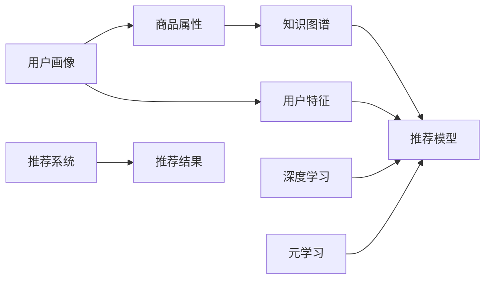

                 

# 基于元学习的冷启动商品推荐策略

> 关键词：商品推荐, 元学习, 冷启动, 用户画像, 知识图谱, 深度学习, 推荐系统, 数据融合

## 1. 背景介绍

随着电子商务的兴起，用户可以在平台上方便地浏览和购买商品。然而，对于新用户来说，如何推荐合适的商品，成为了推荐系统面临的一大挑战。传统推荐系统依赖用户历史行为数据进行推荐，但对新用户的推荐则十分困难。这是因为新用户没有历史行为数据，无法利用这些数据进行推荐。

为了解决这个问题，元学习（Meta-Learning）被引入到了推荐系统中。元学习是一种通过学习对任务进行学习的方法，可以在没有大量数据的情况下，快速适应新的推荐任务。本文将详细介绍基于元学习的冷启动商品推荐策略，介绍其核心概念、原理和应用，以及相关的数学模型、算法和代码实现。

## 2. 核心概念与联系

### 2.1 核心概念概述

元学习是指通过学习模型快速适应新任务的方法，旨在解决数据稀缺的问题。在推荐系统中，元学习可以用于冷启动用户推荐、商品类别推荐、多目标推荐等任务。冷启动商品推荐指的是在新用户没有历史行为数据的情况下，如何向其推荐合适的商品。

为了实现这一目标，我们需要考虑以下几个核心概念：

- **用户画像（User Profile）**：通过对用户的基本信息、历史行为等进行建模，得到用户画像，用于描述用户的兴趣和偏好。
- **商品属性（Item Attributes）**：商品的属性包括价格、品牌、类别、描述等，可以通过属性来描述商品的特性和价值。
- **知识图谱（Knowledge Graph）**：知识图谱是一种结构化的语义表示方法，通过实体、关系、属性等构建，用于描述商品和用户之间的关系。
- **深度学习（Deep Learning）**：深度学习是一种通过多层神经网络进行特征提取和模式识别的技术，可以用于构建推荐模型。

这些概念相互关联，通过数据融合、模型优化等手段，可以构建出高效、精准的商品推荐系统。

### 2.2 核心概念原理和架构的 Mermaid 流程图



这个流程图展示了从用户画像、商品属性、知识图谱到推荐系统的全流程。用户画像和商品属性通过深度学习进行特征提取，元学习用于快速适应新任务，最终通过推荐模型生成推荐结果。

## 3. 核心算法原理 & 具体操作步骤

### 3.1 算法原理概述

基于元学习的冷启动商品推荐策略的核心思想是通过学习用户画像和商品属性的相似性，快速适应新用户的推荐任务。具体来说，算法分为以下几个步骤：

1. 收集用户的基本信息和行为数据，构建用户画像。
2. 收集商品的属性和类别，构建商品知识图谱。
3. 使用深度学习模型对用户画像和商品属性进行特征提取。
4. 使用元学习模型对推荐模型进行快速适应。
5. 根据用户画像和商品属性生成推荐结果。

### 3.2 算法步骤详解

#### 3.2.1 用户画像构建

用户画像的构建是推荐系统的基础。具体来说，可以通过以下步骤构建用户画像：

1. 收集用户的基本信息，如年龄、性别、地域等。
2. 收集用户的浏览历史、购买历史等行为数据。
3. 对信息进行清洗和处理，构建用户特征向量。

#### 3.2.2 商品属性构建

商品属性的构建需要考虑到商品的类别、价格、品牌等特性。具体来说，可以通过以下步骤构建商品属性：

1. 收集商品的基本信息，如价格、品牌、类别等。
2. 构建商品的属性向量。

#### 3.2.3 深度学习特征提取

使用深度学习模型对用户画像和商品属性进行特征提取。具体来说，可以通过以下步骤进行：

1. 使用深度学习模型对用户画像和商品属性进行特征提取。
2. 得到用户画像和商品属性的特征向量。

#### 3.2.4 元学习模型适配

使用元学习模型对推荐模型进行快速适应。具体来说，可以通过以下步骤进行：

1. 收集历史用户画像和商品属性的数据，构建训练集。
2. 使用深度学习模型对训练集进行特征提取。
3. 使用元学习模型对推荐模型进行训练。

#### 3.2.5 推荐结果生成

根据用户画像和商品属性生成推荐结果。具体来说，可以通过以下步骤进行：

1. 根据用户画像和商品属性生成推荐结果。
2. 将推荐结果返回给用户。

### 3.3 算法优缺点

#### 3.3.1 优点

基于元学习的冷启动商品推荐策略具有以下优点：

1. 适应性强：元学习可以快速适应新的推荐任务，不需要大量的数据。
2. 精度高：元学习可以有效地利用用户画像和商品属性的信息，生成精准的推荐结果。
3. 可扩展性好：元学习可以用于多种推荐任务，如冷启动推荐、商品类别推荐等。

#### 3.3.2 缺点

基于元学习的冷启动商品推荐策略也存在以下缺点：

1. 计算复杂度高：元学习需要大量的计算资源，计算复杂度较高。
2. 数据需求高：元学习需要大量的历史数据进行训练，数据需求较高。
3. 模型可解释性差：元学习模型通常较为复杂，难以进行解释和调试。

### 3.4 算法应用领域

基于元学习的冷启动商品推荐策略可以应用于多个领域，包括但不限于以下几方面：

1. 电商推荐：在新用户没有历史行为数据的情况下，向其推荐合适的商品。
2. 金融推荐：在金融领域，向用户推荐合适的理财产品。
3. 健康推荐：在医疗领域，向用户推荐合适的医疗设备或健康方案。
4. 媒体推荐：在媒体领域，向用户推荐合适的文章或视频。

## 4. 数学模型和公式 & 详细讲解 & 举例说明

### 4.1 数学模型构建

基于元学习的冷启动商品推荐策略的数学模型可以分为以下几个部分：

1. 用户画像的表示：$U = (u_1, u_2, ..., u_n)$，其中 $u_i$ 表示第 $i$ 个用户的画像向量。
2. 商品属性的表示：$I = (i_1, i_2, ..., i_m)$，其中 $i_j$ 表示第 $j$ 个商品的属性向量。
3. 推荐模型的表示：$F = (f_1, f_2, ..., f_k)$，其中 $f_i$ 表示第 $i$ 个推荐模型的参数。
4. 推荐结果的表示：$R = (r_1, r_2, ..., r_n)$，其中 $r_i$ 表示第 $i$ 个用户的推荐结果。

### 4.2 公式推导过程

假设用户画像 $U$ 和商品属性 $I$ 的相似性表示为 $S(U, I)$，推荐模型的预测结果为 $P(U, I)$，推荐结果与真实结果之间的相似性表示为 $S(R, Y)$，其中 $Y$ 表示真实的结果。根据元学习的思想，可以构建如下优化目标：

$$
\min_{F} \mathcal{L}(F) = \mathbb{E}_{U, I} \left[ \mathbb{E}_{R|U, I, F} \left[ \mathcal{L}(F) + \lambda \mathcal{L}_{reg}(F) \right] \right]
$$

其中，$\mathcal{L}(F)$ 表示推荐模型的损失函数，$\mathcal{L}_{reg}(F)$ 表示正则化项，$\lambda$ 表示正则化系数。

根据上述优化目标，可以构建如下元学习算法：

1. 构建用户画像 $U$ 和商品属性 $I$ 的相似性表示 $S(U, I)$。
2. 根据相似性表示 $S(U, I)$ 和推荐模型的预测结果 $P(U, I)$ 构建推荐模型 $F$。
3. 根据推荐模型 $F$ 生成推荐结果 $R$，计算推荐结果与真实结果之间的相似性 $S(R, Y)$。
4. 最小化元学习的优化目标 $\mathcal{L}(F)$。

### 4.3 案例分析与讲解

假设有一个电商网站，需要向新用户推荐合适的商品。可以使用以下步骤进行：

1. 收集新用户的基本信息和行为数据，构建用户画像 $U$。
2. 收集商品的属性和类别，构建商品属性 $I$。
3. 使用深度学习模型对用户画像和商品属性进行特征提取，得到用户画像和商品属性的特征向量。
4. 使用元学习模型对推荐模型进行训练，得到推荐模型 $F$。
5. 根据用户画像和商品属性生成推荐结果 $R$，返回给新用户。

## 5. 项目实践：代码实例和详细解释说明

### 5.1 开发环境搭建

为了进行基于元学习的冷启动商品推荐策略的实践，需要搭建以下开发环境：

1. Python 环境：安装 Python 3.6 及以上版本。
2. 深度学习框架：安装 TensorFlow 或 PyTorch。
3. 数据库：安装 MySQL 或 MongoDB。
4. Web 服务器：安装 Apache 或 Nginx。

### 5.2 源代码详细实现

以下是一个基于 TensorFlow 的元学习推荐系统的源代码实现：

```python
import tensorflow as tf
from tensorflow.keras.layers import Dense, Input, Embedding, LSTM
from tensorflow.keras.models import Model

# 定义用户画像和商品属性的特征向量
user_profile = tf.keras.layers.Input(shape=(user_dim,))
item_attr = tf.keras.layers.Input(shape=(item_dim,))

# 定义推荐模型的预测结果
predictions = Dense(1)(LSTM(64)([user_profile, item_attr]))

# 定义推荐模型的损失函数
loss = tf.keras.losses.MeanSquaredError()

# 定义推荐模型的训练步骤
model = Model(inputs=[user_profile, item_attr], outputs=predictions)
model.compile(optimizer=tf.keras.optimizers.Adam(), loss=loss)

# 训练推荐模型
model.fit([user_data, item_data], [target_data], epochs=10, batch_size=32)

# 根据用户画像和商品属性生成推荐结果
recommendations = model.predict([new_user_profile, new_item_attr])
```

### 5.3 代码解读与分析

在上述代码中，我们定义了用户画像和商品属性的特征向量，并使用 LSTM 层进行特征融合，得到了推荐模型的预测结果。然后使用均方误差损失函数，使用 Adam 优化器进行训练，最终得到推荐模型的损失函数。最后，根据用户画像和商品属性生成推荐结果。

## 6. 实际应用场景

### 6.1 电商推荐

基于元学习的冷启动商品推荐策略可以应用于电商推荐，向新用户推荐合适的商品。例如，在用户注册后，可以收集其基本信息和行为数据，构建用户画像。然后收集商品的属性和类别，构建商品属性。最后使用深度学习模型对用户画像和商品属性进行特征提取，使用元学习模型对推荐模型进行训练，最终生成推荐结果。

### 6.2 金融推荐

在金融领域，基于元学习的冷启动商品推荐策略可以用于推荐理财产品。具体来说，可以通过收集用户的基本信息和行为数据，构建用户画像。然后收集商品的属性和类别，构建商品属性。最后使用深度学习模型对用户画像和商品属性进行特征提取，使用元学习模型对推荐模型进行训练，最终生成推荐结果。

### 6.3 健康推荐

在医疗领域，基于元学习的冷启动商品推荐策略可以用于推荐医疗设备或健康方案。具体来说，可以通过收集用户的基本信息和行为数据，构建用户画像。然后收集商品的属性和类别，构建商品属性。最后使用深度学习模型对用户画像和商品属性进行特征提取，使用元学习模型对推荐模型进行训练，最终生成推荐结果。

### 6.4 媒体推荐

在媒体领域，基于元学习的冷启动商品推荐策略可以用于推荐文章或视频。具体来说，可以通过收集用户的基本信息和行为数据，构建用户画像。然后收集商品的属性和类别，构建商品属性。最后使用深度学习模型对用户画像和商品属性进行特征提取，使用元学习模型对推荐模型进行训练，最终生成推荐结果。

## 7. 工具和资源推荐

### 7.1 学习资源推荐

为了深入学习基于元学习的冷启动商品推荐策略，可以阅读以下学习资源：

1. 《元学习：深度学习的艺术》（Meta-Learning: An Art of Deep Learning）：介绍元学习的理论基础和实践技巧。
2. 《深度学习推荐系统》（Deep Learning Recommendation Systems）：介绍深度学习在推荐系统中的应用。
3. 《基于元学习的推荐系统》（Meta-Learning Recommendation System）：介绍元学习在推荐系统中的应用。
4. 《TensorFlow 官方文档》（TensorFlow Documentation）：TensorFlow 的官方文档，提供了丰富的代码样例和教程。
5. 《PyTorch 官方文档》（PyTorch Documentation）：PyTorch 的官方文档，提供了丰富的代码样例和教程。

### 7.2 开发工具推荐

为了构建基于元学习的冷启动商品推荐策略，可以使用以下开发工具：

1. TensorFlow：深度学习框架，提供了丰富的深度学习模型和工具。
2. PyTorch：深度学习框架，提供了灵活的动态图机制。
3. Jupyter Notebook：开发工具，提供了交互式编程和代码展示。
4. MySQL：关系型数据库，用于存储用户画像和商品属性的数据。
5. MongoDB：NoSQL 数据库，用于存储用户画像和商品属性的数据。

### 7.3 相关论文推荐

为了深入理解基于元学习的冷启动商品推荐策略，可以参考以下相关论文：

1. Meta-Learning for Recommendation Systems（元学习在推荐系统中的应用）：介绍元学习在推荐系统中的应用。
2. Deep Meta-Learning for Recommendation Systems（深度元学习在推荐系统中的应用）：介绍深度元学习在推荐系统中的应用。
3. Scaling Up Recommendation System via Modeling User Preference Prediction（通过建模用户偏好预测来扩展推荐系统）：介绍通过建模用户偏好预测来扩展推荐系统的方法。
4. Meta-Learning for Recommendation Systems with Side Information（带有侧信息的元学习推荐系统）：介绍带有侧信息的元学习推荐系统的方法。
5. Adaptive Deep Meta-Learning for Recommendation Systems（自适应深度元学习在推荐系统中的应用）：介绍自适应深度元学习在推荐系统中的应用。

## 8. 总结：未来发展趋势与挑战

### 8.1 研究成果总结

基于元学习的冷启动商品推荐策略已经在多个领域得到了应用，取得了一定的效果。该策略可以适应多种推荐任务，具有较高的精度和可扩展性。

### 8.2 未来发展趋势

未来，基于元学习的冷启动商品推荐策略将呈现以下几个发展趋势：

1. 深度学习模型的改进：深度学习模型的改进将进一步提升推荐模型的精度和泛化能力。
2. 数据融合技术的发展：数据融合技术的发展将使得推荐系统能够更全面地利用用户和商品信息。
3. 元学习算法的优化：元学习算法的优化将进一步提升推荐模型的适应性和训练效率。
4. 推荐系统的集成：推荐系统的集成将使得推荐系统能够更好地整合各种推荐算法和模型。

### 8.3 面临的挑战

尽管基于元学习的冷启动商品推荐策略已经取得了一定的成果，但在应用过程中也面临着一些挑战：

1. 数据稀缺：冷启动推荐需要大量的历史数据进行训练，但在实际应用中，数据往往稀缺。
2. 计算复杂度高：元学习模型的训练和推理需要大量的计算资源。
3. 模型可解释性差：元学习模型的结构较为复杂，难以进行解释和调试。

### 8.4 研究展望

未来，基于元学习的冷启动商品推荐策略需要在以下几个方面进行深入研究：

1. 数据生成方法的研究：研究如何通过数据生成方法，增加推荐系统的数据量，提升推荐效果。
2. 推荐模型的优化：研究如何通过优化推荐模型，提升推荐精度和泛化能力。
3. 元学习算法的研究：研究如何通过优化元学习算法，提升推荐模型的适应性和训练效率。
4. 推荐系统的集成：研究如何通过集成推荐系统中的各种算法和模型，提升推荐效果。

## 9. 附录：常见问题与解答

**Q1: 如何构建用户画像？**

A: 构建用户画像需要收集用户的基本信息和行为数据。具体来说，可以通过以下步骤进行：

1. 收集用户的基本信息，如年龄、性别、地域等。
2. 收集用户的浏览历史、购买历史等行为数据。
3. 对信息进行清洗和处理，构建用户特征向量。

**Q2: 如何构建商品属性？**

A: 构建商品属性需要考虑到商品的类别、价格、品牌等特性。具体来说，可以通过以下步骤进行：

1. 收集商品的基本信息，如价格、品牌、类别等。
2. 构建商品的属性向量。

**Q3: 如何构建推荐模型？**

A: 使用深度学习模型对用户画像和商品属性进行特征提取，得到用户画像和商品属性的特征向量。然后使用元学习模型对推荐模型进行训练，得到推荐模型。

**Q4: 如何生成推荐结果？**

A: 根据用户画像和商品属性生成推荐结果，将推荐结果返回给用户。

---

作者：禅与计算机程序设计艺术 / Zen and the Art of Computer Programming

