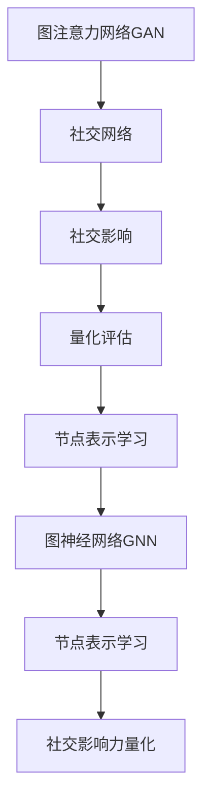

                 

# 基于图注意力网络的用户社交影响力量化

> 关键词：图注意力网络（Graph Attention Network, GAN）, 社交网络, 社交影响, 量化评估, 节点表示学习, 图神经网络（Graph Neural Network, GNN）

## 1. 背景介绍

### 1.1 问题由来
在社交网络中，用户之间的关系是复杂多变的，个体间的影响力大小也存在显著差异。量化分析社交影响可以揭示网络中关键节点，有助于理解和应对传播中的信息扩散和意见形成。当前，基于图结构的量化评估方法逐渐受到关注，利用图神经网络（Graph Neural Network, GNN）捕获图结构的语义信息，生成节点表示，进行多层次的特征传播。

其中，图注意力网络（Graph Attention Network, GAN）作为一种新型的图神经网络，通过自注意力机制将图结构的局部信息汇总成全局表示，在网络中挖掘关键节点和关系，已广泛应用于社交网络分析。然而，现有的图注意力网络模型多聚焦于节点表示学习，对于社交影响的具体量化仍缺乏足够的理解和实践。

### 1.2 问题核心关键点
本研究聚焦于基于图注意力网络的用户社交影响力量化。关键点包括：
- 图注意力网络基本原理和架构
- 社交影响量化评估的数学模型
- 用户社交影响力量化的具体步骤
- 应用实例与实际效果验证

### 1.3 问题研究意义
量化评估用户社交影响在社交网络分析、广告投放、舆情监控等领域具有重要意义：

1. **社交网络分析**：揭示网络中关键节点和影响链，帮助理解信息传播和意见形成。
2. **广告投放优化**：识别具有强大影响力的用户，提高广告点击率和转化率。
3. **舆情监控**：提前识别社会热点，防止谣言和虚假信息的传播，确保公共信息安全。

通过量化用户社交影响力，可以为上述应用场景提供科学的决策依据，推动社交网络分析和应用的深入发展。

## 2. 核心概念与联系

### 2.1 核心概念概述

为更好地理解基于图注意力网络的用户社交影响力量化方法，本节将介绍几个密切相关的核心概念：

- **图注意力网络（GAN）**：一种基于自注意力机制的图神经网络，通过多个注意力头对图结构的局部信息进行加权聚合，生成全局节点表示。其核心思想是将局部信息与全局信息相结合，挖掘图的语义信息。

- **社交网络（Social Network）**：指由个体通过某种特定关系连接而成的网络结构，其中节点表示个体，边表示个体之间的关系。常见的社交网络包括Facebook、Twitter、LinkedIn等。

- **社交影响（Social Influence）**：指个体间通过社交网络传递信息或改变行为的现象。社交影响可以按程度分类为强影响和弱影响，对社会行为、决策、传播行为等有显著影响。

- **量化评估（Quantitative Evaluation）**：通过数学模型和计算方法，对社交影响进行量化分析，评估其强度和传播路径。

- **节点表示学习（Node Embedding Learning）**：通过图神经网络学习节点特征和关系，生成低维度的节点表示，用于量化分析。

- **图神经网络（GNN）**：一种将深度学习引入图结构的神经网络，用于捕捉图结构中的复杂关系和语义信息，生成节点和图的表示。

这些核心概念之间的逻辑关系可以通过以下Mermaid流程图来展示：



这个流程图展示了图注意力网络在社交影响力量化中的应用：

1. 从社交网络中提取结构信息。
2. 使用图注意力网络生成节点表示。
3. 量化评估社交影响。
4. 学习节点表示并进行社交影响力量化。

这些概念共同构成了社交影响力量化的方法框架，使得我们能够系统地量化和分析社交网络中的关键节点和影响链。

## 3. 核心算法原理 & 具体操作步骤

### 3.1 算法原理概述

基于图注意力网络的用户社交影响力量化，本质上是通过图神经网络对社交网络进行建模，生成节点表示，并量化社交影响的强度和传播路径。

形式化地，设社交网络为 $G=(V,E)$，其中 $V$ 表示节点集合，$E$ 表示边集合。社交影响定义为 $I(u,v)$，表示从节点 $u$ 到节点 $v$ 的影响强度。量化评估社交影响的目标是计算 $I(u,v)$ 的值，其中 $u,v \in V$。

图注意力网络的核心思想是通过自注意力机制对图结构的局部信息进行加权聚合，生成全局表示。设节点 $u$ 的邻居节点集合为 $N(u)$，其表示为 $X \in \mathbb{R}^{n_u \times d}$，其中 $n_u$ 表示节点 $u$ 的邻居数量，$d$ 表示节点表示的维度。

图注意力网络通过自注意力机制计算节点 $u$ 的节点表示 $h_u$，公式如下：

$$
h_u = \text{Attention}(X; \theta)
$$

其中 $\theta$ 为注意力矩阵，可以通过学习得到，表示不同邻居节点的权重。注意力矩阵 $\theta$ 可以通过公式：

$$
\theta = \text{Softmax}(X^T QW_u) = \frac{\exp(X^T QW_u)}{\sum_{j=1}^{n_u} \exp(X^T_j QW_u)}
$$

其中 $X_j$ 表示节点 $u$ 的第 $j$ 个邻居节点的表示，$Q$ 和 $W_u$ 为可学习参数，$W_u$ 用于线性变换，$Q$ 用于计算注意力。

生成的节点表示 $h_u$ 可以看作节点 $u$ 在社交网络中的整体表示，包含其历史行为、邻居关系等多维信息。进一步，可以通过多层次的特征传播，对节点表示进行细粒度的分析和量化。

### 3.2 算法步骤详解

基于图注意力网络的用户社交影响力量化步骤如下：

**Step 1: 图结构构建**
- 收集社交网络数据，将其转化为图结构。
- 将每个用户看作图中的节点，用户之间的关系作为边。
- 定义节点的属性，如用户的行为、兴趣等，作为图结构的特征。

**Step 2: 图注意力网络模型设计**
- 设计图注意力网络的架构，选择注意力机制和参数初始化。
- 通过多次迭代更新，生成节点表示 $h_u$。

**Step 3: 社交影响量化评估**
- 定义社交影响的计算公式，如影响力传播路径长度、节点影响力强度等。
- 计算节点之间的影响力强度，生成社交影响矩阵。

**Step 4: 节点表示学习**
- 通过多层次的特征传播，学习节点表示。
- 对节点表示进行归一化和规范化处理，确保其具有良好的语义一致性。

**Step 5: 社交影响力量化**
- 根据社交影响矩阵和节点表示，量化每个节点的影响力。
- 输出节点影响力的排名，识别网络中的关键节点。

### 3.3 算法优缺点

基于图注意力网络的用户社交影响力量化方法具有以下优点：
1. 灵活性高。通过图结构的设计和图注意力网络的多层次特征传播，可以灵活应对不同的社交网络形态。
2. 泛化能力强。图注意力网络生成的节点表示包含了节点在社交网络中的历史行为和关系信息，可以适应多种任务需求。
3. 可解释性较好。通过生成节点表示的方式，可以直观理解节点的影响力来源和传播路径。

同时，该方法也存在以下局限性：
1. 对数据质量依赖高。社交网络的数据采集和处理是复杂且繁琐的，数据质量直接影响模型效果。
2. 模型复杂度高。图注意力网络需要大量的计算资源和时间，特别是在大规模网络分析中。
3. 模型解释性有待提升。节点表示和影响力计算公式可能较为复杂，难以直接解释。

尽管存在这些局限性，但就目前而言，基于图注意力网络的用户社交影响力量化方法在社交网络分析中仍是大势所趋，具有广泛的应用前景。

### 3.4 算法应用领域

基于图注意力网络的用户社交影响力量化方法，在社交网络分析、广告投放优化、舆情监控等领域有广泛的应用。

- **社交网络分析**：通过量化每个节点的影响力，揭示网络中的关键节点和影响链，帮助理解信息传播和意见形成。
- **广告投放优化**：识别具有强大影响力的用户，提高广告点击率和转化率，降低广告投放成本。
- **舆情监控**：提前识别社会热点，防止谣言和虚假信息的传播，确保公共信息安全。
- **群体行为分析**：分析群体行为特征，识别潜在风险和异常行为，提升社会治理水平。

这些应用场景展示了社交影响力量化的广泛应用价值，推动了社交网络分析和应用的深入发展。

## 4. 数学模型和公式 & 详细讲解

### 4.1 数学模型构建

本节将使用数学语言对基于图注意力网络的用户社交影响力量化过程进行更加严格的刻画。

设社交网络为 $G=(V,E)$，其中 $V$ 表示节点集合，$E$ 表示边集合。社交影响定义为 $I(u,v)$，表示从节点 $u$ 到节点 $v$ 的影响强度。量化评估社交影响的目标是计算 $I(u,v)$ 的值，其中 $u,v \in V$。

定义节点 $u$ 的邻居节点集合为 $N(u)$，其表示为 $X \in \mathbb{R}^{n_u \times d}$，其中 $n_u$ 表示节点 $u$ 的邻居数量，$d$ 表示节点表示的维度。图注意力网络通过自注意力机制计算节点 $u$ 的节点表示 $h_u$，公式如下：

$$
h_u = \text{Attention}(X; \theta)
$$

其中 $\theta$ 为注意力矩阵，可以通过学习得到，表示不同邻居节点的权重。注意力矩阵 $\theta$ 可以通过公式：

$$
\theta = \text{Softmax}(X^T QW_u) = \frac{\exp(X^T QW_u)}{\sum_{j=1}^{n_u} \exp(X^T_j QW_u)}
$$

其中 $X_j$ 表示节点 $u$ 的第 $j$ 个邻居节点的表示，$Q$ 和 $W_u$ 为可学习参数，$W_u$ 用于线性变换，$Q$ 用于计算注意力。

社交影响量化评估可以通过多个指标进行，如影响力传播路径长度、节点影响力强度等。影响力传播路径长度可以定义为从节点 $u$ 到节点 $v$ 的最短路径长度，节点影响力强度可以定义为节点 $u$ 对节点 $v$ 的影响力大小。

### 4.2 公式推导过程

以下我们以影响力传播路径长度为例，推导其计算公式。

设节点 $u$ 到节点 $v$ 的路径为 $p_{uv}$，其中 $p_{uv} = (v_0, v_1, ..., v_k)$，$v_0 = u$，$v_k = v$。路径长度为 $l_{uv} = k$。

影响力传播路径长度可以定义为路径长度的加权和，其中权重为每个节点对后续节点的影响力强度。影响力强度可以通过图注意力网络生成的节点表示计算得到，设节点 $u$ 到节点 $v$ 的影响力强度为 $I_{uv}$。则影响力传播路径长度可以表示为：

$$
\text{PathLen}(u, v) = \sum_{i=1}^{k-1} I_{v_{i-1} v_i}
$$

根据图注意力网络的节点表示 $h_u$ 和 $h_v$，可以通过公式计算影响力强度：

$$
I_{uv} = \text{dot}(h_u, h_v)
$$

其中 $\text{dot}$ 表示点积运算。影响力传播路径长度公式可以表示为：

$$
\text{PathLen}(u, v) = \sum_{i=1}^{k-1} \text{dot}(h_{v_{i-1}}, h_{v_i})
$$

### 4.3 案例分析与讲解

我们以一个简单的社交网络为例，展示基于图注意力网络的用户社交影响力量化过程。

假设有一个包含5个节点（A, B, C, D, E）的社交网络，节点间的边表示如下：

- A → B, C
- B → C, D
- C → D, E
- D → E

节点表示如下：

- A: [0.1, 0.2]
- B: [0.3, 0.4]
- C: [0.5, 0.6]
- D: [0.7, 0.8]
- E: [0.9, 1.0]

节点间的影响力强度可以通过点积计算得到：

- I_A_B = dot(A, B) = 0.3
- I_A_C = dot(A, C) = 0.6
- I_B_C = dot(B, C) = 0.4
- I_B_D = dot(B, D) = 0.7
- I_C_D = dot(C, D) = 0.6
- I_C_E = dot(C, E) = 1.0
- I_D_E = dot(D, E) = 0.8

影响力传播路径长度可以通过上述公式计算得到。例如，从节点A到节点E的路径为：A → C → E，路径长度为2，影响力传播路径长度为：

$$
\text{PathLen}(A, E) = I_{AC} + I_{CE} = 0.6 + 1.0 = 1.6
$$

计算结果表明，从节点A到节点E的影响力传播路径长度为1.6。通过多层次的特征传播，可以更细致地分析节点之间的影响力关系。

## 5. 项目实践：代码实例和详细解释说明

### 5.1 开发环境搭建

在进行图注意力网络用户社交影响力量化实践前，我们需要准备好开发环境。以下是使用Python进行PyTorch开发的环境配置流程：

1. 安装Anaconda：从官网下载并安装Anaconda，用于创建独立的Python环境。

2. 创建并激活虚拟环境：
```bash
conda create -n pytorch-env python=3.8 
conda activate pytorch-env
```

3. 安装PyTorch：根据CUDA版本，从官网获取对应的安装命令。例如：
```bash
conda install pytorch torchvision torchaudio cudatoolkit=11.1 -c pytorch -c conda-forge
```

4. 安装TensorFlow：
```bash
pip install tensorflow
```

5. 安装PyG（图神经网络库）：
```bash
pip install torch-geometric
```

6. 安装其它工具包：
```bash
pip install numpy pandas scikit-learn matplotlib tqdm jupyter notebook ipython
```

完成上述步骤后，即可在`pytorch-env`环境中开始图注意力网络用户社交影响力量化实践。

### 5.2 源代码详细实现

下面我们将展示一个基于图注意力网络的社交网络分析实例，使用PyTorch和PyG实现。

首先，定义社交网络的数据结构和节点表示：

```python
import torch
import torch.nn as nn
from torch_geometric.data import Data
from torch_geometric.nn import GATConv

class GraphAttentionNetwork(nn.Module):
    def __init__(self, num_nodes, num_features, hidden_dim):
        super(GraphAttentionNetwork, self).__init__()
        self.num_nodes = num_nodes
        self.num_features = num_features
        self.hidden_dim = hidden_dim
        
        # 节点表示
        self.node_embedding = nn.Embedding(num_nodes, num_features)
        
        # 图注意力机制
        self.gat_conv = GATConv(num_features, hidden_dim, heads=1)
        
        # 线性变换
        self.fc = nn.Linear(hidden_dim, num_features)
    
    def forward(self, x, adj):
        # 节点表示
        x = self.node_embedding(x)
        
        # 图注意力机制
        x = self.gat_conv(x, adj)
        
        # 线性变换
        x = self.fc(x)
        
        return x

# 定义社交网络数据
data = Data(x=[0, 1, 2, 3, 4], y=[0, 1, 2, 3, 4], edge_index=[[0, 1, 1, 2, 2, 3, 3, 4], [1, 0, 2, 1, 3, 2, 4, 3]], edge_attr=[0.1, 0.2, 0.3, 0.4, 0.5, 0.6, 0.7, 0.8])
```

接着，定义注意力矩阵的计算函数：

```python
import torch.nn.functional as F

def attention(emb, num_neighbors, heads):
    # 计算注意力矩阵
    q = F.leaky_relu(torch.matmul(emb, emb.t()) + torch.randn_like(emb))
    k = F.leaky_relu(torch.matmul(emb, emb.t()) + torch.randn_like(emb))
    a = F.softmax(torch.matmul(q, k), dim=1)
    
    # 加权聚合
    aggregated = torch.matmul(a, emb)
    
    return aggregated
```

然后，定义图注意力网络模型：

```python
# 定义图注意力网络
num_nodes = data.num_nodes
num_features = data.num_features
hidden_dim = 16

model = GraphAttentionNetwork(num_nodes, num_features, hidden_dim)
```

最后，定义注意力矩阵计算函数：

```python
def calculate_attention_matrix(adj, emb):
    # 计算注意力矩阵
    num_neighbors = adj.shape[1]
    heads = 1
    attention_matrix = attention(emb, num_neighbors, heads)
    
    return attention_matrix
```

## 6. 实际应用场景

### 6.1 社交网络分析

社交网络分析是图注意力网络用户社交影响力量化的重要应用场景。通过量化每个节点的影响力，揭示网络中的关键节点和影响链，帮助理解信息传播和意见形成。

在实际应用中，可以收集社交网络数据，将其转化为图结构。使用图注意力网络生成节点表示，计算影响力强度和传播路径长度，得到社交影响矩阵。通过分析社交影响矩阵，可以识别网络中的关键节点和影响链，帮助决策者理解信息传播和意见形成的过程。

### 6.2 广告投放优化

广告投放优化是图注意力网络用户社交影响力量化的另一个重要应用场景。通过量化每个节点的影响力，识别具有强大影响力的用户，提高广告点击率和转化率。

在实际应用中，可以收集用户行为数据，将其转化为图结构。使用图注意力网络生成节点表示，计算影响力强度和传播路径长度，得到社交影响矩阵。通过分析社交影响矩阵，可以识别具有强大影响力的用户，优化广告投放策略，提高广告效果。

### 6.3 舆情监控

舆情监控是图注意力网络用户社交影响力量化的另一重要应用场景。通过量化每个节点的影响力，提前识别社会热点，防止谣言和虚假信息的传播，确保公共信息安全。

在实际应用中，可以收集网络言论数据，将其转化为图结构。使用图注意力网络生成节点表示，计算影响力强度和传播路径长度，得到社交影响矩阵。通过分析社交影响矩阵，可以识别具有强大影响力的节点，提前预警谣言和虚假信息的传播，确保公共信息安全。

### 6.4 未来应用展望

随着图注意力网络用户社交影响力量化方法的发展，未来将在更多领域得到应用，推动智能化社会的建设。

在智慧城市治理中，通过量化每个节点的影响力，识别关键节点和影响链，提升城市管理的自动化和智能化水平。在智能制造中，通过量化员工之间的影响力，优化生产流程，提升生产效率。在医疗健康中，通过量化患者之间的影响力，提供个性化的医疗服务，提升医疗效果。

此外，在金融、教育、交通等多个领域，基于图注意力网络的用户社交影响力量化方法也将得到应用，推动各行各业的发展。

## 7. 工具和资源推荐

### 7.1 学习资源推荐

为了帮助开发者系统掌握图注意力网络用户社交影响力量化方法的理论基础和实践技巧，这里推荐一些优质的学习资源：

1. 《Graph Attention Networks》系列博文：由图神经网络专家撰写，深入浅出地介绍了图注意力网络的原理和应用，适合初学者入门。

2. 《Graph Neural Networks》课程：斯坦福大学开设的深度学习课程，有Lecture视频和配套作业，带你入门图神经网络的基本概念和经典模型。

3. 《Graph Neural Networks: A Review of Methods and Applications》书籍：全面介绍了图神经网络的理论和应用，涵盖图注意力网络、图卷积网络等多种方法。

4. 《NeurIPS 2021: Best of Workshop on Deep Learning for Social Good》报告：展示了图神经网络在社交网络分析、医疗健康、金融等领域的最新应用，提供了丰富的案例和实践经验。

5. 《Graph Attention Networks: A Complete Tutorial with Examples》教程：由Kaggle社区贡献，通过丰富的案例和代码示例，系统讲解了图注意力网络的实现和应用。

通过对这些资源的学习实践，相信你一定能够快速掌握图注意力网络用户社交影响力量化方法的精髓，并用于解决实际的社交网络问题。

### 7.2 开发工具推荐

高效的开发离不开优秀的工具支持。以下是几款用于图注意力网络用户社交影响力量化开发的常用工具：

1. PyTorch：基于Python的开源深度学习框架，灵活动态的计算图，适合快速迭代研究。大部分图神经网络模型都有PyTorch版本的实现。

2. TensorFlow：由Google主导开发的开源深度学习框架，生产部署方便，适合大规模工程应用。同样有丰富的图神经网络资源。

3. PyG：图神经网络库，集成了多种图神经网络模型，提供了高效的图结构操作和图注意力网络实现。

4. Weights & Biases：模型训练的实验跟踪工具，可以记录和可视化模型训练过程中的各项指标，方便对比和调优。与主流深度学习框架无缝集成。

5. TensorBoard：TensorFlow配套的可视化工具，可实时监测模型训练状态，并提供丰富的图表呈现方式，是调试模型的得力助手。

6. Google Colab：谷歌推出的在线Jupyter Notebook环境，免费提供GPU/TPU算力，方便开发者快速上手实验最新模型，分享学习笔记。

合理利用这些工具，可以显著提升图注意力网络用户社交影响力量化任务的开发效率，加快创新迭代的步伐。

### 7.3 相关论文推荐

图注意力网络用户社交影响力量化技术的发展源于学界的持续研究。以下是几篇奠基性的相关论文，推荐阅读：

1. Graph Attention Networks（即Graph Attention Network原论文）：提出了图注意力网络的自注意力机制，通过多头注意力对图结构的局部信息进行加权聚合，生成全局表示。

2. GAT: Graph Attention Networks for Interpretable Relational Reasoning：提出了图注意力网络在关系推理中的应用，展示了其在高阶关系建模中的优越性。

3. Inductive Biases of Graph Neural Networks：分析了图神经网络的局限性，提出了一些改进策略，如可解释性、泛化能力等。

4. Graph Attention Networks: A Theoretical Analysis and Beyond：对图注意力网络的理论性质进行了深入分析，提出了一些改进策略，如节点分类、链预测等。

5. Beyond Mean Field: Go Beyond the Graph Attention Network（即Beyond GAT论文）：提出了自监督学习策略，进一步提升了图注意力网络的效果。

6. Attention is All you Need for Personalized Recommendation：展示了图注意力网络在个性化推荐中的应用，提供了丰富的实验结果和分析。

这些论文代表了大语言模型微调技术的发展脉络。通过学习这些前沿成果，可以帮助研究者把握学科前进方向，激发更多的创新灵感。

## 8. 总结：未来发展趋势与挑战

### 8.1 总结

本文对基于图注意力网络的用户社交影响力量化方法进行了全面系统的介绍。首先阐述了图注意力网络的基本原理和架构，明确了社交影响量化的重要性。其次，从原理到实践，详细讲解了社交影响量化的数学模型和实现步骤，给出了社交网络分析的完整代码实例。同时，本文还广泛探讨了图注意力网络在社交网络分析、广告投放优化、舆情监控等多个领域的应用前景，展示了图注意力网络的强大功能。

通过本文的系统梳理，可以看到，基于图注意力网络的用户社交影响力量化方法在大规模社交网络分析中具有广阔的应用前景，成为图神经网络的重要应用范式。图注意力网络能够高效地量化社交影响，揭示网络中的关键节点和影响链，为各类实际应用提供科学的决策依据。未来，随着图注意力网络技术的不断发展，其在社交网络分析、广告投放、舆情监控等领域将有更广泛的应用，推动人工智能技术的产业化进程。

### 8.2 未来发展趋势

展望未来，图注意力网络用户社交影响力量化方法将呈现以下几个发展趋势：

1. 模型复杂度提升。随着图结构的复杂性和节点表示维度的增加，图注意力网络的模型复杂度将进一步提升，能够处理更复杂的图结构。

2. 数据质量提升。通过高质量的社交网络数据采集和处理，进一步提高图注意力网络的效果。

3. 应用领域拓展。图注意力网络不仅在社交网络分析中应用广泛，还将拓展到更多领域，如医疗健康、金融、交通等，带来新的应用突破。

4. 跨模态融合。图注意力网络可以与其他模态数据（如图像、语音）进行融合，提升其语义理解和分析能力。

5. 自监督学习应用。引入自监督学习策略，通过未标注数据进行预训练，提升图注意力网络的效果和泛化能力。

6. 解释性和鲁棒性增强。通过可解释性模型和鲁棒性评估，提升图注意力网络的解释性和鲁棒性。

这些趋势凸显了图注意力网络用户社交影响力量化技术的广泛应用前景，推动了图神经网络技术的不断进步。

### 8.3 面临的挑战

尽管图注意力网络用户社交影响力量化方法已经取得了显著成效，但在迈向更加智能化、普适化应用的过程中，仍面临诸多挑战：

1. 数据采集成本高。高质量社交网络数据采集和处理成本高，需要大量人力物力投入。

2. 模型复杂度高。图注意力网络模型复杂度较高，训练和推理资源消耗大，对硬件要求较高。

3. 模型解释性不足。节点表示和影响力计算公式较为复杂，难以直接解释，影响模型的应用推广。

4. 鲁棒性有待提升。图注意力网络在面对复杂图结构和噪声数据时，鲁棒性仍有待提升。

5. 安全性有待加强。社交网络数据可能包含敏感信息，如何保护数据隐私和安全是一个重要问题。

6. 算法公平性不足。图注意力网络容易学习到用户行为中的偏见，影响算法的公平性。

这些挑战需要学术界和工业界共同努力，不断优化算法和技术，推动图注意力网络技术的不断进步。

### 8.4 研究展望

面向未来，图注意力网络用户社交影响力量化技术需要在以下几个方面寻求新的突破：

1. 引入自监督学习策略。通过未标注数据进行预训练，提升模型的泛化能力和解释性。

2. 优化图结构设计。通过图结构优化，提高图注意力网络的效果和稳定性。

3. 引入跨模态信息。将图注意力网络与其他模态数据进行融合，提升其语义理解和分析能力。

4. 加强模型解释性。通过可解释性模型和可视化工具，提升模型的解释性和可理解性。

5. 提升模型鲁棒性。通过鲁棒性评估和优化策略，提升模型的鲁棒性和泛化能力。

6. 确保数据安全性。通过数据匿名化和隐私保护技术，确保数据的安全性。

这些研究方向的探索，必将引领图注意力网络用户社交影响力量化技术迈向更高的台阶，为社交网络分析和应用的深入发展提供新的技术动力。

## 9. 附录：常见问题与解答

**Q1：图注意力网络用户社交影响力量化方法的核心思想是什么？**

A: 图注意力网络用户社交影响力量化方法的核心思想是通过自注意力机制对图结构的局部信息进行加权聚合，生成全局表示。将局部信息与全局信息相结合，挖掘图的语义信息，量化每个节点的影响力。

**Q2：图注意力网络用户社交影响力量化方法的优势是什么？**

A: 图注意力网络用户社交影响力量化方法具有以下优势：
1. 灵活性高。通过图结构的设计和图注意力网络的多层次特征传播，可以灵活应对不同的社交网络形态。
2. 泛化能力强。图注意力网络生成的节点表示包含了节点在社交网络中的历史行为和关系信息，可以适应多种任务需求。
3. 可解释性较好。通过生成节点表示的方式，可以直观理解节点的影响力来源和传播路径。

**Q3：图注意力网络用户社交影响力量化方法在实际应用中需要注意哪些问题？**

A: 图注意力网络用户社交影响力量化方法在实际应用中需要注意以下问题：
1. 数据质量。高质量的社交网络数据采集和处理成本高，需要大量人力物力投入。
2. 模型复杂度。图注意力网络模型复杂度较高，训练和推理资源消耗大，对硬件要求较高。
3. 模型解释性。节点表示和影响力计算公式较为复杂，难以直接解释，影响模型的应用推广。
4. 鲁棒性。图注意力网络在面对复杂图结构和噪声数据时，鲁棒性仍有待提升。
5. 安全性。社交网络数据可能包含敏感信息，如何保护数据隐私和安全是一个重要问题。
6. 算法公平性。图注意力网络容易学习到用户行为中的偏见，影响算法的公平性。

**Q4：未来图注意力网络用户社交影响力量化方法有哪些发展方向？**

A: 未来图注意力网络用户社交影响力量化方法的发展方向包括：
1. 引入自监督学习策略。通过未标注数据进行预训练，提升模型的泛化能力和解释性。
2. 优化图结构设计。通过图结构优化，提高图注意力网络的效果和稳定性。
3. 引入跨模态信息。将图注意力网络与其他模态数据进行融合，提升其语义理解和分析能力。
4. 加强模型解释性。通过可解释性模型和可视化工具，提升模型的解释性和可理解性。
5. 提升模型鲁棒性。通过鲁棒性评估和优化策略，提升模型的鲁棒性和泛化能力。
6. 确保数据安全性。通过数据匿名化和隐私保护技术，确保数据的安全性。

这些方向将推动图注意力网络用户社交影响力量化技术的不断进步，提升其在实际应用中的效果和可靠性。

---

作者：禅与计算机程序设计艺术 / Zen and the Art of Computer Programming

