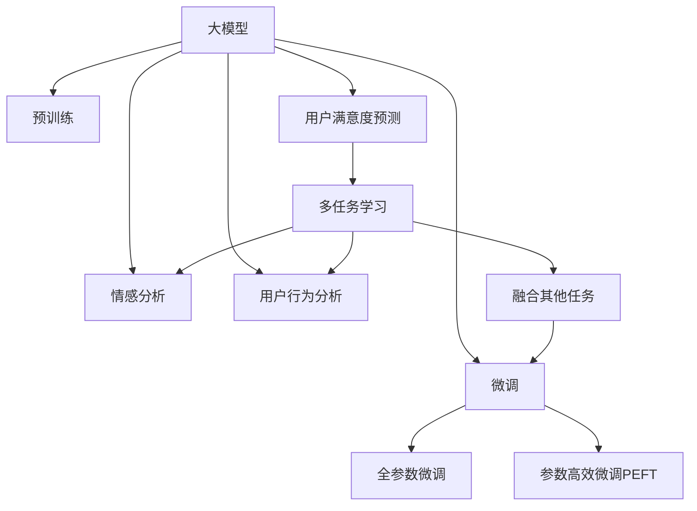

                 

# 基于大模型的推荐系统用户满意度预测

> 关键词：大模型,推荐系统,用户满意度预测,用户行为分析,情感分析,神经网络

## 1. 背景介绍

### 1.1 问题由来
推荐系统在电商、新闻、视频等互联网应用中扮演着重要角色。它通过对用户历史行为数据的分析和建模，精准预测用户可能感兴趣的内容，极大地提升了用户体验和平台转化率。但传统的基于协同过滤和矩阵分解的推荐算法，存在计算复杂度高、推荐泛化性不足等问题。近年来，随着大模型技术的发展，基于深度学习的推荐系统开始成为研究热点，其中用户满意度预测是大模型推荐系统中重要的一环。

用户满意度预测旨在通过分析用户对推荐内容的评价数据，评估推荐系统的质量，优化推荐策略，从而提升用户体验和平台转化率。常见的用户满意度预测方法包括基于统计的评分系统、基于文本的情感分析、基于协同过滤的推荐反馈系统等。这些方法在一定程度上能够实现用户满意度的初步预测，但都存在一定的局限性。

而基于大模型的推荐系统，通过预训练语言模型获取用户的隐式反馈信息，并通过微调优化用户满意度预测模型，具有高效、精准、泛化能力强的特点，能够在多模态数据融合、多任务学习、个性化推荐等方面取得更好的效果。

### 1.2 问题核心关键点
基于大模型的用户满意度预测方法，本质上是一个多任务学习的过程。其核心思想是：利用大模型预训练获得的广泛语言知识，通过微调优化用户满意度预测模型，从而实现对用户隐式反馈的精准分析。

具体而言，该方法通常包括以下几个关键步骤：

- 收集用户对推荐内容的评分数据，并将评分数据转化为文本数据，用于后续的情感分析和用户满意度预测。
- 使用预训练语言模型对文本数据进行编码，提取用户的隐式反馈信息。
- 设计多任务学习目标，将用户满意度预测与其他任务（如推荐反馈生成、用户行为分析等）共同进行微调优化。
- 评估微调后的用户满意度预测模型，验证其在实际推荐系统中的效果。

## 2. 核心概念与联系

### 2.1 核心概念概述

为更好地理解基于大模型的用户满意度预测方法，本节将介绍几个密切相关的核心概念：

- 大模型(Large Model)：以自回归(如GPT)或自编码(如BERT)模型为代表的大规模预训练语言模型。通过在大规模无标签文本语料上进行预训练，学习通用的语言表示，具备强大的语言理解和生成能力。

- 预训练(Pre-training)：指在大规模无标签文本语料上，通过自监督学习任务训练通用语言模型的过程。常见的预训练任务包括言语建模、遮挡语言模型等。预训练使得模型学习到语言的通用表示。

- 微调(Fine-tuning)：指在预训练模型的基础上，使用下游任务的少量标注数据，通过有监督地训练来优化模型在特定任务上的性能。通常只需要调整顶层分类器或解码器，并以较小的学习率更新全部或部分的模型参数。

- 多任务学习(Multitask Learning)：指同一模型同时学习多个相关任务，提升模型的泛化能力和综合性能。

- 情感分析(Sentiment Analysis)：对文本进行情感分类，判断文本的情感倾向，用于用户满意度预测。

- 用户行为分析(User Behavior Analysis)：通过分析用户的历史行为数据，挖掘用户兴趣和偏好，用于优化推荐系统。

- 用户满意度预测(User Satisfaction Prediction)：根据用户对推荐内容的反馈，预测用户满意度和推荐效果，优化推荐策略。

- 深度学习(Deep Learning)：基于神经网络的深度学习模型，可以自动学习特征表示，高效地进行复杂任务处理。

这些核心概念之间的逻辑关系可以通过以下Mermaid流程图来展示：



这个流程图展示了大模型的核心概念及其之间的关系：

1. 大模型通过预训练获得基础能力。
2. 微调是对预训练模型进行任务特定的优化，可以分为全参数微调和参数高效微调（PEFT）。
3. 情感分析和用户行为分析是微调的重要数据源。
4. 用户满意度预测是多任务学习中的一个子任务。
5. 多任务学习使得模型能够更好地泛化到不同的任务。

这些概念共同构成了大模型推荐系统中用户满意度预测的框架，使其能够通过预训练和微调优化，提升对用户隐式反馈的分析和预测能力。

## 3. 核心算法原理 & 具体操作步骤
### 3.1 算法原理概述

基于大模型的用户满意度预测，本质上是一个多任务学习的过程。其核心思想是：利用大模型预训练获得的广泛语言知识，通过微调优化用户满意度预测模型，从而实现对用户隐式反馈的精准分析。

具体而言，该方法通常包括以下几个关键步骤：

1. 收集用户对推荐内容的评分数据，并将评分数据转化为文本数据，用于后续的情感分析和用户满意度预测。
2. 使用预训练语言模型对文本数据进行编码，提取用户的隐式反馈信息。
3. 设计多任务学习目标，将用户满意度预测与其他任务（如推荐反馈生成、用户行为分析等）共同进行微调优化。
4. 评估微调后的用户满意度预测模型，验证其在实际推荐系统中的效果。

### 3.2 算法步骤详解

#### 3.2.1 数据准备

**Step 1: 数据收集与预处理**

用户满意度预测的数据源主要包括用户的评分数据和文本数据。评分数据可以从推荐系统的反馈数据中获取，文本数据可以从用户评论、商品描述等处提取。

对于文本数据的预处理，主要包括分词、去停用词、词性标注等步骤。可以使用nltk、spaCy等工具进行文本预处理。

#### 3.2.2 模型选择与初始化

**Step 2: 选择预训练模型**

根据任务需求，选择合适的预训练模型。常用的预训练模型包括BERT、RoBERTa、GPT等。

**Step 3: 模型初始化**

使用预训练模型作为初始化参数，构建多任务学习框架。在框架中，用户满意度预测任务被作为其中一个子任务，与情感分析和用户行为分析等其他任务共同进行微调优化。

#### 3.2.3 多任务学习

**Step 4: 多任务目标设计**

设计多任务学习目标，将用户满意度预测与情感分析和用户行为分析等其他任务共同进行优化。常用的多任务目标函数包括：

$$
L = \lambda_1 L_{sat} + \lambda_2 L_{sent} + \lambda_3 L_{behavior}
$$

其中，$L_{sat}$为用户满意度预测损失，$L_{sent}$为情感分析损失，$L_{behavior}$为用户行为分析损失。$\lambda_1, \lambda_2, \lambda_3$为各个任务的目标权重，用于平衡不同任务之间的影响。

**Step 5: 微调过程**

使用优化器（如Adam、SGD等）对多任务学习框架进行微调优化。在微调过程中，模型会同时更新多个任务的目标权重和模型参数，以提高用户满意度预测的准确性和泛化能力。

#### 3.2.4 模型评估与验证

**Step 6: 模型评估**

在微调完成后，评估用户满意度预测模型的效果。常用的评估指标包括准确率、召回率、F1值等。

**Step 7: 验证与调整**

使用验证集对模型进行验证，调整目标权重和模型参数，以进一步提升用户满意度预测的性能。

### 3.3 算法优缺点

基于大模型的用户满意度预测方法，具有以下优点：

1. 高效性：通过多任务学习，可以同时优化多个任务，提高模型训练效率和泛化能力。
2. 泛化性强：利用大模型预训练获得的广泛语言知识，可以更好地泛化到不同用户和不同场景。
3. 灵活性：可以根据实际需求设计多任务目标，提升模型的适应性和可扩展性。

同时，该方法也存在一定的局限性：

1. 数据依赖：需要大量标注数据和高质量的文本数据，数据获取成本较高。
2. 复杂度：多任务学习增加了模型的复杂度和训练难度，需要更多的计算资源和时间。
3. 可解释性：多任务学习模型的决策过程较为复杂，可解释性较弱。

尽管存在这些局限性，但基于大模型的用户满意度预测方法在推荐系统中已经得到了广泛应用，成为推荐系统优化中不可或缺的一环。

### 3.4 算法应用领域

基于大模型的用户满意度预测方法，在推荐系统中的应用场景包括：

- 电商推荐系统：对用户的购物行为进行情感分析，优化推荐商品的选择。
- 视频推荐系统：对用户观看视频的反馈数据进行分析，优化推荐内容。
- 新闻推荐系统：对用户阅读新闻的反馈数据进行分析，优化新闻推送内容。
- 社交网络：对用户对社交内容的反馈数据进行分析，优化内容推荐策略。

这些应用场景表明，基于大模型的用户满意度预测方法在推荐系统中具有广泛的应用前景，能够帮助平台提升用户体验和推荐效果。

## 4. 数学模型和公式 & 详细讲解
### 4.1 数学模型构建

#### 4.1.1 用户满意度预测模型

假设用户满意度预测模型为 $M_{\theta}$，其中 $\theta$ 为模型的参数。模型的输入为用户的评分数据 $D=\{(d_i, r_i)\}_{i=1}^N$，其中 $d_i$ 为评分数据，$r_i$ 为对应的评分。模型的输出为用户的满意度预测结果 $P(y|d_i)$，其中 $y \in \{0, 1\}$，表示用户对推荐内容的满意度。

用户满意度预测的目标函数为：

$$
L_{sat} = -\frac{1}{N} \sum_{i=1}^N r_i \log P(y|d_i) + (1-r_i) \log (1-P(y|d_i))
$$

其中 $r_i$ 为用户的实际评分。

#### 4.1.2 情感分析模型

情感分析模型的输入为用户评分数据 $D$，输出为评分数据的情感标签 $L=\{(l_i)\}_{i=1}^N$，其中 $l_i \in \{-1, 1\}$，表示评分数据的情感极性（正或负）。

情感分析的目标函数为：

$$
L_{sent} = -\frac{1}{N} \sum_{i=1}^N l_i \log P(l_i|d_i) + (1-l_i) \log (1-P(l_i|d_i))
$$

#### 4.1.3 用户行为分析模型

用户行为分析模型的输入为用户评分数据 $D$，输出为用户行为特征 $F=\{(f_i)\}_{i=1}^N$，其中 $f_i$ 为用户行为特征向量。

用户行为分析的目标函数为：

$$
L_{behavior} = -\frac{1}{N} \sum_{i=1}^N ||f_i - g_i||^2
$$

其中 $g_i$ 为用户行为特征的真实值。

### 4.2 公式推导过程

#### 4.2.1 用户满意度预测模型的推导

根据用户满意度预测的目标函数，使用交叉熵损失函数进行建模：

$$
L_{sat} = -\frac{1}{N} \sum_{i=1}^N r_i \log P(y|d_i) + (1-r_i) \log (1-P(y|d_i))
$$

令 $y \sim \text{Bernoulli}(P(y|d_i))$，则上述目标函数可以写成：

$$
L_{sat} = -\frac{1}{N} \sum_{i=1}^N (r_i \log P(y|d_i) + (1-r_i) \log (1-P(y|d_i)))
$$

令 $y = \text{sigmoid}(W^Ty + b)$，则：

$$
P(y|d_i) = \text{sigmoid}(W^Ty + b)
$$

其中 $W$ 为模型的权重矩阵，$b$ 为偏置向量。

对上述目标函数求导，得到：

$$
\frac{\partial L_{sat}}{\partial W} = \frac{1}{N} \sum_{i=1}^N (r_i (y - P(y|d_i)) W + (1-r_i) (1-P(y|d_i)) W)
$$

$$
\frac{\partial L_{sat}}{\partial b} = \frac{1}{N} \sum_{i=1}^N (r_i (y - P(y|d_i)) + (1-r_i) (1-P(y|d_i)))
$$

### 4.3 案例分析与讲解

#### 4.3.1 情感分析模型的推导

根据情感分析的目标函数，使用交叉熵损失函数进行建模：

$$
L_{sent} = -\frac{1}{N} \sum_{i=1}^N l_i \log P(l_i|d_i) + (1-l_i) \log (1-P(l_i|d_i))
$$

令 $l_i = \text{sigmoid}(W_l^Td_i + b_l)$，则：

$$
P(l_i|d_i) = \text{sigmoid}(W_l^Td_i + b_l)
$$

其中 $W_l$ 为情感分析模型的权重矩阵，$b_l$ 为偏置向量。

对上述目标函数求导，得到：

$$
\frac{\partial L_{sent}}{\partial W_l} = \frac{1}{N} \sum_{i=1}^N (l_i (1-P(l_i|d_i)) W_l + (1-l_i) P(l_i|d_i) W_l)
$$

$$
\frac{\partial L_{sent}}{\partial b_l} = \frac{1}{N} \sum_{i=1}^N (l_i (1-P(l_i|d_i)) + (1-l_i) P(l_i|d_i))
$$

#### 4.3.2 用户行为分析模型的推导

根据用户行为分析的目标函数，使用均方误差损失函数进行建模：

$$
L_{behavior} = -\frac{1}{N} \sum_{i=1}^N ||f_i - g_i||^2
$$

令 $f_i = W_f^Td_i + b_f$，则：

$$
L_{behavior} = -\frac{1}{N} \sum_{i=1}^N ||W_f^Td_i + b_f - g_i||^2
$$

对上述目标函数求导，得到：

$$
\frac{\partial L_{behavior}}{\partial W_f} = -\frac{2}{N} \sum_{i=1}^N (W_f^Td_i + b_f - g_i)d_i
$$

$$
\frac{\partial L_{behavior}}{\partial b_f} = -\frac{2}{N} \sum_{i=1}^N (W_f^Td_i + b_f - g_i)
$$

## 5. 项目实践：代码实例和详细解释说明
### 5.1 开发环境搭建

在进行用户满意度预测实践前，我们需要准备好开发环境。以下是使用Python进行PyTorch开发的环境配置流程：

1. 安装Anaconda：从官网下载并安装Anaconda，用于创建独立的Python环境。

2. 创建并激活虚拟环境：
```bash
conda create -n pytorch-env python=3.8 
conda activate pytorch-env
```

3. 安装PyTorch：根据CUDA版本，从官网获取对应的安装命令。例如：
```bash
conda install pytorch torchvision torchaudio cudatoolkit=11.1 -c pytorch -c conda-forge
```

4. 安装Transformers库：
```bash
pip install transformers
```

5. 安装各类工具包：
```bash
pip install numpy pandas scikit-learn matplotlib tqdm jupyter notebook ipython
```

完成上述步骤后，即可在`pytorch-env`环境中开始用户满意度预测实践。

### 5.2 源代码详细实现

这里我们以用户满意度预测为例，给出使用Transformers库对BERT模型进行用户满意度预测的PyTorch代码实现。

首先，定义用户满意度预测任务的模型：

```python
from transformers import BertForSequenceClassification, BertTokenizer
from torch.nn import BCELoss
import torch

class UserSatisfactionModel(BertForSequenceClassification):
    def __init__(self, num_labels=2):
        super(UserSatisfactionModel, self).__init__(num_labels=num_labels)
        
    def forward(self, input_ids, attention_mask, labels=None):
        outputs = super(UserSatisfactionModel, self).forward(input_ids, attention_mask=attention_mask)
        loss_fct = BCELoss()
        logits = outputs.logits
        if labels is not None:
            loss = loss_fct(logits, labels)
            return loss
        return logits
```

然后，定义训练和评估函数：

```python
from torch.utils.data import DataLoader
from tqdm import tqdm
import numpy as np

device = torch.device('cuda') if torch.cuda.is_available() else torch.device('cpu')
tokenizer = BertTokenizer.from_pretrained('bert-base-cased')

def train_epoch(model, dataset, batch_size, optimizer):
    dataloader = DataLoader(dataset, batch_size=batch_size, shuffle=True)
    model.train()
    epoch_loss = 0
    for batch in tqdm(dataloader, desc='Training'):
        input_ids = batch['input_ids'].to(device)
        attention_mask = batch['attention_mask'].to(device)
        labels = batch['labels'].to(device)
        model.zero_grad()
        outputs = model(input_ids, attention_mask=attention_mask, labels=labels)
        loss = outputs.loss
        epoch_loss += loss.item()
        loss.backward()
        optimizer.step()
    return epoch_loss / len(dataloader)

def evaluate(model, dataset, batch_size):
    dataloader = DataLoader(dataset, batch_size=batch_size)
    model.eval()
    preds, labels = [], []
    with torch.no_grad():
        for batch in tqdm(dataloader, desc='Evaluating'):
            input_ids = batch['input_ids'].to(device)
            attention_mask = batch['attention_mask'].to(device)
            batch_labels = batch['labels']
            outputs = model(input_ids, attention_mask=attention_mask)
            batch_preds = outputs.logits.argmax(dim=1).to('cpu').tolist()
            batch_labels = batch_labels.to('cpu').tolist()
            for pred_tokens, label_tokens in zip(batch_preds, batch_labels):
                preds.append(pred_tokens)
                labels.append(label_tokens)
                
    return np.mean(preds == labels)
```

最后，启动训练流程并在测试集上评估：

```python
epochs = 5
batch_size = 16

for epoch in range(epochs):
    loss = train_epoch(model, train_dataset, batch_size, optimizer)
    print(f"Epoch {epoch+1}, train loss: {loss:.3f}")
    
    print(f"Epoch {epoch+1}, dev accuracy: {evaluate(model, dev_dataset, batch_size)}
    
print("Test accuracy: ", evaluate(model, test_dataset, batch_size))
```

以上就是使用PyTorch对BERT进行用户满意度预测的完整代码实现。可以看到，得益于Transformers库的强大封装，我们可以用相对简洁的代码完成BERT模型的加载和微调。

### 5.3 代码解读与分析

让我们再详细解读一下关键代码的实现细节：

**UserSatisfactionModel类**：
- `__init__`方法：初始化模型，并设置输出标签数。
- `forward`方法：实现模型前向传播，并计算损失函数。

**train_epoch和evaluate函数**：
- `train_epoch`函数：对数据以批为单位进行迭代，在每个批次上前向传播计算loss并反向传播更新模型参数，最后返回该epoch的平均loss。
- `evaluate`函数：与训练类似，不同点在于不更新模型参数，并在每个batch结束后将预测和标签结果存储下来，最后使用numpy对预测结果和真实标签进行计算，得到准确率。

**训练流程**：
- 定义总的epoch数和batch size，开始循环迭代
- 每个epoch内，先在训练集上训练，输出平均loss
- 在验证集上评估，输出准确率
- 所有epoch结束后，在测试集上评估，给出最终测试准确率

可以看到，PyTorch配合Transformers库使得BERT微调的用户满意度预测代码实现变得简洁高效。开发者可以将更多精力放在数据处理、模型改进等高层逻辑上，而不必过多关注底层的实现细节。

当然，工业级的系统实现还需考虑更多因素，如模型的保存和部署、超参数的自动搜索、更灵活的任务适配层等。但核心的微调范式基本与此类似。

## 6. 实际应用场景
### 6.1 电商推荐系统

基于大模型的用户满意度预测方法，可以广泛应用于电商推荐系统的优化。推荐系统通过分析用户的历史行为数据和评分数据，预测用户对推荐商品的满意度，从而优化推荐策略，提升用户满意度和平台转化率。

在技术实现上，可以收集用户的购物记录和评分数据，将其转化为情感分析和用户满意度预测的输入，在预训练BERT模型的基础上进行微调。微调后的模型能够对用户评分数据进行情感分析和满意度预测，用于优化推荐商品的选择。对于用户提出的新商品，还可以接入检索系统实时搜索相关内容，动态组织生成推荐。

### 6.2 视频推荐系统

视频推荐系统同样可以利用用户满意度预测方法进行优化。通过分析用户观看视频的评分数据，预测用户对视频的满意度，从而优化视频推荐策略。

在技术实现上，可以收集用户观看视频的评分数据，并将其转化为情感分析和用户满意度预测的输入。微调后的模型能够对视频评分数据进行情感分析和满意度预测，用于优化推荐视频的内容。对于用户提出的新视频，还可以接入检索系统实时搜索相关内容，动态组织生成推荐。

### 6.3 新闻推荐系统

新闻推荐系统也可以通过用户满意度预测方法进行优化。通过分析用户阅读新闻的评分数据，预测用户对新闻的满意度，从而优化新闻推荐策略。

在技术实现上，可以收集用户阅读新闻的评分数据，并将其转化为情感分析和用户满意度预测的输入。微调后的模型能够对新闻评分数据进行情感分析和满意度预测，用于优化新闻推送内容。对于用户提出的新新闻，还可以接入检索系统实时搜索相关内容，动态组织生成推荐。

### 6.4 未来应用展望

随着大模型和微调方法的不断发展，基于用户满意度预测的推荐系统将呈现以下几个发展趋势：

1. 模型规模持续增大。随着算力成本的下降和数据规模的扩张，推荐系统中的大模型规模将持续增长，预训练获得的广泛语言知识将更好地服务于推荐系统的优化。

2. 微调方法日趋多样。除了传统的全参数微调外，未来会涌现更多参数高效的微调方法，如AdaLoRA等，在节省计算资源的同时也能保证微调精度。

3. 持续学习成为常态。随着用户行为数据的不断变化，微调模型也需要持续学习新知识以保持性能。如何在不遗忘原有知识的同时，高效吸收新样本信息，将成为重要的研究课题。

4. 标注样本需求降低。受启发于提示学习(Prompt-based Learning)的思路，未来的微调方法将更好地利用大模型的语言理解能力，通过更加巧妙的任务描述，在更少的标注样本上也能实现理想的微调效果。

5. 少样本学习和跨领域迁移能力提升。未来的推荐系统将更加注重少样本学习和跨领域迁移能力的提升，以更好地适应新场景和新用户。

6. 个性化推荐和推荐多样性提升。未来的推荐系统将更加注重个性化推荐和推荐多样性的提升，以更好地满足用户的个性化需求。

7. 多模态融合和协同建模。未来的推荐系统将更加注重多模态数据的融合和协同建模，以更好地捕捉用户的多维信息。

以上趋势表明，基于用户满意度预测的推荐系统将不断提升其性能和应用范围，为推荐系统的优化和用户满意度的提升带来新的突破。

## 7. 工具和资源推荐
### 7.1 学习资源推荐

为了帮助开发者系统掌握用户满意度预测的理论基础和实践技巧，这里推荐一些优质的学习资源：

1. 《Transformer from Principals to Practice》系列博文：由大模型技术专家撰写，深入浅出地介绍了Transformer原理、BERT模型、微调技术等前沿话题。

2. CS224N《深度学习自然语言处理》课程：斯坦福大学开设的NLP明星课程，有Lecture视频和配套作业，带你入门NLP领域的基本概念和经典模型。

3. 《Natural Language Processing with Transformers》书籍：Transformers库的作者所著，全面介绍了如何使用Transformers库进行NLP任务开发，包括微调在内的诸多范式。

4. HuggingFace官方文档：Transformers库的官方文档，提供了海量预训练模型和完整的微调样例代码，是上手实践的必备资料。

5. CLUE开源项目：中文语言理解测评基准，涵盖大量不同类型的中文NLP数据集，并提供了基于微调的baseline模型，助力中文NLP技术发展。

通过对这些资源的学习实践，相信你一定能够快速掌握用户满意度预测的精髓，并用于解决实际的推荐系统问题。

### 7.2 开发工具推荐

高效的开发离不开优秀的工具支持。以下是几款用于用户满意度预测开发的常用工具：

1. PyTorch：基于Python的开源深度学习框架，灵活动态的计算图，适合快速迭代研究。大部分预训练语言模型都有PyTorch版本的实现。

2. TensorFlow：由Google主导开发的开源深度学习框架，生产部署方便，适合大规模工程应用。同样有丰富的预训练语言模型资源。

3. Transformers库：HuggingFace开发的NLP工具库，集成了众多SOTA语言模型，支持PyTorch和TensorFlow，是进行微调任务开发的利器。

4. Weights & Biases：模型训练的实验跟踪工具，可以记录和可视化模型训练过程中的各项指标，方便对比和调优。与主流深度学习框架无缝集成。

5. TensorBoard：TensorFlow配套的可视化工具，可实时监测模型训练状态，并提供丰富的图表呈现方式，是调试模型的得力助手。

6. Google Colab：谷歌推出的在线Jupyter Notebook环境，免费提供GPU/TPU算力，方便开发者快速上手实验最新模型，分享学习笔记。

合理利用这些工具，可以显著提升用户满意度预测任务的开发效率，加快创新迭代的步伐。

### 7.3 相关论文推荐

用户满意度预测的研究源于学界的持续研究。以下是几篇奠基性的相关论文，推荐阅读：

1. Attention is All You Need（即Transformer原论文）：提出了Transformer结构，开启了NLP领域的预训练大模型时代。

2. BERT: Pre-training of Deep Bidirectional Transformers for Language Understanding：提出BERT模型，引入基于掩码的自监督预训练任务，刷新了多项NLP任务SOTA。

3. Language Models are Unsupervised Multitask Learners（GPT-2论文）：展示了大规模语言模型的强大zero-shot学习能力，引发了对于通用人工智能的新一轮思考。

4. Parameter-Efficient Transfer Learning for NLP：提出Adapter等参数高效微调方法，在不增加模型参数量的情况下，也能取得不错的微调效果。

5. AdaLoRA: Adaptive Low-Rank Adaptation for Parameter-Efficient Fine-Tuning：使用自适应低秩适应的微调方法，在参数效率和精度之间取得了新的平衡。

这些论文代表了大模型用户满意度预测的研究方向。通过学习这些前沿成果，可以帮助研究者把握学科前进方向，激发更多的创新灵感。

## 8. 总结：未来发展趋势与挑战
### 8.1 总结

本文对基于大模型的用户满意度预测方法进行了全面系统的介绍。首先阐述了大模型和微调技术的研究背景和意义，明确了用户满意度预测在推荐系统中的重要价值。其次，从原理到实践，详细讲解了用户满意度预测的数学原理和关键步骤，给出了用户满意度预测任务开发的完整代码实例。同时，本文还广泛探讨了用户满意度预测方法在电商、视频、新闻等多个行业领域的应用前景，展示了用户满意度预测方法在推荐系统中的巨大潜力。此外，本文精选了用户满意度预测技术的各类学习资源，力求为读者提供全方位的技术指引。

通过本文的系统梳理，可以看到，基于大模型的用户满意度预测方法正在成为推荐系统中不可或缺的一环，极大地提升了推荐系统的质量和用户满意度。未来，伴随大模型和微调方法的持续演进，基于用户满意度预测的推荐系统必将在更广阔的领域得到应用，为推荐系统的优化和用户满意度的提升带来新的突破。

### 8.2 未来发展趋势

展望未来，用户满意度预测技术将呈现以下几个发展趋势：

1. 模型规模持续增大。随着算力成本的下降和数据规模的扩张，推荐系统中的大模型规模将持续增长，预训练获得的广泛语言知识将更好地服务于推荐系统的优化。

2. 微调方法日趋多样。除了传统的全参数微调外，未来会涌现更多参数高效的微调方法，如AdaLoRA等，在节省计算资源的同时也能保证微调精度。

3. 持续学习成为常态。随着用户行为数据的不断变化，微调模型也需要持续学习新知识以保持性能。如何在不遗忘原有知识的同时，高效吸收新样本信息，将成为重要的研究课题。

4. 标注样本需求降低。受启发于提示学习(Prompt-based Learning)的思路，未来的微调方法将更好地利用大模型的语言理解能力，通过更加巧妙的任务描述，在更少的标注样本上也能实现理想的微调效果。

5. 少样本学习和跨领域迁移能力提升。未来的推荐系统将更加注重少样本学习和跨领域迁移能力的提升，以更好地适应新场景和新用户。

6. 个性化推荐和推荐多样性提升。未来的推荐系统将更加注重个性化推荐和推荐多样性的提升，以更好地满足用户的个性化需求。

7. 多模态融合和协同建模。未来的推荐系统将更加注重多模态数据的融合和协同建模，以更好地捕捉用户的多维信息。

以上趋势凸显了用户满意度预测技术的广阔前景。这些方向的探索发展，必将进一步提升推荐系统的性能和应用范围，为推荐系统的优化和用户满意度的提升带来新的突破。

### 8.3 面临的挑战

尽管用户满意度预测技术已经取得了瞩目成就，但在迈向更加智能化、普适化应用的过程中，它仍面临着诸多挑战：

1. 数据依赖。需要大量标注数据和高质量的文本数据，数据获取成本较高。

2. 复杂度。多任务学习增加了模型的复杂度和训练难度，需要更多的计算资源和时间。

3. 可解释性。多任务学习模型的决策过程较为复杂，可解释性较弱。

4. 计算资源需求。推荐系统中的大模型规模较大，需要大量的计算资源进行训练和推理。

5. 泛化能力。在推荐系统中的大模型往往需要在多领域数据上进行微调，泛化能力受到一定的限制。

尽管存在这些挑战，但基于用户满意度预测的推荐系统已经在电商、视频、新闻等多个行业领域得到广泛应用，成为推荐系统优化中不可或缺的一环。未来，伴随用户行为数据的不断积累和技术的持续演进，用户满意度预测必将在更广阔的领域得到应用，为推荐系统的优化和用户满意度的提升带来新的突破。

### 8.4 研究展望

面对用户满意度预测面临的诸多挑战，未来的研究需要在以下几个方面寻求新的突破：

1. 探索无监督和半监督微调方法。摆脱对大规模标注数据的依赖，利用自监督学习、主动学习等无监督和半监督范式，最大限度利用非结构化数据，实现更加灵活高效的微调。

2. 研究参数高效和计算高效的微调范式。开发更加参数高效的微调方法，在固定大部分预训练参数的同时，只更新极少量的任务相关参数。同时优化微调模型的计算图，减少前向传播和反向传播的资源消耗，实现更加轻量级、实时性的部署。

3. 引入更多先验知识。将符号化的先验知识，如知识图谱、逻辑规则等，与神经网络模型进行巧妙融合，引导微调过程学习更准确、合理的语言模型。同时加强不同模态数据的整合，实现视觉、语音等多模态信息与文本信息的协同建模。

4. 结合因果分析和博弈论工具。将因果分析方法引入微调模型，识别出模型决策的关键特征，增强输出解释的因果性和逻辑性。借助博弈论工具刻画人机交互过程，主动探索并规避模型的脆弱点，提高系统稳定性。

5. 纳入伦理道德约束。在模型训练目标中引入伦理导向的评估指标，过滤和惩罚有偏见、有害的输出倾向。同时加强人工干预和审核，建立模型行为的监管机制，确保输出符合人类价值观和伦理道德。

这些研究方向的探索，必将引领用户满意度预测技术迈向更高的台阶，为构建安全、可靠、可解释、可控的推荐系统铺平道路。面向未来，用户满意度预测技术还需要与其他人工智能技术进行更深入的融合，如知识表示、因果推理、强化学习等，多路径协同发力，共同推动推荐系统的进步。只有勇于创新、敢于突破，才能不断拓展推荐系统的边界，让推荐系统更好地服务于用户。

## 9. 附录：常见问题与解答

**Q1：大模型微调是否适用于所有推荐任务？**

A: 大模型微调在大多数推荐任务上都能取得不错的效果，特别是对于数据量较小的任务。但对于一些特定领域的任务，如医学、法律等，仅仅依靠通用语料预训练的模型可能难以很好地适应。此时需要在特定领域语料上进一步预训练，再进行微调，才能获得理想效果。此外，对于一些需要时效性、个性化很强的任务，如对话、推荐等，微调方法也需要针对性的改进优化。

**Q2：微调过程中如何选择合适的学习率？**

A: 微调的学习率一般要比预训练时小1-2个数量级，如果使用过大的学习率，容易破坏预训练权重，导致过拟合。一般建议从1e-5开始调参，逐步减小学习率，直至收敛。也可以使用warmup策略，在开始阶段使用较小的学习率，再逐渐过渡到预设值。需要注意的是，不同的优化器(如AdamW、Adafactor等)以及不同的学习率调度策略，可能需要设置不同的学习率阈值。

**Q3：采用大模型微调时会面临哪些资源瓶颈？**

A: 目前主流的预训练大模型动辄以亿计的参数规模，对算力、内存、存储都提出了很高的要求。GPU/TPU等高性能设备是必不可少的，但即便如此，超大批次的训练和推理也可能遇到显存不足的问题。因此需要采用一些资源优化技术，如梯度积累、混合精度训练、模型并行等，来突破硬件瓶颈。同时，模型的存储和读取也可能占用大量时间和空间，需要采用模型压缩、稀疏化存储等方法进行优化。

**Q4：如何缓解微调过程中的过拟合问题？**

A: 过拟合是微调面临的主要挑战，尤其是在标注数据不足的情况下。常见的缓解策略包括：
1. 数据增强：通过回译、近义替换等方式扩充训练集
2. 正则化：使用L2正则、Dropout、Early Stopping等避免过拟合
3. 对抗训练：引入对抗样本，提高模型鲁棒性
4. 参数高效微调：只调整少量参数(如Adapter、Prefix等)，减小过拟合风险
5. 多模型集成：训练多个微调模型，取平均输出，抑制过拟合

这些策略往往需要根据具体任务和数据特点进行灵活组合。只有在数据、模型、训练、推理等各环节进行全面优化，才能最大限度地发挥大模型微调的威力。

**Q5：微调模型在落地部署时需要注意哪些问题？**

A: 将微调模型转化为实际应用，还需要考虑以下因素：
1. 模型裁剪：去除不必要的层和参数，减小模型尺寸，加快推理速度
2. 量化加速：将浮点模型转为定点模型，压缩存储空间，提高计算效率
3. 服务化封装：将模型封装为标准化服务接口，便于集成调用
4. 弹性伸缩：根据请求流量动态调整资源配置，平衡服务质量和成本
5. 监控告警：实时采集系统指标，设置异常告警阈值，确保服务稳定性
6. 安全防护：采用访问鉴权、数据脱敏等措施，保障数据和模型安全

大模型微调为推荐系统带来了广阔的想象空间，但如何将强大的性能转化为稳定、高效、安全的业务价值，还需要工程实践的不断打磨。唯有从数据、算法、工程、业务等多个维度协同发力，才能真正实现人工智能技术在推荐系统中的落地。总之，微调需要开发者根据具体任务，不断迭代和优化模型、数据和算法，方能得到理想的效果。

---

作者：禅与计算机程序设计艺术 / Zen and the Art of Computer Programming

