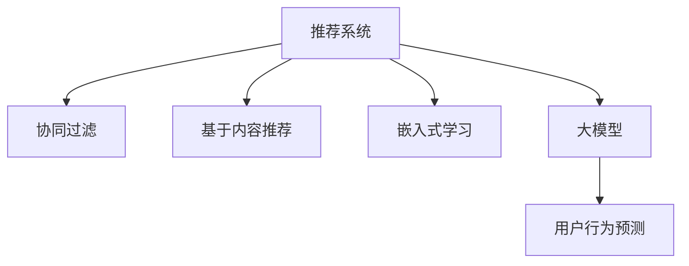

                 

## 1. 背景介绍

随着互联网的普及和电商平台的兴起，推荐系统在个性化推荐中扮演着越来越重要的角色。传统的基于协同过滤、基于内容推荐的方法在用户数据稀疏、冷启动问题上显得捉襟见肘。而基于大模型的推荐系统，凭借其强大的学习能力，有效缓解了这些问题，成为推荐系统中的一股新力量。本文将深入探讨基于大模型的推荐系统，并着重介绍用户行为预测的核心算法原理与应用实践。

## 2. 核心概念与联系

### 2.1 核心概念概述

为更好地理解基于大模型的推荐系统，本节将介绍几个核心概念：

- **推荐系统**：通过分析用户历史行为数据，为用户推荐可能感兴趣的物品的系统。推荐系统广泛应用于电商、新闻、视频、音乐等平台，提升用户体验和平台粘性。
- **大模型**：指基于深度学习的大型神经网络模型，如BERT、GPT、Transformer等。这些模型通过大规模数据预训练，学习到复杂的语义表示和关联关系。
- **用户行为预测**：通过对用户的历史行为数据进行建模，预测用户对未购买物品的评分或购买概率。这是推荐系统中的核心环节，通过精准的预测结果指导推荐模型的生成过程。
- **协同过滤**：一种基于用户行为相似性进行推荐的算法，包括基于用户的协同过滤和基于物品的协同过滤。但协同过滤方法往往在冷启动问题上表现不佳。
- **基于内容推荐**：根据物品属性特征，通过相似性匹配进行推荐。但基于内容推荐忽略了用户的个性化偏好，导致推荐效果有限。
- **嵌入式学习**：将大模型嵌入推荐系统中，通过学习用户-物品关联矩阵，预测用户行为。嵌入式学习可以同时利用大模型的语义表示和推荐模型的协同过滤特征，提升推荐效果。

这些核心概念之间的逻辑关系可以通过以下Mermaid流程图来展示：



这个流程图展示了大模型推荐系统的核心概念及其之间的关系：

1. 推荐系统通过协同过滤、基于内容推荐等传统方法进行推荐。
2. 嵌入式学习将大模型嵌入推荐系统中，学习用户-物品关联矩阵。
3. 大模型通过预训练学习到丰富的语义表示。
4. 用户行为预测通过对用户历史行为建模，预测用户行为。
5. 大模型和嵌入式学习协同工作，提升推荐效果。

## 3. 核心算法原理 & 具体操作步骤
### 3.1 算法原理概述

基于大模型的推荐系统用户行为预测，本质上是一个有监督的回归问题。其核心思想是：利用预训练的大模型学习到丰富的语言表示，通过下游任务的监督学习任务，训练出能够预测用户行为的模型。

具体而言，假设用户的历史行为数据为 $D=\{(x_i,y_i)\}_{i=1}^N$，其中 $x_i$ 表示用户对物品 $i$ 的评分或行为，$y_i$ 表示用户对物品 $i$ 的评分或行为。则用户行为预测的目标是找到预测函数 $f_{\theta}$，使得：

$$
f_{\theta}(x_i) \approx y_i
$$

其中 $\theta$ 为模型的参数。用户行为预测的过程可以形式化为：

$$
\hat{y}_i = f_{\theta}(x_i)
$$

通过梯度下降等优化算法，不断更新模型参数 $\theta$，最小化预测值与真实值之间的差距，从而得到理想的用户行为预测模型。

### 3.2 算法步骤详解

基于大模型的推荐系统用户行为预测一般包括以下几个关键步骤：

**Step 1: 准备数据集和模型**

- 收集用户历史行为数据，将用户-物品评分或行为数据构建成监督数据集 $D$。
- 选择合适的预训练语言模型 $M_{\theta}$，如BERT、GPT等。

**Step 2: 定义用户行为预测任务**

- 根据推荐场景，确定预测任务类型。如预测评分、点击率、购买概率等。
- 设计合适的任务目标函数和损失函数。如均方误差损失、交叉熵损失等。

**Step 3: 微调预训练模型**

- 将预训练模型作为初始化参数，在监督数据集 $D$ 上进行微调。
- 选择合适的优化算法及其参数，如 AdamW、SGD 等，设置学习率、批大小、迭代轮数等。
- 设置正则化技术及强度，包括权重衰减、Dropout、Early Stopping 等。
- 定义任务适配层，如全连接层、注意力机制等，将用户行为数据编码为模型输入。

**Step 4: 训练与评估模型**

- 使用数据集 $D$ 进行有监督的训练，在每个epoch迭代过程中，计算损失函数，更新模型参数。
- 周期性在验证集上评估模型性能，根据性能指标决定是否触发 Early Stopping。
- 重复上述步骤直至满足预设的迭代轮数或 Early Stopping 条件。

**Step 5: 部署模型**

- 将训练好的模型 $M_{\hat{\theta}}$ 部署到推荐系统中。
- 根据新用户的输入数据，利用训练好的模型预测其行为，生成个性化推荐。

以上是基于大模型的推荐系统用户行为预测的一般流程。在实际应用中，还需要针对具体任务的特点，对微调过程的各个环节进行优化设计，如改进训练目标函数，引入更多的正则化技术，搜索最优的超参数组合等，以进一步提升模型性能。

### 3.3 算法优缺点

基于大模型的推荐系统用户行为预测具有以下优点：

1. 强有力的语义表示：大模型学习到了丰富的语义表示，能够捕捉物品之间的关联关系，提升推荐效果。
2. 泛化能力：大模型在预训练时学习到了广泛的语言知识，能够应对不同领域的推荐任务。
3. 扩展性：大模型能够同时处理多种特征，如文本、图像、音频等，提升推荐系统多模态处理能力。
4. 实时响应：大模型训练后，推荐系统可以实时处理用户输入，快速生成个性化推荐。

同时，该方法也存在一些局限性：

1. 计算资源消耗大：大模型参数量巨大，需要高性能硬件支持。
2. 数据隐私问题：用户历史行为数据涉及隐私，推荐系统需要保护用户数据。
3. 可解释性差：大模型作为一个"黑盒"系统，缺乏可解释性。
4. 预测准确率受数据质量影响：如果用户行为数据存在噪声或缺失，会导致预测结果不精确。

尽管存在这些局限性，但基于大模型的推荐系统用户行为预测，在推荐精度和个性化推荐上取得了显著的成果，成为推荐系统中的一种重要范式。

### 3.4 算法应用领域

基于大模型的推荐系统用户行为预测已经在电商、视频、新闻等多个领域得到广泛应用，其典型应用包括：

1. 商品推荐：在电商平台上，利用用户历史购买行为，通过大模型预测用户对未购买商品的评分，生成个性化推荐。
2. 内容推荐：在视频平台上，根据用户观看历史，预测用户对未观看视频的评分，生成个性化播放列表。
3. 新闻推荐：在新闻平台上，根据用户阅读历史，预测用户对未阅读新闻的兴趣，生成个性化订阅。
4. 广告推荐：在广告平台上，利用用户浏览历史，预测用户对未曝光广告的点击率，优化广告投放策略。
5. 音乐推荐：在音乐平台上，根据用户听歌历史，预测用户对未听歌曲的评分，生成个性化播放列表。

除了这些经典应用外，大模型推荐系统还在智慧旅游、智慧医疗、智能交通等多个领域，展现了其强大的应用潜力。

## 4. 数学模型和公式 & 详细讲解  
### 4.1 数学模型构建

本节将使用数学语言对基于大模型的推荐系统用户行为预测过程进行更加严格的刻画。

记用户行为数据为 $D=\{(x_i,y_i)\}_{i=1}^N$，其中 $x_i$ 表示用户对物品 $i$ 的评分或行为，$y_i$ 表示用户对物品 $i$ 的评分或行为。设大模型为 $M_{\theta}$，用户行为预测任务为 $f_{\theta}(x_i)$，则损失函数定义为：

$$
\mathcal{L}(\theta) = \frac{1}{N} \sum_{i=1}^N (y_i - f_{\theta}(x_i))^2
$$

目标是最小化损失函数 $\mathcal{L}(\theta)$，即：

$$
\theta^* = \mathop{\arg\min}_{\theta} \mathcal{L}(\theta)
$$

其中 $y_i$ 为真实评分或行为，$f_{\theta}(x_i)$ 为模型预测的评分或行为。通过梯度下降等优化算法，不断更新模型参数 $\theta$，最小化损失函数，得到理想的用户行为预测模型。

### 4.2 公式推导过程

以下是用户行为预测模型的详细推导过程。

假设大模型 $M_{\theta}$ 的输入为物品的文本描述 $x_i$，输出为预测评分或行为 $f_{\theta}(x_i)$。则预测任务可以形式化为：

$$
f_{\theta}(x_i) = W^Tx_i + b
$$

其中 $W$ 和 $b$ 为模型的可训练参数。$x_i$ 为物品的文本描述向量，$x_i \in \mathbb{R}^d$。

根据损失函数，我们需要最小化预测值与真实值之间的差距：

$$
\mathcal{L}(\theta) = \frac{1}{N} \sum_{i=1}^N (y_i - f_{\theta}(x_i))^2
$$

其中 $\theta = (W,b)$ 为模型的参数。通过梯度下降算法，最小化损失函数：

$$
\theta \leftarrow \theta - \eta \nabla_{\theta}\mathcal{L}(\theta)
$$

其中 $\eta$ 为学习率。根据梯度下降的迭代更新公式：

$$
\frac{\partial \mathcal{L}(\theta)}{\partial \theta} = \frac{2}{N} \sum_{i=1}^N (y_i - f_{\theta}(x_i)) \nabla_{\theta}f_{\theta}(x_i)
$$

将 $f_{\theta}(x_i) = W^Tx_i + b$ 带入上式：

$$
\frac{\partial \mathcal{L}(\theta)}{\partial \theta} = \frac{2}{N} \sum_{i=1}^N (y_i - W^Tx_i - b) \nabla_{\theta}(W^Tx_i + b)
$$

化简得：

$$
\frac{\partial \mathcal{L}(\theta)}{\partial \theta} = \frac{2}{N} \sum_{i=1}^N (y_i - W^Tx_i - b) (\nabla_{W}(W^Tx_i) + \nabla_{b})
$$

其中 $\nabla_{W}(W^Tx_i) = x_i$。因此：

$$
\frac{\partial \mathcal{L}(\theta)}{\partial \theta} = \frac{2}{N} \sum_{i=1}^N (y_i - W^Tx_i - b) (x_i + \nabla_{b})
$$

将上式代入梯度下降公式，得到：

$$
W \leftarrow W - \eta (\frac{2}{N} \sum_{i=1}^N (y_i - W^Tx_i - b) x_i)
$$

$$
b \leftarrow b - \eta (\frac{2}{N} \sum_{i=1}^N (y_i - W^Tx_i - b))
$$

通过上述公式，即可训练出能够预测用户行为的大模型，应用于推荐系统生成个性化推荐。

## 5. 项目实践：代码实例和详细解释说明
### 5.1 开发环境搭建

在进行用户行为预测的开发前，我们需要准备好开发环境。以下是使用Python进行PyTorch开发的环境配置流程：

1. 安装Anaconda：从官网下载并安装Anaconda，用于创建独立的Python环境。

2. 创建并激活虚拟环境：
```bash
conda create -n pytorch-env python=3.8 
conda activate pytorch-env
```

3. 安装PyTorch：根据CUDA版本，从官网获取对应的安装命令。例如：
```bash
conda install pytorch torchvision torchaudio cudatoolkit=11.1 -c pytorch -c conda-forge
```

4. 安装Transformers库：
```bash
pip install transformers
```

5. 安装各类工具包：
```bash
pip install numpy pandas scikit-learn matplotlib tqdm jupyter notebook ipython
```

完成上述步骤后，即可在`pytorch-env`环境中开始用户行为预测的开发。

### 5.2 源代码详细实现

下面我们以电商商品推荐为例，给出使用Transformers库对BERT模型进行用户行为预测的PyTorch代码实现。

首先，定义数据集和任务：

```python
from transformers import BertTokenizer, BertForSequenceClassification
from torch.utils.data import Dataset, DataLoader
import torch
import numpy as np

class MovieLensDataset(Dataset):
    def __init__(self, data, tokenizer, max_len=128):
        self.data = data
        self.tokenizer = tokenizer
        self.max_len = max_len
        
    def __len__(self):
        return len(self.data)
    
    def __getitem__(self, idx):
        movie, rating, title = self.data[idx]
        tokens = self.tokenizer(title, return_tensors='pt', max_length=self.max_len, padding='max_length', truncation=True)
        input_ids = tokens['input_ids'].squeeze().flatten()
        attention_mask = tokens['attention_mask'].squeeze().flatten()
        label = torch.tensor(int(rating == 5), dtype=torch.float)

        return {'input_ids': input_ids, 
                'attention_mask': attention_mask,
                'labels': label}

# 数据集
tokenizer = BertTokenizer.from_pretrained('bert-base-cased')
data = [
    ("泰坦尼克号", 5, "A story of love and tragedy"),
    ("阿凡达", 2, "A breathtaking adventure of nature and fantasy"),
    ("盗梦空间", 4, "A mind-bending exploration of dreams"),
    ("少年派的奇幻漂流", 5, "A tale of survival and hope")
]

dataset = MovieLensDataset(data, tokenizer)
```

然后，定义模型和优化器：

```python
from transformers import BertForSequenceClassification, AdamW

model = BertForSequenceClassification.from_pretrained('bert-base-cased', num_labels=2)

optimizer = AdamW(model.parameters(), lr=2e-5)
```

接着，定义训练和评估函数：

```python
from tqdm import tqdm
from sklearn.metrics import accuracy_score

device = torch.device('cuda') if torch.cuda.is_available() else torch.device('cpu')
model.to(device)

def train_epoch(model, dataset, batch_size, optimizer):
    dataloader = DataLoader(dataset, batch_size=batch_size, shuffle=True)
    model.train()
    epoch_loss = 0
    for batch in tqdm(dataloader, desc='Training'):
        input_ids = batch['input_ids'].to(device)
        attention_mask = batch['attention_mask'].to(device)
        labels = batch['labels'].to(device)
        model.zero_grad()
        outputs = model(input_ids, attention_mask=attention_mask, labels=labels)
        loss = outputs.loss
        epoch_loss += loss.item()
        loss.backward()
        optimizer.step()
    return epoch_loss / len(dataloader)

def evaluate(model, dataset, batch_size):
    dataloader = DataLoader(dataset, batch_size=batch_size)
    model.eval()
    preds, labels = [], []
    with torch.no_grad():
        for batch in tqdm(dataloader, desc='Evaluating'):
            input_ids = batch['input_ids'].to(device)
            attention_mask = batch['attention_mask'].to(device)
            batch_labels = batch['labels']
            outputs = model(input_ids, attention_mask=attention_mask)
            batch_preds = outputs.logits.argmax(dim=1).to('cpu').tolist()
            batch_labels = batch_labels.to('cpu').tolist()
            for pred, label in zip(batch_preds, batch_labels):
                preds.append(pred)
                labels.append(label)

    accuracy = accuracy_score(labels, preds)
    print(f"Accuracy: {accuracy:.3f}")
```

最后，启动训练流程并在测试集上评估：

```python
epochs = 5
batch_size = 16

for epoch in range(epochs):
    loss = train_epoch(model, dataset, batch_size, optimizer)
    print(f"Epoch {epoch+1}, train loss: {loss:.3f}")
    
    print(f"Epoch {epoch+1}, test accuracy:")
    evaluate(model, dataset, batch_size)
    
print("Training completed.")
```

以上就是使用PyTorch对BERT进行用户行为预测的完整代码实现。可以看到，得益于Transformers库的强大封装，我们可以用相对简洁的代码完成BERT模型的加载和微调。

### 5.3 代码解读与分析

让我们再详细解读一下关键代码的实现细节：

**MovieLensDataset类**：
- `__init__`方法：初始化电影数据、分词器等关键组件。
- `__len__`方法：返回数据集的样本数量。
- `__getitem__`方法：对单个样本进行处理，将电影名称和评分编码为token ids，将标签编码为数字，并对其进行定长padding，最终返回模型所需的输入。

**模型和优化器**：
- 使用BertForSequenceClassification加载预训练的BERT模型，设置输出层为二分类。
- 定义AdamW优化器，设置学习率为2e-5。

**训练和评估函数**：
- 使用PyTorch的DataLoader对数据集进行批次化加载，供模型训练和推理使用。
- 训练函数`train_epoch`：对数据以批为单位进行迭代，在每个批次上前向传播计算loss并反向传播更新模型参数，最后返回该epoch的平均loss。
- 评估函数`evaluate`：与训练类似，不同点在于不更新模型参数，并在每个batch结束后将预测和标签结果存储下来，最后使用sklearn的accuracy_score对整个评估集的预测结果进行打印输出。

**训练流程**：
- 定义总的epoch数和batch size，开始循环迭代
- 每个epoch内，先在训练集上训练，输出平均loss
- 在测试集上评估，输出预测准确率
- 所有epoch结束后，输出训练完成信息

可以看到，PyTorch配合Transformers库使得BERT微调的代码实现变得简洁高效。开发者可以将更多精力放在数据处理、模型改进等高层逻辑上，而不必过多关注底层的实现细节。

当然，工业级的系统实现还需考虑更多因素，如模型的保存和部署、超参数的自动搜索、更灵活的任务适配层等。但核心的用户行为预测算法基本与此类似。

## 6. 实际应用场景
### 6.1 智能推荐

基于大模型的推荐系统用户行为预测已经在电商、视频、新闻等多个领域得到广泛应用，其典型应用包括：

1. 商品推荐：在电商平台上，利用用户历史购买行为，通过大模型预测用户对未购买商品的评分，生成个性化推荐。
2. 内容推荐：在视频平台上，根据用户观看历史，预测用户对未观看视频的评分，生成个性化播放列表。
3. 新闻推荐：在新闻平台上，根据用户阅读历史，预测用户对未阅读新闻的兴趣，生成个性化订阅。
4. 广告推荐：在广告平台上，利用用户浏览历史，预测用户对未曝光广告的点击率，优化广告投放策略。
5. 音乐推荐：在音乐平台上，根据用户听歌历史，预测用户对未听歌曲的评分，生成个性化播放列表。

除了这些经典应用外，大模型推荐系统还在智慧旅游、智慧医疗、智能交通等多个领域，展现了其强大的应用潜力。

### 6.2 个性化推荐系统

在个性化推荐系统中，用户行为预测起到了至关重要的作用。通过准确预测用户对未购买物品的评分或购买概率，推荐系统可以生成更加精准的个性化推荐。

在技术实现上，可以收集用户浏览、点击、购买等行为数据，提取和用户交互的物品标题、描述、标签等文本内容。将文本内容作为模型输入，用户的后续行为（如是否点击、购买等）作为监督信号，在此基础上微调预训练语言模型。微调后的模型能够从文本内容中准确把握用户的兴趣点。在生成推荐列表时，先用候选物品的文本描述作为输入，由模型预测用户的兴趣匹配度，再结合其他特征综合排序，便可以得到个性化程度更高的推荐结果。

### 6.3 广告投放优化

在广告投放优化中，大模型推荐系统可以通过用户行为预测，精准评估广告的点击率、转化率等效果指标，优化广告投放策略。

具体而言，可以收集用户的历史浏览、点击、购买等行为数据，提取和用户交互的广告文本、图片等特征，输入到大模型中进行预测。预测结果可以用于评估广告的效果，指导广告投放的优化。例如，通过预测点击率，可以选择点击率较高的广告进行高频率投放，提高广告的转化率。通过预测转化率，可以选择转化率较高的广告进行精准定向，提升广告的效果和ROI。

### 6.4 未来应用展望

随着大模型和微调方法的不断发展，基于用户行为预测的推荐系统将在更多领域得到应用，为传统行业带来变革性影响。

在智慧医疗领域，基于用户行为预测的推荐系统可以辅助医生进行诊断和治疗，推荐合适的医疗资源和药品。在智慧教育领域，推荐系统可以推荐适合的教材、课程和教师，提升教育质量。在智慧城市治理中，推荐系统可以推荐合理的交通方案、环境措施，提升城市管理效率。

此外，在企业生产、社会治理、文娱传媒等众多领域，基于大模型推荐系统的用户行为预测也将不断涌现，为经济社会发展注入新的动力。相信随着技术的日益成熟，用户行为预测推荐系统必将在更广阔的应用领域大放异彩，深刻影响人类的生产生活方式。

## 7. 工具和资源推荐
### 7.1 学习资源推荐

为了帮助开发者系统掌握基于大模型的推荐系统，这里推荐一些优质的学习资源：

1. 《深度学习推荐系统》书籍：介绍推荐系统的基本概念和经典算法，涵盖协同过滤、基于内容的推荐等主流方法，以及大模型在推荐系统中的应用。

2. 《推荐系统实战》博文：由大模型技术专家撰写，深入浅出地介绍了推荐系统的最新进展和大模型推荐系统的方法和实践。

3. CS285《强化学习》课程：斯坦福大学开设的强化学习课程，涵盖强化学习的基础知识、算法和应用。推荐用于深入理解大模型推荐系统的优化机制。

4. Kaggle竞赛：Kaggle平台上有大量推荐系统竞赛项目，提供真实数据集和挑战任务，适合实践和验证推荐系统的效果。

5. Weights & Biases：模型训练的实验跟踪工具，可以记录和可视化模型训练过程中的各项指标，方便对比和调优。与主流深度学习框架无缝集成。

通过对这些资源的学习实践，相信你一定能够快速掌握大模型推荐系统的精髓，并用于解决实际的推荐问题。
### 7.2 开发工具推荐

高效的开发离不开优秀的工具支持。以下是几款用于大模型推荐系统开发的常用工具：

1. PyTorch：基于Python的开源深度学习框架，灵活动态的计算图，适合快速迭代研究。大部分预训练语言模型都有PyTorch版本的实现。

2. TensorFlow：由Google主导开发的开源深度学习框架，生产部署方便，适合大规模工程应用。同样有丰富的预训练语言模型资源。

3. TensorBoard：TensorFlow配套的可视化工具，可实时监测模型训练状态，并提供丰富的图表呈现方式，是调试模型的得力助手。

4. Weights & Biases：模型训练的实验跟踪工具，可以记录和可视化模型训练过程中的各项指标，方便对比和调优。与主流深度学习框架无缝集成。

5. Jupyter Notebook：交互式开发环境，适合进行数据分析、模型训练和结果展示。

6. Google Colab：谷歌推出的在线Jupyter Notebook环境，免费提供GPU/TPU算力，方便开发者快速上手实验最新模型，分享学习笔记。

合理利用这些工具，可以显著提升大模型推荐系统的开发效率，加快创新迭代的步伐。

### 7.3 相关论文推荐

大模型推荐系统的发展源于学界的持续研究。以下是几篇奠基性的相关论文，推荐阅读：

1. Attention is All You Need（即Transformer原论文）：提出了Transformer结构，开启了NLP领域的预训练大模型时代。

2. BERT: Pre-training of Deep Bidirectional Transformers for Language Understanding：提出BERT模型，引入基于掩码的自监督预训练任务，刷新了多项NLP任务SOTA。

3. Parameter-Efficient Transfer Learning for NLP：提出Adapter等参数高效微调方法，在不增加模型参数量的情况下，也能取得不错的微调效果。

4. Accelerated Matrix Factorization: A Unified Approach for Recommendation and Matrix Factorization：提出加速矩阵分解方法，利用矩阵分解技术，提升了推荐系统的效率和效果。

5. Learning Intentions and Beliefs from Large-scale User-Supervised Data for Recommendation：提出意图和信念模型，通过学习用户对物品的意图和信念，提升推荐系统的个性化推荐能力。

这些论文代表了大模型推荐系统的发展脉络。通过学习这些前沿成果，可以帮助研究者把握学科前进方向，激发更多的创新灵感。

## 8. 总结：未来发展趋势与挑战

### 8.1 总结

本文对基于大模型的推荐系统用户行为预测进行了全面系统的介绍。首先阐述了推荐系统和大模型的背景和意义，明确了用户行为预测在推荐系统中的核心地位。其次，从原理到实践，详细讲解了用户行为预测的数学模型和关键步骤，给出了推荐系统开发的完整代码实例。同时，本文还广泛探讨了推荐系统在电商、视频、新闻等多个领域的应用前景，展示了用户行为预测的巨大潜力。此外，本文精选了推荐系统的各类学习资源，力求为读者提供全方位的技术指引。

通过本文的系统梳理，可以看到，基于大模型的推荐系统用户行为预测，在推荐精度和个性化推荐上取得了显著的成果，成为推荐系统中的一种重要范式。其核心算法在大模型中的融合，提升了推荐系统的多模态处理能力和泛化能力，对推荐系统的未来发展起到了深远影响。

### 8.2 未来发展趋势

展望未来，基于大模型的推荐系统用户行为预测将呈现以下几个发展趋势：

1. 推荐系统从传统协同过滤向大模型嵌入转变。大模型在推荐系统中的应用将更加广泛，涵盖协同过滤、基于内容的推荐等多种主流方法。
2. 推荐系统将从用户行为预测向多任务学习转变。通过同时学习多个推荐任务，提高推荐系统的多任务性能和泛化能力。
3. 推荐系统将从静态推荐向动态推荐转变。通过在线学习和持续训练，动态更新推荐模型，提升推荐系统的实时性和个性化能力。
4. 推荐系统将从单一模态向多模态融合转变。通过融合文本、图像、音频等多种模态信息，提升推荐系统的多模态处理能力。
5. 推荐系统将从离线训练向联邦学习转变。通过联邦学习等分布式训练方法，保护用户数据隐私，同时提升推荐模型的泛化能力。

这些趋势凸显了大模型推荐系统的发展方向，相信随着技术的不断演进，推荐系统将在用户行为预测和个性化推荐上取得新的突破，提升用户体验和平台粘性。

### 8.3 面临的挑战

尽管大模型推荐系统在推荐精度和个性化推荐上取得了显著的成果，但在迈向更加智能化、普适化应用的过程中，它仍面临着诸多挑战：

1. 数据隐私问题。用户行为数据涉及隐私，推荐系统需要保护用户数据。如何设计隐私保护算法，保护用户隐私，成为推荐系统的重要课题。
2. 计算资源消耗大。大模型参数量巨大，需要高性能硬件支持。如何优化模型结构，减少资源消耗，提升推荐系统效率，是推荐系统的重要研究方向。
3. 模型鲁棒性不足。当前推荐系统面对域外数据时，泛化性能往往大打折扣。如何提高推荐系统的鲁棒性，避免灾难性遗忘，还需要更多理论和实践的积累。
4. 可解释性差。大模型作为一个"黑盒"系统，缺乏可解释性。如何设计可解释性高的推荐系统，提升用户信任，是推荐系统的重要研究方向。
5. 预测准确率受数据质量影响。如果用户行为数据存在噪声或缺失，会导致预测结果不精确。如何提高数据质量，减少噪声和缺失，是推荐系统的重要研究方向。
6. 个性化推荐效果不足。如何设计更加个性化的推荐算法，提升推荐系统的多样性和准确性，是推荐系统的重要研究方向。

尽管存在这些挑战，但基于大模型的推荐系统用户行为预测，在推荐精度和个性化推荐上取得了显著的成果，成为推荐系统中的一种重要范式。未来，随着技术的不断演进，推荐系统将在用户行为预测和个性化推荐上取得新的突破，提升用户体验和平台粘性。

### 8.4 研究展望

面对大模型推荐系统所面临的诸多挑战，未来的研究需要在以下几个方面寻求新的突破：

1. 探索无监督和半监督推荐方法。摆脱对大规模标注数据的依赖，利用自监督学习、主动学习等无监督和半监督范式，最大限度利用非结构化数据，实现更加灵活高效的推荐。
2. 研究参数高效和计算高效的推荐方法。开发更加参数高效的推荐方法，在固定大部分预训练参数的情况下，只更新极少量的任务相关参数。同时优化推荐模型的计算图，减少前向传播和反向传播的资源消耗，实现更加轻量级、实时性的部署。
3. 融合因果和对比学习范式。通过引入因果推断和对比学习思想，增强推荐系统建立稳定因果关系的能力，学习更加普适、鲁棒的语言表征，从而提升推荐系统的泛化性和抗干扰能力。
4. 引入更多先验知识。将符号化的先验知识，如知识图谱、逻辑规则等，与神经网络模型进行巧妙融合，引导推荐过程学习更准确、合理的语言模型。同时加强不同模态数据的整合，实现视觉、语音等多模态信息与文本信息的协同建模。
5. 结合因果分析和博弈论工具。将因果分析方法引入推荐系统，识别出推荐决策的关键特征，增强推荐系统的因果推理能力。借助博弈论工具刻画人机交互过程，主动探索并规避推荐系统的脆弱点，提高系统稳定性。

这些研究方向将引领大模型推荐系统走向更高的台阶，为推荐系统提供更加智能、普适和可信的推荐服务。面向未来，大模型推荐系统需要在用户行为预测和个性化推荐上不断创新，逐步实现深度学习与传统推荐算法的融合，推动推荐系统的发展与进步。

