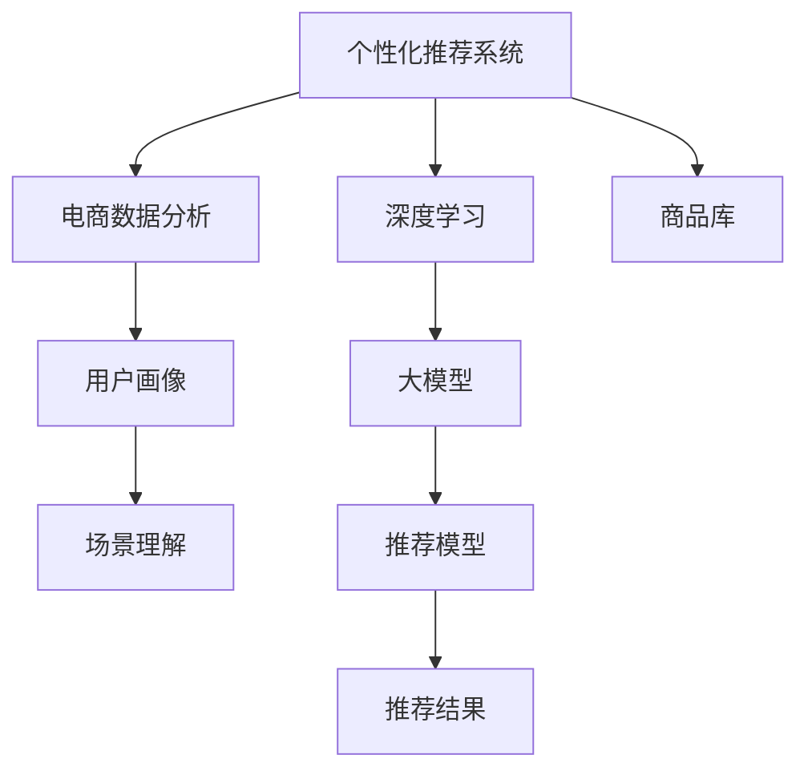

                 

# 基于大模型的电商平台个性化营销

> 关键词：个性化推荐、电商数据分析、大模型、深度学习、用户画像、场景理解

## 1. 背景介绍

### 1.1 问题由来

近年来，电商平台已经在全球范围内发展迅速，成为企业的重要业务来源之一。面对激烈的市场竞争，电商平台纷纷转向个性化营销，利用先进技术提升用户体验，提高销售额。在推荐系统的推动下，电商平台推荐商品的准确性、多样性大幅提升，对用户的吸引力越来越强，但依然面临着高漏选率、商品多样性差、点击率转化率低等问题。

随着大数据和深度学习技术的发展，以大模型为基础的推荐系统逐渐成为电商平台的未来发展方向。相较于传统的基于协同过滤、商品属性等特征的推荐方法，大模型能够从用户历史行为和上下文语义中学习用户潜在需求，提供更具相关性和创意性的个性化推荐。

### 1.2 问题核心关键点

个性化推荐系统面临的核心挑战在于如何构建精准的用户画像，理解用户的潜在需求，从而在巨大商品库中筛选出最符合用户兴趣的商品。近年来，基于深度学习的大模型在电商推荐场景中的应用，提供了全新的解决方案，其中使用大模型进行个性化营销，成为电商平台的未来趋势。

## 2. 核心概念与联系

### 2.1 核心概念概述

为了更好地理解基于大模型的电商平台个性化营销方法，本节将介绍几个密切相关的核心概念：

- **个性化推荐系统**：根据用户历史行为和上下文信息，推荐用户可能感兴趣的商品，以提升用户满意度、销售额和平台粘性。
- **深度学习**：一种模拟人类大脑处理信息的神经网络方法，能够处理非线性关系，自适应学习复杂模式，广泛用于图像识别、自然语言处理等任务。
- **大模型**：指通过在大规模数据上自监督预训练获得的高质量基础模型，如BERT、GPT-2、T5等，具有强大的泛化能力和表达能力。
- **电商数据分析**：指通过对电商平台上的交易数据、用户行为数据进行分析，挖掘用户需求和商品特征，指导个性化推荐。
- **用户画像**：对用户基本信息、兴趣偏好、行为习惯等进行分析，构建出详尽的用户描述，指导推荐系统决策。
- **场景理解**：理解用户请求场景，并根据场景进行推荐决策，如时间、地点、天气、活动等。

这些核心概念之间的逻辑关系可以通过以下Mermaid流程图来展示：



这个流程图展示了几者的关系：

1. **深度学习**：为个性化推荐系统提供强大的算法支持，能够学习用户行为和上下文信息，提取有效特征。
2. **大模型**：作为深度学习的基础，提供高质量的特征表示和泛化能力。
3. **电商数据分析**：用于挖掘用户数据和商品信息，构建用户画像和场景理解。
4. **用户画像**：根据用户数据构建的详尽用户描述，指导推荐系统决策。
5. **场景理解**：根据用户请求场景，个性化调整推荐策略。
6. **推荐模型**：使用深度学习模型和用户画像、场景理解信息，生成个性化推荐结果。

这些概念共同构成了基于大模型的电商平台个性化营销系统，通过深度学习和数据驱动的方式，为用户提供精准的商品推荐。

## 3. 核心算法原理 & 具体操作步骤

### 3.1 算法原理概述

基于大模型的电商平台个性化推荐，本质上是一种基于深度学习的推荐系统。其核心思想是：将大模型作为特征提取器，对用户历史行为和上下文信息进行编码，并预测用户对商品的相关性，生成个性化推荐结果。

形式化地，假设电商平台上的用户为 $U$，商品为 $I$，商品-用户交互记录为 $T=\{(i,u)\}_{i \in I,u \in U}$。定义用户对商品 $i$ 的评分 $r_{iu}$ 为 $r_{iu} = M_{\theta}(x_i;u)$，其中 $x_i$ 为商品 $i$ 的特征表示，$u$ 为用户 $u$ 的特征表示，$M_{\theta}$ 为深度学习模型，$\theta$ 为模型参数。通过最大化预测评分和实际评分的相关系数（即预测精度），训练模型 $M_{\theta}$，得到推荐结果。

### 3.2 算法步骤详解

基于大模型的电商平台个性化推荐一般包括以下几个关键步骤：

**Step 1: 数据准备和预处理**
- 收集电商平台的用户行为数据，如浏览记录、点击记录、购买记录等，进行数据清洗和预处理。
- 选择部分商品作为训练集和验证集，剩余商品作为测试集，用于评估模型性能。

**Step 2: 特征工程**
- 提取商品的描述、属性、类别、标签等特征，构建商品表示 $x_i$。
- 根据用户的行为数据，提取用户的画像特征，如用户兴趣、购买偏好等，构建用户表示 $u$。
- 使用自然语言处理技术，对用户查询、商品标题、描述等文本数据进行向量化处理，得到上下文特征。

**Step 3: 大模型训练**
- 选择大模型进行特征提取和预训练，如BERT、GPT等。
- 在训练集上进行有监督微调，得到用户对商品的评分。

**Step 4: 推荐模型训练**
- 根据用户特征和商品特征，构建用户-商品交互的图网络模型，如图神经网络(Graph Neural Network, GNN)。
- 在训练集上训练推荐模型，优化预测评分和实际评分的相关系数。

**Step 5: 推荐结果生成**
- 根据用户特征和商品特征，生成推荐结果。
- 在测试集上评估推荐模型性能，选择最佳模型进行部署。

### 3.3 算法优缺点

基于大模型的电商平台个性化推荐方法具有以下优点：
1. **高效性**：大模型通过预训练获得高质量的特征表示，可以直接用于推荐，无需额外的特征工程。
2. **泛化性强**：大模型具有强大的泛化能力，可以处理复杂的推荐场景，如新商品推荐、跨平台推荐等。
3. **效果显著**：在电商推荐任务上，大模型相比传统方法，能够取得更好的推荐效果，显著提升用户满意度。
4. **鲁棒性强**：大模型基于深度学习，可以自适应地学习用户需求和商品特征，对于异常数据和噪声具有较好的鲁棒性。

同时，该方法也存在一定的局限性：
1. **数据依赖性强**：大模型的性能依赖于电商平台的数据质量，数据量不足或分布不均可能导致性能下降。
2. **计算成本高**：大模型需要大量的计算资源进行预训练和微调，对硬件要求较高。
3. **复杂性高**：模型的构建和调优需要丰富的经验和专业知识，对开发者要求较高。
4. **透明性低**：深度学习模型的黑盒性质，导致推荐过程难以解释，难以调试。

尽管存在这些局限性，但基于大模型的电商推荐系统已经在大规模电商平台上成功应用，为个性化推荐带来了革命性变化。

### 3.4 算法应用领域

基于大模型的电商平台个性化推荐方法在电商领域已经得到了广泛的应用，覆盖了推荐系统中的几乎所有任务，例如：

- **商品推荐**：根据用户的历史浏览、购买记录，生成个性化推荐商品。
- **活动推荐**：根据用户的行为数据，生成个性化的促销活动推荐。
- **相关商品推荐**：根据用户对某一商品的兴趣，推荐相关的商品组合。
- **个性化广告推荐**：根据用户的兴趣和行为，生成个性化的广告投放。
- **新商品推荐**：根据用户的兴趣和购买历史，推荐用户可能感兴趣的新商品。

除了上述这些经典任务外，大模型在电商推荐中还被用于更多场景中，如搭配推荐、主题推荐、价格推荐等，为电商推荐带来了全新的突破。随着大模型的不断发展和电商推荐技术的应用，相信电商平台个性化推荐系统将不断升级迭代，为用户带来更优质的购物体验。

## 4. 数学模型和公式 & 详细讲解 & 举例说明

### 4.1 数学模型构建

本节将使用数学语言对基于大模型的电商平台个性化推荐过程进行更加严格的刻画。

记电商平台上的用户为 $U=\{u_1,\ldots,u_N\}$，商品为 $I=\{i_1,\ldots,i_M\}$，用户对商品 $i$ 的评分 $r_{iu} = M_{\theta}(x_i;u)$，其中 $x_i$ 为商品 $i$ 的特征表示，$u$ 为用户 $u$ 的特征表示，$M_{\theta}$ 为深度学习模型，$\theta$ 为模型参数。

假设用户-商品交互数据集为 $T=\{(i_j,u_k,r_{i_ju_k})\}_{j=1}^J$，其中 $i_j \in I,u_k \in U$。则目标函数可以表示为：

$$
\min_{\theta} \sum_{(i_j,u_k) \in T} \ell(r_{i_ju_k},\hat{r}_{i_ju_k})
$$

其中 $\hat{r}_{i_ju_k} = M_{\theta}(x_{i_j};u_k)$ 为模型预测的评分，$\ell$ 为损失函数，如均方误差、交叉熵等。

### 4.2 公式推导过程

以下我们以基于图神经网络(GNN)的电商推荐模型为例，推导其在电商平台上的应用。

假设用户-商品交互图网络模型为 $\mathcal{G}=(\mathcal{V},\mathcal{E},A)$，其中 $\mathcal{V}=\{u_1,\ldots,u_N,i_1,\ldots,i_M\}$ 为节点集合，$\mathcal{E}$ 为边集合，$A \in \mathbb{R}^{(|\mathcal{V}|+|\mathcal{I}|)\times(|\mathcal{V}|+|\mathcal{I}|)}$ 为邻接矩阵，$|\mathcal{V}|$ 为用户的数量，$|\mathcal{I}|$ 为商品的数量。

在训练集上，目标函数可以表示为：

$$
\min_{\theta} \frac{1}{2} \sum_{(i_j,u_k) \in T} \|M_{\theta}(x_{i_j};u_k) - r_{i_ju_k}\|^2
$$

其中 $x_{i_j}$ 为商品 $i_j$ 的特征表示，$u_k$ 为用户 $u_k$ 的特征表示，$r_{i_ju_k}$ 为用户对商品 $i_j$ 的评分，$\|\cdot\|$ 为范数，$\|M_{\theta}(x_{i_j};u_k) - r_{i_ju_k}\|$ 表示模型预测评分与实际评分之间的差距。

利用图神经网络的思想，将用户和商品节点视为图网络的节点，根据用户-商品交互信息，构建用户-商品图网络。假设用户-商品图的邻接矩阵 $A$ 可以表示为：

$$
A_{i,j} = 
\begin{cases} 
1, & \text{如果用户 } i \text{ 和商品 } j \text{ 有过交互} \\
0, & \text{如果用户 } i \text{ 和商品 } j \text{ 没有交互}
\end{cases}
$$

假设用户节点的特征表示为 $u$，商品节点的特征表示为 $i$。则图神经网络模型 $M_{\theta}$ 可以表示为：

$$
M_{\theta}(x_i;u) = f_{\theta}^{l} \cdot \prod_{l=0}^{L-1} A^l x_i^{l+1} + b^l
$$

其中 $f_{\theta}^{l}$ 为节点嵌入的线性变换，$b^l$ 为偏置项，$L$ 为神经网络的深度。

在训练集上，目标函数可以表示为：

$$
\min_{\theta} \frac{1}{2} \sum_{(i_j,u_k) \in T} \|M_{\theta}(x_{i_j};u_k) - r_{i_ju_k}\|^2
$$

在测试集上，目标函数可以表示为：

$$
\min_{\theta} \frac{1}{2} \sum_{(i_j,u_k) \in T_{test}} \|M_{\theta}(x_{i_j};u_k) - r_{i_ju_k}\|^2
$$

### 4.3 案例分析与讲解

下面我们以商品推荐为例，给出使用图神经网络进行电商推荐模型的PyTorch代码实现。

首先，定义图神经网络模型：

```python
import torch.nn as nn
import torch
from torch_geometric.nn import GCNConv

class GNN(nn.Module):
    def __init__(self, input_dim, hidden_dim, output_dim):
        super(GNN, self).__init__()
        self.conv1 = GCNConv(input_dim, hidden_dim)
        self.conv2 = GCNConv(hidden_dim, hidden_dim)
        self.linear = nn.Linear(hidden_dim, output_dim)
        
    def forward(self, x, adj):
        x = self.conv1(x, adj)
        x = torch.relu(x)
        x = self.conv2(x, adj)
        x = self.linear(x)
        return x
```

然后，定义训练和评估函数：

```python
from torch.optim import Adam
from torch.utils.data import DataLoader
from tqdm import tqdm
from sklearn.metrics import mean_squared_error

device = torch.device('cuda' if torch.cuda.is_available() else 'cpu')
model = GNN(input_dim, hidden_dim, output_dim).to(device)

optimizer = Adam(model.parameters(), lr=learning_rate)

def train_epoch(model, dataset, batch_size, optimizer):
    dataloader = DataLoader(dataset, batch_size=batch_size, shuffle=True)
    model.train()
    epoch_loss = 0
    for batch in tqdm(dataloader, desc='Training'):
        x, adj, y = batch
        x = x.to(device)
        adj = adj.to(device)
        y = y.to(device)
        optimizer.zero_grad()
        y_pred = model(x, adj)
        loss = mean_squared_error(y_pred, y)
        epoch_loss += loss.item()
        loss.backward()
        optimizer.step()
    return epoch_loss / len(dataloader)

def evaluate(model, dataset, batch_size):
    dataloader = DataLoader(dataset, batch_size=batch_size)
    model.eval()
    preds, labels = [], []
    with torch.no_grad():
        for batch in tqdm(dataloader, desc='Evaluating'):
            x, adj, y = batch
            x = x.to(device)
            adj = adj.to(device)
            batch_labels = y.to(device)
            batch_preds = model(x, adj)
            batch_preds = batch_preds.to('cpu').numpy()
            batch_labels = batch_labels.to('cpu').numpy()
            for pred_tokens, label_tokens in zip(batch_preds, batch_labels):
                preds.append(pred_tokens)
                labels.append(label_tokens)
                
    print(mean_squared_error(labels, preds))
```

最后，启动训练流程并在测试集上评估：

```python
epochs = 10
batch_size = 64

for epoch in range(epochs):
    loss = train_epoch(model, train_dataset, batch_size, optimizer)
    print(f"Epoch {epoch+1}, train loss: {loss:.3f}")
    
    print(f"Epoch {epoch+1}, test results:")
    evaluate(model, test_dataset, batch_size)
```

以上就是使用PyTorch对图神经网络进行电商推荐模型的代码实现。可以看到，通过图神经网络，我们可以将用户和商品节点进行有向连接，利用上下文信息进行推荐预测。代码中的`GNN`模型使用了GCNConv层，实现节点之间的信息传递。

## 5. 项目实践：代码实例和详细解释说明

### 5.1 开发环境搭建

在进行电商推荐实践前，我们需要准备好开发环境。以下是使用Python进行PyTorch开发的环境配置流程：

1. 安装Anaconda：从官网下载并安装Anaconda，用于创建独立的Python环境。

2. 创建并激活虚拟环境：
```bash
conda create -n pytorch-env python=3.8 
conda activate pytorch-env
```

3. 安装PyTorch：根据CUDA版本，从官网获取对应的安装命令。例如：
```bash
conda install pytorch torchvision torchaudio cudatoolkit=11.1 -c pytorch -c conda-forge
```

4. 安装TensorFlow：
```bash
pip install tensorflow
```

5. 安装各类工具包：
```bash
pip install numpy pandas scikit-learn matplotlib tqdm jupyter notebook ipython
```

完成上述步骤后，即可在`pytorch-env`环境中开始电商推荐实践。

### 5.2 源代码详细实现

下面我们以电商推荐任务为例，给出使用PyTorch和图神经网络进行电商推荐模型的代码实现。

首先，定义电商推荐任务的数据处理函数：

```python
from torch_geometric.data import Data, Dataset

class EcommerceDataset(Dataset):
    def __init__(self, x, adj, y):
        super(EcommerceDataset, self).__init__()
        self.data = Data(x=x, edge_index=adj, y=y)
        
    def __len__(self):
        return len(self.data)

    def __getitem__(self, idx):
        return self.data[idx]
```

然后，定义模型和优化器：

```python
import torch.nn.functional as F

class GCNModel(nn.Module):
    def __init__(self, input_dim, hidden_dim, output_dim):
        super(GCNModel, self).__init__()
        self.conv1 = GCNConv(input_dim, hidden_dim)
        self.conv2 = GCNConv(hidden_dim, hidden_dim)
        self.linear = nn.Linear(hidden_dim, output_dim)
        
    def forward(self, x, adj):
        x = self.conv1(x, adj)
        x = F.relu(x)
        x = self.conv2(x, adj)
        x = self.linear(x)
        return x
```

接着，定义训练和评估函数：

```python
from torch.optim import Adam
from torch.utils.data import DataLoader
from tqdm import tqdm
from sklearn.metrics import mean_squared_error

device = torch.device('cuda' if torch.cuda.is_available() else 'cpu')
model = GCNModel(input_dim, hidden_dim, output_dim).to(device)

optimizer = Adam(model.parameters(), lr=learning_rate)

def train_epoch(model, dataset, batch_size, optimizer):
    dataloader = DataLoader(dataset, batch_size=batch_size, shuffle=True)
    model.train()
    epoch_loss = 0
    for batch in tqdm(dataloader, desc='Training'):
        x, adj, y = batch
        x = x.to(device)
        adj = adj.to(device)
        y = y.to(device)
        optimizer.zero_grad()
        y_pred = model(x, adj)
        loss = mean_squared_error(y_pred, y)
        epoch_loss += loss.item()
        loss.backward()
        optimizer.step()
    return epoch_loss / len(dataloader)

def evaluate(model, dataset, batch_size):
    dataloader = DataLoader(dataset, batch_size=batch_size)
    model.eval()
    preds, labels = [], []
    with torch.no_grad():
        for batch in tqdm(dataloader, desc='Evaluating'):
            x, adj, y = batch
            x = x.to(device)
            adj = adj.to(device)
            batch_labels = y.to(device)
            batch_preds = model(x, adj)
            batch_preds = batch_preds.to('cpu').numpy()
            batch_labels = batch_labels.to('cpu').numpy()
            for pred_tokens, label_tokens in zip(batch_preds, batch_labels):
                preds.append(pred_tokens)
                labels.append(label_tokens)
                
    print(mean_squared_error(labels, preds))
```

最后，启动训练流程并在测试集上评估：

```python
epochs = 10
batch_size = 64

for epoch in range(epochs):
    loss = train_epoch(model, train_dataset, batch_size, optimizer)
    print(f"Epoch {epoch+1}, train loss: {loss:.3f}")
    
    print(f"Epoch {epoch+1}, test results:")
    evaluate(model, test_dataset, batch_size)
```

以上就是使用PyTorch和图神经网络进行电商推荐模型的代码实现。可以看到，通过图神经网络，我们可以将用户和商品节点进行有向连接，利用上下文信息进行推荐预测。代码中的`GNN`模型使用了GCNConv层，实现节点之间的信息传递。

## 6. 实际应用场景

### 6.1 智能客服

智能客服系统利用电商推荐技术，在用户进行商品咨询时，能够快速推荐可能感兴趣的商品，提升用户购物体验。例如，用户输入查询“送什么生日礼物给男朋友”，系统可以推荐相关商品，如香水、手表、数码产品等，满足用户的购物需求。

在技术实现上，系统可以收集历史查询记录，根据用户输入的查询词，使用大模型进行自然语言理解，提取查询意图和关键词。然后将用户和商品节点进行有向连接，使用图神经网络生成推荐结果。结合用户的上下文信息和行为数据，系统可以进一步优化推荐结果，提升推荐的个性化和相关性。

### 6.2 个性化推荐

电商平台利用大模型进行商品推荐，可以根据用户的浏览、点击、购买历史，生成个性化推荐列表。例如，用户A经常浏览运动鞋类商品，系统可以推荐类似的运动鞋、运动服装等商品。通过调整图神经网络模型的参数，系统还可以实现动态调整推荐策略，如用户A在某个促销活动期间浏览某商品，系统可以在促销结束后推荐类似的商品。

在技术实现上，电商平台可以收集用户的历史行为数据，使用大模型进行用户画像建模。将用户画像与商品特征进行有向连接，使用图神经网络生成推荐结果。通过不断迭代训练，系统能够不断优化推荐策略，提升推荐效果。

### 6.3 价格推荐

电商平台可以利用大模型进行价格推荐，根据商品的销售情况和用户的历史购买行为，预测商品的价格区间。例如，用户A经常购买中等价格的商品，系统可以根据该用户的历史购买记录，预测新商品的价格区间，供用户参考。通过调整图神经网络模型的参数，系统还可以根据市场需求和季节变化，动态调整价格推荐策略。

在技术实现上，电商平台可以收集商品的销售数据，使用大模型进行价格预测。将商品价格与用户画像进行有向连接，使用图神经网络生成价格推荐结果。通过不断迭代训练，系统能够不断优化价格推荐策略，提升推荐的准确性和时效性。

### 6.4 未来应用展望

随着大模型的不断发展和电商推荐技术的应用，基于大模型的电商推荐系统将不断升级迭代，为用户带来更优质的购物体验。未来，电商推荐系统可能还会应用到更多场景中，如跨平台推荐、新商品推荐、用户行为预测等，为电商平台带来更大的商业价值。

此外，大模型在电商推荐中的应用，还可能推动其他相关领域的发展。例如，在金融、医疗等领域，利用大模型进行个性化推荐，能够提升服务质量和用户体验，推动相关产业的数字化转型升级。

## 7. 工具和资源推荐

### 7.1 学习资源推荐

为了帮助开发者系统掌握大模型的电商推荐技术，这里推荐一些优质的学习资源：

1. 《深度学习实战》系列博文：由深度学习领域专家撰写，深入浅出地介绍了深度学习在电商推荐中的实践方法和技巧。

2. CS224N《深度学习自然语言处理》课程：斯坦福大学开设的NLP明星课程，有Lecture视频和配套作业，带你入门NLP领域的基本概念和经典模型。

3. 《Natural Language Processing with Transformers》书籍：Transformers库的作者所著，全面介绍了如何使用Transformers库进行NLP任务开发，包括电商推荐在内的诸多范式。

4. HuggingFace官方文档：Transformers库的官方文档，提供了海量预训练模型和完整的电商推荐样例代码，是上手实践的必备资料。

5. Kaggle电商推荐比赛数据集：包含电商平台用户行为数据和商品信息，是训练电商推荐模型的理想数据集。

通过对这些资源的学习实践，相信你一定能够快速掌握大模型的电商推荐技术，并用于解决实际的电商推荐问题。

### 7.2 开发工具推荐

高效的开发离不开优秀的工具支持。以下是几款用于电商推荐开发的常用工具：

1. PyTorch：基于Python的开源深度学习框架，灵活动态的计算图，适合快速迭代研究。大部分电商推荐模型都有PyTorch版本的实现。

2. TensorFlow：由Google主导开发的开源深度学习框架，生产部署方便，适合大规模工程应用。同样有丰富的电商推荐模型资源。

3. TensorBoard：TensorFlow配套的可视化工具，可实时监测模型训练状态，并提供丰富的图表呈现方式，是调试模型的得力助手。

4. Weights & Biases：模型训练的实验跟踪工具，可以记录和可视化模型训练过程中的各项指标，方便对比和调优。与主流深度学习框架无缝集成。

5. Jupyter Notebook：轻量级Python开发环境，支持代码和文档的一体化展示，适合快速开发和迭代。

合理利用这些工具，可以显著提升电商推荐任务的开发效率，加快创新迭代的步伐。

### 7.3 相关论文推荐

电商推荐系统的发展源于学界的持续研究。以下是几篇奠基性的相关论文，推荐阅读：

1. Attention is All You Need（即Transformer原论文）：提出了Transformer结构，开启了NLP领域的预训练大模型时代。

2. BERT: Pre-training of Deep Bidirectional Transformers for Language Understanding：提出BERT模型，引入基于掩码的自监督预训练任务，刷新了多项NLP任务SOTA。

3. Social and Collaborative Filtering Recommendation：提出了协同过滤推荐方法，广泛应用于电商推荐中。

4. Parameter-Efficient Transfer Learning for NLP：提出Adapter等参数高效微调方法，在不增加模型参数量的情况下，也能取得不错的电商推荐效果。

5. 《个性化推荐系统》：由电商推荐领域的专家撰写，系统介绍电商推荐系统的构建方法和技术，值得电商开发者参考。

这些论文代表了大模型在电商推荐技术的发展脉络。通过学习这些前沿成果，可以帮助研究者把握学科前进方向，激发更多的创新灵感。

## 8. 总结：未来发展趋势与挑战

### 8.1 总结

本文对基于大模型的电商平台个性化营销方法进行了全面系统的介绍。首先阐述了大模型和电商推荐系统的研究背景和意义，明确了电商推荐系统在大模型推动下，如何提升推荐效果和用户体验。其次，从原理到实践，详细讲解了基于大模型的电商推荐过程，给出了电商推荐任务开发的完整代码实例。同时，本文还广泛探讨了电商推荐方法在智能客服、个性化推荐、价格推荐等多个场景中的应用，展示了大模型在电商推荐中的巨大潜力。此外，本文精选了电商推荐技术的各类学习资源，力求为读者提供全方位的技术指引。

通过本文的系统梳理，可以看到，基于大模型的电商推荐系统正在成为电商平台的未来趋势，极大地提升了电商推荐的精度和效果。大模型通过深度学习，学习用户行为和上下文信息，提取有效的特征表示，提升了推荐的个性化和相关性。未来，伴随大模型的不断发展和电商推荐技术的进步，相信电商推荐系统将不断升级迭代，为电商平台带来更大的商业价值。

### 8.2 未来发展趋势

展望未来，基于大模型的电商平台个性化营销将呈现以下几个发展趋势：

1. **多模态推荐**：未来推荐系统将融合视觉、语音、文本等多种数据，提升推荐的多样性和精准度。例如，通过摄像头实时采集用户行为数据，使用大模型生成动态推荐结果。

2. **实时推荐**：随着硬件计算能力的提升，实时推荐将成为可能。例如，电商平台可以在用户浏览页面时，实时推荐商品，提升用户体验。

3. **个性化广告**：通过大模型进行用户画像建模，实时动态调整广告投放策略，提升广告的转化率。例如，根据用户的兴趣和行为，实时调整广告内容和形式。

4. **场景推荐**：未来推荐系统将深入理解用户的场景，根据用户请求的场景，个性化推荐商品。例如，根据用户的地理位置、天气等信息，推荐适合该场景的商品。

5. **跨平台推荐**：未来推荐系统将跨平台进行推荐，提升推荐的多样性和精准度。例如，用户在多个平台浏览商品时，推荐系统能够整合多个平台的数据，进行跨平台推荐。

这些趋势凸显了大模型在电商推荐技术的应用潜力，将进一步推动电商推荐系统的升级迭代，提升用户体验和平台价值。

### 8.3 面临的挑战

尽管基于大模型的电商推荐系统已经在大规模电商平台上成功应用，但在迈向更加智能化、普适化应用的过程中，它仍面临着诸多挑战：

1. **数据隐私**：电商平台需要收集大量的用户数据，涉及用户隐私保护。如何保证用户数据的安全和隐私，将是未来的重要问题。

2. **数据质量和标注**：电商推荐系统依赖于高质量的数据和标注，数据不完整、标注不准确会影响模型的性能。如何保证数据的质量和标注的准确性，将是未来的重要问题。

3. **计算成本**：大模型的训练和微调需要大量的计算资源，对硬件要求较高。如何降低计算成本，提高模型训练效率，将是未来的重要问题。

4. **可解释性**：大模型往往是黑盒系统，难以解释其内部工作机制和决策逻辑。如何赋予电商推荐系统更高的可解释性，将是未来的重要问题。

5. **鲁棒性和稳定性**：电商推荐系统面对异常数据和噪声，需要具备鲁棒性和稳定性。如何提高系统的鲁棒性和稳定性，将是未来的重要问题。

尽管存在这些挑战，但随着大模型的不断发展和电商推荐技术的进步，相信电商推荐系统将继续发挥其强大的作用，为用户带来更好的购物体验，为企业创造更大的商业价值。

### 8.4 研究展望

面对电商推荐系统所面临的挑战，未来的研究需要在以下几个方面寻求新的突破：

1. **数据隐私保护**：研究如何在大模型训练过程中，保护用户隐私。例如，使用差分隐私技术，对数据进行匿名化处理。

2. **多模态数据融合**：研究如何融合多种数据，提升推荐的精准度和多样性。例如，将视觉、语音、文本等多种数据，进行特征融合，生成更加全面的用户画像。

3. **实时推荐算法**：研究如何快速、高效地进行实时推荐。例如，使用图神经网络进行实时推荐，降低计算资源消耗。

4. **个性化广告推荐**：研究如何利用大模型进行个性化广告推荐，提升广告的转化率和效果。例如，通过用户画像建模，实时调整广告内容和形式。

5. **跨平台推荐系统**：研究如何构建跨平台推荐系统，提升推荐的多样性和精准度。例如，整合多个平台的数据，进行跨平台推荐。

这些研究方向的探索，必将引领电商推荐系统迈向更高的台阶，为用户带来更优质的购物体验，为企业创造更大的商业价值。

## 9. 附录：常见问题与解答

**Q1：大模型在电商推荐中能否提升推荐效果？**

A: 大模型在电商推荐中可以通过学习用户行为和上下文信息，提取有效的特征表示，提升推荐的个性化和相关性。研究表明，大模型在电商推荐上，相比传统方法，能够取得更好的推荐效果。例如，使用大模型进行用户画像建模，可以更全面地理解用户的兴趣和需求，提升推荐的精准度。

**Q2：大模型推荐系统如何保护用户隐私？**

A: 大模型推荐系统在保护用户隐私方面需要采取以下措施：
1. 数据匿名化：在收集用户数据时，进行去标识化处理，保护用户隐私。
2. 差分隐私：在数据处理和分析过程中，采用差分隐私技术，保护用户数据。
3. 数据去重：在数据处理和分析过程中，去除重复数据，减少隐私泄露风险。

**Q3：电商推荐系统如何保证数据质量和标注的准确性？**

A: 电商推荐系统在保证数据质量和标注准确性方面需要采取以下措施：
1. 数据清洗：对数据进行清洗和预处理，去除噪声和异常值，保证数据的质量。
2. 标注规范：制定标注规范，确保标注的准确性和一致性。
3. 标注审核：对标注数据进行审核，确保标注的准确性。

**Q4：电商推荐系统如何降低计算成本？**

A: 电商推荐系统在降低计算成本方面需要采取以下措施：
1. 模型压缩：使用模型压缩技术，减少模型的参数量和计算量。
2. 分布式训练：使用分布式训练技术，提高模型训练效率。
3. 数据预处理：对数据进行预处理，减少计算量。

**Q5：电商推荐系统如何提升系统的鲁棒性和稳定性？**

A: 电商推荐系统在提升系统的鲁棒性和稳定性方面需要采取以下措施：
1. 异常检测：对数据进行异常检测，及时发现异常数据和噪声。
2. 数据增强：对数据进行增强，增加数据的多样性，提高模型的鲁棒性。
3. 模型集成：使用多个模型进行集成，提高系统的鲁棒性和稳定性。

这些研究方向的探索，必将引领电商推荐系统迈向更高的台阶，为用户带来更优质的购物体验，为企业创造更大的商业价值。

---

作者：禅与计算机程序设计艺术 / Zen and the Art of Computer Programming

