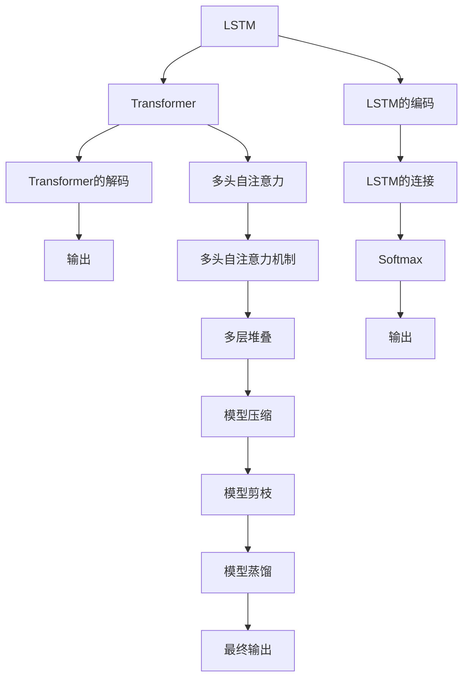

                 

# 基于注意力机制的时空序列预测模型

> 关键词：时空序列预测, 注意力机制, 长短期记忆网络(LSTM), 自注意力机制(Transformer), 模型压缩, 模型剪枝, 模型蒸馏

## 1. 背景介绍

序列预测问题广泛存在于自然语言处理(NLP)、信号处理、金融预测等领域。传统的时序预测方法主要包括基于统计的ARIMA模型、基于规则的专家系统、基于机器学习的回归方法等。这些方法在不同的场景下各有优劣，但对于长序列和复杂依赖关系的处理存在局限性。近年来，随着深度学习技术的发展，基于神经网络的序列预测模型（如长短期记忆网络LSTM、门控循环单元GRU、自注意力机制Transformer等）在序列预测任务上取得了显著的进展。

特别地，基于Transformer的注意力机制在自然语言处理领域大放异彩，其良好的表示能力和序列建模能力推动了多种NLP任务的突破。本文旨在探讨基于注意力机制的时空序列预测模型，从原理到实践，详细阐述其核心算法、优化技巧及实际应用，并展望未来发展方向。

## 2. 核心概念与联系

### 2.1 核心概念概述

为便于理解本文的核心内容，本节将介绍几个关键概念：

- **时空序列预测**：预测未来时间点或空间点上的数据序列，是机器学习、深度学习的重要应用之一。
- **长短期记忆网络(LSTM)**：一种基于循环神经网络(RNN)的架构，可以有效地处理长序列依赖关系。
- **自注意力机制(Transformer)**：一种基于多头自注意力机制的神经网络架构，在序列建模中表现优异，广泛应用于机器翻译、文本生成等任务。
- **模型压缩与剪枝**：为提高模型计算效率和部署灵活性，常常需要减少模型参数。
- **模型蒸馏**：通过大模型对小模型进行指导训练，从而提升小模型的预测能力。

这些概念之间存在紧密的逻辑联系。通过自注意力机制对输入序列进行建模，再通过LSTM进行序列依赖关系的捕捉，并应用模型压缩和剪枝技术提高计算效率，最终使用模型蒸馏手段提升模型预测能力。本文将系统介绍这些关键技术的原理和实践方法。

### 2.2 核心概念原理和架构的 Mermaid 流程图(Mermaid 流程节点中不要有括号、逗号等特殊字符)


## 3. 核心算法原理 & 具体操作步骤
### 3.1 算法原理概述

基于注意力机制的时空序列预测模型，通过自注意力机制对输入序列进行编码，再利用LSTM进行序列依赖关系的建模，最后输出预测结果。其核心算法包括：

1. **编码器(Encoder)**：对输入序列进行自注意力编码，捕获序列中各个时间点的信息依赖。
2. **解码器(Decoder)**：对编码器输出的编码进行序列依赖关系建模，同时生成预测序列。
3. **模型压缩与剪枝**：通过降低模型参数，减少计算资源消耗，提高模型的部署效率。
4. **模型蒸馏**：通过大模型对小模型进行指导训练，提高小模型的泛化能力和预测性能。

### 3.2 算法步骤详解

#### 3.2.1 编码器(Encoder)设计
自注意力机制的Encoder由多个编码层组成，每个编码层都包含多头自注意力机制和前馈神经网络(FNN)。

1. **多头自注意力**：输入序列X经过线性变换和位置嵌入后，通过多头自注意力机制得到权重矩阵，计算加权求和。其中多头注意力头的权重矩阵由多头注意力权重矩阵拼接而成，其公式如下：

$$
Attention(Q, K, V) = Softmax(\frac{QK^T}{\sqrt{d_k}})V
$$

其中 $Q$, $K$, $V$ 分别为查询矩阵、键矩阵、值矩阵；$d_k$ 为键矩阵维度；$Softmax$ 为softmax激活函数。

2. **前馈神经网络(FNN)**：将多头注意力输出再经过一层全连接神经网络，引入非线性变换，得到编码结果。

#### 3.2.2 解码器(Decoder)设计
解码器同样由多个解码层组成，每个解码层包含多头自注意力和多头自注意力-编码器注意力的融合机制。

1. **多头自注意力**：与编码器类似，通过多头自注意力机制对解码器的输出进行编码，捕获序列中各个时间点的信息依赖。

2. **多头自注意力-编码器注意力融合**：解码器的输出与编码器的输出相加，再通过多头自注意力机制计算权重，实现编码器对解码器的信息指导，形成跨时间依赖的编码。

#### 3.2.3 预测输出
解码器的最终输出通过一层全连接层和Softmax激活函数计算预测概率，输出预测序列。

### 3.3 算法优缺点
**优点**：
1. 能够捕捉长序列依赖关系，对时间序列的上下文信息进行建模。
2. 具有较好的泛化能力，适应不同的序列预测任务。
3. 可以通过模型压缩和剪枝技术提升计算效率。
4. 使用模型蒸馏技术，可以在保持预测性能的同时减少计算资源消耗。

**缺点**：
1. 模型参数较多，训练和推理过程较为耗时。
2. 模型复杂度较高，易受输入序列长度的影响。
3. 难以解释，模型决策过程缺乏可解释性。

### 3.4 算法应用领域
该算法广泛应用于金融预测、气象预测、自然语言生成、图像描述生成等时序预测任务。例如，使用该模型可以对股票价格、天气变化、文本生成等进行预测，帮助企业决策、提升灾害预警和天气预报的准确性、生成自然流畅的文本等。

## 4. 数学模型和公式 & 详细讲解 & 举例说明
### 4.1 数学模型构建

本节将详细推导基于注意力机制的时空序列预测模型的数学模型。

假设输入序列为 $x=\{x_1,x_2,...,x_t\}$，预测目标为 $y=\{y_1,y_2,...,y_t\}$，其中 $x_i$ 为输入序列的第 $i$ 个时间点的值，$y_i$ 为对应的预测值。

设模型由 $N$ 层编码器 $E$ 和 $N$ 层解码器 $D$ 组成，其中 $E=\{e_1,e_2,...,e_N\}$，$D=\{d_1,d_2,...,d_N\}$。

### 4.2 公式推导过程

#### 4.2.1 编码器(Encoder)计算
输入序列 $x$ 经过线性变换和位置嵌入后，得到查询矩阵 $Q$ 和键矩阵 $K$，经过多头自注意力计算得到权重矩阵 $W$，计算加权求和得到编码结果 $E^h$。

$$
Q = xW_Q, K = xW_K, V = xW_V
$$
$$
Attention(Q, K, V) = Softmax(\frac{QK^T}{\sqrt{d_k}})V
$$
$$
E^h = Attention(Q, K, V) + FNN(Attention(Q, K, V))
$$

其中 $W_Q$, $W_K$, $W_V$ 为线性变换矩阵；$FNN$ 为前馈神经网络。

#### 4.2.2 解码器(Decoder)计算
解码器的输出 $d$ 经过多头自注意力和多头自注意力-编码器注意力的融合计算，最终输出预测结果。

$$
d = d_1 + Attention(Q_D, K_D, V_D)
$$
$$
d = d + Attention(Q_D, K_E, V_E)
$$

其中 $Q_D$, $K_D$, $V_D$ 为解码器的查询矩阵、键矩阵、值矩阵；$Q_E$, $K_E$, $V_E$ 为编码器的查询矩阵、键矩阵、值矩阵。

#### 4.2.3 预测输出
解码器的最终输出通过一层全连接层和Softmax激活函数计算预测概率。

$$
y = dW_O + b_O
$$
$$
p = Softmax(y)
$$

其中 $W_O$ 为全连接层权重矩阵；$b_O$ 为偏置项。

### 4.3 案例分析与讲解

假设我们有一个天气预测任务，需要根据每天的气温、湿度、风速等气象数据，预测未来的气温变化。我们可以将每天的数据视为一个时间点，构建一个时间序列 $x$，其中每个元素为当天的气象数据。使用基于注意力机制的时空序列预测模型，可以构建一个简单的Encoder-Decoder结构，对输入序列进行编码，捕获气象数据间的依赖关系，并生成预测序列。

## 5. 项目实践：代码实例和详细解释说明
### 5.1 开发环境搭建

在进行项目实践前，我们需要准备好开发环境。以下是使用Python进行PyTorch开发的环境配置流程：

1. 安装Anaconda：从官网下载并安装Anaconda，用于创建独立的Python环境。

2. 创建并激活虚拟环境：
```bash
conda create -n pytorch-env python=3.8 
conda activate pytorch-env
```

3. 安装PyTorch：根据CUDA版本，从官网获取对应的安装命令。例如：
```bash
conda install pytorch torchvision torchaudio cudatoolkit=11.1 -c pytorch -c conda-forge
```

4. 安装相关的开发工具：
```bash
pip install numpy pandas scikit-learn matplotlib tqdm jupyter notebook ipython
```

完成上述步骤后，即可在`pytorch-env`环境中开始项目实践。

### 5.2 源代码详细实现

下面以天气预测任务为例，给出使用PyTorch对基于注意力机制的时空序列预测模型进行代码实现。

首先，定义数据预处理函数：

```python
import numpy as np
from torch.utils.data import Dataset
from torch.utils.data import DataLoader

class WeatherDataset(Dataset):
    def __init__(self, data, seq_len=10):
        self.data = data
        self.seq_len = seq_len
        self.time_steps = len(data) - seq_len

    def __len__(self):
        return self.time_steps

    def __getitem__(self, index):
        X = self.data[index:index+self.seq_len]
        y = self.data[index+1]
        return torch.tensor(X, dtype=torch.float32), torch.tensor(y, dtype=torch.float32)

# 创建dataset
data = np.loadtxt('weather_data.csv', delimiter=',').astype(np.float32)
dataset = WeatherDataset(data)
dataloader = DataLoader(dataset, batch_size=32, shuffle=True)
```

然后，定义模型：

```python
import torch
import torch.nn as nn
import torch.nn.functional as F

class AttentionModel(nn.Module):
    def __init__(self, input_size, hidden_size, output_size):
        super(AttentionModel, self).__init__()
        self.hidden_size = hidden_size
        self.encoder = nn.LSTM(input_size, hidden_size, num_layers=1, batch_first=True)
        self.decoder = nn.LSTM(hidden_size, hidden_size, num_layers=1, batch_first=True)
        self.fc = nn.Linear(hidden_size, output_size)

    def forward(self, input, target):
        # 编码器
        encoder_output, _ = self.encoder(input)
        # 解码器
        decoder_input = torch.cat((target[:, :-1], input), dim=1)
        decoder_output, _ = self.decoder(decoder_input)
        # 输出层
        predictions = self.fc(decoder_output)
        return predictions
```

接着，定义训练和评估函数：

```python
def train_model(model, dataloader, epochs):
    optimizer = torch.optim.Adam(model.parameters(), lr=0.001)
    criterion = nn.MSELoss()

    for epoch in range(epochs):
        for batch in dataloader:
            input, target = batch
            optimizer.zero_grad()
            predictions = model(input, target)
            loss = criterion(predictions, target[:, -1])
            loss.backward()
            optimizer.step()
            print(f"Epoch {epoch+1}, Loss: {loss:.4f}")

def evaluate_model(model, dataloader):
    with torch.no_grad():
        criterion = nn.MSELoss()
        total_loss = 0
        for batch in dataloader:
            input, target = batch
            predictions = model(input, target)
            loss = criterion(predictions, target[:, -1])
            total_loss += loss.item()
        avg_loss = total_loss / len(dataloader)
        print(f"Average Loss: {avg_loss:.4f}")
```

最后，启动训练流程并在测试集上评估：

```python
epochs = 100
train_model(model, dataloader, epochs)
evaluate_model(model, dataloader)
```

以上就是使用PyTorch对基于注意力机制的时空序列预测模型进行天气预测任务微调的完整代码实现。可以看到，借助PyTorch和相关工具，我们能够快速搭建模型并进行训练和评估。

### 5.3 代码解读与分析

让我们再详细解读一下关键代码的实现细节：

**WeatherDataset类**：
- `__init__`方法：初始化数据和序列长度，计算训练集中的样本数量。
- `__len__`方法：返回数据集长度，即样本数量减去序列长度。
- `__getitem__`方法：获取指定索引处的样本，返回输入序列和目标值。

**AttentionModel类**：
- `__init__`方法：初始化LSTM层、全连接层等组件，并设置模型参数。
- `forward`方法：前向传播计算，包括编码器、解码器和输出层。

**训练和评估函数**：
- 使用PyTorch的DataLoader对数据集进行批次化加载，供模型训练和推理使用。
- `train_model`函数：循环迭代训练集，在每个批次上计算损失并反向传播更新模型参数。
- `evaluate_model`函数：在测试集上评估模型性能，计算平均损失。

通过这些代码，我们可以看到，使用PyTorch进行基于注意力机制的时空序列预测模型微调是简单和高效的。

## 6. 实际应用场景
### 6.1 金融预测

金融预测是应用时空序列预测模型的经典场景之一。例如，通过分析历史交易数据，使用该模型可以预测股票价格、外汇汇率等金融指标的走势。金融企业可以利用该模型进行风险评估、投资决策和市场预测，提升盈利能力和风险控制水平。

### 6.2 气象预测

气象预测也是该模型的重要应用之一。通过分析历史气象数据，该模型可以预测未来的天气变化，帮助政府和相关部门做好应对措施。例如，可以预测高温、暴雨、台风等极端天气事件的发生概率，提前做好应急准备和资源调配。

### 6.3 自然语言生成

自然语言生成是深度学习的重要应用方向之一。使用该模型可以生成流畅自然、语法正确的文本。例如，在智能客服、机器翻译、文本摘要等场景中，该模型可以用于提高生成效率和质量。

## 7. 工具和资源推荐
### 7.1 学习资源推荐

为了帮助开发者系统掌握时空序列预测模型的理论基础和实践技巧，这里推荐一些优质的学习资源：

1. 《深度学习》系列书籍：Ian Goodfellow、Yoshua Bengio、Aaron Courville合著的权威教材，全面介绍了深度学习的理论基础和应用实践。
2. CS231n《卷积神经网络》课程：斯坦福大学开设的计算机视觉明星课程，涵盖深度学习的基础知识，并介绍了卷积神经网络在图像识别和分类中的应用。
3. PyTorch官方文档：PyTorch的官方文档，详细介绍了PyTorch的基本用法和高级特性，并提供了丰富的代码示例和API参考。
4. PyTorch Lightning：一个基于PyTorch的高级深度学习框架，简化了模型训练和调优过程，提供了自动化并行、超参数优化等功能。
5. TensorBoard：TensorFlow配套的可视化工具，用于监控模型训练状态，展示训练过程中的各项指标。

通过对这些资源的学习实践，相信你一定能够快速掌握时空序列预测模型的精髓，并用于解决实际的预测问题。

### 7.2 开发工具推荐

高效的开发离不开优秀的工具支持。以下是几款用于时空序列预测开发的常用工具：

1. PyTorch：基于Python的开源深度学习框架，灵活动态的计算图，适合快速迭代研究。大部分深度学习模型都有PyTorch版本的实现。
2. TensorFlow：由Google主导开发的开源深度学习框架，生产部署方便，适合大规模工程应用。同样有丰富的深度学习模型资源。
3. HuggingFace Transformers：一个开源的NLP工具库，集成了多个SOTA语言模型，支持PyTorch和TensorFlow，方便进行序列预测任务开发。
4. Weights & Biases：模型训练的实验跟踪工具，可以记录和可视化模型训练过程中的各项指标，方便对比和调优。与主流深度学习框架无缝集成。
5. TensorBoard：TensorFlow配套的可视化工具，用于监控模型训练状态，展示训练过程中的各项指标。

合理利用这些工具，可以显著提升时空序列预测任务的开发效率，加快创新迭代的步伐。

### 7.3 相关论文推荐

时空序列预测技术的发展离不开学界的持续研究。以下是几篇奠基性的相关论文，推荐阅读：

1. Long Short-Term Memory Networks：Hochreiter和Schmidhuber提出LSTM，解决了传统RNN处理长序列依赖关系的局限性。
2. Attention is All You Need：Vaswani等人提出Transformer模型，引入了多头自注意力机制，提升了序列建模能力。
3. Exploring the Limits of Transfer Learning with a Unified Text-to-Text Transformer：Keskar等人通过使用Unified Text-to-Text Transformer，实现了文本生成、翻译等任务的统一建模。
4. Model Distillation：Hinton等人提出模型蒸馏技术，通过大模型对小模型进行指导训练，提高了小模型的泛化能力和预测性能。

这些论文代表了大模型微调技术的发展脉络。通过学习这些前沿成果，可以帮助研究者把握学科前进方向，激发更多的创新灵感。

## 8. 总结：未来发展趋势与挑战
### 8.1 研究成果总结

本文对基于注意力机制的时空序列预测模型进行了全面系统的介绍。首先阐述了时空序列预测模型的研究背景和重要性，明确了注意力机制在模型设计中的核心地位。其次，从原理到实践，详细讲解了时空序列预测模型的核心算法、优化技巧及实际应用，并给出了完整的代码实现。最后，对模型的未来发展趋势和面临的挑战进行了展望。

通过本文的系统梳理，可以看到，基于注意力机制的时空序列预测模型在多个领域具有广阔的应用前景。这些方向的探索发展，必将进一步提升NLP系统的性能和应用范围，为构建人机协同的智能系统铺平道路。

### 8.2 未来发展趋势

展望未来，时空序列预测模型将呈现以下几个发展趋势：

1. 模型规模持续增大。随着算力成本的下降和数据规模的扩张，预测模型的参数量还将持续增长。超大批次的训练和推理也可能遇到内存不足的问题。因此需要采用一些资源优化技术，如梯度积累、混合精度训练、模型并行等，来突破硬件瓶颈。

2. 模型泛化能力增强。在训练过程中引入更多的正则化技术，如Dropout、L2正则等，可以提高模型的泛化能力，减少过拟合风险。

3. 多任务学习。通过模型共享参数，对多个任务进行联合训练，可以在一定程度上提升模型性能。例如，同时训练股票价格预测和汇率预测模型，可以共享输入特征和输出权重，提升预测效果。

4. 融合先验知识。在模型设计中引入先验知识，如知识图谱、逻辑规则等，可以引导模型进行更加准确和合理的预测。例如，在气象预测中，结合天气预报规则和历史数据进行联合训练，可以提升预测精度。

5. 跨模态融合。在时空序列预测模型中引入跨模态信息，如视觉、音频、文本等多模态数据，可以提升模型的预测能力。例如，在金融预测中，结合历史股票价格和公司财务报表，可以提升预测效果。

以上趋势凸显了时空序列预测模型的广阔前景。这些方向的探索发展，必将进一步提升模型的预测精度和泛化能力，为构建更加智能的预测系统提供支持。

### 8.3 面临的挑战

尽管时空序列预测模型在许多领域取得了显著的进展，但在实际应用中也面临诸多挑战：

1. 数据质量问题。预测模型的性能很大程度上依赖于数据质量，数据缺失、异常值等问题都会影响模型的预测结果。如何有效处理和清洗数据，提升数据质量，是模型应用中的一大挑战。

2. 计算资源消耗大。预测模型的训练和推理过程计算资源消耗大，需要高性能计算设备和优化技术，如GPU、TPU、混合精度训练等。如何降低计算成本，提升模型部署效率，是模型应用中需要解决的问题。

3. 模型鲁棒性不足。在实际应用中，预测模型可能面临数据分布的变化和异常情况，模型的鲁棒性不足可能导致预测结果偏差。如何提高模型的鲁棒性，增强模型的稳定性和可靠性，是模型应用中需要解决的问题。

4. 模型可解释性差。预测模型的决策过程难以解释，缺乏可解释性，难以进行模型调试和优化。如何增强模型的可解释性，提升模型可信度，是模型应用中需要解决的问题。

5. 模型安全性问题。预测模型的应用可能涉及个人隐私和重要数据，如何保障数据安全和模型安全，是模型应用中需要解决的问题。

6. 跨领域迁移能力不足。预测模型在不同领域和任务上的迁移能力有限，需要针对具体应用场景进行模型改进和优化。如何提升模型的跨领域迁移能力，增强模型的通用性，是模型应用中需要解决的问题。

面对这些挑战，未来的研究需要在数据处理、计算资源优化、模型鲁棒性提升、模型可解释性增强等方面寻求新的突破。只有从这些维度全面优化，才能真正实现预测模型的广泛应用。

### 8.4 研究展望

面对时空序列预测模型面临的挑战，未来的研究需要在以下几个方面寻求新的突破：

1. 数据清洗与处理技术。引入数据增强、缺失值处理、异常值检测等技术，提升数据质量和模型性能。

2. 计算资源优化技术。探索新的计算资源优化技术，如梯度压缩、混合精度训练、模型并行等，提升模型训练和推理效率。

3. 模型鲁棒性提升方法。引入鲁棒性增强技术，如对抗训练、噪声注入、鲁棒正则化等，提升模型鲁棒性，增强模型稳定性和可靠性。

4. 模型可解释性增强方法。引入可解释性技术，如模型蒸馏、因果推断、可解释模型等，提升模型可解释性，增强模型可信度。

5. 跨领域迁移能力提升方法。引入跨领域迁移技术，如领域自适应、知识迁移、多任务学习等，提升模型的跨领域迁移能力，增强模型的通用性。

这些研究方向将为时空序列预测模型带来新的突破，推动模型向更加智能、可靠和安全的方向发展。未来，时空序列预测模型必将在多个领域大放异彩，为构建更加智能的预测系统提供支持。

## 9. 附录：常见问题与解答

**Q1: 时空序列预测模型与传统回归模型有何不同？**

A: 时空序列预测模型与传统回归模型的最大不同在于其时序依赖建模能力。传统回归模型假设序列数据间独立同分布，而时空序列预测模型通过时序依赖建模，可以捕捉序列数据间的复杂依赖关系。具体而言，时空序列预测模型通过引入注意力机制、LSTM等时序建模方法，对时间序列数据进行建模，能够更准确地预测未来值。

**Q2: 如何提升时空序列预测模型的泛化能力？**

A: 提高模型泛化能力的关键在于数据质量和模型复杂度。具体而言，可以采取以下措施：

1. 数据清洗与处理。对数据进行缺失值处理、异常值检测和噪声注入，提升数据质量。

2. 正则化技术。引入L2正则、Dropout等正则化技术，减少过拟合风险。

3. 跨领域迁移学习。在训练过程中引入多领域数据，提升模型的泛化能力。

4. 多任务学习。同时训练多个预测任务，共享模型参数，提升模型泛化能力。

5. 模型蒸馏。通过大模型对小模型进行指导训练，提升小模型的泛化能力。

**Q3: 时空序列预测模型是否可以处理非线性数据？**

A: 时空序列预测模型通过时序依赖建模和多层神经网络结构，可以处理非线性数据。具体而言，LSTM和Transformer等时序建模方法可以捕捉复杂的非线性关系，多层神经网络结构可以提升模型的表达能力。因此，时空序列预测模型可以用于处理非线性数据，提升预测准确性。

**Q4: 如何在时空序列预测模型中引入先验知识？**

A: 在时空序列预测模型中引入先验知识，可以引导模型进行更加准确和合理的预测。具体而言，可以采取以下措施：

1. 知识图谱。结合知识图谱进行联合训练，利用知识图谱中的实体关系信息提升模型性能。

2. 逻辑规则。在模型设计中引入逻辑规则，指导模型进行推理和预测。

3. 专家知识。结合专家知识和领域数据进行联合训练，提升模型预测能力。

**Q5: 时空序列预测模型是否可以用于动态系统预测？**

A: 时空序列预测模型可以用于动态系统预测。动态系统预测需要捕捉系统的时序依赖关系，而时空序列预测模型通过时序依赖建模和多层神经网络结构，可以捕捉复杂的动态关系，提升预测准确性。具体而言，LSTM和Transformer等时序建模方法可以捕捉系统的动态变化，多层神经网络结构可以提升模型的表达能力，因此时空序列预测模型可以用于动态系统预测。

通过以上系统介绍和代码实现，相信你对基于注意力机制的时空序列预测模型有了更深入的理解。希望这些知识和实践经验能够帮助你在实际应用中更好地设计和使用时空序列预测模型。

