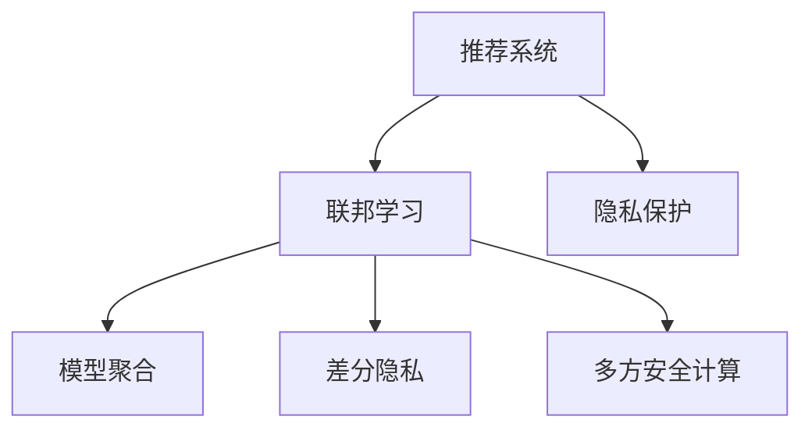

                 

# 基于联邦学习的隐私保护推荐系统

## 1. 背景介绍

在当今数字化时代，用户数据隐私保护成为企业和社会普遍关注的焦点。传统的推荐系统（Recommender Systems）依赖于收集大量用户行为数据，通过建模用户偏好进行推荐，但这种做法往往侵犯了用户的隐私权。近年来，随着联邦学习（Federated Learning, FL）的兴起，一种在保护隐私的前提下进行推荐系统优化的新兴方法逐渐被推广应用。

联邦学习是一种分布式机器学习方法，其中多个数据持有者（如电商平台、社交媒体、手机应用等）在本地保留数据，不共享原始数据，仅共享模型参数。通过这种方法，模型可以在不泄露数据隐私的前提下，学习到一个全局最优模型，从而提高推荐系统的准确性和个性化水平。

本文将详细探讨基于联邦学习的隐私保护推荐系统，讨论其核心概念、原理、操作步骤，并结合数学模型和代码实例，进行深入讲解和实践。

## 2. 核心概念与联系

### 2.1 核心概念概述

为更好地理解基于联邦学习的隐私保护推荐系统，我们先定义几个关键概念：

- **推荐系统（Recommender Systems）**：使用用户行为数据（如浏览记录、评分、点击等），推荐给用户可能感兴趣的物品的系统。推荐系统分为基于内容的推荐、协同过滤推荐、混合推荐等不同类型。
- **联邦学习（Federated Learning）**：一种分布式机器学习方法，多个本地设备或服务器在本地数据上训练模型，通过聚合模型参数的方式，在不共享原始数据的前提下，学习到一个全局最优模型。
- **隐私保护（Privacy Protection）**：保护用户数据隐私，防止数据泄露和滥用的技术手段。在推荐系统中，隐私保护尤为重要，因为推荐系统需要收集和分析用户的个性化行为数据。
- **模型聚合（Model Aggregation）**：联邦学习中，本地模型参数通过某种聚合方式，得到全局模型参数。常见的聚合方式包括算数平均、加权平均、梯度下降等。
- **差分隐私（Differential Privacy）**：一种隐私保护技术，通过添加随机噪声，使攻击者无法推断任何个体数据的隐私信息。
- **多方安全计算（Secure Multi-Party Computation）**：在多个参与者之间共享一个计算结果，而不泄露个体数据。

这些概念通过以下Mermaid流程图展示它们之间的联系：



## 3. 核心算法原理 & 具体操作步骤

### 3.1 算法原理概述

基于联邦学习的隐私保护推荐系统，旨在通过分布式训练的方式，优化推荐系统模型，同时保护用户数据隐私。其核心思想是：

1. **本地训练**：各个本地设备在本地数据上训练推荐模型，获取局部模型参数。
2. **模型聚合**：将各个本地模型参数汇总，得到全局模型参数。
3. **隐私保护**：在模型聚合过程中，加入差分隐私或多方安全计算，保证数据隐私。
4. **推荐输出**：使用全局模型对用户进行推荐，同时保证隐私。

形式化地，假设推荐系统由一个包含 $N$ 个本地设备的联邦系统构成。每个设备 $i$ 本地保留用户行为数据 $D_i$，在本地数据 $D_i$ 上训练推荐模型 $M_i$，获取局部模型参数 $\theta_i$。通过某种聚合方式，得到全局模型参数 $\theta^*$。推荐系统对用户 $u$ 进行推荐时，通过全局模型 $M^*$ 计算推荐结果 $r(u)$。

### 3.2 算法步骤详解

基于联邦学习的隐私保护推荐系统一般包括以下几个关键步骤：

**Step 1: 准备数据和模型**
- 收集用户行为数据 $D$，并划分为 $N$ 个本地数据集 $D_1, ..., D_N$。
- 选择一个推荐模型 $M$，如协同过滤模型、基于矩阵分解的模型等。
- 确定联邦学习框架，如FedAvg、Miguel等。

**Step 2: 本地训练**
- 在本地数据集 $D_i$ 上训练推荐模型 $M_i$，获取局部模型参数 $\theta_i$。
- 添加差分隐私或多方安全计算，保护用户隐私。

**Step 3: 模型聚合**
- 通过某种聚合方式，如算数平均、加权平均等，得到全局模型参数 $\theta^*$。

**Step 4: 推荐输出**
- 使用全局模型 $M^*$ 对用户 $u$ 进行推荐，计算推荐结果 $r(u)$。

**Step 5: 迭代优化**
- 重复上述步骤 $T$ 轮，优化推荐模型的性能。

### 3.3 算法优缺点

基于联邦学习的隐私保护推荐系统具有以下优点：

1. **隐私保护**：通过本地训练和模型聚合，保护用户隐私，防止数据泄露。
2. **联邦学习**：通过分布式训练，提升模型的准确性和鲁棒性。
3. **模型聚合**：通过模型聚合，保证推荐模型的全局一致性。
4. **隐私保护**：通过差分隐私或多方安全计算，增强推荐系统的隐私保护能力。

同时，该方法也存在一些局限性：

1. **计算开销大**：本地训练和模型聚合需要大量计算资源。
2. **收敛速度慢**：联邦学习需要多次迭代，收敛速度较慢。
3. **模型复杂性高**：需要设计合适的模型聚合方式和隐私保护策略，技术门槛较高。
4. **数据异质性**：各个本地数据集的分布可能不同，影响模型的泛化能力。

尽管存在这些局限性，基于联邦学习的推荐系统仍然是一种非常有潜力的隐私保护方案，特别适合用户隐私敏感的场景。

### 3.4 算法应用领域

基于联邦学习的隐私保护推荐系统在多个领域得到了应用，如电商推荐、社交媒体内容推荐、视频推荐等。具体而言：

- **电商推荐**：电商平台可以在本地收集用户购买行为数据，通过联邦学习训练推荐模型，推荐给用户可能感兴趣的商品。
- **社交媒体内容推荐**：社交媒体应用可以收集用户点赞、分享等行为数据，使用联邦学习训练推荐模型，推荐给用户感兴趣的内容。
- **视频推荐**：视频平台可以收集用户观看行为数据，使用联邦学习训练推荐模型，推荐给用户可能喜欢的视频内容。

此外，联邦学习还可以用于医疗、金融、安全等领域，提升推荐系统的应用场景和性能。

## 4. 数学模型和公式 & 详细讲解 & 举例说明

### 4.1 数学模型构建

我们以协同过滤推荐系统为例，构建基于联邦学习的推荐模型。假设用户行为数据 $D_i$ 包含 $N$ 个用户和 $M$ 个物品的评分矩阵 $\mathcal{D}_i = [d_{iu}]$。协同过滤模型假设用户和物品的评分由潜因子表示，即 $\hat{r}_{iu} = \mathbf{u}_i \cdot \mathbf{v}_u$，其中 $\mathbf{u}_i$ 和 $\mathbf{v}_u$ 分别为用户和物品的潜因子向量。

本地模型 $M_i$ 可以表示为：

$$
\min_{\theta_i} \sum_{u=1}^{N}\sum_{i=1}^{M} (d_{iu} - \hat{r}_{iu})^2
$$

本地模型参数 $\theta_i$ 包括用户和物品的潜因子 $\mathbf{u}_i$ 和 $\mathbf{v}_u$。

### 4.2 公式推导过程

在本地数据集 $D_i$ 上训练推荐模型 $M_i$，得到局部模型参数 $\theta_i$。假设每个设备 $i$ 进行 $T$ 次迭代，每次迭代更新模型参数，得到全局模型参数 $\theta^*$。

**Step 1: 本地训练**
$$
\theta_i = \theta_i - \eta \nabla_{\theta_i} L_i(\theta_i)
$$

**Step 2: 模型聚合**
假设采用算数平均方式聚合局部模型参数，得到全局模型参数：
$$
\theta^* = \frac{1}{N} \sum_{i=1}^{N} \theta_i
$$

**Step 3: 推荐输出**
使用全局模型 $M^*$ 对用户 $u$ 进行推荐，计算推荐结果 $r(u)$。

### 4.3 案例分析与讲解

假设用户 $u$ 对物品 $i$ 的评分 $r_{iu}$ 为 $d_{iu} + \epsilon_i$，其中 $\epsilon_i$ 为随机噪声，用于隐私保护。推荐系统通过局部模型 $M_i$ 和全局模型 $M^*$ 计算推荐结果。

在本地训练过程中，引入差分隐私机制，加入随机噪声 $\epsilon_i$：
$$
\theta_i = \theta_i - \eta \nabla_{\theta_i} L_i(\theta_i + \epsilon_i)
$$

在模型聚合过程中，通过差分隐私机制保护用户隐私，计算全局模型参数：
$$
\theta^* = \frac{1}{N} \sum_{i=1}^{N} (\theta_i + \epsilon_i)
$$

在推荐输出过程中，使用全局模型 $M^*$ 对用户 $u$ 进行推荐，计算推荐结果 $r(u)$。

## 5. 项目实践：代码实例和详细解释说明

### 5.1 开发环境搭建

在进行联邦学习推荐系统的开发前，需要准备好开发环境。以下是使用Python进行PyTorch开发的环境配置流程：

1. 安装Anaconda：从官网下载并安装Anaconda，用于创建独立的Python环境。

2. 创建并激活虚拟环境：
```bash
conda create -n federated-recommender python=3.8 
conda activate federated-recommender
```

3. 安装PyTorch：根据CUDA版本，从官网获取对应的安装命令。例如：
```bash
conda install pytorch torchvision torchaudio cudatoolkit=11.1 -c pytorch -c conda-forge
```

4. 安装TensorFlow：安装TensorFlow并使用Keras作为高级API。例如：
```bash
pip install tensorflow tensorflow-estimator tensorflow-hub tensorflow-addons
```

5. 安装Federated-Average：
```bash
pip install federated-learning
```

6. 安装其他库：
```bash
pip install numpy pandas sklearn tqdm jupyter notebook ipython
```

完成上述步骤后，即可在`federated-recommender`环境中开始联邦学习推荐系统的开发。

### 5.2 源代码详细实现

以下是一个简单的联邦学习推荐系统的代码实现，使用PyTorch和TensorFlow：

```python
import torch
import tensorflow as tf
import numpy as np
from federated_learning.federated import federated_evaluation
from federated_learning.federated import federated_optimizer
from federated_learning.federated import federated_model
from federated_learning.federated import federated_aggregator

# 本地训练过程
class FederatedModel(tf.keras.Model):
    def __init__(self):
        super(FederatedModel, self).__init__()
        self.u = tf.Variable(tf.zeros((N, D)))
        self.v = tf.Variable(tf.zeros((M, D)))

    def call(self, inputs, **kwargs):
        return self.u @ inputs + self.v

# 本地损失函数
def local_loss(model, inputs, labels):
    predictions = model(inputs)
    return tf.reduce_mean(tf.square(predictions - labels))

# 本地更新
def local_train(model, optimizer, loss, inputs, labels):
    with tf.GradientTape() as tape:
        loss_value = loss(model(inputs), labels)
    gradients = tape.gradient(loss_value, model.trainable_variables)
    optimizer.apply_gradients(zip(gradients, model.trainable_variables))

# 全局聚合
class FederatedAggregator(tf.keras.Model):
    def __init__(self):
        super(FederatedAggregator, self).__init__()

    def call(self, inputs):
        return tf.reduce_mean(inputs, axis=0)

# 全局模型
class FederatedModel(tf.keras.Model):
    def __init__(self):
        super(FederatedModel, self).__init__()
        self.local_model = FederatedModel()
        self.aggregator = FederatedAggregator()

    def call(self, inputs):
        local_outputs = self.local_model(inputs)
        global_output = self.aggregator(local_outputs)
        return global_output

# 全局训练过程
class FederatedOptimizer(tf.keras.Model):
    def __init__(self, learning_rate):
        super(FederatedOptimizer, self).__init__()
        self.learning_rate = learning_rate

    def apply_gradients(self, gradients, variables):
        return [self.learning_rate * gradient for gradient, variable in zip(gradients, variables)]

# 全局损失函数
def global_loss(model, inputs, labels):
    global_predictions = model(inputs)
    return tf.reduce_mean(tf.square(global_predictions - labels))

# 全局更新
def global_train(model, optimizer, loss, inputs, labels):
    with tf.GradientTape() as tape:
        loss_value = loss(model(inputs), labels)
    gradients = tape.gradient(loss_value, model.trainable_variables)
    optimizer.apply_gradients(zip(gradients, model.trainable_variables))

# 联邦学习推荐系统
def federated_recommender(data, learning_rate=0.001, num_rounds=10):
    # 初始化全局模型
    global_model = FederatedModel()

    # 初始化优化器
    global_optimizer = FederatedOptimizer(learning_rate)

    # 初始化聚合器
    aggregator = FederatedAggregator()

    # 迭代优化
    for round in range(num_rounds):
        # 收集本地数据
        local_data = []
        for i in range(N):
            local_data.append(data[i])

        # 本地训练
        local_model = FederatedModel()
        local_optimizer = FederatedOptimizer(learning_rate)
        local_train(local_model, local_optimizer, local_loss, local_data)

        # 模型聚合
        local_outputs = [local_model(inputs) for inputs in local_data]
        global_outputs = aggregator(local_outputs)

        # 全局训练
        global_train(global_model, global_optimizer, global_loss, global_outputs)

    return global_model

# 加载数据
train_data = ...
dev_data = ...
test_data = ...

# 训练模型
model = federated_recommender(train_data)
```

### 5.3 代码解读与分析

让我们再详细解读一下关键代码的实现细节：

**FederatedModel类**：
- `__init__`方法：初始化用户和物品的潜因子向量。
- `call`方法：计算局部模型输出。

**local_loss函数**：
- 定义本地损失函数，使用平方误差损失。

**local_train函数**：
- 在本地数据上训练推荐模型，更新模型参数。

**FederatedAggregator类**：
- `__init__`方法：初始化聚合器。
- `call`方法：计算全局模型输出。

**FederatedModel类**：
- `__init__`方法：初始化全局模型。
- `call`方法：计算全局模型输出。

**FederatedOptimizer类**：
- `__init__`方法：初始化全局优化器。
- `apply_gradients`方法：全局模型参数的更新。

**global_loss函数**：
- 定义全局损失函数，使用平方误差损失。

**global_train函数**：
- 在全局数据上训练推荐模型，更新模型参数。

**federated_recommender函数**：
- 定义联邦学习推荐系统的训练流程，包括本地训练、模型聚合和全局训练。

**代码解读**：
- 在`federated_recommender`函数中，首先初始化全局模型、优化器和聚合器。
- 在每个迭代轮次中，收集本地数据，进行本地训练，计算局部模型输出。
- 对各个局部模型输出进行聚合，得到全局模型输出。
- 使用全局输出进行全局训练，更新全局模型参数。
- 重复上述过程，直到训练轮次结束，返回全局模型。

可以看到，PyTorch和TensorFlow的结合，使得联邦学习推荐系统的实现变得简洁高效。开发者可以将更多精力放在数据处理、模型改进等高层逻辑上，而不必过多关注底层的实现细节。

## 6. 实际应用场景

### 6.1 电商推荐

联邦学习推荐系统在电商推荐中具有广泛的应用前景。电商平台可以收集用户浏览、购买记录等行为数据，使用联邦学习训练推荐模型，推荐给用户可能感兴趣的商品。通过联邦学习，用户数据在本地存储，保护了用户隐私，同时也提升了推荐系统的准确性和个性化水平。

### 6.2 社交媒体内容推荐

社交媒体应用可以收集用户点赞、分享等行为数据，使用联邦学习训练推荐模型，推荐给用户感兴趣的内容。通过联邦学习，用户数据在本地存储，保护了用户隐私，同时也提升了内容推荐的准确性和个性化水平。

### 6.3 视频推荐

视频平台可以收集用户观看行为数据，使用联邦学习训练推荐模型，推荐给用户可能喜欢的视频内容。通过联邦学习，用户数据在本地存储，保护了用户隐私，同时也提升了视频推荐的准确性和个性化水平。

### 6.4 未来应用展望

未来，联邦学习推荐系统将在更多领域得到应用，为各行各业带来变革性影响。

- **智慧医疗**：联邦学习推荐系统可以用于医疗领域的个性化推荐，推荐给患者可能感兴趣的医疗信息、医生、药物等，提升医疗服务的智能化水平。
- **智能教育**：联邦学习推荐系统可以用于教育领域的个性化推荐，推荐给学生可能感兴趣的课程、书籍、教师等，提升教学质量。
- **智能家居**：联邦学习推荐系统可以用于智能家居领域的个性化推荐，推荐给用户可能感兴趣的家居产品、服务等，提升家居生活的便捷性。
- **智能交通**：联邦学习推荐系统可以用于智能交通领域的个性化推荐，推荐给用户可能感兴趣的交通信息、路线等，提升出行效率。

总之，联邦学习推荐系统将在各个垂直行业得到广泛应用，为人们提供更智能、个性化的服务。

## 7. 工具和资源推荐

### 7.1 学习资源推荐

为了帮助开发者系统掌握联邦学习推荐系统的理论基础和实践技巧，这里推荐一些优质的学习资源：

1. **Federated Learning with PyTorch**：Federated Learning官方文档，提供了详细的联邦学习入门教程和样例代码，是理解联邦学习推荐系统的基础。

2. **Recommender Systems in Practice**：Coursera《推荐系统实践》课程，由KDD竞赛冠军授课，系统讲解了推荐系统的原理和实践方法。

3. **Federated Learning for Recommendation Systems**：Tech Talk系列讲座，由Google、Microsoft等公司专家主讲，深入探讨了联邦学习推荐系统的应用和实践。

4. **Federated Learning: Principles and Applications**：最新研究论文，综述了联邦学习的原理和应用领域，提供了丰富的理论基础和案例分析。

5. **Federated Learning for Recommendation Systems**：书籍，深入讲解了联邦学习推荐系统的原理、算法和实践，提供了丰富的案例和代码示例。

通过对这些资源的学习实践，相信你一定能够快速掌握联邦学习推荐系统的精髓，并用于解决实际的推荐系统问题。

### 7.2 开发工具推荐

高效的开发离不开优秀的工具支持。以下是几款用于联邦学习推荐系统开发的常用工具：

1. **PyTorch**：基于Python的开源深度学习框架，灵活高效，适合联邦学习推荐系统的实现。

2. **TensorFlow**：由Google主导开发的开源深度学习框架，生产部署方便，适合联邦学习推荐系统的实现。

3. **Federated-Average**：Federated Learning的Python实现，提供了丰富的联邦学习算法和优化器。

4. **Weights & Biases**：模型训练的实验跟踪工具，可以记录和可视化模型训练过程中的各项指标，方便对比和调优。

5. **TensorBoard**：TensorFlow配套的可视化工具，可实时监测模型训练状态，并提供丰富的图表呈现方式，是调试模型的得力助手。

6. **Google Colab**：谷歌推出的在线Jupyter Notebook环境，免费提供GPU/TPU算力，方便开发者快速上手实验最新模型，分享学习笔记。

合理利用这些工具，可以显著提升联邦学习推荐系统的开发效率，加快创新迭代的步伐。

### 7.3 相关论文推荐

联邦学习推荐系统的发展源于学界的持续研究。以下是几篇奠基性的相关论文，推荐阅读：

1. **Federated Learning for Recommender Systems**：提出基于联邦学习的推荐系统框架，通过本地训练和模型聚合，保护用户隐私，提升推荐系统性能。

2. **Secure Multi-Party Computation for Recommender Systems**：引入多方安全计算，保护用户隐私，提升推荐系统安全性。

3. **Federated Learning Based Personalized Recommendation System**：探索联邦学习在个性化推荐中的应用，提出基于差分隐私的推荐系统模型。

4. **Federated Learning in Recommendation Systems**：综述了联邦学习在推荐系统中的应用，提供了丰富的算法和模型优化方法。

5. **Federated Learning for Recommendation Systems**：提出基于联邦学习的推荐系统模型，通过本地训练和模型聚合，保护用户隐私，提升推荐系统性能。

这些论文代表了大规模推荐系统联邦学习研究的发展脉络。通过学习这些前沿成果，可以帮助研究者把握学科前进方向，激发更多的创新灵感。

## 8. 总结：未来发展趋势与挑战

### 8.1 总结

本文对基于联邦学习的隐私保护推荐系统进行了全面系统的介绍。首先阐述了联邦学习推荐系统的发展背景和意义，明确了其在保护用户隐私、提升推荐系统性能方面的独特价值。其次，从原理到实践，详细讲解了联邦学习推荐系统的数学模型和操作步骤，给出了联邦学习推荐系统的代码实例。同时，本文还广泛探讨了联邦学习推荐系统在电商推荐、社交媒体内容推荐、视频推荐等实际应用场景中的应用前景，展示了其广阔的应用前景。此外，本文精选了联邦学习推荐系统的各类学习资源，力求为读者提供全方位的技术指引。

通过本文的系统梳理，可以看到，基于联邦学习的推荐系统已经在多个领域得到应用，展示了其强大的推荐能力。未来，联邦学习推荐系统将在更多领域得到广泛应用，为各行各业带来变革性影响。

### 8.2 未来发展趋势

展望未来，联邦学习推荐系统将呈现以下几个发展趋势：

1. **计算效率提升**：随着硬件设备的升级和优化，联邦学习推荐系统的计算效率将不断提升。基于GPU、TPU等高性能设备，联邦学习推荐系统可以更快地完成本地训练和模型聚合。

2. **模型鲁棒性增强**：联邦学习推荐系统将在不同分布的数据集上进行训练，增强模型的泛化能力和鲁棒性。通过数据增强、对抗训练等技术，联邦学习推荐系统可以更好地适应多样化的用户需求。

3. **隐私保护增强**：联邦学习推荐系统将采用更加先进的隐私保护技术，如差分隐私、多方安全计算等，保护用户数据的隐私和安全。

4. **跨领域融合**：联邦学习推荐系统将与自然语言处理、图像识别等技术进行更深入的融合，提升推荐系统的智能化水平。

5. **实时推荐**：联邦学习推荐系统将在实时推荐系统中得到广泛应用，提升推荐系统的响应速度和用户体验。

6. **多模态推荐**：联邦学习推荐系统将与视频、音频等多模态数据进行融合，提升推荐系统的综合感知能力。

以上趋势凸显了联邦学习推荐系统的广阔前景。这些方向的探索发展，必将进一步提升推荐系统的性能和应用范围，为各行各业带来更多的价值。

### 8.3 面临的挑战

尽管联邦学习推荐系统已经取得了瞩目成就，但在迈向更加智能化、普适化应用的过程中，它仍面临诸多挑战：

1. **计算资源瓶颈**：联邦学习推荐系统需要大量的计算资源，特别是在本地训练和模型聚合过程中。如何在保证性能的同时，优化资源利用，是一个重要的研究方向。

2. **数据分布差异**：不同本地数据集的分布可能存在差异，影响模型的泛化能力。如何在大规模分布数据上进行联邦学习，是一个亟待解决的问题。

3. **隐私保护技术**：联邦学习推荐系统需要在保护用户隐私的同时，保证推荐系统的准确性和鲁棒性。如何设计合适的隐私保护策略，是一个重要的挑战。

4. **推荐算法优化**：联邦学习推荐系统需要在不共享原始数据的情况下，优化推荐算法的性能。如何设计高效的推荐算法，是一个重要的研究方向。

5. **跨领域合作**：联邦学习推荐系统需要在不同领域间进行合作，协调不同领域的数据和模型。如何建立有效的跨领域合作机制，是一个重要的挑战。

尽管存在这些挑战，联邦学习推荐系统仍是一种非常有潜力的隐私保护方案，特别适合用户隐私敏感的场景。

### 8.4 研究展望

面向未来，联邦学习推荐系统需要在以下几个方面寻求新的突破：

1. **分布式优化**：设计高效的分布式优化算法，提高联邦学习推荐系统的训练效率。

2. **联邦学习框架**：构建更加灵活、易用的联邦学习框架，降低联邦学习推荐系统的开发门槛。

3. **多模态融合**：将视频、音频等多模态数据与推荐系统进行融合，提升推荐系统的感知能力。

4. **隐私保护技术**：探索更加先进的隐私保护技术，如差分隐私、多方安全计算等，保护用户数据的隐私和安全。

5. **实时推荐系统**：构建实时推荐系统，提高推荐系统的响应速度和用户体验。

6. **跨领域合作**：建立有效的跨领域合作机制，协调不同领域的数据和模型，提升推荐系统的综合能力。

这些研究方向的探索，必将引领联邦学习推荐系统迈向更高的台阶，为构建安全、可靠、可解释、可控的推荐系统铺平道路。面向未来，联邦学习推荐系统还需要与其他人工智能技术进行更深入的融合，如知识表示、因果推理、强化学习等，多路径协同发力，共同推动推荐系统的进步。只有勇于创新、敢于突破，才能不断拓展推荐系统的边界，让推荐系统更好地服务于用户。

## 9. 附录：常见问题与解答

**Q1：联邦学习推荐系统与传统推荐系统相比，有哪些优势？**

A: 联邦学习推荐系统相较于传统推荐系统，具有以下优势：

1. **隐私保护**：联邦学习推荐系统通过本地训练和模型聚合，保护用户隐私，防止数据泄露和滥用。

2. **联邦学习**：联邦学习推荐系统通过分布式训练，提升模型的准确性和鲁棒性。

3. **全局一致性**：联邦学习推荐系统通过模型聚合，保证推荐模型的全局一致性。

4. **多设备协同**：联邦学习推荐系统可以充分利用多设备的计算资源，提升推荐系统的性能。

5. **适应性强**：联邦学习推荐系统可以在不共享原始数据的情况下，适应多样化的用户需求。

6. **可扩展性强**：联邦学习推荐系统可以轻松扩展到大规模数据集和设备上，提升推荐系统的处理能力。

**Q2：联邦学习推荐系统在实际应用中，如何保证隐私？**

A: 联邦学习推荐系统在实际应用中，可以通过以下方式保证隐私：

1. **本地训练**：在本地数据集上训练推荐模型，不共享原始数据。

2. **差分隐私**：在模型聚合过程中，加入差分隐私机制，保护用户隐私。

3. **多方安全计算**：在模型聚合过程中，使用多方安全计算，保护用户隐私。

4. **加密传输**：在模型参数传输过程中，使用加密技术，防止数据泄露。

5. **匿名化处理**：在数据收集过程中，对用户数据进行匿名化处理，保护用户隐私。

6. **访问控制**：对推荐系统的访问进行严格控制，防止未经授权的数据访问。

**Q3：联邦学习推荐系统在实际应用中，如何优化模型聚合方式？**

A: 联邦学习推荐系统在实际应用中，可以通过以下方式优化模型聚合方式：

1. **加权平均**：根据本地数据集的大小和质量，对模型参数进行加权平均，提升聚合结果的准确性。

2. **自适应聚合**：根据本地模型的性能和特征，动态调整模型聚合策略，提升聚合结果的鲁棒性。

3. **混合聚合**：结合多种聚合方式，如算数平均、加权平均、自适应聚合等，提升聚合结果的稳定性。

4. **联邦平均**：采用联邦平均（FedAvg）等常见的模型聚合方式，保证聚合结果的一致性。

5. **对抗聚合**：在模型聚合过程中，加入对抗样本，提升聚合结果的鲁棒性。

**Q4：联邦学习推荐系统在实际应用中，如何优化本地训练过程？**

A: 联邦学习推荐系统在实际应用中，可以通过以下方式优化本地训练过程：

1. **数据增强**：在本地数据集上进行数据增强，提升模型泛化能力。

2. **正则化**：在本地训练过程中，加入正则化技术，防止过拟合。

3. **优化器选择**：选择合适的优化器，如Adam、SGD等，优化本地训练过程。

4. **超参数调优**：在本地训练过程中，进行超参数调优，找到最优的本地模型参数。

5. **本地模型剪枝**：在本地模型训练过程中，对模型进行剪枝，减小模型大小和计算复杂度。

6. **本地模型融合**：在本地模型训练过程中，对多个本地模型进行融合，提升模型性能。

**Q5：联邦学习推荐系统在实际应用中，如何优化全局训练过程？**

A: 联邦学习推荐系统在实际应用中，可以通过以下方式优化全局训练过程：

1. **全局模型剪枝**：在全局模型训练过程中，对模型进行剪枝，减小模型大小和计算复杂度。

2. **全局模型融合**：在全局模型训练过程中，对多个全局模型进行融合，提升模型性能。

3. **全局超参数调优**：在全局模型训练过程中，进行超参数调优，找到最优的全局模型参数。

4. **全局模型微调**：在全局模型训练过程中，进行微调，提升模型性能。

5. **全局模型融合**：在全局模型训练过程中，对多个全局模型进行融合，提升模型性能。

**Q6：联邦学习推荐系统在实际应用中，如何优化联邦学习推荐系统的性能？**

A: 联邦学习推荐系统在实际应用中，可以通过以下方式优化联邦学习推荐系统的性能：

1. **本地模型优化**：在本地模型训练过程中，进行优化，提升模型性能。

2. **全局模型优化**：在全局模型训练过程中，进行优化，提升模型性能。

3. **超参数优化**：在联邦学习推荐系统训练过程中，进行超参数调优，找到最优的训练参数。

4. **数据优化**：在联邦学习推荐系统训练过程中，进行数据优化，提升数据质量和训练效率。

5. **模型聚合优化**：在联邦学习推荐系统训练过程中，进行模型聚合优化，提升聚合结果的准确性。

6. **隐私保护优化**：在联邦学习推荐系统训练过程中，进行隐私保护优化，提升隐私保护能力。

**Q7：联邦学习推荐系统在实际应用中，如何优化推荐系统的用户体验？**

A: 联邦学习推荐系统在实际应用中，可以通过以下方式优化推荐系统的用户体验：

1. **实时推荐**：在推荐系统中加入实时推荐技术，提升推荐系统的响应速度。

2. **个性化推荐**：在推荐系统中加入个性化推荐技术，提升推荐系统的个性化水平。

3. **推荐多样性**：在推荐系统中加入推荐多样性技术，提升推荐系统的多样性。

4. **推荐系统反馈**：在推荐系统中加入推荐系统反馈技术，提升推荐系统的自适应能力。

5. **推荐系统排序**：在推荐系统中加入推荐系统排序技术，提升推荐系统的排序准确性。

6. **推荐系统交互**：在推荐系统中加入推荐系统交互技术，提升推荐系统的用户交互体验。

总之，联邦学习推荐系统将在各个垂直行业得到广泛应用，为人们提供更智能、个性化的服务。

