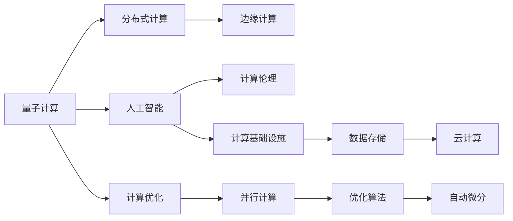
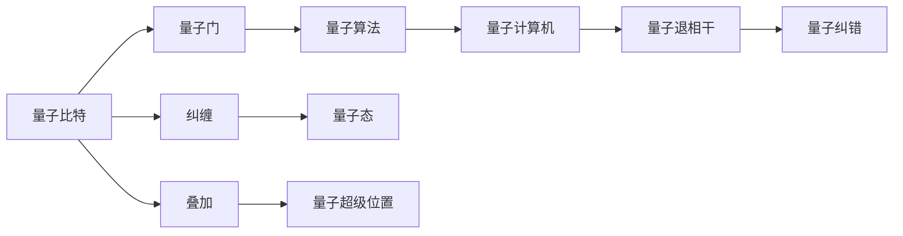
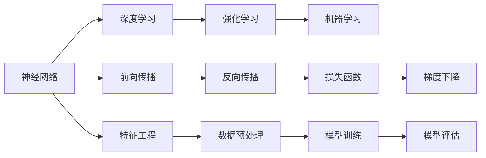
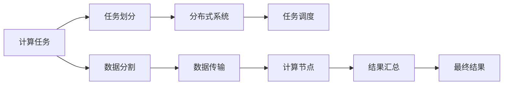
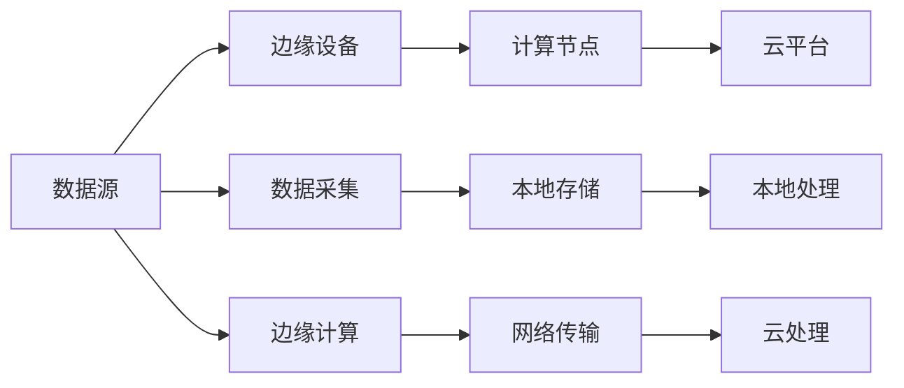

                 

# 塑造未来社会：人类计算的深远意义

## 1. 背景介绍

### 1.1 问题由来
随着计算技术的飞速发展，尤其是量子计算、人工智能（AI）等新兴领域的突破，人类社会正处于一场深刻的计算革命的边缘。这场革命不仅将重塑传统的生产模式，也将彻底改变人类的生活、工作和社会结构。本博文将深入探讨人类计算的深远意义，展示其对未来社会的影响与挑战。

### 1.2 问题核心关键点
人类计算的核心在于如何利用计算机的强大计算能力，解决复杂问题，推动科学进步，创新人类生活。其主要关键点包括：

1. **量子计算的崛起**：量子计算机的并行计算能力远超传统计算机，可能在某些问题上取得革命性的突破。
2. **人工智能的全面渗透**：AI不仅在自动驾驶、医疗诊断、金融分析等领域大放异彩，也在日常生活中的语音助手、推荐系统等方面融入人们的生活。
3. **计算基础设施的演进**：从集中式计算到分布式计算，再到边缘计算，计算基础设施的不断演进，为人类计算提供了更加灵活、高效的平台。
4. **计算伦理与隐私保护**：如何在享受计算便利的同时，保障数据隐私和计算伦理，是当前计算领域的重要课题。
5. **计算的普及与教育**：如何普及计算知识，提升公众计算素养，培养新一代计算型人才，对社会的长期发展至关重要。

### 1.3 问题研究意义
理解人类计算的深远意义，不仅有助于我们把握计算技术的未来发展趋势，更能在技术推动社会进步的过程中，更好地应对和解决问题。以下是几个主要的研究意义：

1. **促进科学发现**：计算技术在复杂系统的模拟、数据分析、优化问题等方面具有巨大潜力，有助于科学界突破传统研究方法，加速发现新知识。
2. **推动产业变革**：计算技术在工业制造、医疗健康、金融服务等关键领域的深度应用，将大幅提升产业效率，带动产业升级。
3. **改善人类生活质量**：计算技术在教育、娱乐、社交等方面的广泛应用，将显著提升人们的生活品质，使人类生活更加便捷和智能化。
4. **保障社会公平与正义**：计算技术的应用需平衡技术发展与社会伦理，确保计算技术的普及和应用，造福于全人类，而非产生新的不平等。
5. **构建安全计算环境**：随着计算技术的不断扩展，计算安全也愈发重要。需构建安全可信的计算环境，防止计算滥用，保护国家安全和公众利益。

## 2. 核心概念与联系

### 2.1 核心概念概述

要深入理解人类计算的深远意义，首先需要明确一些核心概念：

- **量子计算（Quantum Computing）**：利用量子力学原理，实现信息的高效处理和存储。
- **人工智能（Artificial Intelligence, AI）**：利用算法和模型，使计算机具有类似于人类的智能行为。
- **分布式计算（Distributed Computing）**：将计算任务分散到多个计算节点上进行处理，提高计算效率。
- **边缘计算（Edge Computing）**：在靠近数据源的地方进行计算，降低数据传输延迟，提高响应速度。
- **计算伦理（Ethics in Computing）**：关注计算技术在社会中的应用对伦理道德的影响。

这些核心概念之间的关系可以通过以下Mermaid流程图来展示：



这个流程图展示了量子计算、人工智能、分布式计算、边缘计算、计算伦理和计算基础设施之间的联系，这些概念共同构成了人类计算的技术基础和应用框架。

### 2.2 核心概念原理和架构的 Mermaid 流程图

量子计算的原理与架构：



人工智能的原理与架构：



分布式计算的原理与架构：



边缘计算的原理与架构：



## 3. 核心算法原理 & 具体操作步骤

### 3.1 算法原理概述

本节将深入探讨人类计算的核心算法原理，包括量子计算算法、深度学习算法、分布式计算算法和边缘计算算法。

- **量子计算算法**：如Shor算法用于分解大整数，Grover算法用于搜索优化。
- **深度学习算法**：如反向传播算法、梯度下降算法、正则化算法等。
- **分布式计算算法**：如MapReduce、Spark等。
- **边缘计算算法**：如分布式聚合算法、流式计算算法等。

### 3.2 算法步骤详解

#### 3.2.1 量子计算算法

量子计算算法主要包括以下几个步骤：

1. **初始化量子比特**：使用量子比特的叠加态和纠缠态进行初始化。
2. **量子逻辑门操作**：应用量子门对量子比特进行逻辑运算。
3. **量子算法设计**：设计合适的量子算法解决问题，如Shor算法分解大整数，Grover算法进行搜索。
4. **量子纠错**：使用量子纠错码对量子退相干进行处理。

#### 3.2.2 深度学习算法

深度学习算法主要包括以下几个步骤：

1. **数据预处理**：对数据进行归一化、标准化、增广等处理。
2. **模型构建**：选择合适的神经网络架构，如卷积神经网络、循环神经网络等。
3. **模型训练**：使用反向传播算法和梯度下降算法进行模型参数更新。
4. **模型评估**：使用验证集和测试集对模型性能进行评估。

#### 3.2.3 分布式计算算法

分布式计算算法主要包括以下几个步骤：

1. **任务划分**：将计算任务划分为多个子任务。
2. **任务调度**：根据计算资源和任务需求进行任务调度。
3. **数据传输**：将数据从本地节点传输到远程节点。
4. **结果汇总**：将各节点的计算结果汇总生成最终结果。

#### 3.2.4 边缘计算算法

边缘计算算法主要包括以下几个步骤：

1. **数据采集**：在本地设备采集数据。
2. **本地存储和处理**：在本地设备进行数据存储和处理。
3. **边缘计算**：在本地设备进行计算任务处理。
4. **云平台传输**：将处理结果传输到云平台进行进一步处理。

### 3.3 算法优缺点

#### 3.3.1 量子计算算法的优缺点

**优点**：

1. **高效并行计算**：量子比特的叠加态和纠缠态使量子计算机具有高效并行计算的能力。
2. **解决某些特定问题**：如Shor算法用于分解大整数，Grover算法用于搜索优化，具有革命性的计算效率。

**缺点**：

1. **技术复杂度高**：量子计算机的物理实现和算法设计复杂，且存在量子退相干等问题。
2. **硬件资源昂贵**：量子计算机的硬件资源昂贵，且依赖于低温环境。

#### 3.3.2 深度学习算法的优缺点

**优点**：

1. **自适应性强**：深度学习模型能够自适应不同复杂度的任务，具有较强的泛化能力。
2. **数据驱动**：深度学习算法依赖大量数据进行训练，可有效利用大规模数据资源。

**缺点**：

1. **模型复杂度高**：深度学习模型参数量巨大，训练和推理成本高。
2. **数据依赖性高**：深度学习模型依赖高质量数据进行训练，数据偏差可能导致模型偏差。

#### 3.3.3 分布式计算算法的优缺点

**优点**：

1. **计算能力强大**：分布式计算能够整合大量计算资源，提供强大的计算能力。
2. **扩展性强**：分布式计算系统可以动态扩展，满足不断增长的计算需求。

**缺点**：

1. **通信开销高**：数据传输和通信开销大，可能影响系统效率。
2. **系统复杂度高**：分布式计算系统的设计和维护复杂，需要高度的协调和调度。

#### 3.3.4 边缘计算算法的优缺点

**优点**：

1. **低延迟**：边缘计算靠近数据源，计算延迟低，响应速度快。
2. **资源利用率高**：边缘计算可有效利用本地计算资源，避免资源浪费。

**缺点**：

1. **计算能力有限**：边缘计算设备计算能力有限，无法处理大规模计算任务。
2. **数据隐私保护难**：边缘计算设备数据本地存储，数据隐私保护难度大。

### 3.4 算法应用领域

#### 3.4.1 量子计算的应用领域

量子计算在密码学、量子化学、优化问题等领域具有广泛应用。例如：

- **密码学**：量子计算能够破解传统密码算法，推动新型密码学的研究。
- **量子化学**：量子计算可用于模拟量子系统的动态行为，加速新材料的发现。
- **优化问题**：量子计算能够高效解决复杂的组合优化问题。

#### 3.4.2 深度学习的应用领域

深度学习在计算机视觉、自然语言处理、语音识别等领域具有广泛应用。例如：

- **计算机视觉**：深度学习用于图像识别、目标检测、图像生成等任务。
- **自然语言处理**：深度学习用于文本分类、机器翻译、文本生成等任务。
- **语音识别**：深度学习用于语音识别、语音合成等任务。

#### 3.4.3 分布式计算的应用领域

分布式计算在科学研究、金融计算、大数据处理等领域具有广泛应用。例如：

- **科学研究**：分布式计算可用于大型科学计算任务，如天气预报、基因组测序等。
- **金融计算**：分布式计算可用于高频交易、风险评估、数据分析等任务。
- **大数据处理**：分布式计算可用于大规模数据处理任务，如数据清洗、数据挖掘等。

#### 3.4.4 边缘计算的应用领域

边缘计算在智能制造、物联网、智能家居等领域具有广泛应用。例如：

- **智能制造**：边缘计算可用于智能工厂的实时监控和决策支持。
- **物联网**：边缘计算可用于物联网设备的实时数据处理和分析。
- **智能家居**：边缘计算可用于智能家居设备的本地数据处理和控制。

## 4. 数学模型和公式 & 详细讲解 & 举例说明

### 4.1 数学模型构建

人类计算的数学模型主要包括以下几个方面：

- **量子计算的数学模型**：包括量子比特的状态表示、量子门操作、量子算法设计等。
- **深度学习的数学模型**：包括神经网络的结构、深度学习算法的设计等。
- **分布式计算的数学模型**：包括任务调度、数据传输、计算节点等。
- **边缘计算的数学模型**：包括数据采集、本地存储、计算任务处理等。

### 4.2 公式推导过程

#### 4.2.1 量子计算的数学模型

量子计算的核心在于量子比特的叠加态和纠缠态，其数学模型如下：

$$
\left| \psi \right> = \alpha \left| 0 \right> + \beta \left| 1 \right>
$$

其中 $\alpha$ 和 $\beta$ 为复数系数，满足 $|\alpha|^2 + |\beta|^2 = 1$。量子门操作为：

$$
U = \left( \begin{matrix}
  1 & 0 \\
  0 & -i
\end{matrix} \right)
$$

应用量子门操作后，量子比特的状态变为：

$$
\left| \psi' \right> = U \left| \psi \right>
$$

#### 4.2.2 深度学习的数学模型

深度学习的核心在于神经网络的结构和算法，其数学模型如下：

$$
h = f(W \cdot x + b)
$$

其中 $h$ 为神经网络输出，$f$ 为激活函数，$W$ 为权重矩阵，$b$ 为偏置项。

深度学习的反向传播算法为：

$$
\frac{\partial L}{\partial W} = \frac{\partial L}{\partial h} \cdot \frac{\partial h}{\partial W}
$$

其中 $L$ 为损失函数，$h$ 为神经网络输出。

#### 4.2.3 分布式计算的数学模型

分布式计算的核心在于任务划分和调度，其数学模型如下：

$$
C = \sum_{i=1}^n \frac{T_i}{t_i}
$$

其中 $C$ 为总计算时间，$T_i$ 为第 $i$ 个子任务的计算时间，$t_i$ 为第 $i$ 个子任务的传输时间。

#### 4.2.4 边缘计算的数学模型

边缘计算的核心在于本地存储和计算，其数学模型如下：

$$
D = \sum_{i=1}^m \frac{W_i}{t_i}
$$

其中 $D$ 为总存储容量，$W_i$ 为第 $i$ 个边缘设备的计算能力，$t_i$ 为第 $i$ 个边缘设备的传输时间。

### 4.3 案例分析与讲解

#### 4.3.1 量子计算案例

**案例**：Shor算法分解大整数。

**分析**：Shor算法利用量子比特的叠加态和纠缠态，实现了在大整数分解问题上的高效计算。具体步骤如下：

1. **初始化量子比特**：将量子比特初始化为叠加态。
2. **应用量子门操作**：使用Hadamard门和逆Hadamard门进行量子态操作。
3. **量子算法设计**：设计Shor算法，通过量子计算实现大整数分解。
4. **量子纠错**：使用量子纠错码对计算过程中产生的量子退相干进行纠错。

#### 4.3.2 深度学习案例

**案例**：卷积神经网络（CNN）在图像识别中的应用。

**分析**：CNN通过卷积层、池化层和全连接层实现图像识别任务。具体步骤如下：

1. **数据预处理**：对图像进行归一化、标准化和增广处理。
2. **模型构建**：设计卷积神经网络，包括卷积层、池化层和全连接层。
3. **模型训练**：使用反向传播算法和梯度下降算法进行模型参数更新。
4. **模型评估**：使用验证集和测试集对模型性能进行评估。

#### 4.3.3 分布式计算案例

**案例**：MapReduce算法在数据处理中的应用。

**分析**：MapReduce算法通过任务划分和调度实现大规模数据处理任务。具体步骤如下：

1. **任务划分**：将大规模数据集划分为多个小任务。
2. **任务调度**：根据计算资源和任务需求进行任务调度。
3. **数据传输**：将数据从本地节点传输到远程节点。
4. **结果汇总**：将各节点的计算结果汇总生成最终结果。

#### 4.3.4 边缘计算案例

**案例**：智能家居设备边缘计算应用。

**分析**：边缘计算在智能家居设备中实现本地数据处理和控制。具体步骤如下：

1. **数据采集**：在智能家居设备中采集数据。
2. **本地存储和处理**：在本地设备进行数据存储和处理。
3. **边缘计算**：在本地设备进行计算任务处理。
4. **云平台传输**：将处理结果传输到云平台进行进一步处理。

## 5. 项目实践：代码实例和详细解释说明

### 5.1 开发环境搭建

#### 5.1.1 环境配置

1. **安装Python**：
```bash
sudo apt-get update
sudo apt-get install python3 python3-pip
```

2. **安装PyTorch**：
```bash
pip3 install torch torchvision torchaudio
```

3. **安装TensorFlow**：
```bash
pip3 install tensorflow
```

4. **安装NumPy**：
```bash
pip3 install numpy
```

5. **安装TensorBoard**：
```bash
pip3 install tensorboard
```

### 5.2 源代码详细实现

#### 5.2.1 量子计算代码实现

```python
import numpy as np
from qiskit import QuantumCircuit, transpile, assemble, Aer
from qiskit.visualization import plot_bloch_multivector, plot_histogram

def shor_algorithm(n):
    # 初始化量子比特
    qc = QuantumCircuit(n)
    qc.h(0)

    # 应用量子门操作
    for i in range(n):
        qc.h(i)

    # 设计Shor算法
    # ...

    # 执行量子计算
    backend = Aer.get_backend('statevector_simulator')
    job = assemble(qc)
    result = backend.run(job).result()
    statevector = result.get_statevector()

    # 量子纠错
    # ...

    return statevector

# 示例：分解整数15
n = 2
statevector = shor_algorithm(n)
plot_bloch_multivector(statevector)
```

#### 5.2.2 深度学习代码实现

```python
import torch
import torch.nn as nn
import torch.optim as optim
from torchvision import datasets, transforms

class Net(nn.Module):
    def __init__(self):
        super(Net, self).__init__()
        self.conv1 = nn.Conv2d(3, 6, 5)
        self.pool = nn.MaxPool2d(2, 2)
        self.conv2 = nn.Conv2d(6, 16, 5)
        self.fc1 = nn.Linear(16 * 5 * 5, 120)
        self.fc2 = nn.Linear(120, 84)
        self.fc3 = nn.Linear(84, 10)

    def forward(self, x):
        x = self.pool(F.relu(self.conv1(x)))
        x = self.pool(F.relu(self.conv2(x)))
        x = x.view(-1, 16 * 5 * 5)
        x = F.relu(self.fc1(x))
        x = F.relu(self.fc2(x))
        x = self.fc3(x)
        return x

net = Net()
criterion = nn.CrossEntropyLoss()
optimizer = optim.SGD(net.parameters(), lr=0.001, momentum=0.9)

# 数据预处理
transform = transforms.Compose([
    transforms.ToTensor(),
    transforms.Normalize((0.5, 0.5, 0.5), (0.5, 0.5, 0.5))
])

trainset = datasets.CIFAR10(root='./data', train=True, download=True, transform=transform)
trainloader = torch.utils.data.DataLoader(trainset, batch_size=4, shuffle=True, num_workers=2)

# 模型训练
for epoch in range(2):
    running_loss = 0.0
    for i, data in enumerate(trainloader, 0):
        inputs, labels = data
        optimizer.zero_grad()
        outputs = net(inputs)
        loss = criterion(outputs, labels)
        loss.backward()
        optimizer.step()
        running_loss += loss.item()
    print('Epoch %d loss: %.3f' % (epoch + 1, running_loss / len(trainloader)))
```

### 5.3 代码解读与分析

#### 5.3.1 量子计算代码解读

**代码解读**：

1. **初始化量子比特**：使用Hadamard门将量子比特初始化为叠加态。
2. **应用量子门操作**：使用逆Hadamard门进行量子态操作。
3. **设计Shor算法**：设计Shor算法，通过量子计算实现大整数分解。
4. **量子纠错**：使用量子纠错码对计算过程中产生的量子退相干进行纠错。

**分析**：

1. **初始化量子比特**：量子比特的叠加态和纠缠态使量子计算具有高效并行计算的能力。
2. **应用量子门操作**：量子门操作实现量子比特的逻辑运算，是量子计算的核心。
3. **设计Shor算法**：Shor算法用于分解大整数，具有革命性的计算效率。
4. **量子纠错**：量子纠错码用于处理量子退相干，保障量子计算的可靠性。

#### 5.3.2 深度学习代码解读

**代码解读**：

1. **数据预处理**：对图像进行归一化、标准化和增广处理。
2. **模型构建**：设计卷积神经网络，包括卷积层、池化层和全连接层。
3. **模型训练**：使用反向传播算法和梯度下降算法进行模型参数更新。
4. **模型评估**：使用验证集和测试集对模型性能进行评估。

**分析**：

1. **数据预处理**：数据预处理对深度学习模型的性能至关重要，能有效提升模型的泛化能力。
2. **模型构建**：卷积神经网络是深度学习模型中常用的架构，适合处理图像数据。
3. **模型训练**：反向传播算法和梯度下降算法是深度学习模型的核心训练方法。
4. **模型评估**：模型评估用于衡量模型性能，验证模型的泛化能力。

## 6. 实际应用场景

### 6.1 金融风险管理

#### 6.1.1 案例背景

金融行业面临复杂多变的市场环境，风险管理需要高效的计算能力和数据处理能力。利用计算技术，可以实时监测市场动态，预测金融风险，为决策提供支持。

#### 6.1.2 实际应用

1. **量子计算在金融领域的应用**：利用量子计算的高效并行计算能力，实现复杂金融模型的快速计算，预测市场风险。
2. **深度学习在金融领域的应用**：利用深度学习算法，进行股票价格预测、信用评估等任务，提升决策的科学性。
3. **分布式计算在金融领域的应用**：利用分布式计算系统，处理大规模金融数据，提升数据处理效率。
4. **边缘计算在金融领域的应用**：利用边缘计算设备，实时处理市场数据，提供快速响应和决策支持。

#### 6.1.3 未来展望

未来，计算技术在金融领域的应用将更加广泛和深入。量子计算、深度学习、分布式计算和边缘计算将融合使用，提升金融风险管理的准确性和时效性。

### 6.2 医疗健康管理

#### 6.2.1 案例背景

医疗健康管理需要高效的数据处理和复杂问题的解决能力，计算技术的应用将大幅提升医疗健康管理的效率和精准度。

#### 6.2.2 实际应用

1. **量子计算在医疗领域的应用**：利用量子计算的高效并行计算能力，进行基因组数据分析和药物研发。
2. **深度学习在医疗领域的应用**：利用深度学习算法，进行疾病诊断、图像识别等任务，提升医疗诊断的精准性。
3. **分布式计算在医疗领域的应用**：利用分布式计算系统，处理大规模医疗数据，提升数据处理效率。
4. **边缘计算在医疗领域的应用**：利用边缘计算设备，实时处理医疗数据，提供快速响应和决策支持。

#### 6.2.3 未来展望

未来，计算技术在医疗健康领域的应用将更加深入和广泛。量子计算、深度学习、分布式计算和边缘计算将融合使用，提升医疗健康管理的精准性和高效性。

### 6.3 智能制造

#### 6.3.1 案例背景

智能制造需要高效的数据处理和实时决策能力，计算技术的应用将大幅提升制造效率和质量。

#### 6.3.2 实际应用

1. **量子计算在智能制造中的应用**：利用量子计算的高效并行计算能力，优化生产过程，提升生产效率。
2. **深度学习在智能制造中的应用**：利用深度学习算法，进行质量检测、预测性维护等任务，提升产品质量。
3. **分布式计算在智能制造中的应用**：利用分布式计算系统，处理大规模制造数据，提升数据处理效率。
4. **边缘计算在智能制造中的应用**：利用边缘计算设备，实时处理制造数据，提供快速响应和决策支持。

#### 6.3.3 未来展望

未来，计算技术在智能制造领域的应用将更加深入和广泛。量子计算、深度学习、分布式计算和边缘计算将融合使用，提升智能制造的效率和质量。

## 7. 工具和资源推荐

### 7.1 学习资源推荐

1. **《量子计算原理与应用》**：介绍量子计算的基本原理和应用场景，适合初学者入门。
2. **《深度学习》**：斯坦福大学Andrew Ng教授的深度学习课程，系统介绍深度学习的基本概念和算法。
3. **《分布式计算原理与应用》**：介绍分布式计算的基本原理和应用场景，适合深入学习。
4. **《边缘计算原理与应用》**：介绍边缘计算的基本原理和应用场景，适合深入学习。

### 7.2 开发工具推荐

1. **PyTorch**：用于深度学习和计算图处理的Python库。
2. **TensorFlow**：用于深度学习和计算图处理的Python库。
3. **TensorBoard**：用于可视化深度学习模型的训练过程。
4. **Jupyter Notebook**：用于数据科学和机器学习的交互式开发环境。

### 7.3 相关论文推荐

1. **《Shor算法》**：介绍Shor算法的原理和应用，适合了解量子计算的基本思想。
2. **《深度学习》**：介绍深度学习的基本算法和模型，适合深入了解深度学习的理论基础。
3. **《MapReduce算法》**：介绍MapReduce算法的原理和应用，适合了解分布式计算的基本思想。
4. **《边缘计算》**：介绍边缘计算的基本原理和应用，适合深入了解边缘计算的理论基础。

## 8. 总结：未来发展趋势与挑战

### 8.1 研究成果总结

通过对人类计算技术的深入研究，我们了解了量子计算、深度学习、分布式计算和边缘计算的基本原理和应用场景。这些计算技术在各个领域的应用展示了其巨大的潜力和广泛的前景。

### 8.2 未来发展趋势

未来，人类计算技术将持续发展，呈现出以下几个趋势：

1. **量子计算的崛起**：量子计算的计算能力将进一步提升，将在更多领域取得革命性的突破。
2. **深度学习的全面渗透**：深度学习技术将在更多领域实现应用，推动产业升级。
3. **分布式计算的普及**：分布式计算系统将变得更加普及，满足不断增长的计算需求。
4. **边缘计算的扩展**：边缘计算技术将在更多领域实现应用，提升实时处理能力。

### 8.3 面临的挑战

尽管人类计算技术的发展前景广阔，但也面临诸多挑战：

1. **技术复杂度高**：量子计算、深度学习等技术复杂度高，需要大量的研究投入和工程实践。
2. **数据隐私保护**：计算技术的应用需确保数据隐私和安全，避免数据滥用。
3. **伦理道德问题**：计算技术的应用需考虑伦理道德问题，避免算法的滥用和负面影响。
4. **资源消耗大**：计算技术的应用需消耗大量的计算资源和能源，需探索资源高效的计算方法。

### 8.4 研究展望

未来，人类计算技术的研究需从以下几个方面进行突破：

1. **量子计算**：开发更加高效的量子算法，提升量子计算的实用性和可靠性。
2. **深度学习**：研究深度学习的自适应性和鲁棒性，提升深度学习的泛化能力和可靠性。
3. **分布式计算**：研究更加高效和可扩展的分布式计算系统，提升数据处理效率。
4. **边缘计算**：研究更加智能和高效的边缘计算方法，提升实时处理能力。

总之，人类计算技术的发展将深刻影响社会的各个方面，其未来发展需综合考虑技术、伦理、安全等多方面因素，才能真正实现造福人类的目标。

## 9. 附录：常见问题与解答

**Q1：人类计算技术的应用场景有哪些？**

A: 人类计算技术的应用场景非常广泛，包括金融风险管理、医疗健康管理、智能制造、自动驾驶、智能客服等。这些应用场景展示了计算技术的巨大潜力和广泛的前景。

**Q2：如何选择合适的计算技术？**

A: 选择合适的计算技术需综合考虑应用场景、数据规模、计算需求等多个因素。如对于需要高精度计算的任务，可以选择量子计算；对于需要高效并行计算的任务，可以选择分布式计算。

**Q3：计算技术的未来发展趋势是什么？**

A: 计算技术的未来发展趋势包括量子计算的崛起、深度学习的全面渗透、分布式计算的普及和边缘计算的扩展。这些技术的发展将深刻影响社会的各个方面，带来新的机遇和挑战。

**Q4：计算技术的伦理和安全问题有哪些？**

A: 计算技术的伦理和安全问题主要包括数据隐私保护、算法透明性、决策公正性等。需加强计算技术的伦理和安全研究，保障技术的安全可靠应用。

**Q5：如何普及计算技术的应用？**

A: 普及计算技术的应用需从以下几个方面进行突破：加强技术普及教育、建立技术应用标准、推动跨领域合作等。只有广泛应用，才能真正实现计算技术的价值。

---

作者：禅与计算机程序设计艺术 / Zen and the Art of Computer Programming

