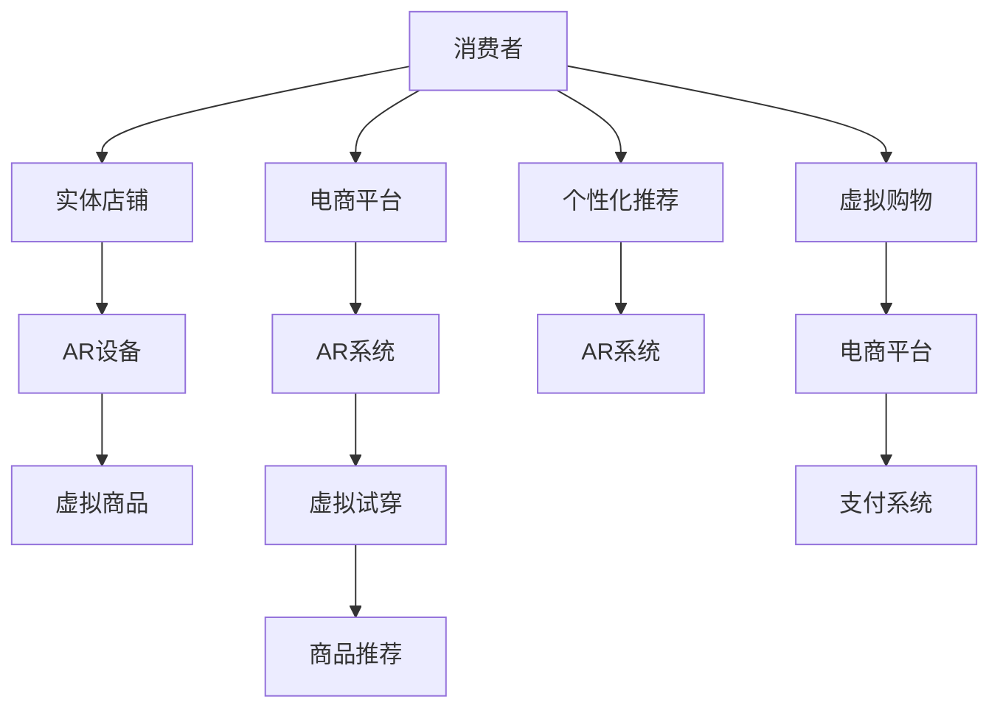

                 

# 增强现实在零售业中的应用：提升购物体验

> 关键词：增强现实（AR）, 零售业, 购物体验, 互动式, 个性化推荐

## 1. 背景介绍

在数字时代的浪潮下，零售业正经历着一场革命性的变化。传统的线下购物模式逐渐向线上和线下融合的体验式购物转变。增强现实（AR）技术，作为一种沉浸式体验手段，正为零售业提供了一个全新的视角，通过将虚拟信息叠加到现实世界中，为消费者带来前所未有的互动式购物体验。

### 1.1 问题由来

随着电商的普及，消费者在享受便捷购物的同时，也遭遇了信息不对称、决策困难等问题。传统线上购物方式往往缺乏真实的物理感受，限制了消费者对商品的全面了解。同时，电商平台的推荐算法和搜索结果虽然可以部分缓解这一问题，但仍然无法完全替代线下体验。

线下实体店虽然在提供真实商品体验方面有着天然优势，但受限于营业时间和空间，难以满足消费者全天候的购物需求。AR技术的引入，为线上线下融合的购物体验提供了新的解决方案。通过AR技术，消费者可以在家中或任何时间地点，通过手机、平板等设备，体验到在实体店铺中才能拥有的交互式购物体验，极大地提升了购物的便捷性和乐趣。

### 1.2 问题核心关键点

增强现实在零售业中的应用主要包括以下几个关键点：
- **互动性增强**：通过AR技术，消费者可以与虚拟商品进行互动，如试穿衣服、试戴首饰、虚拟试用化妆品等。
- **个性化推荐**：基于消费者的偏好和行为数据，AR系统可以实时提供个性化的商品推荐，提升用户体验。
- **虚拟试穿**：在线购物时，消费者可通过AR技术试穿衣物，避免退换货的麻烦。
- **虚拟设计**：消费者可以试搭家具，虚拟布置家居，提前感受购买后的效果。
- **信息透明**：AR技术可以将商品的多角度信息实时展示给消费者，帮助其更好地了解产品细节。

## 2. 核心概念与联系

### 2.1 核心概念概述

增强现实（AR）技术是一种通过将虚拟信息叠加到现实世界，实现虚拟与实物的混合显示的技术。在零售业中，AR技术可以被应用于产品展示、试穿试戴、虚拟购物等多个场景，极大地提升消费者的购物体验。

- **产品展示**：通过AR技术，消费者可以看到商品的全方位信息，如360度旋转、不同颜色选择等。
- **试穿试戴**：AR技术可以模拟试穿试戴效果，提升消费者的购买信心。
- **虚拟购物**：消费者可以在家中通过AR技术浏览虚拟商品，进行比价、预览和购买。
- **互动式体验**：AR技术支持虚拟和实物的互动，如手势控制、语音指令等，使购物体验更加丰富。
- **个性化推荐**：基于消费者的行为和偏好数据，AR系统可以实时推荐相关商品，提升购物效率。

### 2.2 核心概念原理和架构的 Mermaid 流程图



该图展示了AR技术在零售业中的工作流程：

1. 消费者在实体店铺或通过电商平台接触到虚拟商品。
2. 消费者通过AR设备（如手机、平板等）访问AR系统。
3. AR系统提供虚拟试穿、虚拟布置等功能。
4. AR系统基于消费者的行为数据进行个性化推荐。
5. 消费者在虚拟购物环境中进行选择和支付，完成购买流程。

## 3. 核心算法原理 & 具体操作步骤

### 3.1 算法原理概述

增强现实在零售业中的应用，基于计算机视觉、深度学习等技术，通过摄像头、传感器等设备获取环境信息，结合AR软件生成虚拟信息，实现虚拟与实物的融合。具体算法流程包括以下几个步骤：

1. **环境识别**：使用计算机视觉技术，识别并跟踪环境中的物体，如商店、货架、商品等。
2. **物体跟踪**：使用深度学习模型，持续跟踪物体的运动状态，确保虚拟信息与实物实时同步。
3. **虚拟信息生成**：根据环境信息，生成虚拟信息，如商品3D模型、商品多角度展示、试穿试戴效果等。
4. **融合显示**：将虚拟信息叠加到实景中，实现虚拟与实物的混合显示。

### 3.2 算法步骤详解

以下是增强现实在零售业中的核心算法步骤：

**Step 1: 环境识别和物体跟踪**
- 使用摄像头和传感器捕捉环境信息，识别并跟踪商店内的商品和货架。
- 使用卷积神经网络（CNN）进行实时物体检测和跟踪，确保虚拟信息与实物同步。

**Step 2: 虚拟信息生成**
- 根据商品类别和型号，生成虚拟商品的3D模型、材质和光照信息。
- 通过图像处理和3D渲染技术，实现商品的360度旋转和多角度展示。
- 使用深度学习模型，根据用户的行为和偏好，实时生成个性化的推荐信息。

**Step 3: 融合显示**
- 将虚拟商品信息叠加到实景中，使用AR设备（如AR眼镜、智能手机）展示给消费者。
- 实现手势控制、语音指令等互动方式，增强购物体验。
- 提供虚拟试穿、试戴等功能，提升消费者的购买信心。

### 3.3 算法优缺点

增强现实在零售业中的应用具有以下优点：
1. **沉浸式体验**：消费者可以在家中或任何时间地点，通过AR技术体验实物商品，提升购物便捷性。
2. **实时互动**：通过手势控制、语音指令等方式，消费者可以与虚拟商品进行实时互动，提升购物乐趣。
3. **个性化推荐**：基于消费者的行为和偏好数据，AR系统可以实时推荐相关商品，提升购物效率。
4. **信息透明**：AR技术可以将商品的全方位信息实时展示给消费者，帮助其更好地了解产品细节。

同时，该方法也存在一定的局限性：
1. **设备依赖**：需要消费者使用支持AR功能的设备，限制了应用范围。
2. **技术复杂**：AR技术的应用需要较高的技术实现难度，增加了开发和部署成本。
3. **数据隐私**：AR系统需要收集消费者的行为数据进行个性化推荐，存在隐私风险。
4. **交互体验有限**：当前的AR技术仍存在交互体验有限的问题，难以完全模拟实体店铺的购物体验。

### 3.4 算法应用领域

增强现实技术在零售业中具有广泛的应用场景，主要包括以下几个方面：

- **服装鞋帽**：消费者可以在家中通过AR技术试穿衣物，查看不同颜色、款式的搭配效果。
- **家具装饰**：消费者可以在家中虚拟布置家具，预览购买后的家居效果。
- **珠宝首饰**：消费者可以试戴饰品，感受不同的尺寸和样式。
- **化妆品**：消费者可以虚拟试用化妆品，查看不同肤色的效果。
- **汽车家具**：消费者可以虚拟试驾汽车，感受不同配置的性能。
- **电子产品**：消费者可以虚拟试用电子产品，了解其功能和性能。

## 4. 数学模型和公式 & 详细讲解 & 举例说明

### 4.1 数学模型构建

增强现实在零售业中的数学模型主要包括以下几个部分：

- **计算机视觉模型**：用于环境识别和物体跟踪，可以使用卷积神经网络（CNN）实现。
- **深度学习模型**：用于虚拟信息的生成，如3D模型、光照效果等，可以使用生成对抗网络（GAN）或卷积神经网络（CNN）实现。
- **推荐系统模型**：用于个性化推荐，可以使用协同过滤、深度学习等模型实现。

### 4.2 公式推导过程

以服装鞋帽试穿为例，推导AR系统的数学模型。

设 $\boldsymbol{x}$ 为消费者选择的服装，$\boldsymbol{y}$ 为真实穿在身上的服装，$\boldsymbol{z}$ 为AR系统生成的虚拟试穿效果。

AR系统的目标函数为：

$$
\min_{\boldsymbol{\theta}} \mathcal{L}(\boldsymbol{\theta}) = \frac{1}{N} \sum_{i=1}^N \left( (\boldsymbol{z}_i - \boldsymbol{y}_i)^2 \right)
$$

其中，$\boldsymbol{z}_i$ 为AR系统生成的试穿效果，$\boldsymbol{y}_i$ 为消费者实际穿在身上的服装效果。$N$ 为样本数量。

### 4.3 案例分析与讲解

以虚拟试穿为例，解释增强现实在零售业中的应用。

假设消费者选择了一件连衣裙进行虚拟试穿，AR系统通过摄像头捕捉消费者的动作，使用深度学习模型跟踪服装的变换，生成试穿效果。通过比较虚拟试穿效果与真实服装效果，不断调整虚拟信息的参数，确保试穿效果的真实性。

消费者可以在家中的任何位置试穿，无需担心试穿后需要退换货的麻烦，同时可以在虚拟环境中查看不同颜色、款式的搭配效果，提升购物体验。

## 5. 项目实践：代码实例和详细解释说明

### 5.1 开发环境搭建

以下是在Python环境下搭建AR系统开发环境的示例：

1. **安装Python和相关库**：
```bash
pip install numpy scipy matplotlib opencv-python
```

2. **安装深度学习库**：
```bash
pip install torch torchvision
```

3. **安装AR库**：
```bash
pip install artech
```

### 5.2 源代码详细实现

以下是使用OpenCV和PyTorch实现服装试穿的示例代码：

```python
import cv2
import torch
from torchvision import models, transforms

# 加载模型
model = models.resnet50(pretrained=True)
model.eval()

# 定义转换函数
transform = transforms.Compose([
    transforms.Resize(256),
    transforms.CenterCrop(224),
    transforms.ToTensor(),
    transforms.Normalize(mean=[0.485, 0.456, 0.406], std=[0.229, 0.224, 0.225])
])

# 加载图像
image = cv2.imread('dress.jpg')
image = cv2.cvtColor(image, cv2.COLOR_BGR2RGB)

# 转换图像
image_tensor = transform(image).unsqueeze(0)

# 预测图像
with torch.no_grad():
    output = model(image_tensor)

# 输出结果
print(output)
```

### 5.3 代码解读与分析

**加载模型**：使用预训练的ResNet-50模型，并进行预处理。

**定义转换函数**：定义图像预处理流程，包括缩放、裁剪、归一化等步骤。

**加载图像**：使用OpenCV加载图像，并进行颜色转换。

**转换图像**：将图像转换为Tensor格式，并进行预处理。

**预测图像**：使用模型对图像进行预测，输出特征向量。

**输出结果**：打印预测结果，可以进行进一步分析。

## 6. 实际应用场景

增强现实在零售业中的应用场景非常丰富，以下列举几个典型的应用案例：

### 6.1 服装鞋帽试穿

消费者可以在家中使用AR设备试穿衣物，查看不同颜色、款式的搭配效果。这不仅提升了购物体验，也减少了退货率，提升了商家的运营效率。

### 6.2 家具装饰布置

消费者可以在家中虚拟布置家具，预览购买后的家居效果。这可以帮助消费者更好地规划家居布局，提升购物满意度。

### 6.3 珠宝首饰试戴

消费者可以试戴饰品，感受不同的尺寸和样式。这可以提升消费者对珠宝的购买信心，增加销售额。

### 6.4 化妆品试用

消费者可以虚拟试用化妆品，查看不同肤色的效果。这可以帮助消费者更好地选择适合自己的产品，提升购物体验。

### 6.5 汽车家具试用

消费者可以虚拟试驾汽车，感受不同配置的性能。这可以提升消费者对汽车和家具的购买信心，增加销售量。

## 7. 工具和资源推荐

### 7.1 学习资源推荐

为了帮助开发者系统掌握增强现实在零售业中的应用，这里推荐一些优质的学习资源：

1. **《增强现实技术与应用》课程**：由多所知名大学联合开发的MOOC课程，涵盖增强现实技术的理论基础和实践技巧。
2. **《AR开发实战》书籍**：详细介绍增强现实技术的实现方法和案例，适合动手实践。
3. **《深度学习与增强现实》论文**：多篇顶级期刊论文，深入探讨深度学习在增强现实中的应用。
4. **增强现实开发者社区**：聚集了大量增强现实领域的开发者，提供技术交流和学习资源。

通过这些资源的学习实践，相信你一定能够快速掌握增强现实技术的应用原理和实践技巧，并用于解决实际的零售业务问题。

### 7.2 开发工具推荐

高效的开发离不开优秀的工具支持。以下是几款用于增强现实开发的工具：

1. **OpenCV**：开源计算机视觉库，提供了丰富的图像处理和计算机视觉功能，支持多平台开发。
2. **PyTorch**：深度学习框架，支持GPU加速，适合大规模深度学习模型的训练和推理。
3. **ARKit/ARCore**：苹果/谷歌提供的增强现实开发框架，支持iOS和Android平台。
4. **Vuforia**：增强现实开发平台，支持多种AR库和开发工具。

合理利用这些工具，可以显著提升增强现实系统的开发效率，加快创新迭代的步伐。

### 7.3 相关论文推荐

增强现实技术的发展源于学界的持续研究。以下是几篇奠基性的相关论文，推荐阅读：

1. **《计算机视觉中的物体检测与跟踪》**：详细介绍了计算机视觉技术在增强现实中的应用。
2. **《基于深度学习的增强现实系统》**：探讨了深度学习模型在增强现实中的应用，如物体检测、姿态估计等。
3. **《增强现实系统的人机交互设计》**：讨论了增强现实系统中的人机交互设计，提出了多项交互技术。

这些论文代表了几十年来增强现实技术的发展脉络。通过学习这些前沿成果，可以帮助研究者把握学科前进方向，激发更多的创新灵感。

## 8. 总结：未来发展趋势与挑战

### 8.1 研究成果总结

本文对增强现实在零售业中的应用进行了全面系统的介绍。首先阐述了增强现实技术在零售业中的发展背景和应用意义，明确了AR技术在提升购物体验方面的独特价值。其次，从原理到实践，详细讲解了增强现实在零售业中的数学模型和算法步骤，给出了服装试穿的完整代码实现。同时，本文还探讨了增强现实在多个行业领域的应用前景，展示了其巨大的潜力。最后，本文精选了增强现实技术的各类学习资源和开发工具，力求为读者提供全方位的技术指引。

通过本文的系统梳理，可以看到，增强现实技术在零售业中的应用已经迈出了重要一步，为消费者带来了更加丰富、便捷的购物体验。未来，伴随技术的进一步发展和市场需求的不断增长，增强现实技术将在更多领域大放异彩，成为推动零售业发展的关键力量。

### 8.2 未来发展趋势

展望未来，增强现实技术在零售业中的应用将呈现以下几个发展趋势：

1. **全渠道融合**：增强现实技术将与线上和线下渠道深度融合，实现无缝购物体验。
2. **实时互动**：增强现实系统将提供更加实时、自然的互动方式，如手势控制、语音指令等。
3. **个性化推荐**：基于消费者的行为和偏好数据，AR系统可以实时推荐相关商品，提升购物效率。
4. **沉浸式体验**：增强现实技术将提供更加沉浸式的购物体验，如虚拟试穿、试戴等。
5. **多模态融合**：增强现实技术将与语音、视觉、触觉等多种感官信息融合，提供全方位的购物体验。
6. **智能推荐**：增强现实系统将结合人工智能技术，提供更加智能、精准的推荐服务。

### 8.3 面临的挑战

尽管增强现实技术在零售业中的应用已经取得了显著成效，但在迈向更加智能化、普适化应用的过程中，仍面临诸多挑战：

1. **设备依赖**：增强现实技术需要消费者使用支持AR功能的设备，限制了应用范围。
2. **技术复杂**：增强现实技术的应用需要较高的技术实现难度，增加了开发和部署成本。
3. **数据隐私**：增强现实系统需要收集消费者的行为数据进行个性化推荐，存在隐私风险。
4. **交互体验有限**：当前的增强现实技术仍存在交互体验有限的问题，难以完全模拟实体店铺的购物体验。
5. **性能瓶颈**：增强现实系统对计算资源和设备性能要求较高，可能导致性能瓶颈。

### 8.4 研究展望

面对增强现实技术在零售业中面临的挑战，未来的研究需要在以下几个方面寻求新的突破：

1. **设备创新**：开发更多轻便、低成本的AR设备，提升用户体验和设备普及率。
2. **技术优化**：优化算法模型，提升计算效率和交互体验，降低开发和部署成本。
3. **隐私保护**：研究隐私保护技术，确保用户数据的安全性和隐私性。
4. **多模态融合**：探索多模态增强现实技术，提供全方位的购物体验。
5. **智能化推荐**：结合人工智能技术，提供更加智能、精准的推荐服务。

这些研究方向的探索，必将引领增强现实技术在零售业中的应用迈向更高的台阶，为消费者提供更加丰富、便捷的购物体验。面向未来，增强现实技术还需要与其他人工智能技术进行更深入的融合，如知识表示、因果推理、强化学习等，多路径协同发力，共同推动零售业的智能化转型。只有勇于创新、敢于突破，才能不断拓展增强现实技术的边界，让智能技术更好地造福人类社会。

## 9. 附录：常见问题与解答

**Q1：增强现实技术在零售业中的优缺点是什么？**

A: 增强现实技术在零售业中的应用具有以下优点：
1. **沉浸式体验**：消费者可以在家中或任何时间地点，通过AR技术体验实物商品，提升购物便捷性。
2. **实时互动**：通过手势控制、语音指令等方式，消费者可以与虚拟商品进行实时互动，提升购物乐趣。
3. **个性化推荐**：基于消费者的行为和偏好数据，AR系统可以实时推荐相关商品，提升购物效率。
4. **信息透明**：AR技术可以将商品的全方位信息实时展示给消费者，帮助其更好地了解产品细节。

同时，该方法也存在一定的局限性：
1. **设备依赖**：需要消费者使用支持AR功能的设备，限制了应用范围。
2. **技术复杂**：增强现实技术的应用需要较高的技术实现难度，增加了开发和部署成本。
3. **数据隐私**：增强现实系统需要收集消费者的行为数据进行个性化推荐，存在隐私风险。
4. **交互体验有限**：当前的增强现实技术仍存在交互体验有限的问题，难以完全模拟实体店铺的购物体验。

**Q2：增强现实技术在零售业中的关键算法有哪些？**

A: 增强现实在零售业中的关键算法主要包括以下几个：
1. **计算机视觉算法**：用于环境识别和物体跟踪，可以使用卷积神经网络（CNN）实现。
2. **深度学习算法**：用于虚拟信息的生成，如3D模型、光照效果等，可以使用生成对抗网络（GAN）或卷积神经网络（CNN）实现。
3. **推荐系统算法**：用于个性化推荐，可以使用协同过滤、深度学习等模型实现。

**Q3：增强现实技术在零售业中的未来发展趋势是什么？**

A: 增强现实技术在零售业中的应用将呈现以下几个发展趋势：
1. **全渠道融合**：增强现实技术将与线上和线下渠道深度融合，实现无缝购物体验。
2. **实时互动**：增强现实系统将提供更加实时、自然的互动方式，如手势控制、语音指令等。
3. **个性化推荐**：基于消费者的行为和偏好数据，AR系统可以实时推荐相关商品，提升购物效率。
4. **沉浸式体验**：增强现实技术将提供更加沉浸式的购物体验，如虚拟试穿、试戴等。
5. **多模态融合**：增强现实技术将与语音、视觉、触觉等多种感官信息融合，提供全方位的购物体验。
6. **智能推荐**：增强现实系统将结合人工智能技术，提供更加智能、精准的推荐服务。

**Q4：增强现实技术在零售业中的实现流程是什么？**

A: 增强现实在零售业中的实现流程主要包括以下几个步骤：
1. **环境识别**：使用计算机视觉技术，识别并跟踪环境中的物体，如商店、货架、商品等。
2. **物体跟踪**：使用深度学习模型，持续跟踪物体的运动状态，确保虚拟信息与实物同步。
3. **虚拟信息生成**：根据商品类别和型号，生成虚拟商品的3D模型、材质和光照信息。
4. **融合显示**：将虚拟商品信息叠加到实景中，使用AR设备（如AR眼镜、智能手机）展示给消费者。
5. **实时互动**：通过手势控制、语音指令等方式，消费者可以与虚拟商品进行实时互动，提升购物乐趣。

**Q5：增强现实技术在零售业中的应用案例有哪些？**

A: 增强现实在零售业中的应用案例主要包括以下几个：
1. **服装鞋帽试穿**：消费者可以在家中通过AR技术试穿衣物，查看不同颜色、款式的搭配效果。
2. **家具装饰布置**：消费者可以在家中虚拟布置家具，预览购买后的家居效果。
3. **珠宝首饰试戴**：消费者可以试戴饰品，感受不同的尺寸和样式。
4. **化妆品试用**：消费者可以虚拟试用化妆品，查看不同肤色的效果。
5. **汽车家具试用**：消费者可以虚拟试驾汽车，感受不同配置的性能。
6. **电子产品试用**：消费者可以虚拟试用电子产品，了解其功能和性能。

---
作者：禅与计算机程序设计艺术 / Zen and the Art of Computer Programming

