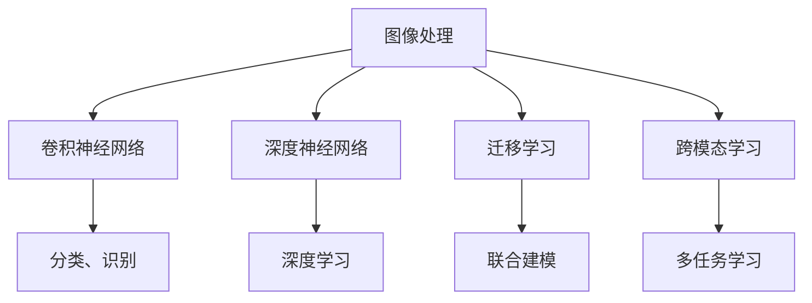

                 

# 多模态AI应用：图像、音频和视频处理技术

> 关键词：多模态AI, 图像处理, 音频处理, 视频处理, 深度学习, 卷积神经网络, 循环神经网络, 深度神经网络

## 1. 背景介绍

### 1.1 问题由来
随着人工智能技术的飞速发展，多模态AI（Multi-modal AI）成为当前研究热点，旨在处理和融合多种类型的数据，从而提升人工智能系统的性能和应用范围。多模态AI涵盖图像、音频、视频等多种信息形态，通过深度学习等技术进行分析和融合，已经被广泛应用于无人驾驶、智能安防、医疗诊断等领域，极大地推动了人工智能技术的落地应用。

然而，相比于传统的单模态AI，多模态AI的研发和部署面临更多的挑战。例如，不同模态的数据具有不同的特征和处理方式，如何进行有效的融合与分析，是当前研究的一大难题。此外，数据的多样性和复杂性，也要求AI系统具备更强的泛化能力和鲁棒性。

为了解决这些问题，研究人员不断探索新的算法和技术，逐步构建起多模态AI的架构体系。本文将详细探讨多模态AI中图像、音频、视频处理技术的基本原理、核心算法和实际应用，帮助读者理解多模态AI在实际场景中的运作机制和优化策略。

### 1.2 问题核心关键点
多模态AI的核心在于如何高效处理和融合不同模态的数据，提升系统的综合性能和应用价值。以下是多模态AI中的几个关键点：

- **多模态融合**：融合来自不同模态的数据，进行特征提取和联合建模。
- **跨模态学习**：将不同模态的特征进行映射和转换，使得模型能够理解不同数据类型之间的关联。
- **多任务学习**：将多个相关任务联合训练，提高模型的泛化能力和鲁棒性。
- **迁移学习**：将从一个模态学到的知识迁移到另一个模态，提升模型在不同任务上的表现。

这些核心点涉及到多模态AI的各个方面，从数据处理到模型设计，再到联合训练，需要综合运用多种技术和方法，实现多模态数据的深度融合和高效分析。

## 2. 核心概念与联系

### 2.1 核心概念概述

为了更好地理解多模态AI，我们需要先梳理相关的核心概念及其联系：

- **图像处理**：包括图像获取、预处理、特征提取、分割、分类、识别等技术，旨在对图像数据进行理解和分析。
- **音频处理**：涉及音频信号的采集、处理、特征提取、分类、识别等，用于分析和理解声音信号。
- **视频处理**：包括视频采集、预处理、特征提取、分割、分类、识别等，用于分析和理解动态图像数据。
- **深度学习**：利用多层神经网络进行特征提取和分类，是现代图像、音频、视频处理的基础。
- **卷积神经网络**：用于处理图像、视频数据的深度学习模型，通过卷积操作提取局部特征。
- **循环神经网络**：适用于处理时间序列数据的深度学习模型，如音频、视频等。
- **深度神经网络**：包括卷积神经网络、循环神经网络等，用于处理多模态数据。

这些概念之间的关系可以通过以下Mermaid流程图来展示：



这个流程图展示了几大核心概念之间的逻辑关系：

1. 图像处理是处理静态视觉数据的主要方式，卷积神经网络是其核心算法。
2. 深度学习可以应用于处理图像、音频、视频等多种数据类型。
3. 迁移学习、跨模态学习、多任务学习是深度学习的高级应用，提升模型的泛化能力和鲁棒性。
4. 图像处理中的分类、识别等任务，以及音频、视频处理中的分类、识别等任务，都是深度学习的具体应用。

这些概念共同构成了多模态AI的基本框架，使得系统能够处理和分析来自不同模态的数据，实现跨领域的数据融合和深度学习。

## 3. 核心算法原理 & 具体操作步骤
### 3.1 算法原理概述

多模态AI中的图像、音频、视频处理技术，主要依赖于深度学习算法，特别是卷积神经网络（CNN）和循环神经网络（RNN）等。这些算法通过构建多层神经网络结构，从原始数据中自动学习并提取特征，用于分类、识别、分割等任务。

以图像处理为例，卷积神经网络通过多层卷积操作，提取图像的局部特征，并将其组合为全局特征。在音频处理中，循环神经网络通过时间序列的建模，捕捉音频信号的动态特征。视频处理则结合图像和音频处理的技术，通过时空特征的提取和联合建模，实现对视频数据的理解和分析。

### 3.2 算法步骤详解

以下详细介绍图像、音频、视频处理的具体步骤：

**图像处理**：

1. **数据预处理**：包括图像缩放、归一化、去噪等，使得数据适合输入深度学习模型。
2. **特征提取**：通过卷积神经网络提取图像的局部特征和全局特征。
3. **分类与识别**：利用分类器对图像进行分类或识别。

**音频处理**：

1. **数据预处理**：包括音频分帧、归一化、去噪等。
2. **特征提取**：通过Mel频谱、MFCC等技术，提取音频的频谱特征。
3. **分类与识别**：利用分类器对音频进行分类或识别。

**视频处理**：

1. **数据预处理**：包括视频分帧、去噪、对齐等。
2. **特征提取**：结合图像和音频特征，通过时空卷积网络提取视频的时空特征。
3. **分类与识别**：利用分类器对视频进行分类或识别。

### 3.3 算法优缺点

多模态AI中的图像、音频、视频处理技术，具有以下优点：

- **数据利用率提高**：多模态数据融合和深度学习技术，使得系统能够充分利用多种数据类型，提高数据的利用率。
- **模型性能提升**：通过联合训练和迁移学习等技术，多模态AI模型在泛化能力和鲁棒性上往往优于单模态模型。
- **应用范围广泛**：多模态AI技术可以应用于无人驾驶、智能安防、医疗诊断等多个领域，提升系统的综合性能。

同时，这些技术也存在一些局限性：

- **计算资源消耗大**：多模态数据的复杂性导致模型参数量较大，训练和推理需要消耗更多的计算资源。
- **数据采集困难**：多模态数据的采集和预处理需要复杂的技术和设备支持，成本较高。
- **模型复杂度高**：多模态模型的结构复杂，难以解释和调试。

### 3.4 算法应用领域

多模态AI技术已经在多个领域得到了广泛的应用：

- **无人驾驶**：结合图像、激光雷达、GPS等数据，实现对环境的感知和行为决策。
- **智能安防**：利用视频、音频数据，实现人脸识别、行为分析等安全监控功能。
- **医疗诊断**：结合影像、生理信号等数据，进行疾病诊断和治疗方案制定。
- **虚拟现实**：结合图像、音频、视频数据，实现沉浸式的虚拟环境构建。
- **游戏开发**：利用视频、音频数据，实现逼真的游戏场景和交互体验。

此外，多模态AI技术还在教育、娱乐、金融等多个领域发挥着重要作用，推动了人工智能技术的深度应用。

## 4. 数学模型和公式 & 详细讲解
### 4.1 数学模型构建

多模态AI中的图像、音频、视频处理技术，主要依赖于深度学习算法，其数学模型可以抽象为：

$$
\text{Output} = f(\text{Input}, \text{Parameters})
$$

其中，$\text{Input}$ 为输入数据，可以是图像、音频、视频等多种类型；$\text{Output}$ 为模型的输出，可以是分类、识别、分割等结果；$\text{Parameters}$ 为模型的参数，通过训练学习得到。

以卷积神经网络为例，其数学模型可以表示为：

$$
\text{Output}_{i,j} = \sigma(\sum_{k=1}^{K} W_{k} \ast \text{Input}_{i,j} + b_k)
$$

其中，$\sigma$ 为激活函数，$W_k$ 和 $b_k$ 分别为卷积核和偏置项。

### 4.2 公式推导过程

以下是卷积神经网络的基本公式推导：

设输入数据 $\text{Input} \in \mathbb{R}^{H \times W \times C}$，其中 $H$ 和 $W$ 为输入的尺寸，$C$ 为通道数。卷积核 $\text{Filter} \in \mathbb{R}^{F \times F \times C \times K}$，其中 $F$ 为卷积核的大小，$K$ 为卷积核的数量。

则卷积操作的公式为：

$$
\text{Output} = \text{Filter} \ast \text{Input} = \sum_{i=1}^{K} \sum_{m=0}^{F-1} \sum_{n=0}^{F-1} \sum_{c=0}^{C-1} W_{i,m,n,c} \ast \text{Input}_{i,j}
$$

其中 $\ast$ 表示卷积操作。

通过卷积操作，卷积神经网络能够自动提取图像的局部特征，实现图像分类、识别等任务。

### 4.3 案例分析与讲解

以医学图像的卷积神经网络分类为例，进行详细分析：

1. **数据预处理**：医学图像通常需要进行去噪、归一化、增强等预处理操作。
2. **特征提取**：使用卷积神经网络提取图像的局部特征和全局特征，如通过多层卷积和池化层，提取图像的高层特征。
3. **分类**：利用分类器（如Softmax分类器）对图像进行分类，如区分肿瘤与正常组织。

以音频处理的MFCC（Mel频谱倒谱系数）技术为例，进行详细分析：

1. **数据预处理**：音频信号通常需要进行分帧、归一化、去噪等预处理操作。
2. **特征提取**：使用MFCC技术提取音频的频谱特征，如通过Mel滤波器组和离散余弦变换，得到MFCC系数。
3. **分类**：利用分类器（如支持向量机）对MFCC特征进行分类，如识别说话人身份。

以视频处理的3D卷积神经网络为例，进行详细分析：

1. **数据预处理**：视频信号通常需要进行分帧、去噪、对齐等预处理操作。
2. **特征提取**：使用3D卷积神经网络提取视频的时空特征，如通过多层3D卷积和池化操作，提取视频的高层特征。
3. **分类**：利用分类器（如Softmax分类器）对视频进行分类，如区分不同动作。

## 5. 项目实践：代码实例和详细解释说明
### 5.1 开发环境搭建

在进行图像、音频、视频处理项目实践前，需要准备好开发环境。以下是使用Python进行PyTorch开发的环境配置流程：

1. 安装Anaconda：从官网下载并安装Anaconda，用于创建独立的Python环境。

2. 创建并激活虚拟环境：
```bash
conda create -n pytorch-env python=3.8 
conda activate pytorch-env
```

3. 安装PyTorch：根据CUDA版本，从官网获取对应的安装命令。例如：
```bash
conda install pytorch torchvision torchaudio cudatoolkit=11.1 -c pytorch -c conda-forge
```

4. 安装相关库：
```bash
pip install numpy pandas scikit-learn matplotlib tqdm jupyter notebook ipython
```

完成上述步骤后，即可在`pytorch-env`环境中开始项目实践。

### 5.2 源代码详细实现

以下给出使用PyTorch进行图像分类任务的代码实现：

```python
import torch
import torch.nn as nn
import torchvision.transforms as transforms
from torchvision import datasets, models

# 定义数据预处理
transform = transforms.Compose([
    transforms.Resize(256),
    transforms.CenterCrop(224),
    transforms.ToTensor(),
    transforms.Normalize(mean=[0.485, 0.456, 0.406], std=[0.229, 0.224, 0.225])
])

# 加载数据集
train_dataset = datasets.ImageFolder(root='path_to_train_data', transform=transform)
test_dataset = datasets.ImageFolder(root='path_to_test_data', transform=transform)

# 定义模型
model = models.resnet50(pretrained=True)

# 定义损失函数和优化器
criterion = nn.CrossEntropyLoss()
optimizer = torch.optim.Adam(model.parameters(), lr=0.001)

# 定义训练和评估函数
def train_model(model, train_dataset, test_dataset, num_epochs=10, batch_size=16):
    model.train()
    for epoch in range(num_epochs):
        train_loss = 0.0
        correct = 0
        total = 0
        for inputs, labels in train_loader:
            optimizer.zero_grad()
            outputs = model(inputs)
            loss = criterion(outputs, labels)
            loss.backward()
            optimizer.step()
            train_loss += loss.item() * inputs.size(0)
            _, predicted = outputs.max(1)
            total += labels.size(0)
            correct += predicted.eq(labels).sum().item()
        
        train_acc = correct / total
        print(f'Epoch [{epoch+1}/{num_epochs}], Train Loss: {train_loss/len(train_loader):.4f}, Train Acc: {train_acc:.4f}')

    model.eval()
    test_loss = 0.0
    correct = 0
    total = 0
    with torch.no_grad():
        for inputs, labels in test_loader:
            outputs = model(inputs)
            loss = criterion(outputs, labels)
            test_loss += loss.item() * inputs.size(0)
            _, predicted = outputs.max(1)
            total += labels.size(0)
            correct += predicted.eq(labels).sum().item()

    test_acc = correct / total
    print(f'Epoch [{epoch+1}/{num_epochs}], Test Loss: {test_loss/len(test_loader):.4f}, Test Acc: {test_acc:.4f}')

# 训练模型
train_model(model, train_dataset, test_dataset)
```

### 5.3 代码解读与分析

让我们详细解读一下关键代码的实现细节：

**数据预处理**：
```python
transform = transforms.Compose([
    transforms.Resize(256),
    transforms.CenterCrop(224),
    transforms.ToTensor(),
    transforms.Normalize(mean=[0.485, 0.456, 0.406], std=[0.229, 0.224, 0.225])
])
```
上述代码定义了数据预处理流程，包括图像的缩放、裁剪、归一化等操作，使得数据适合输入深度学习模型。

**模型定义**：
```python
model = models.resnet50(pretrained=True)
```
这里使用了预训练的ResNet-50模型，通过在ImageNet数据集上进行预训练，已经具备较好的图像分类能力。

**损失函数和优化器**：
```python
criterion = nn.CrossEntropyLoss()
optimizer = torch.optim.Adam(model.parameters(), lr=0.001)
```
使用了交叉熵损失函数和Adam优化器，适合分类任务。

**训练和评估函数**：
```python
def train_model(model, train_dataset, test_dataset, num_epochs=10, batch_size=16):
    # 训练过程
    model.train()
    # ...
    # 评估过程
    model.eval()
    # ...
```
定义了完整的训练和评估流程，包括前向传播、损失计算、反向传播、参数更新等操作。

**训练模型**：
```python
train_model(model, train_dataset, test_dataset)
```
调用训练函数，训练模型并评估性能。

## 6. 实际应用场景
### 6.1 智能安防

智能安防系统利用视频和音频数据，实现人脸识别、行为分析等安全监控功能。例如，通过摄像头采集的视频流和麦克风捕捉的音频信号，进行实时分析，检测异常行为或入侵行为，从而提高安全监控的智能化水平。

在技术实现上，可以使用3D卷积神经网络处理视频数据，提取时空特征；使用MFCC技术处理音频数据，提取频谱特征。将视频和音频特征联合建模，通过深度学习模型进行分类和识别，从而实现高效的安防监控。

### 6.2 医疗诊断

医疗诊断系统结合影像、生理信号等数据，进行疾病诊断和治疗方案制定。例如，通过CT扫描、MRI等影像数据，使用卷积神经网络进行分类和分割；结合心电图、血压等生理信号，使用循环神经网络进行建模。将多种数据类型联合分析，提升诊断的准确性和可靠性。

在技术实现上，可以使用多任务学习和迁移学习等技术，联合训练不同的模型，提升诊断的泛化能力和鲁棒性。同时，可以将模型部署到医疗设备中，实现实时诊断和辅助决策。

### 6.3 无人驾驶

无人驾驶系统利用摄像头、激光雷达等传感器，采集环境数据，进行感知和行为决策。例如，通过摄像头采集的图像数据，使用卷积神经网络进行分类和识别；通过激光雷达采集的点云数据，使用点云处理技术进行环境建模。将视觉和激光雷达数据联合分析，提升感知和决策的准确性。

在技术实现上，可以使用多模态融合技术，将图像和激光雷达数据联合建模，提升无人驾驶系统的综合性能。同时，可以利用迁移学习和多任务学习等技术，提升模型的泛化能力和鲁棒性。

### 6.4 未来应用展望

未来，随着计算资源的提升和技术的进步，多模态AI技术将在更多领域得到应用，带来新的突破。

1. **智慧医疗**：结合医学影像、生理信号等数据，实现精准诊断和个性化治疗。
2. **智能家居**：利用视频、音频数据，实现环境感知和智能控制，提升居住体验。
3. **智能制造**：结合视频、音频、传感器数据，实现生产过程的自动化和智能化。
4. **智慧城市**：结合视频、音频、传感器数据，实现交通管理、公共安全、环境监测等功能。

此外，多模态AI技术还将与物联网、边缘计算等技术结合，实现更广泛的应用场景，推动智能化社会的建设。

## 7. 工具和资源推荐
### 7.1 学习资源推荐

为了帮助开发者系统掌握多模态AI技术，这里推荐一些优质的学习资源：

1. 《深度学习》（Ian Goodfellow等著）：介绍了深度学习的基本原理和应用，适合初学者入门。
2. CS231n《卷积神经网络》课程：斯坦福大学开设的深度学习课程，深入讲解卷积神经网络的应用。
3. CS224d《多模态学习》课程：斯坦福大学开设的多模态学习课程，涵盖图像、音频、视频等多模态数据的处理。
4. 《深度学习与多模态数据处理》书籍：系统介绍了多模态数据的处理和分析方法，适合深入学习。
5. 多模态AI技术博客：如AI Review、IEEE Spectrum等，定期发布多模态AI的最新研究成果和技术进展。

通过对这些资源的学习实践，相信你一定能够全面掌握多模态AI技术的核心原理和应用方法。

### 7.2 开发工具推荐

高效的开发离不开优秀的工具支持。以下是几款用于多模态AI开发的常用工具：

1. PyTorch：基于Python的开源深度学习框架，灵活的计算图设计，适合多模态数据的处理和分析。
2. TensorFlow：由Google主导开发的深度学习框架，支持分布式计算和高效推理。
3. Keras：基于Python的高级深度学习库，简单易用，适合快速原型开发。
4. OpenCV：开源计算机视觉库，提供了丰富的图像处理功能。
5. librosa：Python库，用于音频数据的处理和分析。
6. PyAudioAnalysis：Python库，用于音频数据的特征提取和分类。

合理利用这些工具，可以显著提升多模态AI任务的开发效率，加速创新迭代的步伐。

### 7.3 相关论文推荐

多模态AI的发展源于学界的持续研究。以下是几篇奠基性的相关论文，推荐阅读：

1. **ImageNet大规模视觉识别竞赛**：由AlexNet、GoogLeNet、ResNet等模型组成的图像分类任务，展示了深度学习在图像处理中的应用。
2. **AudioSet：构建多模态音频分类和标注数据集**：通过大规模音频数据的标注和分析，推动了音频处理技术的发展。
3. **Vis2Lingual：构建多模态视觉到自然语言翻译数据集**：将视觉和自然语言数据联合建模，提升了视觉数据到自然语言的翻译效果。
4. **VoxCeleb：构建多模态语音数据集**：通过大规模语音数据的标注和分析，推动了语音处理技术的发展。
5. **ViT：基于Transformer的图像处理模型**：展示了Transformer结构在图像处理中的应用，推动了多模态深度学习的进展。

这些论文代表了大模态AI技术的发展脉络。通过学习这些前沿成果，可以帮助研究者把握学科前进方向，激发更多的创新灵感。

## 8. 总结：未来发展趋势与挑战
### 8.1 研究成果总结

本文对多模态AI中图像、音频、视频处理技术的基本原理、核心算法和实际应用进行了详细探讨。通过系统梳理，我们发现多模态AI技术具有广阔的应用前景，可以通过深度学习算法处理和融合不同模态的数据，提升系统的综合性能和应用价值。

### 8.2 未来发展趋势

展望未来，多模态AI技术将呈现以下几个发展趋势：

1. **数据融合技术**：随着多模态数据采集和处理的进步，数据融合技术将进一步提升，实现更高效、更准确的数据处理。
2. **跨模态学习**：通过跨模态学习，实现不同模态数据之间的映射和转换，提升模型的泛化能力和鲁棒性。
3. **联合训练技术**：通过联合训练技术，实现多模态数据的协同建模，提升系统的综合性能。
4. **迁移学习技术**：通过迁移学习技术，将不同模态学到的知识进行迁移，提升模型的跨领域适应能力。
5. **模型压缩技术**：通过模型压缩技术，减少模型的参数量和计算资源消耗，实现轻量级、实时性的部署。
6. **多任务学习技术**：通过多任务学习技术，实现多模态数据的联合训练，提升模型的泛化能力和鲁棒性。

这些趋势凸显了多模态AI技术的广阔前景。这些方向的探索发展，必将进一步提升多模态AI系统的性能和应用价值，推动人工智能技术的深入应用。

### 8.3 面临的挑战

尽管多模态AI技术已经取得了瞩目成就，但在迈向更加智能化、普适化应用的过程中，它仍面临诸多挑战：

1. **计算资源消耗大**：多模态数据的复杂性导致模型参数量较大，训练和推理需要消耗更多的计算资源。
2. **数据采集困难**：多模态数据的采集和预处理需要复杂的技术和设备支持，成本较高。
3. **模型复杂度高**：多模态模型的结构复杂，难以解释和调试。
4. **数据融合难题**：不同模态的数据具有不同的特征和处理方式，如何进行有效的融合与分析，是当前研究的一大难题。
5. **模型泛化能力不足**：当前的多模态模型在面对域外数据时，泛化性能往往大打折扣。对于测试样本的微小扰动，模型的预测也容易发生波动。
6. **跨模态数据对齐**：不同模态的数据如何进行有效的对齐和融合，需要更多技术和算法的支持。

这些挑战需要通过不断的技术创新和实践探索，逐步突破。只有在数据、模型、训练、推理等各环节进行全面优化，才能真正实现多模态AI技术的广泛应用。

### 8.4 研究展望

面向未来，多模态AI技术需要在以下几个方面寻求新的突破：

1. **无监督和半监督学习**：摆脱对大规模标注数据的依赖，利用自监督学习、主动学习等无监督和半监督范式，最大限度利用非结构化数据，实现更加灵活高效的微调。
2. **模型压缩与优化**：开发更加参数高效的模型，通过剪枝、量化等技术，减小模型的计算资源消耗。
3. **多模态协同学习**：将不同模态的特征进行协同学习，提升模型的泛化能力和鲁棒性。
4. **跨模态映射**：研究不同模态数据之间的映射关系，实现更好的数据融合与分析。
5. **跨模态推理**：研究跨模态推理技术，提升多模态AI系统的综合性能。
6. **多任务学习与联合训练**：通过联合训练技术，提升多模态AI系统的综合性能。

这些研究方向的探索，必将引领多模态AI技术迈向更高的台阶，为构建安全、可靠、可解释、可控的智能系统铺平道路。面向未来，多模态AI技术还需要与其他人工智能技术进行更深入的融合，如知识表示、因果推理、强化学习等，多路径协同发力，共同推动人工智能技术的进步。只有勇于创新、敢于突破，才能不断拓展多模态AI的边界，让智能技术更好地造福人类社会。

## 9. 附录：常见问题与解答

**Q1：多模态AI中常见的数据融合技术有哪些？**

A: 多模态AI中常见的数据融合技术包括：

1. **特征级融合**：对不同模态的特征进行拼接、加权等处理，直接融合特征向量。
2. **样本级融合**：通过重采样或加权，使得不同模态的样本具有相同的权值，再进行联合训练。
3. **模型级融合**：通过多模态联合训练，共同优化模型参数，提升模型的综合性能。

**Q2：如何选择合适的多模态融合策略？**

A: 选择合适的多模态融合策略，需要考虑以下因素：

1. **数据类型**：不同模态的数据具有不同的特征和处理方式，需要选择合适的融合方法。
2. **任务需求**：不同的任务对多模态数据的融合要求不同，需要根据具体任务进行选择。
3. **模型复杂度**：不同融合策略的模型复杂度不同，需要根据计算资源和效率进行选择。

**Q3：多模态AI中的深度学习算法有哪些？**

A: 多模态AI中的深度学习算法包括：

1. **卷积神经网络（CNN）**：用于处理图像、视频数据的深度学习模型。
2. **循环神经网络（RNN）**：适用于处理时间序列数据的深度学习模型，如音频、视频等。
3. **深度神经网络（DNN）**：包括卷积神经网络、循环神经网络等，用于处理多模态数据。
4. **3D卷积神经网络**：用于处理视频数据的深度学习模型，通过时空卷积操作提取时空特征。
5. **Transformer模型**：用于处理多模态数据的深度学习模型，通过自注意力机制提取局部和全局特征。

这些算法可以通过联合训练、跨模态学习等技术，实现多模态数据的深度融合和高效分析。

**Q4：如何实现高效的多模态数据联合训练？**

A: 实现高效的多模态数据联合训练，可以采用以下方法：

1. **联合损失函数**：设计联合损失函数，将不同模态的损失函数进行组合，优化模型的综合性能。
2. **多任务学习**：将多个相关任务联合训练，提升模型的泛化能力和鲁棒性。
3. **迁移学习**：通过迁移学习，将不同模态学到的知识进行迁移，提升模型的跨领域适应能力。
4. **跨模态映射**：研究不同模态数据之间的映射关系，实现更好的数据融合与分析。

这些方法可以通过优化算法、正则化技术等手段，提高多模态数据的联合训练效果。

**Q5：多模态AI中的数据预处理技术有哪些？**

A: 多模态AI中的数据预处理技术包括：

1. **图像预处理**：包括缩放、裁剪、归一化、增强等操作，使得图像数据适合输入深度学习模型。
2. **音频预处理**：包括分帧、归一化、去噪等操作，使得音频数据适合输入深度学习模型。
3. **视频预处理**：包括分帧、去噪、对齐等操作，使得视频数据适合输入深度学习模型。

这些预处理技术可以通过开源工具和库实现，如OpenCV、librosa等。

**Q6：多模态AI中如何实现高效的跨模态学习？**

A: 实现高效的跨模态学习，可以采用以下方法：

1. **跨模态映射**：研究不同模态数据之间的映射关系，实现更好的数据融合与分析。
2. **多任务学习**：将多个相关任务联合训练，提升模型的泛化能力和鲁棒性。
3. **联合训练**：通过多模态联合训练，共同优化模型参数，提升模型的综合性能。

这些方法可以通过优化算法、正则化技术等手段，提高跨模态学习的效率和效果。

通过以上问题的解答，相信你对多模态AI技术的核心原理和应用方法有了更深入的理解。希望这篇文章能够为你提供宝贵的参考和指导，助你在多模态AI技术的探索和应用中取得更大的进展。

---

作者：禅与计算机程序设计艺术 / Zen and the Art of Computer Programming

