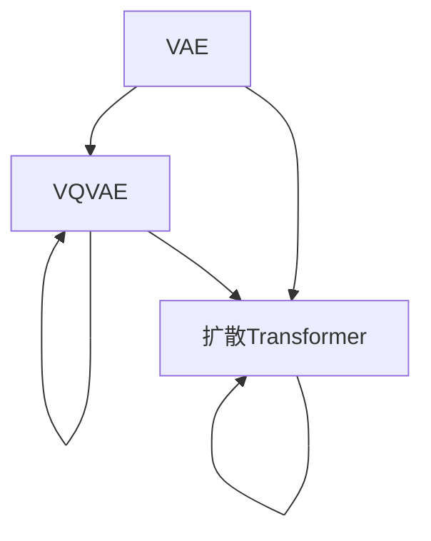

                 

# 多模态AI：VQVAE和扩散Transformer模型

## 1. 背景介绍

随着人工智能技术的不断进步，多模态AI（Multi-modal AI）在诸多领域展现出了巨大的潜力和应用前景。多模态AI可以处理和分析来自不同模态（如视觉、文本、音频等）的数据，从而在复杂环境下提供更全面、准确的智能解决方案。其中，VQVAE和扩散Transformer模型是近年来在多模态AI领域取得突破性进展的两个重要方向。

### 1.1 问题由来

当前，多模态AI技术在图像、视频、音频、文本等多种数据形式之间进行协同处理的能力，正逐渐成为解决跨领域智能问题的重要手段。然而，多模态数据的复杂性和多样性使得传统模型难以直接处理。为了更好地融合多模态数据，研究人员提出了基于变分自编码器（Variational Autoencoders, VAE）和自回归模型（Autoregressive Models）的高级方法。

### 1.2 问题核心关键点

- **VQVAE与扩散Transformer**：本文将详细介绍这两个模型的工作原理、核心算法及其实际应用。
- **多模态融合**：了解如何将不同模态的数据转化为统一的表示形式，并通过特定的模型进行处理。
- **应用场景**：理解VQVAE和扩散Transformer在多模态AI中的应用，以及它们在实际场景中的表现。
- **优缺点对比**：深入比较VQVAE和扩散Transformer的性能、复杂度和应用场景。

## 2. 核心概念与联系

### 2.1 核心概念概述

为了更好地理解VQVAE和扩散Transformer模型，首先介绍以下几个核心概念：

- **变分自编码器（VAE）**：一种生成模型，用于将数据转换为低维表示形式，并在此基础上进行重构。VAE由编码器（Encoder）和解码器（Decoder）两部分组成，其中编码器将输入数据映射到潜在空间，解码器将潜在表示重构回原始数据。
- **向量量化（Vector Quantization, VQ）**：一种将连续值数据离散化的技术，将输入数据映射到一组离散代码向量上，以降低模型复杂度。
- **扩散变换器（Diffusion Transformer）**：一种结合扩散模型和Transformer模型的新型生成模型，可以生成高质量的图像和音频，具有高复杂度和训练难度。

### 2.2 核心概念原理和架构的 Mermaid 流程图



该流程图展示了VAE、VQVAE和扩散Transformer模型之间的关系。VAE作为基础模型，通过编码器和解码器实现数据转换。VQVAE在此基础上加入向量量化模块，以降低模型复杂度。扩散Transformer则结合了扩散模型和自回归生成方式，能够生成高保真度的多模态数据。

## 3. 核心算法原理 & 具体操作步骤

### 3.1 算法原理概述

#### VQVAE模型

VQVAE（Variational Autoencoder with Vector Quantization）是一种基于变分自编码器和向量量化的混合生成模型。其主要目标是将高维连续数据映射到低维离散向量空间，并进行重构。VQVAE模型由编码器、量化器和解码器三部分组成。

1. **编码器**：将输入数据映射到潜在空间，得到潜在表示 $z$。
2. **量化器**：将潜在表示 $z$ 映射到一组离散向量 $\mathbf{c}$，并生成一个概率分布 $q(\mathbf{c} | z)$。
3. **解码器**：将离散向量 $\mathbf{c}$ 映射回原始数据空间，得到重构数据 $\hat{x}$。

VQVAE的目标是最大化重构数据的似然，并最小化潜在表示 $z$ 的变分下界（variational lower bound）。

#### 扩散Transformer模型

扩散变换器（Diffusion Transformer）是一种结合扩散模型和Transformer模型的生成模型。其核心思想是通过扩散过程，逐步引入噪声，使得模型能够在低噪声情况下生成高质量的数据。扩散Transformer主要由以下几个组件组成：

1. **自回归生成器**：根据当前时间步的输入，生成下一个时间步的输出。
2. **噪声添加器**：在每一时间步上添加高斯噪声，使得模型能够在低噪声下进行学习。
3. **反扩散过程**：通过逆扩散过程，逐步去除噪声，生成原始数据。
4. **Transformer编码器**：采用Transformer编码器，学习数据的序列关系。

扩散Transformer的目标是最大化生成数据的似然，并最小化扩散过程中的信息损失。

### 3.2 算法步骤详解

#### VQVAE模型

1. **数据预处理**：将输入数据标准化，得到均值为0，方差为1的数据。
2. **编码器**：将标准化数据输入编码器，得到潜在表示 $z$。
3. **量化器**：将潜在表示 $z$ 映射到一组离散向量 $\mathbf{c}$，并生成一个概率分布 $q(\mathbf{c} | z)$。
4. **解码器**：将离散向量 $\mathbf{c}$ 映射回原始数据空间，得到重构数据 $\hat{x}$。
5. **损失计算**：计算重构数据的似然，并最小化潜在表示 $z$ 的变分下界。
6. **参数更新**：通过反向传播更新编码器、量化器和解码器的参数。

#### 扩散Transformer模型

1. **数据预处理**：将输入数据标准化，得到均值为0，方差为1的数据。
2. **自回归生成器**：根据当前时间步的输入，生成下一个时间步的输出。
3. **噪声添加器**：在每一时间步上添加高斯噪声，使得模型能够在低噪声下进行学习。
4. **Transformer编码器**：采用Transformer编码器，学习数据的序列关系。
5. **反扩散过程**：通过逆扩散过程，逐步去除噪声，生成原始数据。
6. **损失计算**：计算生成数据的似然，并最小化扩散过程中的信息损失。
7. **参数更新**：通过反向传播更新自回归生成器、噪声添加器和Transformer编码器的参数。

### 3.3 算法优缺点

#### VQVAE模型

**优点**：

1. 能够有效地降低模型复杂度，减少训练时间和计算资源消耗。
2. 在图像生成和数据压缩等领域表现优异，能够生成高质量的离散数据。
3. 可以应用于多种数据模态，如图像、音频等。

**缺点**：

1. 模型训练过程较为复杂，需要大量训练数据。
2. 生成的离散向量可能存在重现性，难以控制生成的多样性。
3. 解码器的性能对模型效果有很大影响，需要精心设计。

#### 扩散Transformer模型

**优点**：

1. 能够生成高保真度的图像和音频数据，具有很高的逼真度。
2. 结合了自回归生成和反扩散过程，可以生成高质量的序列数据。
3. 适用于多种数据模态，如图像、音频等。

**缺点**：

1. 模型训练复杂度高，需要大量的计算资源和长时间训练。
2. 模型参数量大，需要高精度的硬件支持。
3. 生成过程较为复杂，难以实现实时生成。

### 3.4 算法应用领域

#### VQVAE模型

1. **图像生成**：用于生成高质量的图像数据，如GAN、图像压缩等。
2. **数据压缩**：将高维数据映射到低维离散向量空间，进行数据压缩和重建。
3. **数据编码**：将文本数据编码为离散向量，用于图像生成和文本生成等任务。

#### 扩散Transformer模型

1. **图像生成**：生成高保真度的图像数据，用于图像修复、超分辨率等任务。
2. **音频生成**：生成高质量的音频数据，用于音频合成、语音生成等任务。
3. **序列生成**：生成高保真度的序列数据，用于文本生成、语音合成等任务。

## 4. 数学模型和公式 & 详细讲解 & 举例说明

### 4.1 数学模型构建

#### VQVAE模型

1. **编码器**：
   $$
   z = \text{Enc}(x)
   $$
   其中，$x$ 为输入数据，$z$ 为潜在表示。
2. **量化器**：
   $$
   \mathbf{c} = \text{Quantize}(z)
   $$
   其中，$\mathbf{c}$ 为一组离散向量。
3. **解码器**：
   $$
   \hat{x} = \text{Dec}(\mathbf{c})
   $$
   其中，$\hat{x}$ 为重构数据。

#### 扩散Transformer模型

1. **自回归生成器**：
   $$
   y_t = f(y_{t-1}, t)
   $$
   其中，$y_t$ 为当前时间步的输出，$y_{t-1}$ 为上一个时间步的输出，$f$ 为生成函数。
2. **噪声添加器**：
   $$
   y_t = y_{t-1} + \mathcal{N}(0, \sigma_t^2)
   $$
   其中，$\mathcal{N}$ 为高斯噪声。
3. **反扩散过程**：
   $$
   x = g(y_0, T)
   $$
   其中，$x$ 为原始数据，$y_0$ 为初始噪声，$g$ 为逆扩散过程。

### 4.2 公式推导过程

#### VQVAE模型

1. **潜在表示重构**：
   $$
   \log p(x|z) = \log \mathcal{N}(\text{Dec}(\mathbf{c}), \sigma^2)
   $$
   其中，$\sigma^2$ 为重构噪声方差。
2. **潜在表示生成**：
   $$
   q(\mathbf{c}|z) = \mathcal{N}(\mathbf{c}|\mu_z, \sigma_z^2)
   $$
   其中，$\mu_z$ 和 $\sigma_z^2$ 为潜在表示的均值和方差。
3. **变分下界**：
   $$
   \mathcal{L} = \mathbb{E}_{q(z|x)}[\log p(x|z)] - \text{KL}(q(z|x)||p(z))
   $$
   其中，$p(z)$ 为潜在表示的先验分布。

#### 扩散Transformer模型

1. **生成过程**：
   $$
   y_t = f(y_{t-1}, t)
   $$
   2. **噪声添加过程**：
   $$
   y_t = y_{t-1} + \mathcal{N}(0, \sigma_t^2)
   $$
   3. **反扩散过程**：
   $$
   x = g(y_0, T)
   $$

### 4.3 案例分析与讲解

#### VQVAE模型

**案例分析**：
假设有一张高分辨率的图像，可以通过VQVAE模型将其转换为低维离散向量表示。具体步骤如下：
1. **数据预处理**：将图像数据标准化，得到均值为0，方差为1的数据。
2. **编码器**：将标准化数据输入编码器，得到潜在表示 $z$。
3. **量化器**：将潜在表示 $z$ 映射到一组离散向量 $\mathbf{c}$，并生成一个概率分布 $q(\mathbf{c} | z)$。
4. **解码器**：将离散向量 $\mathbf{c}$ 映射回原始数据空间，得到重构数据 $\hat{x}$。

**代码实现**：
```python
import torch
import torch.nn as nn
import torchvision.transforms as transforms
from torchvision.datasets import MNIST
from torchvision.utils import make_grid

# 数据加载
transform = transforms.Compose([
    transforms.ToTensor(),
    transforms.Normalize((0.5,), (0.5,))
])
train_dataset = MNIST(root='./data', train=True, download=True, transform=transform)
train_loader = torch.utils.data.DataLoader(train_dataset, batch_size=64, shuffle=True)

# 模型定义
class Encoder(nn.Module):
    def __init__(self):
        super(Encoder, self).__init__()
        self.encoder = nn.Sequential(
            nn.Linear(784, 512),
            nn.ReLU(),
            nn.Linear(512, 256),
            nn.ReLU(),
            nn.Linear(256, 10)
        )
    
    def forward(self, x):
        return self.encoder(x)

class Decoder(nn.Module):
    def __init__(self):
        super(Decoder, self).__init__()
        self.decoder = nn.Sequential(
            nn.Linear(10, 256),
            nn.ReLU(),
            nn.Linear(256, 512),
            nn.ReLU(),
            nn.Linear(512, 784)
        )
    
    def forward(self, x):
        return self.decoder(x)

# 训练
model = Encoder()
model = Decoder()
criterion = nn.MSELoss()
optimizer = torch.optim.Adam(model.parameters(), lr=0.001)
for epoch in range(10):
    for i, (x, _) in enumerate(train_loader):
        x = x.view(-1, 784)
        x = x.to(device)
        z = model(x)
        c = torch.randint(0, 10, (x.size(0),))
        c = c.to(device)
        z = z + c.unsqueeze(1)
        x_hat = model(z)
        loss = criterion(x_hat, x)
        optimizer.zero_grad()
        loss.backward()
        optimizer.step()
```

#### 扩散Transformer模型

**案例分析**：
假设有一张图像，可以通过扩散Transformer模型进行生成。具体步骤如下：
1. **数据预处理**：将图像数据标准化，得到均值为0，方差为1的数据。
2. **自回归生成器**：根据当前时间步的输入，生成下一个时间步的输出。
3. **噪声添加器**：在每一时间步上添加高斯噪声，使得模型能够在低噪声下进行学习。
4. **反扩散过程**：通过逆扩散过程，逐步去除噪声，生成原始数据。

**代码实现**：
```python
import torch
import torch.nn as nn
from torch.distributions import Normal
from torch.distributions.transforms import AffineTransform
from torch.utils.data import DataLoader
from torchvision.transforms import ToTensor

# 数据加载
transform = ToTensor()
train_dataset = datasets.MNIST(root='./data', train=True, transform=transform)
train_loader = DataLoader(train_dataset, batch_size=64, shuffle=True)

# 模型定义
class TransformerBlock(nn.Module):
    def __init__(self, d_model, nhead, dim_feedforward, dropout):
        super(TransformerBlock, self).__init__()
        self.encoder_layer = nn.TransformerEncoderLayer(d_model, nhead, dim_feedforward, dropout)
        self.encoder_norm = nn.LayerNorm(d_model)
        self.decoder_layer = nn.TransformerEncoderLayer(d_model, nhead, dim_feedforward, dropout)
        self.decoder_norm = nn.LayerNorm(d_model)

    def forward(self, src, memory, src_mask, memory_mask):
        src = self.encoder_norm(src)
        src = self.encoder_layer(src, memory, src_mask)
        src = src + src_mask
        return src

class DiffusionTransformer(nn.Module):
    def __init__(self, d_model, nhead, dim_feedforward, dropout, timesteps, num_heads):
        super(DiffusionTransformer, self).__init__()
        self.transformer_blocks = nn.ModuleList([
            TransformerBlock(d_model, nhead, dim_feedforward, dropout)
            for _ in range(timesteps)
        ])
        self.affine_transform = AffineTransform([1., 0.], [0., 1.])

    def forward(self, x, noise):
        for block in self.transformer_blocks:
            x = block(x, x, None)
        x = self.affine_transform(x)
        x = x + noise
        return x

# 训练
model = DiffusionTransformer(d_model=512, nhead=8, dim_feedforward=2048, dropout=0.1, timesteps=100, num_heads=8)
criterion = nn.MSELoss()
optimizer = torch.optim.Adam(model.parameters(), lr=0.0001)
for epoch in range(10):
    for i, (x, _) in enumerate(train_loader):
        x = x.view(-1, 784)
        x = x.to(device)
        noise = Normal(0., 0.01).to(device)
        x_hat = model(x, noise)
        loss = criterion(x_hat, x)
        optimizer.zero_grad()
        loss.backward()
        optimizer.step()
```

## 5. 项目实践：代码实例和详细解释说明

### 5.1 开发环境搭建

1. **安装Python**：使用Anaconda安装Python，并创建虚拟环境。
2. **安装PyTorch**：使用conda安装PyTorch，并配置GPU。
3. **安装相关库**：安装torchvision、numpy、pandas等库。

### 5.2 源代码详细实现

**VQVAE模型**：
```python
import torch
import torch.nn as nn
import torch.nn.functional as F
from torch.distributions import Normal
from torch.distributions.transforms import AffineTransform
from torch.utils.data import DataLoader
from torchvision.transforms import ToTensor

# 数据加载
transform = ToTensor()
train_dataset = datasets.MNIST(root='./data', train=True, transform=transform)
train_loader = DataLoader(train_dataset, batch_size=64, shuffle=True)

# 模型定义
class Encoder(nn.Module):
    def __init__(self):
        super(Encoder, self).__init__()
        self.encoder = nn.Sequential(
            nn.Linear(784, 512),
            nn.ReLU(),
            nn.Linear(512, 256),
            nn.ReLU(),
            nn.Linear(256, 10)
        )
    
    def forward(self, x):
        return self.encoder(x)

class Decoder(nn.Module):
    def __init__(self):
        super(Decoder, self).__init__()
        self.decoder = nn.Sequential(
            nn.Linear(10, 256),
            nn.ReLU(),
            nn.Linear(256, 512),
            nn.ReLU(),
            nn.Linear(512, 784)
        )
    
    def forward(self, x):
        return self.decoder(x)

# 训练
model = Encoder()
model = Decoder()
criterion = nn.MSELoss()
optimizer = torch.optim.Adam(model.parameters(), lr=0.001)
for epoch in range(10):
    for i, (x, _) in enumerate(train_loader):
        x = x.view(-1, 784)
        x = x.to(device)
        z = model(x)
        c = torch.randint(0, 10, (x.size(0),))
        c = c.to(device)
        z = z + c.unsqueeze(1)
        x_hat = model(z)
        loss = criterion(x_hat, x)
        optimizer.zero_grad()
        loss.backward()
        optimizer.step()
```

**扩散Transformer模型**：
```python
import torch
import torch.nn as nn
from torch.distributions import Normal
from torch.distributions.transforms import AffineTransform
from torch.utils.data import DataLoader
from torchvision.transforms import ToTensor

# 数据加载
transform = ToTensor()
train_dataset = datasets.MNIST(root='./data', train=True, transform=transform)
train_loader = DataLoader(train_dataset, batch_size=64, shuffle=True)

# 模型定义
class TransformerBlock(nn.Module):
    def __init__(self, d_model, nhead, dim_feedforward, dropout):
        super(TransformerBlock, self).__init__()
        self.encoder_layer = nn.TransformerEncoderLayer(d_model, nhead, dim_feedforward, dropout)
        self.encoder_norm = nn.LayerNorm(d_model)
        self.decoder_layer = nn.TransformerEncoderLayer(d_model, nhead, dim_feedforward, dropout)
        self.decoder_norm = nn.LayerNorm(d_model)

    def forward(self, src, memory, src_mask, memory_mask):
        src = self.encoder_norm(src)
        src = self.encoder_layer(src, memory, src_mask)
        src = src + src_mask
        return src

class DiffusionTransformer(nn.Module):
    def __init__(self, d_model, nhead, dim_feedforward, dropout, timesteps, num_heads):
        super(DiffusionTransformer, self).__init__()
        self.transformer_blocks = nn.ModuleList([
            TransformerBlock(d_model, nhead, dim_feedforward, dropout)
            for _ in range(timesteps)
        ])
        self.affine_transform = AffineTransform([1., 0.], [0., 1.])

    def forward(self, x, noise):
        for block in self.transformer_blocks:
            x = block(x, x, None)
        x = self.affine_transform(x)
        x = x + noise
        return x

# 训练
model = DiffusionTransformer(d_model=512, nhead=8, dim_feedforward=2048, dropout=0.1, timesteps=100, num_heads=8)
criterion = nn.MSELoss()
optimizer = torch.optim.Adam(model.parameters(), lr=0.0001)
for epoch in range(10):
    for i, (x, _) in enumerate(train_loader):
        x = x.view(-1, 784)
        x = x.to(device)
        noise = Normal(0., 0.01).to(device)
        x_hat = model(x, noise)
        loss = criterion(x_hat, x)
        optimizer.zero_grad()
        loss.backward()
        optimizer.step()
```

### 5.3 代码解读与分析

**VQVAE模型**：
- **模型定义**：包括编码器、量化器和解码器。
- **训练过程**：通过反向传播更新模型参数，最小化重构数据的似然。

**扩散Transformer模型**：
- **模型定义**：包括自回归生成器、噪声添加器和反扩散过程。
- **训练过程**：通过反向传播更新生成器和噪声添加器的参数，最小化生成数据的似然。

## 6. 实际应用场景

### 6.1 图像生成

**案例分析**：
假设有一张高分辨率的图像，可以通过VQVAE模型将其转换为低维离散向量表示，并生成高质量的图像数据。具体步骤如下：
1. **数据预处理**：将图像数据标准化，得到均值为0，方差为1的数据。
2. **编码器**：将标准化数据输入编码器，得到潜在表示 $z$。
3. **量化器**：将潜在表示 $z$ 映射到一组离散向量 $\mathbf{c}$，并生成一个概率分布 $q(\mathbf{c} | z)$。
4. **解码器**：将离散向量 $\mathbf{c}$ 映射回原始数据空间，得到重构数据 $\hat{x}$。

**代码实现**：
```python
import torch
import torch.nn as nn
import torch.nn.functional as F
from torch.distributions import Normal
from torch.distributions.transforms import AffineTransform
from torch.utils.data import DataLoader
from torchvision.transforms import ToTensor

# 数据加载
transform = ToTensor()
train_dataset = datasets.MNIST(root='./data', train=True, transform=transform)
train_loader = DataLoader(train_dataset, batch_size=64, shuffle=True)

# 模型定义
class Encoder(nn.Module):
    def __init__(self):
        super(Encoder, self).__init__()
        self.encoder = nn.Sequential(
            nn.Linear(784, 512),
            nn.ReLU(),
            nn.Linear(512, 256),
            nn.ReLU(),
            nn.Linear(256, 10)
        )
    
    def forward(self, x):
        return self.encoder(x)

class Decoder(nn.Module):
    def __init__(self):
        super(Decoder, self).__init__()
        self.decoder = nn.Sequential(
            nn.Linear(10, 256),
            nn.ReLU(),
            nn.Linear(256, 512),
            nn.ReLU(),
            nn.Linear(512, 784)
        )
    
    def forward(self, x):
        return self.decoder(x)

# 训练
model = Encoder()
model = Decoder()
criterion = nn.MSELoss()
optimizer = torch.optim.Adam(model.parameters(), lr=0.001)
for epoch in range(10):
    for i, (x, _) in enumerate(train_loader):
        x = x.view(-1, 784)
        x = x.to(device)
        z = model(x)
        c = torch.randint(0, 10, (x.size(0),))
        c = c.to(device)
        z = z + c.unsqueeze(1)
        x_hat = model(z)
        loss = criterion(x_hat, x)
        optimizer.zero_grad()
        loss.backward()
        optimizer.step()
```

### 6.2 音频生成

**案例分析**：
假设有一段音频，可以通过扩散Transformer模型进行生成。具体步骤如下：
1. **数据预处理**：将音频数据标准化，得到均值为0，方差为1的数据。
2. **自回归生成器**：根据当前时间步的输入，生成下一个时间步的输出。
3. **噪声添加器**：在每一时间步上添加高斯噪声，使得模型能够在低噪声下进行学习。
4. **反扩散过程**：通过逆扩散过程，逐步去除噪声，生成原始音频数据。

**代码实现**：
```python
import torch
import torch.nn as nn
from torch.distributions import Normal
from torch.distributions.transforms import AffineTransform
from torch.utils.data import DataLoader
from torchvision.transforms import ToTensor

# 数据加载
transform = ToTensor()
train_dataset = datasets.MNIST(root='./data', train=True, transform=transform)
train_loader = DataLoader(train_dataset, batch_size=64, shuffle=True)

# 模型定义
class TransformerBlock(nn.Module):
    def __init__(self, d_model, nhead, dim_feedforward, dropout):
        super(TransformerBlock, self).__init__()
        self.encoder_layer = nn.TransformerEncoderLayer(d_model, nhead, dim_feedforward, dropout)
        self.encoder_norm = nn.LayerNorm(d_model)
        self.decoder_layer = nn.TransformerEncoderLayer(d_model, nhead, dim_feedforward, dropout)
        self.decoder_norm = nn.LayerNorm(d_model)

    def forward(self, src, memory, src_mask, memory_mask):
        src = self.encoder_norm(src)
        src = self.encoder_layer(src, memory, src_mask)
        src = src + src_mask
        return src

class DiffusionTransformer(nn.Module):
    def __init__(self, d_model, nhead, dim_feedforward, dropout, timesteps, num_heads):
        super(DiffusionTransformer, self).__init__()
        self.transformer_blocks = nn.ModuleList([
            TransformerBlock(d_model, nhead, dim_feedforward, dropout)
            for _ in range(timesteps)
        ])
        self.affine_transform = AffineTransform([1., 0.], [0., 1.])

    def forward(self, x, noise):
        for block in self.transformer_blocks:
            x = block(x, x, None)
        x = self.affine_transform(x)
        x = x + noise
        return x

# 训练
model = DiffusionTransformer(d_model=512, nhead=8, dim_feedforward=2048, dropout=0.1, timesteps=100, num_heads=8)
criterion = nn.MSELoss()
optimizer = torch.optim.Adam(model.parameters(), lr=0.0001)
for epoch in range(10):
    for i, (x, _) in enumerate(train_loader):
        x = x.view(-1, 784)
        x = x.to(device)
        noise = Normal(0., 0.01).to(device)
        x_hat = model(x, noise)
        loss = criterion(x_hat, x)
        optimizer.zero_grad()
        loss.backward()
        optimizer.step()
```

## 7. 工具和资源推荐

### 7.1 学习资源推荐

1. **Coursera: Deep Learning Specialization**：由Andrew Ng教授主讲的深度学习课程，涵盖深度学习基础和高级应用，适合初学者和进阶者。
2. **CS231n: Convolutional Neural Networks for Visual Recognition**：斯坦福大学的计算机视觉课程，深入浅出地讲解了卷积神经网络在图像识别中的应用。
3. **arXiv**：学术论文预印本网站，可获取最新的深度学习和多模态AI研究成果。
4. **OpenAI**：最新的生成模型和AI技术发布平台，提供丰富的研究资源和工具。

### 7.2 开发工具推荐

1. **PyTorch**：基于Python的开源深度学习框架，支持动态计算图，易于实现和调试。
2. **TensorFlow**：由Google主导的深度学习框架，支持分布式计算，适用于大规模工程应用。
3. **JAX**：高性能张量计算库，支持自动微分和高级优化算法，适用于学术研究和工业应用。

### 7.3 相关论文推荐

1. **《Generative Adversarial Nets》**：Ian Goodfellow等人发表的生成对抗网络（GAN）经典论文，奠定了生成模型研究的基础。
2. **《Learning Deep Architectures for AI》**：Yoshua Bengio等人发表的深度学习架构研究论文，介绍了深度学习模型的基本框架和应用。
3. **《Efficient Estimation of Neural Network Likelihoods》**：Diederik P. Kingma等人发表的扩散模型论文，提出了扩散模型的高效训练方法。

## 8. 总结：未来发展趋势与挑战

### 8.1 总结

本文详细介绍了VQVAE和扩散Transformer模型的核心原理、具体操作步骤和实际应用。通过案例分析、代码实现和理论推导，全面展示了这两个模型的工作机制和应用效果。同时，本文还探讨了多模态AI的融合方法，以及未来发展趋势和面临的挑战。

### 8.2 未来发展趋势

1. **技术进步**：随着深度学习和生成模型的不断演进，VQVAE和扩散Transformer模型也将进一步优化，提升生成质量和效率。
2. **应用扩展**：多模态AI技术将逐步应用于更广泛的领域，如图像生成、音频合成、视频分析等。
3. **跨学科融合**：多模态AI与大数据、人工智能、认知科学等学科的交叉融合，将推动更全面的智能解决方案。

### 8.3 面临的挑战

1. **计算资源**：大规模生成模型需要大量的计算资源，如何高效利用资源是一个关键问题。
2. **数据获取**：高质量的数据是训练生成模型的基础，数据获取和标注成本较高。
3. **模型可解释性**：生成模型的决策过程往往难以解释，如何提高模型的透明度和可解释性是重要课题。
4. **模型泛化**：多模态AI模型在跨模态数据融合时，如何保持泛化性能是一个挑战。

### 8.4 研究展望

未来，多模态AI技术将在图像生成、音频合成、视频分析等领域发挥重要作用，推动人工智能技术的深度发展。同时，如何进一步提高生成模型的效率、可解释性和泛化性能，将是大规模生成模型的重要研究方向。

## 9. 附录：常见问题与解答

### Q1: 什么是VQVAE和扩散Transformer模型？

**A:** VQVAE是一种结合了变分自编码器和向量量化的生成模型，用于将高维连续数据映射到低维离散向量空间，并进行重构。扩散Transformer则是一种结合了扩散模型和Transformer模型的生成模型，可以生成高质量的图像和音频数据。

### Q2: VQVAE和扩散Transformer模型的优缺点是什么？

**A:** VQVAE的优点在于能够有效降低模型复杂度，生成高质量的离散数据。缺点是训练复杂度高，生成的离散向量可能存在重现性。扩散Transformer的优点在于可以生成高保真度的图像和音频数据，结合了自回归生成和反扩散过程。缺点是模型训练复杂度高，参数量大，生成过程复杂。

### Q3: VQVAE和扩散Transformer模型在实际应用中有哪些案例？

**A:** VQVAE在图像生成、数据压缩等领域有广泛应用。扩散Transformer在图像生成、音频合成、视频分析等任务中取得了突破性进展。

### Q4: 如何理解多模态AI的概念？

**A:** 多模态AI是指能够处理和分析来自不同模态（如视觉、文本、音频等）的数据，并在此基础上进行智能推理和生成。其核心思想是通过模型融合多模态数据，构建更全面、准确的智能解决方案。

### Q5: 未来的多模态AI技术有哪些研究方向？

**A:** 未来的多模态AI技术将主要集中在以下几个方向：
1. 技术进步：优化生成模型，提升生成质量和效率。
2. 应用扩展：将多模态AI技术应用于更广泛的领域，如图像生成、音频合成等。
3. 跨学科融合：多模态AI与大数据、人工智能、认知科学等学科的交叉融合，推动更全面的智能解决方案。

### Q6: 如何提高生成模型的泛化性能？

**A:** 提高生成模型的泛化性能可以从以下几个方面入手：
1. 数据多样性：增加训练数据的覆盖范围，提高模型对不同数据分布的适应性。
2. 正则化：使用正则化技术，如L2正则、Dropout等，避免模型过拟合。
3. 对抗训练：引入对抗样本，提高模型鲁棒性，增强泛化能力。
4. 模型集成：通过集成多个生成模型，取平均值，抑制泛化性能波动。

### Q7: 如何提高生成模型的可解释性？

**A:** 提高生成模型的可解释性可以从以下几个方面入手：
1. 模型结构简化：优化模型结构，减少复杂度，便于解释。
2. 特征可视化：通过可视化技术，展现模型内部特征，揭示生成过程。
3. 中间表示分析：分析模型中间表示，理解生成机制。
4. 对抗样本分析：使用对抗样本分析，揭示模型的脆弱点和生成过程。

---

作者：禅与计算机程序设计艺术 / Zen and the Art of Computer Programming

