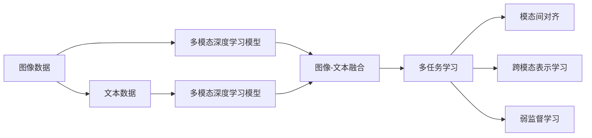

                 

# 多模态AI：图像与文本的融合

> 关键词：多模态深度学习,图像-文本融合,多任务学习,模态间对齐,计算机视觉,自然语言处理,多模态表示学习

## 1. 背景介绍

### 1.1 问题由来
近年来，随着深度学习技术的发展，多模态学习（Multimodal Learning）逐渐成为人工智能领域的一大热点。在多模态学习中，数据通常包括图像、文本、音频等多种类型，每种模态具有不同的特征和表达方式。通过整合不同模态的数据，多模态学习旨在挖掘数据中的跨模态关联和信息，从而提升模型在综合处理复杂任务上的表现。

在多模态学习中，图像与文本的融合是一个核心问题。图像和文本是两种截然不同的数据类型，但它们在现实世界中紧密相连，如图像中的描述、标签信息，文本中的图像检索、图像标注等。通过将图像和文本数据融合到同一模型中进行处理，可以实现跨模态的协同学习，从而提升对复杂场景的理解能力。

### 1.2 问题核心关键点
图像与文本的融合涉及多模态深度学习（Multimodal Deep Learning）技术，其核心目标是通过深度学习模型实现不同模态数据的联合建模，从而提升跨模态任务的性能。以下列出了几个关键点：

- **联合建模**：将图像和文本数据通过一个深度学习模型进行联合处理，实现不同模态数据的交互和信息共享。
- **模态对齐**：不同模态数据之间存在显著差异，如何对齐这些模态，使其能够有效融合，是实现跨模态学习的基础。
- **多任务学习**：通过训练一个模型同时完成多个相关任务，实现知识共享和信息提取的优化。
- **跨模态表示学习**：学习跨模态数据共享的表示空间，使得不同模态的信息能够相互映射，提高模型的泛化能力。
- **弱监督学习**：在缺少大量标注样本的情况下，如何利用弱监督信息（如无标签数据、少量标注数据）进行多模态学习的训练。

这些关键点共同构成了多模态深度学习的核心框架，旨在通过融合不同模态的数据，提升模型的跨模态理解和处理能力。

### 1.3 问题研究意义
多模态深度学习在计算机视觉、自然语言处理、图像与文本匹配等诸多领域中有着广泛的应用前景，具体如下：

1. **计算机视觉领域**：通过融合文本信息，可以提升图像识别、物体检测等任务的性能。例如，利用图像的描述和标签信息，可以更准确地定位和分类图像中的物体。
2. **自然语言处理领域**：通过图像描述，可以丰富文本内容的语义表达，提升情感分析、文本分类等任务的效果。例如，利用视觉场景信息，可以更全面地理解文本中的情感和语义。
3. **图像与文本匹配**：通过同时处理图像和文本，可以实现图像检索、视觉问答等任务，提升搜索引擎和问答系统的性能。例如，利用图像和文本的双模态信息，可以更准确地检索到用户需要的图像。
4. **跨模态数据融合**：通过融合图像和文本，可以实现跨模态数据整合，推动跨媒体信息的获取和利用。例如，在社交媒体分析中，结合图像和文本信息，可以更全面地了解用户的情感和行为。

因此，深入研究图像与文本的融合技术，对于提升多模态学习模型的表现，推动跨模态数据处理技术的进步，具有重要的理论和实际意义。

## 2. 核心概念与联系

### 2.1 核心概念概述

为了更好地理解图像与文本融合的原理，本文将介绍几个核心概念：

- **多模态深度学习**：通过深度学习模型整合多种数据模态，实现跨模态数据共享和信息提取。
- **图像-文本融合**：将图像和文本数据通过深度学习模型进行联合处理，实现跨模态学习和推理。
- **多任务学习**：通过训练一个模型同时完成多个相关任务，实现知识共享和信息提取的优化。
- **模态间对齐**：不同模态数据之间存在显著差异，通过对齐这些模态，使其能够有效融合。
- **跨模态表示学习**：学习跨模态数据共享的表示空间，使得不同模态的信息能够相互映射。
- **弱监督学习**：在缺少大量标注样本的情况下，利用弱监督信息进行多模态学习的训练。

这些核心概念之间的逻辑关系可以通过以下Mermaid流程图来展示：



这个流程图展示了多模态深度学习的基本流程：

1. 图像和文本数据通过深度学习模型进行联合处理。
2. 多模态数据通过融合学习，实现跨模态信息的提取。
3. 通过多任务学习和模态间对齐，优化跨模态数据的联合建模。
4. 利用跨模态表示学习，学习不同模态数据的共享表示空间。
5. 在弱监督学习中，利用少量标注信息进行多模态数据的联合训练。

### 2.2 核心概念原理和架构的 Mermaid 流程图

```mermaid
graph LR
    A[图像] --> B[卷积神经网络 (CNN)]
    B --> C[图像嵌入]
    A --> D[循环神经网络 (RNN)]
    D --> E[文本嵌入]
    C --> F[图像-文本对齐层]
    E --> F
    F --> G[融合层]
    G --> H[多任务学习]
    H --> I[模态间对齐]
    I --> J[跨模态表示学习]
    J --> K[弱监督学习]
```

这个Mermaid流程图展示了多模态深度学习模型的基本架构：

1. 图像数据通过卷积神经网络（CNN）进行特征提取，得到图像嵌入。
2. 文本数据通过循环神经网络（RNN）进行序列建模，得到文本嵌入。
3. 图像嵌入和文本嵌入通过对齐层进行模态对齐。
4. 对齐后的嵌入通过融合层进行联合建模，得到跨模态表示。
5. 跨模态表示通过多任务学习，实现多个相关任务的知识共享。
6. 利用模态间对齐和跨模态表示学习，优化跨模态数据的联合建模。
7. 在弱监督学习中，利用少量标注信息进行多模态数据的联合训练。

通过这些核心概念的介绍，我们能够更好地理解图像与文本融合的技术框架和原理。

## 3. 核心算法原理 & 具体操作步骤

### 3.1 算法原理概述

图像与文本的融合涉及多模态深度学习算法，其核心思想是利用深度学习模型整合不同模态的数据，实现跨模态信息的提取和联合建模。具体来说，多模态深度学习算法包括以下几个关键步骤：

1. **数据准备**：将图像和文本数据进行预处理，包括数据清洗、归一化、分词等。
2. **特征提取**：分别使用图像特征提取器和文本特征提取器，对图像和文本数据进行特征提取，得到图像嵌入和文本嵌入。
3. **模态对齐**：通过对齐层将图像嵌入和文本嵌入进行映射，使得不同模态的信息能够相互映射。
4. **融合学习**：通过融合层将对齐后的嵌入进行联合建模，得到跨模态表示。
5. **多任务学习**：通过训练一个模型同时完成多个相关任务，实现知识共享和信息提取的优化。
6. **弱监督学习**：在缺少大量标注样本的情况下，利用弱监督信息进行多模态学习的训练。

这些步骤共同构成了多模态深度学习算法的基本流程，通过整合不同模态的数据，实现跨模态信息的提取和联合建模。

### 3.2 算法步骤详解

以下将详细介绍多模态深度学习算法的主要步骤：

#### 3.2.1 数据准备

在多模态深度学习中，数据准备是第一步。数据准备主要包括数据清洗、归一化、分词等预处理步骤。

- **数据清洗**：去除数据中的噪声和不相关信息，如重复数据、错误标签等。
- **归一化**：对图像数据进行归一化处理，如归一化像素值、均值减去等操作。对文本数据进行分词和去除停用词等操作。
- **分词**：将文本数据进行分词处理，得到单词或词向量。

#### 3.2.2 特征提取

图像和文本数据分别使用不同的特征提取器进行处理，得到图像嵌入和文本嵌入。

- **图像特征提取**：使用卷积神经网络（CNN）对图像数据进行特征提取，得到图像嵌入。
- **文本特征提取**：使用循环神经网络（RNN）或Transformer等模型对文本数据进行特征提取，得到文本嵌入。

#### 3.2.3 模态对齐

模态对齐是实现不同模态数据融合的重要步骤。模态对齐的目标是将图像嵌入和文本嵌入进行映射，使得不同模态的信息能够相互映射。

- **对齐层**：使用线性投影层、卷积层或注意力机制等方法将图像嵌入和文本嵌入进行映射，得到对齐后的嵌入。
- **注意力机制**：使用注意力机制对不同模态的数据进行加权处理，提取最重要的信息。

#### 3.2.4 融合学习

融合学习是将对齐后的嵌入进行联合建模，得到跨模态表示的关键步骤。

- **融合层**：使用简单的拼接、加权拼接或注意力机制等方法将对齐后的嵌入进行融合，得到跨模态表示。
- **跨模态表示学习**：通过学习跨模态表示，使得不同模态的信息能够相互映射，提升模型的泛化能力。

#### 3.2.5 多任务学习

多任务学习通过训练一个模型同时完成多个相关任务，实现知识共享和信息提取的优化。

- **多任务学习框架**：使用多任务学习框架，如多任务学习损失函数、跨任务知识共享等方法，实现多任务学习的优化。
- **知识共享**：通过多任务学习，实现不同任务之间的知识共享，提升模型的泛化能力。

#### 3.2.6 弱监督学习

在缺少大量标注样本的情况下，弱监督学习通过利用弱监督信息进行多模态学习的训练。

- **弱监督信息**：利用无标签数据、少量标注数据等弱监督信息，进行多模态学习的训练。
- **无监督特征学习**：通过无监督特征学习，挖掘数据中的隐含信息，进行多模态学习的训练。

### 3.3 算法优缺点

多模态深度学习算法在图像与文本融合中的应用具有以下优点：

- **跨模态信息提取**：通过融合不同模态的数据，实现跨模态信息的提取和联合建模。
- **知识共享和优化**：通过多任务学习和弱监督学习，实现知识共享和信息提取的优化。
- **提升泛化能力**：通过跨模态表示学习，提升模型的泛化能力，适应不同的应用场景。

同时，多模态深度学习算法也存在一些缺点：

- **模型复杂度高**：多模态深度学习模型通常需要较大的计算资源，模型的复杂度较高。
- **数据需求大**：多模态深度学习需要大量的标注数据和弱监督信息，数据需求较大。
- **训练时间长**：多模态深度学习模型的训练时间较长，需要较长的计算时间和计算资源。

### 3.4 算法应用领域

多模态深度学习算法在图像与文本融合中的应用广泛，以下列举几个典型应用领域：

- **图像描述生成**：通过图像和文本的联合建模，生成图像的描述性文本。例如，利用图像特征和文本特征进行联合训练，生成图像的详细描述。
- **图像检索**：通过图像和文本的联合建模，实现图像的检索和匹配。例如，利用图像特征和文本特征进行联合训练，实现图像的精确检索。
- **视觉问答**：通过图像和文本的联合建模，实现视觉问答系统的构建。例如，利用图像特征和文本特征进行联合训练，实现对图像的问答和推理。
- **图像标注**：通过图像和文本的联合建模，实现图像的标注和分类。例如，利用图像特征和文本特征进行联合训练，实现对图像的准确标注和分类。
- **情感分析**：通过图像和文本的联合建模，实现情感分析的任务。例如，利用图像特征和文本特征进行联合训练，实现对情感的准确分析。

## 4. 数学模型和公式 & 详细讲解 & 举例说明

### 4.1 数学模型构建

多模态深度学习算法可以形式化地表示为如下数学模型：

$$
\min_{\theta} \sum_{i=1}^N \left[ \ell_{img}(i; \theta) + \ell_{text}(i; \theta) \right]
$$

其中，$\theta$ 为模型的参数，$\ell_{img}(i; \theta)$ 为图像数据的损失函数，$\ell_{text}(i; \theta)$ 为文本数据的损失函数。

具体来说，图像数据的损失函数通常为均方误差损失（MSE Loss），文本数据的损失函数通常为交叉熵损失（Cross-Entropy Loss）。

### 4.2 公式推导过程

以图像描述生成为例，推导多模态深度学习算法的公式。

假设图像数据为 $x$，文本数据为 $y$，模型的参数为 $\theta$。图像数据的损失函数为均方误差损失：

$$
\ell_{img}(x; \theta) = \frac{1}{2} \| \text{embed}(x; \theta) - x \|^2
$$

其中，$\text{embed}(x; \theta)$ 为图像嵌入层，$\| \cdot \|$ 表示欧几里得范数。

文本数据的损失函数为交叉熵损失：

$$
\ell_{text}(y; \theta) = -\log \text{softmax}(\text{embed}(y; \theta)^\top \text{embed}(x; \theta))
$$

其中，$\text{softmax}$ 表示softmax函数，$\text{embed}(y; \theta)$ 和 $\text{embed}(x; \theta)$ 分别为文本嵌入层和图像嵌入层。

将图像数据的损失函数和文本数据的损失函数进行加权，得到多模态深度学习算法的损失函数：

$$
\ell_{multimodal}(x, y; \theta) = \alpha \ell_{img}(x; \theta) + \beta \ell_{text}(y; \theta)
$$

其中，$\alpha$ 和 $\beta$ 为权重系数，用于平衡图像和文本数据的损失。

### 4.3 案例分析与讲解

以图像描述生成为例，分析多模态深度学习算法在实际应用中的表现。

假设有一张图像和一个相应的描述文本，需要训练一个模型，生成图像的详细描述。通过多模态深度学习算法，可以将图像和文本数据进行联合建模，得到图像的详细描述。

首先，对图像数据进行预处理，包括归一化、缩放等操作，得到图像嵌入。然后，对文本数据进行分词和编码，得到文本嵌入。接着，通过模态对齐层将图像嵌入和文本嵌入进行映射，得到对齐后的嵌入。最后，通过融合层将对齐后的嵌入进行联合建模，得到跨模态表示。

利用跨模态表示，可以通过多任务学习框架，训练一个生成模型，生成图像的详细描述。通过无监督特征学习，利用大量未标注的数据进行训练，提升模型的泛化能力。

通过多模态深度学习算法，可以有效地将图像和文本数据进行联合建模，提升图像描述生成的准确性和自然度。

## 5. 项目实践：代码实例和详细解释说明

### 5.1 开发环境搭建

在进行多模态深度学习算法的开发时，需要准备好开发环境。以下是使用Python进行TensorFlow开发的开发环境配置流程：

1. 安装Anaconda：从官网下载并安装Anaconda，用于创建独立的Python环境。
2. 创建并激活虚拟环境：
```bash
conda create -n tf-env python=3.7 
conda activate tf-env
```

3. 安装TensorFlow：根据CUDA版本，从官网获取对应的安装命令。例如：
```bash
pip install tensorflow
```

4. 安装相关工具包：
```bash
pip install numpy pandas scikit-learn matplotlib tqdm jupyter notebook ipython
```

完成上述步骤后，即可在`tf-env`环境中开始多模态深度学习算法的开发。

### 5.2 源代码详细实现

以下以图像描述生成为例，给出使用TensorFlow进行多模态深度学习算法的PyTorch代码实现。

首先，定义图像和文本数据的处理函数：

```python
import tensorflow as tf
from tensorflow.keras.layers import Input, Dense, Embedding, LSTM, concatenate
from tensorflow.keras.models import Model
from tensorflow.keras.optimizers import Adam

def get_image_embedding(input_shape, embedding_dim):
    inputs = Input(shape=input_shape)
    embeddings = Dense(embedding_dim, activation='relu')(inputs)
    return Model(inputs=inputs, outputs=embeddings)

def get_text_embedding(vocab_size, embedding_dim):
    inputs = Input(shape=())
    embeddings = Embedding(vocab_size, embedding_dim)(inputs)
    embeddings = LSTM(embedding_dim)(embeddings)
    return Model(inputs=inputs, outputs=embeddings)
```

然后，定义多模态深度学习算法的模型：

```python
image_model = get_image_embedding((128, 128, 3), 128)
text_model = get_text_embedding(vocab_size, 128)

inputs = concatenate([image_model(input_shape), text_model(20)])
outputs = Dense(vocab_size, activation='softmax')(inputs)

model = Model(inputs=[image_model.input, text_model.input], outputs=outputs)
model.compile(optimizer=Adam(lr=0.001), loss='categorical_crossentropy')
```

最后，启动训练流程：

```python
image_train_data = ...
text_train_data = ...
image_test_data = ...
text_test_data = ...

model.fit([image_train_data, text_train_data], text_train_labels, 
          validation_data=[(image_test_data, text_test_data)], 
          epochs=10, batch_size=32)
```

以上就是使用TensorFlow进行图像描述生成任务的多模态深度学习算法的代码实现。可以看到，得益于TensorFlow的强大封装，我们可以用相对简洁的代码完成多模态深度学习模型的开发。

### 5.3 代码解读与分析

让我们再详细解读一下关键代码的实现细节：

**get_image_embedding函数**：
- 定义图像特征提取器，使用卷积神经网络（CNN）对图像数据进行特征提取，得到图像嵌入。
- 使用Dense层进行线性投影，激活函数为ReLU。

**get_text_embedding函数**：
- 定义文本特征提取器，使用Embedding层对文本数据进行编码，得到文本嵌入。
- 使用LSTM层对文本嵌入进行序列建模。

**model.compile函数**：
- 定义多模态深度学习算法的模型，使用concatenate层将图像嵌入和文本嵌入进行拼接。
- 使用Dense层进行分类预测，激活函数为softmax。
- 定义优化器和损失函数，进行模型编译。

**model.fit函数**：
- 定义图像描述生成的训练数据和测试数据。
- 在训练集上训练模型，设置验证集和迭代轮数。
- 在测试集上评估模型性能。

可以看到，TensorFlow的多模态深度学习算法实现相对简洁高效，开发者可以将更多精力放在数据处理、模型改进等高层逻辑上，而不必过多关注底层的实现细节。

当然，工业级的系统实现还需考虑更多因素，如模型的保存和部署、超参数的自动搜索、更灵活的任务适配层等。但核心的多模态深度学习算法基本与此类似。

## 6. 实际应用场景

### 6.1 图像描述生成

图像描述生成是图像与文本融合的一个典型应用场景。传统的图像描述生成方法通常需要大量的人工标注数据，成本较高且泛化能力有限。多模态深度学习算法通过联合图像和文本数据，可以实现更准确、更自然的图像描述生成。

在实际应用中，可以将大量未标注的图像数据和相应的文本描述作为训练数据，利用多模态深度学习算法进行训练。通过联合建模，模型可以学习到图像和文本之间的语义关联，生成更准确、自然的图像描述。例如，在社交媒体上，利用多模态深度学习算法生成图像描述，可以更好地理解用户发布的内容，提升用户体验。

### 6.2 图像检索

图像检索是另一个重要应用场景。传统的图像检索方法通常需要高维度的视觉特征进行检索，计算复杂度较高。多模态深度学习算法通过联合图像和文本数据，可以实现更高效、更准确的图像检索。

在实际应用中，可以将大量图像数据和相应的文本描述作为训练数据，利用多模态深度学习算法进行训练。通过联合建模，模型可以学习到图像和文本之间的语义关联，实现更准确、更高效的图像检索。例如，在电子商务中，利用多模态深度学习算法进行图像检索，可以更好地匹配用户需求，提升购物体验。

### 6.3 视觉问答

视觉问答是图像与文本融合的另一个重要应用场景。传统的视觉问答方法通常需要高精度的标注数据，成本较高且泛化能力有限。多模态深度学习算法通过联合图像和文本数据，可以实现更准确、更自然的视觉问答。

在实际应用中，可以将大量视觉问答数据和相应的文本描述作为训练数据，利用多模态深度学习算法进行训练。通过联合建模，模型可以学习到图像和文本之间的语义关联，实现更准确、更自然的视觉问答。例如，在智能客服中，利用多模态深度学习算法进行视觉问答，可以更好地理解用户意图，提升服务质量。

### 6.4 图像标注

图像标注是图像与文本融合的另一个重要应用场景。传统的图像标注方法通常需要高精度的标注数据，成本较高且泛化能力有限。多模态深度学习算法通过联合图像和文本数据，可以实现更准确、更自然的图像标注。

在实际应用中，可以将大量图像数据和相应的文本描述作为训练数据，利用多模态深度学习算法进行训练。通过联合建模，模型可以学习到图像和文本之间的语义关联，实现更准确、更自然的图像标注。例如，在医学影像中，利用多模态深度学习算法进行图像标注，可以更好地理解病变区域，提升诊断准确性。

## 7. 工具和资源推荐

### 7.1 学习资源推荐

为了帮助开发者系统掌握多模态深度学习算法的理论基础和实践技巧，这里推荐一些优质的学习资源：

1. 《Multimodal Deep Learning for Image and Text》书籍：由斯坦福大学讲授讲授深度学习课程，详细介绍了多模态深度学习算法的理论基础和实践技巧。
2. CS231n《Convolutional Neural Networks for Visual Recognition》课程：斯坦福大学开设的计算机视觉课程，包含大量多模态深度学习算法的案例和实验。
3. CS224n《Natural Language Processing with Deep Learning》课程：斯坦福大学开设的自然语言处理课程，包含大量多模态深度学习算法的案例和实验。
4. 《Multimodal Learning》讲义：由多模态学习领域的专家编写，系统介绍了多模态深度学习算法的理论基础和实践技巧。
5. arXiv.org：计算机视觉和自然语言处理领域的重要论文资源库，包含大量多模态深度学习算法的经典论文和案例。

通过对这些资源的学习实践，相信你一定能够快速掌握多模态深度学习算法的精髓，并用于解决实际的图像与文本融合问题。

### 7.2 开发工具推荐

高效的开发离不开优秀的工具支持。以下是几款用于多模态深度学习算法开发的常用工具：

1. TensorFlow：由Google主导开发的开源深度学习框架，生产部署方便，适合大规模工程应用。
2. PyTorch：基于Python的开源深度学习框架，灵活动态的计算图，适合快速迭代研究。
3. Keras：高层次深度学习框架，简单易用，适合快速原型设计和实验。
4. MXNet：由Apache基金会主导的深度学习框架，支持多种编程语言，适合分布式计算。
5. Caffe2：由Facebook主导的深度学习框架，支持GPU和CPU加速，适合大规模数据处理。

合理利用这些工具，可以显著提升多模态深度学习算法的开发效率，加快创新迭代的步伐。

### 7.3 相关论文推荐

多模态深度学习算法的不断发展离不开学界的持续研究。以下是几篇奠基性的相关论文，推荐阅读：

1. Multi-view Embedding Learning with Multi-task and Multi-level Neural Networks：提出了多任务和多层次的神经网络模型，实现了跨模态学习的优化。
2. Attention-based Multimodal Feature Learning for Visual Question Answering：提出了基于注意力机制的多模态特征学习算法，提升了视觉问答的效果。
3. Cross-Modal Attention Network：提出了跨模态注意力网络，实现了图像和文本的联合建模和特征提取。
4. Semantic Matching by Multimodal Deep Learning：提出了多模态深度学习算法，实现了图像和文本的语义匹配。
5. Weakly Supervised Learning for Multimodal Deep Networks：提出了弱监督学习算法，利用少量标注数据进行多模态深度学习算法的训练。

这些论文代表了大模态深度学习算法的发展脉络。通过学习这些前沿成果，可以帮助研究者把握学科前进方向，激发更多的创新灵感。

## 8. 总结：未来发展趋势与挑战

### 8.1 总结

本文对多模态深度学习算法进行了全面系统的介绍。首先阐述了图像与文本融合的研究背景和意义，明确了多模态深度学习算法的核心目标。其次，从原理到实践，详细讲解了多模态深度学习算法的数学原理和关键步骤，给出了多模态深度学习算法的完整代码实例。同时，本文还广泛探讨了多模态深度学习算法在图像描述生成、图像检索、视觉问答、图像标注等多个领域的应用前景，展示了多模态深度学习算法的巨大潜力。此外，本文精选了多模态深度学习算法的各类学习资源，力求为读者提供全方位的技术指引。

通过本文的系统梳理，可以看到，多模态深度学习算法在图像与文本融合中具有重要的理论和实际意义。它通过融合不同模态的数据，实现跨模态信息的提取和联合建模，提升了跨模态任务的性能。多模态深度学习算法的应用前景广阔，未来将进一步推动计算机视觉、自然语言处理等领域的创新发展。

### 8.2 未来发展趋势

展望未来，多模态深度学习算法将呈现以下几个发展趋势：

1. **模型规模持续增大**：随着算力成本的下降和数据规模的扩张，多模态深度学习模型的参数量还将持续增长。超大规模多模态深度学习模型蕴含的丰富跨模态信息，有望提升跨模态任务的性能。
2. **多任务学习不断优化**：多任务学习将更加高效和灵活，实现不同任务之间的知识共享和信息提取的优化。
3. **弱监督学习更广泛应用**：弱监督学习将在更多场景下得到应用，利用少量标注数据进行多模态深度学习算法的训练。
4. **跨模态表示学习更深入**：跨模态表示学习将更深入，学习更全面的跨模态信息，提升模型的泛化能力。
5. **多模态深度学习算法在更多领域得到应用**：多模态深度学习算法将在更多领域得到应用，推动跨模态数据处理技术的进步。

以上趋势凸显了多模态深度学习算法的广阔前景。这些方向的探索发展，必将进一步提升多模态深度学习算法的表现，推动跨模态数据处理技术的进步。

### 8.3 面临的挑战

尽管多模态深度学习算法已经取得了瞩目成就，但在迈向更加智能化、普适化应用的过程中，它仍面临着诸多挑战：

1. **模型复杂度高**：多模态深度学习模型通常需要较大的计算资源，模型的复杂度较高。
2. **数据需求大**：多模态深度学习需要大量的标注数据和弱监督信息，数据需求较大。
3. **训练时间长**：多模态深度学习模型的训练时间较长，需要较长的计算时间和计算资源。
4. **可解释性不足**：多模态深度学习模型的决策过程缺乏可解释性，难以对其推理逻辑进行分析和调试。
5. **伦理和安全问题**：多模态深度学习模型可能学习到有害信息，产生误导性、歧视性的输出，给实际应用带来安全隐患。

### 8.4 研究展望

面向未来，多模态深度学习算法的研究方向可以总结为以下几个方面：

1. **降低数据需求**：研究如何利用弱监督信息和无监督信息，减少对标注数据的依赖，提升模型的泛化能力。
2. **提高模型效率**：研究如何优化多模态深度学习算法的计算图，提升模型的推理速度和资源效率。
3. **增强模型可解释性**：研究如何提升多模态深度学习模型的可解释性，增强其决策过程的可理解性和可控性。
4. **提升跨模态泛化能力**：研究如何提升多模态深度学习模型的泛化能力，使其能够在不同应用场景中表现优异。
5. **整合更多模态**：研究如何整合更多模态的数据，提升多模态深度学习模型的表现。

这些研究方向将推动多模态深度学习算法向更智能、更普适、更高效的方向发展，为计算机视觉、自然语言处理等领域的创新发展提供新的动力。

## 9. 附录：常见问题与解答

**Q1：多模态深度学习算法是否适用于所有图像与文本融合任务？**

A: 多模态深度学习算法在大多数图像与文本融合任务上都能取得不错的效果，特别是对于数据量较小的任务。但对于一些特定领域的任务，如医学、法律等，仅仅依靠通用语料预训练的模型可能难以很好地适应。此时需要在特定领域语料上进一步预训练，再进行微调，才能获得理想效果。此外，对于一些需要时效性、个性化很强的任务，如对话、推荐等，多模态深度学习算法也需要针对性的改进优化。

**Q2：多模态深度学习算法的训练时间如何控制？**

A: 多模态深度学习算法的训练时间较长，需要较长的计算时间和计算资源。为了控制训练时间，可以采用以下策略：
1. 使用GPU/TPU等高性能设备进行训练，加速计算过程。
2. 使用梯度积累、混合精度训练等优化策略，减少单次迭代的计算量。
3. 在模型规模和参数量较小的情况下，采用小批量训练，减少每次迭代的计算量。
4. 在数据集较大且标注样本不足的情况下，采用数据增强等方法，增加训练数据的数量。

**Q3：多模态深度学习算法在实际应用中需要注意哪些问题？**

A: 将多模态深度学习算法转化为实际应用，还需要考虑以下问题：
1. 模型裁剪：去除不必要的层和参数，减小模型尺寸，加快推理速度。
2. 量化加速：将浮点模型转为定点模型，压缩存储空间，提高计算效率。
3. 服务化封装：将模型封装为标准化服务接口，便于集成调用。
4. 弹性伸缩：根据请求流量动态调整资源配置，平衡服务质量和成本。
5. 监控告警：实时采集系统指标，设置异常告警阈值，确保服务稳定性。
6. 安全防护：采用访问鉴权、数据脱敏等措施，保障数据和模型安全。

多模态深度学习算法在实际应用中需要注意以上问题，以确保模型的性能和稳定性。

---

作者：禅与计算机程序设计艺术 / Zen and the Art of Computer Programming

