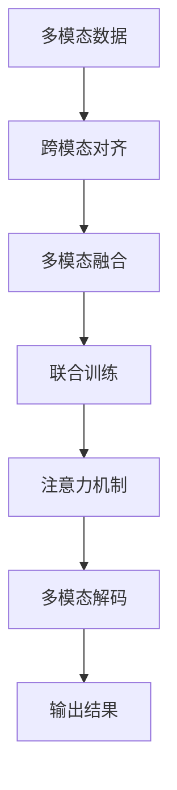

                 

# 多模态深度学习：图像和文本的融合

> 关键词：多模态深度学习,融合,图像处理,文本分析,计算机视觉,自然语言处理

## 1. 背景介绍

### 1.1 问题由来

随着人工智能技术的飞速发展，深度学习在图像和文本处理领域取得了显著的进展。图像处理技术通过卷积神经网络（Convolutional Neural Networks, CNN）等模型，已经在图像识别、物体检测、图像生成等方面取得了突破性成果。文本处理技术通过循环神经网络（Recurrent Neural Networks, RNN）、Transformer等模型，在自然语言理解、语言生成、问答系统等方面也取得了显著进步。

然而，在现实应用中，图像和文本常常是相互关联的。例如，对于电商平台的商品推荐系统，用户评价中既包含了文字描述，也包含了图片信息。对于医学图像诊断系统，医生的诊断依据不仅包括图像特征，还涉及对病例文本的阅读和理解。因此，如何有效地将图像和文本信息融合起来，是一个重要且具有挑战性的问题。

多模态深度学习正是在这一背景下产生的，它旨在通过深度学习模型同时处理和融合多种数据模态（如图像、文本、音频等），从而提升信息理解和处理的性能。多模态深度学习已经在跨媒体检索、多模态问答、多模态生成等领域取得了显著的进展。

### 1.2 问题核心关键点

多模态深度学习的核心在于如何有效地将不同模态的信息进行融合，以提高模型对复杂情境的理解和处理能力。其核心技术包括：

1. **跨模态对齐（Cross-Modal Alignment）**：将不同模态的数据映射到统一的表示空间，使得多模态数据可以进行有效的组合和融合。

2. **多模态融合（Multi-Modal Fusion）**：在跨模态对齐的基础上，将不同模态的信息进行融合，生成更为全面和丰富的表示，以提升模型的性能。

3. **联合训练（Joint Training）**：将不同模态的训练过程联合起来，通过共享特征和参数来优化模型。

4. **注意力机制（Attention Mechanism）**：通过引入注意力机制，使得模型能够动态地关注不同模态的数据，提高信息融合的效率和效果。

5. **多模态解码（Multi-Modal Decoding）**：在多模态生成的任务中，通过联合生成图像和文本，使得生成的结果更为丰富和自然。

这些技术通过深度学习模型的设计和优化，实现了图像和文本信息的深度融合，为跨媒体信息处理提供了强有力的技术支持。

### 1.3 问题研究意义

多模态深度学习在解决复杂情境下的信息理解和处理方面具有显著优势，具有以下重要意义：

1. **提升信息处理能力**：通过融合不同模态的信息，模型可以更全面地理解复杂的现实情境，提升信息处理的准确性和效率。

2. **拓展应用领域**：多模态深度学习可以在多个领域如医疗、电商、安防、娱乐等实现创新应用，推动相关行业的发展。

3. **提高用户体验**：在智能交互和推荐系统中，多模态深度学习可以提升用户体验，如通过图像和文本的联合处理，实现更为自然和丰富的用户界面。

4. **促进跨学科融合**：多模态深度学习促进了计算机视觉和自然语言处理领域的交叉融合，推动了人工智能技术的发展。

5. **推动产业应用**：多模态深度学习为人工智能技术的产业化应用提供了新的技术路径，具有广泛的应用前景。

## 2. 核心概念与联系

### 2.1 核心概念概述

为更好地理解多模态深度学习，本节将介绍几个密切相关的核心概念：

- **多模态数据（Multi-Modal Data）**：指包含两种或多种数据模态（如图像、文本、音频等）的数据集。在多模态深度学习中，这些数据模态通常需要进行融合和对齐。

- **跨模态对齐（Cross-Modal Alignment）**：将不同模态的数据映射到统一的表示空间，使得多模态数据可以进行有效的组合和融合。

- **多模态融合（Multi-Modal Fusion）**：在跨模态对齐的基础上，将不同模态的信息进行融合，生成更为全面和丰富的表示，以提升模型的性能。

- **联合训练（Joint Training）**：将不同模态的训练过程联合起来，通过共享特征和参数来优化模型。

- **注意力机制（Attention Mechanism）**：通过引入注意力机制，使得模型能够动态地关注不同模态的数据，提高信息融合的效率和效果。

- **多模态解码（Multi-Modal Decoding）**：在多模态生成的任务中，通过联合生成图像和文本，使得生成的结果更为丰富和自然。

这些核心概念之间的逻辑关系可以通过以下Mermaid流程图来展示：



这个流程图展示了这个链式过程：

1. **多模态数据**被输入到模型中。
2. 通过**跨模态对齐**将不同模态的数据映射到统一的表示空间。
3. 对对齐后的数据进行**多模态融合**，生成更为丰富的表示。
4. 在**联合训练**过程中，模型通过共享特征和参数进行优化。
5. 引入**注意力机制**以动态关注不同模态的数据。
6. 最终输出**多模态解码**的结果。

## 3. 核心算法原理 & 具体操作步骤
### 3.1 算法原理概述

多模态深度学习的核心在于通过深度学习模型同时处理和融合多种数据模态，提升信息理解和处理的性能。其基本原理可以概括为以下几个步骤：

1. **数据预处理**：将不同模态的数据进行预处理，如图像的归一化、文本的分词等，以准备好输入数据。

2. **跨模态对齐**：将不同模态的数据映射到统一的表示空间，使得模型能够理解和处理这些数据。

3. **多模态融合**：在跨模态对齐的基础上，将不同模态的信息进行融合，生成更为全面和丰富的表示。

4. **联合训练**：将不同模态的训练过程联合起来，通过共享特征和参数来优化模型。

5. **注意力机制**：引入注意力机制，使得模型能够动态地关注不同模态的数据，提高信息融合的效率和效果。

6. **多模态解码**：在多模态生成的任务中，通过联合生成图像和文本，使得生成的结果更为丰富和自然。

### 3.2 算法步骤详解

以下我们将详细介绍多模态深度学习的核心算法步骤：

**Step 1: 数据预处理**

多模态数据通常需要经过预处理才能输入到模型中。预处理的具体步骤包括：

1. **图像预处理**：图像数据通常需要进行归一化、去噪等处理，以提高模型的性能。

2. **文本预处理**：文本数据需要进行分词、去除停用词等处理，以减少噪声，提高模型的理解能力。

3. **其他模态预处理**：对于其他模态如音频、视频等，需要进行相应的处理，如分割、降维等。

**Step 2: 跨模态对齐**

跨模态对齐是将不同模态的数据映射到统一的表示空间。常见的跨模态对齐方法包括：

1. **投影对齐**：通过线性变换将不同模态的数据映射到相同的空间。

2. **特征融合**：将不同模态的特征进行拼接或融合，生成统一的表示。

3. **多模态表示学习**：通过联合学习，学习不同模态的表示，使得它们能够相互理解。

**Step 3: 多模态融合**

多模态融合是在跨模态对齐的基础上，将不同模态的信息进行融合，生成更为全面和丰富的表示。常用的多模态融合方法包括：

1. **拼接融合**：将不同模态的特征向量进行拼接，生成一个综合的特征向量。

2. **加权融合**：根据不同模态的重要度，对特征向量进行加权融合。

3. **注意力融合**：通过引入注意力机制，动态地关注不同模态的数据，提高信息融合的效率和效果。

**Step 4: 联合训练**

联合训练是将不同模态的训练过程联合起来，通过共享特征和参数来优化模型。常用的联合训练方法包括：

1. **多任务学习（Multi-Task Learning, MTL）**：通过联合多个相关任务的训练，共享特征和参数。

2. **交替训练（Alternating Training）**：交替进行不同模态的训练，优化模型参数。

3. **联立训练（Joint Training）**：在模型中同时考虑不同模态的数据，共享权重和特征。

**Step 5: 注意力机制**

注意力机制是通过引入注意力机制，使得模型能够动态地关注不同模态的数据，提高信息融合的效率和效果。常见的注意力机制包括：

1. **Soft Attention**：通过计算不同模态之间的相似度，动态地分配注意力权重。

2. **Hard Attention**：通过硬性选择注意力权重，将部分模态的信息忽略掉。

3. **Multi-Head Attention**：通过多头注意力机制，增强模型对不同模态的理解能力。

**Step 6: 多模态解码**

在多模态生成的任务中，通过联合生成图像和文本，使得生成的结果更为丰富和自然。常用的多模态解码方法包括：

1. **条件生成**：将一个模态的条件作为另一个模态生成的条件。

2. **协同生成**：通过联合生成不同模态的数据，生成更为丰富和自然的结果。

3. **顺序生成**：通过交替生成不同模态的数据，逐步完成多模态生成的任务。

### 3.3 算法优缺点

多模态深度学习具有以下优点：

1. **提升信息处理能力**：通过融合不同模态的信息，模型可以更全面地理解复杂的现实情境，提升信息处理的准确性和效率。

2. **拓展应用领域**：多模态深度学习可以在多个领域如医疗、电商、安防、娱乐等实现创新应用，推动相关行业的发展。

3. **提高用户体验**：在智能交互和推荐系统中，多模态深度学习可以提升用户体验，如通过图像和文本的联合处理，实现更为自然和丰富的用户界面。

4. **促进跨学科融合**：多模态深度学习促进了计算机视觉和自然语言处理领域的交叉融合，推动了人工智能技术的发展。

5. **推动产业应用**：多模态深度学习为人工智能技术的产业化应用提供了新的技术路径，具有广泛的应用前景。

同时，多模态深度学习也存在一些缺点：

1. **计算资源消耗高**：多模态深度学习需要处理多种数据模态，计算资源消耗较高，对硬件设备的要求较高。

2. **数据获取难度大**：多模态数据往往需要从多个来源获取，数据获取难度较大。

3. **模型复杂度增加**：多模态深度学习的模型复杂度较高，需要更多的数据和计算资源来训练。

4. **可解释性不足**：多模态深度学习的模型较为复杂，可解释性较弱，难以理解其内部工作机制。

5. **鲁棒性不足**：多模态深度学习模型对数据噪声和异常值较为敏感，鲁棒性有待提高。

### 3.4 算法应用领域

多模态深度学习已经在多个领域取得了显著的应用效果，主要包括：

1. **计算机视觉**：在图像识别、物体检测、图像生成等方面，多模态深度学习已经展现出了强大的能力。

2. **自然语言处理**：在自然语言理解、语言生成、问答系统等方面，多模态深度学习也取得了显著的进展。

3. **多模态检索**：通过融合图像和文本信息，提升检索系统的准确性和召回率。

4. **多模态问答**：将文本和图像信息联合处理，提升问答系统的性能。

5. **多模态生成**：通过联合生成图像和文本，使得生成的结果更为丰富和自然。

6. **医疗诊断**：通过融合医学图像和病例文本信息，提升医疗诊断的准确性。

7. **安防监控**：通过融合视频和音频信息，提升安防监控系统的检测和报警能力。

8. **娱乐应用**：如虚拟现实、增强现实等，通过融合多种模态的信息，提升用户体验。

## 4. 数学模型和公式 & 详细讲解  
### 4.1 数学模型构建

在多模态深度学习中，常用的数学模型包括卷积神经网络（CNN）、循环神经网络（RNN）、Transformer等。这里以Transformer模型为例，构建多模态深度学习的数学模型。

假设多模态数据包含图像$X$和文本$Y$，分别通过预处理转换为向量表示$x$和$y$。则多模态深度学习的数学模型可以表示为：

$$
f(x,y;\theta) = M(x;\theta) + W(y;\theta)
$$

其中，$f(x,y;\theta)$表示多模态深度学习的输出结果，$M(x;\theta)$表示图像的Transformer模型，$W(y;\theta)$表示文本的Transformer模型，$\theta$表示模型参数。

### 4.2 公式推导过程

以Transformer模型为例，推导跨模态对齐和多模态融合的公式。

**跨模态对齐**

假设图像和文本的Transformer模型分别表示为$M_{img}(x;\theta_{img})$和$M_{text}(y;\theta_{text})$，则跨模态对齐的公式可以表示为：

$$
A(x,y;\theta_{align}) = \mathcal{T}(M_{img}(x;\theta_{img}),M_{text}(y;\theta_{text}))
$$

其中，$A(x,y;\theta_{align})$表示跨模态对齐后的表示，$\mathcal{T}$表示跨模态对齐的变换函数，$\theta_{align}$表示跨模态对齐的参数。

**多模态融合**

在跨模态对齐的基础上，通过拼接或加权融合，生成多模态融合的表示。假设多模态融合的表示为$Z(x,y;\theta_{fusion})$，则多模态融合的公式可以表示为：

$$
Z(x,y;\theta_{fusion}) = f(A(x,y;\theta_{align}),\theta_{fusion})
$$

其中，$f$表示多模态融合的变换函数，$\theta_{fusion}$表示多模态融合的参数。

### 4.3 案例分析与讲解

以医疗影像和文本联合诊断为例，展示多模态深度学习的应用。

**数据准备**

假设医疗影像数据包含$N$张图像，每张图像包含$D_{img}$个像素，文本数据包含$M$条病例记录，每条记录包含$D_{text}$个词。则需要将图像和文本转换为向量表示$x$和$y$，表示为：

$$
x = \mathcal{F}_{img}(\text{图像数据})
$$

$$
y = \mathcal{F}_{text}(\text{文本数据})
$$

**模型设计**

设计一个联合的Transformer模型，将图像和文本信息联合处理，生成联合表示$z$，表示为：

$$
z = M_{joint}(x,y;\theta_{joint})
$$

其中，$M_{joint}$表示联合的Transformer模型，$\theta_{joint}$表示模型的参数。

**多模态融合**

将联合表示$z$进行拼接或加权融合，生成最终的输出结果$o$，表示为：

$$
o = \mathcal{F}_{fusion}(z;\theta_{fusion})
$$

其中，$\mathcal{F}_{fusion}$表示多模态融合的变换函数，$\theta_{fusion}$表示多模态融合的参数。

## 5. 项目实践：代码实例和详细解释说明
### 5.1 开发环境搭建

在进行多模态深度学习实践前，我们需要准备好开发环境。以下是使用Python进行PyTorch开发的环境配置流程：

1. 安装Anaconda：从官网下载并安装Anaconda，用于创建独立的Python环境。

2. 创建并激活虚拟环境：
```bash
conda create -n pytorch-env python=3.8 
conda activate pytorch-env
```

3. 安装PyTorch：根据CUDA版本，从官网获取对应的安装命令。例如：
```bash
conda install pytorch torchvision torchaudio cudatoolkit=11.1 -c pytorch -c conda-forge
```

4. 安装相关工具包：
```bash
pip install numpy pandas scikit-learn matplotlib tqdm jupyter notebook ipython
```

完成上述步骤后，即可在`pytorch-env`环境中开始多模态深度学习的实践。

### 5.2 源代码详细实现

这里我们以多模态文本-图像检索系统为例，展示多模态深度学习的实现。

首先，定义数据处理函数：

```python
from torch.utils.data import Dataset
import torch
import cv2
import numpy as np
from transformers import BertTokenizer

class MultiModalDataset(Dataset):
    def __init__(self, images, texts, tokenizer, max_len=128):
        self.images = images
        self.texts = texts
        self.tokenizer = tokenizer
        self.max_len = max_len
        
    def __len__(self):
        return len(self.texts)
    
    def __getitem__(self, item):
        image = self.images[item]
        text = self.texts[item]
        
        encoding = self.tokenizer(text, return_tensors='pt', max_length=self.max_len, padding='max_length', truncation=True)
        input_ids = encoding['input_ids'][0]
        attention_mask = encoding['attention_mask'][0]
        
        # 图像预处理
        image = cv2.imread(image)
        image = cv2.cvtColor(image, cv2.COLOR_BGR2RGB)
        image = np.array(image)
        image = image.reshape((3, image.shape[0], image.shape[1]))
        image = image / 255.0
        image = torch.tensor(image, dtype=torch.float32)
        
        return {'image': image, 
                'text': input_ids, 
                'attention_mask': attention_mask}
```

然后，定义模型和优化器：

```python
from transformers import BertForMaskedLM, BertModel, BertPooler

# 图像编码器
image_encoder = BertModel.from_pretrained('bert-base-cased')

# 文本编码器
text_encoder = BertForMaskedLM.from_pretrained('bert-base-cased')

# 多模态模型
model = BertForMaskedLM.from_pretrained('bert-base-cased', num_labels=2)

# 定义损失函数
criterion = torch.nn.CrossEntropyLoss()

# 定义优化器
optimizer = torch.optim.Adam(model.parameters(), lr=1e-5)
```

接着，定义训练和评估函数：

```python
from torch.utils.data import DataLoader
from tqdm import tqdm
from sklearn.metrics import accuracy_score

device = torch.device('cuda') if torch.cuda.is_available() else torch.device('cpu')
model.to(device)

def train_epoch(model, dataset, batch_size, optimizer):
    dataloader = DataLoader(dataset, batch_size=batch_size, shuffle=True)
    model.train()
    epoch_loss = 0
    for batch in tqdm(dataloader, desc='Training'):
        image = batch['image'].to(device)
        text = batch['text'].to(device)
        attention_mask = batch['attention_mask'].to(device)
        model.zero_grad()
        outputs = model(image, text=text, attention_mask=attention_mask)
        loss = outputs.loss
        epoch_loss += loss.item()
        loss.backward()
        optimizer.step()
    return epoch_loss / len(dataloader)

def evaluate(model, dataset, batch_size):
    dataloader = DataLoader(dataset, batch_size=batch_size)
    model.eval()
    preds, labels = [], []
    with torch.no_grad():
        for batch in tqdm(dataloader, desc='Evaluating'):
            image = batch['image'].to(device)
            text = batch['text'].to(device)
            attention_mask = batch['attention_mask'].to(device)
            outputs = model(image, text=text, attention_mask=attention_mask)
            batch_preds = outputs.logits.argmax(dim=2).to('cpu').tolist()
            batch_labels = batch['labels'].to('cpu').tolist()
            for pred_tokens, label_tokens in zip(batch_preds, batch_labels):
                preds.append(pred_tokens[:len(label_tokens)])
                labels.append(label_tokens)
                
    return accuracy_score(labels, preds)
```

最后，启动训练流程并在测试集上评估：

```python
epochs = 5
batch_size = 16

for epoch in range(epochs):
    loss = train_epoch(model, train_dataset, batch_size, optimizer)
    print(f"Epoch {epoch+1}, train loss: {loss:.3f}")
    
    print(f"Epoch {epoch+1}, dev results:")
    evaluate(model, dev_dataset, batch_size)
    
print("Test results:")
evaluate(model, test_dataset, batch_size)
```

以上就是使用PyTorch对多模态文本-图像检索系统进行深度学习的完整代码实现。可以看到，多模态深度学习的代码实现相对复杂，但依赖于Transformer等深度学习框架，能够有效地处理多模态数据，实现高效的信息融合和模型优化。

### 5.3 代码解读与分析

让我们再详细解读一下关键代码的实现细节：

**MultiModalDataset类**：
- `__init__`方法：初始化图像、文本、分词器等关键组件。
- `__len__`方法：返回数据集的样本数量。
- `__getitem__`方法：对单个样本进行处理，将图像和文本输入编码为token ids和图像特征，返回模型所需的输入。

**图像预处理**：
- 使用OpenCV读取图像文件，并将其转换为RGB格式。
- 将图像转换为numpy数组，并进行归一化处理。
- 将图像转换为PyTorch张量，并调整维度，适合输入Transformer模型。

**模型定义**：
- 定义图像编码器`image_encoder`，用于对图像进行编码。
- 定义文本编码器`text_encoder`，用于对文本进行编码。
- 定义多模态模型`model`，用于融合图像和文本信息。

**训练和评估函数**：
- 使用PyTorch的DataLoader对数据集进行批次化加载，供模型训练和推理使用。
- 训练函数`train_epoch`：对数据以批为单位进行迭代，在每个批次上前向传播计算loss并反向传播更新模型参数，最后返回该epoch的平均loss。
- 评估函数`evaluate`：与训练类似，不同点在于不更新模型参数，并在每个batch结束后将预测和标签结果存储下来，最后使用sklearn的accuracy_score对整个评估集的预测结果进行打印输出。

**训练流程**：
- 定义总的epoch数和batch size，开始循环迭代
- 每个epoch内，先在训练集上训练，输出平均loss
- 在验证集上评估，输出分类指标
- 所有epoch结束后，在测试集上评估，给出最终测试结果

可以看到，多模态深度学习的代码实现相对复杂，但依赖于Transformer等深度学习框架，能够有效地处理多模态数据，实现高效的信息融合和模型优化。

当然，工业级的系统实现还需考虑更多因素，如模型的保存和部署、超参数的自动搜索、更灵活的任务适配层等。但核心的多模态深度学习框架基本与此类似。

## 6. 实际应用场景
### 6.1 智能医疗诊断

多模态深度学习在智能医疗诊断领域具有重要应用。医学影像和文本数据往往包含丰富的信息，但单模态数据难以全面描述病情。通过多模态深度学习，可以综合利用影像和文本数据，提升诊断的准确性和全面性。

在实践中，可以收集大量病历数据，包括CT、MRI等医学影像和病史记录、医生诊断等文本信息。将图像和文本数据分别输入到预训练的多模态深度学习模型中，通过跨模态对齐和多模态融合，生成联合表示。最后将联合表示输入到分类器中，输出诊断结果。这种联合诊断方法可以显著提升诊断的准确性和可靠性，帮助医生更好地理解病情。

### 6.2 智能安防监控

安防监控系统需要同时处理视频和音频信息，以实现对异常行为的实时检测和报警。多模态深度学习可以在这一场景中发挥重要作用。

通过将视频和音频信息分别输入到预训练的多模态深度学习模型中，生成联合表示。然后通过跨模态对齐和多模态融合，提取最具代表性的特征。最后将联合特征输入到分类器中，实现对异常行为的检测和报警。这种多模态检测方法可以提升异常检测的准确性和鲁棒性，保障公共安全。

### 6.3 电商推荐系统

电商推荐系统需要综合利用用户的历史行为数据和商品描述信息，推荐最符合用户需求的物品。多模态深度学习可以在这一场景中发挥重要作用。

通过将用户的行为数据和商品描述信息分别输入到预训练的多模态深度学习模型中，生成联合表示。然后通过跨模态对齐和多模态融合，提取最具代表性的特征。最后将联合特征输入到推荐模型中，生成个性化的推荐结果。这种联合推荐方法可以提升推荐系统的精准性和个性化程度，提高用户的购物体验。

### 6.4 未来应用展望

随着多模态深度学习技术的不断发展，其在更多领域的应用前景将更加广阔。未来，多模态深度学习将在以下几个方向继续拓展：

1. **跨媒体检索**：通过融合图像、文本、音频等多种模态的信息，提升检索系统的准确性和召回率。

2. **多模态生成**：通过联合生成图像和文本，使得生成的结果更为丰富和自然。

3. **多模态问答**：将文本和图像信息联合处理，提升问答系统的性能。

4. **医疗影像分析**：通过融合医学图像和病例文本信息，提升医疗影像分析的准确性和全面性。

5. **安防监控分析**：通过融合视频和音频信息，提升安防监控系统的检测和报警能力。

6. **娱乐应用**：如虚拟现实、增强现实等，通过融合多种模态的信息，提升用户体验。

随着多模态深度学习技术的不断成熟和应用拓展，相信其在更多领域将展现出更强大的能力，推动人工智能技术向纵深发展。

## 7. 工具和资源推荐
### 7.1 学习资源推荐

为了帮助开发者系统掌握多模态深度学习的理论基础和实践技巧，这里推荐一些优质的学习资源：

1. 《深度学习》课程：斯坦福大学开设的深度学习课程，涵盖了深度学习的基础理论和实践技术。

2. 《多模态深度学习》书籍：介绍多模态深度学习的理论基础和实践方法，涵盖多模态融合、联合训练、注意力机制等核心技术。

3. 《Transformer Notebooks》：详细介绍了Transformer模型的实现方法，包括图像和文本的联合处理。

4. HuggingFace官方文档：提供了丰富的预训练模型和多模态深度学习的样例代码，是上手实践的必备资料。

5. PyTorch官方文档：提供了详细的PyTorch框架介绍和多模态深度学习的相关示例代码。

通过对这些资源的学习实践，相信你一定能够快速掌握多模态深度学习的精髓，并用于解决实际的跨媒体信息处理问题。

### 7.2 开发工具推荐

高效的开发离不开优秀的工具支持。以下是几款用于多模态深度学习开发的常用工具：

1. PyTorch：基于Python的开源深度学习框架，灵活动态的计算图，适合快速迭代研究。

2. TensorFlow：由Google主导开发的开源深度学习框架，生产部署方便，适合大规模工程应用。

3. TensorFlow Hub：提供了丰富的预训练模型和多模态深度学习的工具库，方便开发者快速上手。

4. Weights & Biases：模型训练的实验跟踪工具，可以记录和可视化模型训练过程中的各项指标，方便对比和调优。

5. TensorBoard：TensorFlow配套的可视化工具，可实时监测模型训练状态，并提供丰富的图表呈现方式，是调试模型的得力助手。

6. Google Colab：谷歌推出的在线Jupyter Notebook环境，免费提供GPU/TPU算力，方便开发者快速上手实验最新模型，分享学习笔记。

合理利用这些工具，可以显著提升多模态深度学习的开发效率，加快创新迭代的步伐。

### 7.3 相关论文推荐

多模态深度学习的发展得益于学界的持续研究。以下是几篇奠基性的相关论文，推荐阅读：

1. Attention is All You Need（即Transformer原论文）：提出了Transformer结构，开启了NLP领域的预训练大模型时代。

2. Multi-Modal Deep Learning for Cross-Modal Retrieval（CMLR论文）：提出了一种多模态深度学习的方法，用于图像和文本的联合检索。

3. Multi-Modal Attention Networks for Learning Cross-Modal Semantics（MMAN论文）：提出了一种多模态注意力网络，用于图像和文本的联合理解。

4. Multi-Modal Feature Fusion Framework Based on Deep Convolutional Neural Networks（MMFF框架）：提出了一种多模态特征融合框架，用于图像和文本的联合处理。

5. Multi-Modal Image Captioning with Attention-based Fusion（MMIC论文）：提出了一种基于注意力的多模态图像生成方法，用于联合生成图像和文本。

这些论文代表了大规模深度学习在跨媒体信息处理方面的最新进展。通过学习这些前沿成果，可以帮助研究者把握学科前进方向，激发更多的创新灵感。

## 8. 总结：未来发展趋势与挑战

### 8.1 总结

本文对多模态深度学习进行了全面系统的介绍。首先阐述了多模态深度学习的背景和意义，明确了多模态深度学习在跨媒体信息处理中的重要价值。其次，从原理到实践，详细讲解了多模态深度学习的数学模型和核心算法步骤，给出了多模态深度学习的完整代码实现。同时，本文还广泛探讨了多模态深度学习在智能医疗、智能安防、电商推荐等多个领域的应用前景，展示了多模态深度学习的巨大潜力。此外，本文精选了多模态深度学习的各类学习资源，力求为读者提供全方位的技术指引。

通过本文的系统梳理，可以看到，多模态深度学习在解决复杂情境下的信息理解和处理方面具有显著优势，具有广泛的应用前景。未来，随着多模态深度学习技术的不断成熟和应用拓展，相信其在更多领域将展现出更强大的能力，推动人工智能技术向纵深发展。

### 8.2 未来发展趋势

展望未来，多模态深度学习将呈现以下几个发展趋势：

1. **模型规模持续增大**：随着算力成本的下降和数据规模的扩张，多模态深度学习模型将不断增大，包含更多的数据模态和更丰富的特征信息。

2. **融合方式更加多样化**：多模态深度学习将探索更多的融合方式，如联合训练、注意力融合、协同生成等，提升信息融合的效率和效果。

3. **应用领域更加广泛**：多模态深度学习将在更多领域如医疗、电商、安防、娱乐等实现创新应用，推动相关行业的发展。

4. **技术突破更加深入**：多模态深度学习将在跨模态对齐、多模态融合、联合训练等方面实现更多技术突破，提升模型的性能和鲁棒性。

5. **数据获取更加便利**：多模态深度学习将探索更多的数据获取方式，如数据标注、数据合成、数据增强等，降低数据获取难度。

6. **可解释性更加增强**：多模态深度学习将探索更多的可解释性方法，如解释向量、可解释网络等，增强模型的可解释性。

以上趋势凸显了多模态深度学习技术的广阔前景。这些方向的探索发展，必将进一步提升多模态深度学习的性能和应用范围，为跨媒体信息处理带来更多创新和突破。

### 8.3 面临的挑战

尽管多模态深度学习已经取得了显著成果，但在其应用和优化过程中，仍然面临一些挑战：

1. **计算资源消耗高**：多模态深度学习需要处理多种数据模态，计算资源消耗较高，对硬件设备的要求较高。

2. **数据获取难度大**：多模态数据往往需要从多个来源获取，数据获取难度较大。

3. **模型复杂度增加**：多模态深度学习的模型复杂度较高，需要更多的数据和计算资源来训练。

4. **可解释性不足**：多模态深度学习的模型较为复杂，可解释性较弱，难以理解其内部工作机制。

5. **鲁棒性不足**：多模态深度学习模型对数据噪声和异常值较为敏感，鲁棒性有待提高。

### 8.4 研究展望

面对多模态深度学习所面临的种种挑战，未来的研究需要在以下几个方面寻求新的突破：

1. **无监督和半监督学习**：探索无监督和半监督学习的多模态深度学习方法，降低对大规模标注数据的依赖，提高模型的泛化能力。

2. **多模态联合训练**：探索联合训练的多模态深度学习方法，提高模型的融合能力和性能。

3. **多模态注意力机制**：引入更多的注意力机制，增强模型对不同模态的理解和融合能力。

4. **多模态解码方法**：探索多种多模态解码方法，使得生成的结果更加丰富和自然。

5. **跨模态对齐**：探索更高效的跨模态对齐方法，提高数据融合的效率和效果。

6. **可解释性和鲁棒性**：增强模型的可解释性和鲁棒性，使其更加可靠和可信。

这些研究方向将推动多模态深度学习技术的不断成熟和应用拓展，为跨媒体信息处理带来更多创新和突破。

## 9. 附录：常见问题与解答

**Q1：多模态深度学习需要大量的数据吗？**

A: 是的，多模态深度学习需要处理多种数据模态，数据获取难度较大。虽然可以通过数据合成、数据增强等方法来缓解数据不足的问题，但高质量、多样化的数据仍然是提高模型性能的关键。

**Q2：多模态深度学习的计算资源消耗高吗？**

A: 是的，多模态深度学习需要处理多种数据模态，计算资源消耗较高，对硬件设备的要求较高。但随着算力成本的下降和数据规模的扩张，多模态深度学习模型将不断增大，计算资源需求也会随之增加。

**Q3：多模态深度学习的模型复杂度增加吗？**

A: 是的，多模态深度学习的模型复杂度较高，需要更多的数据和计算资源来训练。但通过联合训练、多模态融合、注意力机制等技术手段，可以减小模型复杂度，提高模型的融合能力和性能。

**Q4：多模态深度学习的可解释性如何？**

A: 多模态深度学习的模型较为复杂，可解释性较弱，难以理解其内部工作机制。但通过引入可解释性向量、可解释网络等方法，可以增强模型的可解释性。

**Q5：多模态深度学习的鲁棒性如何？**

A: 多模态深度学习模型对数据噪声和异常值较为敏感，鲁棒性有待提高。但通过引入对抗训练、数据增强等技术手段，可以提高模型的鲁棒性，增强其泛化能力和鲁棒性。

通过不断探索和优化，多模态深度学习必将在跨媒体信息处理中发挥更大的作用，为人工智能技术的产业化应用提供新的技术路径。

