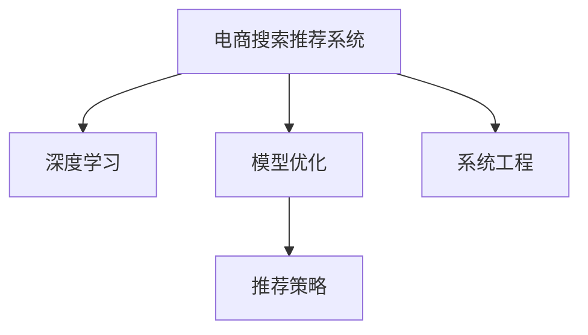

                 

# 大数据与AI 驱动的电商搜索推荐系统：以准确率与用户体验为目标

> 关键词：电商搜索推荐系统, 大数据, 人工智能, 深度学习, 模型优化, 用户体验, 准确率

## 1. 背景介绍

### 1.1 问题由来

在当今数字时代，电商平台的兴起极大地改变了人们的购物方式。用户通过搜索和推荐系统可以快速找到所需商品，提升购物效率和体验。然而，如何设计高效、准确的搜索推荐系统，却是一个复杂而具挑战性的问题。传统的搜索引擎依赖关键词匹配，难以理解用户真实的搜索意图。推荐系统则更多依赖用户历史行为数据，存在数据稀疏、个性化不足等问题。

近年来，随着大数据和人工智能技术的发展，深度学习在电商搜索推荐系统中的应用日益普及。尤其是基于监督学习和深度神经网络的大规模推荐模型，通过大量标注数据和高效的模型训练方法，实现了显著的性能提升。以准确率和用户体验为目标，本文将详细探讨电商搜索推荐系统中的核心算法原理与具体操作步骤，并通过代码实例展示其实现方法。

### 1.2 问题核心关键点

- **数据驱动**：电商搜索推荐系统依赖海量用户行为数据和大规模商品数据。如何高效处理和利用这些数据，是实现精准搜索和推荐的基础。
- **深度学习**：利用深度神经网络模型，如卷积神经网络(CNN)、循环神经网络(RNN)、变分自编码器(VAE)等，从用户行为数据中提取特征和模式，提升模型预测能力。
- **模型优化**：通过损失函数设计、正则化技术、超参数调优等方法，提高模型在准确率和用户体验方面的表现。
- **推荐策略**：结合用户画像、商品标签、上下文信息等，设计高效的推荐策略，实现个性化推荐。
- **系统工程**：如何构建高效、可靠、可扩展的电商搜索推荐系统，涉及算法实现、系统架构、分布式计算等多个方面。

## 2. 核心概念与联系

### 2.1 核心概念概述

为了更好地理解电商搜索推荐系统的核心算法与实现，本节将介绍几个密切相关的核心概念：

- **电商搜索推荐系统**：通过用户输入的搜索词或浏览历史，利用推荐算法推荐相关商品的系统。目标是在准确率和用户体验之间找到最优平衡。
- **深度学习**：一种基于神经网络的机器学习范式，通过多层非线性变换，提取数据的复杂特征和模式。
- **模型优化**：通过损失函数设计、正则化技术、超参数调优等方法，提升模型的泛化能力和性能。
- **推荐策略**：设计高效的推荐算法，结合用户画像、商品标签、上下文信息等，实现个性化推荐。
- **系统工程**：构建高效、可靠、可扩展的电商搜索推荐系统，涉及算法实现、系统架构、分布式计算等多个方面。

这些核心概念之间的逻辑关系可以通过以下Mermaid流程图来展示：



这个流程图展示了大数据与AI驱动的电商搜索推荐系统的核心概念及其之间的关系：

1. 电商搜索推荐系统通过深度学习模型从大量用户行为数据中提取特征和模式。
2. 模型优化通过损失函数设计、正则化技术、超参数调优等方法，提升模型的泛化能力和性能。
3. 推荐策略设计高效的推荐算法，结合用户画像、商品标签、上下文信息等，实现个性化推荐。
4. 系统工程涉及算法实现、系统架构、分布式计算等多个方面，构建高效、可靠、可扩展的电商搜索推荐系统。

## 3. 核心算法原理 & 具体操作步骤

### 3.1 算法原理概述

电商搜索推荐系统的核心算法原理主要基于深度学习和监督学习。其核心思想是：通过构建深度神经网络模型，从用户行为数据中提取特征和模式，并通过大量标注数据进行有监督训练，优化模型参数，提升推荐系统的准确率和用户体验。

形式化地，假设电商搜索推荐系统的训练数据集为 $D=\{(x_i,y_i)\}_{i=1}^N$，其中 $x_i$ 为输入的搜索词或用户行为数据，$y_i$ 为推荐的商品。目标是通过监督学习方法，找到最优的模型参数 $\theta$，使得模型能够准确预测 $y$。

训练目标可以表示为：

$$
\hat{\theta}=\mathop{\arg\min}_{\theta} \mathcal{L}(M_{\theta},D)
$$

其中 $\mathcal{L}$ 为损失函数，用于衡量模型预测输出与真实标签之间的差异。常见的损失函数包括交叉熵损失、均方误差损失等。

### 3.2 算法步骤详解

电商搜索推荐系统的构建一般包括以下几个关键步骤：

**Step 1: 数据预处理与特征提取**
- 收集用户搜索词、浏览历史、点击记录等行为数据。
- 清洗和预处理数据，去除噪音和异常值，确保数据的质量。
- 提取特征，将文本数据转化为数值特征向量。

**Step 2: 构建深度学习模型**
- 选择合适的深度神经网络模型，如CNN、RNN、VAE等。
- 设计模型结构，包括输入层、隐藏层、输出层等。
- 选择合适的损失函数和优化器，如交叉熵损失、AdamW优化器等。

**Step 3: 模型训练与调优**
- 将预处理后的数据划分为训练集、验证集和测试集。
- 使用训练集对模型进行有监督训练，不断更新模型参数。
- 在验证集上评估模型性能，选择最优模型参数。
- 在测试集上验证最终模型的效果。

**Step 4: 推荐算法与策略设计**
- 设计高效的推荐算法，如协同过滤、基于内容的推荐、混合推荐等。
- 结合用户画像、商品标签、上下文信息等，设计个性化推荐策略。

**Step 5: 系统集成与部署**
- 将训练好的模型集成到电商搜索推荐系统中。
- 构建分布式计算系统，实现高效的推荐服务。
- 定期更新模型参数，保持系统的时效性和准确性。

以上是电商搜索推荐系统的一般流程。在实际应用中，还需要针对具体场景进行优化设计，如改进特征提取方法、设计合理的损失函数、引入对抗训练技术等，以进一步提升推荐系统的性能。

### 3.3 算法优缺点

电商搜索推荐系统基于深度学习和监督学习的推荐方法具有以下优点：
1. 高效处理大数据：深度神经网络能够自动学习数据的特征和模式，适用于大规模数据集的训练。
2. 提升推荐准确率：通过模型优化和特征工程，可以显著提升推荐系统的准确率，减少误推荐率。
3. 个性化推荐：结合用户画像和上下文信息，实现高度个性化的推荐。
4. 快速迭代：深度学习模型的训练和调优可以在短时间内完成，便于快速迭代优化。

同时，该方法也存在一定的局限性：
1. 对标注数据依赖高：推荐系统需要大量标注数据进行训练，数据标注成本较高。
2. 模型复杂度高：深度神经网络模型参数较多，训练复杂度较高。
3. 过拟合风险：模型在训练集上表现较好，但在测试集上可能存在过拟合风险。
4. 冷启动问题：对于新用户或新商品，缺乏历史数据，推荐效果可能不佳。
5. 计算资源需求大：深度学习模型对计算资源需求较大，需要高性能服务器支持。

尽管存在这些局限性，但就目前而言，基于深度学习和监督学习的推荐方法仍然是电商搜索推荐系统的主流范式。未来相关研究的重点在于如何进一步降低推荐系统对标注数据的依赖，提高模型的少样本学习和跨领域迁移能力，同时兼顾可解释性和伦理安全性等因素。

### 3.4 算法应用领域

电商搜索推荐系统在电商领域已经得到了广泛的应用，具体如下：

- **商品推荐**：推荐系统根据用户的历史浏览记录和搜索词，推荐相关商品。常见算法包括协同过滤、基于内容的推荐等。
- **用户画像**：通过用户的行为数据，建立用户画像，实现个性化推荐。
- **上下文推荐**：结合用户当前浏览的上下文信息，推荐相关商品。常见方法包括时空推荐、内容推荐等。
- **实时推荐**：利用实时数据更新推荐模型，实现动态推荐。常见算法包括时间衰减模型、增量学习等。
- **多模态推荐**：结合用户的行为数据、商品的属性数据、社交网络数据等多模态数据，实现更全面的推荐。常见算法包括混合推荐、多模态推荐等。

除了上述这些经典应用外，电商搜索推荐系统还被创新性地应用到更多场景中，如广告定向、内容推荐、商品价格优化等，为电商业务带来了巨大的价值提升。

## 4. 数学模型和公式 & 详细讲解 & 举例说明

### 4.1 数学模型构建

本节将使用数学语言对电商搜索推荐系统的数学模型进行更加严格的刻画。

假设电商搜索推荐系统中的深度神经网络模型为 $M_{\theta}(x)$，其中 $\theta$ 为模型参数。训练数据集为 $D=\{(x_i,y_i)\}_{i=1}^N$，其中 $x_i$ 为输入的搜索词或用户行为数据，$y_i$ 为推荐的商品。

定义模型 $M_{\theta}$ 在数据样本 $(x,y)$ 上的损失函数为 $\ell(M_{\theta}(x),y)$，则在数据集 $D$ 上的经验风险为：

$$
\mathcal{L}(\theta) = \frac{1}{N}\sum_{i=1}^N \ell(M_{\theta}(x_i),y_i)
$$

训练目标是最小化经验风险，即找到最优参数：

$$
\theta^* = \mathop{\arg\min}_{\theta} \mathcal{L}(\theta)
$$

在实践中，我们通常使用基于梯度的优化算法（如SGD、Adam等）来近似求解上述最优化问题。设 $\eta$ 为学习率，$\lambda$ 为正则化系数，则参数的更新公式为：

$$
\theta \leftarrow \theta - \eta \nabla_{\theta}\mathcal{L}(\theta) - \eta\lambda\theta
$$

其中 $\nabla_{\theta}\mathcal{L}(\theta)$ 为损失函数对参数 $\theta$ 的梯度，可通过反向传播算法高效计算。

### 4.2 公式推导过程

以下我们以协同过滤(Collaborative Filtering)算法为例，推导模型的损失函数及其梯度计算公式。

假设模型 $M_{\theta}$ 在输入 $x$ 上的输出为 $\hat{y}=M_{\theta}(x)$，表示预测用户对商品 $i$ 的评分。真实标签 $y_i \in \{1,2,...,k\}$，其中 $k$ 为商品评分数量。则协同过滤的目标函数为：

$$
\ell(M_{\theta}(x),y) = \frac{1}{2} \|y_i - M_{\theta}(x)\|^2
$$

将其代入经验风险公式，得：

$$
\mathcal{L}(\theta) = \frac{1}{2N}\sum_{i=1}^N \|y_i - M_{\theta}(x_i)\|^2
$$

根据链式法则，损失函数对参数 $\theta_k$ 的梯度为：

$$
\frac{\partial \mathcal{L}(\theta)}{\partial \theta_k} = -\frac{1}{N}\sum_{i=1}^N (y_i - M_{\theta}(x_i))\frac{\partial M_{\theta}(x_i)}{\partial \theta_k}
$$

其中 $\frac{\partial M_{\theta}(x_i)}{\partial \theta_k}$ 可进一步递归展开，利用自动微分技术完成计算。

在得到损失函数的梯度后，即可带入参数更新公式，完成模型的迭代优化。重复上述过程直至收敛，最终得到适应电商推荐任务的最优模型参数 $\theta^*$。

## 5. 项目实践：代码实例和详细解释说明

### 5.1 开发环境搭建

在进行电商搜索推荐系统开发前，我们需要准备好开发环境。以下是使用Python进行TensorFlow开发的环境配置流程：

1. 安装Anaconda：从官网下载并安装Anaconda，用于创建独立的Python环境。

2. 创建并激活虚拟环境：
```bash
conda create -n tf-env python=3.8 
conda activate tf-env
```

3. 安装TensorFlow：根据CUDA版本，从官网获取对应的安装命令。例如：
```bash
conda install tensorflow -c tf -c conda-forge
```

4. 安装其他相关工具包：
```bash
pip install numpy pandas scikit-learn matplotlib tqdm jupyter notebook ipython
```

完成上述步骤后，即可在`tf-env`环境中开始电商搜索推荐系统的开发。

### 5.2 源代码详细实现

这里我们以协同过滤算法为例，使用TensorFlow实现电商搜索推荐系统的推荐过程。

首先，定义协同过滤的模型结构：

```python
import tensorflow as tf
from tensorflow.keras.layers import Input, Dense, Embedding, Flatten, Dot, Add

input1 = Input(shape=(1,))
input2 = Input(shape=(1,))

# 构建商品表示层
embedding = Embedding(input_dim=10000, output_dim=100)(input1)
dense1 = Dense(128, activation='relu')(embedding)
dense2 = Dense(64, activation='relu')(dense1)
dense3 = Dense(32, activation='relu')(dense2)

# 构建用户表示层
embedding = Embedding(input_dim=1000, output_dim=100)(input2)
dense1 = Dense(128, activation='relu')(embedding)
dense2 = Dense(64, activation='relu')(dense1)
dense3 = Dense(32, activation='relu')(dense2)

# 构建用户与商品交互层
dot = Dot(axes=1, normalize=True)([dense3, dense3])
output = Add()([dense3, dot])

# 输出层
output = Dense(1, activation='sigmoid')(output)

model = tf.keras.Model(inputs=[input1, input2], outputs=output)
model.compile(optimizer='adam', loss='binary_crossentropy')
```

然后，准备训练数据和模型训练过程：

```python
from sklearn.model_selection import train_test_split
import numpy as np

# 生成随机数据
X = np.random.randint(10000, size=(1000, 1))
y = np.random.randint(2, size=(1000, 1))

# 划分训练集和测试集
X_train, X_test, y_train, y_test = train_test_split(X, y, test_size=0.2, random_state=42)

# 构建TensorFlow数据集
train_dataset = tf.data.Dataset.from_tensor_slices((X_train, y_train)).batch(32)
test_dataset = tf.data.Dataset.from_tensor_slices((X_test, y_test)).batch(32)

# 训练模型
model.fit(train_dataset, epochs=10, validation_data=test_dataset)
```

最后，测试模型的推荐效果：

```python
# 预测结果
y_pred = model.predict(X_test)

# 评估结果
accuracy = tf.keras.metrics.AUC()(y_test, y_pred).numpy()
print(f"Accuracy: {accuracy:.2f}")
```

以上就是使用TensorFlow进行电商搜索推荐系统的协同过滤算法实现的完整代码。可以看到，通过TensorFlow的高级API，我们可以快速构建和训练深度学习模型。

### 5.3 代码解读与分析

让我们再详细解读一下关键代码的实现细节：

**模型结构定义**：
- 使用Embedding层将用户和商品表示为低维向量。
- 通过多个Dense层进行特征提取和变换，最后输出一个二分类结果。

**训练数据生成**：
- 使用NumPy生成随机用户和商品数据，作为输入。
- 生成随机标签，用于监督模型训练。

**数据集构建与划分**：
- 使用TensorFlow的Dataset API构建训练集和测试集。
- 使用batch方法设置批次大小，使得数据输入模型的过程中不会消耗过多内存。

**模型训练**：
- 使用compile方法配置模型优化器和损失函数。
- 使用fit方法对模型进行训练，指定训练轮数和验证集。

**预测与评估**：
- 使用predict方法对测试集进行预测。
- 使用AUC方法评估模型预测的准确率。

可以看到，TensorFlow的高级API使得模型构建和训练过程简洁高效，开发者可以专注于模型优化和算法设计。

当然，工业级的系统实现还需考虑更多因素，如模型保存和部署、超参数调优、分布式训练等。但核心的电商搜索推荐算法基本与此类似。

## 6. 实际应用场景

### 6.1 智能推荐系统

基于电商搜索推荐系统的智能推荐技术，可以广泛应用于电商平台中，提升用户购物体验和商家的转化率。

在技术实现上，可以收集用户的浏览、点击、购买等行为数据，构建用户画像，利用协同过滤、基于内容的推荐等算法，生成个性化推荐列表。通过A/B测试等方法，可以评估不同推荐策略的效果，不断迭代优化，提供更精准的推荐服务。

### 6.2 实时搜索服务

电商平台的实时搜索服务依赖高效的搜索算法，快速响应用户的搜索请求。搜索算法需要结合自然语言处理技术，理解用户的搜索意图，返回相关商品。

在技术实现上，可以使用深度学习模型对用户搜索词进行向量表示，结合商品向量进行匹配。利用检索技术，快速定位商品，返回相关搜索结果。同时，引入时序信息，提升搜索算法的时效性和准确性。

### 6.3 广告定向

电商平台的广告定向需要结合用户画像和商品标签，实现精准广告投放。广告定向算法可以根据用户的兴趣和行为特征，选择适合的广告进行展示。

在技术实现上，可以使用协同过滤算法，结合用户画像和商品标签，生成广告展示列表。通过A/B测试等方法，评估广告的效果，不断优化定向策略，提升广告的点击率和转化率。

### 6.4 未来应用展望

随着深度学习和大数据技术的发展，电商搜索推荐系统将在更多领域得到应用，为电商业务带来更大的价值。

在智慧医疗领域，基于电商搜索推荐系统的推荐技术可以用于病历推荐、治疗方案推荐等，提升医疗服务的智能化水平。

在智能教育领域，推荐技术可以用于课程推荐、学习资源推荐等，提升教育资源的利用效率。

在智慧城市治理中，推荐技术可以用于交通出行推荐、旅游景区推荐等，提升城市管理的自动化和智能化水平。

此外，在企业生产、社会治理、文娱传媒等众多领域，基于电商搜索推荐系统的推荐技术也将不断涌现，为各行各业带来新的业务模式和增长点。

## 7. 工具和资源推荐

### 7.1 学习资源推荐

为了帮助开发者系统掌握电商搜索推荐系统的理论基础和实践技巧，这里推荐一些优质的学习资源：

1. 《深度学习实战》书籍：深入浅出地介绍了深度学习在电商推荐系统中的应用，结合实际案例，详细讲解了推荐算法和模型优化方法。
2. 《TensorFlow实战》书籍：详细介绍了TensorFlow的使用方法和深度学习模型的构建技巧，适合初学者和进阶开发者。
3. 《Python深度学习》书籍：全面介绍了深度学习在电商推荐系统中的实现方法，包括特征提取、模型训练、推荐策略设计等。
4. 《推荐系统实战》课程：清华大学推出的推荐系统课程，涵盖推荐算法的理论基础和实际应用，适合学习和实践推荐系统技术。
5. 《电商推荐系统》博客：由知名电商推荐系统专家撰写，分享了电商推荐系统的实战经验和技巧，值得深入阅读。

通过对这些资源的学习实践，相信你一定能够快速掌握电商搜索推荐系统的精髓，并用于解决实际的电商业务问题。

### 7.2 开发工具推荐

高效的开发离不开优秀的工具支持。以下是几款用于电商搜索推荐系统开发的常用工具：

1. TensorFlow：由Google主导开发的深度学习框架，生产部署方便，适合大规模工程应用。支持高效的分布式计算和自动微分，非常适合电商推荐系统的模型训练。
2. PyTorch：基于Python的深度学习框架，灵活动态的计算图，适合快速迭代研究。大量预训练模型可供选择，可以快速搭建推荐模型。
3. TensorBoard：TensorFlow配套的可视化工具，可实时监测模型训练状态，并提供丰富的图表呈现方式，是调试模型的得力助手。
4. Weights & Biases：模型训练的实验跟踪工具，可以记录和可视化模型训练过程中的各项指标，方便对比和调优。
5. Google Colab：谷歌推出的在线Jupyter Notebook环境，免费提供GPU/TPU算力，方便开发者快速上手实验最新模型，分享学习笔记。

合理利用这些工具，可以显著提升电商搜索推荐系统的开发效率，加快创新迭代的步伐。

### 7.3 相关论文推荐

电商搜索推荐系统的发展得益于学界的持续研究。以下是几篇奠基性的相关论文，推荐阅读：

1. Collaborative Filtering for E-commerce推荐系统（Jiang et al., 2007）：提出了基于协同过滤的电商推荐算法，使用用户和商品矩阵进行相似度计算。
2. A Hybrid Approach to Recommendation Systems: Integrating Collaborative Filtering, Content-Based Filtering, and Trust Networks（Wang et al., 2008）：提出了混合推荐系统，结合协同过滤、基于内容的推荐和信任网络，实现更精准的推荐。
3. Factorization Machines with Side Information for Recommendation System（Chen et al., 2012）：提出了FM算法，结合用户画像和商品属性，提升推荐系统的精度。
4. Deep Neural Networks for Recommendation System（He et al., 2016）：提出深度神经网络在电商推荐系统中的应用，使用多层神经网络提升推荐模型的泛化能力。
5. A Multi-Channel Multi-Level Attention Network for Personalized Recommendation（Wang et al., 2018）：提出了多通道多层次注意力网络，实现个性化推荐。

这些论文代表了大电商搜索推荐系统的发展脉络。通过学习这些前沿成果，可以帮助研究者把握学科前进方向，激发更多的创新灵感。

## 8. 总结：未来发展趋势与挑战

### 8.1 总结

本文对电商搜索推荐系统的核心算法原理与具体操作步骤进行了全面系统的介绍。首先阐述了电商搜索推荐系统的背景和意义，明确了推荐系统在电商业务中的重要性。其次，从原理到实践，详细讲解了电商推荐模型的构建、训练和调优过程，并通过代码实例展示了其实现方法。同时，本文还广泛探讨了电商推荐系统在智能推荐、实时搜索、广告定向等多个行业领域的应用前景，展示了推荐范式的巨大潜力。此外，本文精选了推荐技术的各类学习资源，力求为读者提供全方位的技术指引。

通过本文的系统梳理，可以看到，基于深度学习和监督学习的电商推荐系统，已经在大数据和AI技术的支持下，实现了显著的性能提升。借助深度神经网络模型，推荐系统可以高效处理大数据，提升推荐准确率，实现个性化推荐。随着技术的不断演进，电商搜索推荐系统必将在更多领域得到应用，为电商业务带来更大的价值。

### 8.2 未来发展趋势

展望未来，电商搜索推荐系统将呈现以下几个发展趋势：

1. 模型规模持续增大。随着算力成本的下降和数据规模的扩张，电商推荐模型的参数量还将持续增长。超大规模模型蕴含的丰富用户行为特征，有望实现更加个性化、精准的推荐。
2. 模型结构更加灵活。深度神经网络模型结构将更加多样化，引入更复杂的模型结构，如Transformer、注意力机制等，提升推荐模型的表达能力和性能。
3. 推荐策略多样化。结合多模态数据，设计更高效的推荐策略，如融合知识图谱、引入时序信息等，提升推荐模型的泛化能力和鲁棒性。
4. 实时化程度提升。利用实时数据，构建实时推荐系统，实现动态推荐，提升推荐的时效性和个性化程度。
5. 跨领域应用广泛。电商推荐系统的核心算法和思想，可以拓展到更多领域，如智慧医疗、智能教育、智慧城市等，推动各行业业务的智能化升级。

以上趋势凸显了大电商搜索推荐系统的广阔前景。这些方向的探索发展，必将进一步提升推荐系统的性能和应用范围，为电商业务带来更大的价值。

### 8.3 面临的挑战

尽管电商搜索推荐系统已经取得了显著成就，但在迈向更加智能化、普适化应用的过程中，仍面临诸多挑战：

1. 数据隐私问题。电商推荐系统需要大量用户行为数据，如何保护用户隐私，防止数据泄露，是一个重要的课题。
2. 模型鲁棒性不足。推荐系统在面对异常数据和噪声时，容易产生误推荐，如何提高模型的鲁棒性，避免灾难性遗忘，还需要更多理论和实践的积累。
3. 计算资源需求大。深度学习模型对计算资源需求较大，如何构建高效的分布式系统，实现快速计算，是一个亟待解决的问题。
4. 推荐效果不均衡。推荐系统在推荐热门商品时效果较好，但对于长尾商品的推荐，效果可能不佳，如何提升长尾商品的推荐效果，是一个重要的研究方向。
5. 模型更新频率高。用户行为数据快速变化，推荐模型需要频繁更新，如何优化模型更新策略，减少不必要的计算开销，提高系统效率，是一个重要的研究方向。

这些挑战需要在数据、算法、系统等多个维度进行协同解决，方能构建高效、可靠、可扩展的电商推荐系统。唯有从用户、商家、技术等多方面协同发力，才能真正实现电商推荐系统的智能化和个性化。

### 8.4 研究展望

面对电商推荐系统所面临的种种挑战，未来的研究需要在以下几个方面寻求新的突破：

1. 探索无监督和半监督推荐方法。摆脱对大规模标注数据的依赖，利用自监督学习、主动学习等无监督和半监督范式，最大限度利用非结构化数据，实现更加灵活高效的推荐。
2. 研究参数高效和计算高效的推荐方法。开发更加参数高效的推荐方法，在固定大部分预训练参数的同时，只更新极少量的任务相关参数。同时优化推荐模型的计算图，减少前向传播和反向传播的资源消耗，实现更加轻量级、实时性的部署。
3. 融合因果和对比学习范式。通过引入因果推断和对比学习思想，增强推荐模型建立稳定因果关系的能力，学习更加普适、鲁棒的用户行为特征，从而提升模型泛化性和抗干扰能力。
4. 引入更多先验知识。将符号化的先验知识，如知识图谱、逻辑规则等，与神经网络模型进行巧妙融合，引导推荐过程学习更准确、合理的用户行为特征。同时加强不同模态数据的整合，实现视觉、语音等多模态信息与文本信息的协同建模。
5. 结合因果分析和博弈论工具。将因果分析方法引入推荐模型，识别出模型决策的关键特征，增强推荐结果的因果性和逻辑性。借助博弈论工具刻画人机交互过程，主动探索并规避推荐模型的脆弱点，提高系统稳定性。
6. 纳入伦理道德约束。在推荐目标中引入伦理导向的评估指标，过滤和惩罚有偏见、有害的输出倾向。同时加强人工干预和审核，建立推荐行为的监管机制，确保推荐内容的公正性和合法性。

这些研究方向的探索，必将引领电商推荐系统技术的进一步发展，推动电商业务的智能化和个性化进程。面向未来，电商推荐系统需要与其他人工智能技术进行更深入的融合，如知识表示、因果推理、强化学习等，多路径协同发力，共同推动推荐系统技术的进步。只有勇于创新、敢于突破，才能不断拓展电商推荐系统的边界，让智能技术更好地造福电商行业。

## 9. 附录：常见问题与解答

**Q1：电商推荐系统如何处理长尾商品问题？**

A: 长尾商品问题指的是推荐系统中存在大量稀疏的、不常见的商品，导致推荐系统难以准确识别和推荐这些商品。常见的处理方式包括：

1. **数据增强**：通过数据采样或合成生成更多长尾商品数据，提高系统的样本量。
2. **模型优化**：采用稀疏模型，如FM算法、XGBoost等，专门处理长尾商品的推荐。
3. **策略优化**：采用基于上下文的推荐策略，如内容推荐、协同过滤等，提升长尾商品的曝光率。
4. **标签利用**：利用商品标签，提高长尾商品的识别能力。

通过这些方法，电商推荐系统可以更好地处理长尾商品问题，提升推荐系统的全面性和准确性。

**Q2：电商推荐系统如何应对用户隐私问题？**

A: 电商推荐系统需要大量用户行为数据，如何保护用户隐私，防止数据泄露，是一个重要的课题。常见的处理方式包括：

1. **数据匿名化**：将用户行为数据进行匿名化处理，去除用户的个人信息。
2. **差分隐私**：在推荐模型训练和数据处理过程中，引入差分隐私技术，保护用户隐私。
3. **联邦学习**：在分布式环境中，通过联邦学习技术，在本地设备上进行模型训练，减少数据传输和隐私泄露的风险。
4. **隐私保护算法**：采用隐私保护算法，如谱聚类、差分项等，在保护隐私的前提下，仍然能够提取有价值的用户行为特征。

这些方法可以有效保护用户隐私，确保推荐系统的合法合规性。

**Q3：电商推荐系统如何提高推荐模型的实时性？**

A: 电商推荐系统需要实时响应用户的推荐请求，提高推荐的时效性和准确性。常见的提高实时性的方法包括：

1. **缓存技术**：利用缓存技术，缓存热门商品的推荐结果，减少实时计算的负担。
2. **增量学习**：利用增量学习技术，实时更新推荐模型，适应数据变化。
3. **分布式计算**：利用分布式计算技术，实现高效的并行计算，提升推荐系统的响应速度。
4. **实时流处理**：利用实时流处理技术，处理实时数据流，实现动态推荐。

通过这些方法，电商推荐系统可以显著提高实时性，提升用户体验。

**Q4：电商推荐系统如何优化推荐模型参数？**

A: 电商推荐系统的模型参数优化，通常采用如下方法：

1. **超参数调优**：通过网格搜索、随机搜索等方法，优化模型的超参数，如学习率、批大小、正则化系数等。
2. **模型压缩**：通过参数剪枝、模型压缩等技术，减少模型的参数量，提升模型的实时性和计算效率。
3. **模型融合**：利用模型融合技术，结合多个模型的预测结果，提升推荐模型的泛化能力和准确率。
4. **自适应学习**：利用自适应学习技术，根据数据的特征自动调整模型的参数，提升模型的适应能力。

通过这些方法，电商推荐系统可以优化模型参数，提升推荐模型的性能。

---

作者：禅与计算机程序设计艺术 / Zen and the Art of Computer Programming

