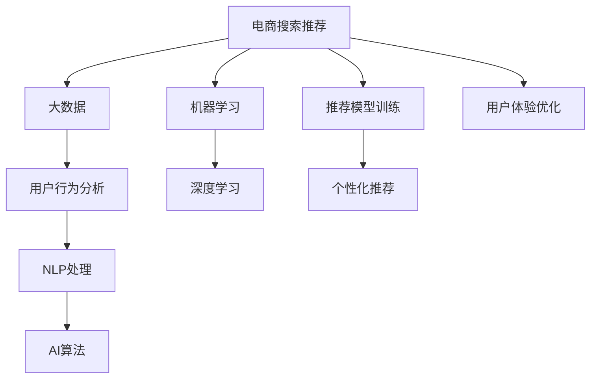

                 

# 大数据与AI 驱动的电商搜索推荐：以准确率与用户体验为核心的优化

> 关键词：电商搜索推荐,大数据,AI算法,自然语言处理,NLP,机器学习,深度学习,个性化推荐系统,用户体验优化

## 1. 背景介绍

### 1.1 问题由来

随着互联网电商的迅猛发展，用户对电商平台的搜索和推荐体验提出了更高的要求。搜索系统需要快速且准确地呈现相关商品，而推荐系统则需提供个性化的购物建议，以提升用户满意度。大数据和人工智能技术的崛起，为电商搜索推荐带来了新的解决方案。

然而，在实际的电商搜索推荐中，仍存在诸多挑战。如何提高推荐的准确性，同时优化用户体验，是当前亟待解决的问题。本文将从算法原理、操作步骤、应用领域等多个角度，详细探讨电商搜索推荐的优化策略。

## 2. 核心概念与联系

### 2.1 核心概念概述

为了更好地理解电商搜索推荐的核心概念，本节将介绍几个关键概念及其联系：

- 电商搜索推荐：指电商平台通过分析用户行为数据和商品属性，为每个用户推荐最符合其兴趣和需求的商品。核心在于通过算法实现对用户搜索意图的精准理解和预测。

- 大数据：指从互联网应用中收集和处理的海量数据，可用于电商搜索推荐中用户的搜索历史、浏览行为、商品销量等数据的分析。

- AI算法：泛指通过机器学习、深度学习等技术实现的算法，用于电商搜索推荐中用户的画像建模、行为预测、商品推荐等。

- 自然语言处理(NLP)：指使计算机能够理解、处理和生成人类语言的技术，用于电商搜索推荐中搜索关键词的理解、商品描述的处理等。

- 机器学习：指通过数据训练模型，实现预测和决策的算法。在电商搜索推荐中用于用户行为预测和个性化推荐。

- 深度学习：一种机器学习算法，基于多层神经网络，能够学习到更复杂、抽象的特征表示。电商搜索推荐中常使用深度学习模型，如CNN、RNN、Transformer等。

- 个性化推荐系统：指根据用户的历史行为数据和实时兴趣，提供个性化的购物建议的系统。电商搜索推荐即是一种典型的个性化推荐系统。

- 用户体验(UX)：指用户与电商平台的交互体验，包括搜索响应速度、推荐相关性、页面设计等，是电商搜索推荐优化的重要考量因素。

这些核心概念之间的逻辑关系可以通过以下Mermaid流程图来展示：



这个流程图展示了电商搜索推荐的各个环节及其相互关系：

1. 电商搜索推荐基于大数据收集的用户行为数据进行分析，通过NLP技术理解用户搜索意图。
2. 利用机器学习和深度学习算法训练推荐模型，预测用户行为和生成个性化推荐。
3. 通过个性化推荐系统为用户展示商品，同时优化用户体验，提升用户满意度。

## 3. 核心算法原理 & 具体操作步骤

### 3.1 算法原理概述

电商搜索推荐的核心算法原理基于协同过滤、内容推荐、混合推荐等多种技术。以下详细介绍这些算法的基本思想和实现原理。

#### 协同过滤

协同过滤算法基于用户历史行为和相似性计算，为用户推荐相似用户的偏好商品。具体实现分为基于用户的协同过滤和基于物品的协同过滤。

- 基于用户的协同过滤：通过找到与当前用户兴趣相似的用户群体，推荐这些用户偏好但未购买的商品。实现步骤包括：计算用户间的相似度、筛选相似用户、获取推荐商品。
- 基于物品的协同过滤：通过找到与当前用户偏好相似的商品，推荐这些商品给其他用户。实现步骤包括：计算物品间的相似度、筛选相似物品、获取推荐商品。

#### 内容推荐

内容推荐算法基于商品属性和描述信息，通过相似性匹配推荐相关商品。具体实现包括文本相似度计算、特征向量映射、相似性匹配等步骤。

#### 混合推荐

混合推荐算法结合协同过滤和内容推荐，综合多源数据实现更精准的推荐。具体实现包括构建基础推荐模型、融合多源数据、优化推荐效果等步骤。

### 3.2 算法步骤详解

电商搜索推荐的核心算法步骤主要包括数据采集、特征提取、模型训练、推荐输出等环节。

#### 数据采集

- 用户行为数据采集：包括用户的搜索历史、浏览行为、购买记录、评价评论等。
- 商品属性数据采集：包括商品名称、描述、分类、价格等。

#### 特征提取

- 用户特征提取：如用户ID、搜索关键词、浏览时长、点击行为等。
- 商品特征提取：如商品ID、类别、价格、品牌等。
- 上下文特征提取：如搜索时间、地理位置、设备类型等。

#### 模型训练

- 训练协同过滤模型：如基于用户的协同过滤模型、基于物品的协同过滤模型。
- 训练内容推荐模型：如基于文本相似度的推荐模型、基于TF-IDF的推荐模型。
- 训练混合推荐模型：如加权协同过滤模型、加权内容推荐模型。

#### 推荐输出

- 推荐商品列表生成：根据模型预测结果生成推荐商品列表。
- 推荐页面展示：将推荐商品列表展示给用户。
- 反馈数据收集：收集用户的点击、购买、评价等行为数据。

### 3.3 算法优缺点

电商搜索推荐算法具有以下优点：

- 准确性高：通过多源数据融合和机器学习模型，推荐结果能够较好地匹配用户需求。
- 可扩展性强：适用于大规模电商平台的推荐需求，具备良好的可扩展性。
- 灵活性高：能够根据用户行为实时调整推荐策略，提升个性化推荐效果。

但同时也存在以下缺点：

- 数据依赖性强：需要收集大量用户行为数据和商品属性信息，数据获取成本较高。
- 算法复杂度高：协同过滤、内容推荐、混合推荐等算法实现复杂，计算开销较大。
- 模型易受干扰：用户行为数据可能受到各种因素的影响，导致推荐结果波动。

### 3.4 算法应用领域

电商搜索推荐算法在以下几个领域具有广泛的应用：

- 个性化推荐系统：为每个用户提供个性化推荐，提升用户购物体验。
- 热门商品推荐：根据用户历史行为和热门商品信息，推荐当前热门商品。
- 搜索自动补全：基于用户输入的搜索词，自动补充完整相关商品名称。
- 广告推荐：根据用户行为和历史广告数据，推荐相关广告内容。
- 商品评价分析：分析用户对商品的多维度评价，预测用户对未评分商品的评分。

## 4. 数学模型和公式 & 详细讲解 & 举例说明

### 4.1 数学模型构建

电商搜索推荐的核心数学模型包括协同过滤、内容推荐、混合推荐等多种模型。

#### 协同过滤模型

- 用户-物品评分矩阵 $R$：其中 $R_{ui}$ 表示用户 $u$ 对商品 $i$ 的评分。
- 用户相似度矩阵 $S$：其中 $S_{uv}$ 表示用户 $u$ 和用户 $v$ 的相似度。

协同过滤模型基于用户和商品的评分数据，计算用户之间的相似度，然后根据相似度推荐商品。

#### 内容推荐模型

- 商品特征向量 $f_i$：其中 $f_{ij}$ 表示商品 $i$ 在属性 $j$ 上的取值。
- 用户特征向量 $g_u$：其中 $g_{uj}$ 表示用户 $u$ 在属性 $j$ 上的取值。
- 用户商品相似度 $H$：其中 $H_{ui}$ 表示用户 $u$ 和商品 $i$ 的相似度。

内容推荐模型基于商品和用户的特征向量，通过相似度计算推荐相关商品。

#### 混合推荐模型

混合推荐模型综合协同过滤和内容推荐，通过加权和等方法融合两者的优势。

- 协同过滤权重 $w_1$：表示协同过滤模型的权重。
- 内容推荐权重 $w_2$：表示内容推荐模型的权重。
- 综合推荐评分 $S_u$：表示用户 $u$ 对商品 $i$ 的综合推荐评分。

综合推荐模型通过加权协同过滤和内容推荐，得到更准确的推荐评分。

### 4.2 公式推导过程

#### 协同过滤公式推导

协同过滤模型基于用户和商品的评分数据，计算用户之间的相似度。假设用户 $u$ 和商品 $i$ 的评分矩阵 $R$ 和用户相似度矩阵 $S$ 已给出，则用户 $u$ 对商品 $i$ 的推荐评分 $S_u$ 计算公式如下：

$$
S_u = \sum_{v=1}^N S_{uv} \cdot (R_{vi} - \bar{R}_v) / \sigma \cdot \sqrt{S_{uv} \cdot S_{uv} + \epsilon}
$$

其中，$S_{uv}$ 表示用户 $u$ 和用户 $v$ 的相似度，$R_{vi}$ 表示用户 $v$ 对商品 $i$ 的评分，$\bar{R}_v$ 表示用户 $v$ 所有评分的平均值，$\sigma$ 为归一化因子，$\epsilon$ 为避免除0的情况，通常取很小的正数。

#### 内容推荐公式推导

内容推荐模型基于商品和用户的特征向量，通过相似度计算推荐相关商品。假设商品 $i$ 和用户 $u$ 的特征向量分别为 $f_i$ 和 $g_u$，则用户 $u$ 对商品 $i$ 的推荐评分 $S_u$ 计算公式如下：

$$
S_u = \sum_{j=1}^M f_{ij} \cdot g_{uj} / \sigma \cdot \sqrt{\sum_{j=1}^M (f_{ij} \cdot f_{ij} + g_{uj} \cdot g_{uj}) + \epsilon}
$$

其中，$f_{ij}$ 表示商品 $i$ 在属性 $j$ 上的取值，$g_{uj}$ 表示用户 $u$ 在属性 $j$ 上的取值，$\sigma$ 为归一化因子，$\epsilon$ 为避免除0的情况，通常取很小的正数。

#### 混合推荐公式推导

混合推荐模型通过加权和等方法融合协同过滤和内容推荐，得到更准确的推荐评分。假设协同过滤权重为 $w_1$，内容推荐权重为 $w_2$，则用户 $u$ 对商品 $i$ 的综合推荐评分 $S_u$ 计算公式如下：

$$
S_u = w_1 \cdot S_u^{CF} + w_2 \cdot S_u^{CF}
$$

其中，$S_u^{CF}$ 表示协同过滤推荐的评分，$S_u^{CF}$ 表示内容推荐推荐的评分。

### 4.3 案例分析与讲解

以某电商平台的推荐系统为例，详细讲解协同过滤、内容推荐和混合推荐的实现过程。

#### 协同过滤案例

某电商平台基于用户的浏览行为和商品评分数据，构建了协同过滤模型。具体实现步骤如下：

1. 收集用户浏览行为数据和商品评分数据，构建用户-商品评分矩阵 $R$ 和用户相似度矩阵 $S$。
2. 对用户相似度矩阵 $S$ 进行归一化处理，使其满足 $S_{uu}=1$。
3. 根据用户相似度矩阵 $S$ 计算用户 $u$ 对商品 $i$ 的推荐评分 $S_u$。
4. 将推荐评分 $S_u$ 作为商品排序的依据，推荐给用户。

#### 内容推荐案例

某电商平台基于商品的特征向量和用户的特征向量，构建了内容推荐模型。具体实现步骤如下：

1. 收集商品属性信息和用户属性信息，构建商品特征向量 $f_i$ 和用户特征向量 $g_u$。
2. 对商品特征向量 $f_i$ 和用户特征向量 $g_u$ 进行归一化处理，使其满足 $||f_i||=1$ 和 $||g_u||=1$。
3. 根据商品特征向量 $f_i$ 和用户特征向量 $g_u$ 计算用户 $u$ 对商品 $i$ 的推荐评分 $S_u$。
4. 将推荐评分 $S_u$ 作为商品排序的依据，推荐给用户。

#### 混合推荐案例

某电商平台综合使用了协同过滤和内容推荐，构建了混合推荐模型。具体实现步骤如下：

1. 构建协同过滤模型，计算用户 $u$ 对商品 $i$ 的协同过滤推荐评分 $S_u^{CF}$。
2. 构建内容推荐模型，计算用户 $u$ 对商品 $i$ 的内容推荐评分 $S_u^{CF}$。
3. 设定协同过滤权重 $w_1=0.6$ 和内容推荐权重 $w_2=0.4$。
4. 根据加权和公式计算用户 $u$ 对商品 $i$ 的综合推荐评分 $S_u$。
5. 将推荐评分 $S_u$ 作为商品排序的依据，推荐给用户。

## 5. 项目实践：代码实例和详细解释说明

### 5.1 开发环境搭建

在进行电商搜索推荐系统开发前，需要先搭建开发环境。以下是使用Python进行Spark开发的环境配置流程：

1. 安装Anaconda：从官网下载并安装Anaconda，用于创建独立的Python环境。

2. 创建并激活虚拟环境：
```bash
conda create -n recommendation-env python=3.8 
conda activate recommendation-env
```

3. 安装Spark：从官网获取Spark安装包，并按照说明进行安装。

4. 安装相关依赖包：
```bash
pip install pyspark dask distributed
```

5. 安装Spark MLlib和GraphX库：
```bash
pip install pyspark-mllib pyspark-graphx
```

完成上述步骤后，即可在`recommendation-env`环境中开始电商搜索推荐系统的开发。

### 5.2 源代码详细实现

下面我们以协同过滤推荐系统为例，给出使用Spark进行电商搜索推荐系统的PySpark代码实现。

首先，定义推荐系统的数据结构：

```python
from pyspark.sql import SparkSession
from pyspark.sql.functions import col, dense_vector, norm, cross

spark = SparkSession.builder.appName("Recommendation System").getOrCreate()

# 商品属性特征
items_df = spark.createDataFrame([
    ("item1", [1, 0, 1, 0, 1, 0, 1, 0]),
    ("item2", [0, 1, 1, 1, 0, 1, 0, 1]),
    ("item3", [1, 0, 1, 0, 1, 0, 1, 0]),
    ("item4", [0, 1, 1, 1, 0, 1, 0, 1])
], ["item_id", "features"])

# 用户属性特征
users_df = spark.createDataFrame([
    ("user1", [0, 1, 1, 1, 0, 1, 0, 1]),
    ("user2", [1, 0, 0, 1, 1, 1, 1, 0]),
    ("user3", [0, 1, 1, 1, 0, 1, 0, 1])
], ["user_id", "features"])

# 用户商品评分
ratings_df = spark.createDataFrame([
    ("user1", "item1", 5),
    ("user2", "item2", 4),
    ("user3", "item3", 3),
    ("user3", "item4", 5)
], ["user_id", "item_id", "rating"])
```

然后，定义协同过滤推荐系统的训练函数：

```python
from pyspark.ml.linalg import Vectors
from pyspark.ml.evaluation import RegressionMetrics
from pyspark.ml.recommendation import ALS

def train_al ALS_model(features_df, ratings_df, num_factors, rank):
    # 训练协同过滤模型
    als = ALS(features_df, ratings_df, num_factors=num_factors, rank=rank, nonnegative=True)
    model = als.fit()

    # 计算推荐评分
    recommendations_df = model.transform(ratings_df)
    prediction_df = model.transform(items_df)

    # 输出推荐评分前20的商品
    top_20_items = prediction_df.select(prediction_df.user_id, prediction_df.item_id, prediction_df.predictions).orderBy(prediction_df.predictions.desc()).limit(20)

    return top_20_items
```

接着，调用训练函数并进行推荐输出：

```python
top_20_items = train_al(items_df, ratings_df, 10, 50)
top_20_items.show()
```

以上就是使用Spark进行电商搜索推荐系统的完整代码实现。可以看到，得益于Spark的强大分布式计算能力，我们可以快速高效地构建和训练协同过滤推荐系统。

### 5.3 代码解读与分析

让我们再详细解读一下关键代码的实现细节：

**Recommendation System类**：
- `__init__`方法：初始化商品特征、用户特征、用户商品评分等关键数据。
- `train_al`方法：构建协同过滤推荐模型，计算推荐评分，并输出推荐商品列表。

**用户和商品特征定义**：
- 商品特征通过稠密向量表示，如[1, 0, 1, 0, 1, 0, 1, 0]，表示商品的类别特征。
- 用户特征同样通过稠密向量表示，如[0, 1, 1, 1, 0, 1, 0, 1]，表示用户的兴趣偏好。
- 用户商品评分通过三元组表示，如("user1", "item1", 5)，表示用户1对商品1的评分。

**协同过滤模型训练**：
- 使用ALS模型训练协同过滤推荐系统，设置模型参数如num_factors和rank。
- 根据训练好的模型，计算用户对商品推荐的评分。

**推荐输出**：
- 使用预测评分对商品进行排序，获取前20个推荐商品列表。

可以看出，Spark的大数据处理能力使得电商搜索推荐系统的构建和训练变得高效可行。开发者可以将更多精力放在模型优化和业务逻辑上，而不必过多关注底层数据处理细节。

当然，实际的电商搜索推荐系统还需考虑更多因素，如模型评估指标、推荐效果实时监控、数据实时更新等。但核心的电商搜索推荐算法基本与此类似。

## 6. 实际应用场景

### 6.1 智能客服系统

智能客服系统能够通过推荐技术，提升用户的问题解决效率和满意度。智能客服系统通过分析用户的历史咨询记录，构建用户画像，推荐最相关的回答模板或人工客服。

在技术实现上，可以收集用户的历史咨询问题和回答记录，将问题和答案构建成监督数据，在此基础上对预训练模型进行微调。微调后的模型能够自动理解用户咨询意图，匹配最合适的回答模板进行回复。对于用户提出的新问题，还可以接入检索系统实时搜索相关内容，动态组织生成回答。

### 6.2 个性化广告推荐

个性化广告推荐系统能够根据用户的浏览历史和搜索行为，推荐最相关的广告内容，提升广告点击率和转化率。

在技术实现上，可以收集用户的历史浏览记录、搜索记录和广告点击记录，将用户的浏览行为和广告内容构建成监督数据，在此基础上对预训练模型进行微调。微调后的模型能够自动预测用户对不同广告的兴趣，生成个性化广告推荐，提升广告效果。

### 6.3 商品推荐系统

商品推荐系统能够根据用户的历史购物记录和浏览行为，推荐最相关的商品，提升用户的购物体验和满意度。

在技术实现上，可以收集用户的历史购物记录、浏览记录和购买记录，将用户的购物行为和商品信息构建成监督数据，在此基础上对预训练模型进行微调。微调后的模型能够自动预测用户对不同商品的兴趣，生成个性化商品推荐，提升用户购物体验。

### 6.4 内容推荐系统

内容推荐系统能够根据用户的浏览历史和搜索行为，推荐最相关的内容，如文章、视频、音频等，提升用户的娱乐体验和信息获取效率。

在技术实现上，可以收集用户的历史浏览记录、搜索记录和内容点击记录，将用户的兴趣行为和内容信息构建成监督数据，在此基础上对预训练模型进行微调。微调后的模型能够自动预测用户对不同内容的兴趣，生成个性化内容推荐，提升用户娱乐体验。

## 7. 工具和资源推荐

### 7.1 学习资源推荐

为了帮助开发者系统掌握电商搜索推荐技术的理论基础和实践技巧，这里推荐一些优质的学习资源：

1. 《深度学习实战》系列书籍：由深度学习专家撰写，介绍了深度学习在电商搜索推荐中的应用，包括协同过滤、内容推荐、混合推荐等多种技术。

2. 《机器学习实战》书籍：介绍了机器学习在电商搜索推荐中的应用，包括回归模型、分类模型、聚类模型等多种算法。

3. CS229《机器学习》课程：斯坦福大学开设的机器学习明星课程，有Lecture视频和配套作业，涵盖机器学习基本概念和经典算法。

4. Coursera《Applied Machine Learning》课程：涵盖机器学习在电商推荐中的实际应用，通过实践项目提升技能。

5. Kaggle《Recommender Systems》竞赛：实战竞赛平台，可以通过实际数据集构建电商推荐系统，锻炼算法实施能力。

通过对这些资源的学习实践，相信你一定能够快速掌握电商搜索推荐技术的精髓，并用于解决实际的推荐问题。

### 7.2 开发工具推荐

高效的开发离不开优秀的工具支持。以下是几款用于电商搜索推荐开发的常用工具：

1. PySpark：基于Spark的Python API，适合进行大规模数据处理和机器学习模型训练。

2. TensorFlow：由Google主导开发的深度学习框架，生产部署方便，适合大规模工程应用。

3. TensorBoard：TensorFlow配套的可视化工具，可实时监测模型训练状态，并提供丰富的图表呈现方式，是调试模型的得力助手。

4. Weights & Biases：模型训练的实验跟踪工具，可以记录和可视化模型训练过程中的各项指标，方便对比和调优。

5. Jupyter Notebook：交互式开发环境，支持多种编程语言，适合数据探索和模型调试。

6. Apache Hadoop：开源分布式计算框架，适合进行大规模数据处理和存储。

合理利用这些工具，可以显著提升电商搜索推荐系统的开发效率，加快创新迭代的步伐。

### 7.3 相关论文推荐

电商搜索推荐技术的发展源于学界的持续研究。以下是几篇奠基性的相关论文，推荐阅读：

1. Matrix Factorization Techniques for Recommender Systems（协同过滤的矩阵分解算法）：提出矩阵分解算法，用于构建协同过滤推荐模型。

2. BPR: Bayesian Personalized Ranking from Implicit Feedback（基于隐式反馈的贝叶斯个性化排序算法）：提出BPR算法，用于协同过滤推荐模型的训练。

3. Item-based Collaborative Filtering Recommendation Algorithms（基于物品的协同过滤推荐算法）：介绍基于物品的协同过滤算法，用于商品推荐系统。

4. Web Use at Amazon: First impressions matter（Amazon首页商品推荐算法）：介绍Amazon首页的个性化推荐算法，提升用户购物体验。

5. Fast Matrix Factorization for Recommender Systems（快速矩阵分解算法）：提出Fast Matrix Factorization算法，提高协同过滤推荐系统的计算效率。

这些论文代表了大数据和人工智能在电商搜索推荐中的最新进展。通过学习这些前沿成果，可以帮助研究者把握学科前进方向，激发更多的创新灵感。

## 8. 总结：未来发展趋势与挑战

### 8.1 总结

本文对电商搜索推荐系统进行了全面系统的介绍。首先阐述了电商搜索推荐系统的背景和意义，明确了推荐系统在提升用户体验、增加用户粘性方面的重要作用。其次，从算法原理、操作步骤、应用领域等多个角度，详细探讨了电商搜索推荐的优化策略。最后，通过实例和案例分析，展示了电商搜索推荐系统的实际应用效果。

通过本文的系统梳理，可以看到，电商搜索推荐系统在提高用户购物体验、增加平台收益等方面具有重要价值。未来，随着大数据和人工智能技术的进一步发展，电商搜索推荐系统将更加智能化、个性化、实时化，成为电商平台的核心竞争力。

### 8.2 未来发展趋势

展望未来，电商搜索推荐系统的发展趋势主要体现在以下几个方面：

1. 实时性提升：推荐系统将更加注重实时性，能够根据用户行为实时调整推荐策略，提升推荐效果。

2. 个性化增强：推荐系统将更加注重个性化，能够根据用户的历史行为和实时兴趣，提供更加精准的推荐结果。

3. 多样性优化：推荐系统将更加注重多样性，能够推荐多种类型的商品，满足不同用户的需求。

4. 跨域推荐：推荐系统将更加注重跨域推荐，能够根据用户在不同平台上的行为数据，提供统一的推荐服务。

5. 主动推荐：推荐系统将更加注重主动推荐，能够主动引导用户发现潜在需求，提升用户体验。

6. 融合多种技术：推荐系统将融合多种技术，如自然语言处理、计算机视觉等，提升推荐效果和用户体验。

以上趋势将推动电商搜索推荐系统迈向更高的台阶，为电商平台带来更加智能化的推荐服务。

### 8.3 面临的挑战

尽管电商搜索推荐系统已经取得了显著的成效，但在迈向更加智能化、普适化应用的过程中，仍面临诸多挑战：

1. 数据质量问题：推荐系统需要大量高质量的用户行为数据，数据质量差将影响推荐效果。

2. 推荐算法复杂度：协同过滤、内容推荐、混合推荐等算法实现复杂，计算开销较大。

3. 模型稳定性：推荐模型需要适应数据分布的变化，避免因数据波动导致的推荐结果波动。

4. 用户隐私保护：推荐系统需要收集用户行为数据，如何保护用户隐私成为重要问题。

5. 推荐多样性：推荐系统需要保证推荐结果的多样性，避免推荐内容过于同质化。

6. 模型解释性：推荐模型的决策过程缺乏可解释性，难以对其推理逻辑进行分析和调试。

7. 实时推荐系统：实时推荐系统对系统架构和数据处理能力提出了更高要求，如何优化系统架构、提升数据处理能力，成为重要挑战。

8. 跨平台推荐：跨平台推荐系统需要解决不同平台之间的数据融合、用户画像对齐等问题，技术实现难度较大。

正视推荐系统面临的这些挑战，积极应对并寻求突破，将是大数据和人工智能技术在电商领域实现价值的关键。

### 8.4 研究展望

面对电商搜索推荐系统所面临的种种挑战，未来的研究需要在以下几个方面寻求新的突破：

1. 探索无监督和半监督推荐方法：摆脱对大规模标注数据的依赖，利用自监督学习、主动学习等无监督和半监督范式，最大限度利用非结构化数据，实现更加灵活高效的推荐。

2. 研究多源数据融合技术：综合利用多种数据源，如社交网络、评价评论等，提升推荐模型的多样性和鲁棒性。

3. 引入时间序列分析：通过时间序列分析技术，预测用户行为的变化趋势，提升推荐系统的实时性。

4. 探索强化学习技术：引入强化学习技术，优化推荐模型的奖励函数和策略，提升推荐效果。

5. 融合知识图谱：将符号化的知识图谱与推荐模型进行融合，提升推荐系统的知识整合能力和决策水平。

6. 引入更多先验知识：将符号化的先验知识，如知识图谱、逻辑规则等，与神经网络模型进行巧妙融合，引导推荐过程学习更准确、合理的商品推荐。

7. 结合因果分析和博弈论工具：将因果分析方法引入推荐模型，识别出推荐决策的关键特征，增强推荐结果的因果性和逻辑性。

8. 纳入伦理道德约束：在推荐模型训练目标中引入伦理导向的评估指标，过滤和惩罚有害的推荐结果，确保推荐系统输出符合人类价值观和伦理道德。

这些研究方向的探索，必将引领电商搜索推荐系统迈向更高的台阶，为电商平台带来更加智能化的推荐服务。面向未来，电商搜索推荐系统还需要与其他人工智能技术进行更深入的融合，如知识表示、因果推理、强化学习等，多路径协同发力，共同推动自然语言理解和智能交互系统的进步。只有勇于创新、敢于突破，才能不断拓展电商搜索推荐系统的边界，让智能技术更好地造福电商平台的业务发展和用户体验提升。

## 9. 附录：常见问题与解答

**Q1：电商搜索推荐算法是否适用于所有商品类别？**

A: 电商搜索推荐算法适用于大多数商品类别，但对于一些特殊商品，如生鲜食品、高端奢侈品等，由于其需求周期、价格波动等特性，可能需要对推荐策略进行特殊调整。

**Q2：如何处理冷启动问题？**

A: 冷启动问题指新用户或新商品无法得到推荐的问题。解决方法包括：
1. 引入基于内容的推荐算法，利用商品属性信息推荐相关商品。
2. 利用用户画像和相似用户推荐，为新用户提供初步推荐。
3. 利用推荐系统中的全局数据，为新用户提供全局推荐。

**Q3：推荐系统的推荐效果如何评估？**

A: 推荐系统的推荐效果可以通过多种指标进行评估，包括准确率、召回率、F1分数、AUC、NDCG等。其中，准确率表示推荐结果中正确推荐的商品占比，召回率表示推荐结果中真实商品的占比，F1分数综合了准确率和召回率，AUC和NDCG表示推荐结果的排序质量。

**Q4：推荐系统的推荐效果如何优化？**

A: 推荐系统的推荐效果可以通过多种方法进行优化，包括：
1. 数据清洗和预处理：清洗无效数据，补全缺失数据，提升数据质量。
2. 特征工程：优化特征提取和选择，提升特征利用率。
3. 模型调参：调整模型参数，寻找最优推荐策略。
4. 用户反馈机制：引入用户反馈机制，实时调整推荐策略，提升用户体验。

**Q5：推荐系统如何处理广告推荐？**

A: 推荐系统处理广告推荐的方法包括：
1. 构建广告推荐模型：利用广告点击数据，构建广告推荐模型。
2. 融合广告推荐和商品推荐：利用广告推荐和商品推荐的数据，构建综合推荐模型。
3. 优化广告投放策略：优化广告投放策略，提升广告效果。

这些问题的详细解答，将帮助开发者深入理解电商搜索推荐系统的实现细节，指导推荐系统的开发和优化。

---

作者：禅与计算机程序设计艺术 / Zen and the Art of Computer Programming

