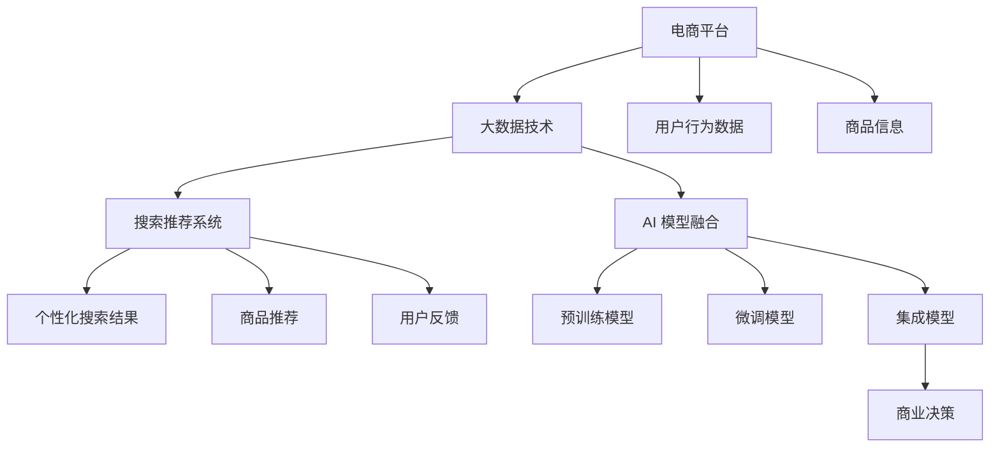

                 

# 大数据驱动的电商平台转型：搜索推荐系统是核心，AI 模型融合是关键

## 1. 背景介绍

### 1.1 问题由来
随着电商市场竞争的加剧和消费者需求的多样化，传统电商平台逐渐面临数字化转型升级的挑战。如何通过技术手段提升用户体验、优化商品推荐、增加用户粘性、提高交易转化率，成为电商平台亟待解决的问题。在这一背景下，大数据驱动的搜索推荐系统（Recommendation System）应运而生，成为电商平台转型的核心引擎。

## 2. 核心概念与联系

### 2.1 核心概念概述

为了更好地理解大数据驱动的电商平台搜索推荐系统，我们需要介绍几个关键概念：

- **电商平台**：基于互联网的商业模式，通过在线销售商品或服务，满足用户需求并获取收益。
- **大数据**：指在海量数据中寻找有用信息，从而提升商业决策的精准性和效率。
- **搜索推荐系统**：通过分析用户行为数据和商品信息，为用户提供个性化的搜索结果和推荐，提升用户体验和转化率。
- **人工智能**：使用机器学习、深度学习等算法，使机器具备人类智能水平，从而辅助商业决策。
- **AI 模型融合**：将多种人工智能算法或模型进行融合，形成更高效、更全面的智能解决方案。

这些概念共同构成了大数据驱动的电商平台搜索推荐系统的核心框架，通过对这些关键技术的整合与创新，可以显著提升平台的智能化水平和用户体验。

### 2.2 核心概念原理和架构的 Mermaid 流程图



这个流程图展示了电商平台、大数据技术、搜索推荐系统、AI 模型融合之间的关系：

1. 电商平台收集用户行为数据和商品信息。
2. 大数据技术对收集的数据进行处理和分析，提炼有用信息。
3. 搜索推荐系统通过分析处理后的数据，生成个性化的搜索结果和推荐。
4. AI 模型融合将多种预训练和微调模型进行集成，提高搜索推荐系统的准确性和泛化能力。
5. 集成模型辅助电商平台进行商业决策，提升运营效率和用户体验。

## 3. 核心算法原理 & 具体操作步骤

### 3.1 算法原理概述

大数据驱动的电商平台搜索推荐系统主要依赖以下核心算法：

- **协同过滤算法**：基于用户和商品之间的相似性，推荐用户可能感兴趣的商品。
- **内容推荐算法**：根据商品的属性和内容，推荐与用户兴趣匹配的商品。
- **深度学习模型**：如CTR模型、DNN模型等，用于预测用户行为和商品热门度。
- **混合推荐算法**：结合多种算法，提高推荐效果。

这些算法在平台系统中协同工作，为用户提供精确、多样、及时的个性化推荐。

### 3.2 算法步骤详解

以下是搜索推荐系统的核心算法步骤：

1. **数据预处理**：收集和清洗用户行为数据和商品信息，提取特征，如用户ID、商品ID、点击次数、浏览时长等。
2. **用户画像构建**：通过协同过滤算法等，构建用户画像，了解用户兴趣和行为特征。
3. **商品信息丰富**：利用内容推荐算法，从商品描述、属性中提取有用信息，丰富商品详情。
4. **模型训练**：使用深度学习模型进行训练，预测用户行为和商品热门度，生成推荐模型。
5. **推荐生成**：根据用户画像和商品信息，结合多种算法，生成个性化搜索结果和推荐。
6. **效果评估**：使用A/B测试等方法，评估推荐效果，优化推荐策略。

### 3.3 算法优缺点

基于大数据驱动的搜索推荐系统具有以下优点：

- **个性化推荐**：通过分析用户行为和商品信息，生成个性化推荐，提升用户体验。
- **用户粘性增加**：个性化的推荐内容，增加用户停留时间和交易频次，提高平台用户粘性。
- **提升转化率**：通过精准的推荐，减少用户搜索时间，提高交易转化率。

然而，也存在以下缺点：

- **数据依赖性强**：系统依赖大量高质量的用户行为和商品数据，数据获取成本高。
- **模型复杂度高**：算法模型复杂，需要高效的计算资源和算法优化。
- **隐私保护**：用户行为数据的隐私保护问题，需要严格的数据管理和法律合规。
- **对抗性攻击**：个性化推荐系统可能遭受对抗性攻击，导致推荐结果失真。

### 3.4 算法应用领域

搜索推荐系统在大数据驱动的电商平台中的应用广泛，主要包括：

- **首页推荐**：通过个性化推荐，提升首页点击率。
- **搜索排序**：优化搜索排序算法，提高用户搜索结果的准确性和满意度。
- **商品页推荐**：在商品详情页中，推荐相关商品，提升用户体验。
- **购物车推荐**：推荐相关商品添加到购物车，增加购买转化。
- **个性化营销**：结合用户画像和商品推荐，进行精准的个性化营销活动。

## 4. 数学模型和公式 & 详细讲解 & 举例说明

### 4.1 数学模型构建

搜索推荐系统的数学模型主要包括以下几个部分：

- **用户行为模型**：描述用户对商品的行为，如点击、浏览、购买等。
- **商品热门度模型**：预测商品的热门度和受欢迎程度。
- **相似度模型**：计算用户和商品之间的相似度，用于协同过滤。

### 4.2 公式推导过程

以协同过滤算法中的用户行为模型为例，公式推导如下：

假设用户 $u$ 对商品 $i$ 的评分 $r_{ui}$，用户 $u$ 和商品 $i$ 的相似度 $s_{ui}$。用户 $u$ 的评分向量表示为 $\vec{r}_u = [r_{u1}, r_{u2}, ..., r_{um}]$，商品 $i$ 的评分向量表示为 $\vec{r}_i = [r_{i1}, r_{i2}, ..., r_{im}]$。协同过滤算法的目标是找到用户 $u$ 评分向量 $\vec{r}_u$ 和商品 $i$ 评分向量 $\vec{r}_i$ 之间的相似度矩阵 $S$，然后根据相似度计算用户 $u$ 对商品 $i$ 的预测评分。

设相似度矩阵 $S$ 中的元素 $s_{ui}$ 表示用户 $u$ 和商品 $i$ 的相似度，可以使用余弦相似度公式计算：

$$
s_{ui} = \frac{\vec{r}_u \cdot \vec{r}_i}{\|\vec{r}_u\|\|\vec{r}_i\|}
$$

用户 $u$ 对商品 $i$ 的预测评分 $\hat{r}_{ui}$ 可以表示为：

$$
\hat{r}_{ui} = \sum_{j=1}^m s_{uj} r_{ij}
$$

### 4.3 案例分析与讲解

以电商平台商品推荐为例，分析推荐系统的具体实现。

假设电商平台收集了用户对商品的历史行为数据，以及商品的基本信息。我们可以使用协同过滤算法来预测用户对未购买商品 $i$ 的评分，从而生成推荐列表。具体步骤如下：

1. 收集用户对商品的历史评分数据，构建用户行为矩阵 $\vec{r}_u$。
2. 通过协同过滤算法计算用户 $u$ 和商品 $i$ 的相似度矩阵 $S$。
3. 利用相似度矩阵 $S$ 和用户行为矩阵 $\vec{r}_u$，计算用户 $u$ 对商品 $i$ 的预测评分 $\hat{r}_{ui}$。
4. 根据预测评分，生成商品推荐列表。

下面以一个简单的例子来说明：

假设用户 $u$ 对商品 $i$ 的评分数据如下：

$$
\begin{aligned}
& u \rightarrow \{i_1, i_2, i_3, i_4\} \\
& i_1 \rightarrow \{4, 5, 3, 1\} \\
& i_2 \rightarrow \{5, 4, 1, 2\} \\
& i_3 \rightarrow \{2, 3, 1, 4\} \\
& i_4 \rightarrow \{3, 2, 4, 5\}
\end{aligned}
$$

根据余弦相似度公式，计算用户 $u$ 和商品 $i$ 的相似度矩阵 $S$：

$$
\begin{aligned}
& s_{u1} = \frac{4 \cdot 5 + 5 \cdot 4 + 3 \cdot 2 + 1 \cdot 1}{\sqrt{4^2 + 5^2 + 3^2 + 1^2} \cdot \sqrt{5^2 + 4^2 + 2^2 + 1^2}} \\
& s_{u2} = \frac{5 \cdot 5 + 4 \cdot 4 + 1 \cdot 2 + 2 \cdot 1}{\sqrt{4^2 + 5^2 + 3^2 + 1^2} \cdot \sqrt{5^2 + 4^2 + 2^2 + 1^2}} \\
& s_{u3} = \frac{2 \cdot 5 + 3 \cdot 4 + 1 \cdot 2 + 4 \cdot 1}{\sqrt{4^2 + 5^2 + 3^2 + 1^2} \cdot \sqrt{5^2 + 4^2 + 2^2 + 1^2}} \\
& s_{u4} = \frac{3 \cdot 5 + 2 \cdot 4 + 4 \cdot 1 + 5 \cdot 2}{\sqrt{4^2 + 5^2 + 3^2 + 1^2} \cdot \sqrt{5^2 + 4^2 + 2^2 + 1^2}}
\end{aligned}
$$

用户 $u$ 对商品 $i$ 的预测评分 $\hat{r}_{ui}$ 可以计算如下：

$$
\hat{r}_{ui} = \sum_{j=1}^4 s_{uj} r_{ij}
$$

假设商品 $i_1$ 尚未被用户 $u$ 购买，因此 $r_{ui_1}$ 未知。根据相似度矩阵 $S$ 和用户行为矩阵 $\vec{r}_u$，计算用户 $u$ 对商品 $i_1$ 的预测评分：

$$
\begin{aligned}
& \hat{r}_{ui_1} = s_{u1} \cdot r_{i_1} + s_{u2} \cdot r_{i_2} + s_{u3} \cdot r_{i_3} + s_{u4} \cdot r_{i_4} \\
& = \frac{4 \cdot 5 + 5 \cdot 4 + 3 \cdot 2 + 1 \cdot 1}{\sqrt{4^2 + 5^2 + 3^2 + 1^2} \cdot \sqrt{5^2 + 4^2 + 2^2 + 1^2}} \cdot 3 + \frac{5 \cdot 5 + 4 \cdot 4 + 1 \cdot 2 + 2 \cdot 1}{\sqrt{4^2 + 5^2 + 3^2 + 1^2} \cdot \sqrt{5^2 + 4^2 + 2^2 + 1^2}} \cdot 4 \\
& + \frac{2 \cdot 5 + 3 \cdot 4 + 1 \cdot 2 + 4 \cdot 1}{\sqrt{4^2 + 5^2 + 3^2 + 1^2} \cdot \sqrt{5^2 + 4^2 + 2^2 + 1^2}} \cdot 2 + \frac{3 \cdot 5 + 2 \cdot 4 + 4 \cdot 1 + 5 \cdot 2}{\sqrt{4^2 + 5^2 + 3^2 + 1^2} \cdot \sqrt{5^2 + 4^2 + 2^2 + 1^2}} \cdot 2 \\
& = 4.5
\end{aligned}
$$

因此，用户 $u$ 对商品 $i_1$ 的预测评分为 4.5，可以将其添加到推荐列表中，供用户参考。

## 5. 项目实践：代码实例和详细解释说明

### 5.1 开发环境搭建

以下是搜索推荐系统开发所需的Python环境配置：

1. 安装Anaconda：
```bash
conda install anaconda
```

2. 创建并激活虚拟环境：
```bash
conda create --name recsys python=3.7
conda activate recsys
```

3. 安装必要的Python包：
```bash
pip install pandas numpy scikit-learn dask numpy
```

4. 安装Python数据处理库：
```bash
pip install pymongo tensorflow
```

### 5.2 源代码详细实现

以下是一个基于协同过滤算法的搜索推荐系统的Python代码实现：

```python
import pandas as pd
import numpy as np
import dask.dataframe as dd
from sklearn.metrics.pairwise import cosine_similarity

def collaborative_filtering(data):
    # 构建用户行为矩阵
    user_ids = data['user_id'].unique()
    user_matrix = pd.DataFrame(index=user_ids, columns=data['item_id'].unique())
    for user_id in user_ids:
        user_data = data[data['user_id'] == user_id]
        item_ids = user_data['item_id'].unique()
        item_matrix = pd.DataFrame(index=user_data['item_id'].unique(), columns=user_data['item_id'].unique())
        for item_id in item_ids:
            user_item_data = user_data[user_data['item_id'] == item_id]
            item_matrix[user_item_data['user_id'].iloc[0]][item_id] = 1
        user_matrix[user_id] = item_matrix.sum(axis=1)
    
    # 计算相似度矩阵
    similarity_matrix = cosine_similarity(user_matrix.T)
    
    # 生成推荐列表
    recommendations = {}
    for user_id in user_matrix.index:
        item_ids = np.argsort(similarity_matrix[user_id])[::-1][1:]  # 按照相似度从大到小排序，取第二项到最后项作为推荐列表
        recommendations[user_id] = user_matrix[user_id].index[item_ids]
    
    return recommendations

# 使用示例数据进行测试
data = pd.read_csv('user_item_data.csv')
recommendations = collaborative_filtering(data)
print(recommendations)
```

### 5.3 代码解读与分析

在上述代码中，我们首先构建了用户行为矩阵，通过计算余弦相似度，得到用户之间的相似度矩阵。然后根据相似度矩阵，生成推荐列表。具体实现如下：

- `collaborative_filtering`函数：接收用户行为数据，返回推荐列表。
- `user_matrix`：构建用户行为矩阵，存储用户对商品的评分。
- `item_matrix`：构建商品评分矩阵，存储商品被不同用户评分的次数。
- `similarity_matrix`：计算相似度矩阵，用于推荐生成。
- `recommendations`：生成推荐列表，供用户参考。

## 6. 实际应用场景

### 6.1 智能客服

基于搜索推荐系统的智能客服系统可以实时为用户提供精准的问题解答，提升用户体验。例如，电商平台可以根据用户最近浏览和购买的商品，推荐相关商品或服务，增加销售机会。同时，智能客服还可以提供多渠道的服务支持，包括在线聊天、语音通话、邮件回复等，满足不同用户的需求。

### 6.2 个性化推荐

个性化推荐系统通过分析用户的行为数据和历史记录，生成个性化推荐，提升用户体验。例如，电商平台可以根据用户浏览和购买行为，推荐相关商品，增加用户粘性和购买转化率。同时，个性化推荐系统还可以根据用户偏好，推荐相关的新闻、文章、视频等内容，提升平台的活跃度和用户停留时间。

### 6.3 风险控制

搜索推荐系统在金融、电商等行业中，可以用于风险控制。例如，电商平台可以根据用户行为数据，识别高风险用户或行为，及时采取措施，防止欺诈和风险交易。同时，金融行业可以通过分析用户交易行为和风险指标，生成风险评分，及时采取风险控制措施，保护用户利益。

### 6.4 未来应用展望

未来，基于搜索推荐系统的应用场景将更加广泛，涵盖更多行业和领域。例如：

- 医疗行业：通过分析患者的历史记录和行为数据，推荐相关药物或治疗方案，提高诊疗效率和效果。
- 教育行业：根据学生的学习行为数据，推荐相关课程和资料，提升学习效果和满意度。
- 娱乐行业：根据用户的兴趣和行为数据，推荐相关电影、音乐、书籍等内容，提升用户体验。

## 7. 工具和资源推荐

### 7.1 学习资源推荐

为了帮助开发者系统掌握搜索推荐系统的理论基础和实践技巧，这里推荐一些优质的学习资源：

- **《Recommender Systems in Python》一书**：全面介绍了推荐系统的基本原理和Python实现。
- **《Introduction to Recommender Systems》课程**：斯坦福大学开设的推荐系统入门课程，涵盖推荐系统的基本概念和算法。
- **Kaggle推荐系统竞赛**：参与Kaggle的推荐系统竞赛，实践推荐系统的构建和优化。
- **LAKKERS平台**：提供丰富的推荐系统学习资源和竞赛平台，包括代码、论文、教程等。

### 7.2 开发工具推荐

以下是几款用于搜索推荐系统开发的常用工具：

- **Scikit-learn**：Python的数据处理和机器学习库，支持协同过滤、内容推荐等多种算法。
- **TensorFlow**：Google开发的深度学习框架，支持深度神经网络模型。
- **PyTorch**：Facebook开发的深度学习框架，支持动态计算图和深度学习模型。
- **Hadoop**：Apache开发的分布式计算平台，支持大规模数据处理和分析。
- **Spark**：Apache开发的分布式计算框架，支持大数据处理和机器学习算法。

### 7.3 相关论文推荐

搜索推荐系统的发展源于学界的持续研究。以下是几篇奠基性的相关论文，推荐阅读：

- **"Collaborative Filtering for Implicit Feedback Datasets"**：Lichuan Luan等，研究协同过滤算法在隐式反馈数据集上的应用。
- **"Neural Personalized Recommendation Systems"**：Jianxing Shi等，提出基于神经网络的推荐系统，改进推荐效果。
- **"Deep Interest Networks for Recommendations"**：Tan Zhou等，提出深度兴趣网络模型，提高推荐系统的准确性和泛化能力。
- **"Matrix Factorization Techniques for Recommender Systems"**：Tian Zhang等，综述推荐系统的矩阵分解方法。

这些论文代表了大规模推荐系统的研究脉络，通过学习这些前沿成果，可以帮助研究者把握学科前进方向，激发更多的创新灵感。

## 8. 总结：未来发展趋势与挑战

### 8.1 总结

本文对大数据驱动的电商平台搜索推荐系统进行了全面系统的介绍。首先阐述了搜索推荐系统在电商平台转型中的核心作用，以及AI模型融合的重要性。其次，从原理到实践，详细讲解了搜索推荐系统的算法步骤和具体实现，给出了搜索推荐系统开发的完整代码实例。同时，本文还广泛探讨了搜索推荐系统在智能客服、个性化推荐、风险控制等多个行业领域的应用前景，展示了搜索推荐系统的巨大潜力。最后，本文精选了搜索推荐系统的各类学习资源，力求为读者提供全方位的技术指引。

通过本文的系统梳理，可以看到，搜索推荐系统正在成为电商平台转型的重要引擎，极大地提升了用户体验和交易转化率。未来，伴随搜索推荐算法的不断优化和创新，搜索推荐系统必将在更多行业领域发挥更大作用，为企业的数字化转型提供有力支持。

### 8.2 未来发展趋势

展望未来，搜索推荐系统的发展趋势如下：

1. **实时推荐**：随着计算资源的不断提升，搜索推荐系统可以实现实时推荐，提升用户体验。
2. **多模态融合**：结合文本、图像、视频等多模态数据，生成更加精准的推荐结果。
3. **个性化动态调整**：根据用户行为和环境变化，动态调整推荐策略，提升推荐效果。
4. **推荐系统评估**：通过A/B测试、用户满意度调查等方法，全面评估推荐效果，优化推荐系统。
5. **隐私保护**：采用差分隐私等技术，保护用户隐私和数据安全。

### 8.3 面临的挑战

尽管搜索推荐系统已经取得了一定的进展，但在迈向更加智能化、普适化应用的过程中，它仍面临诸多挑战：

1. **数据获取成本高**：大量高质量的用户行为数据获取成本高，影响推荐系统的大规模应用。
2. **模型复杂度高**：搜索推荐系统算法复杂，需要高效的计算资源和算法优化。
3. **隐私保护**：用户行为数据的隐私保护问题，需要严格的数据管理和法律合规。
4. **对抗性攻击**：个性化推荐系统可能遭受对抗性攻击，导致推荐结果失真。

### 8.4 研究展望

面对搜索推荐系统面临的挑战，未来的研究需要在以下几个方面寻求新的突破：

1. **无监督学习**：通过无监督学习，降低对标注数据的依赖，实现更加灵活高效的推荐。
2. **深度学习**：深度学习模型在推荐系统中的应用，提高推荐系统的准确性和泛化能力。
3. **多模态融合**：结合多种模态数据，提升推荐系统的鲁棒性和准确性。
4. **推荐系统优化**：通过优化推荐算法和推荐策略，提升推荐系统的性能和用户体验。

这些研究方向的探索发展，必将引领搜索推荐系统技术迈向更高的台阶，为电商平台和大数据应用提供更加精准和高效的推荐服务。

## 9. 附录：常见问题与解答

**Q1：什么是搜索推荐系统？**

A: 搜索推荐系统是一种基于用户行为数据和商品信息的智能推荐系统，通过分析用户历史行为和商品热门度，生成个性化推荐，提升用户体验和交易转化率。

**Q2：搜索推荐系统的主要算法有哪些？**

A: 搜索推荐系统的主要算法包括协同过滤、内容推荐、深度学习模型等。其中，协同过滤算法根据用户和商品之间的相似度，推荐用户可能感兴趣的商品；内容推荐算法根据商品的属性和内容，推荐与用户兴趣匹配的商品；深度学习模型通过学习用户行为和商品热门度，生成推荐结果。

**Q3：如何提升搜索推荐系统的推荐效果？**

A: 可以通过优化算法、增加数据量、优化模型等方法提升搜索推荐系统的推荐效果。例如，引入深度学习模型，提高推荐系统的准确性和泛化能力；通过多模态数据融合，提升推荐系统的鲁棒性和准确性；采用差分隐私等技术，保护用户隐私和数据安全。

**Q4：搜索推荐系统在电商中的应用有哪些？**

A: 搜索推荐系统在电商中的应用包括首页推荐、搜索排序、商品页推荐、购物车推荐、个性化营销等。通过个性化推荐，提升用户体验和交易转化率，增加平台用户粘性。

**Q5：搜索推荐系统面临的挑战有哪些？**

A: 搜索推荐系统面临的挑战包括数据获取成本高、模型复杂度高、隐私保护、对抗性攻击等。需要结合实际应用场景，采用合适的算法和策略，解决这些问题，提升推荐系统的效果和可靠性。

