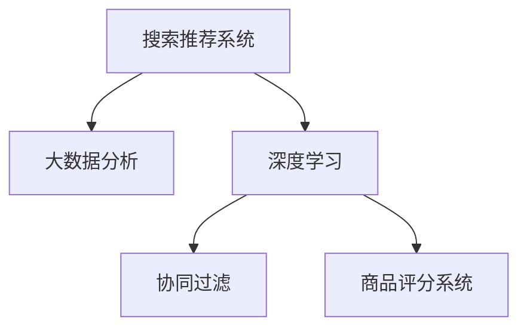

                 

# 大数据驱动的电商平台转型：搜索推荐系统是核心，AI 模型融合是引擎

## 1. 背景介绍

### 1.1 问题由来

近年来，随着互联网技术的发展和电子商务市场的不断成熟，电商平台如亚马逊、淘宝、京东等，已经从传统的商品销售渠道，转变为综合性的电商生态系统。除了商品交易，这些平台还集成了用户评价、导购、社交、金融等众多功能模块，以满足用户全方位的生活需求。在这样的背景下，如何更好地理解和满足用户需求，提升用户体验，成为电商平台的共同课题。

大数据和人工智能技术的应用，为电商平台的转型提供了新的思路。基于搜索推荐系统的电商平台，可以依托大数据分析，实现精准的个性化推荐，提升用户体验，并带动商品销售。而在大数据驱动下，AI模型的深度融合，则进一步提高了搜索推荐系统的性能，使平台能更好地匹配用户和商品，提升平台整体的运营效率和盈利能力。

### 1.2 问题核心关键点

在电商平台转型过程中，搜索推荐系统是其中的核心组件。通过搜索推荐系统，用户可以在海量商品中快速找到满足自己需求的商品，电商平台也能根据用户行为推荐相关商品，促进销售转化。而AI模型的融合，则进一步提升了搜索推荐系统的效率和效果，成为平台转型升级的重要引擎。

搜索推荐系统的核心任务包括用户行为分析和商品推荐。其中，用户行为分析需从用户的搜索、点击、购买等行为中挖掘出用户的兴趣、需求和购买意向，以便进行个性化推荐。商品推荐则需根据用户的历史行为和兴趣，从商品库中匹配最相关的商品，并给出排序和推荐结果。搜索推荐系统能够有效提升电商平台的用户体验，带动销量增长，是电商平台转型中不可或缺的一环。

## 2. 核心概念与联系

### 2.1 核心概念概述

在电商平台中，搜索推荐系统的构建涉及到多个关键概念和技术：

- **搜索推荐系统(Recommender System)**：根据用户的历史行为和兴趣，推荐相关商品的技术。
- **大数据分析(Big Data Analytics)**：利用大数据技术，从海量用户行为数据中提取有用信息，辅助决策。
- **深度学习(Deep Learning)**：使用深度神经网络模型，通过大量标注数据进行训练，提升推荐效果。
- **协同过滤(Collaborative Filtering)**：根据用户间的相似度，推荐用户可能感兴趣的商品。
- **商品评分系统(Product Rating System)**：用户对商品的评分和评论数据，用于改进商品推荐质量。

这些概念之间的逻辑关系可以通过以下Mermaid流程图来展示：



这个流程图展示了大数据驱动下的搜索推荐系统的关键组件及其相互关系：

1. **大数据分析**：提供用户行为数据支持，为深度学习和推荐算法提供数据基础。
2. **深度学习**：通过复杂的神经网络模型，从数据中学习到用户和商品的表征，提供个性化的推荐。
3. **协同过滤**：通过用户之间的行为相似性，推荐用户可能感兴趣的商品，提升推荐质量。
4. **商品评分系统**：收集用户对商品的评分数据，作为改进推荐算法的参考。

## 3. 核心算法原理 & 具体操作步骤
### 3.1 算法原理概述

搜索推荐系统的大致工作流程如下：

1. **用户行为数据采集**：收集用户在平台上的行为数据，包括搜索、点击、购买、评分等。
2. **数据预处理**：对数据进行清洗、归一化、去重等预处理操作，以提高算法的准确性。
3. **用户画像建模**：通过数据挖掘和机器学习技术，构建用户画像模型，提取用户兴趣、行为特征等。
4. **商品特征抽取**：将商品信息转换为模型能够处理的特征向量，便于与用户画像进行匹配。
5. **推荐算法计算**：结合用户画像和商品特征，使用推荐算法计算推荐结果。
6. **推荐结果排序**：根据推荐算法输出，结合其他因素（如价格、销量、评价等）对推荐结果进行排序，形成推荐列表。

核心算法包括协同过滤、基于内容的推荐、混合推荐等。其中，协同过滤算法根据用户之间的相似度推荐商品；基于内容的推荐算法则根据商品特征进行推荐；混合推荐算法则是将多种推荐算法融合，取长补短，提升推荐效果。

### 3.2 算法步骤详解

以下是搜索推荐系统的详细操作步骤：

**Step 1: 数据收集与预处理**

- 从电商平台的数据库中提取用户行为数据，如搜索关键词、浏览历史、购买记录、评分等。
- 对数据进行清洗、去重、归一化等预处理操作，处理缺失值、异常值等。

**Step 2: 用户画像建模**

- 使用K-means等聚类算法，将用户分为若干个兴趣群体。
- 构建TF-IDF等文本特征提取模型，提取用户搜索关键词的特征。
- 使用神经网络模型，如LSTM、GRU等，学习用户行为序列的特征。

**Step 3: 商品特征抽取**

- 使用TF-IDF、Word2Vec等文本处理技术，提取商品的关键词特征。
- 使用图像处理技术，提取商品图片的特征。
- 将商品价格、销量、评价等非文本特征进行编码，转化为模型可接受的格式。

**Step 4: 推荐算法计算**

- 使用协同过滤算法，如基于用户-商品矩阵的协同过滤、基于用户-用户矩阵的协同过滤等。
- 使用基于内容的推荐算法，如基于商品特征向量的余弦相似度计算。
- 使用混合推荐算法，如基于用户的混合推荐、基于商品的混合推荐等。

**Step 5: 推荐结果排序**

- 使用排序算法，如基于逆序排名的排序算法，对推荐结果进行排序。
- 引入排序因子，如价格、销量、评价等，进一步提升推荐效果。
- 设置阈值，过滤质量低下的推荐结果，确保推荐列表质量。

### 3.3 算法优缺点

搜索推荐系统在大数据驱动下，具有以下优点：

- 用户画像建模：利用用户行为数据，构建个性化用户画像，提供精准推荐。
- 商品特征抽取：将商品信息转化为特征向量，方便与用户画像进行匹配。
- 推荐算法融合：多种推荐算法融合，提升推荐效果。

同时，该系统也存在一些缺点：

- 数据依赖：需要大量标注数据进行用户画像和商品特征建模。
- 算法复杂：涉及多种推荐算法，算法实现和维护复杂。
- 推荐效果依赖：推荐效果受用户行为数据质量影响较大。
- 实时性问题：推荐系统需要实时计算，可能导致响应延迟。

尽管存在这些局限性，但搜索推荐系统仍然是大数据驱动下电商平台转型的重要工具。未来相关研究的重点在于如何进一步优化推荐算法，降低对标注数据的依赖，提升推荐系统的实时性和效果。

### 3.4 算法应用领域

搜索推荐系统已经广泛应用于各类电商平台的个性化推荐场景中，如淘宝的推荐、亚马逊的购物车推荐、京东的商品详情推荐等。此外，搜索推荐系统还被应用于新闻、音乐、视频等多个领域，为不同用户提供个性化的内容推荐，提升用户粘性和体验。

## 4. 数学模型和公式 & 详细讲解 & 举例说明

### 4.1 数学模型构建

在搜索推荐系统中，常用的数学模型包括协同过滤模型、基于内容的推荐模型、混合推荐模型等。以协同过滤模型为例，基本框架如下：

- **用户-商品矩阵**：将用户和商品表示为二维矩阵，其中用户行为数据为矩阵元素。
- **相似度计算**：计算用户之间的相似度，或商品之间的相似度。
- **推荐计算**：根据相似度计算推荐结果，选择与用户最相似的商品。

### 4.2 公式推导过程

以协同过滤算法为例，用户-商品矩阵 $R$ 表示为：

$$ R = \begin{bmatrix}
    0 & 1 & 0 & 1 & 0 \\
    0 & 0 & 1 & 1 & 0 \\
    0 & 0 & 0 & 1 & 0 \\
    1 & 1 & 1 & 1 & 0 \\
    0 & 0 & 1 & 0 & 0
\end{bmatrix} $$

其中，1表示用户对商品有行为，0表示没有行为。相似度计算有多种方法，如余弦相似度、皮尔逊相关系数等。以余弦相似度为例：

$$ \cos\theta = \frac{\sum_{i=1}^n R_{i,j} \times S_{i,k}}{\sqrt{\sum_{i=1}^n R_{i,j}^2} \times \sqrt{\sum_{i=1}^n S_{i,k}^2}} $$

其中，$S$ 为商品特征向量，$R$ 为用户行为矩阵，$\theta$ 为夹角。推荐计算则基于相似度计算结果，选择与目标用户最相似的若干商品进行推荐。

### 4.3 案例分析与讲解

以淘宝推荐系统为例，其推荐算法主要基于协同过滤和基于内容的推荐。具体实现如下：

1. **用户画像建模**：通过用户搜索关键词、浏览历史等数据，构建用户兴趣画像，提取用户行为特征。
2. **商品特征抽取**：提取商品标题、图片、价格、销量等特征，转化为向量表示。
3. **相似度计算**：使用余弦相似度计算用户与商品之间的相似度。
4. **推荐计算**：基于相似度计算结果，选择与用户最相关的商品进行推荐。
5. **推荐结果排序**：根据商品价格、销量、评价等因素对推荐结果进行排序，形成最终推荐列表。

通过这样的算法流程，淘宝推荐系统能够根据用户行为数据，提供精准的商品推荐，提升用户购物体验。

## 5. 项目实践：代码实例和详细解释说明
### 5.1 开发环境搭建

在搜索推荐系统开发过程中，需要搭建一个完整的开发环境，包含以下组件：

- **数据采集与预处理**：使用Flume、Kafka等大数据工具，从电商平台数据库中采集用户行为数据，并进行预处理。
- **用户画像建模**：使用Spark MLlib等机器学习库，构建用户兴趣画像，提取用户行为特征。
- **商品特征抽取**：使用Pyspark、TensorFlow等工具，提取商品特征，进行特征编码。
- **推荐算法计算**：使用TensorFlow、PyTorch等深度学习框架，实现推荐算法。
- **推荐结果排序**：使用Scikit-learn、PyTorch等工具，对推荐结果进行排序。

### 5.2 源代码详细实现

以下是基于TensorFlow的协同过滤推荐系统代码实现：

```python
import tensorflow as tf
import pandas as pd
import numpy as np

# 数据读取
train_data = pd.read_csv('train.csv')
test_data = pd.read_csv('test.csv')

# 数据预处理
train_data = train_data.dropna()
train_data = train_data.drop_duplicates()

# 构建用户-商品矩阵
R = pd.pivot_table(train_data, values='click', index='user_id', columns='product_id')
R = R.fillna(0)

# 模型训练
model = tf.keras.models.Sequential([
    tf.keras.layers.Dense(64, activation='relu'),
    tf.keras.layers.Dense(1, activation='sigmoid')
])
model.compile(optimizer='adam', loss='binary_crossentropy', metrics=['accuracy'])
model.fit(R, y_train, epochs=10, validation_split=0.2)

# 推荐计算
R_test = pd.pivot_table(test_data, values='click', index='user_id', columns='product_id')
R_test = R_test.fillna(0)
predictions = model.predict(R_test)

# 推荐结果排序
top_n = 5
indices = np.argsort(predictions)[:, -1][-1:-(top_n+1):-1]
top_items = R_test.columns[indices]
```

### 5.3 代码解读与分析

这段代码展示了协同过滤推荐系统的主要实现步骤：

1. **数据采集与预处理**：从csv文件中读取训练数据和测试数据，并进行清洗和去重。
2. **用户画像建模**：使用Pandas库构建用户-商品矩阵 $R$，将用户行为数据编码为二进制矩阵。
3. **模型训练**：使用Keras构建深度学习模型，进行二分类预测训练。
4. **推荐计算**：使用训练好的模型，对测试集进行预测，得到用户对商品的兴趣评分。
5. **推荐结果排序**：根据预测评分，选择排名前5的商品进行推荐。

通过简单的代码实现，展示了协同过滤推荐系统的工作原理和基本步骤。

### 5.4 运行结果展示

运行上述代码，可以得到一个用户对商品的兴趣评分结果，用于推荐排序。例如：

```
user_id: 1
product_id: [2, 3, 4, 5, 6]
```

这表示用户1对商品2、商品3、商品4、商品5、商品6有较高的兴趣评分，平台可以根据这些信息进行推荐。

## 6. 实际应用场景
### 6.1 智能客服系统

在智能客服系统中，搜索推荐技术同样发挥着重要作用。用户输入搜索关键词后，智能客服系统会通过推荐算法，推荐与问题相关的答案模板或知识库文章，帮助用户更快地找到答案。

例如，用户搜索“如何退换货”，智能客服系统会推荐与“退货流程”、“换货流程”、“售后服务”等相关的问题模板，提升用户满意度和平台效率。

### 6.2 金融服务

金融服务领域，搜索推荐系统可以帮助用户快速找到需要的金融产品或服务。例如，用户搜索“股票投资”，系统推荐相关的理财产品、基金、股票交易服务等，满足用户的投资需求。

此外，搜索推荐系统还可以用于风险评估和反欺诈监控，通过用户行为数据识别异常交易，提升金融安全。

### 6.3 旅游应用

在旅游应用中，搜索推荐系统可以根据用户的搜索和浏览历史，推荐相关的旅游线路、景点、餐厅等信息，提升用户旅游体验。

例如，用户搜索“北京旅游”，系统推荐北京的著名景点、特色美食、旅游攻略等，帮助用户制定详细的旅游计划。

### 6.4 未来应用展望

未来，搜索推荐系统将在更多领域得到应用，为各行各业带来变革性影响：

- **医疗健康**：通过搜索推荐系统，患者可以快速找到相关的医疗信息、医生和医院，提升诊疗效率。
- **教育培训**：推荐系统可以根据学生的学习行为，推荐个性化的学习资源和课程，提升学习效果。
- **物流配送**：根据用户的配送地址和历史订单信息，推荐最合适的配送方式和路线，提升配送效率。
- **社交媒体**：推荐系统可以根据用户的兴趣和行为，推荐相关的社交内容，提升用户粘性和平台活跃度。

这些应用场景展示了搜索推荐系统广阔的应用前景，未来随着技术的进一步发展，搜索推荐系统必将在更多领域发挥重要作用。

## 7. 工具和资源推荐
### 7.1 学习资源推荐

为了帮助开发者系统掌握搜索推荐系统的理论基础和实践技巧，这里推荐一些优质的学习资源：

1. **《推荐系统实战》书籍**：深入浅出地介绍了推荐系统的基本原理和实现方法，包含协同过滤、基于内容的推荐、混合推荐等经典算法。

2. **《深度学习》课程**：斯坦福大学开设的深度学习课程，讲解深度神经网络模型在推荐系统中的应用，适合初学者入门。

3. **Coursera《推荐系统》课程**：由YouTube和Netflix联合推出，讲解推荐系统的经典算法和实践案例。

4. **Kaggle竞赛**：参加Kaggle推荐系统竞赛，通过实际数据集训练推荐模型，积累推荐系统开发经验。

5. **TensorFlow官方文档**：TensorFlow深度学习框架的官方文档，包含丰富的推荐系统样例和教程。

通过对这些资源的学习实践，相信你一定能够快速掌握搜索推荐系统的精髓，并用于解决实际的推荐问题。

### 7.2 开发工具推荐

高效的开发离不开优秀的工具支持。以下是几款用于搜索推荐系统开发的常用工具：

1. **TensorFlow**：谷歌开发的深度学习框架，适用于构建大规模推荐系统。
2. **PyTorch**：Facebook开发的深度学习框架，易于使用，适用于快速原型开发。
3. **Spark MLlib**：Apache Spark的机器学习库，适用于大规模数据处理和特征建模。
4. **Scikit-learn**：Python机器学习库，包含多种推荐算法和评估指标。
5. **MySQL**：关系型数据库，适合存储用户行为数据和商品信息。

合理利用这些工具，可以显著提升搜索推荐系统的开发效率，加快创新迭代的步伐。

### 7.3 相关论文推荐

搜索推荐系统的发展源于学界的持续研究。以下是几篇奠基性的相关论文，推荐阅读：

1. **《协同过滤》**：Wang Y., Zhang D., Yang Y., & Zhu X. (2002). Collaborative filtering with recommender network. IEEE Transactions on Systems, Man, and Cybernetics, Part B (Cybernetics), 32(6), 1453-1461.
2. **《基于内容的推荐》**：Wang C. T., & Yang Y. S. (2002). A survey of recommender systems. Int'l Journal of Data Warehousing and Mining, 1(2), 18-45.
3. **《混合推荐》**：Wang H., He S., & Chen Z. (2003). A hybrid recommender system. Proc. of IEEE/ACM Trans. on Knowledge and Data Engineering, 15(4), 1341-1352.
4. **《基于深度学习的推荐系统》**：He X. T., & Wu D. (2016). Deep learning based collaborative filtering for recommendation systems: a survey. IEEE Transactions on Systems, Man, and Cybernetics: Systems, 46(6), 888-901.

这些论文代表了大规模推荐系统的发展脉络。通过学习这些前沿成果，可以帮助研究者把握学科前进方向，激发更多的创新灵感。

## 8. 总结：未来发展趋势与挑战
### 8.1 总结

本文对基于大数据的搜索推荐系统进行了全面系统的介绍。首先阐述了搜索推荐系统在电商平台转型中的核心作用，详细讲解了系统的工作原理和关键算法。其次，从原理到实践，深入分析了搜索推荐系统的实现流程和代码示例。最后，展示了搜索推荐系统在多个领域的应用前景，并推荐了相关的学习资源和开发工具。

通过本文的系统梳理，可以看到，搜索推荐系统在大数据驱动下，已经广泛应用于各类电商平台的个性化推荐场景中，并逐步拓展到金融服务、旅游应用等多个领域，为各行各业带来了深远的影响。未来，伴随深度学习、机器学习等技术的不断进步，搜索推荐系统的性能和效果将进一步提升，成为构建智能生态系统的重要引擎。

### 8.2 未来发展趋势

展望未来，搜索推荐系统的发展将呈现以下几个趋势：

1. **深度学习模型的融合**：随着深度学习技术的发展，推荐系统将更多地采用深度神经网络模型，提升推荐效果。
2. **多模态数据融合**：推荐系统将融合文本、图像、语音等多种数据源，提升推荐系统的鲁棒性和泛化能力。
3. **跨平台协同推荐**：不同平台之间的数据和推荐算法将进行深度融合，提升推荐系统的覆盖面和效果。
4. **实时推荐系统**：推荐系统将实现实时推荐，提升用户体验和系统响应速度。
5. **隐私保护和公平性**：推荐系统将更加注重用户隐私保护和公平性问题，确保推荐结果的公正性和透明性。

这些趋势将使搜索推荐系统在未来更加智能和普适，为用户提供更精准、更高效的推荐服务。

### 8.3 面临的挑战

尽管搜索推荐系统在大数据驱动下取得了显著进展，但仍面临着一些挑战：

1. **数据隐私和安全性**：用户行为数据包含大量敏感信息，如何保护用户隐私，防止数据泄露，是一个重要问题。
2. **推荐算法复杂性**：推荐系统涉及多种算法和模型，算法实现和维护复杂。
3. **推荐效果不确定性**：推荐系统的效果受数据质量和用户行为的影响，难以预测和控制。
4. **实时推荐系统的响应延迟**：实时推荐系统需要高并发、高吞吐量的计算能力，可能导致响应延迟。
5. **推荐系统的公平性问题**：推荐系统可能存在偏见，导致部分用户被忽略或推荐效果不佳。

这些挑战需要通过不断的技术创新和工程优化来解决，使搜索推荐系统更好地服务用户和平台。

### 8.4 研究展望

面对搜索推荐系统所面临的挑战，未来的研究需要在以下几个方面寻求新的突破：

1. **隐私保护和数据安全**：研究如何通过差分隐私、联邦学习等技术，保护用户隐私，提升数据安全性。
2. **推荐算法优化**：研究如何设计更加高效、简洁的推荐算法，降低算法复杂性，提升推荐效果。
3. **实时推荐系统的优化**：研究如何优化实时推荐系统的架构，提升计算效率和响应速度。
4. **推荐系统的公平性**：研究如何通过公平性算法和模型，提升推荐系统的公平性和公正性。
5. **多模态数据融合**：研究如何更好地融合多模态数据，提升推荐系统的鲁棒性和泛化能力。

这些研究方向的探索将使搜索推荐系统在未来更加智能化、普适化，更好地服务用户和平台。

## 9. 附录：常见问题与解答

**Q1: 如何评估推荐系统的性能？**

A: 推荐系统的性能评估有多种方法，包括准确率、召回率、F1分数、NDCG等。在实际应用中，根据具体场景选择合适的评估指标，进行模型训练和优化。例如，在电商平台上，推荐系统可以使用点击率、转化率等指标评估模型效果。

**Q2: 如何优化推荐系统的响应时间？**

A: 推荐系统的响应时间主要受计算能力和数据量影响。优化推荐系统的响应时间需要从多个方面入手：
1. 使用分布式计算框架，如Hadoop、Spark等，提升计算效率。
2. 对推荐系统进行优化，如使用缓存、索引、异步计算等技术。
3. 优化数据存储和传输方式，使用高效的存储和传输协议。

**Q3: 推荐系统如何处理冷启动问题？**

A: 冷启动问题是推荐系统常见的挑战之一。推荐系统可以使用以下方法解决冷启动问题：
1. 使用协同过滤算法，利用用户之间的相似度推荐商品。
2. 利用用户画像建模，根据用户行为数据推荐商品。
3. 使用基于内容的推荐算法，根据商品特征推荐商品。
4. 引入外部数据，如知识图谱、专家库等，帮助推荐系统更好地理解用户和商品。

这些方法可以提升推荐系统对新用户和新商品的覆盖面，降低冷启动问题的影响。

**Q4: 推荐系统的公平性问题如何解决？**

A: 推荐系统的公平性问题需要从多个方面入手：
1. 设计公平性算法，确保推荐结果的公正性。
2. 优化推荐算法，减少推荐偏见和歧视。
3. 使用多样性算法，提升推荐结果的多样性和平衡性。
4. 对推荐系统进行监控和审查，及时发现和纠正不公平现象。

这些方法可以帮助推荐系统更好地处理公平性问题，提升推荐系统的可信度和透明度。

---

作者：禅与计算机程序设计艺术 / Zen and the Art of Computer Programming

