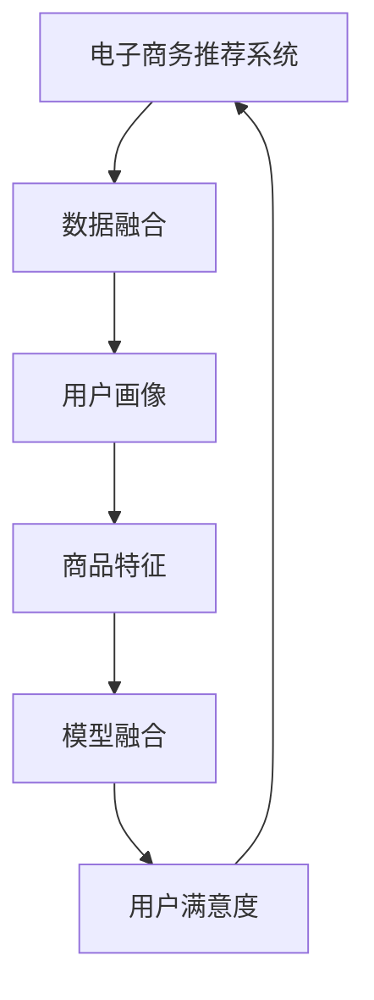

                 

## 1. 背景介绍

在当今数字化时代，电子商务（E-commerce）已经成为全球经济的重要组成部分。据统计，全球电子商务市场规模在2021年已突破4万亿美元，并且在不断扩大。随着互联网技术的普及和智能设备的广泛应用，消费者购物的在线化、个性化趋势愈发明显。电子商务企业面对日益激烈的市场竞争，需要更高效、更精准的推荐系统来提升用户体验和转化率。

电子商务推荐系统，旨在通过分析用户行为数据，精准推荐商品，提升用户购物体验和商家销售收益。推荐系统的主要目标是为用户提供最匹配的个性化推荐内容，同时在降低用户决策负担的同时，增加商家转化率和销售额。

## 2. 核心概念与联系

为了更好地理解如何构建一个基于大数据驱动的电商推荐系统，本节将介绍几个核心概念，并梳理它们之间的关系。

### 2.1 核心概念概述

- **电子商务推荐系统**：利用人工智能（AI）技术，通过分析用户行为数据和商品特征，为每个用户提供个性化推荐内容的系统。推荐系统的核心是模型融合、用户画像构建和动态推荐算法。

- **数据融合（Data Fusion）**：将来自不同来源、格式、时间的多样化数据，经过统一、整合和协调，形成一致的、完整的视图，从而提供全面、准确的用户画像和商品特征。

- **用户画像（User Profile）**：基于用户行为数据构建的综合画像，包含用户兴趣、偏好、购买历史等信息，用于预测用户行为和个性化推荐。

- **商品特征（Product Feature）**：描述商品属性、用户评价、历史销量等信息的集合，用于提升推荐系统的准确性和相关性。

- **模型融合（Model Fusion）**：结合多种推荐模型（如协同过滤、内容推荐、混合模型等）的输出结果，通过算法融合技术提升推荐系统性能。

- **用户满意度（User Satisfaction）**：推荐系统的效果最终体现在用户满意度上，通常通过点击率（CTR）、转化率（Conversion Rate）、用户留存率等指标进行评估。

### 2.2 核心概念原理和架构的 Mermaid 流程图



上述流程图展示了推荐系统的主要工作流程。首先，数据融合模块将来自不同渠道的数据进行整合，形成统一的用户画像和商品特征。随后，用户画像和商品特征作为输入，供多个推荐模型使用。模型融合模块通过算法融合技术，结合多个模型的输出，形成最终的推荐结果。最终，推荐系统的性能通过用户满意度指标进行评估。

## 3. 核心算法原理 & 具体操作步骤

### 3.1 算法原理概述

基于大数据驱动的电商推荐系统，主要依赖于以下几个核心算法：

- **协同过滤（Collaborative Filtering）**：通过分析用户行为和历史评分数据，寻找相似用户或物品，为用户推荐其他用户评分较高的物品或相似用户喜欢的物品。

- **内容推荐（Content-Based Filtering）**：基于商品特征和用户画像，通过计算相似性度量，推荐用户可能感兴趣的商品。

- **混合推荐模型（Hybrid Recommender System）**：结合协同过滤和内容推荐两种方式的优点，提升推荐系统的性能和鲁棒性。

### 3.2 算法步骤详解

以下以协同过滤算法为例，详细介绍其实现步骤。

**步骤 1: 数据收集与预处理**

- 收集用户历史行为数据，如浏览记录、购买记录、评分等。
- 对数据进行清洗、去重和归一化处理，生成训练集和测试集。

**步骤 2: 特征工程**

- 定义用户特征和物品特征，如用户ID、商品ID、评分、浏览时间等。
- 使用特征选择和降维技术，减少特征维度，提高模型性能。

**步骤 3: 模型训练**

- 使用协同过滤算法（如基于矩阵分解的SVD或隐式矩阵分解的ALS），训练用户-物品矩阵。
- 通过交叉验证，选择最优的模型参数和超参数。

**步骤 4: 模型评估**

- 在测试集上评估推荐系统的性能，如准确率、召回率、F1值等。
- 使用AUC曲线、MSE等指标，进一步分析模型预测结果的分布情况。

**步骤 5: 推荐生成**

- 对于新用户，根据其历史行为和相似用户的推荐结果，生成个性化推荐列表。
- 实时更新推荐模型，确保推荐结果的实时性和准确性。

### 3.3 算法优缺点

协同过滤算法具有以下优点：

- **不需要商品特征数据**：只需要用户行为数据，易于获取和处理。
- **泛化能力较强**：能够捕捉用户和物品之间的复杂关系。
- **推荐效果较好**：尤其是在数据稀疏的情况下，协同过滤算法仍能提供较准确的推荐结果。

同时，协同过滤算法也存在一些缺点：

- **冷启动问题**：新用户或新物品难以获得推荐结果。
- **数据稀疏性**：用户行为数据往往稀疏，影响模型性能。
- **计算复杂度较高**：矩阵分解算法复杂度较高，对于大规模数据集不适用。

### 3.4 算法应用领域

协同过滤算法广泛应用于电商推荐、视频推荐、音乐推荐等领域，尤其适用于用户行为数据较多、商品特征明确的场景。内容推荐算法则更适用于商品信息丰富的平台，如新闻推荐、文章推荐等。

## 4. 数学模型和公式 & 详细讲解 & 举例说明

### 4.1 数学模型构建

协同过滤算法的基本数学模型如下：

- **用户-物品评分矩阵**：$R_{ij}$，表示用户$i$对物品$j$的评分。
- **用户-物品相似度矩阵**：$A_{ij}$，表示用户$i$和物品$j$之间的相似度。
- **推荐结果矩阵**：$\hat{R}_{ij}$，表示用户$i$对物品$j$的预测评分。

### 4.2 公式推导过程

协同过滤算法中，常用的矩阵分解方法包括奇异值分解（SVD）和交替最小二乘（ALS）。以奇异值分解为例，推导如下：

$$
R \approx U \Sigma V^T
$$

其中，$U$为用户矩阵，$\Sigma$为奇异值矩阵，$V$为物品矩阵。

### 4.3 案例分析与讲解

假设我们有一组用户行为数据如下：

| 用户ID | 商品ID | 评分 |
| ------ | ------ | ---- |
| 1      | 100    | 4    |
| 1      | 200    | 3    |
| 2      | 100    | 5    |
| 2      | 300    | 4    |

通过奇异值分解，可以得到如下的用户-物品相似度矩阵：

| 用户ID | 商品ID | 相似度 |
| ------ | ------ | ------ |
| 1      | 100    | 0.8    |
| 1      | 200    | 0.6    |
| 2      | 100    | 0.9    |
| 2      | 300    | 0.7    |

通过该矩阵，我们可以预测新用户3对商品200的评分：

$$
\hat{R}_{3,200} = \sum_{i=1}^{K} \hat{u}_{3i} \cdot \hat{v}_{200i} \cdot \sigma_i
$$

其中，$\hat{u}_{3i}$和$\hat{v}_{200i}$分别为用户3和物品200的预测向量，$\sigma_i$为奇异值。

## 5. 项目实践：代码实例和详细解释说明

### 5.1 开发环境搭建

在进行推荐系统开发前，需要准备好开发环境。以下以Python和Pandas库为例，介绍开发环境搭建流程：

1. 安装Python：从官网下载并安装Python，确保版本在3.6及以上。

2. 安装Pandas：使用pip命令安装Pandas库。

3. 准备数据集：收集用户行为数据和商品信息，将数据进行清洗和预处理，生成训练集和测试集。

4. 配置环境：设置环境变量，定义模型参数和超参数，确保代码运行正常。

### 5.2 源代码详细实现

以下是一个简单的协同过滤推荐系统代码实现，使用Pandas库和Scikit-learn库：

```python
import pandas as pd
from sklearn.decomposition import TruncatedSVD

# 读取数据集
data = pd.read_csv('user_item_ratings.csv')

# 数据清洗和预处理
data = data.dropna().reset_index(drop=True)

# 特征工程
user_ids = data['user_id'].unique()
item_ids = data['item_id'].unique()
user_item_matrix = data.pivot_table(index='user_id', columns='item_id', values='rating')

# 训练模型
model = TruncatedSVD(n_components=100)
user_item_matrix = model.fit_transform(user_item_matrix)

# 预测推荐
new_user_id = 3
new_item_id = 200
user_vector = model.transform(user_item_matrix[new_user_id])
item_vector = model.transform(user_item_matrix[new_item_id])
recommendation = np.dot(user_vector, item_vector.T) * model.singular_values_
```

### 5.3 代码解读与分析

上述代码中，首先使用Pandas库对数据集进行清洗和预处理，生成用户-物品评分矩阵。接着，使用Scikit-learn库中的TruncatedSVD算法进行矩阵分解，得到用户和物品的预测向量。最后，通过计算用户和物品向量的点积，得到推荐结果。

## 6. 实际应用场景

### 6.1 智能客服系统

智能客服系统能够通过推荐系统提升用户满意度，减少人工客服的负担。例如，电商平台可以通过推荐相似商品，帮助用户快速找到合适的商品，提升购物体验。此外，智能客服系统还可以根据用户的历史行为数据，推荐相关服务，提高用户留存率。

### 6.2 金融理财服务

金融理财服务可以通过推荐系统，为用户提供个性化的理财方案和投资建议。例如，银行可以根据用户的历史交易记录和财务状况，推荐合适的理财产品和保险产品。同时，理财服务还可以根据用户行为数据，预测其金融需求和风险偏好，提供定制化服务。

### 6.3 医疗健康服务

医疗健康服务可以通过推荐系统，为用户推荐个性化治疗方案和健康建议。例如，医院可以根据患者的病历记录和症状数据，推荐合适的检查和治疗方案。同时，健康服务还可以根据用户的行为数据，预测其健康风险，提供早期干预措施。

## 7. 工具和资源推荐

### 7.1 学习资源推荐

为了帮助开发者掌握推荐系统相关技术，以下是一些优质的学习资源：

1. 《推荐系统实战》：通过案例和代码实现，详细介绍了推荐系统的工作原理和算法实现。

2. 《Python机器学习》：由知名数据科学家编写，涵盖了机器学习、推荐系统等多个领域。

3. Coursera《Recommender Systems》课程：由斯坦福大学开设的推荐系统课程，涵盖推荐算法、评估指标等多个方面。

4. Kaggle推荐系统竞赛：通过参与竞赛，实践推荐系统算法，提升实战能力。

### 7.2 开发工具推荐

以下是几款常用的推荐系统开发工具：

1. TensorFlow：开源深度学习框架，支持大规模推荐系统开发。

2. PyTorch：动态计算图框架，适用于快速迭代研究。

3. Spark：分布式计算框架，支持大规模数据处理和推荐系统部署。

4. Redis：内存数据库，用于存储用户行为数据和推荐结果。

### 7.3 相关论文推荐

以下是几篇重要的推荐系统相关论文，推荐阅读：

1. "Amazon Personalization Recommendation Ranking"（2007年KDD会议）：提出基于协同过滤和混合模型的推荐算法，提升推荐系统的性能。

2. "Beyond Matrix Factorization: A Canonical Tensor Factorization Approach for Personalized Recommendation"（2011年KDD会议）：引入张量分解方法，提升推荐系统的准确性和鲁棒性。

3. "A Deep Learning Approach for Recommender Systems: Recommender Networks"（2016年ICDM会议）：提出基于深度学习的推荐网络，融合多种推荐模型，提升推荐系统的性能。

## 8. 总结：未来发展趋势与挑战

### 8.1 研究成果总结

基于大数据驱动的电商推荐系统，已经在多个领域取得了显著进展。协同过滤、内容推荐、混合推荐等多种算法，提升了推荐系统的性能和用户体验。通过数据融合、用户画像和模型融合等技术，推荐系统在个性化推荐、用户满意度优化等方面取得了突破。

### 8.2 未来发展趋势

未来，推荐系统将面临以下几个发展趋势：

1. **多模态推荐**：结合文本、图像、语音等多模态数据，提升推荐系统的综合性能。

2. **联邦学习**：通过分布式训练，保护用户隐私，提升推荐系统的公平性和透明度。

3. **因果推断**：引入因果推断方法，理解推荐系统的影响因素，提升推荐结果的公平性和稳定性。

4. **实时推荐**：通过实时计算和存储，提升推荐系统的响应速度和准确性。

5. **个性化推荐**：通过用户画像和行为数据，提供更加精准、个性化的推荐结果。

### 8.3 面临的挑战

尽管推荐系统取得了一定的进展，但仍面临以下挑战：

1. **数据隐私和安全**：用户数据的安全性和隐私保护，成为推荐系统开发的重要考虑因素。

2. **算法公平性**：推荐算法可能会产生歧视性，需要引入公平性评估和干预措施。

3. **计算资源**：大规模数据集和高维度特征，需要高效的计算和存储资源。

4. **用户满意度**：推荐系统的效果最终取决于用户满意度，需要不断优化算法和用户体验。

### 8.4 研究展望

为了解决以上挑战，未来的推荐系统研究需要：

1. **引入隐私保护技术**：使用差分隐私、联邦学习等方法，保护用户隐私和数据安全。

2. **优化算法公平性**：引入公平性评估指标和干预措施，确保推荐算法的公平性和透明性。

3. **提升计算效率**：使用分布式计算、深度学习等技术，提升推荐系统的计算效率和存储能力。

4. **改进用户体验**：通过用户反馈和行为数据，不断优化推荐算法和界面设计，提升用户满意度。

总之，基于大数据驱动的电商推荐系统，需要不断探索和创新，才能更好地满足用户需求和市场变化。只有在数据、算法、技术等多个方面进行全面优化，才能实现推荐系统的可持续发展。

## 9. 附录：常见问题与解答

**Q1: 推荐系统如何处理冷启动问题？**

A: 推荐系统处理冷启动问题的方法包括：

- **基于内容的推荐**：使用商品特征数据，为用户推荐相似的商品。
- **用户画像构建**：通过用户行为数据，构建综合画像，推荐相似用户喜欢的商品。
- **混合推荐模型**：结合协同过滤和内容推荐，提升推荐系统的泛化能力。

**Q2: 推荐系统如何提升计算效率？**

A: 提升推荐系统计算效率的方法包括：

- **分布式计算**：使用Spark等分布式计算框架，并行处理大规模数据。
- **实时计算**：使用流式计算框架，实时处理用户行为数据。
- **模型压缩**：使用模型剪枝、量化等技术，压缩模型大小，提高计算效率。

**Q3: 推荐系统如何平衡推荐精度和覆盖率？**

A: 推荐系统平衡推荐精度和覆盖率的方法包括：

- **二项分布推荐**：在推荐列表中，平衡推荐精度的同时，保证一定程度的覆盖率。
- **排序算法优化**：使用排序算法优化推荐结果，提高推荐精度和覆盖率。
- **多臂老虎机**：通过多臂老虎机算法，动态调整推荐策略，平衡推荐精度和覆盖率。

这些问题的解决，需要根据具体应用场景和业务需求，进行有针对性的优化和调整。只有在数据、算法、技术等多个方面进行全面优化，才能实现推荐系统的可持续发展。

---

作者：禅与计算机程序设计艺术 / Zen and the Art of Computer Programming

