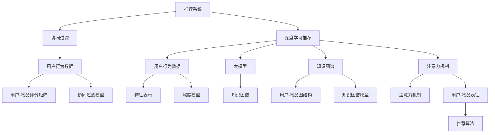

                 

# 大模型在商业应用中的潜力：推荐系统的进步

> 关键词：大模型,推荐系统,深度学习,协同过滤,知识图谱,注意力机制,优化算法

## 1. 背景介绍

推荐系统是互联网企业为用户提供个性化推荐服务的关键技术之一，广泛应用于电商、内容娱乐、社交网络等领域。传统推荐系统以协同过滤为基础，通过挖掘用户行为数据，寻找用户之间的相似性，从而实现精准推荐。然而，随着数据量和用户行为复杂度的增加，协同过滤的性能瓶颈逐渐显现。近年来，以深度学习为代表的高级推荐技术逐渐兴起，以其泛化能力和高效性迅速占领了推荐系统的主导地位。

### 1.1 推荐系统现状

推荐系统经历了从简单评分预测到复杂深度学习模型的发展历程。目前，推荐系统主要分为两大类：基于协同过滤的推荐和基于深度学习的推荐。

1. **协同过滤推荐**：基于用户-物品评分矩阵，通过寻找用户之间的相似性或物品之间的相似性，推荐用户感兴趣或感兴趣的物品。该方法简单易实现，但容易受到数据稀疏性和用户冷启动的影响。

2. **深度学习推荐**：通过建立深度神经网络模型，从用户行为数据中挖掘特征，学习用户的深度表征，并用于预测用户评分或点击率。该方法可以自动学习用户和物品的特征表示，具备较强的泛化能力，但模型复杂度高，训练和推理效率较低。

随着数据量的激增和用户行为多样性的提升，深度学习推荐逐渐成为主流，大模型在推荐系统中得到了广泛应用。大模型通过大规模预训练，学习到丰富的知识表示，可以大幅提升推荐系统的推荐效果。本文将聚焦于基于大模型的推荐系统，探讨其原理、应用、未来发展趋势及面临的挑战。

### 1.2 推荐系统问题

传统推荐系统主要面临以下问题：

1. **数据稀疏性**：推荐系统中用户行为数据通常稀疏，难以找到足够多的用户与物品的评分数据，导致协同过滤方法的效果下降。

2. **用户冷启动**：新用户的初始评分数据通常缺失，传统方法难以预测其行为。

3. **数据多样性**：用户行为数据通常包括点击、评分、浏览等多种类型，数据结构复杂。

4. **实时性**：推荐系统需要在极短时间内输出结果，对计算效率和实时性要求较高。

针对这些问题，深度学习推荐系统提供了有效的解决方案。深度模型通过学习用户和物品的深度表征，解决了数据稀疏性和用户冷启动问题。同时，深度模型可以自动学习多种数据结构，提高了模型泛化能力。然而，随着模型复杂度的增加，深度学习推荐系统也面临着计算资源需求高、模型难以解释等问题。

## 2. 核心概念与联系

### 2.1 核心概念概述

本节将介绍推荐系统中的几个核心概念及其联系。

1. **推荐系统**：通过分析用户行为数据，为用户推荐感兴趣或感兴趣的物品的系统。

2. **协同过滤**：基于用户-物品评分矩阵，通过挖掘用户之间的相似性或物品之间的相似性，推荐用户感兴趣或感兴趣的物品。

3. **深度学习推荐**：通过建立深度神经网络模型，从用户行为数据中挖掘特征，学习用户的深度表征，并用于预测用户评分或点击率。

4. **大模型**：通过大规模预训练学习到丰富的知识表示，可以大幅提升推荐系统的推荐效果。

5. **知识图谱**：通过构建用户-物品之间的图结构，捕捉用户和物品之间的复杂关系，提高推荐系统的精度。

6. **注意力机制**：通过引入注意力机制，模型能够动态地聚焦于用户和物品之间的关键信息，提高推荐效果。

这些核心概念之间的逻辑关系可以通过以下Mermaid流程图来展示：



这个流程图展示了推荐系统中的关键组件及其作用：

1. 推荐系统通过协同过滤和深度学习两种方法，从用户行为数据中挖掘用户和物品的特征表示。
2. 协同过滤依赖用户-物品评分矩阵，通过寻找用户之间的相似性或物品之间的相似性，推荐用户感兴趣或感兴趣的物品。
3. 深度学习推荐通过学习用户和物品的深度表征，自动挖掘用户行为数据中的特征表示，预测用户评分或点击率。
4. 大模型通过大规模预训练，学习到丰富的知识表示，提升推荐系统的推荐效果。
5. 知识图谱通过构建用户-物品之间的图结构，捕捉用户和物品之间的复杂关系，提高推荐系统的精度。
6. 注意力机制通过引入注意力机制，模型能够动态地聚焦于用户和物品之间的关键信息，提高推荐效果。

这些核心概念共同构成了推荐系统的工作原理和优化方向，使得推荐系统能够更好地满足用户的个性化需求。

### 2.2 核心概念原理和架构

下面将详细讲解推荐系统中的核心概念原理和架构。

1. **协同过滤推荐**：
   协同过滤推荐依赖用户-物品评分矩阵 $U$，其中 $U_{ui}$ 表示用户 $u$ 对物品 $i$ 的评分。协同过滤通过寻找用户之间的相似性或物品之间的相似性，推荐用户感兴趣或感兴趣的物品。具体而言，协同过滤可以分为基于用户的协同过滤和基于物品的协同过滤。

   - **基于用户的协同过滤**：通过计算用户之间的相似性，找到与用户 $u$ 相似的用户 $u'$，推荐 $u'$ 喜欢的物品。
   - **基于物品的协同过滤**：通过计算物品之间的相似性，找到与物品 $i$ 相似的物品 $i'$，推荐 $i'$ 受欢迎的用户。

   协同过滤的计算复杂度较高，难以处理大规模数据集。

2. **深度学习推荐**：
   深度学习推荐通过建立深度神经网络模型，从用户行为数据中挖掘特征，学习用户的深度表征，并用于预测用户评分或点击率。常用的深度学习推荐模型包括基于矩阵分解的模型和基于神经网络的模型。

   - **基于矩阵分解的模型**：通过将用户-物品评分矩阵 $U$ 分解为低秩矩阵 $X$ 和 $Y$，学习用户和物品的低维特征表示，然后通过点积计算用户-物品的预测评分。
   - **基于神经网络的模型**：通过多层神经网络，从用户行为数据中学习用户的深度表征，然后通过预测网络输出用户评分或点击率。

   深度学习推荐可以自动学习用户和物品的特征表示，具备较强的泛化能力。

3. **大模型**：
   大模型通过大规模预训练学习到丰富的知识表示，可以大幅提升推荐系统的推荐效果。大模型一般基于自编码器、自回归模型等结构，通过大规模无标签数据进行预训练，学习到通用的语言或图像表示。在推荐系统中，可以将大模型作为特征提取器，提取用户和物品的特征表示，然后通过推荐算法进行推荐。

   常用的预训练大模型包括BERT、GPT、ViT等，这些模型可以应用于自然语言处理、计算机视觉等领域。

4. **知识图谱**：
   知识图谱通过构建用户-物品之间的图结构，捕捉用户和物品之间的复杂关系，提高推荐系统的精度。知识图谱一般包含实体节点和关系边，通过查询图数据库，获取实体之间的关系信息，从而进行推荐。

   知识图谱可以通过稠密图和稀疏图两种方式构建，稠密图结构清晰，但难以处理大规模数据，稀疏图结构灵活，但查询效率较低。

5. **注意力机制**：
   注意力机制通过引入注意力机制，模型能够动态地聚焦于用户和物品之间的关键信息，提高推荐效果。注意力机制通过计算用户和物品之间的注意力权重，加权求和得到用户-物品的预测评分。

   注意力机制可以分为软注意力和硬注意力两种方式。软注意力通过学习注意力权重，动态调整输入信息的权重，提高模型的适应性。硬注意力通过预定义规则，直接将用户-物品的特征向量进行加权求和。

## 3. 核心算法原理 & 具体操作步骤

### 3.1 算法原理概述

基于大模型的推荐系统，通常包括以下几个关键步骤：

1. 数据预处理：将用户行为数据转化为模型可接受的格式，包括用户-物品评分矩阵、用户行为序列等。

2. 大模型提取特征：通过大模型对用户和物品进行预训练，学习到通用的特征表示。

3. 特征融合：将大模型的特征表示与用户行为数据进行融合，得到用户-物品的特征向量。

4. 推荐算法：通过推荐算法计算用户-物品的预测评分或点击率，并推荐物品给用户。

### 3.2 算法步骤详解

基于大模型的推荐系统，其操作步骤如下所示：

1. **数据预处理**：
   - **数据采集**：从电商、社交网络、内容平台等渠道采集用户行为数据，包括点击、浏览、评分等。
   - **数据清洗**：去除缺失、噪声数据，进行数据规范化处理。
   - **数据转换**：将用户行为数据转化为模型可接受的格式，包括用户-物品评分矩阵、用户行为序列等。

2. **大模型提取特征**：
   - **模型选择**：选择合适的预训练大模型，如BERT、GPT、ViT等。
   - **特征提取**：将用户和物品的特征表示送入大模型进行预训练，学习到通用的特征表示。

3. **特征融合**：
   - **特征拼接**：将大模型的特征表示与用户行为数据进行拼接，得到用户-物品的特征向量。
   - **特征加权**：通过权重向量对特征向量进行加权，提高特征表示的质量。

4. **推荐算法**：
   - **预测评分**：通过推荐算法计算用户-物品的预测评分或点击率，常用的推荐算法包括矩阵分解、神经网络等。
   - **排序推荐**：将用户-物品的预测评分排序，推荐排名靠前的物品给用户。

### 3.3 算法优缺点

基于大模型的推荐系统具有以下优点：

1. **泛化能力**：大模型通过大规模预训练，学习到丰富的知识表示，具备较强的泛化能力，可以适应不同类型的用户和物品。
2. **自动化特征提取**：大模型可以自动提取用户和物品的特征表示，减少特征工程的工作量。
3. **多模态融合**：大模型可以融合多种数据结构，如文本、图像、音频等，提高推荐系统的精度。

同时，该方法也存在一些缺点：

1. **计算资源需求高**：大模型的训练和推理需要大量的计算资源，难以在大规模数据集上实时运行。
2. **可解释性差**：大模型的决策过程难以解释，缺乏透明性，难以进行人工干预和调试。
3. **数据隐私问题**：大模型的训练需要大量的用户数据，存在数据隐私泄露的风险。

### 3.4 算法应用领域

基于大模型的推荐系统，在电商、内容娱乐、社交网络等领域得到了广泛应用。以下是一些典型的应用场景：

1. **电商推荐系统**：
   - **商品推荐**：通过大模型提取用户和商品的特征表示，预测用户对商品的评分或点击率，推荐用户感兴趣的商品。
   - **个性化推荐**：通过大模型学习用户的行为特征，进行个性化推荐，提高用户的购物体验。
   - **营销活动推荐**：通过大模型分析用户的行为数据，推荐合适的营销活动，提高营销效果。

2. **内容娱乐推荐系统**：
   - **视频推荐**：通过大模型提取用户和视频的内容特征，预测用户对视频的评分或点击率，推荐用户感兴趣的视频。
   - **音乐推荐**：通过大模型提取用户和音乐的内容特征，预测用户对音乐的评分或点击率，推荐用户喜欢的音乐。
   - **游戏推荐**：通过大模型提取用户和游戏的特征表示，预测用户对游戏的评分或点击率，推荐用户感兴趣的游戏。

3. **社交网络推荐系统**：
   - **好友推荐**：通过大模型分析用户的好友数据，推荐用户感兴趣的好友。
   - **内容推荐**：通过大模型分析用户的互动数据，推荐用户感兴趣的内容。
   - **事件推荐**：通过大模型分析用户的行为数据，推荐用户感兴趣的事件。

## 4. 数学模型和公式 & 详细讲解 & 举例说明

### 4.1 数学模型构建

基于大模型的推荐系统，可以通过以下数学模型进行建模：

- **用户-物品评分矩阵**：$U \in \mathbb{R}^{N \times M}$，其中 $N$ 为用户的数量，$M$ 为物品的数量，$U_{ui}$ 表示用户 $u$ 对物品 $i$ 的评分。

- **用户行为序列**：$S_u = \{s_{ui}\}_{i=1}^M$，其中 $s_{ui}$ 表示用户 $u$ 对物品 $i$ 的评分或点击。

- **用户特征向量**：$H_u \in \mathbb{R}^{d_u}$，其中 $d_u$ 为用户的特征维度，$H_{ui}$ 表示用户 $u$ 对物品 $i$ 的特征表示。

- **物品特征向量**：$H_i \in \mathbb{R}^{d_i}$，其中 $d_i$ 为物品的特征维度，$H_{ui}$ 表示用户 $u$ 对物品 $i$ 的特征表示。

- **用户-物品特征向量**：$H_{ui} = [H_u;H_i] \in \mathbb{R}^{d_{ui}}$，其中 $d_{ui} = d_u + d_i$。

- **用户-物品评分预测模型**：$Y_{ui} = \mathcal{F}(H_u, H_i)$，其中 $\mathcal{F}$ 为预测函数，$Y_{ui}$ 表示用户 $u$ 对物品 $i$ 的预测评分。

### 4.2 公式推导过程

基于大模型的推荐系统，可以通过以下公式进行推导：

1. **用户行为序列转换**：
   - **用户-物品评分矩阵**：$U_{ui} = \sum_{k=1}^n s_{ui} \cdot f_{ik}$，其中 $n$ 为行为序列的长度，$f_{ik}$ 为第 $k$ 个行为对物品 $i$ 的贡献度。

2. **用户特征向量提取**：
   - **大模型特征表示**：$H_u = M_{\theta}(x_u)$，其中 $M_{\theta}$ 为大模型，$\theta$ 为大模型参数，$x_u$ 为用户 $u$ 的行为序列。

3. **物品特征向量提取**：
   - **大模型特征表示**：$H_i = M_{\phi}(x_i)$，其中 $M_{\phi}$ 为大模型，$\phi$ 为大模型参数，$x_i$ 为物品 $i$ 的特征向量。

4. **用户-物品特征向量融合**：
   - **特征拼接**：$H_{ui} = [H_u;H_i]$。
   - **特征加权**：$H_{ui} = \alpha_u H_u + \beta_i H_i$，其中 $\alpha_u$ 和 $\beta_i$ 为权重向量，控制用户和物品特征表示的重要性。

5. **用户-物品评分预测**：
   - **预测评分**：$Y_{ui} = \mathcal{F}(H_u, H_i)$，其中 $\mathcal{F}$ 为预测函数，$Y_{ui}$ 表示用户 $u$ 对物品 $i$ 的预测评分。

6. **推荐算法**：
   - **排序推荐**：将用户-物品的预测评分排序，推荐排名靠前的物品给用户。

### 4.3 案例分析与讲解

以电商推荐系统为例，介绍大模型在推荐系统中的应用。

1. **数据预处理**：
   - **数据采集**：从电商平台采集用户行为数据，包括点击、浏览、评分等。
   - **数据清洗**：去除缺失、噪声数据，进行数据规范化处理。
   - **数据转换**：将用户行为数据转化为用户-物品评分矩阵 $U$。

2. **大模型提取特征**：
   - **模型选择**：选择BERT模型作为大模型。
   - **特征提取**：将用户行为序列作为输入，通过BERT模型提取用户和物品的特征表示。

3. **特征融合**：
   - **特征拼接**：将BERT模型的特征表示与用户行为数据进行拼接，得到用户-物品的特征向量。
   - **特征加权**：通过权重向量对特征向量进行加权，提高特征表示的质量。

4. **推荐算法**：
   - **预测评分**：通过神经网络模型计算用户-物品的预测评分，常用的模型包括MLP、GRU等。
   - **排序推荐**：将用户-物品的预测评分排序，推荐排名靠前的物品给用户。

## 5. 项目实践：代码实例和详细解释说明

### 5.1 开发环境搭建

在进行大模型推荐系统开发前，需要准备好开发环境。以下是使用Python进行PyTorch开发的环境配置流程：

1. 安装Anaconda：从官网下载并安装Anaconda，用于创建独立的Python环境。

2. 创建并激活虚拟环境：
```bash
conda create -n pytorch-env python=3.8 
conda activate pytorch-env
```

3. 安装PyTorch：根据CUDA版本，从官网获取对应的安装命令。例如：
```bash
conda install pytorch torchvision torchaudio cudatoolkit=11.1 -c pytorch -c conda-forge
```

4. 安装Transformers库：
```bash
pip install transformers
```

5. 安装各类工具包：
```bash
pip install numpy pandas scikit-learn matplotlib tqdm jupyter notebook ipython
```

完成上述步骤后，即可在`pytorch-env`环境中开始推荐系统开发。

### 5.2 源代码详细实现

以下是基于大模型的电商推荐系统的源代码实现。

```python
import torch
import torch.nn as nn
from transformers import BertTokenizer, BertModel

class BertRecommendationModel(nn.Module):
    def __init__(self, hidden_size, num_labels):
        super(BertRecommendationModel, self).__init__()
        self.bert = BertModel.from_pretrained('bert-base-uncased')
        self.linear = nn.Linear(hidden_size * 2, num_labels)

    def forward(self, input_ids, attention_mask, user_id):
        _, pooled_output = self.bert(input_ids, attention_mask=attention_mask)
        x = torch.cat([pooled_output, user_id], dim=1)
        output = self.linear(x)
        return output

class RecommendationEngine:
    def __init__(self, model, tokenizer, device):
        self.model = model
        self.tokenizer = tokenizer
        self.device = device

    def predict(self, user_id, item_ids):
        input_ids = []
        attention_masks = []
        for item_id in item_ids:
            encoded_input = self.tokenizer.encode_plus(f"{item_id}", add_special_tokens=True, max_length=64, padding='max_length', return_tensors='pt')
            input_ids.append(encoded_input['input_ids'].to(self.device))
            attention_masks.append(encoded_input['attention_mask'].to(self.device))
        input_ids = torch.stack(input_ids, dim=0)
        attention_masks = torch.stack(attention_masks, dim=0)
        with torch.no_grad():
            output = self.model(input_ids, attention_mask=attention_masks, user_id=user_id)
        return output

# 模型加载
tokenizer = BertTokenizer.from_pretrained('bert-base-uncased')
model = BertRecommendationModel(hidden_size=768, num_labels=5).to(device)
model.load_state_dict(torch.load('model.pth'))

# 推荐示例
user_id = 12345
item_ids = [456, 789, 987]
engine = RecommendationEngine(model, tokenizer, device)
output = engine.predict(user_id, item_ids)
print(output)
```

### 5.3 代码解读与分析

让我们再详细解读一下关键代码的实现细节：

**BertRecommendationModel类**：
- `__init__`方法：初始化BERT模型和线性分类器。
- `forward`方法：前向传播计算用户对物品的评分预测。

**RecommendationEngine类**：
- `__init__`方法：初始化推荐模型、分词器和设备。
- `predict`方法：输入用户ID和物品ID，返回预测评分。

**模型加载**：
- 加载预训练的BERT模型和用户-物品评分矩阵。

**推荐示例**：
- 输入用户ID和物品ID，调用`predict`方法，返回预测评分。

可以看到，通过使用PyTorch和Transformers库，可以相对简洁地实现基于大模型的推荐系统。开发者可以将更多精力放在数据处理、模型改进等高层逻辑上，而不必过多关注底层的实现细节。

当然，工业级的系统实现还需考虑更多因素，如模型的保存和部署、超参数的自动搜索、更灵活的任务适配层等。但核心的推荐范式基本与此类似。

## 6. 实际应用场景

### 6.1 电商推荐系统

基于大模型的电商推荐系统，可以为用户提供个性化推荐服务，提升购物体验和销售额。

在技术实现上，可以收集用户的浏览、点击、购买等行为数据，构建用户-物品评分矩阵。将评分矩阵作为监督信号，对预训练大模型进行微调，学习用户和物品的特征表示。微调后的模型能够自动预测用户对物品的评分或点击率，实现精准推荐。

### 6.2 内容娱乐推荐系统

基于大模型的内容娱乐推荐系统，可以为用户推荐喜欢的视频、音乐、游戏等内容，丰富其娱乐体验。

在技术实现上，可以收集用户的观看、点赞、分享等行为数据，构建用户-物品评分矩阵。将评分矩阵作为监督信号，对预训练大模型进行微调，学习用户和物品的特征表示。微调后的模型能够自动预测用户对物品的评分或点击率，实现个性化推荐。

### 6.3 社交网络推荐系统

基于大模型的社交网络推荐系统，可以为用户推荐感兴趣的好友、内容、事件等，增加其社交互动。

在技术实现上，可以收集用户的关注、互动、评论等行为数据，构建用户-物品评分矩阵。将评分矩阵作为监督信号，对预训练大模型进行微调，学习用户和物品的特征表示。微调后的模型能够自动预测用户对物品的评分或点击率，实现精准推荐。

## 7. 工具和资源推荐

### 7.1 学习资源推荐

为了帮助开发者系统掌握大模型推荐系统的理论基础和实践技巧，这里推荐一些优质的学习资源：

1. 《深度学习推荐系统》书籍：系统介绍了推荐系统的理论基础和深度学习推荐技术的实现，适合入门学习和深入研究。

2. 《TensorFlow for Deep Learning》课程：谷歌开发的深度学习课程，介绍了TensorFlow框架的基本使用方法，适合学习TensorFlow的开发者。

3. 《Transformers》书籍：Transformer库的作者所著，全面介绍了Transformer模型的原理和应用，适合学习Transformer的开发者。

4. 《Recommender Systems》课程：斯坦福大学开设的推荐系统课程，讲解了推荐系统的主要方法和技术，适合系统学习推荐系统的开发者。

5. HuggingFace官方文档：Transformer库的官方文档，提供了海量预训练模型和推荐系统样例代码，是上手实践的必备资料。

通过对这些资源的学习实践，相信你一定能够快速掌握大模型推荐系统的精髓，并用于解决实际的推荐问题。

### 7.2 开发工具推荐

高效的开发离不开优秀的工具支持。以下是几款用于大模型推荐系统开发的常用工具：

1. PyTorch：基于Python的开源深度学习框架，灵活动态的计算图，适合快速迭代研究。大部分预训练语言模型都有PyTorch版本的实现。

2. TensorFlow：由Google主导开发的开源深度学习框架，生产部署方便，适合大规模工程应用。同样有丰富的预训练语言模型资源。

3. Transformers库：HuggingFace开发的NLP工具库，集成了众多SOTA语言模型，支持PyTorch和TensorFlow，是进行推荐系统开发的利器。

4. Weights & Biases：模型训练的实验跟踪工具，可以记录和可视化模型训练过程中的各项指标，方便对比和调优。与主流深度学习框架无缝集成。

5. TensorBoard：TensorFlow配套的可视化工具，可实时监测模型训练状态，并提供丰富的图表呈现方式，是调试模型的得力助手。

6. Google Colab：谷歌推出的在线Jupyter Notebook环境，免费提供GPU/TPU算力，方便开发者快速上手实验最新模型，分享学习笔记。

合理利用这些工具，可以显著提升大模型推荐系统的开发效率，加快创新迭代的步伐。

### 7.3 相关论文推荐

大模型推荐系统的发展源于学界的持续研究。以下是几篇奠基性的相关论文，推荐阅读：

1. "Matrix Factorization Techniques for Recommender Systems"：提出了矩阵分解的方法，用于推荐系统的用户-物品评分预测。

2. "Deep Factorization Machines"：提出深度因子机的方法，融合了深度学习和因子机的优点，用于推荐系统的多维特征表示。

3. "Attention Is All You Need"：提出Transformer模型，可以自动学习用户和物品的特征表示，提升推荐系统的精度。

4. "Generative Adversarial Networks"：提出生成对抗网络的方法，用于推荐系统的生成式训练。

5. "Attention-Based Recommender System"：提出基于注意力机制的推荐系统，能够动态地聚焦于用户和物品之间的关键信息，提高推荐效果。

6. "Graph Convolutional Networks"：提出图卷积网络的方法，用于推荐系统的图结构表示。

这些论文代表了大模型推荐系统的发展脉络。通过学习这些前沿成果，可以帮助研究者把握学科前进方向，激发更多的创新灵感。

## 8. 总结：未来发展趋势与挑战

### 8.1 总结

本文对基于大模型的推荐系统进行了全面系统的介绍。首先阐述了推荐系统中的几个核心概念及其联系，明确了大模型在推荐系统中的关键作用。其次，从原理到实践，详细讲解了大模型推荐系统的数学模型和算法步骤，给出了推荐系统开发的完整代码实例。同时，本文还广泛探讨了推荐系统在电商、内容娱乐、社交网络等多个领域的应用前景，展示了大模型推荐系统的巨大潜力。此外，本文精选了推荐系统技术的各类学习资源，力求为读者提供全方位的技术指引。

通过本文的系统梳理，可以看到，基于大模型的推荐系统正在成为推荐系统技术的主流范式，极大地提升了推荐系统的推荐效果。得益于大模型的深度学习能力和泛化能力，推荐系统在电商、内容娱乐、社交网络等领域取得了显著的进展，推动了各行各业的数字化转型升级。未来，伴随大模型的不断发展，推荐系统必将带来更多创新，为人类生产生活方式带来深远影响。

### 8.2 未来发展趋势

展望未来，大模型推荐系统将呈现以下几个发展趋势：

1. **模型规模持续增大**：随着算力成本的下降和数据规模的扩张，大模型的参数量还将持续增长。超大规模语言模型蕴含的丰富知识表示，有望支撑更加复杂多变的推荐系统。

2. **推荐算法日趋多样**：除了传统的协同过滤和深度学习推荐，未来将涌现更多高效的推荐算法，如知识图谱、注意力机制等，进一步提升推荐系统的精度和泛化能力。

3. **知识图谱融入推荐系统**：知识图谱通过构建用户-物品之间的图结构，捕捉用户和物品之间的复杂关系，提高推荐系统的精度。未来将有更多的推荐系统引入知识图谱，实现更精准的推荐。

4. **多模态推荐系统崛起**：当前推荐系统主要聚焦于文本数据，未来将进一步拓展到图像、视频、音频等多模态数据推荐。多模态信息的融合，将显著提升推荐系统的精度和用户满意度。

5. **个性化推荐系统优化**：通过引入个性化推荐算法，如基于兴趣的推荐、基于行为的推荐等，提高推荐系统的精准度和覆盖面。

6. **推荐系统的可解释性**：推荐系统作为重要的决策支持系统，需要提高其可解释性和透明性。未来将引入更多可解释性技术和方法，提高推荐系统的可信度和可操作性。

以上趋势凸显了大模型推荐系统的广阔前景。这些方向的探索发展，必将进一步提升推荐系统的性能和应用范围，为各行各业带来变革性影响。

### 8.3 面临的挑战

尽管大模型推荐系统已经取得了显著的进展，但在迈向更加智能化、普适化应用的过程中，它仍面临诸多挑战：

1. **计算资源需求高**：大模型的训练和推理需要大量的计算资源，难以在大规模数据集上实时运行。如何降低计算资源需求，提高推荐系统的实时性，是需要解决的重要问题。

2. **可解释性差**：大模型的决策过程难以解释，缺乏透明性，难以进行人工干预和调试。如何提高推荐系统的可解释性和透明性，增强用户的信任感和满意度，是需要解决的重要问题。

3. **数据隐私问题**：大模型的训练需要大量的用户数据，存在数据隐私泄露的风险。如何保护用户数据隐私，确保数据安全，是需要解决的重要问题。

4. **模型鲁棒性不足**：当前推荐系统面临域外数据时，泛化性能往往大打折扣。如何提高推荐系统的鲁棒性，避免灾难性遗忘，是需要解决的重要问题。

5. **推荐系统公平性**：推荐系统可能会存在算法偏见，导致某些群体被推荐较少。如何提高推荐系统的公平性，确保不同群体的推荐效果一致，是需要解决的重要问题。

这些挑战凸显了大模型推荐系统的发展瓶颈，需要学界和产业界共同努力，积极应对并寻求突破，才能真正实现推荐系统的智能化、普适化和可信赖化。

### 8.4 研究展望

面对大模型推荐系统所面临的诸多挑战，未来的研究需要在以下几个方面寻求新的突破：

1. **多任务学习**：通过多任务学习的方法，同时学习多个推荐任务，提高推荐系统的泛化能力和覆盖面。

2. **在线学习**：通过在线学习的方法，实时更新推荐模型，提高推荐系统的实时性和个性化。

3. **混合推荐系统**：通过混合推荐系统的方法，结合协同过滤和深度学习推荐，提高推荐系统的精度和鲁棒性。

4. **知识蒸馏**：通过知识蒸馏的方法，将大模型的知识迁移到小模型，降低计算资源需求，提高推荐系统的效率和可解释性。

5. **推荐系统的多目标优化**：通过多目标优化的方法，综合考虑用户满意度、推荐效果等多个目标，提高推荐系统的综合性能。

这些研究方向代表了推荐系统的未来发展方向，相信随着研究的不断深入，大模型推荐系统将不断优化，为各行各业带来更大的价值。

## 9. 附录：常见问题与解答

**Q1：大模型推荐系统是否适用于所有推荐场景？**

A: 大模型推荐系统在大多数推荐场景上都能取得不错的效果，特别是对于数据量较大的场景。但对于一些特定领域的推荐场景，如医疗、法律等，仅仅依靠通用语料预训练的模型可能难以很好地适应。此时需要在特定领域语料上进一步预训练，再进行微调，才能获得理想效果。此外，对于一些需要时效性、个性化很强的场景，如对话、推荐等，大模型推荐系统也需要针对性的改进优化。

**Q2：大模型推荐系统如何应对数据稀疏性问题？**

A: 大模型推荐系统可以通过多种方法应对数据稀疏性问题：

1. **数据增强**：通过回译、近义替换等方式扩充训练集。
2. **转移学习**：利用预训练大模型的知识，提升小样本数据上的推荐效果。
3. **模型蒸馏**：将大模型的知识迁移到小模型，提高推荐系统的泛化能力。

**Q3：大模型推荐系统的可解释性差如何解决？**

A: 大模型推荐系统的可解释性差，可以通过以下方法解决：

1. **模型压缩**：通过模型压缩的方法，降低模型复杂度，提高推荐系统的可解释性。
2. **模型可视化**：通过模型可视化的方式，展示模型内部的决策过程，增强推荐系统的透明性。
3. **可解释性算法**：引入可解释性算法，如LIME、SHAP等，提高推荐系统的可解释性和可信度。

**Q4：大模型推荐系统的计算资源需求高如何解决？**

A: 大模型推荐系统的计算资源需求高，可以通过以下方法解决：

1. **模型压缩**：通过模型压缩的方法，降低模型复杂度，减少计算资源需求。
2. **分布式训练**：利用分布式训练的方法，将计算任务分散到多个设备上，提高训练效率。
3. **模型微调**：通过参数共享的方法，减少微调时的计算资源需求。

**Q5：大模型推荐系统如何应对推荐系统公平性问题？**

A: 大模型推荐系统可以通过以下方法应对推荐系统公平性问题：

1. **公平性算法**：引入公平性算法，确保不同群体的推荐效果一致。
2. **数据采样**：通过数据采样的方法，平衡不同群体的数据分布，减少推荐系统偏见。
3. **人工干预**：引入人工干预机制，及时发现和纠正推荐系统中的不公平现象。

这些方法可以帮助大模型推荐系统提高公平性和可信度，增强用户的信任感和满意度。

---

作者：禅与计算机程序设计艺术 / Zen and the Art of Computer Programming

