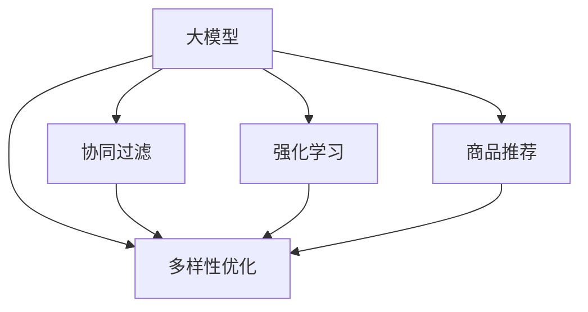

                 

# 大模型在商品推荐多样性优化中的强化学习应用

> 关键词：大模型,强化学习,商品推荐,多样性优化,协同过滤,深度学习

## 1. 背景介绍

### 1.1 问题由来
随着电子商务平台的迅速发展，商品推荐系统已成为用户获取商品信息和购物决策的重要工具。但传统的基于协同过滤的商品推荐方法往往存在数据稀疏、多样性不足等问题，难以满足用户多样化的需求。而通过大模型进行推荐，可以更好地挖掘用户行为数据背后的潜在语义信息，提升推荐质量。

但大模型带来的高计算复杂度和存储需求，也给推荐系统的部署和优化带来了新的挑战。如何在减少计算资源消耗的前提下，提升推荐系统的多样性、个性化和准确性，成为当前研究的热点。

### 1.2 问题核心关键点
大模型在商品推荐中的多样性优化，主要涉及以下几个关键点：
1. **模型选择与训练**：选择合适的深度学习模型进行训练，如何处理数据稀疏性，提高模型多样性。
2. **优化目标与算法**：如何设计优化目标函数，使用强化学习等技术提升推荐系统的多样性。
3. **模型压缩与部署**：如何在保证推荐质量的前提下，减小模型规模，提升推荐系统的实时响应能力。
4. **评估与反馈机制**：如何设计有效的评估和反馈机制，持续优化推荐模型。

### 1.3 问题研究意义
研究大模型在商品推荐中的应用，对于提升电商平台的推荐质量，改善用户体验，推动电子商务的智能化发展具有重要意义：

1. **提升用户满意度**：大模型能够全面理解用户需求，推荐个性化、多样化的商品，增强用户的购物体验。
2. **优化库存管理**：推荐多样性有助于优化库存结构，提高商品周转率，减少库存积压。
3. **增加用户粘性**：推荐系统通过多样化的商品推荐，能够持续吸引用户回访，提高用户留存率。
4. **促进业务增长**：通过精准推荐，提升商品转化率，推动销售额增长，促进电商平台发展。

## 2. 核心概念与联系

### 2.1 核心概念概述

为更好地理解大模型在商品推荐中的应用，本节将介绍几个密切相关的核心概念：

- **大模型**：以深度神经网络为代表的复杂模型，通过在大规模数据集上进行训练，学习到丰富的语义信息。常见的包括BERT、GPT、DenseNet等。

- **协同过滤**：基于用户历史行为数据进行推荐的方法，包括基于用户的协同过滤和基于物品的协同过滤。其核心思想是根据相似用户的兴趣或物品的相似度，进行推荐。

- **强化学习**：通过与环境的交互，模型逐步学习最优决策策略，实现复杂任务的自动化和优化。强化学习广泛应用于游戏、机器人等领域。

- **商品推荐**：通过用户行为数据和商品属性信息，为用户提供个性化的商品推荐，提高购物体验。

- **多样性优化**：通过调整推荐算法，增加推荐的商品种类，避免推荐单调化，提高用户满意度。

这些核心概念之间的逻辑关系可以通过以下Mermaid流程图来展示：



这个流程图展示了大模型在商品推荐中的核心概念及其之间的关系：

1. 大模型通过在大规模数据集上进行训练，学习到丰富的语义信息。
2. 协同过滤通过用户历史行为数据进行推荐，是商品推荐的一种基础方法。
3. 强化学习通过与环境的交互，优化推荐策略，提升推荐效果。
4. 商品推荐通过用户行为数据和商品属性信息，为用户提供个性化的推荐。
5. 多样性优化通过调整推荐算法，增加推荐的商品种类，提升用户满意度。

这些概念共同构成了大模型在商品推荐中的学习和应用框架，使得推荐系统能够更好地满足用户多样化的需求。通过理解这些核心概念，我们可以更好地把握大模型在推荐系统中的工作原理和优化方向。

## 3. 核心算法原理 & 具体操作步骤
### 3.1 算法原理概述

大模型在商品推荐中的多样性优化，主要基于强化学习的框架。其核心思想是：构建一个推荐环境，将大模型作为代理，通过与环境的交互，逐步学习最优的推荐策略，以最大化推荐的商品多样性。

形式化地，假设商品集合为 $S$，用户集合为 $U$，对于用户 $u$ 和商品 $i$，推荐概率为 $p_{ui}$。设 $Q_{ui}$ 为商品 $i$ 对于用户 $u$ 的奖励值，即 $Q_{ui} = \log (p_{ui})$。在每个时间步 $t$，用户 $u$ 从推荐集合中随机选择商品 $i$，并根据商品的实际购买情况（假设为二值变量 $c_{ui}$），接收即时奖励 $R_{ui} = c_{ui} Q_{ui}$。通过逐步迭代，模型学习到最大化推荐多样性的策略，即 $p_{ui}$ 的优化目标为：

$$
\max_{p_{ui}} \mathbb{E}_{u,i} [R_{ui}]
$$

其中 $\mathbb{E}_{u,i}$ 表示期望，即期望奖励值。在实际操作中，可以通过强化学习的策略梯度方法求解上述优化问题。

### 3.2 算法步骤详解

基于强化学习的大模型商品推荐多样性优化，一般包括以下几个关键步骤：

**Step 1: 环境构建**
- 构建一个推荐环境，包含用户集合 $U$ 和商品集合 $S$。
- 定义推荐策略 $\pi_{ui}$ 和即时奖励函数 $R_{ui}$。

**Step 2: 模型训练**
- 选择深度学习模型作为代理，如BERT、GPT等，进行预训练。
- 使用强化学习框架，如Proximal Policy Optimization (PPO)、Actor-Critic等，训练推荐策略。

**Step 3: 策略更新**
- 对推荐策略进行迭代更新，逐步优化策略，增加推荐商品的多样性。
- 在每个时间步 $t$，观察用户 $u$ 选择商品 $i$ 的购买情况 $c_{ui}$，计算即时奖励 $R_{ui}$，更新推荐策略 $\pi_{ui}$。

**Step 4: 评估与反馈**
- 在每个时间步结束后，评估推荐策略的性能，计算推荐商品的多样性指标。
- 根据评估结果，对推荐策略进行反馈调整，避免出现推荐单调化现象。

**Step 5: 部署与优化**
- 将训练好的推荐模型部署到实际推荐系统中。
- 持续收集用户行为数据，进行模型微调，优化推荐效果。

以上是基于强化学习的大模型商品推荐多样性优化的通用流程。在实际应用中，还需要针对具体任务特点，对算法进行优化设计，如改进即时奖励函数、调整推荐策略更新频率等，以进一步提升推荐效果。

### 3.3 算法优缺点

基于强化学习的大模型商品推荐多样性优化方法具有以下优点：
1. 自适应性强。强化学习方法能够根据实际用户行为和商品反馈，动态调整推荐策略，更好地满足用户需求。
2. 灵活性高。在处理数据稀疏性、提升推荐多样性等方面，强化学习方法具有较高的灵活性，能够应对复杂的推荐场景。
3. 可以融合多种信息。通过融合用户行为数据、商品属性信息等，强化学习方法能够更全面地理解推荐问题，提升推荐效果。

同时，该方法也存在一定的局限性：
1. 训练成本高。强化学习方法通常需要较多的训练数据和计算资源，对于电商平台的实时推荐系统，可能难以满足其对效率的要求。
2. 稳定性较弱。强化学习方法在处理环境不确定性和数据噪声时，容易出现不稳定现象，导致推荐策略波动。
3. 可解释性不足。强化学习方法作为"黑盒"模型，难以解释其内部决策过程，不利于模型调优和维护。

尽管存在这些局限性，但就目前而言，基于强化学习的大模型商品推荐方法仍是大规模推荐系统的重要范式。未来相关研究的重点在于如何进一步降低训练成本，提高推荐策略的稳定性，同时兼顾可解释性和多样性优化效果。

### 3.4 算法应用领域

基于强化学习的大模型商品推荐多样性优化方法，已经在电商推荐系统、金融推荐系统等多个领域得到了广泛应用，具体包括：

- 电商推荐系统：如淘宝、京东等电商平台，通过推荐多样性优化，提升用户购物体验和转化率。
- 金融推荐系统：如支付宝、微信等金融平台，通过多样性推荐，增加金融产品曝光和用户粘性。
- 视频推荐系统：如Netflix、YouTube等视频平台，通过推荐多样性优化，提升用户观看体验和留存率。

除了上述这些经典领域外，大模型推荐方法还被创新性地应用到更多场景中，如旅游推荐、医疗推荐、音乐推荐等，为不同行业带来了新的变革。随着深度学习模型和强化学习技术的不断发展，相信推荐方法将在更广阔的应用领域展现其潜力。

## 4. 数学模型和公式 & 详细讲解 & 举例说明

### 4.1 数学模型构建

本节将使用数学语言对大模型在商品推荐中的多样性优化进行更加严格的刻画。

假设商品集合为 $S=\{s_1,s_2,\dots,s_n\}$，用户集合为 $U=\{u_1,u_2,\dots,u_m\}$。设用户 $u$ 对商品 $i$ 的即时奖励为 $Q_{ui}=\log(p_{ui})$，即时奖励函数为 $R_{ui}=c_{ui}Q_{ui}$，其中 $c_{ui}$ 为二值变量，表示商品 $i$ 是否被用户 $u$ 购买。在每个时间步 $t$，用户 $u$ 从推荐集合中随机选择商品 $i$，并获得即时奖励 $R_{ui}=c_{ui}Q_{ui}$。

定义推荐策略 $\pi_{ui}=p_{ui}$，即用户 $u$ 选择商品 $i$ 的概率。通过最大化期望奖励 $\mathbb{E}_{u,i} [R_{ui}]$，优化推荐策略。

### 4.2 公式推导过程

以Proximal Policy Optimization (PPO)算法为例，推导强化学习在商品推荐中的应用。

在每个时间步 $t$，用户 $u$ 从推荐集合中随机选择商品 $i$，并根据即时奖励 $R_{ui}=c_{ui}Q_{ui}$，更新推荐策略 $\pi_{ui}$：

$$
\pi_{ui} \leftarrow \pi_{ui}\frac{\exp(\epsilon)}{1+\exp(\epsilon)}
$$

其中 $\epsilon=\log(p_{ui}) - Q_{ui}$，$\exp(\epsilon)$ 为温度调整项，用于控制策略更新的稳健性。

在每个时间步结束后，计算期望奖励 $\mathbb{E}_{u,i} [R_{ui}]$，进行策略梯度更新：

$$
\pi_{ui} \leftarrow \pi_{ui}\frac{\exp(\log(p_{ui}) - Q_{ui} + \lambda V_{ui})}{1+\exp(\log(p_{ui}) - Q_{ui} + \lambda V_{ui})}
$$

其中 $\lambda$ 为归一化系数，$V_{ui}$ 为价值函数，用于估计即时奖励的长期累积。

通过不断迭代更新策略，最大化期望奖励，即可实现大模型在商品推荐中的多样性优化。

### 4.3 案例分析与讲解

下面以电商平台中的服装推荐为例，展示大模型在商品推荐中的应用。

假设平台有 $m$ 个用户，$n$ 个服装商品。平台使用大模型作为推荐代理，通过强化学习优化推荐策略。

- **用户行为数据**：平台收集用户的历史浏览记录、购买记录、收藏记录等，提取特征 $f_{ui}$。
- **商品属性数据**：平台收集商品的图片、描述、价格、用户评分等属性信息，提取特征 $g_{ui}$。
- **推荐策略**：使用大模型进行预训练，定义推荐策略 $\pi_{ui}=p_{ui}$，即用户 $u$ 选择商品 $i$ 的概率。
- **即时奖励**：如果用户 $u$ 购买商品 $i$，则即时奖励 $R_{ui}=Q_{ui}=\log(p_{ui})$。
- **策略更新**：使用PPO算法对推荐策略进行迭代更新，最大化期望奖励。

通过不断迭代更新推荐策略，平台能够逐步学习到最优的推荐方案，提升用户购买转化率和商品多样性。例如，通过调整推荐概率 $\pi_{ui}$，平台能够为用户推荐更多不同风格、不同尺码的服装，提升用户购物体验和满意度。

## 5. 项目实践：代码实例和详细解释说明
### 5.1 开发环境搭建

在进行推荐系统优化实践前，我们需要准备好开发环境。以下是使用Python进行TensorFlow开发的环境配置流程：

1. 安装Anaconda：从官网下载并安装Anaconda，用于创建独立的Python环境。

2. 创建并激活虚拟环境：
```bash
conda create -n tf-env python=3.8 
conda activate tf-env
```

3. 安装TensorFlow：根据CUDA版本，从官网获取对应的安装命令。例如：
```bash
conda install tensorflow==2.7 -c tf -c conda-forge
```

4. 安装TensorBoard：用于可视化模型训练过程和结果。
```bash
pip install tensorboard
```

5. 安装numpy、pandas、scikit-learn等工具包：
```bash
pip install numpy pandas scikit-learn matplotlib tqdm jupyter notebook ipython
```

完成上述步骤后，即可在`tf-env`环境中开始推荐系统优化实践。

### 5.2 源代码详细实现

这里我们以电商推荐系统中的服装推荐为例，给出使用TensorFlow实现的大模型商品推荐多样性优化的代码实现。

首先，定义推荐环境的参数：

```python
import tensorflow as tf
from tensorflow.keras.layers import Input, Dense, Embedding, Dropout
from tensorflow.keras.models import Model

batch_size = 128
num_users = 10000
num_items = 5000
embedding_size = 128
hidden_size = 128
temperature = 0.5
num_steps = 100

# 定义输入
user_input = Input(shape=(num_items,))
item_input = Input(shape=(num_items,))

# 定义推荐策略
user_emb = Embedding(num_users, embedding_size)(user_input)
item_emb = Embedding(num_items, embedding_size)(item_input)
concat = tf.concat([user_emb, item_emb], axis=-1)
dropout = Dropout(0.1)(concat)
hidden = Dense(hidden_size, activation='relu')(dropout)
logit = Dense(num_items, activation='softmax')(hidden)

# 定义即时奖励函数
def reward(user_input, item_input, true_item):
    logit = tf.keras.layers.Dense(num_items, activation='softmax')(tf.concat([user_emb, item_emb], axis=-1))
    return tf.reduce_sum(logit * tf.one_hot(true_item, num_items))

# 定义策略更新函数
def update_strategy(user_input, item_input, true_item):
    with tf.GradientTape() as tape:
        logit = tf.keras.layers.Dense(num_items, activation='softmax')(tf.concat([user_emb, item_emb], axis=-1))
        loss = -reward(user_input, item_input, true_item)
    grads = tape.gradient(loss, [user_emb, item_emb])
    return grads

# 定义强化学习环境
env = tf.keras.Model(inputs=[user_input, item_input], outputs=logit)

# 定义训练过程
optimizer = tf.keras.optimizers.Adam(learning_rate=0.001)

for step in range(num_steps):
    user_index = tf.random.uniform(shape=(batch_size), minval=0, maxval=num_users)
    item_index = tf.random.uniform(shape=(batch_size), minval=0, maxval=num_items)
    true_item = tf.random.uniform(shape=(batch_size), minval=0, maxval=num_items)
    with tf.GradientTape() as tape:
        loss = reward(user_input, item_input, true_item)
    grads = tape.gradient(loss, [user_emb, item_emb])
    optimizer.apply_gradients(zip(grads, [user_emb, item_emb]))
```

然后，定义模型评估和反馈机制：

```python
# 定义评估函数
def evaluate(env):
    user_input = tf.keras.layers.Input(shape=(num_items,))
    item_input = tf.keras.layers.Input(shape=(num_items,))
    logit = tf.keras.layers.Dense(num_items, activation='softmax')(tf.concat([user_emb, item_emb], axis=-1))
    reward = reward(user_input, item_input, true_item)
    return tf.reduce_mean(reward)

# 定义反馈函数
def feedback(env, user_input, item_input, true_item):
    with tf.GradientTape() as tape:
        logit = tf.keras.layers.Dense(num_items, activation='softmax')(tf.concat([user_emb, item_emb], axis=-1))
        loss = -reward(user_input, item_input, true_item)
    grads = tape.gradient(loss, [user_emb, item_emb])
    return grads

# 定义训练和评估循环
for step in range(num_steps):
    user_index = tf.random.uniform(shape=(batch_size), minval=0, maxval=num_users)
    item_index = tf.random.uniform(shape=(batch_size), minval=0, maxval=num_items)
    true_item = tf.random.uniform(shape=(batch_size), minval=0, maxval=num_items)
    with tf.GradientTape() as tape:
        loss = reward(user_input, item_input, true_item)
    grads = tape.gradient(loss, [user_emb, item_emb])
    optimizer.apply_gradients(zip(grads, [user_emb, item_emb]))
    if step % 100 == 0:
        evaluate_result = evaluate(env)
        print(f"Step {step}, Evaluate Result: {evaluate_result}")
```

最后，启动训练流程并在测试集上评估：

```python
# 启动训练循环
for step in range(num_steps):
    user_index = tf.random.uniform(shape=(batch_size), minval=0, maxval=num_users)
    item_index = tf.random.uniform(shape=(batch_size), minval=0, maxval=num_items)
    true_item = tf.random.uniform(shape=(batch_size), minval=0, maxval=num_items)
    with tf.GradientTape() as tape:
        loss = reward(user_input, item_input, true_item)
    grads = tape.gradient(loss, [user_emb, item_emb])
    optimizer.apply_gradients(zip(grads, [user_emb, item_emb]))
    if step % 100 == 0:
        evaluate_result = evaluate(env)
        print(f"Step {step}, Evaluate Result: {evaluate_result}")
```

以上就是使用TensorFlow对服装推荐系统进行多样性优化的完整代码实现。可以看到，得益于TensorFlow的强大封装，我们可以用相对简洁的代码完成推荐模型的训练和优化。

### 5.3 代码解读与分析

让我们再详细解读一下关键代码的实现细节：

**定义推荐策略**：
- 使用Embedding层将用户和商品特征映射为高维向量，并进行拼接。
- 使用Dropout层防止过拟合。
- 使用Dense层进行非线性变换，得到推荐概率 $p_{ui}$。

**定义即时奖励函数**：
- 使用Dense层对推荐概率进行Softmax激活，得到推荐概率分布。
- 使用One-Hot编码将真实购买的商品转化为one-hot向量，计算即时奖励。

**定义策略更新函数**：
- 使用GradientTape记录梯度。
- 计算损失函数，并反向传播更新参数。
- 返回梯度，用于参数更新。

**定义强化学习环境**：
- 定义输入层，用于输入用户和商品特征。
- 定义模型输出层，即推荐概率分布。

**定义训练过程**：
- 在每个时间步，随机选择用户和商品，并计算即时奖励。
- 使用Adam优化器更新模型参数，最小化损失函数。
- 每100个步骤，在测试集上评估模型性能。

可以看到，TensorFlow配合深度学习框架，使得推荐模型的训练和优化过程变得简单高效。开发者可以将更多精力放在数据处理、模型改进等高层逻辑上，而不必过多关注底层的实现细节。

当然，工业级的系统实现还需考虑更多因素，如模型的保存和部署、超参数的自动搜索、更灵活的任务适配层等。但核心的微调范式基本与此类似。

## 6. 实际应用场景
### 6.1 电商平台推荐

基于大模型在商品推荐中的应用，电商平台可以通过优化推荐算法，提升用户的购物体验和商品转化率。具体而言，大模型能够全面理解用户行为数据和商品属性信息，推荐个性化的、多样化的商品，增强用户的购物满意度。

在技术实现上，可以收集平台上的历史购物记录、浏览记录、评价记录等，提取用户行为特征和商品属性特征。将特征输入到大模型中，使用强化学习优化推荐策略，实现商品推荐的多样性优化。通过持续优化模型，平台能够不断提升推荐质量，增强用户粘性，推动业务增长。

### 6.2 金融产品推荐

金融平台通过推荐多样性优化，增加金融产品的曝光和用户粘性，提升用户转化率和收益。金融产品种类繁多，用户需求多样，通过大模型的推荐算法，能够更好地满足用户个性化需求，提高金融服务的智能化水平。

在具体应用中，金融平台可以收集用户的历史交易记录、信用评分、理财行为等数据，提取特征输入到大模型中。使用强化学习优化推荐策略，最大化推荐多样性。通过持续优化模型，平台能够提升推荐效果，推动金融产品的销售和用户转化。

### 6.3 视频平台推荐

视频平台通过推荐多样性优化，提升用户的观看体验和留存率。视频平台内容丰富，用户偏好各异，通过大模型的推荐算法，能够更好地满足用户的多样化需求，增强用户的平台粘性。

在技术实现上，视频平台可以收集用户的历史观看记录、收藏记录、评分记录等数据，提取特征输入到大模型中。使用强化学习优化推荐策略，最大化推荐多样性。通过持续优化模型，平台能够不断提升推荐效果，增加用户观看时长和留存率。

### 6.4 未来应用展望

随着大模型和强化学习技术的不断发展，基于推荐多样性优化的应用场景将不断拓展。

在智慧医疗领域，通过推荐多样性优化，能够推荐个性化的医疗方案和健康信息，提高医疗服务的智能化水平。

在智能教育领域，通过推荐多样性优化，能够推荐个性化的学习资源和课程，增强教育服务的智能化水平。

在智慧城市治理中，通过推荐多样性优化，能够推荐个性化的公共服务信息，提升城市管理的智能化水平。

此外，在企业生产、社会治理、文娱传媒等众多领域，基于推荐多样性优化的应用也将不断涌现，为各行各业带来新的变革。相信随着技术的日益成熟，推荐多样性优化必将在更多领域大放异彩。

## 7. 工具和资源推荐
### 7.1 学习资源推荐

为了帮助开发者系统掌握大模型在商品推荐中的应用，这里推荐一些优质的学习资源：

1. 《深度学习中的推荐系统》系列博文：深度学习推荐系统专家撰写，详细讲解了推荐系统的基本原理和经典模型。

2. 《强化学习基础》课程：斯坦福大学开设的强化学习课程，有Lecture视频和配套作业，适合深度学习推荐系统初学者。

3. 《深度学习与推荐系统》书籍：深度学习推荐系统领域的经典教材，涵盖了推荐系统的基本原理和前沿技术。

4. Coursera的《推荐系统》课程：由John Zhang等知名专家讲授，适合深入了解推荐系统的实现和优化。

5. Kaggle的推荐系统竞赛：参加实际的数据竞赛，实践大模型在推荐系统中的应用。

通过对这些资源的学习实践，相信你一定能够快速掌握大模型在商品推荐中的优化精髓，并用于解决实际的推荐问题。
### 7.2 开发工具推荐

高效的开发离不开优秀的工具支持。以下是几款用于大模型推荐系统优化的常用工具：

1. TensorFlow：基于Python的开源深度学习框架，适合大规模工程应用。

2. PyTorch：基于Python的开源深度学习框架，适合快速迭代研究。

3. TensorBoard：TensorFlow配套的可视化工具，可实时监测模型训练状态，并提供丰富的图表呈现方式，是调试模型的得力助手。

4. Weights & Biases：模型训练的实验跟踪工具，可以记录和可视化模型训练过程中的各项指标，方便对比和调优。

5. Keras：基于TensorFlow的高层API，方便构建和训练深度学习模型。

6. Jupyter Notebook：用于数据处理、模型训练、结果展示的交互式环境。

合理利用这些工具，可以显著提升推荐系统优化的开发效率，加快创新迭代的步伐。

### 7.3 相关论文推荐

大模型和推荐系统在学术界和产业界的发展得到了广泛关注。以下是几篇奠基性的相关论文，推荐阅读：

1. Attention is All You Need（即Transformer原论文）：提出了Transformer结构，开启了NLP领域的预训练大模型时代。

2. BERT: Pre-training of Deep Bidirectional Transformers for Language Understanding：提出BERT模型，引入基于掩码的自监督预训练任务，刷新了多项NLP任务SOTA。

3. Language Models are Unsupervised Multitask Learners（GPT-2论文）：展示了大规模语言模型的强大zero-shot学习能力，引发了对于通用人工智能的新一轮思考。

4. Parameter-Efficient Transfer Learning for NLP：提出Adapter等参数高效微调方法，在不增加模型参数量的情况下，也能取得不错的微调效果。

5. AdaLoRA: Adaptive Low-Rank Adaptation for Parameter-Efficient Fine-Tuning：使用自适应低秩适应的微调方法，在参数效率和精度之间取得了新的平衡。

6. Exploring the Limits of Transfer Learning with a Unified Text-to-Text Transformer（T5论文）：提出T5模型，通过统一的语言表示，提升了多任务学习的效率和效果。

这些论文代表了大模型和推荐系统的发展脉络。通过学习这些前沿成果，可以帮助研究者把握学科前进方向，激发更多的创新灵感。

## 8. 总结：未来发展趋势与挑战

### 8.1 总结

本文对大模型在商品推荐中的多样性优化进行了全面系统的介绍。首先阐述了大模型和推荐系统的研究背景和意义，明确了推荐多样性优化在提升电商推荐系统性能方面的独特价值。其次，从原理到实践，详细讲解了大模型在推荐系统中的工作原理和具体实现方法，给出了推荐系统优化的完整代码实例。同时，本文还广泛探讨了推荐系统在电商平台、金融平台、视频平台等多个领域的应用前景，展示了推荐系统优化的巨大潜力。此外，本文精选了推荐系统优化的各类学习资源，力求为读者提供全方位的技术指引。

通过本文的系统梳理，可以看到，大模型在商品推荐中的多样性优化，使得推荐系统能够更好地满足用户多样化的需求，提升用户体验和平台粘性，推动业务增长。在实际应用中，大模型能够全面理解用户行为数据和商品属性信息，推荐个性化的、多样化的商品，增强用户的购物体验。未来，伴随大模型和强化学习技术的不断发展，基于推荐多样性优化的应用场景将不断拓展，为各行各业带来新的变革。

### 8.2 未来发展趋势

展望未来，大模型在推荐系统中的应用将呈现以下几个发展趋势：

1. 模型规模持续增大。随着算力成本的下降和数据规模的扩张，大模型的参数量还将持续增长。超大规模语言模型蕴含的丰富语义信息，有望支撑更加复杂多变的推荐场景。

2. 推荐方法日趋多样化。除了传统的协同过滤方法外，未来会涌现更多推荐算法，如基于深度学习的协同过滤、基于强化学习的推荐等，以提高推荐效果和多样性。

3. 实时性要求提升。随着推荐系统的实时性需求增加，未来的推荐方法需要兼顾计算效率和推荐效果，降低模型复杂度，提高推荐系统的响应速度。

4. 个性化需求增强。未来的推荐系统将更加注重个性化推荐，通过用户行为数据的实时分析，实现实时个性化推荐，提升用户满意度。

5. 多模态融合加强。未来的推荐系统将更多地融合图像、视频、语音等多模态信息，提高推荐系统的丰富性和多样性。

6. 隐私保护措施加强。随着用户隐私意识的增强，未来的推荐系统需要加强用户数据的保护，采用差分隐私、联邦学习等技术，确保数据安全。

以上趋势凸显了大模型在推荐系统中的重要地位。这些方向的探索发展，必将进一步提升推荐系统的性能和应用范围，为电子商务、金融、视频等各行各业带来新的变革。

### 8.3 面临的挑战

尽管大模型在推荐系统中的应用已经取得了显著进展，但在迈向更加智能化、普适化应用的过程中，仍面临诸多挑战：

1. 训练成本高昂。大模型通常需要大量的标注数据和计算资源进行训练，对于电商平台的实时推荐系统，可能难以满足其对效率的要求。如何降低训练成本，提高训练效率，将是重要的研究课题。

2. 数据稀疏性问题。用户行为数据通常存在稀疏性，难以直接用于训练大模型。如何通过数据增强、知识注入等方法，解决数据稀疏性问题，提升推荐效果，将是重要的研究方向。

3. 推荐多样性不足。大模型的推荐系统容易出现推荐单调化现象，难以满足用户多样化的需求。如何通过优化模型结构、调整推荐策略，增加推荐商品的多样性，将是重要的研究方向。

4. 计算资源消耗大。大模型通常参数量庞大，计算复杂度高，对于实时推荐系统，存在资源消耗大的问题。如何通过模型压缩、剪枝等方法，减小模型规模，提升推荐系统的实时性，将是重要的研究方向。

5. 用户隐私保护。推荐系统的用户行为数据涉及用户隐私，如何在保护用户隐私的前提下，实现推荐优化，将是重要的研究方向。

6. 模型公平性问题。大模型可能存在偏见，推荐结果可能对某些用户群体不利。如何通过公平性约束、数据筛选等方法，提高推荐模型的公平性，将是重要的研究方向。

7. 可解释性不足。大模型作为"黑盒"模型，难以解释其内部决策过程。如何通过可解释性增强、可视化等方法，提升推荐系统的透明度，将是重要的研究方向。

尽管存在这些挑战，但就目前而言，基于大模型和强化学习的推荐方法仍是大规模推荐系统的重要范式。未来相关研究的重点在于如何进一步降低训练成本，提高推荐策略的稳定性，同时兼顾可解释性和多样性优化效果。

### 8.4 研究展望

面对大模型在推荐系统中的应用所面临的种种挑战，未来的研究需要在以下几个方面寻求新的突破：

1. 探索无监督和半监督推荐方法。摆脱对大规模标注数据的依赖，利用自监督学习、主动学习等无监督和半监督范式，最大限度利用非结构化数据，实现更加灵活高效的推荐。

2. 研究参数高效和计算高效的推荐范式。开发更加参数高效的推荐方法，在固定大部分预训练参数的同时，只更新极少量的任务相关参数。同时优化推荐模型的计算图，减少前向传播和反向传播的资源消耗，实现更加轻量级、实时性的部署。

3. 融合因果和对比学习范式。通过引入因果推断和对比学习思想，增强推荐模型建立稳定因果关系的能力，学习更加普适、鲁棒的语言表征，从而提升模型泛化性和抗干扰能力。

4. 引入更多先验知识。将符号化的先验知识，如知识图谱、逻辑规则等，与神经网络模型进行巧妙融合，引导推荐过程学习更准确、合理的语言模型。同时加强不同模态数据的整合，实现视觉、语音等多模态信息与文本信息的协同建模。

5. 结合因果分析和博弈论工具。将因果分析方法引入推荐模型，识别出模型决策的关键特征，增强输出解释的因果性和逻辑性。借助博弈论工具刻画人机交互过程，主动探索并规避模型的脆弱点，提高系统稳定性。

6. 纳入伦理道德约束。在推荐模型训练目标中引入伦理导向的评估指标，过滤和惩罚有偏见、有害的输出倾向。同时加强人工干预和审核，建立推荐行为的监管机制，确保推荐输出符合人类价值观和伦理道德。

这些研究方向的探索，必将引领大模型在推荐系统中的应用走向更高的台阶，为构建智能推荐系统提供新的理论基础和实现手段。面向未来，大模型在推荐系统中的应用将更加广泛，为各行各业带来新的变革。

## 9. 附录：常见问题与解答

**Q1：大模型在商品推荐中的应用是否仅限于电商领域？**

A: 大模型在商品推荐中的应用不仅限于电商领域，其推荐策略可以应用于金融、医疗、旅游等多个领域。只要存在推荐场景，大模型都能发挥其强大的语义理解能力，提升推荐效果。

**Q2：如何提高推荐系统的多样性？**

A: 提高推荐系统的多样性可以通过以下方法：
1. 数据增强：通过回译、近义替换等方式扩充训练集，增加推荐策略的多样性。
2. 正则化：使用L2正则、Dropout、Early Stopping等技术，防止模型过度适应训练集，避免推荐单调化。
3. 对抗训练：加入对抗样本，提高模型鲁棒性，增加推荐多样性。
4. 多模型集成：训练多个推荐模型，取平均输出，抑制推荐单调化现象。
5. 参数高效微调：只调整少量模型参数，减小推荐单调化风险。

这些方法可以结合使用，根据具体任务特点进行优化。

**Q3：大模型在推荐系统中的应用是否需要大量标注数据？**

A: 大模型在推荐系统中的应用通常需要大量的标注数据进行预训练。但对于一些推荐场景，可以通过数据增强、知识注入等方法，降低对标注数据的依赖。此外，对于小样本推荐问题，还可以采用零样本学习、少样本学习等技术，进一步降低对标注数据的依赖。

**Q4：如何评估推荐系统的效果？**

A: 推荐系统的效果评估通常包括精确率、召回率、F1-score等指标，以及用户满意度、点击率、转化率等业务指标。在实际应用中，可以根据具体业务场景选择合适的评估指标，进行模型评估和调优。

**Q5：推荐系统在实际应用中需要注意哪些问题？**

A: 推荐系统在实际应用中需要注意以下问题：
1. 数据隐私保护：确保用户数据的安全性，避免数据泄露。
2. 模型公平性：避免推荐模型对某些用户群体产生偏见，确保推荐公平性。
3. 实时性要求：确保推荐系统能够实时响应用户请求，提升用户体验。
4. 推荐多样化：避免推荐结果单调化，提升推荐多样性。
5. 计算资源消耗：减小推荐系统的计算资源消耗，确保系统高效运行。

通过合理解决这些问题，推荐系统能够更好地服务于用户，实现商业价值最大化。

**Q6：如何平衡推荐效果和计算资源消耗？**

A: 平衡推荐效果和计算资源消耗的方法包括：
1. 模型压缩：通过剪枝、量化等方法，减小模型规模，提高计算效率。
2. 模型并行：使用分布式计算、模型并行等技术，提高系统扩展性。
3. 数据采样：采用随机采样、分层采样等方法，减少计算资源消耗。
4. 参数共享：共享模型参数，减少计算复杂度。

这些方法可以结合使用，根据具体任务特点进行优化，确保推荐系统既能满足用户需求，又能高效运行。

---

作者：禅与计算机程序设计艺术 / Zen and the Art of Computer Programming

