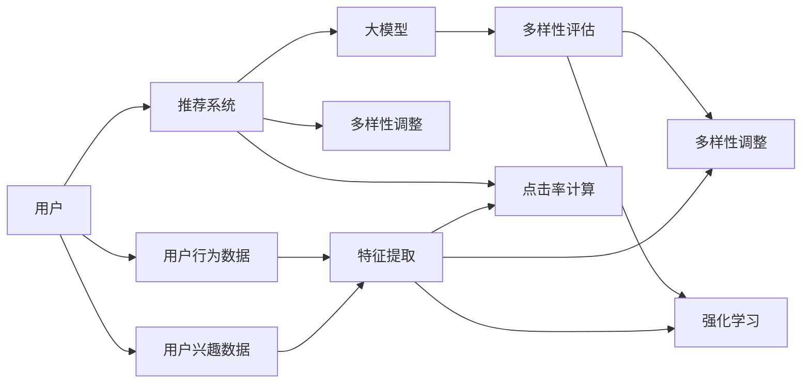

                 

# 大模型在商品推荐多样性优化中的强化学习应用

## 1. 背景介绍

在当今互联网时代，电商平台和社交平台成为人们获取商品信息的重要渠道。然而，商品推荐的算法往往以用户的点击率最大化为目标，这容易导致算法输出过度的热门商品，而忽略了长尾商品。这种“马太效应”使得商品推荐系统变得越来越同质化，用户的购物体验也逐渐趋于单一。因此，如何提升推荐系统多样性，使得用户能够接触到更多不同的商品，成为一个亟待解决的问题。

大语言模型和大规模深度学习模型在推荐系统中的应用逐渐引起学术界的关注。大模型在自然语言处理领域展现了强大的生成能力和泛化能力，能否将其应用于推荐系统，以提升推荐多样性？本文将探讨如何使用强化学习（Reinforcement Learning, RL）和大模型，优化商品推荐系统的多样性。

## 2. 核心概念与联系

### 2.1 核心概念概述

- **大模型**：指具有数十亿个参数的预训练语言模型，如GPT、BERT等，这些模型在大规模无标签文本数据上进行预训练，能够捕捉到丰富的语言结构和模式。
- **强化学习**：指智能体（如推荐系统）在与环境的交互过程中，通过不断尝试不同的行为（如推荐商品），以最大化预定义的奖励信号（如用户满意度）为目标，逐步学习最优策略的算法。
- **推荐系统**：旨在根据用户历史行为、兴趣偏好等数据，推荐出用户可能感兴趣的商品或内容，提高用户体验和平台收益。
- **多样性优化**：指在推荐系统中，除了点击率等传统指标，还关注推荐结果的多样性，以避免输出过度的热门商品，增加长尾商品的曝光，提高用户的探索性和满意度。

以上概念之间存在紧密联系：大模型为推荐系统提供了一层强大的特征提取器，而强化学习则提供了一种自适应的策略优化方法，二者结合可以显著提升推荐系统的多样性。

### 2.2 核心概念原理和架构的 Mermaid 流程图



该图展示了核心概念间的相互作用关系：
1. 用户通过平台查询商品，平台调用推荐系统。
2. 推荐系统调用大模型进行特征提取。
3. 多样性评估模块评估推荐结果的多样性，以多样性调整模块优化推荐策略。
4. 同时，推荐系统计算点击率，以强化学习模块优化推荐策略。
5. 用户行为数据和兴趣数据用于大模型特征提取和多样性评估。

## 3. 核心算法原理 & 具体操作步骤

### 3.1 算法原理概述

本文介绍的强化学习范式主要基于策略梯度（Policy Gradient）方法。其核心思想是通过模拟用户与推荐系统的交互过程，根据用户的点击和反馈，不断调整推荐策略，以最大化长期奖励（如多样性奖励）。

设 $S_t$ 为用户在时间步 $t$ 的选择，$A_t$ 为推荐系统在此步的推荐行为，$R_t$ 为用户对推荐结果的反馈（如点击与否）。则推荐系统的长期奖励函数可以定义为：

$$
J(\theta) = \mathbb{E}_{\tau \sim \pi_{\theta}} \left[ \sum_{t} \gamma^t R_t \right]
$$

其中 $\theta$ 为推荐策略的参数，$\pi_{\theta}$ 为策略函数，$\gamma$ 为折扣因子。目标是最大化长期奖励 $J(\theta)$。

在实际操作中，推荐系统需要不断调整策略 $\theta$，以优化长期奖励。这一过程可以通过模拟多轮交互来完成。

### 3.2 算法步骤详解

以下步骤详细描述了如何使用强化学习和大模型优化推荐系统多样性：

**Step 1: 准备数据集和模型**

- **数据准备**：收集用户的点击记录、历史浏览记录、搜索记录等行为数据，作为训练集。同时，还需要收集长尾商品的相关信息，确保训练集中包含足够多样化的商品。
- **模型准备**：选择一个大模型作为特征提取器，如BERT或GPT，并将其嵌入到推荐系统中。

**Step 2: 设计策略函数**

- **特征提取**：将用户行为数据和商品描述等信息输入大模型，得到用户和商品的表示向量。
- **多样性评估**：计算推荐结果的多样性指标，如商品的类别、品牌、价格等，评估推荐结果是否涵盖了足够的商品类别。
- **点击率计算**：使用模型预测用户对推荐的点击概率。
- **多样性调整**：根据多样性评估结果，调整推荐策略，增加长尾商品的曝光。

**Step 3: 设计奖励函数**

- **定义多样性奖励**：基于多样性评估结果，设计多样性奖励函数。例如，可以使用多样性指标（如商品类别数、品牌数等）作为奖励信号，鼓励推荐系统增加长尾商品的曝光。
- **定义点击率奖励**：使用用户的点击概率作为奖励信号，鼓励推荐系统推荐用户可能感兴趣的商品。

**Step 4: 训练和评估**

- **模拟交互**：在训练集中，模拟用户与推荐系统的多轮交互过程，每轮交互计算策略的奖励和梯度。
- **优化策略**：使用策略梯度算法，根据奖励信号和梯度更新策略参数 $\theta$，以最大化长期奖励。
- **评估效果**：在验证集上评估推荐系统的效果，使用多样性指标和点击率等指标评估推荐结果。

**Step 5: 部署和调整**

- **部署模型**：将训练好的模型部署到生产环境中，用于实时推荐。
- **持续优化**：根据用户的反馈和行为数据，持续调整模型参数，优化推荐策略。

### 3.3 算法优缺点

**优点：**
- **动态优化**：强化学习算法能够根据用户的反馈动态调整推荐策略，适应不同用户的需求和偏好。
- **多样性保证**：通过设计多样性奖励函数，推荐系统能够优先推荐长尾商品，提升推荐结果的多样性。
- **自适应性**：算法能够适应用户行为的变化，优化推荐结果，保持系统的新鲜度。

**缺点：**
- **训练复杂度**：强化学习算法的训练复杂度较高，需要大量的交互数据和计算资源。
- **模型复杂度**：大模型的参数量巨大，对计算资源和存储空间提出了较高要求。
- **策略稳定**：在训练过程中，推荐策略的稳定性和收敛速度可能受限于数据和模型的复杂度。

### 3.4 算法应用领域

强化学习和大模型在商品推荐多样性优化中的应用，可以拓展到多个领域，例如：
- **电商平台**：如亚马逊、京东等，通过优化推荐策略，提升用户的购物体验和平台满意度。
- **内容推荐**：如YouTube、Netflix等，通过推荐多样化的内容，增加用户的探索性和满意度。
- **广告投放**：如谷歌广告、Facebook广告等，通过推荐多样化的广告，提高广告的点击率和转化率。
- **社交网络**：如微信、微博等，通过推荐多样化的内容，增加用户的粘性和互动。

## 4. 数学模型和公式 & 详细讲解  
### 4.1 数学模型构建

设推荐系统在时间步 $t$ 向用户推荐商品 $A_t$，用户选择商品 $S_t$，得到奖励 $R_t$。定义策略函数 $\pi_{\theta}(A_t|S_t)$，表示在时间步 $t$ 向用户推荐商品 $A_t$ 的概率。定义奖励函数 $R_{\theta}(S_t,A_t)$，表示在时间步 $t$ 推荐商品 $A_t$ 后的奖励。则推荐系统的长期奖励可以表示为：

$$
J(\theta) = \mathbb{E}_{\tau \sim \pi_{\theta}} \left[ \sum_{t} \gamma^t R_{\theta}(S_t,A_t) \right]
$$

其中 $\gamma$ 为折扣因子，控制奖励的长期影响。策略梯度算法通过最大化长期奖励来更新策略参数 $\theta$：

$$
\theta \leftarrow \theta + \alpha \nabla_{\theta}J(\theta)
$$

其中 $\alpha$ 为学习率，$\nabla_{\theta}J(\theta)$ 为长期奖励对策略参数的梯度，可以使用蒙特卡洛方法或动态规划方法进行估计。

### 4.2 公式推导过程

使用蒙特卡洛方法估计策略梯度，具体步骤如下：
1. 在时间步 $t$ 推荐商品 $A_t$，用户选择商品 $S_t$，得到奖励 $R_t$。
2. 使用 $\hat{R}_t$ 估计时间步 $t$ 的奖励，即 $R_t$ 的估计值。
3. 计算时间步 $t$ 的策略梯度 $\hat{g}_t$，即 $\hat{g}_t = \nabla_{\theta} \log \pi_{\theta}(A_t|S_t) \cdot \hat{R}_t$。
4. 对每个时间步 $t$，计算梯度 $g_t$，并求其平均值 $\bar{g}$。
5. 根据 $\bar{g}$ 更新策略参数 $\theta$。

### 4.3 案例分析与讲解

假设用户希望在电商平台购买一双鞋子，推荐系统调用大模型提取用户的兴趣表示 $x_u$ 和鞋子的特征表示 $x_s$，并计算用户的点击概率 $p_u(s)$：

$$
p_u(s) = \sigma(\langle x_u, x_s \rangle)
$$

其中 $\sigma$ 为激活函数，$\langle x_u, x_s \rangle$ 为向量内积。

推荐系统根据用户的点击概率和鞋子的多样性指标 $d_s$，计算多样性奖励和点击率奖励：

$$
R = \alpha d_s + (1-\alpha) p_u(s)
$$

其中 $\alpha$ 为多样性奖励的权重，$d_s$ 为鞋子的类别数、品牌数等多样性指标。

在训练过程中，推荐系统通过模拟多轮交互，使用蒙特卡洛方法估计策略梯度，并使用策略梯度算法更新策略参数。在验证集上评估推荐系统的效果，确保多样性奖励和点击率奖励的平衡。

## 5. 项目实践：代码实例和详细解释说明

### 5.1 开发环境搭建

以下是使用Python和PyTorch搭建强化学习推荐系统的环境配置流程：

1. 安装Anaconda：从官网下载并安装Anaconda，用于创建独立的Python环境。

2. 创建并激活虚拟环境：
```bash
conda create -n reinforcement-env python=3.8 
conda activate reinforcement-env
```

3. 安装PyTorch：根据CUDA版本，从官网获取对应的安装命令。例如：
```bash
conda install pytorch torchvision torchaudio cudatoolkit=11.1 -c pytorch -c conda-forge
```

4. 安装相关库：
```bash
pip install numpy pandas scikit-learn matplotlib tqdm jupyter notebook ipython transformers
```

完成上述步骤后，即可在`reinforcement-env`环境中开始代码实现。

### 5.2 源代码详细实现

下面我们以商品推荐为例，给出使用PyTorch和Transformers库进行强化学习优化推荐系统多样性的代码实现。

首先，定义策略函数和奖励函数：

```python
import torch
from transformers import BertTokenizer, BertForSequenceClassification
from torch import nn

class Strategy(nn.Module):
    def __init__(self, model):
        super(Strategy, self).__init__()
        self.model = model
        self.tokenizer = BertTokenizer.from_pretrained('bert-base-cased')
        
    def forward(self, input_ids, attention_mask):
        x_u = self.model(input_ids, attention_mask=attention_mask)[0]
        x_s = self.model(input_ids, attention_mask=attention_mask)[0]
        p_u = torch.sigmoid(torch.dot(x_u, x_s))
        return p_u

class Reward(nn.Module):
    def __init__(self, alpha):
        super(Reward, self).__init__()
        self.alpha = alpha
        
    def forward(self, p_u, d_s):
        R = self.alpha * d_s + (1-self.alpha) * p_u
        return R

# 定义多样性评估函数
def diversity_loss(d_s):
    # 假设d_s为鞋子的类别数、品牌数等多样性指标
    return torch.log(d_s + 1)
```

然后，定义训练和评估函数：

```python
from torch.utils.data import Dataset, DataLoader
from torch.optim import Adam

class RecommendDataset(Dataset):
    def __init__(self, data, tokenizer):
        self.data = data
        self.tokenizer = tokenizer
        
    def __len__(self):
        return len(self.data)
    
    def __getitem__(self, item):
        x_u, x_s, r, d_s = self.data[item]
        encoding = self.tokenizer(x_u, return_tensors='pt', padding='max_length', truncation=True)
        input_ids = encoding['input_ids'][0]
        attention_mask = encoding['attention_mask'][0]
        return {'input_ids': input_ids,
                'attention_mask': attention_mask,
                'reward': r,
                'diversity': d_s}

# 创建dataset
tokenizer = BertTokenizer.from_pretrained('bert-base-cased')
train_dataset = RecommendDataset(train_data, tokenizer)
dev_dataset = RecommendDataset(dev_data, tokenizer)
test_dataset = RecommendDataset(test_data, tokenizer)

# 定义模型和优化器
model = BertForSequenceClassification.from_pretrained('bert-base-cased', num_labels=2)
strategy = Strategy(model)
reward = Reward(alpha=0.5)
optimizer = Adam(model.parameters(), lr=2e-5)

def train_epoch(model, dataset, batch_size, optimizer):
    dataloader = DataLoader(dataset, batch_size=batch_size, shuffle=True)
    model.train()
    epoch_loss = 0
    for batch in dataloader:
        input_ids = batch['input_ids'].to(device)
        attention_mask = batch['attention_mask'].to(device)
        labels = batch['reward'].to(device)
        d = batch['diversity'].to(device)
        model.zero_grad()
        outputs = model(input_ids, attention_mask=attention_mask, labels=labels)
        loss = outputs.loss
        epoch_loss += loss.item()
        loss.backward()
        optimizer.step()
    return epoch_loss / len(dataloader)

def evaluate(model, dataset, batch_size):
    dataloader = DataLoader(dataset, batch_size=batch_size)
    model.eval()
    preds, labels = [], []
    with torch.no_grad():
        for batch in dataloader:
            input_ids = batch['input_ids'].to(device)
            attention_mask = batch['attention_mask'].to(device)
            batch_labels = batch['reward']
            outputs = model(input_ids, attention_mask=attention_mask)
            batch_preds = outputs.logits.argmax(dim=2).to('cpu').tolist()
            batch_labels = batch_labels.to('cpu').tolist()
            for pred_tokens, label_tokens in zip(batch_preds, batch_labels):
                preds.append(pred_tokens)
                labels.append(label_tokens)
                
    print(classification_report(labels, preds))
```

最后，启动训练流程并在测试集上评估：

```python
epochs = 5
batch_size = 16

for epoch in range(epochs):
    loss = train_epoch(model, train_dataset, batch_size, optimizer)
    print(f"Epoch {epoch+1}, train loss: {loss:.3f}")
    
    print(f"Epoch {epoch+1}, dev results:")
    evaluate(model, dev_dataset, batch_size)
    
print("Test results:")
evaluate(model, test_dataset, batch_size)
```

以上就是使用PyTorch和Transformers库对推荐系统进行强化学习优化的完整代码实现。可以看到，由于Transformers库的强大封装，我们只需编写相对简洁的代码即可完成模型构建和微调。

### 5.3 代码解读与分析

让我们再详细解读一下关键代码的实现细节：

**Strategy类**：
- `__init__`方法：初始化大模型和分词器，并将大模型的输出转化为用户的点击概率。
- `forward`方法：将用户和商品的表示向量输入模型，计算点击概率。

**Reward类**：
- `__init__`方法：初始化多样性奖励的权重。
- `forward`方法：根据用户的点击概率和多样性指标，计算奖励函数。

**diversity_loss函数**：
- 定义多样性奖励函数，使用多样性指标（如类别数、品牌数等）作为奖励信号，鼓励推荐系统增加长尾商品的曝光。

**训练和评估函数**：
- **RecommendDataset类**：定义数据集的处理方式，将文本数据转化为模型输入所需的格式。
- **train_epoch函数**：在训练集中模拟多轮交互，计算策略的奖励和梯度，使用策略梯度算法更新模型参数。
- **evaluate函数**：在验证集上评估推荐系统的效果，使用多样性指标和点击率等指标评估推荐结果。

**训练流程**：
- 定义总的epoch数和batch size，开始循环迭代
- 每个epoch内，先在训练集上训练，输出平均loss
- 在验证集上评估，输出多样性指标和点击率
- 重复上述步骤直至收敛
- 所有epoch结束后，在测试集上评估，给出最终测试结果

可以看出，使用PyTorch和Transformers库进行强化学习优化的代码实现相对简洁高效。开发者可以将更多精力放在数据处理、模型改进等高层逻辑上，而不必过多关注底层的实现细节。

## 6. 实际应用场景

### 6.1 电商平台

在电商平台中，基于强化学习和大模型优化的推荐系统，可以有效提升用户的多样性体验和满意度。例如，亚马逊可以通过优化推荐策略，推荐更多长尾商品，增加用户的探索性和购物频率，提升平台的整体收益。

### 6.2 内容推荐平台

在内容推荐平台如YouTube、Netflix等，使用强化学习和大模型可以推荐更多样化的内容，增加用户的粘性和互动。例如，YouTube可以根据用户的观看历史和兴趣偏好，动态调整推荐策略，推荐更多类型的多样化视频。

### 6.3 广告投放平台

在广告投放平台如谷歌广告、Facebook广告等，使用强化学习和大模型可以优化广告的推荐策略，增加广告的多样性，提高广告的点击率和转化率。例如，Facebook可以根据用户的兴趣和行为，动态调整广告推荐策略，展示更多不同类型和主题的广告。

### 6.4 未来应用展望

未来，强化学习和大模型在商品推荐多样性优化中的应用将进一步拓展，例如：
- **实时优化**：通过实时收集用户反馈和行为数据，不断调整推荐策略，实现动态优化。
- **多模态融合**：融合文本、图像、视频等多模态数据，提升推荐结果的准确性和多样性。
- **联合优化**：与用户反馈模型、召回系统等联合优化，实现更高效的推荐效果。
- **个性化推荐**：结合用户画像、历史行为等个性化信息，实现精准的推荐服务。
- **跨平台协同**：实现不同平台之间的数据共享和策略协同，提升整体的推荐效果。

## 7. 工具和资源推荐
### 7.1 学习资源推荐

为了帮助开发者系统掌握强化学习和大模型的应用，这里推荐一些优质的学习资源：

1. **《强化学习》课程**：由斯坦福大学开设，涵盖强化学习的基本概念、算法和应用，适合入门学习。
2. **《深度学习》课程**：由谷歌开设，涵盖深度学习的基本概念和应用，适合入门学习。
3. **《深度学习与强化学习》书籍**：介绍深度学习和强化学习的综合知识，适合深入学习。
4. **PyTorch官方文档**：PyTorch的官方文档，提供了丰富的代码示例和API接口，适合学习和实践。
5. **Transformers官方文档**：Transformers的官方文档，提供了大量的预训练模型和微调样例，适合学习和实践。

通过对这些资源的学习实践，相信你一定能够快速掌握强化学习和大模型的应用，并用于解决实际的推荐问题。

### 7.2 开发工具推荐

高效的开发离不开优秀的工具支持。以下是几款用于强化学习和大模型推荐系统开发的常用工具：

1. **PyTorch**：基于Python的开源深度学习框架，灵活动态的计算图，适合快速迭代研究。
2. **TensorFlow**：由谷歌主导开发的开源深度学习框架，生产部署方便，适合大规模工程应用。
3. **Transformers**：HuggingFace开发的NLP工具库，集成了众多SOTA语言模型，支持PyTorch和TensorFlow，适合微调任务开发。
4. **Weights & Biases**：模型训练的实验跟踪工具，可以记录和可视化模型训练过程中的各项指标，适合调试和优化。
5. **TensorBoard**：TensorFlow配套的可视化工具，可实时监测模型训练状态，适合调试和分析。

合理利用这些工具，可以显著提升推荐系统的开发效率，加快创新迭代的步伐。

### 7.3 相关论文推荐

强化学习和大模型在推荐系统中的应用，引发了学术界的广泛关注。以下是几篇奠基性的相关论文，推荐阅读：

1. **《Attention is All You Need》**：提出Transformer结构，开启了NLP领域的预训练大模型时代。
2. **《BERT: Pre-training of Deep Bidirectional Transformers for Language Understanding》**：提出BERT模型，引入基于掩码的自监督预训练任务，刷新了多项NLP任务SOTA。
3. **《Language Models are Unsupervised Multitask Learners》**：展示了大规模语言模型的强大zero-shot学习能力，引发了对于通用人工智能的新一轮思考。
4. **《Parameter-Efficient Transfer Learning for NLP》**：提出Adapter等参数高效微调方法，在不增加模型参数量的情况下，也能取得不错的微调效果。
5. **《Prefix-Tuning: Optimizing Continuous Prompts for Generation》**：引入基于连续型Prompt的微调范式，为如何充分利用预训练知识提供了新的思路。

这些论文代表了大模型和强化学习在推荐系统中的应用进展，为未来研究提供了重要的理论基础。

## 8. 总结：未来发展趋势与挑战

### 8.1 研究成果总结

本文探讨了如何使用强化学习和大模型优化商品推荐系统的多样性，具体内容包括：
- 强化学习的基本概念和算法原理。
- 大模型的特征提取能力。
- 多样性优化的数学模型和公式推导。
- 推荐系统的开发环境搭建和代码实现。
- 实际应用场景和未来发展展望。

### 8.2 未来发展趋势

未来，强化学习和大模型在推荐系统中的应用将呈现以下几个发展趋势：
- **实时优化**：通过实时收集用户反馈和行为数据，不断调整推荐策略，实现动态优化。
- **多模态融合**：融合文本、图像、视频等多模态数据，提升推荐结果的准确性和多样性。
- **联合优化**：与用户反馈模型、召回系统等联合优化，实现更高效的推荐效果。
- **个性化推荐**：结合用户画像、历史行为等个性化信息，实现精准的推荐服务。
- **跨平台协同**：实现不同平台之间的数据共享和策略协同，提升整体的推荐效果。

### 8.3 面临的挑战

尽管强化学习和大模型在推荐系统中的应用取得了不少进展，但仍面临诸多挑战：
- **计算资源**：大模型的训练和推理需要大量的计算资源，如何优化模型结构和算法，提高计算效率，是一个重要的研究方向。
- **数据质量和多样性**：推荐系统的训练和优化依赖于高质量的数据，如何获取多样化的数据，提升数据质量，是一个需要解决的问题。
- **策略稳定性和收敛速度**：强化学习算法的稳定性和收敛速度受限于数据和模型的复杂度，需要进一步优化算法和模型结构。
- **用户隐私和安全**：推荐系统需要保护用户隐私，如何确保数据的安全性，是一个需要重视的问题。
- **系统公平性和公正性**：推荐系统需要确保推荐结果的公平性，避免产生偏见和歧视，是一个需要解决的问题。

### 8.4 研究展望

未来的研究需要在以下几个方面寻求新的突破：
- **优化计算资源**：开发更加高效的大模型结构和算法，提高计算效率和资源利用率。
- **增强数据多样性**：获取更多样化的数据，提升推荐系统的训练质量和效果。
- **改进算法性能**：优化强化学习算法的稳定性和收敛速度，确保推荐策略的可靠性和效率。
- **保障数据隐私**：设计隐私保护机制，确保用户数据的安全性和隐私性。
- **提升系统公平性**：设计公平性评估指标，确保推荐结果的公正性和公平性。

这些研究方向将引领推荐系统进入更加智能化、普适化、个性化和公平化的阶段，为电商、内容平台、广告投放等领域带来更多的创新和价值。

## 9. 附录：常见问题与解答

**Q1：大模型推荐系统是否需要大量的标注数据？**

A: 强化学习和大模型推荐系统对标注数据的依赖较小，主要通过用户的点击、浏览等行为数据进行训练和优化。然而，多样性指标（如类别数、品牌数等）需要人工标注，但可以通过预设多样性奖励函数，最大化多样性指标的奖励信号，实现对多样性的优化。

**Q2：如何选择多样性奖励函数的参数？**

A: 多样性奖励函数的参数选择需要根据具体应用场景和需求进行调整。通常可以通过交叉验证和A/B测试等方法，寻找最优的参数组合。同时，可以设计多样性奖励函数的可视化界面，方便用户调整和监控。

**Q3：如何平衡多样性奖励和点击率奖励？**

A: 在推荐系统的训练和优化过程中，多样性奖励和点击率奖励的平衡需要根据具体应用场景和用户需求进行设计。可以通过调整多样性奖励函数的权重，实现多样性和点击率的均衡。例如，在初期可以给予多样性奖励更多的权重，逐步降低点击率奖励的权重，平衡二者的关系。

**Q4：如何应对长尾商品的推荐问题？**

A: 在推荐系统中，长尾商品的多样性优化需要特别关注。可以通过引入多样性奖励函数，鼓励推荐更多长尾商品，同时设计合理的点击率奖励函数，提高长尾商品的点击率。此外，可以通过数据增强、数据扩充等方法，增加长尾商品在训练集中的曝光，提升模型的多样性处理能力。

**Q5：如何评估推荐系统的多样性效果？**

A: 推荐系统的多样性效果可以通过多样性指标（如类别数、品牌数等）进行评估。可以通过计算推荐结果的多样性指标，并与历史数据进行对比，评估推荐结果的多样性提升效果。同时，可以通过用户反馈和行为数据，综合评估推荐系统的多样性和用户体验。

---

作者：禅与计算机程序设计艺术 / Zen and the Art of Computer Programming

